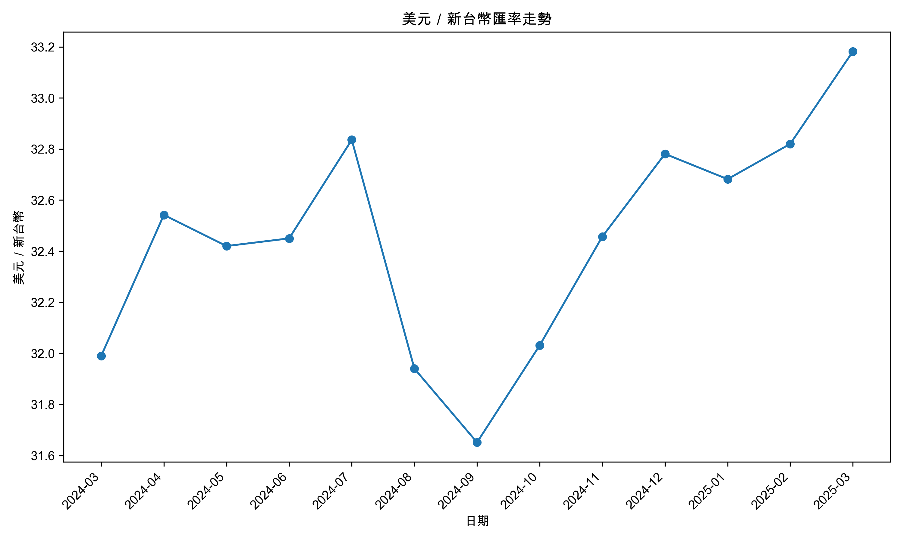
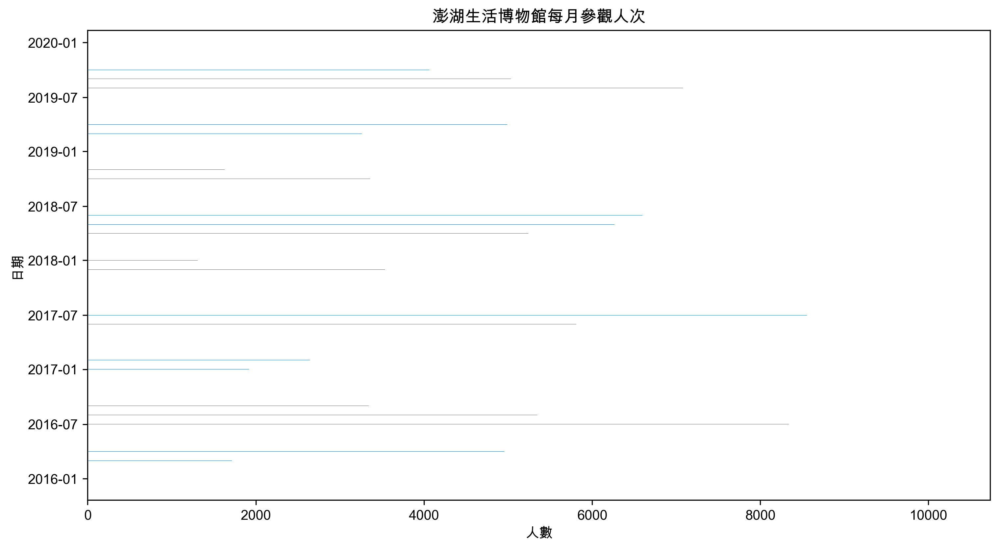
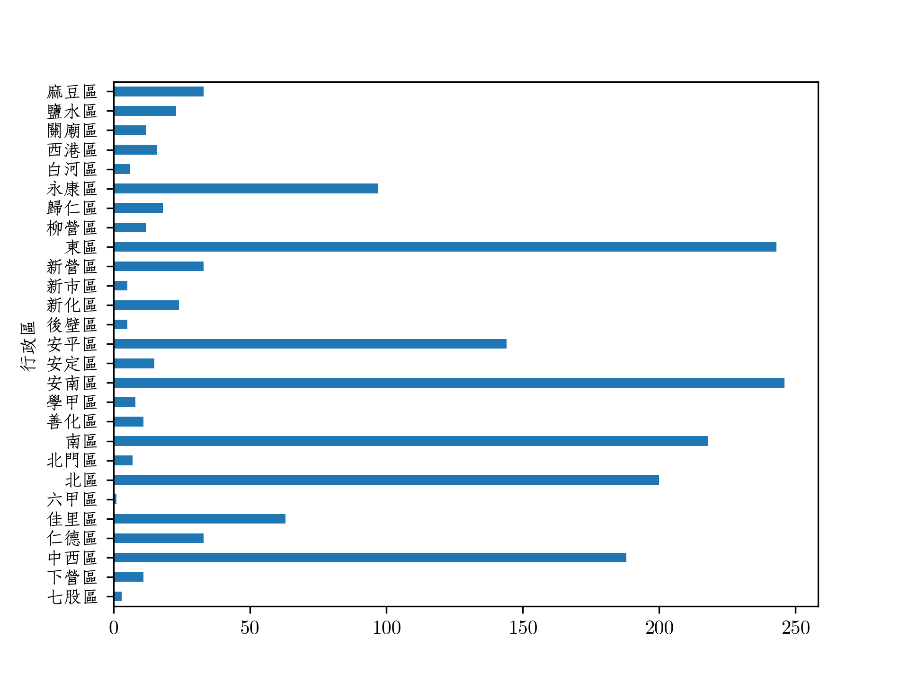
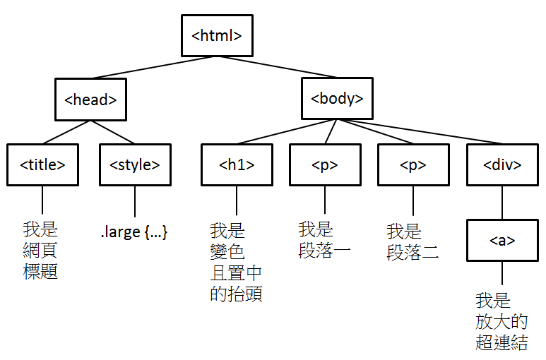
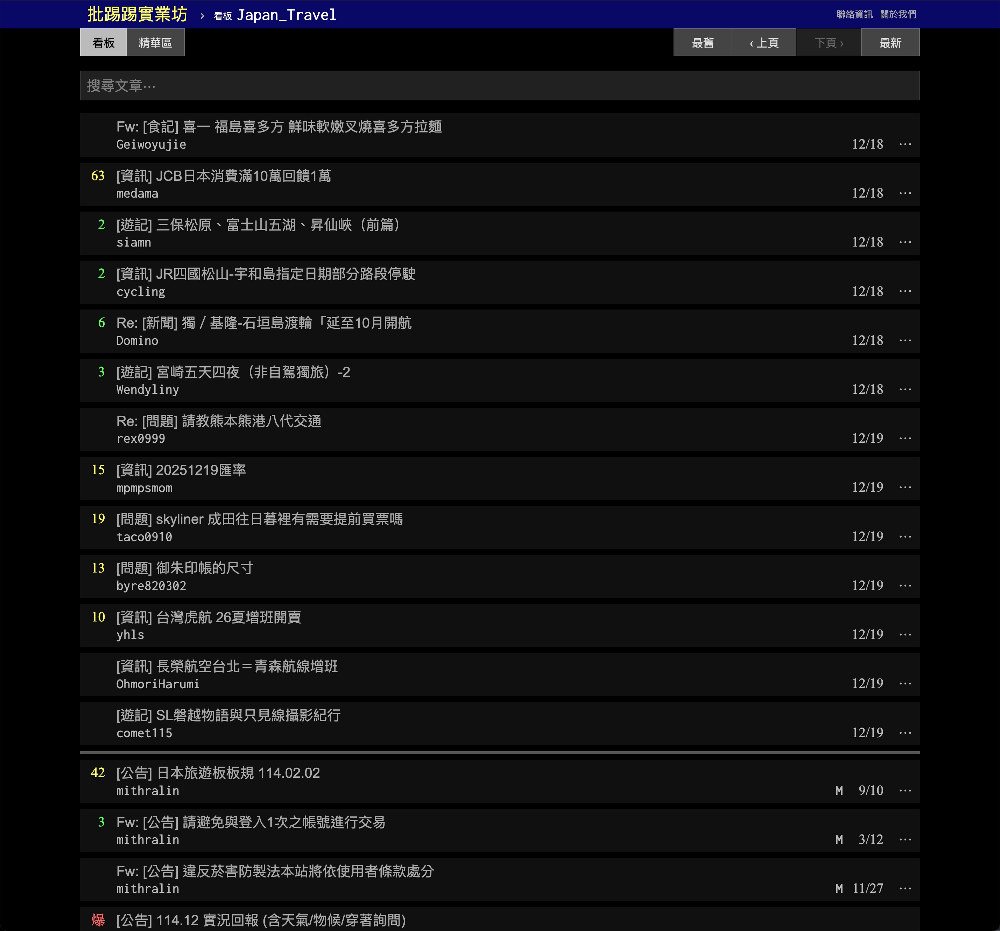
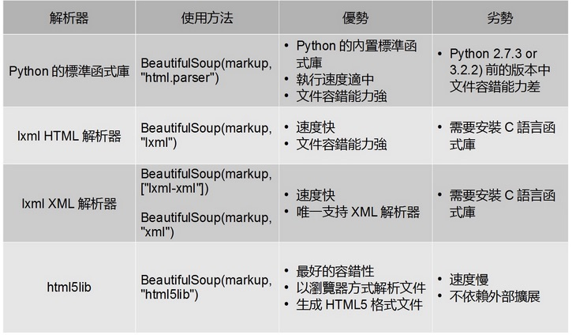

#+title: Crawler: 網路資料解析與爬蟲
#+SUBTITLE: TNFSH Python教材
# -*- org-export-babel-evaluate: nil -*-

#+TAGS: Python, Advanced
#+INCLUDE: ../pdf.org
#+OPTIONS: toc:2 ^:nil num:5
#+OPTIONS: H:4
#+PROPERTY: header-args :eval never-export
#+HTML_HEAD: <link rel="stylesheet" type="text/css" href="../css/muse.css" />
#+HTML_HEAD_EXTRA: 
#+EXCLUDE_TAGS: noexport
#+begin_export html

#+end_export
* 為此 org 啟用 venv :noexport:
#+begin_src shell -r -n :results output :exports both
set -e
echo "PWD=$(pwd)"
python3 -V
python3 -c "import sys; print('sys.executable=', sys.executable)"

rm -rf ./venv
python3 -m venv ./venv
python3 -m pip install requests
echo "=== venv/bin listing ==="
ls -la ./venv/bin || true
echo "=== python candidates ==="
ls -la ./venv/bin/py* || true
echo "=== file type (if exists) ==="
file ./venv/bin/python ./venv/bin/python3 2>/dev/null || true
#+end_src

#+RESULTS:
#+begin_example
PWD=/Users/letranger/Dropbox/notes/PythonCourse
Python 3.14.0
sys.executable= /Users/letranger/Dropbox/notes/PythonCourse/venv/bin/python3
Collecting requests
  Using cached requests-2.32.5-py3-none-any.whl.metadata (4.9 kB)
Collecting charset_normalizer<4,>=2 (from requests)
  Using cached charset_normalizer-3.4.4-cp314-cp314-macosx_10_13_universal2.whl.metadata (37 kB)
Collecting idna<4,>=2.5 (from requests)
  Using cached idna-3.11-py3-none-any.whl.metadata (8.4 kB)
Collecting urllib3<3,>=1.21.1 (from requests)
  Using cached urllib3-2.6.2-py3-none-any.whl.metadata (6.6 kB)
Collecting certifi>=2017.4.17 (from requests)
  Using cached certifi-2025.11.12-py3-none-any.whl.metadata (2.5 kB)
Using cached requests-2.32.5-py3-none-any.whl (64 kB)
Using cached charset_normalizer-3.4.4-cp314-cp314-macosx_10_13_universal2.whl (207 kB)
Using cached idna-3.11-py3-none-any.whl (71 kB)
Using cached urllib3-2.6.2-py3-none-any.whl (131 kB)
Using cached certifi-2025.11.12-py3-none-any.whl (159 kB)
Installing collected packages: urllib3, idna, charset_normalizer, certifi, requests

Successfully installed certifi-2025.11.12 charset_normalizer-3.4.4 idna-3.11 requests-2.32.5 urllib3-2.6.2
=== venv/bin listing ===
total 80
drwxr-xr-x@ 14 letranger  staff   448 12 19 13:07 .
drwxr-xr-x@  7 letranger  staff   224 12 19 13:07 ..
-rw-r--r--@  1 letranger  staff  2206 12 19 13:07 activate
-rw-r--r--@  1 letranger  staff   937 12 19 13:07 activate.csh
-rw-r--r--@  1 letranger  staff  2208 12 19 13:07 activate.fish
-rw-r--r--@  1 letranger  staff  9031 10  7 17:34 Activate.ps1
-rwxr-xr-x   1 letranger  staff   250 12 19 13:07 normalizer
-rwxr-xr-x@  1 letranger  staff   241 12 19 13:07 pip
-rwxr-xr-x@  1 letranger  staff   241 12 19 13:07 pip3
-rwxr-xr-x@  1 letranger  staff   241 12 19 13:07 pip3.14
lrwxr-xr-x@  1 letranger  staff    10 12 19 13:07 python -> python3.14
lrwxr-xr-x@  1 letranger  staff    10 12 19 13:07 python3 -> python3.14
lrwxr-xr-x@  1 letranger  staff    44 12 19 13:07 python3.14 -> /opt/homebrew/opt/python@3.14/bin/python3.14
lrwxr-xr-x@  1 letranger  staff    10 12 19 13:07 𝜋thon -> python3.14
=== python candidates ===
lrwxr-xr-x@ 1 letranger  staff  10 12 19 13:07 ./venv/bin/python -> python3.14
lrwxr-xr-x@ 1 letranger  staff  10 12 19 13:07 ./venv/bin/python3 -> python3.14
lrwxr-xr-x@ 1 letranger  staff  44 12 19 13:07 ./venv/bin/python3.14 -> /opt/homebrew/opt/python@3.14/bin/python3.14
=== file type (if exists) ===
./venv/bin/python:  Mach-O 64-bit executable arm64
./venv/bin/python3: Mach-O 64-bit executable arm64
#+end_example

#+BEGIN_SRC emacs-lisp :exports no
(pyvenv-activate "./venv")
(setq org-babel-python-command "./venv/bin/python3")
#+END_SRC

#+RESULTS:
: ./venv/bin/python3

#+begin_src shell :session crawler :async :results output :exports both
cd /Users/letranger/Dropbox/notes/PythonCourse
. ./venv/bin/activate
echo $VIRTUAL_ENV
which python
python -V
pip3 install matplotlib pandas beautifulsoup4
#+end_src

* JSON
** 網路資料分析的兩種類型
- 可直接下載的靜態結構化資料，如 CSV、JSON、XML
- 直接分析網站的線上內容(HTML): 爬蟲(Web Crawler)

** JSON
*** JSON 是什麼？
- JSON(JavaScript Object Notation，JavaScript 物件表示法)是個以純文字來描述資料的簡單結構，在 JSON 中可以透過特定的格式去儲存任何資料(字串,數字,陣列,物件)，也可以透過物件或陣列來傳送較複雜的資料。[fn:1]
- JSON 常用於網站上的資料呈現、傳輸 (例如將資料從伺服器送至用戶端，以利顯示網頁)。
- 一旦建立了 JSON 資料，就可以非常簡單的跟其他程式溝通或交換資料，因為 JSON 就只是純文字格式。
*** JSON 的優點
- 相容性高
- 格式容易瞭解，閱讀及修改方便
- 支援許多資料格式 (number,string,booleans,nulls,array,associative array)
- 許多程式都支援函式庫讀取或修改 JSON 資料
- NoSQL Database
*** JSON 結構
- 物件: {}
- 陣列: []
*** JSON 支援的資料格式
- 字串 (string)，要以雙引號括起來:
  + {"name": "Mike"}
- 數值 (number)
  + {"age": 25}
- 布林值 (boolean)
  + {"pass": true}
- 空值 (null)
  + {"middlename": null}
- 物件 (object)
- 陣列 (array)
*** JSON 物件
- 格式
- key 只能是字串，也一定要加上雙引號
#+begin_src python -r -n :results output :exports both
{
    "key1": value1,
    "key2": value2,
    ......
    "keyN": valueN
}
#+end_src
- 範例 1
#+begin_src python -r -n :results output :exports both
{
    "id": 1,
    "name": "James, Yen",
    "age": 19,
    "gender": "M",
    "hobby": ["music", "programming"]
}
#+end_src
- 範例 2
#+begin_src python -r -n :results output :exports both
{
    "id": 382192,
    "name": "James, Yen",
    "age": 19,
    "gender": "M",
    "exams": [
        { "title": "期中考",
          "chinese": 85,
          "math": 98,
          "english": 92
        },
        { "title": "期末考",
          "chinese": 81,
          "math": 92,
          "english": 97
        }
    ],
    "hobby": ["music", "programming"]
}
#+end_src
*** JSON 轉 PANDAS dataFrame
#+begin_src python -r -n :results output :exports both :eval no
import pandas as pd

df = pd.json_normalize( list of dict )
print(df.head(3))
#+end_src

** JSON 實作範例
*** 實作 1: [[https://data.gov.tw/dataset/31897][國際主要國家貨幣每月匯率概況]]
**** 下載 JSON
#+BEGIN_SRC python -r -n :session crawler :async :results output :exports both
# -*- coding: utf-8 -*-
import requests

json_url = 'http://quality.data.gov.tw/dq_download_json.php?nid=31897&md5_url=bf1f3b3e4a09f5c75ec9af665afbf7b3'
response = requests.get(json_url)
print(response)
jsonRes = response.json()
print(type(jsonRes))

import json
print(jsonRes[:1])
print(json.dumps(jsonRes[:2], indent = 4, ensure_ascii=False))
#+END_SRC

上面這段程式碼用到了幾個重要的東西，我們先來認識一下：
***** requests.get() 常用參數
=requests.get()= 是用來發送 HTTP GET 請求的函式，完整寫法長這樣：
#+begin_src python -r -n :eval no
requests.get(url, params=None, headers=None, timeout=None, verify=True)
#+end_src
| 參數      | 說明                                                           |
|-----------+----------------------------------------------------------------|
| =params=  | 查詢字串參數（dict），會自動附加到 URL                         |
| =headers= | 自訂 HTTP 標頭（dict），常用來設定 User-Agent                  |
| =timeout= | 等待回應的秒數，避免程式卡住                                   |
| =verify=  | SSL 憑證驗證，設為 =False= 可跳過驗證（不建議，但有時不得已QQ）|
***** response 物件常用屬性
=requests.get()= 回傳的是一個 =Response= 物件，常用的屬性如下：
| 屬性 / 方法           | 說明                                                                   |
|-----------------------+------------------------------------------------------------------------|
| =response.status_code= | HTTP 狀態碼（200 表示成功）                                           |
| =response.text=        | 回應內容（字串）                                                      |
| =response.json()=      | 將 JSON 回應解析為 dict/list（等同 =json.loads(response.text)= ）      |
| =response.encoding=    | 回應的編碼                                                            |

實務上，發送請求後建議加上狀態碼檢查，確保請求成功：
#+begin_src python -r -n :eval no
r = requests.get(url, timeout=10)
r.raise_for_status()  # 如果狀態碼不是 2xx，會拋出 HTTPError
#+end_src
***** json.dumps() 常用參數
=json.dumps()= 可以把 Python 物件轉成 JSON 格式的字串，完整寫法：
#+begin_src python -r -n :eval no
json.dumps(obj, indent=None, ensure_ascii=True, sort_keys=False)
#+end_src
| 參數             | 說明                                       |
|------------------+--------------------------------------------|
| =indent=         | 縮排空格數，讓輸出更易讀                   |
| =ensure_ascii=   | 設為 =False= 才能輸出中文（不然會變 =\uXXXX=） |
| =sort_keys=      | 設為 =True= 會按 key 排序                  |

如果你以上述程式碼執行，結果看到如下的錯誤訊息（請略過不重要的中間部分）留意「CERTIFICATE_VERIFY_FAILED」，表示你的 Python 環境無法驗證該網站的 SSL 憑證....QQ
#+begin_src
Traceback (most recent call last):
   ...... 中間省略......
increment
    raise MaxRetryError(_pool, url, reason) from reason  # type: ignore[arg-type]
    ^^^^^^^^^^^^^^^^^^^^^^^^^^^^^^^^^^^^^^^^^^^^^^^^^^^
urllib3.exceptions.MaxRetryError: HTTPSConnectionPool(host='quality.data.gov.tw', port=443): Max retries exceeded with url: /dq_download_json.php?nid=31897&md5_url=bf1f3b3e4a09f5c75ec9af665afbf7b3 (Caused by SSLError(SSLCertVerificationError(1, '[SSL: CERTIFICATE_VERIFY_FAILED] certificate verify failed: Missing Subject Key Identifier (_ssl.c:1032)')))

During handling of the above exception, another exception occurred:

Traceback (most recent call last):
  File "<stdin>", line 5, in <module>
   ...... 中間省略......
    raise SSLError(e, request=request)
requests.exceptions.SSLError: HTTPSConnectionPool(host='quality.data.gov.tw', port=443): Max retries exceeded with url: /dq_download_json.php?nid=31897&md5_url=bf1f3b3e4a09f5c75ec9af665afbf7b3 (Caused by SSLError(SSLCertVerificationError(1, '[SSL: CERTIFICATE_VERIFY_FAILED] certificate verify failed: Missing Subject Key Identifier (_ssl.c:1032)')))
[ Babel evaluation exited with code 1 ]
#+end_src

解決方法（注意：=verify=False= 只是暫時方案，正式環境中應該修復憑證問題而非跳過驗證）:
#+begin_src python -r -n :session crawler :async :results output :exports both
import requests
import urllib3
urllib3.disable_warnings(urllib3.exceptions.InsecureRequestWarning)
## 暫時關閉 SSL 驗證（僅供練習使用，不建議用於正式環境）
json_url = "https://quality.data.gov.tw/dq_download_json.php?nid=31897&md5_url=bf1f3b3e4a09f5c75ec9af665afbf7b3"

r = requests.get(json_url, verify=False, timeout=30)
print(r.status_code)

jsonRes = r.json()
print(type(jsonRes))
print(jsonRes[:1]) #顯示第一筆資料

import json
print(json.dumps(jsonRes[:2], indent=4, ensure_ascii=False)) #顯示前兩筆資料

#+end_src

#+RESULTS:
#+begin_example
200
<class 'list'>
[{'月別': '2024-03', '新台幣（匯率）': '31.990', '人民幣（匯率）': '7.2232', '日圓（匯率）': '151.34', '韓元（匯率）': '1347.2', '新加坡元（匯率）': '1.3494', '歐元（匯率）': '1.0769', '英鎊（匯率）': '1.2619', '澳幣（匯率）': '0.6509'}]
[
    {
        "月別": "2024-03",
        "新台幣（匯率）": "31.990",
        "人民幣（匯率）": "7.2232",
        "日圓（匯率）": "151.34",
        "韓元（匯率）": "1347.2",
        "新加坡元（匯率）": "1.3494",
        "歐元（匯率）": "1.0769",
        "英鎊（匯率）": "1.2619",
        "澳幣（匯率）": "0.6509"
    },
    {
        "月別": "2024-04",
        "新台幣（匯率）": "32.542",
        "人民幣（匯率）": "7.2416",
        "日圓（匯率）": "156.86",
        "韓元（匯率）": "1382.0",
        "新加坡元（匯率）": "1.3614",
        "歐元（匯率）": "1.0705",
        "英鎊（匯率）": "1.2542",
        "澳幣（匯率）": "0.6528"
    }
]
#+end_example
由以上輸出可知，這是一個包含多筆資料的 JSON 陣列，而每筆資料都是一個包含多個鍵值對的 JSON 物件。每個物件代表某個月份的匯率資訊，包括新台幣、人民幣、日圓、韓元、新加坡元、歐元、英鎊和澳幣的匯率。

那，我們來看看如何從這些資料中提取出我們需要的資訊，例如「日期」和「美元/新台幣」的匯率。
**** 輸出日期與匯率

我們可以使用一個簡單的迴圈來遍歷 JSON 陣列，並從每個物件中提取出「月別」和「新台幣（匯率）」這兩個欄位，然後將它們格式化輸出。
#+begin_src python -r -n :session crawler :async :results output :exports both
print('日    期', "\t", '美元/新台幣')
print('=======', "\t", '===========')
for item in jsonRes[:10]:
    print(item['月別'], "\t", item['新台幣（匯率）'])
#+end_src

#+RESULTS:
#+begin_example
日    期 	 美元/新台幣
======= 	 ===========
2024-03 	 31.990
2024-04 	 32.542
2024-05 	 32.420
2024-06 	 32.450
2024-07 	 32.836
2024-08 	 31.940
2024-09 	 31.651
2024-10 	 32.031
2024-11 	 32.457
2024-12 	 32.781
#+end_example
**** 製圖
有了日期和匯率的資料後，我們可以使用 Matplotlib 來繪製折線圖，展示美元/新台幣匯率的走勢。
#+begin_src python -r -n :session crawler :async :results output :exports both
import matplotlib.pyplot as plt

plt.rcParams['font.sans-serif'] = ['Arial Unicode MS']
plt.rcParams['axes.unicode_minus'] = False

# 提取日期和美元/新台幣的數據
dates = [item['月別'] for item in jsonRes]
# 上面是一段精簡的寫法，等同於下面的寫法
# dates = []
# for item in jsonRes:
#     dates.append(item['月別'])
# 意思就是把每一筆資料的「月別」欄位取出來，放到一個新的列表(dates)中
exchange_rates = [float(item['新台幣（匯率）']) for item in jsonRes]
# 這裡也一樣，請自行領悟

# 繪製折線圖
plt.figure(figsize=(10, 6))
plt.plot(dates, exchange_rates, marker='o', linestyle='-')

# 設置圖形標籤和標題
plt.xlabel('日期')
plt.ylabel('美元／新台幣')
plt.title('美元／新台幣匯率走勢')

# 旋轉x軸上的日期標籤，以避免重疊
plt.xticks(rotation=45, ha='right')

# 顯示圖形
plt.tight_layout()
plt.savefig('images/json-plot.png', dpi=300)
#+END_SRC

#+RESULTS:
#+CAPTION: 美元／新台幣匯率走勢
#+LABEL: fig:crawler-json-exchange-rate
#+name: fig:crawler-json-exchange-rate
#+ATTR_LATEX: :width 300
#+ATTR_ORG: :width 300
#+ATTR_HTML: :width 800

現在，你應該已經具備了從網路上下載 JSON 資料、解析資料、提取所需資訊，並使用 Matplotlib 繪製圖表的基本能力。接下來，你可以嘗試應用這些技巧來分析其他類型的 JSON 資料，並創建更多有趣的視覺化圖表！
*** 實作 2: [[https://data.gov.tw/dataset/113063][澎湖生活博物館每月參觀人次統計資料]]
#+begin_src python -r -n :session crawler :async :results output :exports both
import requests
import matplotlib.pyplot as plt
from datetime import datetime

# 解決中文問題
plt.rcParams['font.sans-serif'] = ['Arial Unicode MS']
plt.rcParams['axes.unicode_minus'] = False

json_url = 'http://opendataap2.penghu.gov.tw/resource/files/2020-01-12/eaa641fc3af66277e60b13201ca11232.json'

response = requests.get(json_url)
jsonRes = response.json()

year = [str(int(i['年度'])+1911) for i in jsonRes]
month = [i['月份'] for i in jsonRes]
visitor = [int(i['人數']) for i in jsonRes]

dates = [x+'/'+y for x, y in zip(year, month)]
dates = [datetime.strptime(x, '%Y/%m').date() for x in dates]

plt.clf()
plt.barh(dates, visitor, height=0.5)
plt.xticks(rotation=0, fontsize=10)
plt.yticks(rotation=0, fontsize=10)
plt.xlabel('人數')
plt.ylabel('日期')
plt.title('澎湖生活博物館每月參觀人次')
plt.savefig('images/jsonBar.png', dpi=300, bbox_inches='tight')
#+END_SRC
#+RESULTS:
#+CAPTION: 參觀人數
#+LABEL: fig:jsonBar
#+name: fig:jsonBar
#+ATTR_LATEX: :width 800
#+ATTR_HTML: :width 800
#+ATTR_ORG: :width 800

*** 實作 3: 學校甄選公告#1 :noexport:
#+begin_src python -r -n :session crawler :async :results output :exports both
import requests
import json
json_url = 'http://www.kh.edu.tw/json/bulletin/employ/datagrid?page=1&rows=20'
response = requests.get(json_url)

print(response)
# 方法1
jsonRes1 = response.json()
print("========\n", type(jsonRes1))
#
jsonRes2 = json.loads(response.text)
print("========\n", type(jsonRes2))

print("========\n", jsonRes2['rows'][:2])
# 先將JSON的資料轉為PANDAS
for item in jsonRes2['rows']:
    #將attributes裡的k,v移出來
    item['subject'] = item['attributes']['subjects']
    item['url'] = item['attributes']['url']
    #將attribute刪掉
    del item['attributes']
import pandas as pd
import matplotlib.pyplot as plt
df = pd.json_normalize(jsonRes2['rows'][:5])
print(df.head(3))
#+END_SRC

#+RESULTS:
*** 實作 4: 學校甄選公告 :noexport:
#+begin_src python -r -n :results output :exports both
import requests
import json

response = requests.get('http://www.kh.edu.tw/json/bulletin/employ/datagrid?page=1&rows=20')
jsonRes = response.json()
print(jsonRes)
#print(jsonRes['rows'])
for item in jsonRes['rows']:
    print(item['author'], ":", item['title'],"/", item['pubDate'])
#    sortJR = jsonRes['rows']
#    print(type(sortJR))
#
#sortJR.sort(key=lambda x: x['author'], reverse=False)
#for item in sortJR:
#    print(item['author'], ":", item['title'],"/", item['pubDate'])
#+END_SRC

#+RESULTS:
#+begin_example
{'total': 20, 'rows': [{'author': '成功國小', 'attributes': {'subjects': '自然科', 'url': 'https://employ.kh.edu.tw/Html/2024/3/苓雅區112學年度成功國小第7號第3次公告簡章.html', 'target': '_blank'}, 'title': '112學年度成功國小第7號第3次公告', 'pubDate': '113-03-05'}, {'author': '壽天國小', 'attributes': {'subjects': '英文科', 'url': 'https://employ.kh.edu.tw/Html/2024/3/岡山區112學年度壽天國小第9號第2次公告簡章.html', 'target': '_blank'}, 'title': '112學年度壽天國小第9號第2次公告', 'pubDate': '113-03-05'}, {'author': '壽天國小', 'attributes': {'subjects': '英文科', 'url': 'https://employ.kh.edu.tw/Html/2024/3/岡山區112學年度壽天國小第10號第2次公告簡章.html', 'target': '_blank'}, 'title': '112學年度壽天國小第10號第2次公告', 'pubDate': '113-03-05'}, {'author': '大東國小', 'attributes': {'subjects': '普通科', 'url': 'https://employ.kh.edu.tw/Html/2024/3/鳳山區112學年度大東國小第3號第2次公告簡章.html', 'target': '_blank'}, 'title': '112學年度大東國小第3號第2次公告', 'pubDate': '113-03-05'}, {'author': '翁園國小', 'attributes': {'subjects': '普通科', 'url': 'https://employ.kh.edu.tw/Html/2024/3/大寮區112學年度翁園國小第8號第10次公告簡章.html', 'target': '_blank'}, 'title': '112學年度翁園國小第8號第10次公告', 'pubDate': '113-03-05'}, {'author': '復安國小', 'attributes': {'subjects': '普通科', 'url': 'https://employ.kh.edu.tw/Html/2024/3/阿蓮區112學年度復安國小第5號第2次公告簡章.html', 'target': '_blank'}, 'title': '112學年度復安國小第5號第2次公告', 'pubDate': '113-03-05'}, {'author': '誠正國小', 'attributes': {'subjects': '本土語專長', 'url': 'https://employ.kh.edu.tw/Html/2024/3/鳳山區112學年度誠正國小第11號第3次公告簡章.html', 'target': '_blank'}, 'title': '112學年度誠正國小第11號第3次公告', 'pubDate': '113-03-05'}, {'author': '大寮國小', 'attributes': {'subjects': '生活課程〈美勞〉', 'url': 'https://employ.kh.edu.tw/Html/2024/3/大寮區112學年度大寮國小第6號第2次公告簡章.html', 'target': '_blank'}, 'title': '112學年度大寮國小第6號第2次公告', 'pubDate': '113-03-04'}, {'author': '新甲國小', 'attributes': {'subjects': '普通科(導師)留職停薪', 'url': 'https://employ.kh.edu.tw/Html/2024/3/鳳山區112學年度新甲國小第9號第2次公告簡章.html', 'target': '_blank'}, 'title': '112學年度新甲國小第9號第2次公告', 'pubDate': '113-03-04'}, {'author': '忠孝國小', 'attributes': {'subjects': '音樂科', 'url': 'https://employ.kh.edu.tw/Html/2024/3/鹽埕區112學年度忠孝國小第4號第2次公告簡章.html', 'target': '_blank'}, 'title': '112學年度忠孝國小第4號第2次公告', 'pubDate': '113-03-04'}, {'author': '仕隆國小', 'attributes': {'subjects': '資源班', 'url': 'https://employ.kh.edu.tw/Html/2024/3/橋頭區112學年度仕隆國小第8號第1次公告簡章.html', 'target': '_blank'}, 'title': '112學年度仕隆國小第8號第1次公告', 'pubDate': '113-03-04'}, {'author': '瑞豐國小', 'attributes': {'subjects': '情緒障礙巡迴輔導班', 'url': 'https://employ.kh.edu.tw/Html/2024/3/前鎮區112學年度瑞豐國小第10號第2次公告簡章.html', 'target': '_blank'}, 'title': '112學年度瑞豐國小第10號第2次公告', 'pubDate': '113-03-04'}, {'author': '民生國小', 'attributes': {'subjects': '普通科', 'url': 'https://employ.kh.edu.tw/Html/2024/3/那瑪夏區112學年度民生國小第3號第2次公告簡章.html', 'target': '_blank'}, 'title': '112學年度民生國小第3號第2次公告', 'pubDate': '113-03-04'}, {'author': '蚵寮國中', 'attributes': {'subjects': '理化', 'url': 'https://employ.kh.edu.tw/Html/2024/3/梓官區112學年度蚵寮國中第5號第9次公告簡章.html', 'target': '_blank'}, 'title': '112學年度蚵寮國中第5號第9次公告', 'pubDate': '113-03-04'}, {'author': '六龜高中', 'attributes': {'subjects': '', 'url': 'https://employ.kh.edu.tw/Html/2024/3/六龜區112學年度六龜高中第7號第14次公告簡章.html', 'target': '_blank'}, 'title': '112學年度六龜高中第7號第14次公告', 'pubDate': '113-03-01'}, {'author': '高雄女中', 'attributes': {'subjects': '英文', 'url': 'https://employ.kh.edu.tw/Html/2024/3/前金區112學年度高雄女中第9號第2次公告簡章.html', 'target': '_blank'}, 'title': '112學年度高雄女中第9號第2次公告', 'pubDate': '113-03-01'}, {'author': '後勁國中', 'attributes': {'subjects': '體育', 'url': 'https://employ.kh.edu.tw/Html/2024/3/楠梓區112學年度後勁國中第11號第1次公告簡章.html', 'target': '_blank'}, 'title': '112學年度後勁國中第11號第1次公告', 'pubDate': '113-03-01'}, {'author': '忠義國小', 'attributes': {'subjects': '', 'url': 'https://employ.kh.edu.tw/Html/2024/3/大寮區112學年度忠義國小第8號第4次公告簡章.html', 'target': '_blank'}, 'title': '112學年度忠義國小第8號第4次公告', 'pubDate': '113-03-01'}, {'author': '龍肚國中', 'attributes': {'subjects': '理化科育嬰留停', 'url': 'https://employ.kh.edu.tw/Html/2024/3/美濃區112學年度龍肚國中第6號第7次公告簡章.html', 'target': '_blank'}, 'title': '112學年度龍肚國中第6號第7次公告', 'pubDate': '113-03-01'}, {'author': '王公國小', 'attributes': {'subjects': '普通科', 'url': 'https://employ.kh.edu.tw/Html/2024/3/林園區112學年度王公國小第10號第2次公告簡章.html', 'target': '_blank'}, 'title': '112學年度王公國小第10號第2次公告', 'pubDate': '113-03-01'}]}
成功國小 : 112學年度成功國小第7號第3次公告 / 113-03-05
壽天國小 : 112學年度壽天國小第9號第2次公告 / 113-03-05
壽天國小 : 112學年度壽天國小第10號第2次公告 / 113-03-05
大東國小 : 112學年度大東國小第3號第2次公告 / 113-03-05
翁園國小 : 112學年度翁園國小第8號第10次公告 / 113-03-05
復安國小 : 112學年度復安國小第5號第2次公告 / 113-03-05
誠正國小 : 112學年度誠正國小第11號第3次公告 / 113-03-05
大寮國小 : 112學年度大寮國小第6號第2次公告 / 113-03-04
新甲國小 : 112學年度新甲國小第9號第2次公告 / 113-03-04
忠孝國小 : 112學年度忠孝國小第4號第2次公告 / 113-03-04
仕隆國小 : 112學年度仕隆國小第8號第1次公告 / 113-03-04
瑞豐國小 : 112學年度瑞豐國小第10號第2次公告 / 113-03-04
民生國小 : 112學年度民生國小第3號第2次公告 / 113-03-04
蚵寮國中 : 112學年度蚵寮國中第5號第9次公告 / 113-03-04
六龜高中 : 112學年度六龜高中第7號第14次公告 / 113-03-01
高雄女中 : 112學年度高雄女中第9號第2次公告 / 113-03-01
後勁國中 : 112學年度後勁國中第11號第1次公告 / 113-03-01
忠義國小 : 112學年度忠義國小第8號第4次公告 / 113-03-01
龍肚國中 : 112學年度龍肚國中第6號第7次公告 / 113-03-01
王公國小 : 112學年度王公國小第10號第2次公告 / 113-03-01
#+end_example

** [課堂練習]線上 JSON 讀取 :TNFSH:
- [注意]如果 JSON 資料下載時出現 =CERTIFICATE_VERIFY_FAILED= 之類的 SSL 憑證錯誤，請參考本章前面「實作 1」中關於 SSL 憑證錯誤的處理說明（先確認 Python 環境的憑證是否安裝正確；練習時可暫時加上 =verify=False=，但不要把 https 改成 http，那會讓資料以未加密的方式傳輸）
- 請上網查詢台南市各區 WIFI 熱點數量，依行政區統計，繪製類似以下圖形，儘可能加上統計圖表所需元素並加以美化
  #+CAPTION: 台南市各區熱點分佈
  #+LABEL: fig:crawler-wifi-exercise
  #+name: fig:crawler-wifi-exercise
  #+ATTR_LATEX: :width 400
  #+ATTR_ORG: :width 400
  #+ATTR_HTML: :width 800
  
**** solution :noexport:
#+begin_src python -r -n :results output :exports both
import requests

json_url = 'https://soa.tainan.gov.tw/Api/Service/Get/3bf1de50-11d9-455b-9fc7-9f1bc6dcd9b8'
response = requests.get(json_url)

jsonRes = response.json()

import json
print(jsonRes['data'][1])
print(jsonRes['data'][2])

# 將JSON的資料轉為PANDAS
import pandas as pd
import matplotlib.pyplot as plt
df = pd.json_normalize(jsonRes['data'])
plt.rcParams['font.family'] = 'cwTeXFangSong'

fig = df.groupby('行政區')['行政區'].count().plot(kind='barh')
plt.savefig('images/wifis.png', dpi=300)
#import pandas as pd
#df = pd.read_json('https://soa.tainan.gov.tw/Api/Service/Get/3bf1de50-11d9-455b-9fc7-9f1bc6dcd9b8')
#print(df.shape)
#print(df.head(10))
#print(json.dumps(jsonRes[2], indent = 4, ensure_ascii=False))

#+end_src

#+RESULTS:
: {'Seq': 2, '熱點類別': '4GSmartCity 熱點', '熱點名稱': '中華路與大橋一街口', '熱點分類': '路口路段', '建置年度': '106', '行政區': '永康區', '行政里': '', '地址': '中華路與大橋一街口', '熱點緯度': '23.017152', '熱點經度': '120.228129'}
: {'Seq': 3, '熱點類別': '4GSmartCity 熱點', '熱點名稱': '中山南路與中山南路 43 巷口', '熱點分類': '路口路段', '建置年度': '106', '行政區': '永康區', '行政里': '', '地址': '中山南路與中山南路 43 巷口', '熱點緯度': '23.011946', '熱點經度': '120.227096'}
#+CAPTION: 台南市各區熱點分佈
#+LABEL: fig:crawler-wifi-solution
#+name: fig:crawler-wifi-solution
#+ATTR_LATEX: :width 400
#+ATTR_ORG: :width 400
#+ATTR_HTML: :width 500

** JSON 進階閱讀
- [[https://officeguide.cc/python-read-write-json-encode-decode-tutorial-examples/][Python 讀取、產生 JSON 格式資料教學與範例]]
- [[https://vocus.cc/article/62972154fd89780001ac4f01][不間斷 Python 挑戰 Day 34 - JSON ]]
- [[https://steam.oxxostudio.tw/category/python/library/json.html][JSON 檔案操作]]
- [[https://chwang12341.medium.com/%E5%AF%AB%E7%B5%A6%E8%87%AA%E5%B7%B1%E7%9A%84%E6%8A%80%E8%A1%93%E7%AD%86%E8%A8%98-%E4%BD%9C%E7%82%BA%E7%A8%8B%E5%BC%8F%E9%96%8B%E7%99%BC%E8%80%85%E6%88%91%E5%80%91%E7%B5%95%E5%B0%8D%E4%B8%8D%E8%83%BD%E5%BF%BD%E7%95%A5%E7%9A%84json-python-%E5%A6%82%E4%BD%95%E8%99%95%E7%90%86json%E6%96%87%E4%BB%B6-b227b7e610a8][寫給自己的技術筆記 — 作為程式開發者我們絕對不能忽略的JSON — Python 如何處理JSON文件]]
- [[https://book.whsh.tc.edu.tw/books/python%E6%95%99%E5%AD%B8/page/pythonjson-2-youbike-20][用Python來抓取政府公開資料(JSON) -2 ：YouBike 2.0]]

** [課堂練習]社團 JSON 資料處理 :TNFSH:
以下是某校社團的 JSON 資料，請使用 Python 的 json 模組完成以下任務：
1. 列出所有社團名稱與人數
2. 找出人數最多的社團
3. 按類別（學術/音樂/體育/休閒）統計社團數量
4. 找出 2019 年之後成立的社團

#+begin_src python -r -n :results output :exports both
import json

club_data = '''
{
    "school": "台南一中",
    "clubs": [
        {"name": "程式設計社", "members": 25, "category": "學術", "year": 2020},
        {"name": "吉他社", "members": 40, "category": "音樂", "year": 2015},
        {"name": "籃球社", "members": 30, "category": "體育", "year": 2018},
        {"name": "動漫社", "members": 35, "category": "休閒", "year": 2019},
        {"name": "管樂社", "members": 45, "category": "音樂", "year": 2010},
        {"name": "桌遊社", "members": 20, "category": "休閒", "year": 2021},
        {"name": "排球社", "members": 28, "category": "體育", "year": 2016},
        {"name": "英語辯論社", "members": 15, "category": "學術", "year": 2017}
    ]
}
'''
data = json.loads(club_data)
#+end_src

結果範例
#+RESULTS:
#+begin_example
=== 台南一中社團資訊 ===
社團總數: 8 個

1. 各社團人數:
   程式設計社: 25 人
   吉他社: 40 人
   籃球社: 30 人
   動漫社: 35 人
   管樂社: 45 人
   桌遊社: 20 人
   排球社: 28 人
   英語辯論社: 15 人

2. 人數最多的社團: 管樂社 (45 人)

3. 各類別社團數:
   學術: 2 個
   音樂: 2 個
   體育: 2 個
   休閒: 2 個

4. 2019年之後成立的社團:
   程式設計社 (2020年成立)
   動漫社 (2019年成立)
   桌遊社 (2021年成立)
#+end_example

*** solution :noexport:
#+begin_src python -r -n :results output :exports both
import json

club_data = '''
{
    "school": "台南一中",
    "clubs": [
        {"name": "程式設計社", "members": 25, "category": "學術", "year": 2020},
        {"name": "吉他社", "members": 40, "category": "音樂", "year": 2015},
        {"name": "籃球社", "members": 30, "category": "體育", "year": 2018},
        {"name": "動漫社", "members": 35, "category": "休閒", "year": 2019},
        {"name": "管樂社", "members": 45, "category": "音樂", "year": 2010},
        {"name": "桌遊社", "members": 20, "category": "休閒", "year": 2021},
        {"name": "排球社", "members": 28, "category": "體育", "year": 2016},
        {"name": "英語辯論社", "members": 15, "category": "學術", "year": 2017}
    ]
}
'''
data = json.loads(club_data)

print(f'=== {data["school"]}社團資訊 ===')
print(f'社團總數: {len(data["clubs"])} 個')

print('\n1. 各社團人數:')
for club in data['clubs']:
    print(f'   {club["name"]}: {club["members"]} 人')

max_club = max(data['clubs'], key=lambda x: x['members'])
print(f'\n2. 人數最多的社團: {max_club["name"]} ({max_club["members"]} 人)')

categories = {}
for club in data['clubs']:
    cat = club['category']
    categories[cat] = categories.get(cat, 0) + 1
print('\n3. 各類別社團數:')
for cat, count in categories.items():
    print(f'   {cat}: {count} 個')

print('\n4. 2019年之後成立的社團:')
for club in data['clubs']:
    if club['year'] >= 2019:
        print(f'   {club["name"]} ({club["year"]}年成立)')
#+end_src

* HTML
** HTML 是什麼
- [[https://data.gov.tw/datasets/search?qs=tid%3A6410][政府資料開放平台]]
- 超文本標記語言（HyperText Markup Language）是一種用於建立網頁的標準標記語言。HTML 是一種基礎技術，常與 CSS、JavaScript 一起被眾多網站用於設計網頁、網頁應用程式以及行動應用程式的使用者介面。[fn:2]
- HTML 元素是構建網站的基石。HTML 允許嵌入圖像與物件，並且可以用於建立互動式表單，它被用來結構化資訊——例如標題、段落和列表等等，也可用來在一定程度上描述文件的外觀和語意。[fn:2]
- HTML 的語言形式為<>包圍的 HTML 元素（如<html>），瀏覽器使用 HTML 標籤和指
  令碼來詮釋網頁內容，但不會將它們顯示在頁面上。 [fn:2]
- 網頁就是由各式標籤 (tag) 所組成的階層式文件，例如:
  - <title>我是網頁標題</title>
  - <h1 class="large">我是變色且置中的抬頭</h1>
  - 
我是段落一

** HTML 範例
*** HTML 程式碼
#+BEGIN_src html -r -n :exports both :results html
<html>
  <head>
    <title>我是網頁標題</title>
    
  </head>
  <body>
    <h1 class="large">我是變色且置中的抬頭</h1>
    
我是段落一

    
我是段落二

    
<a href='http://blog.castman.net' style="font-size:200%;">我是放大的超連結</a>

  </body>
</html>
#+END_src
**** 執行結果
上述 html code 的執行結果如下
#+BEGIN_EXPORT html
<html>
  <head>
    <title>我是網頁標題</title>
    
  </head>
  <body>
    <h1 class="large">我是變色且置中的抬頭</h1>
    
我是段落一

    
我是段落二

    
<a href='http://blog.castman.net' style="font-size:200%;">我是放大的超連結</a>

  </body>
</html>
#+END_EXPORT
*** HTML tree
#+RESULTS:
#+CAPTION: HTML tree
#+LABEL: fig:HTML-tree
#+name: fig:HTML-tree
#+ATTR_LATEX: :width 400
#+ATTR_HTML: :width 500
#+ATTR_ORG: :width 500

- HTML 文件內不同的標籤 (例如 <title>, <h1>, 
, <a>, 
)
- 不同的標籤有著不同的語義，表示建構網頁用的不同元件，且標籤可以有各種屬性 (例如 id, class, style 等通用屬性, 或 href 等專屬屬性)，
- 
是 division 這個單字取前面三個字母來表示，division 是區分的意思，div 標籤主要的功能就是在形成一個個的區塊，方便網頁排版美化[fn:3]。例如:
#+BEGIN_src html -r -n :exports both :results html

    
今天是第7天的介紹，div範例程式

    
今天是第7天的介紹，div範例程式

#+end_src
其結果為:
#+begin_export html

    
今天是第7天的介紹，div範例程式

    
今天是第7天的介紹，div範例程式

#+end_export
- 我們可以用標籤 + 屬性去定位資料所在的區塊並取得資料。[fn:4]

* 網路爬蟲
上述的 html 程式碼只能透過瀏覽器來解析並呈現結果，如果我們想跳過瀏覽器，直接以程式來抓取網頁上的資訊，就要透過爬蟲程式。

** 先說我們最後到底想完成什麼
目標: 讓 Python 自己去抓取批踢踢 Japan_Travel 看板中所有文章的標題，並列出來。

目前的這個網頁長的像這樣:

#+CAPTION: 2025-12-19的Japan_Travel看板
#+LABEL: fig:crawler-ptt-japan-travel
#+name: fig:crawler-ptt-japan-travel
#+ATTR_LATEX: :width 300
#+ATTR_ORG: :width 300
#+ATTR_HTML: :width 600

我們想要的結果是像這樣:
#+begin_example
第1則貼文::Fw: [食記] 喜一 福島喜多方 鮮味軟嫩叉燒喜多方拉麵
第2則貼文::[資訊] JCB日本消費滿10萬回饋1萬
第3則貼文::[遊記] 三保松原、富士山五湖、昇仙峽（前篇）
第4則貼文::[資訊] JR四國松山-宇和島指定日期部分路段停駛
第5則貼文::Re: [新聞] 獨／基隆-石垣島渡輪「延至10月開航
...（以下省略）
#+end_example

現在，我們就一步一步來完成這個目標吧！首先我們需要觀察 HTML 程式碼，發現每一篇文章的標題都在 =
= 這個 tag 裡面。要從 HTML 字串中精準地取出這些標籤內容，就需要用到 BeautifulSoup 這個工具。但在此之前，我們先來學習如何用程式取得網頁的 HTML 原始碼。

** 爬蟲精神：將程式模仿成一般 user
*** 原則
1. 要抓網路資料，就要先仔細觀察網頁內容
1. 要儘量欺騙網站自己是 browser
*** 實作範例: 取得 HTML 資料
網頁: [[https://www.ptt.cc/bbs/Japan_Travel/index.html][批踢踢實業坊›看板 Japan_Travel]]
**** 第一版: 以 urllib 模組來抓取 HTML 資料
urllib.request 是一個用來從 URLs (Uniform Resource Locators)取得資料的 Python 模組。它提供了一個非常簡單的介面能接受多種不同的協議(protocol, 如 http, ftp)， urlopen 函數。
#+begin_src python -r -n :session crawler :async :results output :exports both
# 抓取PTT電影版header
import urllib.request as req
url = "https://www.ptt.cc/bbs/Movie/index.html"

with req.urlopen(url) as response:
    data = response.read().decode("utf-8")
print(data)
#+end_src

結果得到如下錯誤訊息:
#+BEGIN_SRC shell -r -n :eval no
urllib.error.HTTPError: HTTP Error 403: Forbidden
#+END_SRC
被拒絕原因：這隻程式的行為不像一般使用者，被網站伺服器拒絕。403 Forbidden 是 HTTP 協議中的一個 [[https://zh.wikipedia.org/zh-tw/HTTP%E7%8A%B6%E6%80%81%E7%A0%81][HTTP 狀態碼（Status Code）]]。可以簡單的理解為沒有權限訪問此站，服務器收到請求但拒絕提供服務[fn:5]。
**** 第二版:加入 headers(純文字)
#+begin_src python -r -n :session crawler :async :results output :exports both
import urllib.request as req
url = "https://www.ptt.cc/bbs/Movie/index.html"
# 幫request加上一個header
request = req.Request(url, headers = {
    "User-Agent":"Mozilla/5.0 (Macintosh; Intel Mac OS X 10.14; rv:72.0) Gecko/20100101 Firefox/72.0"
})

with req.urlopen(request) as response:
    data = response.read().decode("utf-8")
print('所取得的資料型態：',type(data))
print('===得到的部份HTML內容===\n', data[2651:3500])
#+end_src

#+RESULTS:
#+begin_example
所取得的資料型態： <class 'str'>
===得到的部份HTML內容===
 		

				
12/19

				

			

		

		

			
3

			

				<a href="/bbs/movie/M.1766116859.A.6F8.html">[問片] 某部非常久遠的二戰片 (有雷)</a>

			

			

				
Maserati

				

					
&#x22ef;

					

						
<a href="/bbs/movie/search?q=thread%3A%5B%E5%95%8F%E7%89%87%5D&#43;%E6%9F%90%E9%83%A8%E9%9D%9E%E5%B8%B8%E4%B9%85%E9%81%A0%E7%9A%84%E4%BA%8C%E6%88%B0%E7%89%87&#43;%28%E6%9C%89%E9%9B%B7%29">搜尋同標題文章</a>

						
<a href="/bbs/movie/search?q=author%3AMaserati">搜尋看板內 Maserati 的文章</a>

					

#+end_example

可以發現抓取下來的結果都是字串型態，不太容易進一步擷取所需資訊。例如，當我們想抓取所有看板中的標題，只使用字串所提供的一些函式就很難完成工作。

** BeautifulSoup
BeautifulSoup 是一個可以從 HTML 或 XML 檔案中擷取資料的 Python 套件。它可以自動將不完整或格式錯誤的標記修正，並以 Python 物件的形式呈現文件結構，讓使用者能夠輕鬆地導航、搜尋和修改文件內容。

建立 BeautifulSoup 物件的基本語法：
#+begin_src python -r -n :eval no
soup = BeautifulSoup(markup, parser)
#+end_src
其中 =parser= 是用來解析 HTML 的解析器，常用的有：
| 解析器          | 說明                                          |
|-----------------+-----------------------------------------------|
| ='html.parser'= | Python 內建，不需額外安裝，夠用了              |
| ='lxml'=        | 速度快，需 =pip install lxml=                  |
| ='html5lib'=    | 最寬容，能處理嚴重損壞的 HTML，需另外安裝       |

一般來說用 =html.parser= 就可以了，除非你遇到什麼奇怪的網頁解析不了再考慮換別的。

*** 實作：解析 HTML 資料內容
**** 安裝解析 HTML 所需套件(安裝套件名稱後面有 4)
如果尚未安裝 BeautifulSoup4，可以使用 pip 來安裝，在PyCharm裡你可以打開 Terminal 視窗，輸入以下指令安裝
#+begin_src shell -r -n :eval no
pip install beautifulsoup4
#+end_src
如果你是使用Colab，可以在程式碼區塊輸入以下指令安裝
#+begin_src python -r -n :eval no
!pip install beautifulsoup4
#+end_src
**** 第三版: 以 BS4 解析 HTML
#+begin_src python -r -n :session crawler :async :results output :exports both
import urllib.request as req
url = "https://www.ptt.cc/bbs/Japan_Travel/index.html"
# 幫request加上一個header
request = req.Request(url, headers = {
    "User-Agent":"Mozilla/5.0 (Macintosh; Intel Mac OS X 10.14; rv:72.0) Gecko/20100101 Firefox/72.0"
})

with req.urlopen(request) as response:
    data = response.read()

import bs4
doc = bs4.BeautifulSoup(data,"html.parser")
print(type(doc))
print(doc.prettify()[:4000])

#+end_src

#+RESULTS:
#+begin_example
<class 'bs4.BeautifulSoup'>
<!DOCTYPE html>
<html>
 <head>
  <meta charset="utf-8"/>
  <meta content="width=device-width, initial-scale=1" name="viewport"/>
  <title>
   看板 Japan_Travel 文章列表 - 批踢踢實業坊
  </title>
  <link href="//images.ptt.cc/bbs/v2.27/bbs-common.css" rel="stylesheet" type="text/css"/>
  <link href="//images.ptt.cc/bbs/v2.27/bbs-base.css" media="screen" rel="stylesheet" type="text/css"/>
  <link href="//images.ptt.cc/bbs/v2.27/bbs-custom.css" rel="stylesheet" type="text/css"/>
  <link href="//images.ptt.cc/bbs/v2.27/pushstream.css" media="screen" rel="stylesheet" type="text/css"/>
  <link href="//images.ptt.cc/bbs/v2.27/bbs-print.css" media="print" rel="stylesheet" type="text/css"/>
 </head>
 <body>
  

   

    <a href="/bbs/" id="logo">
     批踢踢實業坊
    </a>
    
     ›
    
    <a class="board" href="/bbs/Japan_Travel/index.html">
     
      看板
     
     Japan_Travel
    </a>
    <a class="right small" href="/about.html">
     關於我們
    </a>
    <a class="right small" href="/contact.html">
     聯絡資訊
    </a>
   

  

  

   

    

     

      <a class="btn selected" href="/bbs/Japan_Travel/index.html">
       看板
      </a>
      <a class="btn" href="/man/Japan_Travel/index.html">
       精華區
      </a>
     

     

      <a class="btn wide" href="/bbs/Japan_Travel/index1.html">
       最舊
      </a>
      <a class="btn wide" href="/bbs/Japan_Travel/index8564.html">
       ‹ 上頁
      </a>
      <a class="btn wide disabled">
       下頁 ›
      </a>
      <a class="btn wide" href="/bbs/Japan_Travel/index.html">
       最新
      </a>
     

    

   

   

    

     <form action="search" id="search-bar" type="get">
      <input class="query" name="q" placeholder="搜尋文章⋯" type="text" value=""/>
     </form>
    

    

     

     

     

      <a href="/bbs/Japan_Travel/M.1766056069.A.809.html">
       Fw: [食記] 喜一 福島喜多方 鮮味軟嫩叉燒喜多方拉麵
      </a>
     

     

      

       Geiwoyujie
      

      

       

        ⋯
       

       

        

         <a href="/bbs/Japan_Travel/search?q=thread%3A%5B%E9%A3%9F%E8%A8%98%5D+%E5%96%9C%E4%B8%80+%E7%A6%8F%E5%B3%B6%E5%96%9C%E5%A4%9A%E6%96%B9+%E9%AE%AE%E5%91%B3%E8%BB%9F%E5%AB%A9%E5%8F%89%E7%87%92%E5%96%9C%E5%A4%9A%E6%96%B9%E6%8B%89%E9%BA%B5">
          搜尋同標題文章
         </a>
        

        

         <a href="/bbs/Japan_Travel/search?q=author%3AGeiwoyujie">
          搜尋看板內 Geiwoyujie 的文章
         </a>
        

       

      

      

       12/18
      

      

      

     

    

    

     

      
       63
      
     

     

      <a href="/bbs/Japan_Travel/M.1766058399.A.C20.html">
       [資訊] JCB日本消費滿10萬回饋1萬
      </a>
     

     

      

       medama
      

      

       

        ⋯
       

       

        

         <a href="/bbs/Japan_Travel/search?q=thread%3A%5B%E8%B3%87%E8%A8%8A%5D+JCB%E6%97%A5%E6%9C%AC%E6%B6%88%E8%B2%BB%E6%BB%BF10%E8%90%AC%E5%9B%9E%E9%A5%8B1%E8%90%AC">
          搜尋同標題文章
         </a>
        

        

         <a href="/bbs/Japan_Travel/search?q=author%3Amedama">
          搜尋看板內 medama 的文章
         </a>
        

       

      

      

#+end_example
看到這裡，我們成功地將 HTML 解析成 BeautifulSoup 物件，接下來我們就可以利用 BeautifulSoup 所提供的方法來擷取我們想要的資料了。

** Beautifulsoup 解析器 :noexport:
現在我們可以進一步來研究 bs4 的玩法
- 在上面的語句中，我們使用了一個 html.parser。 這是一個解析器，在構造 BeautifulSoup 物件的時候，需要用到解析器。BeautifulSoup 支援 python 內建的解析器和少數第三方解析器。[fn:6]:
  #+Caption: Parsers 比較
  #+Label: fig:Parsers 比較
  #+name: fig:Parsers 比較
  #+ATTR_LATEX: :width 500
  #+ATTR_HTML: :width 600
  #+ATTR_ORG: :width 500
  
- 一般來說，對於速度或效能要求不太高的話，也可以使用 html5lib 來進行解析；如果較在乎效能則建議使用 lxml 來進行解析。

如果要換用 html5lib，則要先安裝:
#+begin_src shell -r -n :results output :exports both
pip install html5lib
#+end_src

接下來更換 parser:
[[https://www.ptt.cc/bbs/PC_Shopping/index.html][批踢踢實業坊›看板 PC_Shopping]]
#+begin_src python -r -n :results output :exports both
import urllib.request as req
url = "https://www.ptt.cc/bbs/PC_Shopping/index.html"
# 幫request加上一個header
request = req.Request(url, headers = {
    "User-Agent":"Mozilla/5.0 (Macintosh; Intel Mac OS X 10.14; rv:72.0) Gecko/20100101 Firefox/72.0"
})

with req.urlopen(request) as response:
    data = response.read().decode("utf-8")

import bs4
root = bs4.BeautifulSoup(data,"html5lib")

# 依序執行以下程式
print(type(root)) #取得的資料型態變成是bs4的物件，而非字串
print(type(root.prettify())) #可以先美化輸出，方便查看HTML結構
print(root.prettify()[3000:])
#+end_src
請自行執行、比對解析後的結果

** BeautifulSoup4 四大物件 :noexport:
BeautifulSoup4 將複雜 HTML 文件轉換成一個複雜的樹形結構,每個節點都是 Python 物件,所有物件可以歸納為 4 種:
- Tag: HTML 中的一個個標籤，例如：<title>, <head>, 
, <link>, <a>...，Tag 下擁有許多屬性和方法，和前端類似，例如 a 標籤一定會有它的 href 屬性，某些屬性是某些標籤所獨有的。
- NavigableString: 標籤內部的文字:  .string
- BeautifulSoup: BeautifulSoup 物件就是通過解析網頁所得到的物件，我們的 soup 即是 BeautifulSoup 物件. 可以把它當作 Tag 物件，是一個特殊的 Tag，我們可以分別獲取它的型別，名稱，以及屬性
- Comment: 物件是網頁中的註釋及特殊字串，當你提取網頁中的註釋的時候，它會自動幫你生成 Comment 物件

** BeautifulSoup 的方法[fn:7]
當我們把原本亂七八糟的 HTML 程式從「字串」解析成 「BeautifulSoup 物件」後，接下來就可以利用 BeautifulSoup 所提供的方法來擷取我們想要的資料了。以下是常用的方法說明：
|--------------------------+----------------------------------------------------------------------|
| 方法                     | 說明                                                                 |
|--------------------------+----------------------------------------------------------------------|
| select()                 | 以 CSS 選擇器的方式尋找指定的 tag。                                  |
| find_all()               | 以所在的 tag 位置，尋找內容裡所有指定的 tag。                        |
| find()                   | 以所在的 tag 位置，尋找第一個找到的 tag。                            |
| find_parents()           | 以所在的 tag 位置，尋找父層所有指定的 tag 或第一個找到的 tag。       |
| find_parent()            |                                                                      |
| find_next_siblings()     | 以所在的 tag 位置，尋找同一層後方所有指定的 tag 或第一個找到的 tag。 |
| find_next_sibling()      |                                                                      |
| find_previous_siblings() | 以所在的 tag 位置，尋找同一層前方所有指定的 tag 或第一個找到的 tag。 |
| find_previous_sibling()  |                                                                      |
| find_all_next()          | 以所在的 tag 位置，尋找後方內容裡所有指定的 tag 或第一個找到的 tag。 |
| find_next()              |                                                                      |
| find_all_previous()      | 所在的 tag 位置，尋找前方內容裡所有指定的 tag 或第一個找到的 tag。   |
| find_previous()          |                                                                      |
|--------------------------+----------------------------------------------------------------------|
看起來有點複雜，其實一點也不簡單。

啊不是，我是要說，沒關係，在這裡我只打算介紹其中兩個最常用的方法：find()、find_all()，其他方法就留給有興趣的同學自行研究囉！

先看一下這兩個方法的完整參數：
#+begin_src python -r -n :eval no
soup.find(name, attrs, string, **kwargs)       # 回傳第一個符合的 Tag
soup.find_all(name, attrs, string, limit, **kwargs)  # 回傳所有符合的 Tag（list）
#+end_src
| 參數     | 說明                                                 |
|----------+------------------------------------------------------|
| =name=   | 標籤名稱，如 ='div'=, ='a'=                          |
| =attrs=  | 屬性 dict，如 =attrs={'class': 'title'}=              |
| =string= | 搜尋標籤內的文字                                     |
| =limit=  | （僅 =find_all= ）限制回傳的最大數量                   |

有個方便的簡寫：可以直接用 =class_= 當參數名稱來篩選 class（因為 =class= 是 Python 保留字，所以要加底線），例如：
#+begin_src python -r -n :eval no
# 以下兩種寫法效果一樣
soup.find('a', class_='link')
soup.find('a', attrs={'class': 'link'})
#+end_src

* BS4:開始爬
在前面的「第三版」中，我們已經用 =bs4.BeautifulSoup()= 把下載的 HTML 字串解析成 BS4 物件 =doc=：
#+begin_src python -r :results output :exports both :eval no
doc = bs4.BeautifulSoup(data,"html.parser")
#+end_src
接下來的目標很明確：*從 =doc= 中把每一篇文章的標題文字抓出來*。

** Step 1：觀察目標在 HTML 中的位置
回頭看看第三版輸出的 HTML，可以發現每篇文章都包在一個 =
= 裡面，而我們要的標題就藏在裡面的 =
= 中：
#+begin_src html -r -n :eval no

  
9

  

    <a href="/bbs/Japan_Travel/M.xxxxx.html">[問題] 京都住宿請益</a>
  

  

    
poi9430

    
 3/06

  

#+end_src
所以策略很簡單：找到 =
=，再從裡面的 =<a>= 取出文字就好。

** Step 2：用 find() 找出「一個」標題
BS4 的 =find()= 會回傳第一個符合條件的 tag。我們用它來找第一個 class 為 ="title"= 的 =
=：
#+begin_src python -r -n :async :results output :exports both :session crawler
first_title = doc.find("div", class_="title")
print(first_title)
#+end_src

#+RESULTS:
: 

: <a href="/bbs/Japan_Travel/M.1709715202.A.9ED.html">[問題] 京都住宿請益</a>
: 

找到了！但我們要的是裡面的純文字，不是整坨 HTML。

** Step 3：從 tag 中取出文字和屬性
找到的 =
= 裡面還有一個 =<a>= tag，我們可以用 =.a= 取得它，再用 =.text= 取出純文字：
#+begin_src python -r -n :async :results output :exports both :session crawler
print(first_title.a)           # 取出 <a> tag
print(first_title.a.text)      # 取出 <a> 裡的純文字
print(first_title.a['href'])   # 取出 <a> 的 href 屬性
#+end_src

#+RESULTS:
: <a href="/bbs/Japan_Travel/M.1709715202.A.9ED.html">[問題] 京都住宿請益</a>
: [問題] 京都住宿請益
: /bbs/Japan_Travel/M.1709715202.A.9ED.html
成功拿到一篇文章的標題了！接下來，怎麼一次拿全部的？

** Step 4：用 find_all() 找出「所有」標題
=find_all()= 的用法和 =find()= 一模一樣，差別只在於它會回傳一個 *list*，包含所有符合條件的 tag：
#+begin_src python -r -n :async :results output :exports both :session crawler
all_titles = doc.find_all("div", class_="title")
print(f"共找到 {len(all_titles)} 個標題")

for t in all_titles:
    print(t.a.text)
#+end_src

#+RESULTS:
#+begin_example
共找到 10 個標題
[問題] 京都住宿請益
[問題] 沖繩親子遊首衝安排請益
Re: [問題] 請問最近札幌帝王蟹價格？
[問題] IT216飛羽田的疑問
[問題] 小豆島高松-土庄3/10-24航班時間變更
[住宿] 佐賀太良町・有明海旁美食海鮮滿滿平浜荘
[資訊] 台灣虎航 tigerclub會員限定優惠活動
Traceback (most recent call last):
  File "<string>", line 5, in <module>
AttributeError: ‘NoneType’ object has no attribute ‘text’
#+end_example
出錯了！因為有些文章已經被刪除，該 =
= 裡面沒有 =<a>= tag，所以 =t.a= 會是 =None=，呼叫 =.text= 就爆炸了。

** Step 5：用 try/except 處理被刪除的文章
我們可以用 =try...except= 來跳過這些被刪除的文章：
#+begin_src python -r -n :async :results output :exports both :session crawler
all_titles = doc.find_all("div", class_="title")
for t in all_titles:
    try:
        print(t.a.text)
    except AttributeError:
        pass  # 已被刪除的文章沒有 <a> 標籤，跳過
#+end_src

#+RESULTS:
#+begin_example
[問題] 京都住宿請益
[問題] 沖繩親子遊首衝安排請益
Re: [問題] 請問最近札幌帝王蟹價格？
[問題] IT216飛羽田的疑問
[問題] 小豆島高松-土庄3/10-24航班時間變更
[住宿] 佐賀太良町・有明海旁美食海鮮滿滿平浜荘
[資訊] 台灣虎航 tigerclub會員限定優惠活動
[公告] 日本旅遊板板規 112.09.17
[公告] 113.03 實況回報 (含天氣/物候/穿著詢問)
#+end_example

到這裡，我們已經掌握了用 BS4 爬取網頁資料的核心技巧。接下來把上面學到的所有步驟整合成一支完整的程式。

** 補充：find() 的其他搜尋方式
上面我們只用了 =find("div", class_="title")= 這種最常見的寫法，其實 =find()= 還支援其他搜尋方式，整理如下供日後參考：
*** 用 tag 名稱搜尋
#+begin_src python -r -n :async :results output :exports both :session crawler
# 找第一個 <a> tag（等同 doc.a）
print(doc.find('a'))
#+end_src

#+RESULTS:
: <a href="/bbs/" id="logo">批踢踢實業坊</a>
*** 用 id 搜尋
#+begin_src python -r -n :async :results output :exports both :session crawler
print(doc.find(id='topbar'))
#+end_src

#+RESULTS:
: 

: <a href="/bbs/" id="logo">批踢踢實業坊</a>
: ›
: <a class="board" href="/bbs/Japan_Travel/index.html">看板 Japan_Travel</a>
: <a class="right small" href="/about.html">關於我們</a>
: <a class="right small" href="/contact.html">聯絡資訊</a>
: 

*** dot notation（點記法）
BS4 也支援直接用 =doc.標籤名稱= 來取得第一個符合的 tag，但彈性較低，只能抓到第一個：
#+begin_src python -r -n :async :results output :exports both :session crawler
print(doc.title.text)    # 取得網頁標題
print(doc.div.a.text)    # 取得第一個 div 裡的第一個 a 的文字
print(doc.div.a['href']) # 取得該 a 的 href 屬性
#+end_src

#+RESULTS:
: 看板 Japan_Travel 文章列表 - 批踢踢實業坊
: 批踢踢實業坊
: /bbs/

** find() 與 find_all() 的完整參數 :noexport:
以下整理 =find()= 與 =find_all()= 常用參數供參考：
#+begin_src python -r -n :eval no
soup.find(name, attrs, string, **kwargs)       # 回傳第一個符合的 Tag
soup.find_all(name, attrs, string, limit, **kwargs)  # 回傳所有符合的 Tag（list）
#+end_src
| 參數     | 說明                                                 |
|----------+------------------------------------------------------|
| =name=   | 標籤名稱，如 ='div'=, ='a'=                          |
| =attrs=  | 屬性 dict，如 =attrs={'class': 'title'}=              |
| =string= | 搜尋標籤內的文字                                     |
| =limit=  | （僅 =find_all= ）限制回傳的最大數量                   |

有個方便的簡寫：可以直接用 =class_= 當參數名稱來篩選 class（因為 =class= 是 Python 保留字，所以要加底線）：
#+begin_src python -r -n :eval no
# 以下兩種寫法效果一樣
soup.find('a', class_='link')
soup.find('a', attrs={'class': 'link'})
#+end_src

** 舊版 find_all 輸出 :noexport:
#+begin_example
[

9

<a href="/bbs/Japan_Travel/M.1709715202.A.9ED.html">[問題] 京都住宿請益</a>

poi9430

⋯

<a href="/bbs/Japan_Travel/search?q=thread%3A%5B%E5%95%8F%E9%A1%8C%5D+%E4%BA%AC%E9%83%BD%E4%BD%8F%E5%AE%BF%E8%AB%8B%E7%9B%8A">搜尋同標題文章</a>

<a href="/bbs/Japan_Travel/search?q=author%3Apoi9430">搜尋看板內 poi9430 的文章</a>

 3/06

, 

17

<a href="/bbs/Japan_Travel/M.1709718584.A.E96.html">[問題] 沖繩親子遊首衝安排請益</a>

newsnotti

⋯

<a href="/bbs/Japan_Travel/search?q=thread%3A%5B%E5%95%8F%E9%A1%8C%5D+%E6%B2%96%E7%B9%A9%E8%A6%AA%E5%AD%90%E9%81%8A%E9%A6%96%E8%A1%9D%E5%AE%89%E6%8E%92%E8%AB%8B%E7%9B%8A">搜尋同標題文章</a>

<a href="/bbs/Japan_Travel/search?q=author%3Anewsnotti">搜尋看板內 newsnotti 的文章</a>

 3/06

, 

7

<a href="/bbs/Japan_Travel/M.1709719948.A.882.html">Re: [問題] 請問最近札幌帝王蟹價格？</a>

grlie8027

⋯

<a href="/bbs/Japan_Travel/search?q=thread%3A%5B%E5%95%8F%E9%A1%8C%5D+%E8%AB%8B%E5%95%8F%E6%9C%80%E8%BF%91%E6%9C%AD%E5%B9%8C%E5%B8%9D%E7%8E%8B%E8%9F%B9%E5%83%B9%E6%A0%BC%EF%BC%9F">搜尋同標題文章</a>

<a href="/bbs/Japan_Travel/search?q=author%3Agrlie8027">搜尋看板內 grlie8027 的文章</a>

 3/06

, 

16

<a href="/bbs/Japan_Travel/M.1709724598.A.77E.html">[問題] IT216飛羽田的疑問</a>

Yijhen0525

⋯

<a href="/bbs/Japan_Travel/search?q=thread%3A%5B%E5%95%8F%E9%A1%8C%5D+IT216%E9%A3%9B%E7%BE%BD%E7%94%B0%E7%9A%84%E7%96%91%E5%95%8F">搜尋同標題文章</a>

<a href="/bbs/Japan_Travel/search?q=author%3AYijhen0525">搜尋看板內 Yijhen0525 的文章</a>

 3/06

, 

3

<a href="/bbs/Japan_Travel/M.1709725167.A.3DC.html">[問題] 小豆島高松-土庄3/10-24航班時間變更</a>

chiao650617

⋯

<a href="/bbs/Japan_Travel/search?q=thread%3A%5B%E5%95%8F%E9%A1%8C%5D+%E5%B0%8F%E8%B1%86%E5%B3%B6%E9%AB%98%E6%9D%BE-%E5%9C%9F%E5%BA%843%2F10-24%E8%88%AA%E7%8F%AD%E6%99%82%E9%96%93%E8%AE%8A%E6%9B%B4">搜尋同標題文章</a>

<a href="/bbs/Japan_Travel/search?q=author%3Achiao650617">搜尋看板內 chiao650617 的文章</a>

 3/06

, 

<a href="/bbs/Japan_Travel/M.1709725566.A.401.html">[住宿] 佐賀太良町・有明海旁美食海鮮滿滿平浜荘</a>

peikie

⋯

<a href="/bbs/Japan_Travel/search?q=thread%3A%5B%E4%BD%8F%E5%AE%BF%5D+%E4%BD%90%E8%B3%80%E5%A4%AA%E8%89%AF%E7%94%BA%E3%83%BB%E6%9C%89%E6%98%8E%E6%B5%B7%E6%97%81%E7%BE%8E%E9%A3%9F%E6%B5%B7%E9%AE%AE%E6%BB%BF%E6%BB%BF%E5%B9%B3%E6%B5%9C%E8%8D%98">搜尋同標題文章</a>

<a href="/bbs/Japan_Travel/search?q=author%3Apeikie">搜尋看板內 peikie 的文章</a>

 3/06

, 

16

<a href="/bbs/Japan_Travel/M.1709725647.A.9A6.html">[資訊] 台灣虎航 tigerclub會員限定優惠活動</a>

yhls

⋯

<a href="/bbs/Japan_Travel/search?q=thread%3A%5B%E8%B3%87%E8%A8%8A%5D+%E5%8F%B0%E7%81%A3%E8%99%8E%E8%88%AA+tigerclub%E6%9C%83%E5%93%A1%E9%99%90%E5%AE%9A%E5%84%AA%E6%83%A0%E6%B4%BB%E5%8B%95">搜尋同標題文章</a>

<a href="/bbs/Japan_Travel/search?q=author%3Ayhls">搜尋看板內 yhls 的文章</a>

 3/06

, 

1

				(本文已被刪除) [gragragra]

			

-

 3/06

, 

4

<a href="/bbs/Japan_Travel/M.1694279303.A.1CE.html">[公告] 日本旅遊板板規 112.09.17 </a>

mithralin

⋯

<a href="/bbs/Japan_Travel/search?q=thread%3A%5B%E5%85%AC%E5%91%8A%5D+%E6%97%A5%E6%9C%AC%E6%97%85%E9%81%8A%E6%9D%BF%E6%9D%BF%E8%A6%8F+112.09.17+">搜尋同標題文章</a>

<a href="/bbs/Japan_Travel/search?q=author%3Amithralin">搜尋看板內 mithralin 的文章</a>

 9/10

M

, 

31

<a href="/bbs/Japan_Travel/M.1709486877.A.7AF.html">[公告] 113.03 實況回報 (含天氣/物候/穿著詢問)</a>

sinohara

⋯

<a href="/bbs/Japan_Travel/search?q=thread%3A%5B%E5%85%AC%E5%91%8A%5D+113.03+%E5%AF%A6%E6%B3%81%E5%9B%9E%E5%A0%B1+%28%E5%90%AB%E5%A4%A9%E6%B0%A3%2F%E7%89%A9%E5%80%99%2F%E7%A9%BF%E8%91%97%E8%A9%A2%E5%95%8F%29">搜尋同標題文章</a>

<a href="/bbs/Japan_Travel/search?q=author%3Asinohara">搜尋看板內 sinohara 的文章</a>

 3/04

]
#+end_example
現在已經抓到所有 class 為'r-ent'的 tag，我們可以再繼續找出裡面的 title
#+begin_src python -r -n :async :results output :exports both :session crawler
for i in doc.find_all(class_='r-ent'):
    t = i.find(class_='title')
    print(t.prettify())
#+end_src

#+RESULTS:
#+begin_example

 <a href="/bbs/Japan_Travel/M.1709715202.A.9ED.html">
  [問題] 京都住宿請益
 </a>

 <a href="/bbs/Japan_Travel/M.1709718584.A.E96.html">
  [問題] 沖繩親子遊首衝安排請益
 </a>

 <a href="/bbs/Japan_Travel/M.1709719948.A.882.html">
  Re: [問題] 請問最近札幌帝王蟹價格？
 </a>

 <a href="/bbs/Japan_Travel/M.1709724598.A.77E.html">
  [問題] IT216飛羽田的疑問
 </a>

 <a href="/bbs/Japan_Travel/M.1709725167.A.3DC.html">
  [問題] 小豆島高松-土庄3/10-24航班時間變更
 </a>

 <a href="/bbs/Japan_Travel/M.1709725566.A.401.html">
  [住宿] 佐賀太良町・有明海旁美食海鮮滿滿平浜荘
 </a>

 <a href="/bbs/Japan_Travel/M.1709725647.A.9A6.html">
  [資訊] 台灣虎航 tigerclub會員限定優惠活動
 </a>

 (本文已被刪除) [gragragra]

 <a href="/bbs/Japan_Travel/M.1694279303.A.1CE.html">
  [公告] 日本旅遊板板規 112.09.17
 </a>

 <a href="/bbs/Japan_Travel/M.1709486877.A.7AF.html">
  [公告] 113.03 實況回報 (含天氣/物候/穿著詢問)
 </a>

#+end_example
再找出<a>裡的 text
#+begin_src python -r -n :async :results output :exports both :session crawler
for i in doc.find_all(class_='r-ent'):
    t = i.find(class_='title').a.text
    print(t)
#+end_src

#+RESULTS:
: [問題] 京都住宿請益
: [問題] 沖繩親子遊首衝安排請益
: Re: [問題] 請問最近札幌帝王蟹價格？
: [問題] IT216 飛羽田的疑問
: [問題] 小豆島高松-土庄 3/10-24 航班時間變更
: [住宿] 佐賀太良町・有明海旁美食海鮮滿滿平浜荘
: [資訊] 台灣虎航 tigerclub 會員限定優惠活動
: Traceback (most recent call last):
:   File "<string>", line 17, in __PYTHON_EL_eval
:   File "<string>", line 3, in <module>
: AttributeError: 'NoneType' object has no attribute 'text'
因為有些主題被刪除，找不到<a>，此時可以善用 try...except...來避免錯誤

** 第四版：擷取所有主題
#+begin_src python -r -n :session crawler :async :results output :exports both
import urllib.request as req
url = "https://www.ptt.cc/bbs/Japan_Travel/index.html"
# 幫request加上一個header
request = req.Request(url, headers = {
    "User-Agent":"Mozilla/5.0 (Macintosh; Intel Mac OS X 10.14; rv:72.0) Gecko/20100101 Firefox/72.0"
})

with req.urlopen(request) as response:
    data = response.read().decode("utf-8")

import bs4
doc = bs4.BeautifulSoup(data,"html.parser")

# 直接找到所有class為title的div
titles = doc.find_all("div", class_="title")
no = 1
for i in titles:
    try:
        t = i.a
        print(f'第{no}則貼文::{t.text}')
        no += 1
    except AttributeError:
        pass  # 已被刪除的文章沒有 <a> 標籤，跳過
#+end_src

#+RESULTS:
#+begin_example
第1則貼文::Fw: [食記] 喜一 福島喜多方 鮮味軟嫩叉燒喜多方拉麵
第2則貼文::[資訊] JCB日本消費滿10萬回饋1萬
第3則貼文::[遊記] 三保松原、富士山五湖、昇仙峽（前篇）
第4則貼文::[資訊] JR四國松山-宇和島指定日期部分路段停駛
第5則貼文::Re: [新聞] 獨／基隆-石垣島渡輪「延至10月開航
第6則貼文::[遊記] 宮崎五天四夜（非自駕獨旅）-2
第7則貼文::Re: [問題] 請教熊本熊港八代交通
第8則貼文::[資訊] 20251219匯率
第9則貼文::[問題] skyliner 成田往日暮里有需要提前買票嗎
第10則貼文::[問題] 御朱印帳的尺寸
第11則貼文::[資訊] 台灣虎航 26夏增班開賣
第12則貼文::[資訊] 長榮航空台北＝青森航線增班
第13則貼文::[遊記] SL磐越物語與只見線攝影紀行
第14則貼文::[公告] 日本旅遊板板規 114.02.02
第15則貼文::Fw: [公告] 請避免與登入1次之帳號進行交易
第16則貼文::Fw: [公告] 違反菸害防制法本站將依使用者條款處分
第17則貼文::[公告] 114.12 實況回報 (含天氣/物候/穿著詢問)
#+end_example
*** 順便輸出 title 後的 href :noexport:
#+begin_src python -r -n :results output :exports both :eval no
for i in titles:
    try:
        t = i.a
        print(f"{t.text}: https://www.ptt.cc{t['href']}")
    except:
        pass
#+end_src

** 實作範例 :noexport:
#+begin_src python -r -n :results output :exports both
import urllib.request as req
url = "https://www.ptt.cc/bbs/Tainan/index.html"
# 幫 request 加上一個 header
request = req.Request(url, headers = {
    "User-Agent":"Mozilla/5.0 (Macintosh; Intel Mac OS X 10.14; rv:72.0) Gecko/20100101 Firefox/72.0"
})

with req.urlopen(request) as response:
    data = response.read().decode("utf-8")

import bs4
root = bs4.BeautifulSoup(data,"html.parser")
#print(root.prettify())
titles = root.find_all("div", class_="title")
print(titles[3].a['href'])
print(titles[3].text)

#pubs = root.find_all("li", class_="publish")
#for pub, title in zip(pubs[:5], titles[:5]):
#    print(pub.span.string,title.a.string)

#+end_src

#+RESULTS:
: /bbs/Tainan/M.1678370734.A.97D.html
:
: [交易] 永康 深呼吸 健身房 會籍
:

** [課堂練習]爬蟲實作 :TNFSH:
Google 美食達人「壽司羊」，以爬蟲程式列出其網站最近五篇文章的標題以及文章發表日期。
#+RESULTS:
: 2024.03.10 / 台北美食【SEASON Artisan Pâtissier 敦南旗艦店】超好吃的法式草莓千層酥／精緻歐式早午餐 黃教練／大安區甜點店／下午茶／SEASON Cuisine Pâtissiartism((附菜單
: 2024.03.07 / 高雄美食【津筵燒肉酒館】一個人的深夜，也可以好好享受的平價燒肉／好吃又不貴的日式燒肉／美麗島捷運站／高 CP 值((附菜單
: 2024.03.06 / 高雄美食【光井咖啡 Wellight Coffee】岡山國小後面／簡約風的咖啡外帶小店／肯亞 Tegu 處理廠 AA 水洗((附菜單
: 2024.03.03 / 台北美食【NOBUO】絕美的羊里肌 羊五花 小羊胸腺／一點都不遜於肉類主餐的鹽漬風乾鰆魚／溫暖又好喝的香菇茶湯((附菜單
: 2024.03.02 / 台北食記【ä couple coffee】小巷弄裏頭的三角窗咖啡小店／楓糖核桃司康／限量的肉桂捲／美式咖啡／聽說商業午餐不錯吃((附菜單
*** 參考解答 :noexport:
#+begin_src shell -r -n :results output :exports both

pip3 install beautifulsoup4
#+end_src

#+RESULTS:
: Collecting beautifulsoup4
:   Downloading beautifulsoup4-4.12.3-py3-none-any.whl.metadata (3.8 kB)
: Collecting soupsieve>1.2 (from beautifulsoup4)
:   Downloading soupsieve-2.5-py3-none-any.whl.metadata (4.7 kB)
: Downloading beautifulsoup4-4.12.3-py3-none-any.whl (147 kB)
:    ━━━━━━━━━━━━━━━━━━━━━━━━━━━━━━━━━━━━━━━━ 147.9/147.9 kB 18.3 kB/s eta 0:00:00
: Downloading soupsieve-2.5-py3-none-any.whl (36 kB)
: Installing collected packages: soupsieve, beautifulsoup4
: Successfully installed beautifulsoup4-4.12.3 soupsieve-2.5

#+begin_src python -r -n :results output :exports both
import urllib.request as req
url = "https://sushigraffiti.com/"
# 幫 request 加上一個 header
request = req.Request(url, headers = {
    "User-Agent":"Mozilla/5.0 (Macintosh; Intel Mac OS X 10.14; rv:72.0) Gecko/20100101 Firefox/72.0"
})

with req.urlopen(request) as response:
    data = response.read().decode("utf-8")

import bs4
root = bs4.BeautifulSoup(data,"html.parser")

qq = root.find_all(class_="blog-post" )

for item in qq[:5]:
  print(item.find(class_="post-date").text,'/',item.find(class_="title").a.text)
#+end_src

#+RESULTS:
: 2024.03.10 / 台北美食【SEASON Artisan Pâtissier 敦南旗艦店】超好吃的法式草莓千層酥／精緻歐式早午餐 黃教練／大安區甜點店／下午茶／SEASON Cuisine Pâtissiartism((附菜單
: 2024.03.07 / 高雄美食【津筵燒肉酒館】一個人的深夜，也可以好好享受的平價燒肉／好吃又不貴的日式燒肉／美麗島捷運站／高 CP 值((附菜單
: 2024.03.06 / 高雄美食【光井咖啡 Wellight Coffee】岡山國小後面／簡約風的咖啡外帶小店／肯亞 Tegu 處理廠 AA 水洗((附菜單
: 2024.03.03 / 台北美食【NOBUO】絕美的羊里肌 羊五花 小羊胸腺／一點都不遜於肉類主餐的鹽漬風乾鰆魚／溫暖又好喝的香菇茶湯((附菜單
: 2024.03.02 / 台北食記【ä couple coffee】小巷弄裏頭的三角窗咖啡小店／楓糖核桃司康／限量的肉桂捲／美式咖啡／聽說商業午餐不錯吃((附菜單

** 爬蟲進階閱讀
- [[https://liangyuh.neocities.org/python/2_Python_BS4][網路爬蟲：數據資料的爬取]]
- [[https://steam.oxxostudio.tw/category/python/spider/beautiful-soup.html][Beautiful Soup 函式庫]]
- [[https://ithelp.ithome.com.tw/articles/10271319][ 【Day 09】- 大家都愛的 BeautifulSoup]]

* Footnotes
[fn:10] [[https://blog.gtwang.org/programming/python-beautiful-soup-module-scrape-web-pages-tutorial/][Python 使用 Beautiful Soup 抓取與解析網頁資料]]

[fn:1] [[https://blog.wu-boy.com/2011/04/%E4%BD%A0%E4%B8%8D%E5%8F%AF%E4%B8%8D%E7%9F%A5%E7%9A%84-json-%E5%9F%BA%E6%9C%AC%E4%BB%8B%E7%B4%B9/][你不可不知的 JSON 基本介紹]]

[fn:2] [[https://zh.wikipedia.org/zh-tw/HTML][HTML]]

[fn:3] [[https://ithelp.ithome.com.tw/articles/10269172][Day7 HTML 區塊標籤：div、span ]]

[fn:4] [[http://blog.castman.net/%E6%95%99%E5%AD%B8/2016/12/22/python-data-science-tutorial-3.html][給初學者的 Python 網頁爬蟲與資料分析 (3) 解構並擷取網頁資料]]

[fn:5] [[https://zh.wikipedia.org/zh-tw/HTTP%E7%8A%B6%E6%80%81%E7%A0%81][HTTP 狀態碼 - 維基百科]]

[fn:6] [[https://iter01.com/60617.html][Python 爬蟲十六式 - 第五式：BeautifulSoup，美味的湯]]

[fn:7] [[https://steam.oxxostudio.tw/category/python/spider/beautiful-soup.html][Beautiful Soup 函式庫]]

[fn:8] [[https://www.w3schools.com/tags/tag_a.asp][HTML <a> Tag]]

[fn:9] [[https://seanchien0525.medium.com/python-requests-beautifulsoup-%E7%88%AC%E8%9F%B2%E6%95%99%E5%AD%B8-83d146faa9e8][Python 網路爬蟲Web Crawler教學 — Beautiful Soup篇]]
