#+title: Matplotlib
#+SUBTITLE: TNFSH Python教材
# -*- org-export-babel-evaluate: nil -*-
#+INCLUDE: ../pdf.org
#+TAGS: AI, Machine Learning
#+OPTIONS: toc:2 ^:nil num:5
#+OPTIONS: H:4
#+PROPERTY: header-args :eval never-export
#+HTML_HEAD: <link rel="stylesheet" type="text/css" href="../css/muse.css" />
#+HTML_HEAD_EXTRA: 
#+EXCLUDE_TAGS: noexport
#+begin_export html

#+end_export
* 為此 org 啟用 venv :noexport:
#+begin_src shell -r -n :results output :exports both
python3 -m venv /tmp/venv
source /tmp/venv/bin/activate
echo $VIRTUAL_ENV
ls venv
#+end_src

#+RESULTS:
: /tmp/venv
: bin
: include
: lib
: pyvenv.cfg
: share

#+BEGIN_SRC emacs-lisp :session :exports no
(pyvenv-activate "/tmp/venv")
(setq org-babel-python-command "/tmp/venv/bin/python3")
#+END_SRC

#+RESULTS:
: /tmp/venv/bin/python3

#+begin_src python -r -n :async :results output :exports both :session python
print('test')
#+end_src

#+RESULTS:
: test

#+begin_src shell -r -n :results output :exports both
pip install matplotlib numpy pandas
#+end_src

#+begin_src shell -r -n :results output :exports both
pip install bokeh
#+end_src

#+RESULTS:
#+begin_example
Collecting bokeh
  Downloading bokeh-3.8.1-py3-none-any.whl.metadata (10 kB)
Collecting Jinja2>=2.9 (from bokeh)
  Using cached jinja2-3.1.6-py3-none-any.whl.metadata (2.9 kB)
Requirement already satisfied: contourpy>=1.2 in /private/tmp/venv/lib/python3.14/site-packages (from bokeh) (1.3.3)
Collecting narwhals>=1.13 (from bokeh)
  Downloading narwhals-2.12.0-py3-none-any.whl.metadata (11 kB)
Requirement already satisfied: numpy>=1.16 in /private/tmp/venv/lib/python3.14/site-packages (from bokeh) (2.3.5)
Requirement already satisfied: packaging>=16.8 in /private/tmp/venv/lib/python3.14/site-packages (from bokeh) (25.0)
Requirement already satisfied: pandas>=1.2 in /private/tmp/venv/lib/python3.14/site-packages (from bokeh) (2.3.3)
Requirement already satisfied: pillow>=7.1.0 in /private/tmp/venv/lib/python3.14/site-packages (from bokeh) (12.0.0)
Collecting PyYAML>=3.10 (from bokeh)
  Using cached pyyaml-6.0.3-cp314-cp314-macosx_11_0_arm64.whl.metadata (2.4 kB)
Collecting tornado>=6.2 (from bokeh)
  Downloading tornado-6.5.2-cp39-abi3-macosx_10_9_universal2.whl.metadata (2.8 kB)
Collecting xyzservices>=2021.09.1 (from bokeh)
  Downloading xyzservices-2025.10.0-py3-none-any.whl.metadata (4.3 kB)
Collecting MarkupSafe>=2.0 (from Jinja2>=2.9->bokeh)
  Using cached markupsafe-3.0.3-cp314-cp314-macosx_11_0_arm64.whl.metadata (2.7 kB)
Requirement already satisfied: python-dateutil>=2.8.2 in /private/tmp/venv/lib/python3.14/site-packages (from pandas>=1.2->bokeh) (2.9.0.post0)
Requirement already satisfied: pytz>=2020.1 in /private/tmp/venv/lib/python3.14/site-packages (from pandas>=1.2->bokeh) (2025.2)
Requirement already satisfied: tzdata>=2022.7 in /private/tmp/venv/lib/python3.14/site-packages (from pandas>=1.2->bokeh) (2025.2)
Requirement already satisfied: six>=1.5 in /private/tmp/venv/lib/python3.14/site-packages (from python-dateutil>=2.8.2->pandas>=1.2->bokeh) (1.17.0)
Downloading bokeh-3.8.1-py3-none-any.whl (7.2 MB)
   ━━━━━━━━━━━━━━━━━━━━━━━━━━━━━━━━━━━━━━━━ 7.2/7.2 MB 245.1 kB/s  0:00:28
Using cached jinja2-3.1.6-py3-none-any.whl (134 kB)
Using cached markupsafe-3.0.3-cp314-cp314-macosx_11_0_arm64.whl (12 kB)
Downloading narwhals-2.12.0-py3-none-any.whl (425 kB)
Using cached pyyaml-6.0.3-cp314-cp314-macosx_11_0_arm64.whl (173 kB)
Downloading tornado-6.5.2-cp39-abi3-macosx_10_9_universal2.whl (442 kB)
Downloading xyzservices-2025.10.0-py3-none-any.whl (92 kB)
Installing collected packages: xyzservices, tornado, PyYAML, narwhals, MarkupSafe, Jinja2, bokeh

Successfully installed Jinja2-3.1.6 MarkupSafe-3.0.3 PyYAML-6.0.3 bokeh-3.8.1 narwhals-2.12.0 tornado-6.5.2 xyzservices-2025.10.0
#+end_example

* Matplotlib 簡介
** Matplotlib 是什麼？
Matplotlib 是 Python 中一個非常流行的繪圖套件，主要用來產生各種 2D 圖表（也支援部份3D圖表）。這個工具讓我們可以用程式碼很容易地繪製各種類型的圖形，像是折線圖、長條圖、圓餅圖等。它在學術界和資料科學領域非常受歡迎，因為它強大的功能和簡單的使用方式。

** 兩個重要模組：pylab 和 pyplot
- pylab：這個模組實作了許多 Matlab 的功能，讓學術界的人能夠輕鬆轉換到 Python 上進行繪圖。pylab 可以被視為 Python 版的 Matlab 繪圖工具。
- pyplot：這個模組在 pylab 的基礎上加入了 Numpy 支援，讓你可以先用 Numpy 進行數學計算，然後用 pyplot 繪製圖表。這樣你不僅可以進行數據分析，還能把結果視覺化。

** 為什麼使用 Matplotlib？
- 簡單易用：Matplotlib 的語法非常簡單，初學者可以輕鬆上手。
- 圖形美觀：它能生成高品質且美觀的圖表。
- 圖形類型多：除了基本的折線圖、長條圖，還支援更複雜的圖形像是直方圖、熱圖等。
- 相容於 Matlab：Matplotlib 提供了類似 Matlab 的繪圖方式，對於有 Matlab 經驗的使用者來說，過渡到 Python 的 Matplotlib 會非常順暢。
- 社群支援強大：Matplotlib 擁有龐大的使用者社群，遇到問題時可以很容易找到解決方案。

** 官方資源：
- [[https://matplotlib.org/stable/index.html][Matplotlib 官網]]
- [[https://simplelearn.tw/matplotlib-intro/][Matplotlib 入門詳細介紹及基礎圖形教學 - SimpleLearn]]
- [[https://steam.oxxostudio.tw/category/python/example/matplotlib.html][matplotlib 函式庫]]

* Matplotlib 基本語法
** 基本語法:
在 Matplotlib 中，我們可以使用 matplotlib.pyplot 來繪製各種圖形。最常用的函式是 plt.plot()，它可以用來繪製折線圖、函數曲線等。
*** plt.plot()
- 要使用 plt.plot() 繪製圖形，我們需要先匯入 matplotlib.pyplot，並使用 plot() 函式來繪製資料點的連接線條。
- 語法: plt.plot([x座標資料,] y座標資料 [, 參數1, 參數2, ...])
- [[https://matplotlib.org/stable/api/_as_gen/matplotlib.pyplot.plot.html][plt.plot()官網說明]]
*** plt.show() 函式
- 用來顯示圖形，是每次繪圖後都需要呼叫的函式。當你呼叫這個函式後，圖形會顯示在螢幕上。
- 如果你是用PyCharm等IDE，請務必在每次繪圖後呼叫 plt.show()，否則圖形不會顯示出來。
- 如果你在 Jupyter Notebook 或 Colab 中使用 Matplotlib，通常不需要特別呼叫 plt.show()，因為圖形會自動顯示出來。
*** plt.savefig()
- plt.savefig()，()裡可以指定檔案名稱和格式，用來將繪製的圖形儲存為圖片檔案，還能指定解析度。
- [[https://matplotlib.org/stable/api/_as_gen/matplotlib.pyplot.savefig.html][plt.savefig()官網說明]]
如果你想將繪製的圖表儲存到檔案，可以使用 plt.savefig() 函式，它允許你指定檔案路徑和解析度來儲存圖片。
** 範例:簡單的 sin 圖形
- np.sin()函式為 Numpy 模組求正弦值
- 請到[[https://numpy.org/doc/stable/reference/routines.math.html][官網]]看看除了 sin()還有哪些 function 可以玩，畫出幾個函式曲線
#+BEGIN_SRC python -r -n :results output :exports both
import matplotlib.pyplot as plt
import numpy as np

x = np.arange(-3, 3, 0.1)
plt.clf()
plt.plot(x, np.sin(x))
plt.show()

# 若要存圖，要先存檔再顯示 # for pycharm
# plt.savefig('SimpleSin.png', dpi=300)
# plt.show()   # for PyCharm
#+END_SRC
#+RESULTS:
#+CAPTION: 簡單的 sin 圖形
#+LABEL: fig:SimpleSin
#+name: fig:SimpleSin
#+ATTR_LATEX: :width 300
#+ATTR_HTML: :width 500
#+ATTR_ORG: :width 300
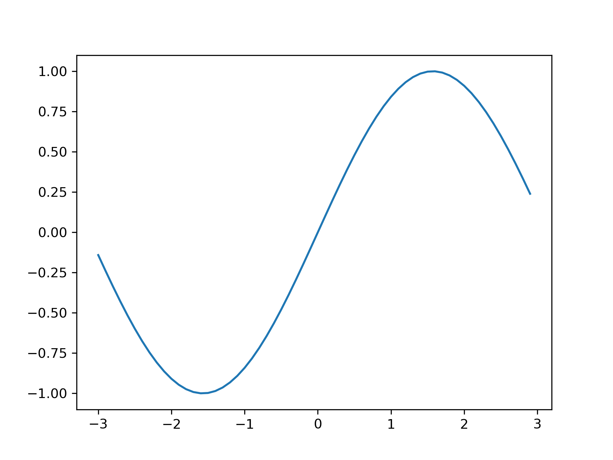
** plot 官方語法
plot()函式控制輸出主要有以下兩類參數：
- fmt 字串
- kwarg 參數
基本語法如下:
- plot([x], y, [fmt], *, data=None, **kwargs)
- plot([x], y, [fmt], [x2], y2, [fmt2], ..., **kwargs)

* 參數控制
在 Matplotlib 中，我們可以透過 fmt 字串和 kwarg（keyword argument）來控制圖形的外觀。這些參數可以幫助我們設置線條顏色、標記、線型以及其他視覺元素，使得繪製的圖形更加美觀且具有區分性。以下介紹如何使用 fmt 字串和 kwarg 參數來自定義圖表。
** fmt 控制參數
fmt 是一個簡便的字串格式，用來設定線條的顏色、標記和線型。通過簡單的字元組合，我們可以快速控制圖形的基本格式。
*** 基本語法
#+begin_src python -r  :results output :exports both
plt.plot(x座標, y座標, 'fmt')
#+end_src

fmt 字串由三個部分組成，依序為 =[顏色][標記][線型]= ，三者皆為可選，可任意組合：
| fmt 字串  | 意義                           |
|-----------+--------------------------------|
| ='r^--'=  | 紅色 + 上三角形標記 + 虛線     |
| ='go-'=   | 綠色 + 圓圈標記 + 實線         |
| ='b--'=   | 藍色 + 無標記 + 虛線           |
| ='r+'=    | 紅色 + 加號標記 + 無連接線     |
| ='c-.'=   | 青色 + 無標記 + 點虛線         |

若只指定標記而省略線型（如 ='r+'= ），資料點之間不會連線；若只指定線型而省略標記（如 ='b--'= ），則只顯示線條而無標記。

以下為各元素的參考表：
- 顏色（Color）：使用單個字母表示顏色，例如 'r' 表示紅色，'b' 表示藍色。
- 標記（Marker）：表示每個數據點的標記形狀，例如 '^' 表示上三角形，'o' 表示圓圈。
- 線型（Line Style）：表示連接數據點的線型，例如 '-' 表示實線，'--' 表示虛線。
|-------+-------+-------+-------------+--------------+----------|
| 字元 | 顏色 | 字元 |    標記    |    字元     |  線條   |
|  <c>  |  <c>  |  <c>  |     <c>     |     <c>      |   <c>    |
|-------+-------+-------+-------------+--------------+----------|
|  'b'  |  藍  |  '.'  |     點     | '--'(兩個-) |  虛線   |
|  'g'  |  綠  |  'o'  |    圓圈    |     '-'      |  實線   |
|  'r'  |  紅  |  'v'  | 三角形(下) |     '-.'     | -.-.-.-. |
|  'c'  |  青  |  '^'  | 三角形(上) |              |          |
|  'm'  | 洋紅 |  '<'  | 三角形(左) |              |          |
|  'y'  |  黃  |  '>'  | 三角形(右) |              |          |
|  'k'  |  黑  |  's'  |   正方形   |              |          |
|  'w'  |  白  |  'p'  |   五邊形   |              |          |
|       |       |  '*'  |      *      |              |          |
|       |       |  '+'  |      +      |              |          |
|       |       |  'x'  |      x      |              |          |
|       |       |  'd'  |    鑽石    |              |          |
|-------+-------+-------+-------------+--------------+----------|
*** 範例 #1
#+begin_src python -r -n :results output :exports both
import matplotlib.pyplot as plt
import numpy as np

x = np.arange(-3, 3, 0.1)
plt.clf()
plt.plot(x, np.sin(x), 'r+')
plt.show()

# saving figure
# plt.savefig('images/SimpleSin2.png', dpi=300)

#+end_src
#+RESULTS:
#+CAPTION: 簡單的 sin 圖形
#+LABEL: fig:SimpleSin2
#+name: fig:SimpleSin2
#+ATTR_LATEX: :width 400
#+ATTR_HTML: :width 500
#+ATTR_ORG: :width 400
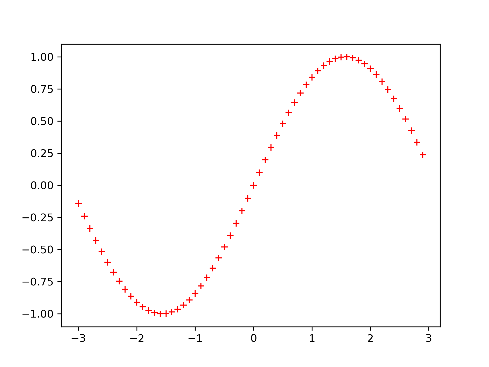
*** 範例 #2
#+begin_src python -r -n :results output :exports both
import matplotlib.pyplot as plt
import numpy as np

x = np.arange(-3, 3, 0.1)
plt.clf()
plt.plot(x, np.cos(x), 'c-.')
plt.show()

# saving figure
# plt.savefig('images/SimpleCos.png', dpi=300)
#+end_src
#+RESULTS:
#+CAPTION: 簡單的 cos 圖形
#+LABEL: fig:SimpleCos
#+name: fig:SimpleCos
#+ATTR_LATEX: :width 400
#+ATTR_HTML: :width 500
#+ATTR_ORG: :width 400
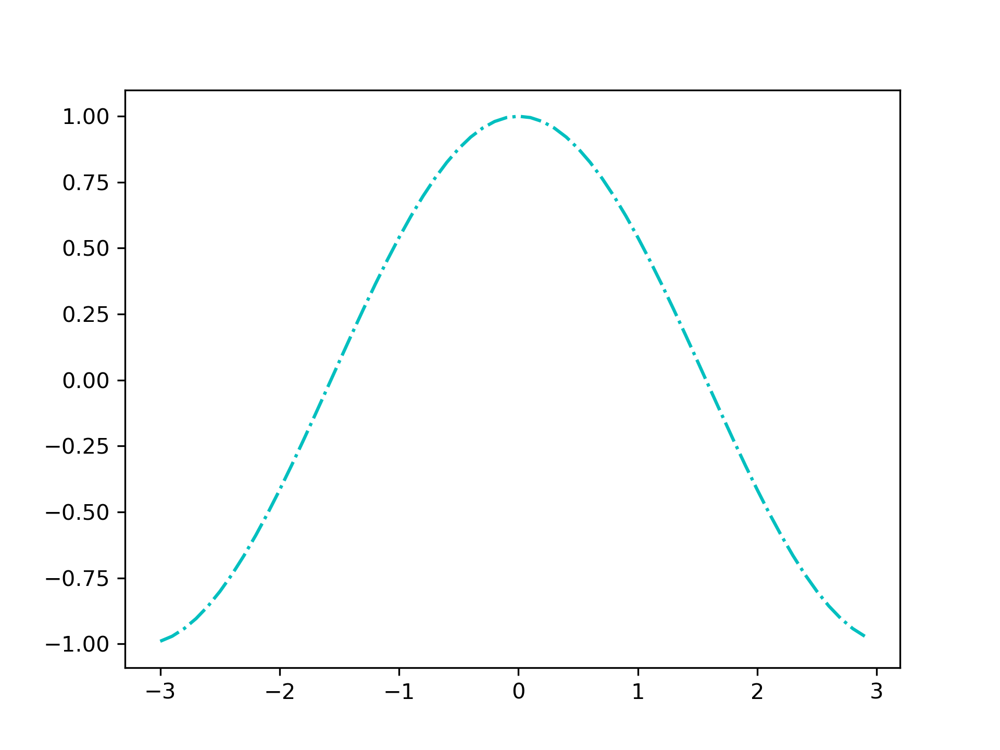
*** 範例: 多組資料
#+begin_src python -r -n :results output :exports both
import matplotlib.pyplot as plt
import numpy as np

x1 = np.arange(-3, +3, 0.1)
y1 = np.sin(x1)
y2 = np.cos(x1)

#plt.plot(x1, y1, 'r^--', x1, y2, 'go-')
plt.plot(x1, y1, 'r^--', x1, y2, 'go-')
plt.savefig('images/mline.png', dpi=300)
#+end_src
#+RESULTS:
#+CAPTION: 多組圖形
#+LABEL: fig:multi-line
#+name: fig:multi-line
#+ATTR_LATEX: :width 300
#+ATTR_HTML: :width 500
#+ATTR_ORG: :width 300
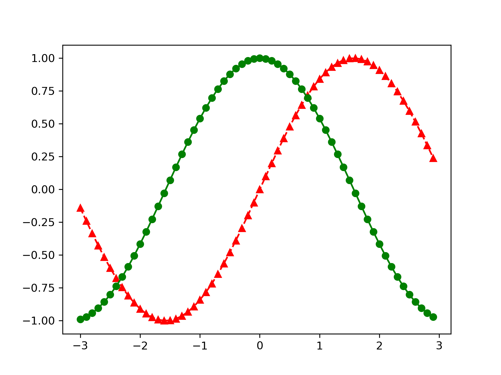
** kwarg 參數
kwarg 是 Matplotlib 中用來設定繪圖細節的參數，例如顏色、線型、標記、標籤等。
*** 常見的kwarg參數
- color：設定線條的顏色，可以使用顏色名稱、字母代碼、色碼或 RGB 值。
- linestyle：設定線型，如 '--' 表示虛線，'-' 表示實線。
- marker：設定數據點的標記樣式，如 'o' 表示圓圈，'^' 表示上三角形。
- linewidth（縮寫 lw）：設定線條寬度，數值越大線條越粗，例如 =linewidth=3= 。
- markersize（縮寫 ms）：設定標記大小，例如 =markersize=10= 。
- alpha：設定透明度，範圍 0（完全透明）~ 1（完全不透明），例如 =alpha=0.5= 。
- label：設定線條標籤，用於圖例顯示。
- 若 fmt 和 kwarg 設定衝突時，以 kwarg 為主。例如 =plt.plot(x, y, 'r--', color='blue')= 最終會顯示藍色（kwarg 覆蓋 fmt 的紅色）。
*** color
- 單字，如 g：color = 'lime'
- 字母，如 g：color = 'k'
- 色碼，如 g：color = '#FF0000'
- RGB 值(0~1 之間)，如：color = (1, 0, 0)
| 字元 | 顏色 |
|  <c>  |  <c>  |
|-------+-------|
|  'b'  | 藍色 |
|  'g'  | 綠色 |
|  'r'  |  紅  |
|  'c'  | 青色 |
|  'm'  | 品紅 |
|  'y'  | 黃色 |
|  'k'  |  黑  |
|  'w'  | 白色 |
*** marker
| 字元 |        描述         |
| <c>  |         <c>         |
|------+---------------------|
| '.'  |       點標記        |
| ','  |      畫素標記       |
| 'o'  |      圓圈標記       |
| 'v'  | triangle_down 標記  |
| '^'  |  triangle_up 標記   |
| '<'  | triangle_left 標記  |
| '>'  | triangle_right 標記 |
| '1'  |    tri_down 標記    |
| '2'  |     tri_up 標記     |
| '3'  |    tri_left 標記    |
| '4'  |   tri_right 標記    |
| 's'  |      方形標記       |
| 'p'  |     五邊形標記      |
| '*'  |      星形標記       |
| 'h'  |    hexagon1 標記    |
| 'H'  |    hexagon2 標記    |
| '+'  |      加號標記       |
| 'x'  |       x 標記        |
| 'D'  |      鑽石標記       |
| 'd'  |  thin_diamond 標記  |
| '\vert'  |      豎線標記       |
| '_'  |      橫線標記       |
*** linestyle
| 字元 |      描述       |
|  <c>  |       <c>        |
|-------+------------------|
|  '-'  |    實線樣式     |
| '--'  |    虛線樣式     |
| '-.'  | 破折號-點線樣式 |
|  ':'  |    點線樣式     |
*** label
- 用以呈現線條標籤，如 label = 'y = x^2'
- 需搭配 plt.legend() 函式方能呈現 label
*** 其他常用函式
- =plt.figure(figsize=(寬, 高), dpi=解析度)= ：建立新的圖表畫布。 =figsize= 的單位是英吋，例如 =figsize=(10, 6)= 表示寬 10 吋、高 6 吋。 =dpi= 為每英吋點數，預設 100。
- =plt.xlim(起始值, 終止值)= / =plt.ylim(起, 止)= ：設定 x / y 座標範圍。
- =plt.title(字串)= ：設定圖表標題。可加 =fontsize= 參數控制大小。
- =plt.xlabel(字串)= / =plt.ylabel(字串)= ：設定 x / y 座標軸標題。
- =plt.legend()= ：顯示 kwarg 參數裡的 label（圖例）。
- =plt.grid(True)= ：顯示格線。
- =plt.tight_layout()= ：自動調整子圖間距，避免標題、標籤被裁切。
*** 範例
#+begin_src python -r -n :results output :exports both
import matplotlib.pyplot as plt
import numpy as np

x = np.arange(-3, 3, 0.5)
plt.clf()
plt.plot(x, np.cos(x), color='c', linestyle='--', marker='p')
plt.xlim(-4, 4)
plt.xlabel('This is x label')
plt.title("This is Title", fontsize=16)

plt.savefig('images/kwarg.png', dpi=300)

#+end_src
#+RESULTS:
#+CAPTION: kwarg 參數控制
#+LABEL: fig:kwarg
#+name: fig:kwarg
#+ATTR_LATEX: :width 400
#+ATTR_HTML: :width 500
#+ATTR_ORG: :width 400
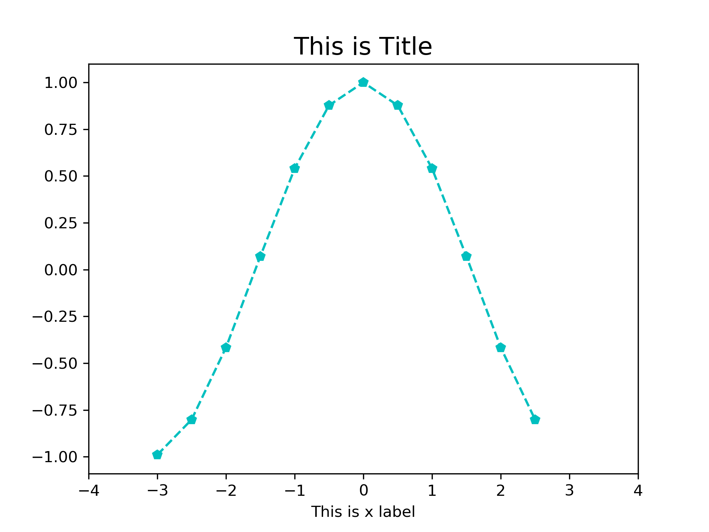

* 中文問題
- 在使用 Python 進行資料視覺化時，如果想要顯示中文（如標題、標籤或圖例中的文字），有時會遇到字型問題，導致中文無法正常顯示。
- 這是因為 Matplotlib 預設的字型不支援中文字符，因此我們需要手動指定一個支援中文的字型，並解決負號顯示問題。
- 這類指令無需特意記憶理解，只需在每次需要時上網查詢並複製貼上即可。
** 在 PyCharm 中使用中文
PyCharm 中顯示中文的方法主要分為兩步：
1. 指定字型，使其支援中文。
2. 解決負號在座標軸上顯示的問題，這是 Matplotlib 中常見的一個問題，當顯示負數時，負號會被當作特殊符號處理。
*** 範例
#+begin_src python -r -n :results output :exports both
# 解決中文問題
plt.rcParams['font.sans-serif'] = ['Arial Unicode MS'] # 步驟一（替換系統中的字型，這裡用的是Mac OSX系統）
plt.rcParams['axes.unicode_minus'] = False  # 步驟二（解決座標軸負數的負號顯示問題）
#+end_src

=plt.rcParams= 是 Matplotlib 的全域設定字典，可以修改各種預設行為：
- =font.sans-serif= ：指定無襯線字型的優先清單，Matplotlib 預設字型不支援中文，所以要換成有中文的字型。Mac 系統可用 ='Arial Unicode MS'= ，Windows 可用 ='Microsoft JhengHei'= （微軟正黑體）。
- =axes.unicode_minus= ：設為 =False= 時，座標軸的負號會用普通的減號 (-) 顯示，而非 Unicode 的 minus 符號（某些中文字型不支援該符號，會顯示為方塊）。
- 實際示例
#+CAPTION: 簡單的折線圖及圖例
#+LABEL: fig:SimpleLineLegend
#+name: fig:SimpleLineLegend
#+ATTR_LATEX: :width 400
#+ATTR_HTML: :width 500
#+ATTR_ORG: :width 400
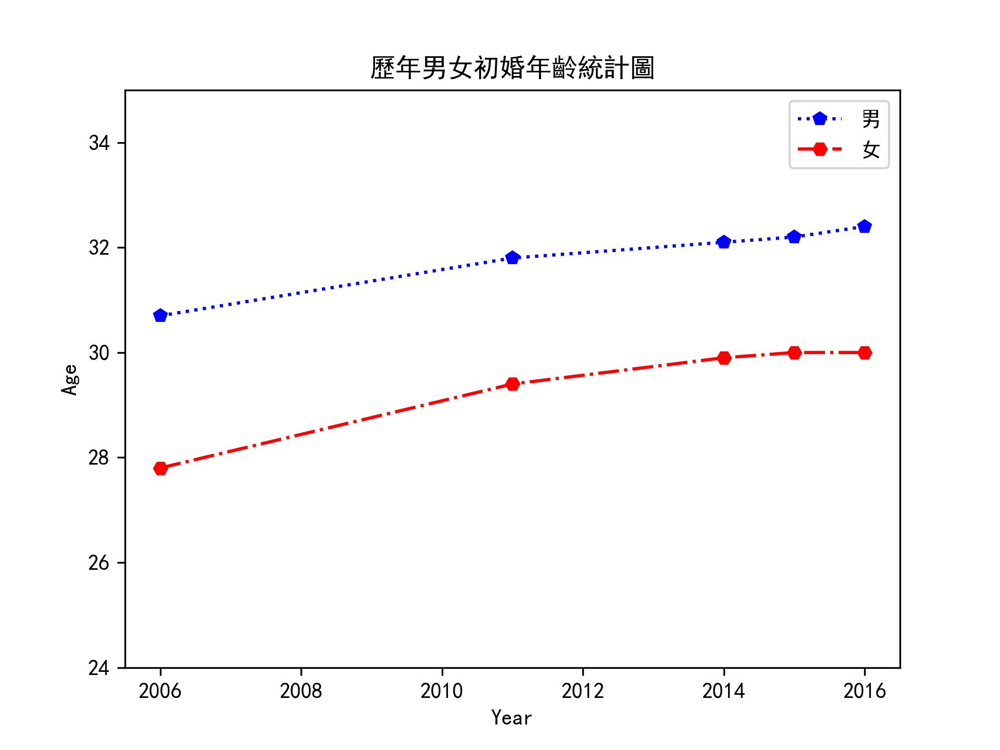
** 在 colab 中使用中文
在 Google Colab 中使用中文的過程比較特別，因為 Colab 預設的環境沒有支援繁體中文的字型。我們可以下載一個支援繁體中文的字型，並將其加入到 Matplotlib 的字型列表中來解決這個問題。
1. 下載台北思源黑體（Taipei Sans TC Beta）字型，這是一個支援繁體中文的免費字型。
2. 使用 fontManager.addfont() 函式將該字型加入到 Matplotlib 的字型列表中，然後設定為默認字型。
*** 範例
colab在plot()前先加入下列 cell並執行
#+begin_src python -r -n :results output :exports both :noexport
# Colab 進行matplotlib繪圖時顯示繁體中文
# 下載台北思源黑體並命名taipei_sans_tc_beta.ttf，移至指定路徑
!wget -O TaipeiSansTCBeta-Regular.ttf https://drive.google.com/uc?id=1eGAsTN1HBpJAkeVM57_C7ccp7hbgSz3_&export=download

import matplotlib as mpl
import matplotlib.pyplot as plt
from matplotlib.font_manager import fontManager

fontManager.addfont('TaipeiSansTCBeta-Regular.ttf')
mpl.rc('font', family='Taipei Sans TC Beta')
#+end_src

* Legend
在資料視覺化過程中，圖例（Legend）是一個非常重要的元素，特別當你繪製多條線或多組資料時。圖例可以幫助讀者理解每條線或每組資料所代表的意義。在 Matplotlib 中，我們可以使用 plt.legend() 函式來添加圖例，並自定義圖例的位置。
** plt.legend() 基本語法
- plt.legend([label1, label2, ...])：這個函式用來為每條線添加標籤。標籤的數量應與圖中繪製的線條數一致。
- loc 參數：用來指定圖例的位置。常用的位置選項有：
  - "upper left"：左上角
  - "upper right"：右上角
  - "lower left"：左下角
  - "lower right"：右下角
  - "best"：Matplotlib 會自動選擇最佳位置，避免與圖形重疊。
** 範例
#+begin_src python -r -n :results output :exports both
import matplotlib.pyplot as plt
import numpy as np

x = np.arange(-3, 3, 0.1)
plt.clf()
plt.plot(x, np.sin(x))
plt.plot(x, np.cos(x))
#加入圖例
plt.legend(["sin", "cos"], loc="upper left")

# 若要存圖，要先存檔再顯示 # for PyCharm
plt.savefig('images/sincoslegend.png', dpi=300)
#+end_src

#+RESULTS:

#+CAPTION: sin 與 cos 曲線及圖例
#+LABEL: fig:SinCosLegend
#+name: fig:SinCosLegend
#+ATTR_LATEX: :width 300
#+ATTR_ORG: :width 300
#+ATTR_HTML: :width 500
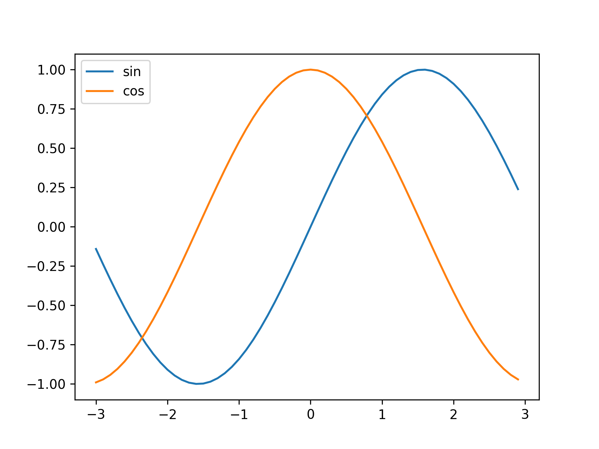

* Line Chart
** 範例 #1
如何繪製多組資料的折線圖，包括使用列表和 NumPy 生成資料，並為每條線設置不同的樣式和顏色。

當一次繪製多組資料時，使用 =plt.plot(x1, y1, fmt1, x2, y2, fmt2, ...)= 的語法，依序傳入各組的 x、y 資料和 fmt：
#+BEGIN_SRC python -r -n :results output :exports both
import matplotlib.pyplot as plt
import numpy as np

x1 = [1, 2, 3, 4, 5, 6]
y1 = [1, 2, 3, 4, 5, 6]
x2 = np.arange(0, 3, 0.3)
x3 = np.arange(8).reshape(2, 4)
print(x3)
print(x3+3)
# 'c-p': 青色+實線+五邊形, 'ms:': 洋紅+方形+點線, '-*': 實線+星形
plt.plot(y1, 'c-p', x2, x2**2, 'ms:', x3, x3+3, '-*')
plt.savefig('images/line2.png', dpi=300)
#+END_SRC
#+RESULTS:
: [[0 1 2 3]
:  [4 5 6 7]]
: [[ 3  4  5  6]
:  [ 7  8  9 10]]
#+CAPTION: 簡單的折線圖形 2
#+LABEL: fig:SimpleLine2
#+name: fig:SimpleLine2
#+ATTR_LATEX: :width 400
#+ATTR_HTML: :width 500
#+ATTR_ORG: :width 400
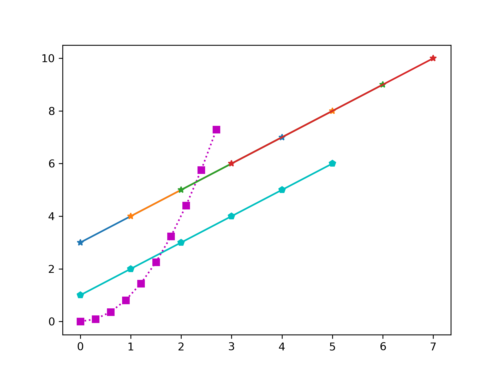
** 範例 #2
如何使用一個簡單的數學函數（線性函數）繪製折線圖，並為圖表設置標籤與範圍。
#+begin_src python -r -n :results output :exports both
import matplotlib.pyplot as plt
import numpy as np

def angdeg(x):
    return 1.2*x+3

x = np.arange(0, 21, 1)
plt.rcParams['font.sans-serif'] = ['Arial Unicode MS'] # 步驟一（替換系統中的字型，這裡用的是Mac OSX系統）
plt.rcParams['axes.unicode_minus'] = False  # 步驟二（解決座標軸負數的負號顯示問題）
ax = plt.figure().gca()
plt.plot(x, angdeg(x), color='r', linestyle='--', linewidth=3)
plt.xlabel('本月闖禍次數', fontsize=16)
plt.ylabel('媽媽生氣程度', fontsize=16)
plt.xlim(0,21)
ax.set_xticks(x)
plt.savefig('images/angrymam-1.png', dpi=300)
#+end_src

#+RESULTS:

#+CAPTION: Angry Mam
#+LABEL: fig:AngryMam-1
#+name: fig:AngryMam-1
#+ATTR_LATEX: :width 400
#+ATTR_ORG: :width 400
#+ATTR_HTML: :width 500
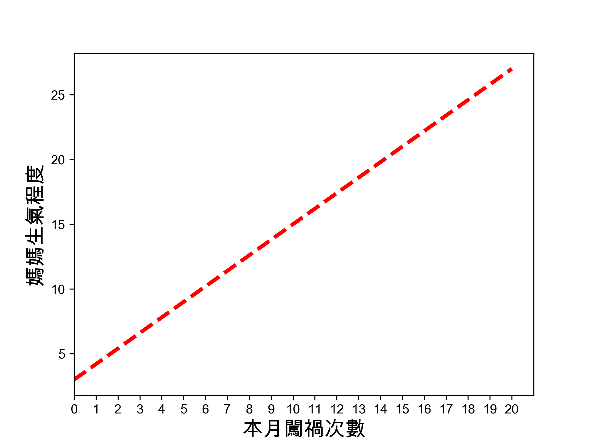
** 範例 #3
如何使用非線性函數繪製折線圖，並設置 Y 軸範圍以顯示更大區間的資料。
#+begin_src python -r -n :results output :exports both
import matplotlib.pyplot as plt
import numpy as np

def angdeg(x):
    return 500+(x**4)/100

x = np.arange(0, 21, 1)
#plt.cla()
plt.rcParams['font.sans-serif'] = ['Arial Unicode MS'] # 步驟一（替換系統中的字型，這裡用的是Mac OSX系統）
plt.rcParams['axes.unicode_minus'] = False  # 步驟二（解決座標軸負數的負號顯示問題）

ax = plt.figure().gca()
plt.plot(x, angdeg(x), color='r', linestyle='--', linewidth=3)

plt.xlabel('本月闖禍次數', fontsize=16)
plt.ylabel('媽媽生氣程度', fontsize=16)
plt.xlim(0,21)
plt.ylim(0,2201)
ax.set_xticks(x)
plt.savefig('images/angrymam-2.png', dpi=300)
#+end_src

#+RESULTS:

#+CAPTION: Angry Mam
#+LABEL: fig:AngryMam-2
#+name: fig:AngryMam-2
#+ATTR_LATEX: :width 400
#+ATTR_ORG: :width 400
#+ATTR_HTML: :width 500
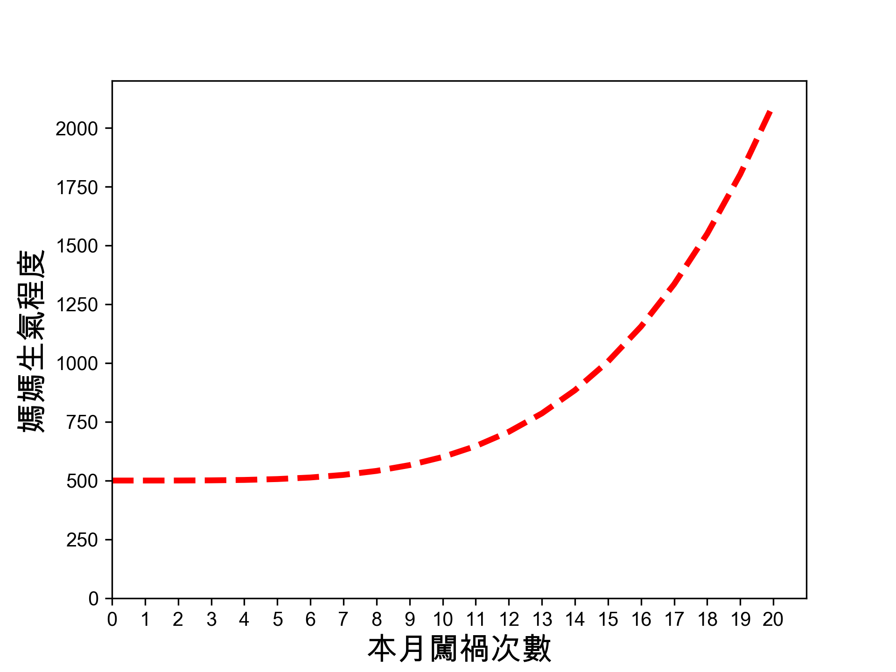
** 範例 #4
根據條件設定點的顏色、並依資料類型加上legend
#+begin_src python -r -n :results output :exports both
import matplotlib.pyplot as plt
import numpy as np
import pandas as pd

def angdeg(x):
    return x**4
def l2c(x):
    if x == True:
        return 'r'
    else:
        return 'g'

np.random.seed(9527)
x = np.random.randint(21, size=20)
y = np.random.randint(21, size=20)
z = x + y < 20
colors = list(map(lambda x: 'g' if x == True else 'r', z))
#colors = list(map(l2c, z))
labels = list(map(lambda x: '挨揍' if x == True else '平安', z))
plt.rcParams['font.sans-serif'] = ['Arial Unicode MS'] # 步驟一（替換系統中的字型，這裡用的是Mac OSX系統）
plt.rcParams['axes.unicode_minus'] = False  # 步驟二（解決座標軸負數的負號顯示問題）

ax = plt.figure().gca()

#plt.scatter(x, y, c = colors)
rc = [i for i in range(len(colors)) if colors[i] == 'r']
gc = [i for i in range(len(colors)) if colors[i] == 'g']

plt.scatter(x[rc], y[rc], c = 'r')
plt.scatter(x[gc], y[gc], c = 'g')
plt.xlabel('因闖禍受傷程度', fontsize=16)
plt.ylabel('因闖禍導致損失金額', fontsize=16)
ax.set_xticks(range(21))
ax.set_yticks(range(21))
plt.legend(['處罰','平安'])
plt.plot(x, 20-x, linewidth=3)
plt.savefig('images/angrymam-3.png', dpi=300)
#+end_src

#+RESULTS:

#+CAPTION: Angry Mam
#+LABEL: fig:AngryMam-3
#+name: fig:AngryMam-3
#+ATTR_LATEX: :width 400
#+ATTR_ORG: :width 400
#+ATTR_HTML: :width 500
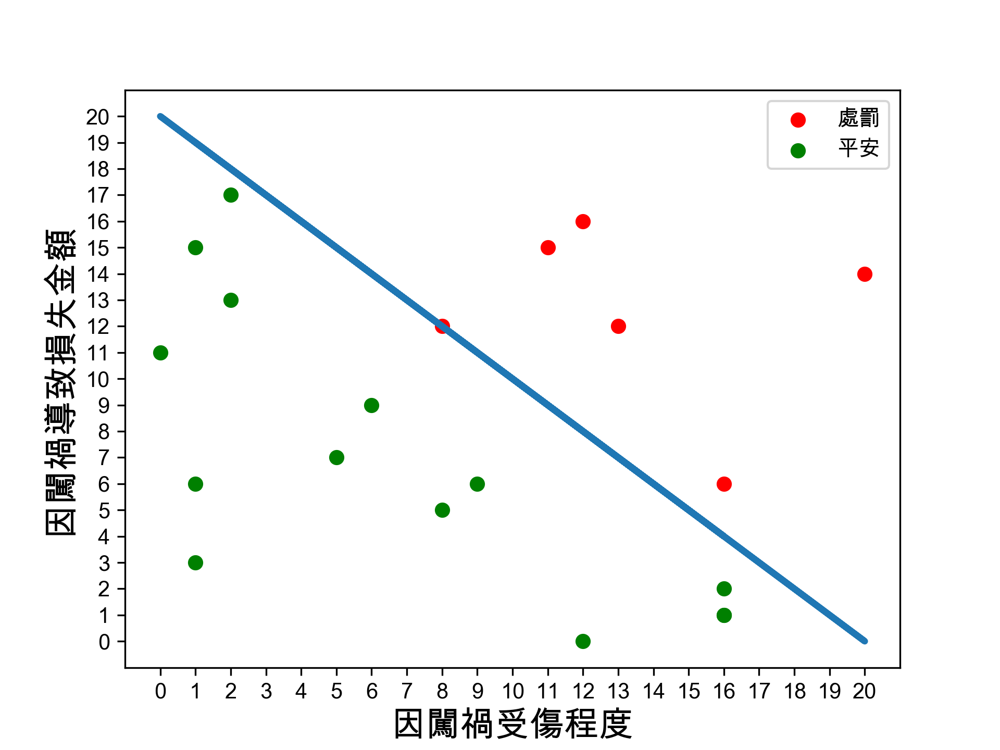
** 範例 #5
#+begin_src python -r -n :results output :exports both
import matplotlib.pyplot as plt
import numpy as np
import pandas as pd

def angdeg(x):
    return x**4
def l2c(x):
    if x == True:
        return 'r'
    else:
        return 'g'
def mycurv(x):
    return 5 + (2 ** (19-float(x)))/6000

np.random.seed(9527)
x = np.random.randint(21, size=20)
y = np.random.randint(21, size=20)
y1 = list(map(mycurv, x))
print('y:',y)
print('y1:',y1)
z = y > y1
print('z:', z)
colors = list(map(lambda x: 'g' if x == True else 'r', z))
colors = list(map(l2c, z))
#labels = list(map(lambda x: '挨揍' if x == True else '平安', z))
plt.rcParams['font.sans-serif'] = ['Arial Unicode MS'] # 步驟一（替換系統中的字型，這裡用的是Mac OSX系統）
plt.rcParams['axes.unicode_minus'] = False
# 步驟二（解決座標軸負數的負號顯示問題）
ax = plt.figure().gca()
#
##plt.scatter(x, y, c = colors)
rc = [i for i in range(len(colors)) if colors[i] == 'r']
gc = [i for i in range(len(colors)) if colors[i] == 'g']

plt.scatter(x[rc], y[rc], c = 'r')
plt.scatter(x[gc], y[gc], c = 'g')
plt.xlabel('因闖禍受傷程度', fontsize=16)
plt.ylabel('因闖禍導致金錢損失', fontsize=16)
ax.set_xticks(x)
plt.legend(['處罰
','平安'])
x1=np.arange(21,0,-1, dtype=float)
print(x1)

plt.plot(x1, 5 + (2 ** (19-x1))/6000, linewidth=3)
plt.xlim(0,21)
plt.ylim(0,21)
ax.set_xticks(range(21))
ax.set_yticks(range(21))
plt.savefig('images/angrymam-4.png', dpi=300)
#+end_src

#+RESULTS:
: y: [15  5  1  1 16 12  6  3 14 15  6 17  2 12  0 11  6  7  9 13]
: y1: [48.690666666666665, 5.341333333333333, 5.001333333333333, 5.001333333333333, 5.021333333333334, 5.341333333333333, 5.001333333333333, 48.690666666666665, 5.000083333333333, 5.042666666666666, 5.1706666666666665, 26.845333333333333, 5.001333333333333, 5.010666666666666, 5.021333333333334, 92.38133333333333, 48.690666666666665, 7.730666666666666, 6.365333333333333, 26.845333333333333]
: z: [False False False False  True  True  True False  True  True  True False
:  False  True False False False False  True False]
: [21. 20. 19. 18. 17. 16. 15. 14. 13. 12. 11. 10.  9.  8.  7.  6.  5.  4.
:   3.  2.  1.]

#+CAPTION: Angry Mam
#+LABEL: fig:AngryMam-4
#+name: fig:AngryMam-4
#+ATTR_LATEX: :width 400
#+ATTR_ORG: :width 400
#+ATTR_HTML: :width 500
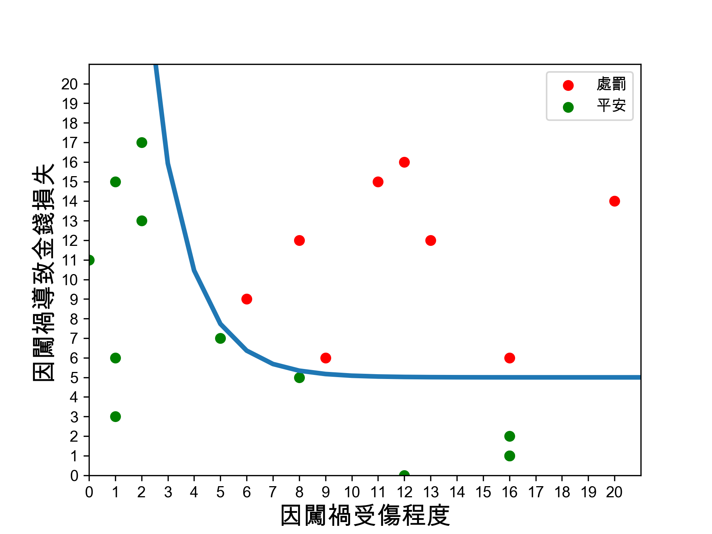
** [課堂練習]繪製折線圖 :TNFSH:
1. 利用 list 繪製

   - x1 = [1, 2, 3, 4, 5, 6]

   - y1 = [1, 2, 3, 4, 5, 6]

2. 執行 plt.plot(y1) 和 plt.plot(x1, y1) 有何差別??
3. 利用 numpy 繪製

   - x2 = np.arange(0, 3, 0.01)

4. 執行 plt.plot(x2, x2**2)看看畫出什麼圖形??
5. 為圖表加上標記、線條標籤，換線條顏色、線條樣式
** [課堂作業]圖表美化 :TNFSH:
請將下列資料繪成折線圖(男女折線不同顏色、樣式，加標記)
| 初婚年齡 | 2006 | 2011 | 2014 | 2015 | 2016 |
|    <c>    | <c>  | <c>  | <c>  | <c>  | <c>  |
|-----------+------+------+------+------+------|
|    男    | 30.7 | 31.8 | 32.1 | 32.2 | 32.4 |
|    女    | 27.8 | 29.4 | 29.9 | 30.0 | 30.0 |
- 圖表標題: Age of first marriage

- 座標軸標題: x ⇒ Year、y ⇒ Age

- 線條標籤: 男 ⇒ Male、女 ⇒ Female
- 結果示例
#+CAPTION: 簡單的折線圖及圖例
#+LABEL: fig:MarriageLineLegend
#+name: fig:MarriageLineLegend
#+ATTR_LATEX: :width 400
#+ATTR_HTML: :width 500
#+ATTR_ORG: :width 400

*** solution :noexport:
#+begin_src python -r -n :results output :exports both
import matplotlib.pyplot as plt
import numpy as np

year = [2006, 2011, 2014, 2015, 2016]
male = [30.7, 31.8, 32.1, 32.2, 32.4]
female = [27.8, 29.4, 29.9, 30.0, 30.0]
plt.clf()

plt.rcParams['font.sans-serif'] = ['SimHei']
plt.rcParams['axes.unicode_minus'] = False

plt.plot(year, male, 'bp:', label='男')
plt.plot(year, female, 'rH-.', label='女')
plt.xlabel('Year')
plt.ylim(24,35)
plt.ylabel('Age')
plt.title('歷年男女初婚年齡統計圖')
plt.legend()
# 若要存圖，要先存檔再顯示 # for PyCharm
# plt.savefig('SimpleSin.png', dpi=300)
#plt.show()   # for PyCharm
plt.savefig('images/marriage.png', dpi=300)
#+end_src

#+RESULTS:

** [課堂練習]全班成績統計圖 :TNFSH:
使用 numpy 隨機生成 30 位同學、5 科（國文、英文、數學、自然、社會）的成績，繪製以下圖表：
1. 繪製「各科平均分數」的長條圖（plt.bar），標示每科平均值
2. 繪製「各科及格率」的水平長條圖（plt.barh）
3. 所有圖表需包含中文標題、座標軸標籤

指定 seed：
#+begin_src python -r -n :results output :exports both
import numpy as np
np.random.seed(4321)

subs = ['國文', '英文', '數學', '自然', '社會']
scores = np.random.randint(40, 100, size=(30, 5))
#+end_src

結果範例（文字部分）
#+RESULTS:
#+begin_example
=== 全班成績統計 ===
國文: 平均=66.6, 最高=97, 最低=40
英文: 平均=68.3, 最高=99, 最低=42
數學: 平均=71.9, 最高=98, 最低=45
自然: 平均=66.7, 最高=98, 最低=40
社會: 平均=72.5, 最高=97, 最低=40

=== 各科及格人數 (>=60) ===
國文: 16/30 人及格 (53%)
英文: 18/30 人及格 (60%)
數學: 21/30 人及格 (70%)
自然: 16/30 人及格 (53%)
社會: 22/30 人及格 (73%)
#+end_example

*** solution :noexport:
#+begin_src python -r -n :results output :exports both
import numpy as np
import matplotlib.pyplot as plt

plt.rcParams['font.sans-serif'] = ['Arial Unicode MS']
plt.rcParams['axes.unicode_minus'] = False

np.random.seed(4321)
subs = ['國文', '英文', '數學', '自然', '社會']
scores = np.random.randint(40, 100, size=(30, 5))

print('=== 全班成績統計 ===')
for i, sub in enumerate(subs):
    print(f'{sub}: 平均={np.mean(scores[:, i]):.1f}, 最高={np.max(scores[:, i])}, 最低={np.min(scores[:, i])}')

print(f'\n=== 各科及格人數 (>=60) ===')
for i, sub in enumerate(subs):
    passed = np.sum(scores[:, i] >= 60)
    print(f'{sub}: {passed}/30 人及格 ({passed/30*100:.0f}%)')

# 繪製各科平均分數長條圖
avgs = [np.mean(scores[:, i]) for i in range(5)]
plt.figure(figsize=(8, 4))
plt.bar(subs, avgs, color=['#FF6B6B', '#4ECDC4', '#45B7D1', '#96CEB4', '#FFEAA7'])
plt.title('各科平均分數')
plt.ylabel('分數')
plt.ylim(0, 100)
for i, v in enumerate(avgs):
    plt.text(i, v + 1, f'{v:.1f}', ha='center')
plt.tight_layout()
plt.savefig('images/exercise_bar.png')
plt.show()
#+end_src

* 長條圖 (Bar Chart)
在 Matplotlib 中，長條圖有兩種常見形式：垂直長條圖和水平長條圖，分別使用 plt.bar() 和 plt.barh() 函式來繪製。
** 語法
#+begin_src python :eval no
plt.bar( x座標資料, y座標資料 [, 參數1, 參數2, ...] )
plt.barh( x座標資料, y座標資料 [, 參數1, 參數2, ...] )
#+end_src
=plt.bar()= 繪製垂直長條圖， =plt.barh()= 繪製水平長條圖。常用參數如下：
- width（bar）/ height（barh）：長條的寬度，預設為 0.8。
- color：長條的填充色，可用單一顏色或顏色 list（為每根長條分別指定）。
- edgecolor：長條的邊框顏色。
- alpha：透明度，0~1 之間。
- align：對齊方式，='center'= （預設，長條置中於 x 座標）或 ='edge'= （左邊緣對齊 x 座標）。
- label：圖例標籤，搭配 =plt.legend()= 使用。
** 範例
#+begin_src python -r -n :results output :exports both
import matplotlib.pyplot as plt
import numpy as np

objects = ('Python', 'C++', 'Java', 'Perl', 'Scala', 'Lisp')
performance = [10,8,6,4,2,1]

plt.barh(objects, performance, align='center', color = ['b','g','r','c','m','y'], alpha=0.5)
plt.xlabel('Usage')
plt.title('Programming language usage')
#plt.show()
plt.savefig('images/barChart.png', dpi=300)
#+end_src
#+RESULTS:
#+CAPTION: barChart Demo
#+LABEL: fig:barChart
#+name: fig:barChart
#+ATTR_LATEX: :width 300
#+ATTR_HTML: :width 500
#+ATTR_ORG: :width 300
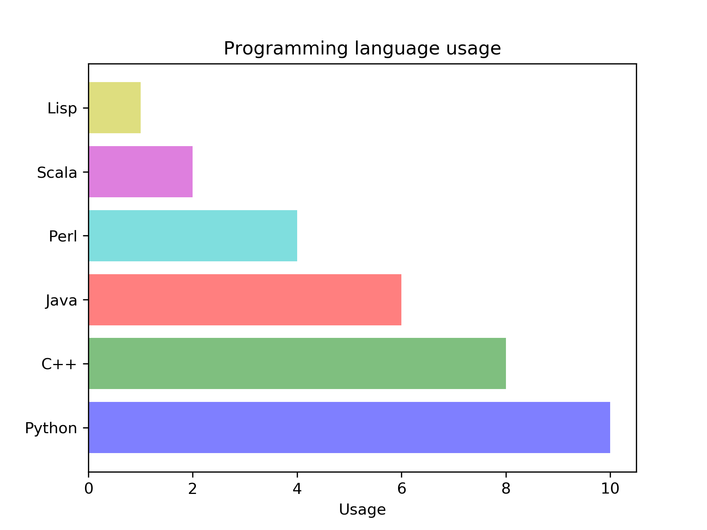

* 圓餅圖 (Pie Chart)
圓餅圖（Pie Chart）是一種常用的視覺化工具，用來展示各部分在整體中所佔的比例。Matplotlib 提供了強大的 plt.pie() 函式，能夠輕鬆製作出美觀的圓餅圖。
** 語法：

#+begin_src python -r :results output :exports both
plt.pie( 比例列表 [, 參數 1, 參數 2, ...] )
#+end_src
** 參數：
- colors：設置每個部分的顏色，使用 list 形式，例如 ['red', 'blue', 'green']。
- labels：設置每個部分的標籤名稱，使用 list 形式。
- explode：設置部分的突出效果，數值越大，部分突出越明顯，使用 list 形式。
- autopct：自動顯示每個部分的百分比，格式可以為 '%3.2f%%' 表示顯示到小數點後兩位。
- startangle：設置繪製的起始角度，預設為 0 度。
- plt.axis('equal')：確保圖形為正圓形。
- plt.legend(loc='位置代碼')：為圖表添加圖例，並設定圖例的位置。
- legend location
| Location String | Location Code |
|       <c>       |      <c>      |
|-----------------+---------------|
|     'best'      |       0       |
|  'upper right'  |       1       |
|  'upper left'   |       2       |
|  'lower left'   |       3       |
|  'lower right'  |       4       |
|     'right'     |       5       |
|  'center left'  |       6       |
| 'center right'  |       7       |
| 'lower center'  |       8       |
| 'upper center'  |       9       |
|    'center'     |      10       |
** 範例
#+BEGIN_SRC python -r -n :results output :exports both
import matplotlib.pyplot as plt
import numpy as np

parts = [35.35, 23, 26.65, 15]
labels = ['Harrison', 'Vanessa', 'James', 'Ruby']
colors = ['red', 'lightblue', 'purple', 'yellow']
explodes = [0.1, 0, 0, 0.1]
plt.pie(parts, colors = colors, labels = labels, explode = explodes, autopct = '%3.2f%%')
plt.axis('equal')
plt.legend(loc='upper left')

#plt.show()
plt.savefig('images/simplePie.png', dpi=300)
#+END_SRC
#+RESULTS:
#+CAPTION: 簡單的 pie chart
#+LABEL: fig:SimplePie
#+name: fig:SimplePie
#+ATTR_LATEX: :width 300
#+ATTR_HTML: :width 500
#+ATTR_ORG: :width 300
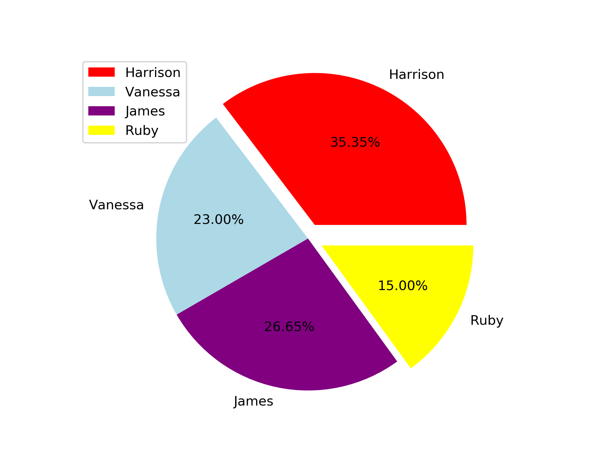

* 其它圖表
** 散佈圖 (Scatter)
散佈圖用來呈現兩組數據之間的群聚關係，每個點代表一筆資料。
#+begin_src python :eval no
plt.scatter(x座標, y座標 [, s=點大小, c=顏色, alpha=透明度, marker=標記])
#+end_src
- s：點的大小（面積），可以是單一數值或與資料等長的 list/array。
- c：點的顏色，可以是單一顏色字串或數值 array（搭配 colormap 做漸層色）。
- [[https://matplotlib.org/stable/api/_as_gen/matplotlib.pyplot.scatter.html][plt.scatter() 官方文件]]
** 直方圖 (Histogram)
直方圖用來呈現資料的分佈情況，將數據分成若干區間（bin），統計落入各區間的次數。
#+begin_src python :eval no
plt.hist(資料, bins=區間數 [, color=顏色, edgecolor=邊框色, alpha=透明度])
#+end_src
- bins：區間數量，預設為 10。數值越大，區間劃分越細。
- [[https://matplotlib.org/stable/api/_as_gen/matplotlib.pyplot.hist.html][plt.hist() 官方文件]]
** 進階資源
- [[https://matplotlib.org/stable/gallery/index.html][Matplotlib Gallery]] — 更多圖表類型範例

* 文字註解: plt.text()
在資料視覺化過程中，添加文字註解可以幫助讀者更直觀地了解數據的具體數值或特殊位置。在 Matplotlib 中，我們可以使用 plt.text() 函式來將文字註解放置在圖表上的指定位置。這是一個非常實用的工具，尤其是在展示具體數據點或強調特定資訊時。
** 語法
#+begin_src python -r :results output :exports both
plt.text(x相對座標, y相對座標, '文字字串', [其它參數])
#+end_src
** 常用參數
- fontsize：設定字體大小，例如 =fontsize=12= 。
- color：設定文字顏色，例如 =color='blue'= 。
- fontweight：設定字體粗細，如 ='bold'= 、 ='normal'= 。
- ha（horizontalalignment）：水平對齊方式。
  - ='left'= ：文字左邊緣對齊指定的 x 座標。
  - ='center'= ：文字中心對齊 x 座標。
  - ='right'= ：文字右邊緣對齊 x 座標。
- va（verticalalignment）：垂直對齊方式。
  - ='top'= ：文字頂部對齊 y 座標。
  - ='center'= ：文字中心對齊 y 座標。
  - ='bottom'= ：文字底部對齊 y 座標（預設值）。
  - ='baseline'= ：文字基線對齊 y 座標。

x、y 座標使用的是「資料座標」，也就是跟你的圖表數據同一個座標系統。例如你的 x 軸範圍是 0~10，那 =plt.text(5, 8, '文字')= 就會把文字放在 x=5, y=8 的位置。
** 範例
#+BEGIN_SRC python -r -n :results output :exports both
import matplotlib.pyplot as plt

x = [1, 2, 3, 4, 5, 6, 7, 8]
y = [1, 4, 9, 16, 25, 36, 49, 64]
plt.plot(x, y, 'r--')
for x, y in zip(x, y):
    plt.text(x-0.2, y+0.6, '(%d, %d)' %(x, y))
#plt.show()
plt.savefig('images/simpleText.png', dpi = 300)
#+END_SRC

#+RESULTS:

#+CAPTION: 簡單的文字註解
#+LABEL: fig:SimpleText
#+name: fig:SimpleText
#+ATTR_LATEX: :width 300
#+ATTR_HTML: :width 500
#+ATTR_ORG: :width 300
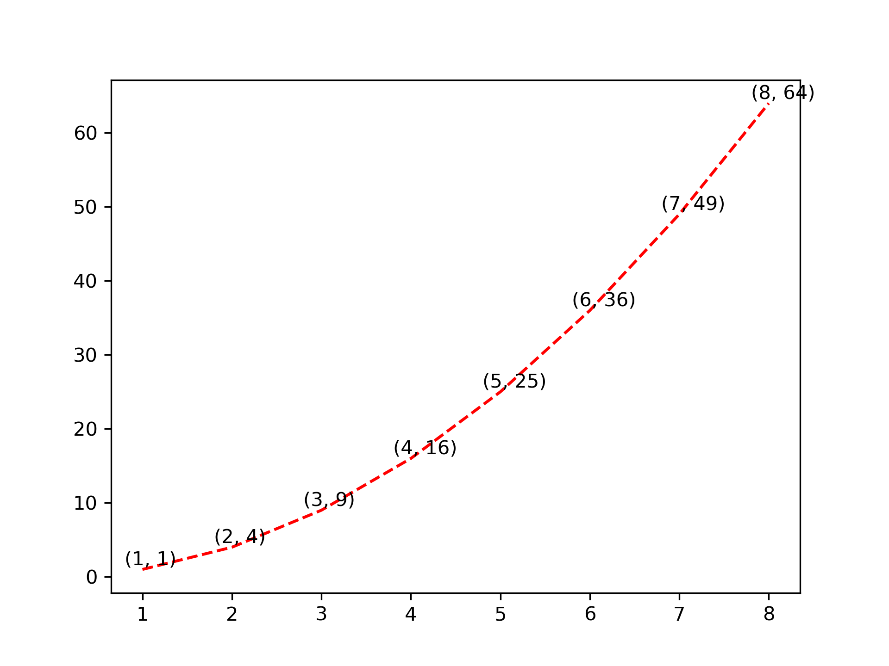

* 子圖表: plt.subplot()
Matplotlib 提供的 plt.subplot() 函式能夠方便地在一個視窗中繪製多個子圖，將整個繪圖區域劃分為多個區域進行展示。這使得我們可以有效利用圖表空間，同時展示多組不同的數據或圖表。
** subplot 語法
#+begin_src python -r :results output :exports both
plt.subplot(numRows, numCols, plotNum)
#+end_src
- 圖表的整個繪圖區域被分成 numRows 行和 numCols 列
- 然後按照從左到右，從上到下的順序對每個子區域進行編號，左上的子區域的編號為 1
- plotNum 參數指定創建的 Axes 對象所在的區域
- 如果 numRows, numCols 和 plotNum 這三個數都小於 10 的話, 可以把它們縮寫為一個整數, 例如 subplot(323) 和 subplot(3,2,3) 是相同的.
** subplots_adjust 語法
#+begin_src python -r :results output :exports both
plt.subplots_adjust(left=None, bottom=None, right=None, top=None, wspace=None, hspace=None)
#+end_src
- left：子圖與畫布左邊緣的距離（0 ~ 1 之間的值）。
- right：子圖與畫布右邊緣的距離。
- bottom：子圖與畫布底部的距離。
- top：子圖與畫布頂部的距離。
- wspace：子圖之間的水平間距。
- hspace：子圖之間的垂直間距。
** 範例[fn:2]
以下範例展示 4 種不同 Y 軸刻度（linear、log、symlog、logit）的子圖。範例中用到的幾個函式說明：
- =plt.figure()= ：建立新畫布。
- =plt.subplot(221)= ：在 2×2 格線中選第 1 格（左上），等同 =plt.subplot(2, 2, 1)= 。
- =plt.yscale('log')= ：將 Y 軸刻度設為對數刻度（還可用 ='linear'= 、 ='symlog'= 、 ='logit'= ）。
- =plt.grid(True)= ：顯示格線。
- =plt.gca()= ：取得目前的 Axes 物件（Get Current Axes），可對其進行更細緻的設定。
#+BEGIN_SRC python -r -n :results output :exports both
import numpy as np
import matplotlib.pyplot as plt

from matplotlib.ticker import NullFormatter  # useful for `logit` scale

# Fixing random state for reproducibility
np.random.seed(19680801)

# make up some data in the interval ]0, 1[
y = np.random.normal(loc=0.5, scale=0.4, size=1000)
y = y[(y > 0) & (y < 1)]
y.sort()
x = np.arange(len(y))

# plot with various axes scales
plt.figure()

# linear
plt.subplot(221)
plt.plot(x, y)
plt.yscale('linear')
plt.title('linear')
plt.grid(True)

# log
plt.subplot(222)
plt.plot(x, y)
plt.yscale('log')
plt.title('log')
plt.grid(True)

# symmetric log
plt.subplot(223)
plt.plot(x, y - y.mean())
plt.yscale('symlog', linthresh=0.01)  # 註：Matplotlib 3.5 起舊參數名 linthreshy 已移除，改用 linthresh
plt.title('symlog')
plt.grid(True)

# logit
plt.subplot(224)
plt.plot(x, y)
plt.yscale('logit')
plt.title('logit')
plt.grid(True)
# Format the minor tick labels of the y-axis into empty strings with
# `NullFormatter`, to avoid cumbering the axis with too many labels.
plt.gca().yaxis.set_minor_formatter(NullFormatter())

# Adjust the subplot layout, because the logit one may take more space
# than usual, due to y-tick labels like "1 - 10^{-3}"
plt.subplots_adjust(top=0.92, bottom=0.08, left=0.10, right=0.95, hspace=0.25, wspace=0.35)

plt.savefig('images/simpleSubplot.png', dpi = 300)
#+END_SRC

#+RESULTS:
#+CAPTION: 簡單的子圖表
#+LABEL: fig:SimpleSubplot
#+name: fig:SimpleSubplot
#+ATTR_LATEX: :width 400
#+ATTR_HTML: :width 500
#+ATTR_ORG: :width 400
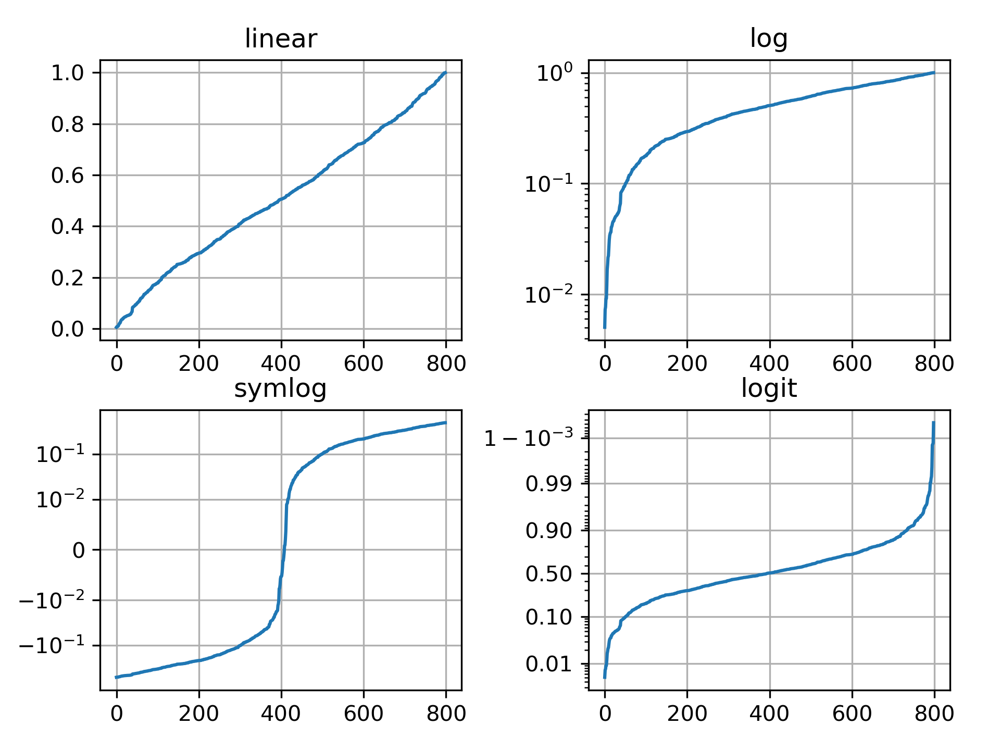
** 進階設定
- [[https://matplotlib.org/stable/api/_as_gen/matplotlib.pyplot.subplot.html][官網]]
- [[https://ithelp.ithome.com.tw/articles/10201670][視覺化資料 - Matplotlib - legend、subplot、GridSpec、annotate]]
- [[https://www.delftstack.com/zh-tw/howto/matplotlib/how-to-make-different-subplot-sizes-in-matplotlib/][Matplotlib 中如何建立不同大小的子圖 subplot]]
- [[https://kernel.blog.csdn.net/article/details/61416645?utm_medium=distribute.pc_relevant.none-task-blog-BlogCommendFromMachineLearnPai2-1.control&depth_1-utm_source=distribute.pc_relevant.none-task-blog-BlogCommendFromMachineLearnPai2-1.control][python使用matplotlib:subplot繪製多個子圖]]

* [課堂練習]實作 :TNFSH:
** 方程式圖形
輸入 a, b, c，畫出曲線圖：y=$ax^2+bx+c$，參考結果如下:
#+CAPTION: 方程式曲線圖
#+LABEL: fig:EqCurve
#+name: fig:EqCurve
#+ATTR_LATEX: :width 400
#+ATTR_HTML: :width 800
#+ATTR_ORG: :width 400
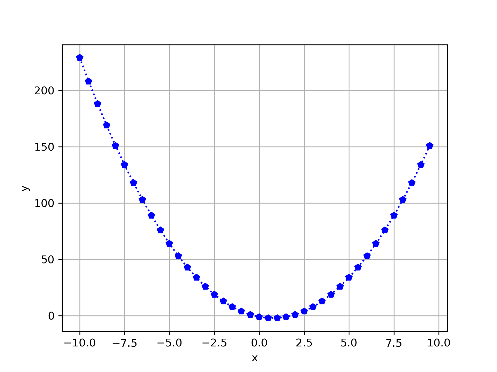
** 成績處理
請複製底下的程式碼:
#+begin_src python -r :results output :exports both
import numpy as np
scores = [[ 26,  53,  49,  72,  38,  14,  95,  49, 100,  77,  30,  23,  50,  47,  45,  44,  52,  10,  72,  11,  61,  91,   8,  39,  70,  74,  40,  45,  86,   9,],
          [ 68, 100,  97,  80,  63,  31, 100,  45,  92, 100,  54,  20,  78,  52,  62,  65,  85,  48,  90,  60, 100, 100,  56,  56,  62, 100,  37,  55,  91,  46,],
          [ 95,  24,  49,  78,  68,  28,  80,  85,  93,  84,  70,  95,  46,  12,  10,  38,   9,  97,  59,  85,  38,  87,  15,  76,  71,  59,  22,  11,  47,  63,],
          [100,  26,  50,  86,  84,  26,  93,  92,  92,  92,  96, 100,  68,  14,  50,  51,  44, 100,  69, 100,  35,  93,  40,  71,  91,  78,  54,  19,  43,  91,],
          [100,  48,  69,  97,  96,  58, 100,  92,  92,  84,  86, 100,  54,  33,  62,  67,  25, 100,  82, 100,  73,  91,  35,  82,  83,  75,  45,  41,  48,  76,]]
#+end_src
這是一個班級(30名學生)的期中考成績，五科科目名稱: 國文、英文、數學、理化、史地。

作業要求: 以subplot生成4個子圖(2*2)，每個子圖25分:
- 左上圖為五科平均分數的bar chart
- 右上圖為第一位學生的五科分數組成的pie chart
- 左下圖為國、英兩科分數所組成的scatter chart
- 右下圖為數、理化兩科分數所組成的scatter chart

愛心提示: 你最好先把scores這個二維的python list轉換為numpy矩陣，這樣會比較簡單一點.....

參考結果如下:
#+CAPTION: 解答範例
#+LABEL: fig:MatplotlibScores
#+name: fig:MatplotlibScores
#+ATTR_LATEX: :width 300
#+ATTR_ORG: :width 300
#+ATTR_HTML: :width 500
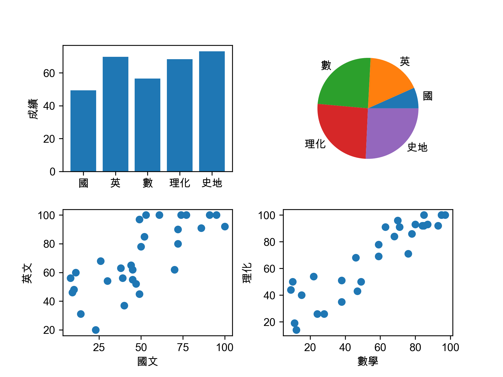
** 盒鬚圖 (Boxplot)
*請自行上網搜尋學習資源* ，[[file:images/scores.csv][下載這個檔案]]，畫出以下圖形(提示: Google 關鍵字 matplotlib, boxplot)
#+RESULTS:
#+CAPTION: 各科成績盒鬚圖
#+LABEL: fig:NpBoxplot
#+name: fig:NpBoxplot
#+ATTR_LATEX: :width 300
#+ATTR_ORG: :width 300
#+ATTR_HTML: :width 500
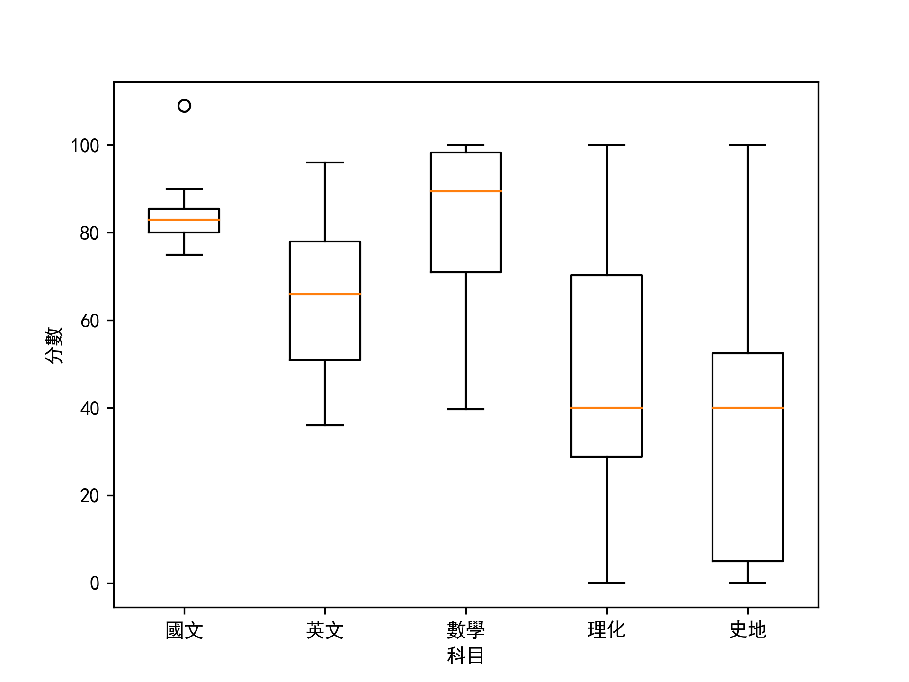
** 參考解答 :noexport:
*** Line
#+begin_src python -r -n :results output :exports both
import matplotlib.pyplot as plt
import numpy as np

x = np.arange(-10, 10, 0.5)
plt.clf()

a = 2
b = -3
c = -1

y = a*x**2 + b*x + c

plt.plot(x, y, 'bp:')
plt.xlabel('x')
plt.ylabel('y')

plt.grid(True)
#plt.show()   # for PyCharm
plt.savefig('images/eqcurve.png', dpi=300)

#+end_src

#+RESULTS:
#+CAPTION: 方程式曲線圖
#+LABEL: fig:EqCurve-sol
#+name: fig:EqCurve-sol
#+ATTR_LATEX: :width 400
#+ATTR_HTML: :width 400
#+ATTR_ORG: :width 400

*** 資料生成
#+begin_src python -r -n :results output :exports both
import numpy as np

# 生成随机分数，每科30个
scores = np.random.randint(0, 101, size=(30, 4))  # 不包括國文

# 单独生成國文分数，确保满足需求
chinese_scores = np.random.randint(0, 101, size=(30, 1))

# 将國文分数与其他科目分数合并
scores = np.hstack((chinese_scores, scores))

# 相关系数矩阵
correlation_matrix = np.array([[1.0, 0.8, 0.0, 0.0, 0.0],
                                [0.8, 1.0, 0.0, 0.0, 0.0],
                                [0.0, 0.0, 1.0, 0.9, 0.9],
                                [0.0, 0.0, 0.9, 1.0, 0.9],
                                [0.0, 0.0, 0.9, 0.9, 1.0]])

# 生成符合相关性的分数
adjusted_scores = np.dot(np.linalg.cholesky(correlation_matrix), scores.T).T

# 将分数限制在0到100之间
adjusted_scores = np.clip(adjusted_scores, 0, 100)

# 将分数转换为整数类型
adjusted_scores = adjusted_scores.astype(int)

# 打印每一科的分数
subjects = ['國', '英', '數', '理化', '史地']
for i, subject in enumerate(subjects):
    print(f'{subject}科的分数：{adjusted_scores[:, i]}')
#+end_src

#+RESULTS:
#+begin_example
國科的分数：[ 26  53  49  72  38  14  95  49 100  77  30  23  50  47  45  44  52  10
  72  11  61  91   8  39  70  74  40  45  86   9]
英科的分数：[ 68 100  97  80  63  31 100  45  92 100  54  20  78  52  62  65  85  48
  90  60 100 100  56  56  62 100  37  55  91  46]
數科的分数：[95 24 49 78 68 28 80 85 93 84 70 95 46 12 10 38  9 97 59 85 38 87 15 76
 71 59 22 11 47 63]
理化科的分数：[100  26  50  86  84  26  93  92  92  92  96 100  68  14  50  51  44 100
  69 100  35  93  40  71  91  78  54  19  43  91]
史地科的分数：[100  48  69  97  96  58 100  92  92  84  86 100  54  33  62  67  25 100
  82 100  73  91  35  82  83  75  45  41  48  76]
#+end_example
*** solution
#+begin_src python -r :results output :exports both
import matplotlib.pyplot as plt
import numpy as np
scores = [[ 26,  53,  49,  72,  38,  14,  95,  49, 100,  77,  30,  23,  50,  47,  45,  44,  52,  10,  72,  11,  61,  91,   8,  39,  70,  74,  40,  45,  86,   9,],
          [ 68, 100,  97,  80,  63,  31, 100,  45,  92, 100,  54,  20,  78,  52,  62,  65,  85,  48,  90,  60, 100, 100,  56,  56,  62, 100,  37,  55,  91,  46,],
          [ 95,  24,  49,  78,  68,  28,  80,  85,  93,  84,  70,  95,  46,  12,  10,  38,   9,  97,  59,  85,  38,  87,  15,  76,  71,  59,  22,  11,  47,  63,],
          [100,  26,  50,  86,  84,  26,  93,  92,  92,  92,  96, 100,  68,  14,  50,  51,  44, 100,  69, 100,  35,  93,  40,  71,  91,  78,  54,  19,  43,  91,],
          [100,  48,  69,  97,  96,  58, 100,  92,  92,  84,  86, 100,  54,  33,  62,  67,  25, 100,  82, 100,  73,  91,  35,  82,  83,  75,  45,  41,  48,  76,]]
subs = ['國', '英', '數', '理化', '史地']

scores = np.array(scores)

plt.rcParams['font.sans-serif'] = ['Arial Unicode MS'] # 步驟一（替換系統中的字型，這裡用的是Mac OSX系統）
plt.rcParams['axes.unicode_minus'] = False  # 步驟二（解決座標軸負數的負號顯示問題）

# 调整子图间距
plt.subplots_adjust(wspace=0.3, hspace=0.3)

plt.subplot(221)
plt.bar(subs, np.mean(scores, axis=1))
plt.ylabel('成績')

plt.subplot(222)
plt.pie(scores[:,0], labels=subs)

plt.subplot(223)
plt.scatter(scores[0], scores[1])
plt.xlabel('國文')
plt.ylabel('英文')

plt.subplot(224)
plt.scatter(scores[2], scores[3])
plt.xlabel('數學')
plt.ylabel('理化')

plt.savefig('images/matplotlibscores.png', dpi=300)
#+end_src

#+RESULTS:

#+CAPTION: 解答範例
#+LABEL: fig:MatplotlibScores-sol
#+name: fig:MatplotlibScores-sol
#+ATTR_LATEX: :width 300
#+ATTR_ORG: :width 300
#+ATTR_HTML: :width 500

#+begin_src python -r -n :results output :exports both
import matplotlib.pyplot as plt
import numpy as np
import math

#1
sc1 = np.random.randint(0, 100, size=[1, 150])
#2
sc2 = sc1.reshape(30, 5)
#3
sctitle = ['國文', '英文', '數學', '理化', '史地']
y_pos = np.arange(len(sctitle))
colors = ['b', 'g', 'r', 'c', 'm']
scavg = sum(sc2)/30

plt.rcParams['font.sans-serif'] = ['SimHei']
plt.rcParams['axes.unicode_minus'] = False

plt.barh(y_pos, scavg, color = colors, alpha=0.5)
plt.yticks(y_pos, sctitle)
plt.xlabel('分數')

plt.savefig('images/scobars.png')
#+end_src

#+RESULTS:
#+CAPTION: 分數長條圖
#+LABEL: fig:ScoreBars
#+name: fig:ScoreBars
#+ATTR_LATEX: :width 400
#+ATTR_HTML: :width 500
#+ATTR_ORG: :width 400
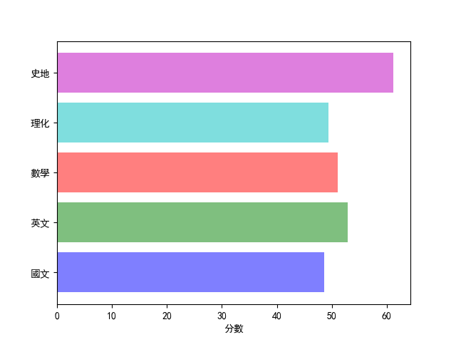
*** Scatter
#+begin_src python -r -n :results output :exports both
import matplotlib.pyplot as plt
import numpy as np
import math

#1
st = np.arange(1, 31, 1)

sc1 = np.random.randint(0, 100, size=[1, 150])
#2
sc2 = sc1.reshape(30, 5)
#3
st1 = sc2[:,0]
st2 = sc2[:,1]
print(st1)

plt.rcParams['font.sans-serif'] = ['SimHei']
plt.rcParams['axes.unicode_minus'] = False

plt.xlabel('國文')
plt.ylabel('英文')

plt.scatter(st1, st2, s=st ,label=st,  alpha=0.5)
plt.savefig('images/scosct.png')

#+end_src

#+RESULTS:
: [87 10 52 22 71 58  3 21 51  0 94 42 12 79 96 35  3 46 21 39 68 41 97 21
:  36 22 18 81 64 94]
#+CAPTION: 兩科成績的關係圖
#+LABEL: fig:ScoreScatter
#+name: fig:ScoreScatter
#+ATTR_LATEX: :width 400
#+ATTR_HTML: :width 500
#+ATTR_ORG: :width 400
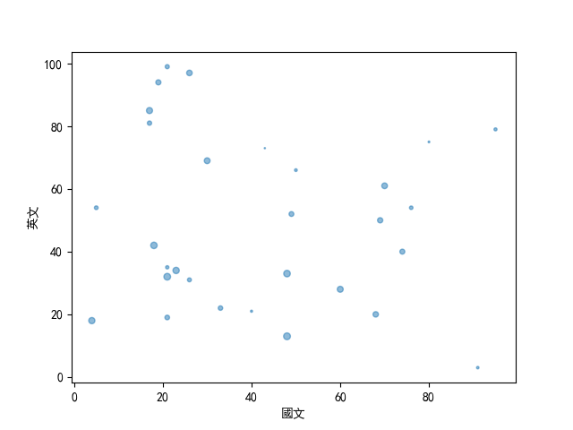
#+latex:\newpage
*** boxplot()
- 示範如何 Google boxplot
- https://ithelp.ithome.com.tw/articles/10202385
#+begin_src python -r -n :results output :exports both
import matplotlib.pyplot as plt
import numpy as np
sc = np.loadtxt('images/scores.csv', delimiter=',')
ms = np.mean(sc, axis=0)
plt.rcParams['font.sans-serif'] = ['SimHei']
plt.rcParams['axes.unicode_minus'] = False
sctitle = ('國文', '英文', '數學', '理化', '史地')
plt.xlabel('科目')
plt.ylabel('分數')

plt.boxplot(sc, tick_labels=sctitle)  # 註：Matplotlib 3.9 起 labels 參數改名為 tick_labels
plt.savefig('images/npbox.png', dpi=300)
#+end_src
#+latex:\newpage

* 其他視覺化模組
** pylab
#+BEGIN_SRC python -r -n :results output :exports both
import numpy as np
import pylab as pl

x = np.arange(0.0, 2.0*np.pi, 0.01)
print("x:", x[:5])
y = np.sin(x)
print("y:", y[:5])

pl.plot(x,y)
pl.xlabel('x')
pl.ylabel('y')
pl.title('sin')
pl.savefig("images/sinPlot.png")
#+END_SRC

#+RESULTS:
: x: [0.   0.01 0.02 0.03 0.04]
: y: [0.         0.00999983 0.01999867 0.0299955  0.03998933]
#+CAPTION: sinPlot
#+LABEL:fig:sinPlot
#+name: fig:sinPlot
#+ATTR_LATEX: :width 300
#+ATTR_ORG: :width 300
[[file:images/sinPlot.png]]
** Bokeh
- 這是一個互動式視覺化模組，可以產生 HTML 檔案來顯示圖形。
- 這裡只示範最簡單的範例，更多功能請參考官網[[https://docs.bokeh.org/en/latest/][Bokeh Documentation]]
*** 簡單範例
#+BEGIN_SRC python -r -n :results output :exports both
import numpy as np
from bokeh.plotting import figure, show
from bokeh.io import output_file, save

N = 4000

x = np.random.random(size=N) * 100
y = np.random.random(size=N) * 100
radii = np.random.random(size=N) * 1.5
colors = [
    "#%02x%02x%02x" % (r, g, 150)
    for r, g in zip(
        np.floor(50 + 2 * x).astype(int),
        np.floor(30 + 2 * y).astype(int)
    )
]

# 輸出到 HTML 檔案
output_file('bokehPlot.html', mode='inline')
# 在PyCharm環境中最好明確指定存檔路徑
# Windows範例:
#output_file('c:\path\to\your\directory\bokehPlot.html', mode='inline')
# MacOS範例:
#output_file('/Users/yourname/path/to/your/directory/bokehPlot.html', mode='inline')
p = figure(title="Basic Title", width=500, height=500)  # 新版可用 width/height
p.circle(x, y, radius=radii, fill_color=colors,
         fill_alpha=0.6, line_color=None)
show(p) # for PyCharm IDE
save(p) #存檔
#+END_SRC

#+RESULTS:
file:./bokehPlot.html
** seaborn
- 這是一個基於 Matplotlib 的高階視覺化模組，提供更簡單的 API 來創建美觀的統計圖表。
- 更多功能請參考官網[[https://seaborn.pydata.org/]]
*** 簡單範例
#+BEGIN_SRC python -r -n :results output :exports both
import seaborn as sns
sns.set_theme(style="ticks")  # 註：seaborn 0.13 起 sns.set() 僅為 set_theme() 的別名，建議改用 set_theme()

#Load the example dataset for Anscombe's quartet
df = sns.load_dataset("anscombe")

# Show the results of a linear regression within each dataset
sns.lmplot(x="x", y="y", col="dataset", hue="dataset", data=df, col_wrap=2, ci=None, palette="muted", height=4, scatter_kws={'s' :50,'alpha':1})

import matplotlib.pyplot as plt
#sns.sns_plot.savefig("images/seabornPlot.png")
plt.savefig("images/seabornPlot.png")
#+END_SRC

#+RESULTS:

#+CAPTION: seabornPlot
#+LABEL:fig:seabornPlot
#+name: fig:seabornPlot
#+ATTR_LATEX: :width 300
#+ATTR_ORG: :width 300
#+ATTR_HTML: :width 500
[[file:images/seabornPlot.png]]
** Altair
- Altair 是一個基於宣告式語法的 Python 視覺化庫，使用 Vega 和 Vega-Lite 作為後端，適合用於創建交互式圖表。
- 更多功能請參考官網[[https://altair-viz.github.io/]]
*** 簡單範例
#+BEGIN_SRC python -r -n :results output :exports both
import altair as alt
from vega_datasets import data

cars = data.cars()

chart = (
    alt.Chart(cars)
    .mark_point()
    .encode(
        x='Horsepower',
        y='Miles_per_Gallon',
        color='Origin'
    )
    .interactive()
)

# 存成 HTML
chart.save('altairPlot.html')
#+END_SRC

#+RESULTS:
#+CAPTION: altairPlot
#+LABEL:fig:altairPlot
#+name: fig:altairPlot
#+ATTR_LATEX: :width 300
#+ATTR_ORG: :width 300
[[file:./altairPlot.html]]

#+latex:\newpage

* Footnotes

[fn:1] [[https://medium.com/@jemmy1234/matplotlib-%E7%B0%A1%E4%BB%8B-857323964e2d][Matplotlib 簡介]]

[fn:2] [[https://matplotlib.org/stable/api/_as_gen/matplotlib.pyplot.subplot.html][matplotlib.pyplot.subplot]]
