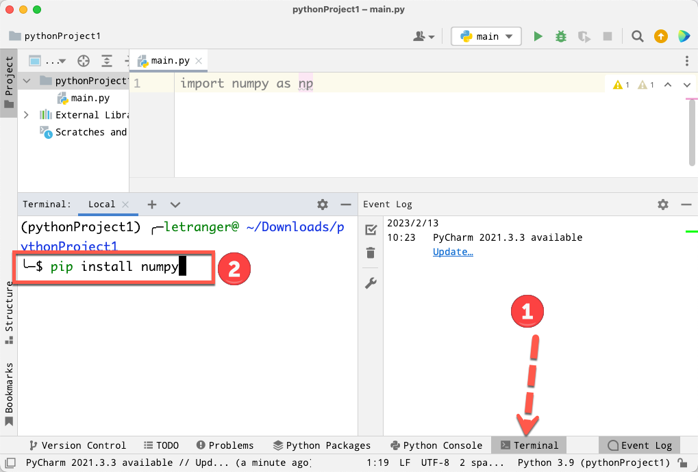
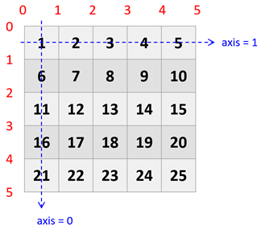
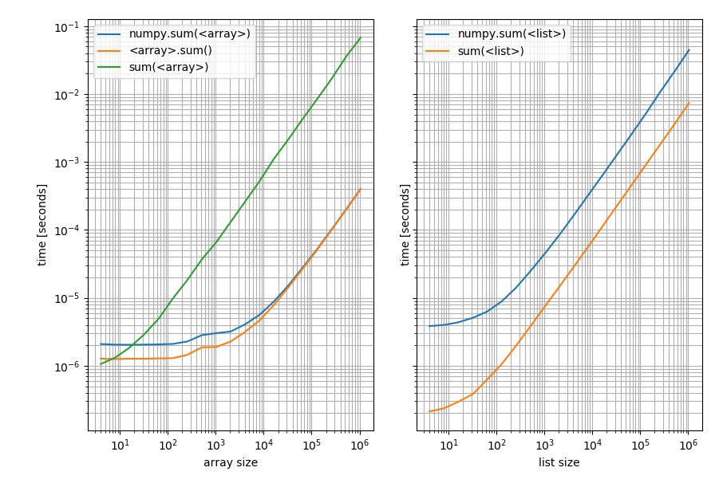
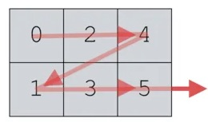
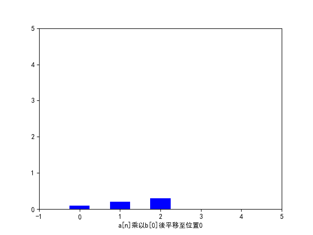
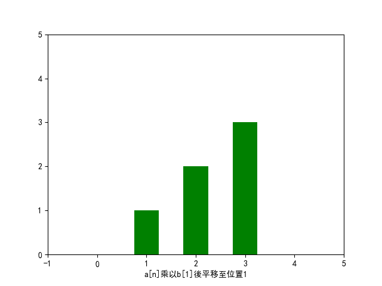
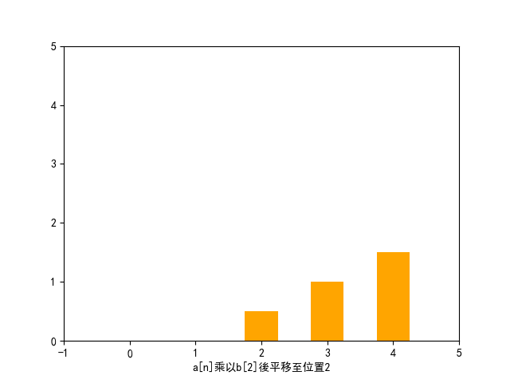
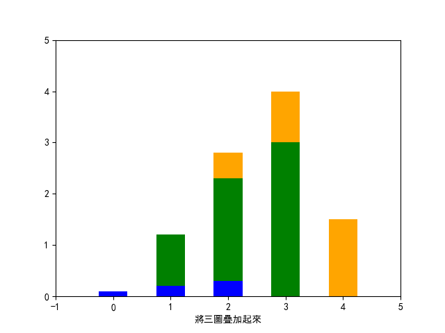
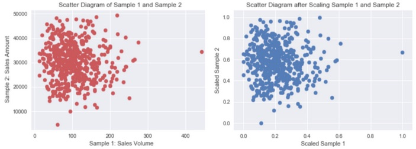

#+title: Numpy
#+SUBTITLE: TNFSH Python教材
# -*- org-export-babel-evaluate: nil -*-
#+INCLUDE: ../pdf.org
#+PROPERTY: header-args :eval never-export
#+TAGS: AI, Python
#+EXCLUDE_TAGS: noexport
#+OPTIONS: toc:2 ^:nil num:3
#+OPTIONS: H:4
#+LATEX:\newpage
#+HTML_HEAD: <link rel="stylesheet" type="text/css" href="../css/muse.css" />
#+HTML_HEAD_EXTRA: 
#+begin_export html

#+end_export
* 為此 org 啟用 venv :noexport:
#+begin_src shell -r -n :results output :exports both
python3 -m venv /tmp/venv
source /tmp/venv/bin/activate
echo $VIRTUAL_ENV
ls venv
#+end_src

#+RESULTS:
: /tmp/venv

#+BEGIN_SRC emacs-lisp :session :exports no
(pyvenv-activate "/tmp/venv")
(setq org-babel-python-command "/tmp/venv/bin/python3")
#+END_SRC

#+RESULTS:
: /tmp/venv/bin/python3

#+begin_src python -r -n :async :results output :exports both :session python
print('test')
#+end_src

#+RESULTS:
: test

* Numpy 是什麼？怎麼用？
** Numpy 簡介
- NumPy 是 Python 語言的一個擴充程式庫。支援高階大量的維度陣列與矩陣運算，此外也針對陣列運算提供大量的數學函式函式庫。
- Numpy 主要用於資料處理上。Numpy 底層以 C 和 Fortran 語言實作，所以能快速操作多重維度的陣列。
- 當 Python 處理龐大資料時，其原生 list 效能表現並不理想（但可以動態存異質資料），而 Numpy 具備平行處理的能力，可以將操作動作一次套用在大型陣列上。
- Python 多數重量級的資料科學相關套件（例如：Pandas、SciPy、Scikit-learn 等）都幾乎是奠基在 Numpy 的基礎上。因此學會 Numpy 對於往後學習其他資料科學相關套件打好堅實的基礎。
- NumPy 的前身 Numeric 最早是由 Jim Hugunin 與其它協作者共同開發，2005 年，Travis Oliphant 在 Numeric 中結合了另一個同性質的程式庫 Numarray 的特色，並加入了其它擴充功能而開發了 NumPy。NumPy 為開放原始碼並且由許多協作者共同維護開發。[fn:2]
- 延伸閱讀:
  - [[https://numpy.org/doc/stable/reference/routines.array-creation.html#][NumPy官網]]
  - [[https://hsinchengchao.medium.com/%E7%82%BA%E4%BB%80%E9%BA%BC%E8%A6%81%E7%94%A8-numpy-c829e0049977][為什麼要用 Numpy？]]

** 使用 Numpy 模組
和所有其他的第三方模組一樣，使用 Numpy 前需要先安裝並匯入模組
*** 安裝
#+begin_src shell -r -n :results output :exports both
pip install numpy
#+end_src
**** PyCharm
如果你是使用 PyCharm，可以在 PyCharm 的 Terminal 視窗中執行上述安裝指令
#+CAPTION: PyCharm
#+LABEL: fig:NumpyInstallPyCharm
#+name: fig:NumpyInstallPyCharm
#+ATTR_LATEX: :width 300
#+ATTR_ORG: :width 300
#+ATTR_HTML: :width 500

**** Colab
如果你是使用 Colab，可以在 Colab 的程式碼區塊中執行安裝指令
#+begin_src python -r -n :results output :exports both
!pip install numpy
#+end_src

*** 匯入
- 使用模組裡的函式要加模組名稱
#+BEGIN_SRC python
import numpy
#+END_SRC
- 匯入 numpy 模組並使用 np 作為簡寫，這是 Numpy 官方倡導的寫法
#+BEGIN_SRC python
import numpy as np
#+END_SRC

* NumPy 陣列
NumPy 的核心資料結構是 ndarray (N-dimensional array)，也就是多維陣列。你可以把它當成是Python裡的二維清單(list)或矩陣(matrix)，但它更強大且高效能。
** NDArray
- Numpy 中的一維 ndarray 稱為 vector(向量)
- Numpy 中的多維資料型別稱為 ndarray(陣列)
- Numpy 的重點在於陣列的操作，其所有功能特色都建築在同質且多重維度的 ndarray（N-dimensional array）上。
- axis 0, axis 1, axis 2:
  - 一維時 axis 0 為 x 軸
  - 二維時 axis 0 為 y 軸
  #+CAPTION: Axis in ndarray
  #+LABEL: fig:ndaryAix
  #+name: fig:ndaryAix
  #+ATTR_LATEX: :width 200
  #+ATTR_ORG: :width 200
  #+ATTR_HTML: :width 300
  

** 陣列? 矩陣?
在這裡我把 numpy 的 ndarray 稱為陣列而非矩陣，因為 numpy 裡另有一種 matrix(矩陣)的資料型態，二者的差異如下[fn:3]
*** 結構與維度
- ndarray：ndarray 是 NumPy 的核心數據結構，它可以是多維數組，不局限於二維。可以是一維、二維、甚至更高維的數據結構。
- matrix：matrix 是一種專門為線性代數設計的二維數據結構。無論輸入的數據形狀如何，matrix 永遠是二維的。即使是一維向量，轉換為 matrix 後也會被視作一個二維矩陣。
*** 操作符行為差異
- ndarray：ndarray 的 * 操作符執行的是元素對應相乘（element-wise multiplication），這適用於所有數組維度。
- matrix：matrix 的 * 操作符執行的是矩陣乘法，即線性代數中的點積(dot)操作。
*** 示例
#+begin_src python -r -n :results output :exports both
import numpy as np

# 使用 ndarray
A = np.array([[1, 2], [3, 4]])
B = np.array([[5, 6], [7, 8]])
print('=== A ===')
print(A)
print('=== B ===')
print(B)

print('=== A * B ===')
print(A * B)  # 元素對應相乘

# 使用 matrix
A_matrix = np.matrix([[1, 2], [3, 4]])
B_matrix = np.matrix([[5, 6], [7, 8]])
print('=== A_matrix * B_matrix ===')
print(A_matrix * B_matrix)  # 矩陣乘法
#+end_src

#+RESULTS:

** 建立 ndarray
*** 一維陣列(vector)
先來看看最簡單的一維陣列(vector)的建立方式，基本上有兩種方式可以生成 ndarray
**** 可以將 python 的 list 或 tuple 轉成 numpy ndarray
#+BEGIN_SRC python -r -n:results output :exports both :wrap
import numpy as np
np1 = np.array( [1, 2, 3, 4] )
print(np1)
#+END_SRC

#+RESULTS:
: [1 2 3 4]
**** 使用 np.arange( ) 方法
語法： =np.arange([start,] stop[, step][, dtype])= ，類似 Python 的 =range()= ，但回傳 ndarray 且支援浮點數。
- start：起始值，預設為 0
- stop：結束值（不包含）
- step：間隔，預設為 1（可以是小數）
- dtype：指定回傳陣列的資料型別
#+BEGIN_SRC python -r -n :results output :exports both
import numpy as np

np2 = np.arange(5)
print("=====np2=====")
print(np2)
np3 = np.arange(1, 4, 0.5)
print("=====np3=====")
print(np3)
#+END_SRC

  #+RESULTS:
  : =====np2=====
  : [0 1 2 3 4]
  : =====np3=====
  : [1.  1.5 2.  2.5 3.  3.5]
**** np.arange() v.s. range()
這裡我們來比較一下 np.arange() 與 python 內建的 range() 函數有什麼不同：
+ range()為 python 內建函數
+ range() 回傳的是 range object，而 np.arange() 回傳的是 numpy.ndarray
+ range()不支援 step 為小數，np.arange()支援 step 為小數
**** 簡單的陣列運算
Numpy陣列最大的優勢在於它可以對整個陣列進行運算，而不需要使用迴圈逐一處理每個元素，這使得程式碼更簡潔且 **執行效率更高** 。

是的，它會快很多！因為 Numpy 在底層是用 C 語言實作的，能夠更有效率地處理大量資料運算。
#+begin_src python -r -n :results output :exports both
import numpy as np
np1 = np.array([1, 2, 3])
np2 = np.array([3, 4, 5])
# 陣列相加
print(np1 + np2) # [4 6 8]
#+end_src

#+RESULTS:
: [4 6 8]
*** 二維陣列
接下來我們來看看二維陣列的建立方式，最簡單的方式就是直接把Python的二維清單(list of list)轉成 ndarray

在面對二維陣列時，我們通常會使用 row(列) 和 column(行) 來描述陣列的結構。在 NumPy 中，二維陣列的第一個維度代表 row，而第二個維度代表 column。
#+BEGIN_SRC python -r -n :results output :exports both
import numpy as np
np4 = np.array( [[1, 2, 4], [3, 4, 5]] )
# 查看整個陣列
print(np4)
# 查看陣列的形狀(shape)與內容
print("shape:", np4.shape)
print("np4:\n", np4)
# 取出第0列(row)與第0行(column)
print("取出第0列(row):",np4[0])
print("取出第0行(column):",np4[:, 0])
#+END_SRC
  #+RESULTS:
  : [[1 2 4]
  :  [3 4 5]]
  : shape: (2, 3)
  : np4:
  :  [[1 2 4]
  :  [3 4 5]]
  : 取出第0列(row): [1 2 4]
  : 取出第0行(column): [1 3]
*** 陣列形狀(Shape)的自由轉換
在處理多維陣列時，經常需要改變陣列的形狀以符合不同的運算需求。NumPy 提供了 reshape() 方法來實現這一功能。以下範例展示如何將一個一維陣列轉換為三維陣列：
#+BEGIN_SRC python -r -n :results output :exports both
import numpy as np
np7 = np.arange(24)
print('原始 np7:\n',np7)

# 重塑為 2x3x4 的三維陣列
np7 = np.arange(24).reshape(2, 3, 4)
print('np7:\n',np7)

# 重塑為 2x3x4 的三維陣列，元素為奇數
np8 = np.arange(13, 60, 2).reshape(2, 3, 4)
print("np8:\n", np8)
print(np8.ndim, np8.shape, np8.dtype)
#+END_SRC

  #+RESULTS:
  #+begin_example
  原始 np7:
   [ 0  1  2  3  4  5  6  7  8  9 10 11 12 13 14 15 16 17 18 19 20 21 22 23]
  np7:
   [[[ 0  1  2  3]
    [ 4  5  6  7]
    [ 8  9 10 11]]

   [[12 13 14 15]
    [16 17 18 19]
    [20 21 22 23]]]
  np8:
   [[[13 15 17 19]
    [21 23 25 27]
    [29 31 33 35]]

   [[37 39 41 43]
    [45 47 49 51]
    [53 55 57 59]]]
  3 (2, 3, 4) int64
  #+end_example
*** 隨機陣列
有些時候我們需要產生隨機數據來模擬資料或進行測試，例如：
- 模擬測試資料
- 初始化神經網路的權重(這個在人工智慧的程式實作中很常見)
- 隨機抽樣
Numpy 提供了多種方法來生成隨機陣列，以下介紹幾種常用的方法
**** numpy.random.randint()
顧名思義，這個函式是用來產生 **隨機整數** 的陣列

- 語法：numpy.random.randint(low, high=None, size=None, dtype='l')
- 函式的作用是，傳回一個隨機整型數，範圍從低（包括）到高（不包括），即[low, high)。
- 如果沒有寫引數 high 的值，則返回[0,low)的值。
#+BEGIN_SRC python -r -n :results output :exports both
import numpy as np
np.random.seed(0)

x1 = np.random.randint(10, size=6)
x2 = np.random.randint(10, size=(3,4))
x3 = np.random.randint(10, size=(3,4,5))
print(x1)
print(x2)
print(x3)
#+END_SRC

#+RESULTS:
#+begin_example
[5 0 3 3 7 9]
[[3 5 2 4]
 [7 6 8 8]
 [1 6 7 7]]
[[[8 1 5 9 8]
  [9 4 3 0 3]
  [5 0 2 3 8]
  [1 3 3 3 7]]

 [[0 1 9 9 0]
  [4 7 3 2 7]
  [2 0 0 4 5]
  [5 6 8 4 1]]

 [[4 9 8 1 1]
  [7 9 9 3 6]
  [7 2 0 3 5]
  [9 4 4 6 4]]]
#+end_example
**** numpy.random.rand()
如果你需要產生 **隨機浮點數** 的陣列，可以使用 numpy.random.rand() 函式，它會產生在 [0.0, 1.0) 範圍內的均勻分布隨機浮點數。
***** 範例
#+BEGIN_SRC python -r -n :results output :exports both
import numpy as np

np.random.seed(9627) #設置相同變數，每次生成相同亂數
np8 = np.random.random((3, 2)) #陣列大小以tuple表示
print('np8:\n', np8)
# 四個人擲骰子，每人擲兩次
np9 = np.random.randint(1, 7, size=[4, 2]) #陣列大小以list表示
print('np9:\n', np9)
#+END_SRC

  #+RESULTS:
  : np8:
  :  [[0.7263954  0.71063088]
  :  [0.07725825 0.11562424]
  :  [0.57923875 0.85345365]]
  : np9:
  :  [[5 6]
  :  [2 2]
  :  [5 5]
  :  [5 2]]
*** 0/1 陣列
有些時候我們需要建立全為 0 或全為 1 的陣列，Numpy 提供了 np.zeros() 和 np.ones() 兩個函式來達成這個目的
- np.zeros: np.zeros( (陣列各維度大小用逗號區分) )：建立全為 0 的陣列，可以小括號定義陣列的各個維度的大小
  #+BEGIN_SRC python -r -n :results output :exports both
import numpy as np

zeros = np.zeros( (3, 5) )
print("zeros=>\n{0}".format(zeros))
#+END_SRC
  #+RESULTS:
  : zeros=>
  : [[0. 0. 0. 0. 0.]
  :  [0. 0. 0. 0. 0.]
  :  [0. 0. 0. 0. 0.]]
- np.ones: np.ones( (陣列各維度大小用逗號區分) )：用法與 np.zeros 一樣
  #+BEGIN_SRC python -r -n :results output :exports both
import numpy as np

ones = np.ones( (4, 3) )
print("ones=>\n{0}".format(ones))
#+END_SRC
  #+RESULTS:
  : ones=>
  : [[1. 1. 1.]
  :  [1. 1. 1.]
  :  [1. 1. 1.]
  :  [1. 1. 1.]]

** 匯入/匯出
程式是用來處理資料的，而資料通常是存放在檔案中，有時我們要從電腦裡讀取原始資料用Numpy來分析運算，在處理完畢後，還要將結果存回檔案中。因此 Numpy 提供了方便的函式來進行資料的匯入與匯出
*** 將 ndarray 內容匯出到檔案
- Numpy支援多種檔案格式的匯出，其中兩種大家比較熟悉的格式是 csv與txt，
- 至於.npy是 Numpy 自有的二進位格式，適合用來儲存大型陣列資料，這種檔案格式可以保留陣列的形狀與資料型態，讀取速度也較快。但你只能用 Numpy 來讀取這種格式的檔案，無法用記事本等文字編輯器來查看內容(不信你可以試試看)。

以下是把處理後的 ndarray 內容匯出到不同格式檔案的範例
#+begin_src python -r -n  :results output :exports both
import numpy as np
ary = np.random.randint(10, size=(3,4))
print(ary)
np.save('ndarray', ary)
np.savetxt('ndarray.txt', ary)
np.savetxt('ndarray.csv', ary, delimiter=',')
#+end_src

#+RESULTS:
: [[2 7 3 8]
:  [3 7 9 0]
:  [5 4 2 6]]

#+begin_src shell -r -n :results output :exports both
ls ndarray*
cat ndarray.npy
cat ndarray.txt
cat ndarray.csv
#+end_src
*** 將資料由檔案匯入 ndarray
- 將資料由檔案匯入 ndarray 也很簡單，分別使用 np.load() 與 np.loadtxt() 函式來讀取不同格式的檔案
#+begin_src python -r -n :results output :exports both
import numpy as np
ary1 = np.load('ndarray.npy')
print(ary1)
ary2 = np.loadtxt('ndarray.txt')
print(ary2)
ary3 = np.loadtxt('ndarray.csv', delimiter=',')
print(ary3)
#+end_src

#+RESULTS:
: [[2 7 3 8]
:  [3 7 9 0]
:  [5 4 2 6]]
: [[2. 7. 3. 8.]
:  [3. 7. 9. 0.]
:  [5. 4. 2. 6.]]
: [[2. 7. 3. 8.]
:  [3. 7. 9. 0.]
:  [5. 4. 2. 6.]]

** [課堂練習]陣列生成 :TNFSH:
隨機產生一組 10*5 個 0~100 的陣列，模擬成一個班級的某次考試成績(10 人*5 科)。

** 自行研究
請自行 google 以下 numpy 的函數用法
- eye()
- diag()
- tile()
#+BEGIN_SRC python -r -n :results output :exports both
# 引入 numpy 模組
import numpy as np

# create identity matrix
ary1 = np.eye(3)
print(ary1)

# create diagonal array
ary2 = np.diag((2,1,4,6))
print(ary2)
#
ary3 = np.array([range(i, i+3) for i in [2,4,6]])
print(ary3)

# tile
ary4 = np.array([0,1,2])
print(np.tile(ary4,2))
print(np.tile(ary4,(2,2)))
ary5 = np.array([[1,2],[6,7]])
print(np.tile(ary5,3))
print(np.tile(ary5,(2,2)))
#+END_SRC

#+RESULTS:
#+begin_example
[[1. 0. 0.]
 [0. 1. 0.]
 [0. 0. 1.]]
[[2 0 0 0]
 [0 1 0 0]
 [0 0 4 0]
 [0 0 0 6]]
[[2 3 4]
 [4 5 6]
 [6 7 8]]
[0 1 2 0 1 2]
[[0 1 2 0 1 2]
 [0 1 2 0 1 2]]
[[1 2 1 2 1 2]
 [6 7 6 7 6 7]]
[[1 2 1 2]
 [6 7 6 7]
 [1 2 1 2]
 [6 7 6 7]]
#+end_example

* 陣列運算效能比較
這個例子只是讓大家體會 Numpy 陣列運算的效能優勢，實際上在處理大型資料時，Numpy 的效能優勢會更明顯
** Numpy 計算時間比較
自行比較以下兩個版本的執行時間
*** PyCharm
於 PyCharm 環境中計算時間的方式
#+begin_src python -r :results output :exports both :async :session test
import timeit

print(timeit.timeit(stmt='import numpy as np;x = np.arange(100);x**3'))
print(timeit.timeit(stmt='for i in range(100): a=i**3'))
#+end_src

#+RESULTS:
: 0.8354589159716852
: 3.117140957969241
*** for emacs environment :noexport:
#+begin_src emacs-lisp
(setq org-babel-python-command "ipython --no-banner --classic --no-confirm-exit")
#+end_src
*** Colab
於 Colab 環境中計算時間的方式
#+begin_src python -r -n :results output :exports both
%timeit [i**3 for i in range(1000)]
#+end_src

#+begin_src python -r -n :results output :exports both
import numpy as np
ar = np.arange(1000)
%timeit ar**3
#+end_src

* 陣列走訪(traversal)
不論你在學習哪一種資料結構，走訪(traversal)都是一個重要的概念。走訪是指依序訪問資料結構中的每一個元素。在 Numpy 中，走訪陣列的方式有很多種，以下介紹幾種常見的方法
** vector 走訪
這個其實就和我們在 Python 中走訪 list 差不多
#+begin_src python -r -n :results output :exports both
import numpy as np
arr = np.array([10, 20, 30, 40, 50])
# 遍歷、輸出每個元素
for elem in arr:
    print(elem)
#+end_src

#+RESULTS:
: 10
: 20
: 30
: 40
: 50
** 二維陣列走訪
在走訪二維陣列時，我們可以使用多種方法來達成，以下介紹幾種常見的方法
*** nested for loop
#+begin_src python -r -n :results output :exports both
import numpy as np

arr2d = np.array([[1, 2, 3], [4, 5, 6], [7, 8, 9]])
# 遍歷每一行
for row in arr2d:
    print("Row:", row)

    # 遍歷行中的每個元素
    for elem in row:
        print(elem)
#+end_src
*** nditer
這種走訪就是比較 Numpy 風格的寫法，它的好處是可以只用一個迴圈就可以走訪整個陣列，不管這個陣列是幾維的
#+begin_src python -r -n :results output :exports both
import numpy as np

arr2d = np.array([[1, 2, 3], [4, 5, 6], [7, 8, 9]])
for elem in np.nditer(arr2d):
    print(elem)
#+end_src

#+RESULTS:
: 1
: 2
: 3
: 4
: 5
: 6
: 7
: 8
: 9
*** 走訪過程中取得 index
在某些情況下，我們在走訪陣列時，除了需要元素的值外，還需要知道該元素在陣列中的位置(index)。以下介紹兩種常見的方法來達成這個目的
**** 常見的做法
#+begin_src python -r -n :results output :exports both
import numpy as np

arr2d = np.array([[1, 2, 3], [4, 5, 6], [7, 8, 9]])

for i in range(len(arr2d)):
    for j in range(len(arr2d[i])):
        print(f"Index ({i}, {j}) - Value: {arr2d[i, j]}")
#+end_src

#+RESULTS:
: Index (0, 0) - Value: 1
: Index (0, 1) - Value: 2
: Index (0, 2) - Value: 3
: Index (1, 0) - Value: 4
: Index (1, 1) - Value: 5
: Index (1, 2) - Value: 6
: Index (2, 0) - Value: 7
: Index (2, 1) - Value: 8
: Index (2, 2) - Value: 9
**** 使用 ndenumerate 獲取索引
這是另一種比較 Numpy 風格的寫法，使用 np.ndenumerate() 函式可以同時獲取元素的索引和值

這裡的 np.ndenumerate() 函式會傳回一個迭代器，該迭代器在每次迭代時會產生一個包含索引和值的元組(tuple)。索引本身也是一個元組，表示元素在多維陣列中的位置
#+begin_src python -r -n :results output :exports both
import numpy as np

arr2d = np.array([[1, 2, 3], [4, 5, 6], [7, 8, 9]])

for index, elem in np.ndenumerate(arr2d):
    print(f"Index: {index} - Value: {elem}")
#+end_src

#+RESULTS:
: Index: (0, 0) - Value: 1
: Index: (0, 1) - Value: 2
: Index: (0, 2) - Value: 3
: Index: (1, 0) - Value: 4
: Index: (1, 1) - Value: 5
: Index: (1, 2) - Value: 6
: Index: (2, 0) - Value: 7
: Index: (2, 1) - Value: 8
: Index: (2, 2) - Value: 9

** [課堂練習]成績模擬 :TNFSH:
- 隨機產生一組 10*5 的成績陣列(20 <= 分數 <= 99)
- 以 for 迴圈以如下格式輸出結果，最前面加上學號(從 1 號開始編號)，各成績間以 tab 相隔對齊
說明: 為了確保大家在使用 numpy 隨機生成分數時能產生相同的結果，請在你的程式碼中加入這段程式。
#+begin_src python -r -n :results output :exports both
import numpy as np

np.random.seed(9627) #設置相同變數，每次生成相同亂數

#+end_src
輸出結果範例
#+RESULTS:
#+begin_example
 1: 73 91 28 43 74
 2: 98 36 32 55 89
 3: 52 60 51 25 34
 4: 88 89 64 82 99
 5: 83 47 69 27 32
 6: 93 22 91 29 20
 7: 64 22 32 85 89
 8: 20 25 98 61 48
 9: 98 32 61 69 78
10: 39 42 55 90 98
#+end_example
*** solution :noexport:
#+begin_src python -r -n :results output :exports both
import numpy as np

np.random.seed(9627)

sc = np.random.randint(20, 100, size=(10, 5))

for no, row in enumerate(sc, start=1):
    print(f'{no:2d}: ', end='')
    for s in row:
        print(f'{s} ', end='')
    print()

#+end_src
** 陣列維度與形狀的轉換
當你的程式中已經存在 ndarray 時，Numpy 提供了許多方便的函式來進行陣列運算，這些函式可以讓你輕鬆地對整個陣列進行數學運算，而不需要使用迴圈逐一處理每個元素。以下介紹幾種常見的陣列運算
*** 陣列變形:reshape()
1. reshape()
2. transpose()
**** reshape
reshape() 可以用來改變陣列的形狀，而不改變陣列的元素。這在處理高維數據時非常有用。以下範例將一個一維陣列重新塑造成一個 2x4 的二維陣列：

語法： =ndarray.reshape(shape)= 或 =np.reshape(a, newshape)=
- shape 中可用 =-1= 讓 NumPy 自動計算該維度大小，例如 =a.reshape(2, -1)= 表示「2 列，行數自動算」
- 元素總數必須跟原陣列相同，否則會報錯
#+BEGIN_SRC python -r -n :results output :exports both
import numpy as np
x = np.arange(2,10)
print(x.reshape(2,4))
#+END_SRC

#+RESULTS:
: [[2 3 4 5]
:  [6 7 8 9]]
**** 攤平與轉置（Flattening and Transpose）
在進行多維陣列操作時，常常需要將陣列攤平（即轉換為一維陣列, 常見於 AI 模型輸出層之前）或將陣列的行與列進行互換。NumPy 提供了兩個強大的方法來實現這些操作，分別是 ravel() 和 transpose()。

=ndarray.ravel([order])= — 將多維陣列攤平為 1D 陣列：
- order='C'（預設）：row-major，先走行方向（就是一列一列讀）
- order='F'：column-major，先走列方向（就是一行一行讀）
- 跟 =flatten()= 的差別：ravel() 盡量回傳 view（不複製資料，比較快），flatten() 一定回傳 copy
#+BEGIN_SRC python -r -n :results output :exports both
import numpy as np
ac = np.array([np.arange(1,6),np.arange(10,15)])
print(ac)
print(ac.ravel()) # row first
print(np.ravel(ac))
print(ac.ravel('F')) #column first
print(np.ravel(ac, 'F'))
print(ac.T)
#+END_SRC

#+RESULTS:
#+begin_example
[[ 1  2  3  4  5]
 [10 11 12 13 14]]
[ 1  2  3  4  5 10 11 12 13 14]
[ 1  2  3  4  5 10 11 12 13 14]
[ 1 10  2 11  3 12  4 13  5 14]
[ 1 10  2 11  3 12  4 13  5 14]
[[ 1 10]
 [ 2 11]
 [ 3 12]
 [ 4 13]
 [ 5 14]]
#+end_example
**** 新增維度（Add a dimension）
在將資料丟入 AI 模型訓練前，有時我們需要在陣列中添加新的維度以配合模型的輸入要求。使用 np.newaxis 可以在指定的位置新增一個維度。

=np.newaxis= 其實就等同於 =None= ，用來幫陣列多加一個維度：
- =a[np.newaxis, :]= — 將 1D 陣列轉為 row vector，shape 從 =(n,)= 變成 =(1, n)=
- =a[:, np.newaxis]= — 將 1D 陣列轉為 column vector，shape 從 =(n,)= 變成 =(n, 1)=
#+BEGIN_SRC python -r -n :results output :exports both
import numpy as np
ar = np.array([14,15,16])
print(ar)
print(ar.shape)

ar = ar[:,np.newaxis] ## 新增一個維度，變為 (3, 1)
print(ar.shape)
print(ar)
#+END_SRC

#+RESULTS:
: [14 15 16]
: (3,)
: (3, 1)
: [[14]
:  [15]
:  [16]]
** 索引/切片
*** 索引(Indexing)、切片(Slicing)
這部份和Python的 list 索引、切片用法很像，但多了很多功能

索引(Indexing)的用途不外乎就是為了要從陣列和陣列中取值，但除此之外有很多種功能！可以取出連續區間，還可以間隔取值！[fn:4]
**** 基本索引
ndarray 可以通過類似 Python 列表的方式進行索引。例如，對一個一維陣列可以通過下標來獲取元素：
#+begin_src python -r -n :results output :exports both
import numpy as np

# 創建一個一維數組
arr = np.array([10, 20, 30, 40, 50])

# 取出第一個元素
print(arr[0])  # 輸出 10

# 取出最後一個元素
print(arr[-1])  # 輸出 50
#+end_src

對於多維數組，可以使用逗號分隔不同維度的索引：
#+begin_src python -r -n :results output :exports both
import numpy as np
# 創建一個二維數組
arr2d = np.array([[1, 2, 3], [4, 5, 6], [7, 8, 9]])

# 取出第一行第二列的元素
print(arr2d[0, 1])  # 輸出 2

# 取出最後一行最後一列的元素
print(arr2d[-1, -1])  # 輸出 9
#+end_src
**** 切片
與 Python 列表類似，ndarray 也可以通過切片來提取數組的子集。切片的語法:
#+begin_src python :eval no
ndarray[start:stop:step]
#+end_src
，其中：
- start 是切片的起始索引（包含）。
- stop 是切片的結束索引（不包含）。
- step 是切片的步長（默認為 1）。
***** 一維切片
#+begin_src python -r -n :results output :exports both
import numpy as np
arr = np.array([10, 20, 30, 40, 50])
# 提取從第二個到第四個元素
print(arr[1:4])  # 輸出 [20 30 40]
# 每隔一個元素提取
print(arr[::2])  # 輸出 [10 30 50]
#+end_src
***** 二維切片
#+begin_src python -r -n :results output :exports both
import numpy as np
arr2d = np.array([[1, 2, 3], [4, 5, 6], [7, 8, 9]])
# 提取前兩行的前兩列
print(arr2d[:2, :2])  # 輸出 [[1 2]
# 提取第二列
print(arr2d[:, 1])  # 輸出 [2 5 8]
# 提取最後一行
print(arr2d[-1, :])  # 輸出 [7 8 9]
#+end_src
***** 條件切片
在篩選符合條件的元素時非常有用
#+begin_src python -r -n :results output :exports both
import numpy as np
arr = np.array([10, 20, 30, 40, 50])

# 找出所有大於30的元素
print(arr[arr > 30])  # 輸出 [40 50]
#+end_src
*** 取出特定行列、特定範圍
- 取出第 x 列: Ary[x]
- 取出第 x 行: Ary[:,x]
- 取出第 x_{1}~x_{2}列、第 y_{1}~y_{2}行的範圍: Ary[x_{1}:x_{2} + 1, y_{1}:y_{2} + 1]
#+begin_src python -r -n :results output :exports both
import numpy as np
a = np.arange(12).reshape(3, 4)
print(a)
print(a[1])
print(a[:,1])
print(a[1:3, 1:3])
#+end_src

#+RESULTS:
: [[ 0  1  2  3]
:  [ 4  5  6  7]
:  [ 8  9 10 11]]
: [4 5 6 7]
: [1 5 9]
: [[ 5  6]
:  [ 9 10]]
*** 刪除列/行
語法： =np.delete(arr, obj, axis=None)=
- arr：要操作的陣列
- obj：要刪除的索引（可以是整數、slice 或陣列）
- axis=0 刪除列(row)、axis=1 刪除行(column)
- axis=None（預設）時會先把陣列攤平（flatten）再刪除指定位置的元素
- 注意：np.delete() 不會修改原本的陣列，而是傳回一個新的陣列。
#+begin_src python -r -n :results output :exports both
import numpy as np

a = np.arange(12).reshape(3, 4)
print(a)
a_delRow1 = np.delete(a, 1, 0)  # axis=0，刪除第 1 列(row)
print('刪除第1列(row)')
print(a_delRow1)
a_delCol1 = np.delete(a, 1, 1)  # axis=1，刪除第 1 行(column)
print('刪除第1行(column)')
print(a_delCol1)
print('原本的 a 不受影響')
print(a)
#+end_src

#+RESULTS:
#+begin_example
[[ 0  1  2  3]
 [ 4  5  6  7]
 [ 8  9 10 11]]
刪除第1列(row)
[[ 0  1  2  3]
 [ 8  9 10 11]]
刪除第1行(column)
[[ 0  2  3]
 [ 4  6  7]
 [ 8 10 11]]
原本的 a 不受影響
[[ 0  1  2  3]
 [ 4  5  6  7]
 [ 8  9 10 11]]
#+end_example
** [課堂練習]便利商店庫存查詢(index/slice) :TNFSH:
某連鎖便利商店有 4 間分店（站前店、公園店、學府店、車站店），販售 5 種熱銷商品（御飯糰、茶葉蛋、關東煮、咖啡、三明治）。請用 NumPy 的索引與切片完成庫存查詢任務。

指定 seed：
#+begin_src python -r -n :results output :exports both
import numpy as np
np.random.seed(7788)

products = ['御飯糰', '茶葉蛋', '關東煮', '咖啡', '三明治']
stores = ['站前店', '公園店', '學府店', '車站店']
inventory = np.random.randint(0, 50, size=(4, 5))
#+end_src

任務：
1. 取出學府店（第 3 列）的所有商品庫存
2. 取出所有分店的咖啡（第 4 行）庫存
3. 取出公園店與學府店的關東煮、咖啡庫存（2×2 子陣列）
4. 找出庫存不足 10 的品項（用 np.where），列出是哪間店的哪個商品

結果範例
#+RESULTS:
#+begin_example
=== 庫存表 ===
商品: ['御飯糰', '茶葉蛋', '關東煮', '咖啡', '三明治']
分店: ['站前店', '公園店', '學府店', '車站店']
[[47  1 37 46 32]
 [ 8 46 15 44 12]
 [15 12 33 10 41]
 [43 38 41  9 40]]

1. 學府店的所有商品庫存: [15 12 33 10 41]
2. 各店咖啡庫存: [46 44 10  9]
3. 公園店與學府店的關東煮、咖啡庫存:
[[15 44]
 [33 10]]
4. 庫存不足 10 的品項:
   站前店 的 茶葉蛋 只剩 1 個
   公園店 的 御飯糰 只剩 8 個
   車站店 的 咖啡 只剩 9 個
#+end_example
*** solution :noexport:
#+begin_src python -r -n :results output :exports both
import numpy as np
np.random.seed(7788)

products = ['御飯糰', '茶葉蛋', '關東煮', '咖啡', '三明治']
stores = ['站前店', '公園店', '學府店', '車站店']
inventory = np.random.randint(0, 50, size=(4, 5))

print('=== 庫存表 ===')
print('商品:', products)
print('分店:', stores)
print(inventory)

print(f'\n1. 學府店的所有商品庫存: {inventory[2]}')
print(f'2. 各店咖啡庫存: {inventory[:, 3]}')
print(f'3. 公園店與學府店的關東煮、咖啡庫存:')
print(inventory[1:3, 2:4])

low = np.where(inventory < 10)
print(f'4. 庫存不足 10 的品項:')
for s, p in zip(low[0], low[1]):
    print(f'   {stores[s]} 的 {products[p]} 只剩 {inventory[s, p]} 個')
#+end_src
** 陣列運算
*** 基礎運算
**** 維度相同的陣列相加、減
#+BEGIN_SRC python -r -n :results output :exports both
import numpy as np
a = np.array( [6, 7, 8, 9] )
b = np.arange( 4 )
c = a - b
print(f'a=>{a}')
print(f'b=>{b}')
print(f'c=>{c}')
#+END_SRC
  #+RESULTS:
  : a=>[6 7 8 9]
  : b=>[0 1 2 3]
  : c=>[6 6 6 6]
**** 陣列與常數運算
這是很有趣的功能，Numpy 允許我們直接對整個陣列進行加、減、乘、除等運算，而不需要使用迴圈逐一處理每個元素。這種操作稱為「廣播」（broadcasting），它使得陣列運算變得非常簡單且高效。
#+BEGIN_SRC python -r -n :results output :exports both
import numpy as np
import math
a = np.random.randint(100, size=(2, 4)) #陣列大小以tuple表示

b = a + 10
c = a**2
print(f'a=>{a}')
print(f'b=>{b}')
print(f'c=>{c}')
#+END_SRC

#+RESULTS:
: a=>[[54 65 64 95]
:  [31 65  5 15]]
: b=>[[ 64  75  74 105]
:  [ 41  75  15  25]]
: c=>[[2916 4225 4096 9025]
:  [ 961 4225   25  225]]
*** 陣列轉置
$$a=\begin{bmatrix}1&0\\2&3\end{bmatrix}, a^T=\begin{bmatrix}1&2\\0&3\end{bmatrix}$$
#+begin_src python -r -n :results output :exports both
import numpy as np
a = np.array([[1, 0],
              [2, 3]])
print(a)
print('--Matrix transpose--')
print(a.transpose())
#+end_src

#+RESULTS:
: [[1 0]
:  [2 3]]
: --Matrix transpose--
: [[1 2]
:  [0 3]]
*** 陣列相乘
**** 陣列乘法(dot)
  $$a=\begin{bmatrix}a_{11}&a_{12}\\a_{21}&a_{22}\end{bmatrix}, b=\begin{bmatrix}b_{11}&b_{12}&b_{13}\\b_{21}&b_{22}&b_{23}\end{bmatrix}$$
  $$a \cdot b=\begin{bmatrix}a_{11}*b_{11}+a_{12}*b_{21}&a_{11}*b_{12}+a_{12}*b_{22}&a_{11}*b_{13}+a_{12}*b_{23}\\a_{21}*b_{11}+a_{22}*b_{21}&a_{21}*b_{12}+a_{22}*b_{22}&a_{21}*b_{13}+a_{22}*b_{23}\end{bmatrix}$$
#+begin_src python -r -n :results output :exports both
import numpy as np
A = np.array([[1, 2, 3], [4, 3, 2]])
B = np.array([[1, 2], [2, 0], [3, -1]])
print("{0}".format(A.dot(B)))
# 另一種做法
aMatrix = np.matrix(A)
bMatrix = np.matrix(B)
print('=== Solution #2 ===')
print(aMatrix * bMatrix)
#+end_src

#+RESULTS:
: [[14 -1]
:  [16  6]]
: === Solution #2 ===
: [[14 -1]
:  [16  6]]
**** 相對位置乘法
  $$a=\begin{bmatrix}a_{11}&a_{12}\\a_{21}&a_{22}\end{bmatrix}, b=\begin{bmatrix}b_{11}&b_{12}\\b_{21}&b_{22}\end{bmatrix}$$
  $$a \cdot b=\begin{bmatrix}a_{11}*b_{11}&a_{12}*b_{12}\\a_{21}*b_{21}&a_{22}*b_{22}\end{bmatrix}$$
#+begin_src python -r -n :results output :exports both
import numpy as np
A = np.array([[1, 2], [4, 5]])
B = np.array([[7, 8], [9, 10]])
print("A:\n{0}".format(A))
print("B:\n{0}".format(B))
print("A*B:\n{0}".format(A*B))
#+end_src

#+RESULTS:
: A:
: [[1 2]
:  [4 5]]
: B:
: [[ 7  8]
:  [ 9 10]]
: A*B:
: [[ 7 16]
:  [36 50]]
*** 取代陣列中元素
這裡也可以看出 NumPy 對於選取陣列中元素的極好彈性，可十分方便的完成以下工作:
- 直接以條件來當成選取方式
- 直接以條件來修改陣列內容，例如，30 以下的分數都改成 40 分
#+begin_src python -r -n :results output :exports both
import numpy as np

C = np.array([5, -1, 3, 9, 0])
print(C<=0)
# 將陣列中小於等於0的元素取代為0;其他轉為1
C[C<=0] = 0
C[C>0] = 1
print(C)
#+end_src

#+RESULTS:
: [False  True False False  True]
: [1 0 1 1 0]
*** 陣列間元素相乘
#+BEGIN_SRC python -r -n :results output :exports both
import numpy as np
ar = np.arange(1,5)
print(ar.prod())

ar1 = np.array([np.arange(1,4),np.arange(4,7),np.arange(7,10)])
print(ar1)
print(np.prod(ar1, axis=1))
print(ar1.sum())
print(ar1.mean())
print(np.median(ar1))
#+END_SRC

#+RESULTS:
: 24
: [[1 2 3]
:  [4 5 6]
:  [7 8 9]]
: [  6 120 504]
: 45
: 5.0
: 5.0
*** 反陣列
AB=BA=I, 其中 I 為單位陣列
#+begin_src python -r -n :results output :exports both
import numpy as np

A = np.array([[4, -7], [2, -3]])
print("A:\n", A)
B = np.linalg.inv(A)
print("B:\n", B)
print("A dot B:\n", A.dot(B))
#+end_src

#+RESULTS:
: A:
:  [[ 4 -7]
:  [ 2 -3]]
: B:
:  [[-1.5  3.5]
:  [-1.   2. ]]
: A dot B:
:  [[1. 0.]
:  [0. 1.]]
*** 合併陣列
**** vstack
#+begin_src python -r -n :results output :exports both
import numpy as np
a = np.ones((2, 2))
b = np.zeros(2)
print(a)
print(b)
c = np.vstack((a, b))
print(c)
#+end_src

#+RESULTS:
: [[1. 1.]
:  [1. 1.]]
: [0. 0.]
: [[1. 1.]
:  [1. 1.]
:  [0. 0.]]
**** hstack
#+begin_src python -r -n :results output :exports both
import numpy as np
a = np.ones((2, 2))
b = [[3],
     [4]]
print(a)
print(b)
c = np.hstack((a, b))
print(c)

#+end_src

#+RESULTS:
: [[1. 1.]
:  [1. 1.]]
: [[3], [4]]
: [[1. 1. 3.]
:  [1. 1. 4.]]
** [課堂練習]全班BMI大調查(陣列運算) :TNFSH:
給定全班 10 位同學的身高(cm)和體重(kg)，請用 NumPy 的陣列運算（不使用迴圈計算）算出每位同學的 BMI 值。

BMI 公式：BMI = 體重(kg) ÷ 身高(m)²

指定 seed：
#+begin_src python -r -n :results output :exports both
import numpy as np
np.random.seed(5566)

heights = np.random.randint(155, 185, size=10)  # 身高 cm
weights = np.random.randint(45, 85, size=10)    # 體重 kg
#+end_src

任務：
1. 將身高從 cm 轉換為 m（除以 100）
2. 用陣列運算計算所有人的 BMI（取到小數第 1 位）
3. 輸出每位同學的 BMI
4. 統計：平均 BMI、最高/最低 BMI 是誰、超過 25（過重）的人數

結果範例
#+RESULTS:
#+begin_example
=== 全班身高體重表 ===
身高(cm): [164 183 184 162 183 166 178 183 165 158]
體重(kg): [57 56 76 61 45 65 78 79 53 74]

=== BMI 計算結果 ===
同學 1: 身高 164cm, 體重 57kg, BMI = 21.2
同學 2: 身高 183cm, 體重 56kg, BMI = 16.7
同學 3: 身高 184cm, 體重 76kg, BMI = 22.4
同學 4: 身高 162cm, 體重 61kg, BMI = 23.2
同學 5: 身高 183cm, 體重 45kg, BMI = 13.4
同學 6: 身高 166cm, 體重 65kg, BMI = 23.6
同學 7: 身高 178cm, 體重 78kg, BMI = 24.6
同學 8: 身高 183cm, 體重 79kg, BMI = 23.6
同學 9: 身高 165cm, 體重 53kg, BMI = 19.5
同學10: 身高 158cm, 體重 74kg, BMI = 29.6

=== 統計資訊 ===
全班平均 BMI: 21.8
BMI 最高: 同學10 (29.6)
BMI 最低: 同學5 (13.4)
BMI 超過 25 (過重) 的人數: 1 人
#+end_example
*** solution :noexport:
#+begin_src python -r -n :results output :exports both
import numpy as np
np.random.seed(5566)

heights = np.random.randint(155, 185, size=10)
weights = np.random.randint(45, 85, size=10)

print('=== 全班身高體重表 ===')
print(f'身高(cm): {heights}')
print(f'體重(kg): {weights}')

heights_m = heights / 100
bmi = weights / (heights_m ** 2)
bmi = np.round(bmi, 1)

print(f'\n=== BMI 計算結果 ===')
for i in range(len(bmi)):
    print(f'同學{i+1:2d}: 身高 {heights[i]}cm, 體重 {weights[i]}kg, BMI = {bmi[i]}')

print(f'\n=== 統計資訊 ===')
print(f'全班平均 BMI: {np.mean(bmi):.1f}')
print(f'BMI 最高: 同學{np.argmax(bmi)+1} ({np.max(bmi)})')
print(f'BMI 最低: 同學{np.argmin(bmi)+1} ({np.min(bmi)})')
print(f'BMI 超過 25 (過重) 的人數: {np.sum(bmi > 25)} 人')
#+end_src
** [課堂練習]分數修改 :TNFSH:
- 模擬一個 10 人、5科的全班月考成績(隨機生成, 0~100)
- 將所有 55<=分數<60 的成績均改為 60 分
- 將所有低於 40 分的成績均改為 10 分

* 陣列函數
NumPy 提供了一系列用於計算陣列內數據的統計值的函數，如 min()、max()、mean()、std()（標準差）、var()（變異數）等。更多的 Numpy function 請參閱[[https://numpy.org/doc/2.0/reference/routines.math.html][Numpy官方網站]]。
** numpy.sum()
*** 語法
#+begin_src python :eval no
numpy.sum(a, axis=None, dtype=None, out=None, keepdims=<no value>, initial=<no value>, where=<no value>)
#+end_src
其他參數用法詳見[[https://numpy.org/doc/stable/reference/generated/numpy.sum.html][官方網站]]
*** 範例
#+begin_src python -r -n :results output :exports both
import numpy as np

np_array_2x3 = np.array([[0,2,4],[1,3,5]])
print('=====Array=====')
print(np_array_2x3)
print('=====列=====')
print(np.sum(np_array_2x3, axis = 0))
print('=====行=====')
print(np.sum(np_array_2x3, axis = 1))
print('=====陣列總和1=====')
print(np.sum(np_array_2x3))
print('=====陣列總和2=====')
print(np_array_2x3.sum())

#+end_src

#+RESULTS:
#+begin_example
=====Array=====
[[0 2 4]
 [1 3 5]]
=====列=====
[1 5 9]
=====行=====
[6 9]
=====陣列=====
15
=====陣列=====
15
#+end_example
** sum() v.s. np.sum()
sum() 是 Python 的內建函數，而 np.sum() 是 NumPy 的函數。這兩者有些差異，特別是在多維數組中的操作方式不同。
- sum() 主要用於對 Python 的序列進行求和。
- np.sum() 支援多維陣列，可以指定 axis 來沿著某一維度進行求和。
#+CAPTION: sum() v.s. np.sum()
#+LABEL: fig:SumVsNpSum
#+name: fig:SumVsNpSum
#+ATTR_LATEX: :width 400
#+ATTR_HTML: :width 400
#+ATTR_ORG: :width 400

** 其他常用函數
以下列出幾個常用的統計/數學函數，這些函數大多可以透過 =axis= 參數指定沿哪個維度運算：
| 函數          | 功能         | 範例                  |
|---------------+--------------+-----------------------|
| np.min()      | 最小值       | np.min(arr, axis=0)   |
| np.max()      | 最大值       | np.max(arr, axis=0)   |
| np.argmin()   | 最小值的索引 | np.argmin(arr)        |
| np.argmax()   | 最大值的索引 | np.argmax(arr)        |
| np.mean()     | 平均值       | np.mean(arr, axis=1)  |
| np.std()      | 標準差       | np.std(arr)           |
| np.var()      | 變異數       | np.var(arr)         |
| np.sqrt()     | 開根號       | np.sqrt(arr)          |
| arr.size      | 元素個數     | arr.size              |
| arr.dtype     | 資料型態     | arr.dtype             |
| arr.itemsize  | 單一元素大小(bytes) | arr.itemsize   |
#+begin_src python -r -n :results output :exports both
import numpy as np

np1 = np.random.randint(0, 10, size=[3, 2])
print("np\n", np1)
print("np1.sum", np1.sum())
print("sum:", sum(np1))
print("sum:", sum(np1,3))
print("min:", np1.min())
print("max:", np1.max())
print("mean:", np.mean(np1))
#+end_src

#+RESULTS:
#+begin_example
np
 [[3 7]
 [4 1]
 [6 8]]
np1.sum 29
sum: [13 16]
sum: [16 19]
min: 1
max: 8
mean: 4.833333333333333
#+end_example
*** numpy.sum()
numpy.sum() 用來求出陣列的總和，可以沿著指定的維度（行或列）進行操作。你可以對整個陣列求和，或沿著某個軸方向（行或列）進行求和操作。
**** 語法
#+begin_src python :eval no
numpy.sum(a, axis=None, dtype=None, out=None, keepdims=False, initial=<no value>, where=True)
#+end_src
- a：要進行求和的陣列或數組。
- axis：選擇沿著哪個軸進行求和，預設值為 None，即對所有元素進行求和。如果設置為 0，則沿著列進行求和；如果設置為 1，則沿著行進行求和。
- dtype：輸出陣列的資料型態，可選。如果未指定，使用輸入陣列的資料型態。
- out：可以指定一個與 a 相同形狀的陣列來存儲結果。
- keepdims：如果設置為 True，則保留被壓縮的維度，使結果與輸入形狀一致（但值變為 1）。
- initial：指定求和的初始值。
- where：允許在特定條件下進行求和，預設為 True。
**** 範例
#+begin_src python -r -n :results output :exports both
import numpy as np

ary = np.array([[9, 2, 8], [4, 7, 5]])
print('=====Array=====')
print(ary)

# 沿著列方向（axis=0）求和
print('=====列求和=====')
print(np.sum(ary, axis=0))

# 沿著行方向（axis=1）求和
print('=====行求和=====')
print(np.sum(ary, axis=1))

# 求整個陣列的總和
print('=====總和=====')
print(np.sum(ary))
#+end_src

#+RESULTS:
: =====Array=====
: [[9 2 8]
:  [4 7 5]]
: =====列求和=====
: [13  9 13]
: =====行求和=====
: [19 16]
: =====總和=====
: 35
*** numpy.max()
numpy.max() 用來求出陣列的最大值，可以沿著指定的維度（行或列）進行操作。
**** 語法
#+begin_src python :eval no
numpy.max(a, axis=None, out=None, keepdims=False)
#+end_src
- 求序列的最值
- 最少接收一個引數
- axis：預設為 None，表示對整個陣列（攤平後）取最大值；axis=0 為列向的最值，axis=1 為行方向的最值；
**** 範例
#+begin_src python -r -n :results output :exports both
import numpy as np

ary = np.array([[9,2,8],[4,7,5]])
print('=====Array=====')
print(ary)
print('=====列=====')
print(np.max(ary, axis = 0))
print('=====行=====')
print(np.max(ary, axis = 1))
print('=====陣列=====')
print(np.max(ary))
#+end_src

#+RESULTS:
: =====Array=====
: [[9 2 8]
:  [4 7 5]]
: =====列=====
: [9 7 8]
: =====行=====
: [9 7]
: =====陣列=====
: 9
*** numpy.maximum()
numpy.maximum() 用於比較兩個陣列中逐位元素，並回傳每個位置較大的值。
**** 語法
#+begin_src python :eval no
numpy.maximum(X, Y, out=None)
#+end_src
- X 與 Y 逐位比較取其大者；
- 最少接收兩個引數
**** 範例
#+begin_src python -r -n :results output :exports both
import numpy as np
npA1 = np.array([[9,-9,8],[4,7,5]])
npA2 = np.array([[0,1,8],[10,-7,5]])
print("=====npA1=====")
print(npA1)
print("=====npA2=====")
print(npA2)
print("=====maximum=====")
print(np.maximum(npA1, npA2))
#+end_src

#+RESULTS:
: =====npA1=====
: [[ 9 -9  8]
:  [ 4  7  5]]
: =====npA2=====
: [[ 0  1  8]
:  [10 -7  5]]
: =====maximum=====
: [[ 9  1  8]
:  [10  7  5]]
*** numpy.argmax()
numpy.argmax() 傳回陣列中最大值的索引。可沿著指定的維度查詢最大值索引。
**** 語法
#+begin_src python :eval no
numpy.argmax(a, axis=None, out=None)
#+end_src
- a: 可以轉換為陣列的陣列或物件，我們需要在其中找到最高值的索引。
- axis: 沿著行(axis=0)或列(axis=1)查詢最大值的索引。預設情況下，通過對陣列進行展平可以找到最大值的索引。
- out: np.argmax 方法結果的佔位符，它必須有適當的大小以容納結果。
**** 範例
***** 一維 vector
#+begin_src python -r -n :results output :exports both
import numpy as np

a=np.array([2,6,1,9])

print("Array:")
print(a)

req_index=np.argmax(a)
print(f"Index with the largest value: {req_index}")
print(f"The largest value in the array: {a[req_index]}")
#+end_src

#+RESULTS:
: Array:
: [2 6 1 9]
: Index with the largest value: 3
: The largest value in the array: 9
***** 二維陣列
#+begin_src python -r -n :results output :exports both
import numpy as np

a = np.array([[2,1,6],
            [7,14,5]])

print("Array:")
print(a)

req_index=np.argmax(a, axis=0)
print(f"Index with the largest value(axis=0): {req_index}")

req_index=np.argmax(a, axis=1)
print(f"Index with the largest value(axis=1): {req_index}")

req_index=np.argmax(a)
# 先攤平再取得對應的值
print(f"Index with the largest value: {req_index}")
print(f"the largest value: {a.flatten()[req_index]}")
#+end_src

#+RESULTS:
: Array:
: [[ 2  1  6]
:  [ 7 14  5]]
: Index with the largest value(axis=0): [1 1 0]
: Index with the largest value(axis=1): [2 1]
: Index with the largest value: 4
: the largest value: 14
#+CAPTION: Sequence of Arg in array
#+LABEL: fig:argSeq
#+name: fig:argSeq
#+ATTR_LATEX: :width 200
#+ATTR_HTML: :width 200
#+ATTR_ORG: :width 200

*** tile()
語法： =np.tile(A, reps)= — 將陣列 A 重複 reps 次拼起來。
- reps 為整數時：沿最後一軸重複，如 =np.tile(a, 3)= 就是把 a 橫向貼三次
- reps 為 tuple 時：分別指定各軸的重複次數，如 =np.tile(a, (2, 3))= 表示列方向重複 2 次、行方向重複 3 次

這對於創建大規模重複數據非常有用。
#+begin_src python -r -n :results output :exports both
import numpy as np
print('=====一維tile=====')
b = np.array([[1, 2], [3, 4]])
b1 = np.tile(b, 2)
print(b1)
print('=====二維tile=====')
b2 = np.tile(b, (2, 3))
print(b2)
#+end_src

#+RESULTS:
: =====一維 tile=====
: [[1 2 1 2]
:  [3 4 3 4]]
: =====二維 tile=====
: [[1 2 1 2 1 2]
:  [3 4 3 4 3 4]
:  [1 2 1 2 1 2]
:  [3 4 3 4 3 4]]

** 差不多? 很重要!: numpy.allclose
numpy.allclose() 用來判斷兩個陣列在給定的容差範圍內是否元素相等。
- allclose() 在指定的相對或絕對容差範圍內比較兩個陣列。
- 當需要比較浮點數時，這個函數非常有用。
- 容差值通常是非常小的正數。比較時，相對誤差 (rtol * abs(b)) 和絕對誤差 atol 相加，然後與兩個元素的絕對差值進行比較。
- 如果 NaN 出現在相同位置且 equal_nan=True，則 NaN 被視為相等；如果兩個陣列在相同位置的無限值（Inf）符號相同，也會視為相等。
*** 語法
#+begin_src python :eval no
numpy.allclose(a, b, rtol=1e-05, atol=1e-08, equal_nan=False)
#+end_src
*** 參數
- a, b: 輸入的兩個陣列，用於比較。
- rtol: float. 相對誤差參數（預設值是 1e-05）。
- atol: float. 絕對誤差參數（預設值是 1e-08）。
- equal_nan: bool. 如果為 True，則將 NaN 視為相等。預設為 False。
*** 回傳值
- allclose: bool. 如果兩個陣列在給定的容差範圍內逐元素相等，返回 True；否則返回 False。
*** 相關函數
- [[https://numpy.org/doc/stable/reference/generated/numpy.isclose.html#numpy.isclose][isclose]]
- [[https://numpy.org/doc/stable/reference/generated/numpy.all.html#numpy.all][all]]
- [[https://numpy.org/doc/stable/reference/generated/numpy.all.html#numpy.all][any]]
- [[https://numpy.org/doc/stable/reference/generated/numpy.equal.html#numpy.equal][equal]]
*** DEMO
參考: [[https://www.itdaan.com/tw/cc576c8f8162ab7ee9e3d6afdbf454fc][測試兩個numpy數組(接近)是否相等，包括形狀]]
#+begin_src python -r -n :results output :exports both
import numpy as np
import math

a = np.array([[2,2,2],
              [3,3,3]])
b = np.array([[2,3,2],
              [3,3,2]])
print("=====allclose(atol=0.5)=====")
print(np.allclose(a, b, atol=0.5))
print("=====allclose(atol=1.0)=====")
print(np.allclose(a, b, atol=1.0))
print("=====equal()=====")
print(np.equal(a,b))

a = np.array([[2,2,2],
              [3,3,3.1]])
print('=====allclose(atol=1.0)=====')
print(np.allclose(a, b, atol=1.0))
print('=====isclose()=====')
print(np.isclose(a, b, atol=1.0))
#+end_src

#+RESULTS:
#+begin_example
=====allclose(atol=0.5)=====
False
=====allclose(atol=1.0)=====
True
=====equal()=====
[[ True False  True]
 [ True  True False]]
=====allclose(atol=1.0)=====
False
=====isclose()=====
[[ True  True  True]
 [ True  True False]]
#+end_example

** [作業 1]成績計算 :TNFSH:
說明: 為了確保大家在使用 numpy 隨機生成分數時能產生相同的結果，請在你的程式碼中加入這段程式: 隨機數生成器的種子（seed）
#+begin_src python -r -n :results output :exports both
import numpy as np

# 設定隨機數種子，確保每次執行結果一致
np.random.seed(9487)
#+end_src
1. 隨機產生一組 20*5 個 0~100 的陣列，模擬成一個班級的某次考試成績(20 人*5 科)。
2. 輸出此次 5 科考科的全班總分、平均、最高分、最低分、標準差。
3. 將全班分數以「開根號乘以 10」的方式進行調整。
4. 如果調整完分數還是不及格，把分數改為 39 分。
5. 輸出不及格人數。
6. 輸出全班分數(可以用 f 字串來控制小數位數)
*** 結果範例
#+begin_example
各科總分: [1015  805  868  919 1071]
各科平均: [50.75 40.25 43.4  45.95 53.55]
各科最高分: [92 94 99 92 97]
各科最低分: [18  5  1 12  0]
各科標準差: [21.07 26.85 30.39 27.25 31.98]
全班不及格人數: 41
調整後分數:

 1: 39.00 83.67 39.00 39.00 90.55
 2: 61.64 39.00 99.50 75.50 39.00
 3: 83.67 67.82 39.00 39.00 39.00
 4: 39.00 39.00 80.00 70.71 78.74
 5: 39.00 87.75 60.00 39.00 98.49
 6: 39.00 39.00 88.88 39.00 90.55
 7: 84.85 39.00 67.82 39.00 39.00
 8: 74.16 39.00 60.00 92.20 39.00
 9: 76.81 89.44 64.03 89.44 72.80
10: 91.65 39.00 39.00 39.00 92.20
11: 72.11 68.56 39.00 87.75 74.16
12: 86.60 69.28 39.00 39.00 93.81
13: 84.26 39.00 39.00 67.08 76.16
14: 95.92 87.18 39.00 95.92 39.00
15: 69.28 76.16 94.34 94.34 84.26
16: 70.71 63.25 81.85 72.11 39.00
17: 39.00 39.00 85.44 62.45 96.44
18: 39.00 96.95 39.00 84.26 39.00
19: 39.00 39.00 85.44 39.00 90.00
20: 74.16 39.00 84.26 39.00 83.07
#+end_example
*** solution :noexport:
#+begin_src python -r -n :results output :exports both
import numpy as np
import math

np.random.seed(9487)
np.set_printoptions(precision=2)

sc = np.random.randint(0, 100, size=(20, 5))
np.set_printoptions(precision=2)

print("各科總分:",sum(sc))
print("各科平均:",sum(sc)/20)
print("各科最高分:",sc.max(0))
print("各科最低分:",sc.min(0))
print("各科標準差:",sc.std(0))
sc = np.sqrt(sc)*10
sc[sc<60] = 39
print("全班不及格科目數:", np.count_nonzero(sc[sc<60]))
print("調整後分數:\n")
no = 1
# 使用 enumerate 自動生成行號
for no, row in enumerate(sc, start=1):
    print(f'{no:2d}: ', end='')
    for s in row:
        print(f'{s:.2f} ', end='')
    print()
#+end_src

#+RESULTS:
#+begin_example
各科總分: [1015  805  868  919 1071]
各科平均: [50.75 40.25 43.4  45.95 53.55]
各科最高分: [92 94 99 92 97]
各科最低分: [18  5  1 12  0]
各科標準差: [21.07 26.85 30.39 27.25 31.98]
全班不及格科目數: 41
調整後分數:

 1: 39.00 83.67 39.00 39.00 90.55
 2: 61.64 39.00 99.50 75.50 39.00
 3: 83.67 67.82 39.00 39.00 39.00
 4: 39.00 39.00 80.00 70.71 78.74
 5: 39.00 87.75 60.00 39.00 98.49
 6: 39.00 39.00 88.88 39.00 90.55
 7: 84.85 39.00 67.82 39.00 39.00
 8: 74.16 39.00 60.00 92.20 39.00
 9: 76.81 89.44 64.03 89.44 72.80
10: 91.65 39.00 39.00 39.00 92.20
11: 72.11 68.56 39.00 87.75 74.16
12: 86.60 69.28 39.00 39.00 93.81
13: 84.26 39.00 39.00 67.08 76.16
14: 95.92 87.18 39.00 95.92 39.00
15: 69.28 76.16 94.34 94.34 84.26
16: 70.71 63.25 81.85 72.11 39.00
17: 39.00 39.00 85.44 62.45 96.44
18: 39.00 96.95 39.00 84.26 39.00
19: 39.00 39.00 85.44 39.00 90.00
20: 74.16 39.00 84.26 39.00 83.07
#+end_example

** [作業 2]Z 分數 :TNFSH:
- 隨機產生一組 20*5 個 0~100 的陣列，模擬成一個班級的某次考試成績(20 人*5 科)。
- 將所有原始分數轉換為到小數點第 2 位的[[https://zh.wikipedia.org/zh-tw/%E6%A8%99%E6%BA%96%E5%88%86%E6%95%B8][Z分數]]
*** 結果範例
#+begin_example
Z分數:
 [[-0.89  1.11 -0.93 -0.99  0.89]
 [-0.61 -0.87  1.83  0.41 -0.77]
 [ 0.91  0.21 -1.16 -1.06 -1.05]
 [-1.17 -1.09  0.68  0.15  0.26]
 [-1.46  1.37 -0.24 -0.73  1.36]
 [-0.94 -1.31  1.17 -0.92  0.89]
 [ 1.01 -1.01  0.09 -0.4  -1.52]
 [ 0.2  -0.61 -0.24  1.43 -1.39]
 [ 0.39  1.48 -0.08  1.25 -0.02]
 [ 1.58 -0.38 -0.64 -0.81  0.98]
 [ 0.06  0.25 -0.77  1.14  0.05]
 [ 1.15  0.29 -1.4  -1.25  1.08]
 [ 0.96 -1.09 -1.23 -0.03  0.14]
 [ 1.96  1.33 -1.03  1.69 -1.67]
 [-0.13  0.66  1.5   1.58  0.55]
 [-0.04 -0.01  0.78  0.22 -1.36]
 [-1.55 -0.79  0.97 -0.26  1.23]
 [-0.75  2.   -1.16  0.92 -0.99]
 [-0.89 -0.57  0.97 -1.17  0.86]
 [ 0.2  -0.98  0.91 -1.17  0.48]]
#+end_example
*** solution :noexport:
#+begin_src python -r -n :results output :exports both
import numpy as np
import math

np.random.seed(9487)

scores = np.random.randint(0, 101, size=(20, 5))
print("原始分數:\n", scores)

# 2. 計算每一科的平均值和標準差
means = np.mean(scores, axis=0)  # 每一科的平均值
stds = np.std(scores, axis=0)    # 每一科的標準差

# 3. 計算 Z 分數 (Z = (X - mean) / std)
z_scores = (scores - means) / stds

# 4. 將 Z 分數四捨五入到小數點後兩位
z_scores_rounded = np.round(z_scores, 2)

print("\nZ分數:\n", z_scores_rounded)
#+end_src

#+RESULTS:
#+begin_example
Z分數:
 [[-0.89  1.11 -0.93 -0.99  0.89]
 [-0.61 -0.87  1.83  0.41 -0.77]
 [ 0.91  0.21 -1.16 -1.06 -1.05]
 [-1.17 -1.09  0.68  0.15  0.26]
 [-1.46  1.37 -0.24 -0.73  1.36]
 [-0.94 -1.31  1.17 -0.92  0.89]
 [ 1.01 -1.01  0.09 -0.4  -1.52]
 [ 0.2  -0.61 -0.24  1.43 -1.39]
 [ 0.39  1.48 -0.08  1.25 -0.02]
 [ 1.58 -0.38 -0.64 -0.81  0.98]
 [ 0.06  0.25 -0.77  1.14  0.05]
 [ 1.15  0.29 -1.4  -1.25  1.08]
 [ 0.96 -1.09 -1.23 -0.03  0.14]
 [ 1.96  1.33 -1.03  1.69 -1.67]
 [-0.13  0.66  1.5   1.58  0.55]
 [-0.04 -0.01  0.78  0.22 -1.36]
 [-1.55 -0.79  0.97 -0.26  1.23]
 [-0.75  2.   -1.16  0.92 -0.99]
 [-0.89 -0.57  0.97 -1.17  0.86]
 [ 0.2  -0.98  0.91 -1.17  0.48]]
#+end_example

** 解聯立方程式
Numpy 的 linalg function 可以用來解線性方程組，若目標方程式為$$Ax=b$$，其中$$x$$為所求之解，求解語法為：
#+begin_src python :eval no
import numpy as np
x = np.linalg.solve(A, b)
#+end_src
*** 範例 1
以如下方程式為例
$$\begin{cases}2x+y=5\\x+y=3\end{cases}$$
可將之視為求解$$Ax=b$$，其中
$$A=\begin{pmatrix}2&1\\1&1 \end{pmatrix}$$, $$b=\begin{pmatrix} 5\\3 \end{pmatrix} $$
**** solution
#+begin_src python -r -n :results output :exports both
import numpy as np
A = np.array([[2, 1],
              [1, 1]])
b = np.array([5, 3])
x = np.linalg.solve(A, b)
print(x)
print(np.allclose(np.dot(A, x), b)) ##評估兩個向量是否接近(relative tolerance:1e-05, absolute tolerance: 1e-08)
print(np.dot(A, x)) ##驗證正確性
#+end_src

#+RESULTS:
: [2. 1.]
: True
: [5. 3.]
*** 範例 2
求解下列方程式
$$\begin{cases}3x_0+2x_1+x_2=11\\2x_0+3x_1+x_2=13\\x_0+x_1+4x_2=12 \end{cases}$$, 以$$Ax=b$$表示，則
$$A=\begin{pmatrix}3&2&1\\2&3&1\\1&1&4\end{pmatrix}, x=\begin{pmatrix}x_0\\x_1\\x_2\end{pmatrix}, b=\begin{pmatrix}11\\13\\12\end{pmatrix}$$
**** solution
#+begin_src python -r -n :results output :exports both
import numpy as np
A = np.array([[3, 2, 1],
              [2, 3, 1],
              [1, 1, 4]])
b = np.array([11, 13, 12])
x = np.linalg.solve(A, b)
print(x)
print(np.allclose(np.dot(A, x), b))
print(np.dot(A, x))
#+end_src

#+RESULTS:
: [1. 3. 2.]
: True
: [11. 13. 12.]
** [課堂練習]雞兔同籠 :TNFSH:
用 np.linalg.solve() 解以下兩題聯立方程式：

題目一（二元）：雞兔同籠，籠中有頭 35 個，腳 94 隻，問雞兔各幾隻？
- 提示：設雞 x 隻、兔 y 隻 → x+y=35, 2x+4y=94

題目二（三元）：某校一年級校外教學，搭大巴(40人)、中巴(25人)、小巴(10人)三種車
- 共租了 6 輛車
- 剛好坐滿 165 人
- 大巴的數量等於中巴和小巴數量之和
- 提示：設大巴 x、中巴 y、小巴 z

結果範例
#+RESULTS:
#+begin_example
=== 雞兔同籠 ===
籠中有頭 35 個，腳 94 隻，問雞兔各幾隻？
雞: 23 隻
兔: 12 隻

=== 校外教學租車問題 ===
大巴(40人)、中巴(25人)、小巴(10人)
共 6 輛車，坐滿 165 人，大巴數量 = 中巴 + 小巴
大巴: 3 輛 (可載 120 人)
中巴: 1 輛 (可載 25 人)
小巴: 2 輛 (可載 20 人)
驗算: 共 6 輛車，載 165 人
#+end_example
*** solution :noexport:
#+begin_src python -r -n :results output :exports both
import numpy as np

# === 雞兔同籠 ===
print('=== 雞兔同籠 ===')
print('籠中有頭 35 個，腳 94 隻，問雞兔各幾隻？')
A1 = np.array([[1, 1],
               [2, 4]])
b1 = np.array([35, 94])
x1 = np.linalg.solve(A1, b1)
print(f'雞: {round(x1[0])} 隻')
print(f'兔: {round(x1[1])} 隻')

# === 進階：三元聯立方程式 ===
print('\n=== 校外教學租車問題 ===')
print('大巴(40人)、中巴(25人)、小巴(10人)')
print('共 6 輛車，坐滿 165 人，大巴數量 = 中巴 + 小巴')
A2 = np.array([[40, 25, 10],
               [1,   1,  1],
               [1,  -1, -1]])
b2 = np.array([165, 6, 0])
x2 = np.linalg.solve(A2, b2)
print(f'大巴: {round(x2[0])} 輛 (可載 {round(x2[0])*40} 人)')
print(f'中巴: {round(x2[1])} 輛 (可載 {round(x2[1])*25} 人)')
print(f'小巴: {round(x2[2])} 輛 (可載 {round(x2[2])*10} 人)')
print(f'驗算: 共 {round(sum(x2))} 輛車，載 {round(x2[0])*40+round(x2[1])*25+round(x2[2])*10} 人')
#+end_src

** numpy 陣列間的運算
*** element-wise (逐元素運算)
當我們對兩個陣列進行逐元素運算時，NumPy 會自動對應每個元素進行運算。
#+BEGIN_SRC python -r -n :results output :exports both
import numpy as np

ar = np.array([[1,2,3],[4,5,6],[2,3,4]])
print(ar)
print(ar+ar)
print(ar**.5)

ar1 = np.array([[2,2],[3,3],[1,1]])
print(ar.dot(ar1))  #陣列dot
#+END_SRC

#+RESULTS:
#+begin_example
[[1 2 3]
 [4 5 6]
 [2 3 4]]
[[ 2  4  6]
 [ 8 10 12]
 [ 4  6  8]]
[[1.         1.41421356 1.73205081]
 [2.         2.23606798 2.44948974]
 [1.41421356 1.73205081 2.        ]]
[[11 11]
 [29 29]
 [17 17]]
#+end_example

*** 條件邏輯運算
=np.where()= 有兩種用法：
1. *條件形式*： =np.where(condition, x, y)= — condition 為 True 的位置取 x 的值，False 取 y 的值
2. *索引形式*： =np.where(condition)= — 只傳入條件，回傳符合條件的索引 tuple（跟前面課堂練習庫存那題用的一樣）

以下先示範條件形式的用法：
#+BEGIN_SRC python -r -n :results output :exports both
import numpy as np

xr = np.array([1.1, 1.2, 1.3, 1.4, 1.5])
yr = np.array([2.1, 2.2, 2.3, 2.4, 2.5])
cond = np.array([True, False, True, True, False])

result = [(x if c else y) for x, y, c in zip(xr, yr, cond)]
print(result)
print(type(result))
print(np.where(cond, xr, yr))
print(type(np.where(cond, xr, yr)))
#串列生成式傳回 list，np.where() 傳回 numpy 的 ndarray，所以印出來一個有逗號、一個沒有
#+END_SRC

#+RESULTS:
: [np.float64(1.1), np.float64(2.2), np.float64(1.3), np.float64(1.4), np.float64(2.5)]
: <class 'list'>
: [1.1 2.2 1.3 1.4 2.5]
: <class 'numpy.ndarray'>

*** 廣播（Broadcasting）
NumPy 支援廣播運算，允許對形狀不同的陣列進行運算，NumPy 會自動將較小的陣列擴展以符合較大的陣列形狀。
#+BEGIN_SRC python -r -n :results output :exports both
import numpy as np

x1 = np.arange(9.0).reshape((3,3))
print(x1)
x2 = np.arange(1, 4)
print(x2)
print(np.multiply(x1,x2))
#+END_SRC

#+RESULTS:
: [[0. 1. 2.]
:  [3. 4. 5.]
:  [6. 7. 8.]]
: [1 2 3]
: [[ 0.  2.  6.]
:  [ 3.  8. 15.]
:  [ 6. 14. 24.]]

*** 陣列排序與反轉
**** sort() 函數可以按指定的軸進行排序。
#+BEGIN_SRC python -r -n :results output :exports both
import numpy as np

ar = np.array([[3,2,5],[10,-1,9],[4,1,12]])
print("origin:\n",ar)
ar.sort(axis=0)
print("axis=0:\n",ar)
ar.sort(axis=1)
print("axis=1:\n",ar)
#+END_SRC

#+RESULTS:
#+begin_example
origin:
 [[ 3  2  5]
 [10 -1  9]
 [ 4  1 12]]
axis=0:
 [[ 3 -1  5]
 [ 4  1  9]
 [10  2 12]]
axis=1:
 [[-1  3  5]
 [ 1  4  9]
 [ 2 10 12]]
#+end_example

**** 陣列反轉
#+BEGIN_SRC python -r -n :results output :exports both
import numpy as np

ar = np.arange(5)
print(ar[::-1])
#+END_SRC

#+RESULTS:
: [4 3 2 1 0]

** [課堂練習]手搖飲熱量警示燈(where) :TNFSH:
學校營養師想幫同學們標示手搖飲的熱量等級。請用 np.where() 根據以下規則分類：
- 綠燈：熱量 < 150 大卡
- 黃燈：150 ~ 400 大卡
- 紅燈：> 400 大卡

以下是 10 種手搖飲的熱量（單位：大卡），請用巢狀 np.where() 一行完成分類，並統計各燈號數量。
#+begin_src python -r -n :results output :exports both
import numpy as np

drinks = ['珍珠奶茶', '綠茶', '四季春', '黑糖拿鐵', '冬瓜茶',
          '檸檬綠', '芋頭牛奶', '多多綠', '烏龍茶', '抹茶拿鐵']
calories = np.array([650, 50, 80, 550, 350, 120, 700, 400, 30, 500])
#+end_src

結果範例
#+RESULTS:
#+begin_example
=== 手搖飲熱量表 ===
  珍珠奶茶: 650 大卡
  綠茶: 50 大卡
  四季春: 80 大卡
  黑糖拿鐵: 550 大卡
  冬瓜茶: 350 大卡
  檸檬綠: 120 大卡
  芋頭牛奶: 700 大卡
  多多綠: 400 大卡
  烏龍茶: 30 大卡
  抹茶拿鐵: 500 大卡

=== 熱量警示燈 ===
  [紅燈] 珍珠奶茶 (650 大卡)
  [綠燈] 綠茶 (50 大卡)
  [綠燈] 四季春 (80 大卡)
  [紅燈] 黑糖拿鐵 (550 大卡)
  [黃燈] 冬瓜茶 (350 大卡)
  [綠燈] 檸檬綠 (120 大卡)
  [紅燈] 芋頭牛奶 (700 大卡)
  [黃燈] 多多綠 (400 大卡)
  [綠燈] 烏龍茶 (30 大卡)
  [紅燈] 抹茶拿鐵 (500 大卡)

=== 統計 ===
綠燈(< 150 大卡): 4 種
黃燈(150~400 大卡): 2 種
紅燈(> 400 大卡): 4 種
平均熱量: 343 大卡
#+end_example

*** solution :noexport:
#+begin_src python -r -n :results output :exports both
import numpy as np

drinks = ['珍珠奶茶', '綠茶', '四季春', '黑糖拿鐵', '冬瓜茶',
          '檸檬綠', '芋頭牛奶', '多多綠', '烏龍茶', '抹茶拿鐵']
calories = np.array([650, 50, 80, 550, 350, 120, 700, 400, 30, 500])

print('=== 手搖飲熱量表 ===')
for d, c in zip(drinks, calories):
    print(f'  {d}: {c} 大卡')

lights = np.where(calories < 150, '綠燈',
         np.where(calories <= 400, '黃燈', '紅燈'))

print('\n=== 熱量警示燈 ===')
for d, c, l in zip(drinks, calories, lights):
    print(f'  [{l}] {d} ({c} 大卡)')

print(f'\n=== 統計 ===')
print(f'綠燈(< 150 大卡): {np.sum(calories < 150)} 種')
print(f'黃燈(150~400 大卡): {np.sum((calories >= 150) & (calories <= 400))} 種')
print(f'紅燈(> 400 大卡): {np.sum(calories > 400)} 種')
print(f'平均熱量: {np.mean(calories):.0f} 大卡')
#+end_src

** [課堂練習]手遊英雄排行榜(sort) :TNFSH:
某款手遊有 8 位英雄角色，戰力值隨機產生。請用 NumPy 的排序功能完成以下任務：

指定 seed：
#+begin_src python -r -n :results output :exports both
import numpy as np
np.random.seed(4399)

heroes = ['劍聖', '法師', '刺客', '坦克', '射手', '輔助', '戰士', '忍者']
power = np.random.randint(5000, 15000, size=8)
#+end_src

任務：
1. 用 np.sort() 將戰力由低到高排序
2. 用陣列反轉將戰力由高到低排序
3. 用 np.argsort() 搭配反轉，輸出戰力排行榜（含英雄名稱）

結果範例
#+RESULTS:
#+begin_example
=== 英雄戰力表 ===
  劍聖: 11992
  法師: 7471
  刺客: 5965
  坦克: 10326
  射手: 13489
  輔助: 7350
  戰士: 9746
  忍者: 13764

1. 戰力由低到高: [ 5965  7350  7471  9746 10326 11992 13489 13764]
2. 戰力由高到低: [13764 13489 11992 10326  9746  7471  7350  5965]

3. === 戰力排行榜 ===
   第1名: 忍者 (戰力: 13764)
   第2名: 射手 (戰力: 13489)
   第3名: 劍聖 (戰力: 11992)
   第4名: 坦克 (戰力: 10326)
   第5名: 戰士 (戰力: 9746)
   第6名: 法師 (戰力: 7471)
   第7名: 輔助 (戰力: 7350)
   第8名: 刺客 (戰力: 5965)
#+end_example

*** solution :noexport:
#+begin_src python -r -n :results output :exports both
import numpy as np
np.random.seed(4399)

heroes = ['劍聖', '法師', '刺客', '坦克', '射手', '輔助', '戰士', '忍者']
power = np.random.randint(5000, 15000, size=8)

print('=== 英雄戰力表 ===')
for h, p in zip(heroes, power):
    print(f'  {h}: {p}')

sorted_power = np.sort(power)
print(f'\n1. 戰力由低到高: {sorted_power}')
print(f'2. 戰力由高到低: {sorted_power[::-1]}')

rank_indices = np.argsort(power)[::-1]
print(f'\n3. === 戰力排行榜 ===')
for rank, idx in enumerate(rank_indices, 1):
    print(f'   第{rank}名: {heroes[idx]} (戰力: {power[idx]})')
#+end_src

** 陣列間的 convolute 運算 :noexport:
*** 語法
#+begin_src python :eval no
numpy.convolve(a, v, mode='full')
#+end_src
*** 參數：
- a:(N,)輸入的一維數組
- b:(M,)輸入的第二個一維數組
- mode:{'full', 'valid', 'same'}參數可選
  - full: 預設值，返回每一個卷積值，長度是 N+M-1,在卷積的邊緣處，信號不重疊，存在邊際效應。
  - same: 返回的數組長度為 max(M, N),邊際效應依舊存在。
  - valid: 返回的數組長度為 max(M,N)-min(M,N)+1,此時返回的是完全重疊的點。邊緣的點無效。
*** 範例:
#+BEGIN_SRC python -r -n :results output :exports both
# -*- coding: utf-8 -*-
# 解決圖形中文問題
from pylab import *
mpl.rcParams['font.sans-serif'] = ['SimHei']
plt.rcParams['axes.unicode_minus']=False

import numpy as np
import matplotlib.pylab as plt

a = np.array([1, 2, 3])
b = np.array([0.1, 1, 0.5])
y = np.arange(0, 3)
print("a: ",a)
print("b: ",b)

# 1.
print(a*b[0])
print(a*b[1])
print(a*b[2])
plt.clf()
plt.xlim((-1, 5))
plt.ylim((0, 5))
plt.bar(y, a*b[0], .5, color='blue')
plt.xlabel('a[n]乘以b[0]後平移至位置0');
plt.savefig("anb0.png")
# 2.
plt.clf()
plt.xlim((-1, 5))
plt.ylim((0, 5))
plt.bar(y+1, a*b[1], .5, color='green')
plt.xlabel('a[n]乘以b[1]後平移至位置1');
plt.savefig("anb1.png")
# 3.
plt.clf()
plt.xlim((-1, 5))
plt.ylim((0, 5))
plt.bar(y+2, a*b[2], .5, color='orange')
plt.xlabel('a[n]乘以b[2]後平移至位置2');
plt.savefig("anb2.png")
# Stack
anb0 = [0.1, 0.2, 0.3, 0,   0]
anb1 = [  0,   1,   2, 3,   0]
anb2 = [  0,   0, 0.5, 1, 1.5]
plt.clf()
plt.xlim((-1, 5))
plt.ylim((0, 5))
plt.bar(np.arange(0,5), anb0, .5, color='blue')
plt.bar(np.arange(0,5), anb1, .5, color='green', bottom=anb0)
plt.bar(np.arange(0,5), anb2, .5, color='orange', bottom=np.add(anb0,anb1))
plt.xlabel('將三圖疊加起來');

plt.savefig("abStack.png")
print("Full:",np.convolve(a, b))
print("same:",np.convolve(a, b, 'same'))
print("valid:",np.convolve(a, b, 'valid'))
#+END_SRC

#+RESULTS:
: a:  [1 2 3]
: b:  [0.1 1.  0.5]
: [0.1 0.2 0.3]
: [1. 2. 3.]
: [0.5 1.  1.5]
: Full: [0.1 1.2 2.8 4.  1.5]
: same: [1.2 2.8 4. ]
: valid: [2.8]

以陣列 a = np.array([1, 2, 3]), b = np.array([0.1, 1, 0.5])為例，numpy.convolve 的計算過程如下：
1. 求出 a*b[0]，平移至位置 0，如圖[[fig:convolve-1]]
#+CAPTION: convolve 的計算過程-1
#+LABEL:fig:convolve-1
#+name: fig:convolve-1
#+ATTR_LATEX: :width 300
#+ATTR_ORG: :width 300

1. 求出 a*b[1]，平移至位置 1，如圖[[fig:convolve-2]]
#+CAPTION: convolve 的計算過程-2
#+LABEL:fig:convolve-2
#+name: fig:convolve-2
#+ATTR_LATEX: :width 300
#+ATTR_ORG: :width 300

1. 求出 a*b[2]，平移至位置 2，如圖[[fig:convolve-3]]
#+CAPTION: convolve 的計算過程-3
#+LABEL:fig:convolve-3
#+name: fig:convolve-3
#+ATTR_LATEX: :width 300
#+ATTR_ORG: :width 300

1. 將圖[[fig:convolve-1]]，圖[[fig:convolve-2]]，圖[[fig:convolve-3]]疊加起來
#+CAPTION: convolve 的計算過程-4
#+LABEL:fig:convolve-4
#+name: fig:convolve-4
#+ATTR_LATEX: :width 300
#+ATTR_ORG: :width 300

* Numpy 檔案輸出輸入
** Numpy 與外部檔案
*** save v.s. load
**** np.save()
語法
#+begin_src python :eval no
np.save(filename, array, allow_pickle=True, fix_imports=True)
#+end_src
- filename: 要保存的檔案名。它應該以 .npy 結尾。
- array: 要保存的 Numpy 陣列。
- allow_pickle: 是否允許保存陣列中的 Python 對象，預設為 True(允許保存 pickle 的風險詳見[[#risktopickles][允許使用 pickles 的潛在風險]])。
- fix_imports: 在不同版本的 Python 中，保持相容性。
**** np.load()
語法
#+begin_src python :eval no
np.load(file, mmap_mode=None, allow_pickle=False, fix_imports=True, encoding='ASCII')
#+end_src
- file: 要加載的檔案名，應為 .npy 或 .npz 格式。
- mmap_mode: 如果設置為 'r'、'r+'、'w+' 或 'c'，則會以記憶體映射模式讀取檔案，這樣可以加快處理非常大的數據集。
- allow_pickle: 預設值為 False，表示不允許使用 pickle 加載 Python 對象。當讀取的 .npy 檔案包含 Python 對象時，必須設置為 True。使用 pickle 加載的風險詳見[[#risktopickles][允許使用 pickles 的潛在風險]]。
- fix_imports: 保持不同 Python 版本間的相容性，適用於 Python 2 和 Python 3 之間的兼容。
- encoding: 在讀取包含 Python 對象的檔案時，對字符編碼進行設置，預設值為 'ASCII'。
**** np.savetxt()
語法
#+begin_src python :eval no
np.savetxt(filename, array, fmt='%.18e', delimiter=' ', newline='\n', header='', footer='', comments='# ', encoding=None)
#+end_src
- filename: 文件名（可以是 .txt 或 .csv）。
- array: 要保存的 Numpy 陣列。
- fmt: 格式化字符串，控制每個數據項的輸出格式，預設值為 %.18e。
- delimiter: 資料分隔符，默認為空格。
- header: 可以在文件的開頭添加註解，作為文件的標題。
- footer: 文件結尾的註解。
- comments: 註解前的字符，默認為 #。
**** np.loadtxt()
語法
#+begin_src python :eval no
np.loadtxt(fname, dtype=float, comments='#', delimiter=None, converters=None, skiprows=0, usecols=None, unpack=False, ndmin=0, encoding='bytes', max_rows=None)
#+end_src
- fname: 文件名，可以是 .txt 或 .csv 文件。
- dtype: 數據類型，預設值為 float，用來指定讀取後的數據類型。
- comments: 用來指定註解行的開頭，預設值為 #。這些行在讀取時會被忽略。
- delimiter: 資料的分隔符，預設值為 None，可以是空格、逗號或其他自定義符號。
- converters: 用來將每列的數據轉換成指定的格式。
- skiprows: 忽略文件開頭的幾行，預設值為 0。
- usecols: 只讀取指定的列，格式為索引或元組列表。
- unpack: 如果為 True，返回的數組將分解為多個變數，預設值為 False。
- ndmin: 指定結果數據的最小維度，預設值為 0。
- encoding: 字符編碼，預設值為 'bytes'。
- max_rows: 讀取文件時最多讀取的行數，預設值為 None，即讀取整個文件。
*** Colab
- 先[[file:images/scores.csv][點這裡下載範例資料(scores.csv)]]
- [[https://letranger.github.io/AI/20240106142947-colab.html#orga293c31][如何在Colab上傳檔案]]
**** load
在 Numpy 內會使用.loadtxt 或特定的 np.genfromtxt 來讀取文字檔
#+begin_src python -r -n :results output :exports both
import numpy as np
myAry = np.loadtxt('drive/MyDrive/scores.csv', delimiter=',')
print(myAry)
#+end_src

#+RESULTS:
#+begin_example
[[109.    87.   100.    86.    50.  ]
 [ 86.    66.    68.97  33.2   55.  ]
 [ 82.    51.    72.87  57.    70.  ]
 [ 90.    81.   100.   100.   100.  ]
 [ 80.    45.    39.66   0.     0.  ]
 [ 83.    36.    74.14  20.    10.  ]
 [ 84.    51.    67.24  25.     0.  ]
 [ 75.    72.    89.66  43.    40.  ]
 [ 76.    63.    96.55  40.     0.  ]
 [ 80.    75.   100.    32.8   50.  ]
 [ 85.    96.    89.48  83.7   30.  ]]
#+end_example
**** save
將處理完的陣列回存成 csv 檔：
#+begin_src python -r -n :results output :exports both
import numpy as np
myAry = np.loadtxt('drive/MyDrive/scores.csv', delimiter=',')
print(myAry)
np.savetxt('drive/MyDrive/newScores.csv', myAry)
#+end_src
*** PyCharm
**** load
假設:
- 作業系統: MacOS
- 使用者名稱: student
- 資料檔儲存位置: 桌面
#+begin_src python -r -n :results output :exports both
import numpy as np
myAry = np.loadtxt('/Users/student/Desktop/scores.csv', delimiter=',')
print(myAry)
#+end_src
** 不同格式
NumPy 提供了多種存取陣列內容的檔案操作函式。儲存陣列資料的檔案可以是二進位制格式或者文字格式。二進位制格式的檔案又分為 NumPy 專用的格式化二進位制型別和無格式型別。[fn:5][fn:6]
** 二進位格式（Binary Format）
*** save(), load()
#+begin_src python -r -n :results output :exports both
import numpy as np
a = np.arange(0, 12).reshape(3,4)
print(a)
np.save('a', a)
# 讀入
b = np.load('a.npy')
print(b)
#+end_src

#+RESULTS:
: [[ 0  1  2  3]
:  [ 4  5  6  7]
:  [ 8  9 10 11]]
: [[ 0  1  2  3]
:  [ 4  5  6  7]
:  [ 8  9 10 11]]
*** savez()
我們可以儲存多個陣列在一個 zip 的檔案中，使用 np.savez 就可以了！
#+begin_src python -r -n :results output :exports both
import numpy as np
aAry = [1,2,3,4,5,6]
bAry = [7,8,9,10,11,12]
#save
np.savez('ab.npz', a = aAry, b = bAry)
#load
myZip = np.load('ab.npz')
print(myZip['a'])
print(myZip['b'])
#+end_src

#+RESULTS:
: [1 2 3 4 5 6]
: [ 7  8  9 10 11 12]

**** 讀取
#+begin_src python -r -n :results output :exports both
import numpy as np

myZip = np.load('ab.npz')

a_array = myZip['a']
b_array = myZip['b']

print("a 陣列:", a_array)
print("b 陣列:", b_array)
#+end_src

#+RESULTS:
: a 陣列: [1 2 3 4 5 6]
: b 陣列: [ 7  8  9 10 11 12]
** 讀取混合格式的文字資料
如果資料中某些欄位的資料格式是字串 (string)，處理起來相當麻煩，改用 numpy.genfromtxt 會比較簡單。[fn:7]
[[https://numpy.org/doc/stable/user/basics.io.genfromtxt.html][Importing data with genfromtxt]]
目標文字檔(csv)如下：
#+begin_src shell -r -n :results output :exports both
cat cs-scores2.csv
#+end_src
#+RESULTS:
#+begin_example
學號,平時成績,打字成績,作業成績,期中考,期末考
201811101,109.00,87,100.00,86.00,50.00
201811102,86.00,66,68.97,33.20,55.00
201811103,82.00,51,72.87,57.00,70.00
201811104,90.00,81,100.00,100.00,100.00
201811105,80.00,45,39.66,0.00,0.00
201811106,83.00,36,74.14,20.00,10.00
201811107,84.00,51,67.24,25.00,0.00
201811108,75.00,72,89.66,43.00,40.00
201811109,76.00,63,96.55,40.00,0.00
201811110,80.00,75,100.00,32.80,50.00
201811111,85.00,96,89.48,83.70,30.00
#+end_example
Python 3 在讀取文字時，dtype 應設為 U(Unicode)，否則會在讀到的字首多出 b[fn:8]
#+begin_src python -r -n :results output :exports both
import numpy as np
# Python3 is working with Unicode.
# I had the same issue when using loadtxt with dtype='S'. But using dtype='U as Unicode string in both numpy.loadtxt or numpy.genfromtxt, it will give output without b
data = np.genfromtxt("cs-scores2.csv", delimiter=',',
                     dtype=[('id', 'U10'), ('cls', float),
                            ('typing', float), ('hw', float),
                            ('mid', float), ('finl', float)],
                     skip_header=1, encoding='UTF-8')
print(type(data))
print(data)
#+end_src

#+RESULTS:
#+begin_example
<class 'numpy.ndarray'>
[('201811101', 109., 87., 100.  ,  86. ,  50.)
 ('201811102',  86., 66.,  68.97,  33.2,  55.)
 ('201811103',  82., 51.,  72.87,  57. ,  70.)
 ('201811104',  90., 81., 100.  , 100. , 100.)
 ('201811105',  80., 45.,  39.66,   0. ,   0.)
 ('201811106',  83., 36.,  74.14,  20. ,  10.)
 ('201811107',  84., 51.,  67.24,  25. ,   0.)
 ('201811108',  75., 72.,  89.66,  43. ,  40.)
 ('201811109',  76., 63.,  96.55,  40. ,   0.)
 ('201811110',  80., 75., 100.  ,  32.8,  50.)
 ('201811111',  85., 96.,  89.48,  83.7,  30.)]
#+end_example
** 讀取一個欄位資料
在 numpy.genfromtxt() 中, 使用 usecols 參數指定取出的欄位編號, 即可取出特定欄位
#+begin_src python -r -n :results output :exports both
import numpy as np

classScore = np.genfromtxt("cs-scores2.csv", delimiter=',', skip_header=1,
                     dtype=float, usecols=(2,), unpack=True, encoding='UTF-8')
print(classScore)
#+end_src

#+RESULTS:
: [87. 66. 51. 81. 45. 36. 51. 72. 63. 75. 96.]
** Binary Format  [fn:9]
- save() / load()
#+BEGIN_SRC python -r -n :results output :exports both
import numpy as np
import subprocess

x = np.arange(20)
print("原始內容:", x)
np.save("test_array.npy", x) #.npy
y = np.load("test_array.npy")
print("讀回來:", y)
#+END_SRC

#+RESULTS:
: 原始內容: [ 0  1  2  3  4  5  6  7  8  9 10 11 12 13 14 15 16 17 18 19]
: 讀回來: [ 0  1  2  3  4  5  6  7  8  9 10 11 12 13 14 15 16 17 18 19]

- savez(): 儲存多個陣列在一個 zip 的檔案中
#+BEGIN_SRC python -r -n :results output :exports both
import numpy as np
aData = [1,2,3,4,5,6]
bData = [7,8,9,10,11,12]
np.savez('my_archive.npz', a=aData, b=bData)
myArch = np.load('my_archive.npz')
print(myArch['a'])
#+END_SRC

#+RESULTS:
: [1 2 3 4 5 6]
** 由網路讀取資料
Numpy 本身並不能直接從網路讀取文件，它只能從本地文件系統中讀取數據，但可結合其他 Python 標準庫或第三方庫，如 requests、urllib 或 pandas，來從網路獲取文件並將其轉換為 Numpy 數組。
*** requests
- StringIO(response.text)：將下載的文件內容轉換為類似文件的對象，使 Numpy 可以進一步讀取。
- np.genfromtxt()：用 Numpy 讀取該文件對象，並將其轉換為 Numpy 陣列。
#+begin_src python -r -n :results output :exports both
import numpy as np
import requests
from io import StringIO

url = 'https://letranger.github.io/PythonCourse/scores.csv'
response = requests.get(url)

data = np.genfromtxt(StringIO(response.text), delimiter=',')

print(data)
#+end_src

#+RESULTS:
: [[   nan    nan    nan    nan    nan    nan]
:  [   nan 100.    72.    92.11  48.    16.  ]
:  [   nan  96.    56.    93.42  60.    40.  ]
:  ...
:  [   nan  83.    48.   102.63  83.    75.  ]
:  [   nan  87.    84.   105.26 112.3  103.  ]
:  [   nan  96.    72.   102.63  91.   100.  ]]
*** pandas
#+begin_src python -r -n :results output :exports both
import pandas as pd
import numpy as np

# 從網路上讀取 CSV 文件
url = 'https://letranger.github.io/PythonCourse/scores.csv'
dataframe = pd.read_csv(url)

numpy_array = dataframe.to_numpy()

print(numpy_array)
#+end_src

* 允許使用 pickles 的潛在風險
:PROPERTIES:
:CUSTOM_ID: risktopickles
:END:
關於在 python 中使用 pickles 可能有的問題可以來看[[https://www.ithome.com.tw/news/163545][這篇文章]][fn:11]，這裡只簡單示範一下情境。

當 Numpy 陣列包含非數字類型的資料（如自定義 Python object、函數等）時，Numpy 會使用 Python 的 pickle 機制來序列化（保存）和反序列化（載入）這些資料。

np.save() 函數中的 allow_pickle 參數決定了是否允許使用 pickle 來保存和加載這些 object。如果你保存的 Numpy 陣列只包含數字類型的數據（如整數、浮點數等），pickle 並不會被用到。但如果陣列包含 Python object，Numpy 會使用 pickle 來處理這些 object。
** 安全範例
*** 儲存
#+begin_src python -r -n :results output :exports both
import numpy as np

# 建立一個包含 Python 字典的 Numpy 陣列
arr = np.array([{'name': 'Alice'}, {'name': 'Bob'}])

# 保存陣列到 'array_with_dict.npy' 文件中，使用 allow_pickle=True
np.save('array_with_dict.npy', arr, allow_pickle=True)
#+end_src
*** 載入
**** 允許 pickle
#+begin_src python -r -n :results output :exports both
import numpy as np
# 加載保存的 'array_with_dict.npy' 文件
loaded_arr = np.load('array_with_dict.npy', allow_pickle=True)
print(loaded_arr)
#+end_src

#+RESULTS:
: [{'name': 'Alice'} {'name': 'Bob'}]
**** 禁止 pickle
#+begin_src python -r -n :results output :exports both
import numpy as np
# 嘗試加載時禁止使用 pickle，將拋出錯誤
loaded_arr = np.load('array_with_dict.npy', allow_pickle=False)
#+end_src

#+RESULTS:
: ValueError: Object arrays cannot be loaded when allow_pickle=False
** 危險範例(npy)
- .npy 文件中的函數並非真正的函數代碼，而是對該函數的引用。
- Python 需要在反序列化時依據記錄的名稱和模組信息找到該函數的定義。如果這個函數沒有重新定義，Python 就找不到它。
*** 儲存
#+begin_src python -r -n :results output :exports both
import numpy as np

def malicious_function():
    print("我是惡意代碼，你已經被入侵了啊哈哈哈....")

arr = np.array([malicious_function], dtype=object)

np.save('malicious_array.npy', arr, allow_pickle=True)
#+end_src

#+RESULTS:
*** 載入
#+begin_src python -r -n :results output :exports both
import numpy as np

# 在載入之前，重新定義該函數
def malicious_function():
    print("我是比較沒殺傷力的惡意代碼QQ，你已經被入侵了....")

loaded_arr = np.load('malicious_array.npy', allow_pickle=True)

loaded_arr[0]()
#+end_src

#+RESULTS:
: 我是比較沒殺傷力的惡意代碼 QQ，你已經被入侵了....
** 危險範例(pickle)
*** 儲存
#+begin_src python -r -n :results output :exports both
import pickle
import os

class MaliciousClass:
    def __reduce__(self):
        # 在反序列化時會執行這行，這裡我們使用 os.system() 執行命令
        return (os.system, ("echo '我是惡意代碼，你已經被入侵了啊哈哈哈....'",))

with open('malicious.pkl', 'wb') as f:
    pickle.dump(MaliciousClass(), f)
#+end_src
*** 載入
#+begin_src python -r -n :results output :exports both
import pickle

# 從 pickle 檔案中載入資料，會執行 __reduce__ 方法中的惡意代碼
with open('malicious.pkl', 'rb') as f:
    pickle.load(f)
#+end_src

#+RESULTS:
: 我是惡意代碼，你已經被入侵了啊哈哈哈....

* [作業 2] :noexport:
Nearest neighbor: Find nearest neighbors according to )of a numpy array in list of numpy arrays
** 結果範例
#+BEGIN_EXAMPLE
[[21 89 59 80]
 [94 48 85 34]
 [39 10 79 31]
 [88 76 94 37]]
最接近50的值在Array[1][1]: 48
#+END_EXAMPLE
** solution :noexport:
題目提示說用 argmin 函數，用 argmin 函數找出 A - z 中絕對值最小的元素的位置，返回 A 中相應位置的元素。
#+begin_src python -r -n :results output :exports both
import numpy as np

def find_closest(A, z):
    C = np.abs(A - z)
    idx = np.argmin(C)
    return idx // A.shape[0], idx % A.shape[0] , A[idx // A.shape[0]][idx % A.shape[0]]

A = (np.random.random((4, 4))*100).astype(int)
print(A)
n = 50
x, y, value = find_closest(A, n)
print("最接近%d的值在Array[%d][%d]: %d" %(n, x, y, value))
#+end_src
** example
#+RESULTS:
: [[21 89 59 80]
:  [94 48 85 34]
:  [39 10 79 31]
:  [88 76 94 37]]
: 最接近 50 的值在 Array[1][1]: 48

* 資料的正規化(Normalization)及標準化(Standardization) :noexport:
當我們在比較分析兩組數據資料時，可能會遭遇因單位的不同(例如：身高與體重)，或數字大小的代表性不同(例如：粉專 1 萬人與滿足感 0.8)，造成各自變化的程度不一，進而影響統計分析的結果；為解決此類的問題，我們可利用資料的正規化(Normalization)與標準化(Standardization)，藉由將原始資料轉換成無量綱(Dimensionless)的純量後，來進行數據的比較及分析。
** Normalization
原始資料的數據按比例縮放於 [0, 1] 區間中，且不改變其原本分佈。舉例來說，若我們現有兩組數據資料，分別表示 500 項商品的銷售量 Sample 1 及銷售額 Sample 2，如下圖所示，很明顯地，此兩組資料的單位不同，且數字上有著懸殊的差異，分別透過資料正規化後，兩組資料將同時轉換成純量縮放於 [0,1] 區間中，如下右圖所示；這樣的資料轉換，能排除資料單位的限制，提供我們一個相同的基準來進行後續比較分析。
#+CAPTION: Normalization
#+LABEL: fig:Normalization
#+name: fig:Normalization
#+ATTR_LATEX: :width 400
#+ATTR_HTML: :width 400
#+ATTR_ORG: :width 500

*** 實作
最小值最大值正規化的用意，是將資料等比例縮放到 [0, 1] 區間中，可利用下列公式進行轉換：
$$X_{nom} = \frac{X-X_{min}}{X_{max}-X_{min}} \in [0,1]$$
其中 Xmax 與 Xmin 分別為資料中的最小值與最大值。此種方法有一點需我們特別注意，即若原始資料有新的數據加入，有可能導致最小值 Xmin 及最大值 Xmax 的改變，則這時候我們需再重新定義公式中的 Xmin 及 Xmax。另外，若將轉換公式修改成下列：
$$X_{nom} = \frac{X-\mu}{X_{max}-X_{min}} \in [-1,1]$$
其中$$\mu$$為資料的平均值，則資料將縮放到 [-1, 1] 區間中且平均值 = 0，我們稱這為平均值正規化(Mean Normalization)。

在實務操作最小值最大值正規化時，我們可使用 Scikit-learn 套件的 MinMaxScaler 物件執行。
** Standardization
會將所有特徵數據縮放成平均為 0、平方差為 1。資料的標準化(Standardization)可運用在機器學習演算法中，它能帶給模型下面兩個好處：
- 提升模型的收斂速度
  在建構機器學習模型時，我們會利用梯度下降法(Gradient Descent)來計算成本函數(Cost Function)的最佳解；假設我們現有兩個特徵值 x1 in [0,1] 與 x2 in [0,10000]，則在 x1-x2 平面上成本函數的等高線會呈窄長型，導致需較多的迭代步驟，另外也可能導致無法收斂的情況發生。因此，若將資料標準化，則能減少梯度下降法的收斂時間。
- 提高模型的精準度
  將特徵值 x1 及 x2 餵入一些需計算樣本彼此的距離(例如:歐氏距離)分類器演算法中，則 x2 的影響很可能將遠大於 x1，若實際上 x1 的指標意義及重要性高於 x2，這將導致我們分析的結果失真。因此，資料的標準化是有必要的，可讓每個特徵值對結果做出相近程度的貢獻。
*** 實作
$$Z = \frac{X-\mu}{\delta} \sim N(0, 1)$$
經 Z 分數標準化後，資料將符合標準常態分佈(Standard Normal Distribution)，轉換後的平均值=0、標準差=1，且用標準分數或稱 Z 分數(Z-Score)來作為單位。Z分數標準化適用於分佈大致對稱的資料，因為在非常不對稱的分佈中，標準差的意義並不明確，此時若標準化資料，可能會對結果做出錯誤的解讀，另外，當我們未知資料的最大值與最小值，或存在超出觀察範圍的離群值時，可透過 Z 分數標準化來降低離群值對整個模型的影響。

在實務操作時，我們可先分別計算資料的平均值及標準差，再代入上述公式完成標準化，另一種方法，我們可使用 Scikit-learn 套件的 preprocessing 模組來執行資料標準化。

  #+latex:\newpage

* 題庫 :noexport:
** 基礎練習
資料來源: [[https://www.itread01.com/content/1553930535.html][[轉]numpy 100道練習題]]
*** 創建一個長度為 10 的零向量，並把第五個值賦值為 1
**** code :noexport:
#+begin_src python -r -n :results output :exports both
import numpy as np
z = np.zeros(10)
z[4] = 1
print(z)
#+end_src
**** example
#+RESULTS:
: [0. 0. 0. 0. 1. 0. 0. 0. 0. 0.]
*** 創建一個 5x5 的陣列，值域為 1,3,5,7...,49
**** code :noexport:
#+begin_src python -r -n :results output :exports both
import numpy as np
z = np.arange(1, 50, 2).reshape(5, 5)
print(z)
#+end_src
**** example
#+RESULTS:
: [[ 1  3  5  7  9]
:  [11 13 15 17 19]
:  [21 23 25 27 29]
:  [31 33 35 37 39]
:  [41 43 45 47 49]]
*** 創建一個 3x3x3 的隨機數組
**** code :noexport:
#+begin_src python -r -n :results output :exports both
import numpy as np
z = np.random.random((3, 3 ,3))
print(z)
#+end_src
**** example
#+RESULTS:
#+begin_example
[[[0.65641795 0.9853537  0.64412663]
  [0.52595413 0.17452888 0.44484008]
  [0.69218998 0.37001109 0.94711544]]

 [[0.80803134 0.93661621 0.61489936]
  [0.19635856 0.98132637 0.36713757]
  [0.89105201 0.31710182 0.12375642]]

 [[0.42944896 0.24734458 0.97763098]
  [0.96900319 0.64789449 0.42795362]
  [0.72306476 0.07604109 0.13012237]]]
#+end_example
*** 創建一個 8x8 的國際象棋棋盤陣列（黑塊為 0，白塊為 1）
**** Solution #1 :noexport:
#+begin_src python -r -n :results output :exports both
import numpy as np
z = np.zeros((8, 8), dtype=int)
z[1::2, ::2] = 1
z[::2, 1::2] = 1
print(z)
#+end_src
**** example
#+RESULTS:
: [[0 1 0 1 0 1 0 1]
:  [1 0 1 0 1 0 1 0]
:  [0 1 0 1 0 1 0 1]
:  [1 0 1 0 1 0 1 0]
:  [0 1 0 1 0 1 0 1]
:  [1 0 1 0 1 0 1 0]
:  [0 1 0 1 0 1 0 1]
:  [1 0 1 0 1 0 1 0]]
**** Solution #2 :noexport:
#+begin_src python -r -n :results output :exports both
import numpy as np
z = [[0, 1], [1, 0]]
print(np.tile(z, (4, 4)))
#+end_src

#+RESULTS:
: [[0 1 0 1 0 1 0 1]
:  [1 0 1 0 1 0 1 0]
:  [0 1 0 1 0 1 0 1]
:  [1 0 1 0 1 0 1 0]
:  [0 1 0 1 0 1 0 1]
:  [1 0 1 0 1 0 1 0]
:  [0 1 0 1 0 1 0 1]
:  [1 0 1 0 1 0 1 0]]
*** 對 5x5 的隨機陣列進行歸一化(Normalization)
(提示: (x - min) / (max - min))
**** code :noexport:
#+begin_src python -r -n :results output :exports both
import numpy as np
z = np.random.random((5, 5)) * 100
print(z)
Zmax, Zmin = z.max(), z.min()
z = (z-Zmin)/(Zmax-Zmin)
print(z)
#+end_src
**** example
#+RESULTS:
#+begin_example
[[93.91707     7.2497428  80.03357931 67.36581629 11.58313519]
 [12.57003038 38.52508111 83.86899353 27.63880275 25.8237963 ]
 [18.68409281 64.40845991 41.08228881 62.87822465 52.23296308]
 [90.53354354 78.60844019 46.98888235 29.757448   38.46802081]
 [71.53666934 63.90804362 64.40403658 29.34575551 82.74560132]]
[[1.         0.         0.8398071  0.69364172 0.0500003 ]
 [0.06138747 0.36086654 0.88406154 0.23525659 0.21431437]
 [0.1319338  0.65951863 0.39037256 0.64186221 0.5190332 ]
 [0.96095961 0.82336331 0.45852504 0.25970231 0.36020815]
 [0.74176658 0.65374464 0.65946759 0.25495205 0.87109942]]
#+end_example
*** 如何找出兩個數組公共的元素?
(提示: np.intersect1d)
**** code :noexport:
#+begin_src python -r -n :results output :exports both
import numpy as np
Z1 = np.random.randint(0, 10, 10)
Z2 = np.random.randint(0, 10, 10)
print(Z1)
print(Z2)
print(np.intersect1d(Z1, Z2))
#+end_src
**** example
#+RESULTS:
: [3 4 2 8 0 3 5 4 7 9]
: [9 3 4 6 5 6 3 0 5 6]
: [0 3 4 5 9]
*** 如何用一個生成 10 個整數的函數來構建數組
(提示: np.fromiter)
**** code :noexport:
#+begin_src python -r -n :results output :exports both
import numpy as np
def generate():
    for x in range(10):
      yield x
Z = np.fromiter(generate(), dtype=float, count=-1)
print (Z)
#+end_src
**** example
#+RESULTS:
: [0. 1. 2. 3. 4. 5. 6. 7. 8. 9.]
*** 對一個小數組進行求和有沒有辦法比 np.sum 更快?
(提示: np.add.reduce)
**** code :noexport:
#+begin_src python -r -n :results output :exports both
import numpy as np
Z = np.arange(10)
print(np.sum(Z))
print(np.add.reduce(Z))

# np.add.reduce 是numpy.add模塊中的一個ufunc(universal function)函數,C語言實現
#+end_src
**** example
#+RESULTS:
: 45
: 45
*** 如何判斷兩隨機數組相等
(提示: np.allclose, np.array\under{}equal)
**** code :noexport:
#+begin_src python -r -n :results output :exports both
import numpy as np
A = np.random.randint(0, 2, 5)
B = np.random.randint(0, 2, 5)
print('=====A=====')
print(A)
print('=====B=====')
print(B)
# 假設array的形狀(shape)相同和一個誤差容限（tolerance）
equal = np.allclose(A,B)
print(equal)

# 檢查形狀和元素值，沒有誤差容限（值必須完全相等）
equal = np.array_equal(A,B)
print(equal)
#+end_src
**** example
#+RESULTS:
: =====A=====
: [1 1 0 0 0]
: =====B=====
: [1 1 0 0 0]
: True
: True
*** 創建一個大小為 10 的隨機向量並且將該向量中最大的值替換為 0
(提示: argmax)
**** code :noexport:
#+begin_src python -r -n :results output :exports both
import numpy as np
Z = np.random.random(10)
np.set_printoptions(precision=3)
print(Z)
Z[Z.argmax()] = 0
print(Z)
#+end_src
**** example
#+RESULTS:
: [0.509 0.491 0.888 0.604 0.409 0.136 0.523 0.068 0.307 0.869]
: [0.509 0.491 0.    0.604 0.409 0.136 0.523 0.068 0.307 0.869]
*** 思考形狀為(100, 2)的隨機向量，求出點與點之間的距離
(提示: np.atleast_2d, T, np.sqrt)
**** code :noexport:
#+begin_src python -r -n :results output :exports both
import numpy as np
Z = np.random.random((5, 2))
np.set_printoptions(precision=2)
print(Z)
X, Y = np.atleast_2d(Z[:, 0], Z[:, 1])
D = np.sqrt((X-X.T)**2 + (Y-Y.T)**2)
print(D)

# 使用scipy庫可以更快
import scipy.spatial

Z = np.random.random((5,2))
D = scipy.spatial.distance.cdist(Z,Z)
print(D)
#+end_src
**** example
#+RESULTS:
#+begin_example
[[0.24 0.44]
 [0.87 0.84]
 [0.87 0.63]
 [0.56 0.11]
 [0.67 0.47]]
[[0.   0.74 0.66 0.46 0.43]
 [0.74 0.   0.21 0.79 0.42]
 [0.66 0.21 0.   0.61 0.26]
 [0.46 0.79 0.61 0.   0.37]
 [0.43 0.42 0.26 0.37 0.  ]]
[[0.   0.45 0.29 0.77 0.78]
 [0.45 0.   0.68 1.04 0.76]
 [0.29 0.68 0.   0.93 1.05]
 [0.77 1.04 0.93 0.   0.58]
 [0.78 0.76 1.05 0.58 0.  ]]
#+end_example
*** 如何在二維數組的隨機位置放置 p 個元素?(提示: np.put, np.random.choice)
**** code :noexport:
#+begin_src python -r -n :results output :exports both
import numpy as np
# Author: Divakar

n = 5
p = 3
Z = np.zeros((n,n))
np.put(Z, np.random.choice(range(n*n), p, replace=False),1)
print(Z)
#+end_src
**** example
#+RESULTS:
: [[0. 0. 0. 0. 1.]
:  [0. 0. 1. 0. 0.]
:  [0. 0. 1. 0. 0.]
:  [0. 0. 0. 0. 0.]
:  [0. 0. 0. 0. 0.]]
*** 如何對數組通過第 n 列進行排序? (提示: argsort)
**** code :noexport:
#+begin_src python -r -n :results output :exports both
import numpy as np
# Author: Steve Tjoa

Z = np.random.randint(0,10,(3,3))
print(Z)
print(Z[ Z[:,2].argsort() ])
#+end_src
**** example
#+RESULTS:
: [[6 1 5]
:  [8 7 9]
:  [9 5 1]]
: [[9 5 1]
:  [6 1 5]
:  [8 7 9]]
*** 從數組中找出與給定值最接近的值(提示: np.abs, argmin, flat)
**** code :noexport:
#+begin_src python -r -n :results output :exports both
import numpy as np
Z = np.random.uniform(0,1,10)
z = 0.5
print(Z)
print('=====最接近',z,'的陣列值及其位置=====')
m = Z.flat[np.abs(Z - z).argmin()]
print(np.where(Z==m),': ',m)
#+end_src
**** example
#+RESULTS:
: [0.10888426 0.00635016 0.80979507 0.99058779 0.37085609 0.0438693
:  0.33289479 0.02195115 0.74203634 0.48734223]
: =====最接近 0.5 的陣列值及其位置=====
: (array([9]),) :  0.487342230530487
*** 創建一個具有 name 屬性的數組類(提示: class method)
**** code :noexport:
#+begin_src python -r -n :results output :exports both
import numpy as np
class NameArray(np.ndarray):
    def __new__(cls, array, name="no name"):
        obj = np.asarray(array).view(cls)
        obj.name = name
        return obj
    def __array_finalize__(self, obj):
        if obj is None: return
        self.info = getattr(obj, 'name', "no name")

Z = NameArray(np.arange(10), "range_10")
print (Z.name)
#+end_src
**** example
#+RESULTS:
: range_10
*** 考慮一個維度(5,5,3)的數組，如何將其與一個(5,5)的數組相乘？(提示: array[:, :, None])
**** code :noexport:
#+begin_src python -r -n :results output :exports both
import numpy as np
A = np.ones((5,5,3))
B = 2*np.ones((5,5))
print(A * B[:,:,None])
#+end_src
**** example
#+RESULTS:
#+begin_example
[[[2. 2. 2.]
  [2. 2. 2.]
  [2. 2. 2.]
  [2. 2. 2.]
  [2. 2. 2.]]

 [[2. 2. 2.]
  [2. 2. 2.]
  [2. 2. 2.]
  [2. 2. 2.]
  [2. 2. 2.]]

 [[2. 2. 2.]
  [2. 2. 2.]
  [2. 2. 2.]
  [2. 2. 2.]
  [2. 2. 2.]]

 [[2. 2. 2.]
  [2. 2. 2.]
  [2. 2. 2.]
  [2. 2. 2.]
  [2. 2. 2.]]

 [[2. 2. 2.]
  [2. 2. 2.]
  [2. 2. 2.]
  [2. 2. 2.]
  [2. 2. 2.]]]
#+end_example
*** 如何對一個數組中任意兩行做交換?(提示: array[[]] = array[[]])
**** code :noexport:
#+begin_src python -r -n :results output :exports both
import numpy as np
A = np.arange(25).reshape(5,5)
print(A)
A[[0,1]] = A[[1,0]]
print(A)
#+end_src
**** example
#+RESULTS:
#+begin_example
[[ 0  1  2  3  4]
 [ 5  6  7  8  9]
 [10 11 12 13 14]
 [15 16 17 18 19]
 [20 21 22 23 24]]
[[ 5  6  7  8  9]
 [ 0  1  2  3  4]
 [10 11 12 13 14]
 [15 16 17 18 19]
 [20 21 22 23 24]]
#+end_example
*** 思考描述 10 個三角形（共享頂點）的一組 10 個三元組，找到組成所有三角形的唯一線段集(提示: repeat, np.roll, np.sort, view, np.unique)
**** code :noexport:
#+begin_src python -r -n :results output :exports both
import numpy as np
# Author: Nicolas P. Rougier

faces = np.random.randint(0,100,(10,3))
F = np.roll(faces.repeat(2,axis=1),-1,axis=1)
F = F.reshape(len(F)*3,2)
F = np.sort(F,axis=1)
G = F.view( dtype=[('p0',F.dtype),('p1',F.dtype)] )
G = np.unique(G)
print(G)
#+end_src
**** example
#+RESULTS:
: [( 1, 31) ( 1, 77) ( 2, 23) ( 2, 33) ( 8, 43) ( 8, 88) ( 9, 55) ( 9, 93)
:  (17, 61) (17, 65) (17, 70) (17, 74) (21, 38) (21, 67) (23, 33) (31, 77)
:  (36, 58) (36, 63) (38, 67) (43, 88) (52, 65) (52, 92) (55, 93) (58, 63)
:  (61, 70) (65, 74) (65, 92) (90, 91) (90, 98) (91, 98)]
*** 如何找出數組中出現頻率最高的值?(提示: np.bincount, argmax)
**** code :noexport:
#+begin_src python -r -n :results output :exports both
import numpy as np
Z = np.random.randint(0,10,50)
print(np.bincount(Z).argmax())
#+end_src
*** 從一個 5x5 的陣列中提取出連續的 3x3 區塊**(提示: stride_tricks.as_strided)
**** code :noexport:
#+begin_src python -r -n :results output :exports both
import numpy as np
# Author: Chris Barker

Z = np.random.randint(0,9,(5,5))
print(Z)
n = 3
i = 1 + (Z.shape[0]-3)
j = 1 + (Z.shape[1]-3)
C = np.lib.stride_tricks.as_strided(Z, shape=(i, j, n, n), strides=Z.strides + Z.strides)
print(C)
#+end_src
**** example
#+RESULTS:
#+begin_example
[[2 5 1 4 6]
 [2 6 7 2 4]
 [3 7 7 4 6]
 [8 1 4 0 3]
 [1 1 7 7 4]]
[[[[2 5 1]
   [2 6 7]
   [3 7 7]]

  [[5 1 4]
   [6 7 2]
   [7 7 4]]

  [[1 4 6]
   [7 2 4]
   [7 4 6]]]

 [[[2 6 7]
   [3 7 7]
   [8 1 4]]

  [[6 7 2]
   [7 7 4]
   [1 4 0]]

  [[7 2 4]
   [7 4 6]
   [4 0 3]]]

 [[[3 7 7]
   [8 1 4]
   [1 1 7]]

  [[7 7 4]
   [1 4 0]
   [1 7 7]]

  [[7 4 6]
   [4 0 3]
   [7 7 4]]]]
#+end_example
*** 對於一個 16x16 的數組，如何得到一個區域的和(區域大小為 4x4)? (提示: np.add.reduceat)
**** code :noexport:
#+begin_src python -r -n :results output :exports both
import numpy as np
# Author: Robert Kern

Z = np.ones((16,16))
k = 4
S = np.add.reduceat(np.add.reduceat(Z, np.arange(0, Z.shape[0], k), axis=0), np.arange(0, Z.shape[1], k), axis=1)
print(S)
#+end_src
*** 如何找到一個數組的第 n 個最大值?(提示: np.argsort | np.argpartition)
**** code :noexport:
#+begin_src python -r -n :results output :exports both
import numpy as np
Z = np.arange(10000)
np.random.shuffle(Z)
n = 5

# Slow
print (Z[np.argsort(Z)[-n:]])

# Fast
print (Z[np.argpartition(-Z,n)[:n]])
#+end_src
** test
#+begin_src shell -r -n :results output :exports both
source ~/venv/bin/activate
pip3 install numpy
#+end_src

#+RESULTS:
: Requirement already satisfied: numpy in /Users/letranger/venv/lib/python3.12/site-packages (2.1.1)

#+begin_src python -r -n :results output :exports both
import numpy as np

#+end_src

#+RESULTS:

* Footnotes
[fn:11] [[https://www.ithome.com.tw/news/163545][研究人員揭露針對機器學習模型而來的攻擊手法Sleepy Pickle]]

[fn:2] [[https://zh.wikipedia.org/wiki/NumPy][NumPy]]

[fn:3] ChatGPT 4o. 提示詞:"numpy 的 ndarray 和 matrix 有什麼差異?"

[fn:4] [[https://www.brilliantcode.net/1093/numpy-1-14-tutorial-04-indexing-slicing-iterating-from-function/][NumPy 1.14 教學:索引(Indexing)、切片(Slicing)、迭代(Iterating)、From Function]]

[fn:5] [[https://ithelp.ithome.com.tw/articles/10196167][[Day18]Numpy檔案輸入與輸出！ ]]

[fn:6] [[https://codertw.com/%E7%A8%8B%E5%BC%8F%E8%AA%9E%E8%A8%80/570647/][NumPy 檔案存取 tofile，fromfile， load，save]]

[fn:7] [[https://hackmd.io/@yizhewang/HJjG8ha5r][使用 numpy.genfromtxt 讀取混合格式的資料]]

[fn:8] [[https://stackoverflow.com/questions/33655641/b-character-added-when-using-numpy-loadtxt]['b' character added when using numpy loadtxt]]

[fn:9] [[https://ithelp.ithome.com.tw/articles/10196167][Day18-Numpy檔案輸入與輸出!]]
