#+title: Pandas
#+SUBTITLE: TNFSH Python教材
# -*- org-export-babel-evaluate: nil -*-
#+INCLUDE: ../pdf.org
#+PROPERTY: header-args :eval never-export
#+TAGS: AI, Python
#+EXCLUDE_TAGS: noexport
#+OPTIONS: toc:2 ^:nil num:5
#+OPTIONS: H:4
#+LATEX:\newpage
#+HTML_HEAD: <link rel="stylesheet" type="text/css" href="../css/muse.css" />
#+HTML_HEAD_EXTRA: 
#+begin_export html

#+end_export

* 為此org啟用venv :noexport:
#+begin_src shell -r -n :results none :exports both
python3 -m venv venv
source venv/bin/activate
echo $VIRTUAL_ENV
ls venv
source ./venv/bin/activate
pip install --upgrade pip
python3 -m pip install -U matplotlib
python3 -m pip install -U numpy
python3 -m pip install -U pandas
python3 -m pip install -U seaborn
#+end_src

#+BEGIN_SRC emacs-lisp :session :exports no :session python
(setq org-babel-python-command "venv/bin/python3")
#+END_SRC

* 簡介
對於使用 Python 進行資料分析的使用者來說，Pandas 是一個非常重要且常用的函式庫。Pandas 提供了高效能、易於使用的資料結構和資料分析工具，使得處理和分析資料變得更加簡單和方便。

** 使用情境
對於以下這些同學來說，Pandas 是一個非常有用的工具:
- 未來你可能要在電腦上跑一些模擬軟體或資料分析軟體
- 未來你可能要接觸一些科學儀器或其他設備來收集數據，這類設備通常會生成大量的、格式複雜的資料
- 未來你可能要從網路上抓取一些資料來進行分析，這些資料通常是以 CSV、JSON、Excel 等格式存儲的

如果你還在想著Excel，早點放下它吧! Pandas 可以讓你更有效率地處理和分析資料，並且可以輕鬆地與其他 Python 函式庫（如 NumPy、Matplotlib、Scikit-learn）結合使用，讓你能夠更快地獲得有用的資訊。

學會使用 Pandas，可以幫助你更好地理解資料分析的流程和方法，並且可以讓你更快地完成資料分析的任務。它可以協助你輕鬆地完成以下幾個方面的工作:
- 資料清理與準備: Pandas 提供了強大的資料清理和準備功能，可以輕鬆地處理缺失值、重複值、資料轉換等問題。
- 資料探索與分析: Pandas 提供了豐富的資料探索和分析工具，可以快速地進行資料篩選、分組、聚合等操作。
- 資料視覺化: Pandas 可以與其他資料視覺化函式庫（如 Matplotlib、Seaborn）結合使用，方便地進行資料視覺化。
- 機器學習: Pandas 可以與機器學習函式庫（如 Scikit-learn）結合使用，方便地進行資料預處理和特徵工程。

** Pandas
- 建構於 NumPy 之上分析模組，適合處理表格資料或異質資料。
- 於 2009 年底開源出來，提供高效能、簡易使用的資料格式(Data Frame，為 R 語言主要資料格式)，可以讓使用者可以快速操作及分析資料。
- Pandas 強化了資料處理的方便性也能與處理網頁資料與資料庫資料等，有點類似於Office 的 Excel，能更加方便的進行運算、分析等[fn:1]。
- Pandas 主要特色有[fn:2]：
  1. 在異質數據的讀取、轉換和處理上，都讓分析人員更容易處理，例如：從列欄試算表中找到想要的值。
  1. Pandas 提供兩種主要的資料結構，Series 與 DataFrame。Series 顧名思義就是用來處理時間序列相關的資料(如感測器資料等)，主要為建立索引的一維陣列。DataFrame 則是用來處理結構化(Table like)的資料，有列索引與欄標籤的二維資料集，例如關聯式資料庫、CSV 等等。
  1. 透過載入至 Pandas 的資料結構物件後，可以透過結構化物件所提供的方法，來快速地進行資料的前處理，如資料補值，空值去除或取代等。
  1. 更多的輸入來源及輸出整合性，例如：可以從資料庫讀取資料進入 Dataframe，也可將處理完的資料存回資料庫。

** CSV
Pandas 最常用來處理的資料格式為 CSV 檔案，對於那些將來會有需要分析實驗數據的使用者來說，Pandas 是一個非常有用的工具。不管你是使用一些科學儀器或是其他設備來收集數據，這些數據通常都會以 CSV 檔案的形式存儲。就算你是在電腦上跑一些模擬軟體，這些軟體也通常會將結果輸出為 CSV 檔案。Pandas 可以幫助你輕鬆地讀取、處理和分析這些 CSV 檔案中的數據，讓你能夠更快地獲得有用的資訊。
- Comma-Separated Values, 為純文字檔，以逗號分隔值，有時也稱為字元分隔值，因為分隔字元也可以不是逗號）。
- 純文字意味著該檔案是一個字元序列，不含必須像二進位制數字那樣被解讀的資料。
- CSV 檔案由任意數目的記錄組成，記錄間以某種換行符分隔；每條記錄由欄位組成，欄位間的分隔符是其它字元或字串，最常見的是逗號。
- 如果你有使用過 Excel 或其他試算表軟體，應該對 CSV 檔案不陌生，因為這些軟體通常都可以將資料匯出為 CSV 檔案格式。

** Pandas 資料結構
Pandas 兩類資料結構[fn:2]:
1. Series: 用來處理時間序列相關的資料(如感測器資料等)，主要為建立索引的一維陣列。
1. DataFrame: 是一個二維標籤資料結構，可以具有不同類型的行（column），類似 Excel的資料表，對於有使用過統計軟體的分析人員應該不陌生。簡單來說，Series 可以想像為一行多列（row）的資料，而 DataFrame 是多行多列的資料，藉由選擇索引（列標籤）和行（行標籤）的參數來操作資料，就像使用統計軟體透過樣本編號或變項名稱來操作資料。

Series與DataFrame的差異可由圖[[fig:SV]]看出[fn:6]:
#+CAPTION: Series v.s. Dataframe
#+LABEL:fig:SV
#+name: fig:SV
#+ATTR_LATEX: :width 200
#+ATTR_ORG: :width 200
#+ATTR_HTML: :width 300
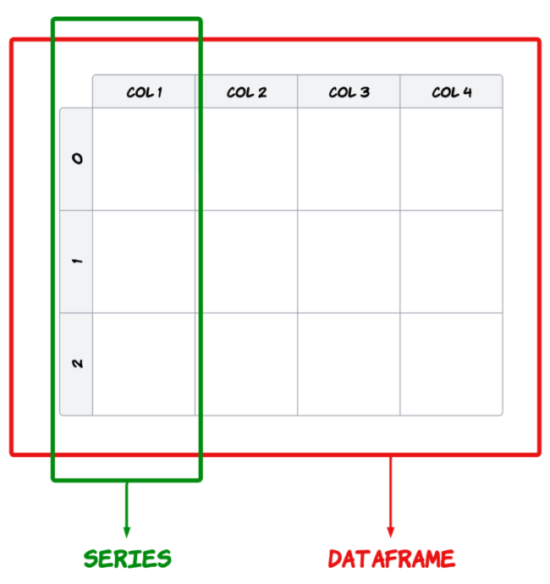

* Series
一維資料(表格中的一欄)，類似numpy中的vector，但可以儲存任何類型的數據，包括整數、浮點數、字串等等。
** 建立: 資料類型可為 array, dictionary
*** 由 array 建立 Series
#+begin_src python -r -n :results output :exports both
import pandas as pd

cars = ["SAAB", "Audi", "BMW", "BENZ", "Toyota", "Nissan", "Lexus"]
print("資料型別:", type(cars))
carsToSeries = pd.Series(cars)
print("資料型別:", type(carsToSeries))
print(carsToSeries.shape)
print(carsToSeries)
print("carsToSeries[1]: ", carsToSeries[1])
#+end_src

#+RESULTS:
#+begin_example
資料型別: <class 'list'>
資料型別: <class 'pandas.core.series.Series'>
(7,)
0      SAAB
1      Audi
2       BMW
3      BENZ
4    Toyota
5    Nissan
6     Lexus
dtype: object
Audi
#+end_example
** 資料篩選
*** 由dict來建立pandas.Series()
就是把dict的key當成index
- 註：pandas 3.0 起， =s[0]= 這類整數索引一律被當成「標籤(label)」而非位置；字串索引的 Series 要用「位置」取值時，必須改用 =.iloc= 。
#+begin_src python -r -n :results output :exports both
import pandas as pd

dict = {
    "city": "Kaohsiung",
    "speedCamera1": "13213",
    "speedCamera2": "3242",
    "speedCamera3": "134343",
    "speedCamera4": "4312",
    "speedCamera5": "533"
}

dictToSeries = pd.Series(dict, index = dict.keys()) # 排序與原 dict 相同
print(dictToSeries.iloc[0])
print("=====")
print(dictToSeries['speedCamera1'])
print("=====")
print(dictToSeries.iloc[[0, 2, 4]])
print("=====")
print(dictToSeries[['city', 'speedCamera1', 'speedCamera3']])
print("=====")
print(dictToSeries.iloc[:2])
print("=====")
print(dictToSeries.iloc[4:])
# 查詢
print("====會發現有一個NaN=====")
search=['speedCamera1', 'speedCamera6']
print(pd.Series(dictToSeries, index=search))
#+end_src

#+RESULTS:
#+begin_example
Kaohsiung
=====
13213
=====
city            Kaohsiung
speedCamera2         3242
speedCamera4         4312
dtype: object
=====
city            Kaohsiung
speedCamera1        13213
speedCamera3       134343
dtype: object
=====
city            Kaohsiung
speedCamera1        13213
dtype: object
=====
speedCamera4    4312
speedCamera5     533
dtype: object
====會發現有一個NaN=====
speedCamera1    13213
speedCamera6      NaN
dtype: object
#+end_example

* DataFrame
其實，你可以單純把DataFrame看成Excel裡的一大張工作表，裡面有很多列(row)和欄(column)，每一列代表一筆資料，每一欄代表一個變數(欄位)。DataFrame可以讓你很方便地操作這些資料，例如篩選、排序、計算統計量等等。

唯一不同的是，DataFrame是用程式碼來操作的，而不是用滑鼠點來點去的。這樣可以讓你更有效率地處理大量資料，並且可以重複使用你的程式碼來處理不同的資料集。

永遠記住一件事，但凡某件事需要你 **用滑鼠去重複點來點去** 的，那麼這件事就 **不值得你去做** ，因為你可以用程式碼來自動化這件事，讓電腦幫你做。

那麼，要如何在Python中建立你的DataFrame呢？很簡單，你可以使用Pandas這個函式庫來建立DataFrame。Pandas提供了很多方便的方法來建立和操作DataFrame，讓你可以輕鬆地處理你的資料。

** DataFrame 建立
可利用 Dictionary 或是 Array 來建立，並使用 DataFrame 的方法來操作資料查看、資料篩選、資料切片、資料排序等運算。

** 由 Dictionary 建立
如果你對Dictionary不熟，可以先跳過這一節，或是去參考[[https://letranger.github.io/PythonCourse/PythonBasic.html][Python 基礎]]的相關章節。
#+begin_src python -r -n :results output :exports both
import pandas as pd

hobby = ["Movies", "Sports", "Coding", "Fishing", "Dancing", "cooking"]
count = [46, 8, 12, 12, 6, 58]

dict = {"hobby": hobby,
        "count": count
       }
print(dict)
df = pd.DataFrame(dict)
print(df)
#+end_src

#+RESULTS:
: {'hobby': ['Movies', 'Sports', 'Coding', 'Fishing', 'Dancing', 'cooking'], 'count': [46, 8, 12, 12, 6, 58]}
:      hobby  count
: 0   Movies     46
: 1   Sports      8
: 2   Coding     12
: 3  Fishing     12
: 4  Dancing      6
: 5  cooking     58

** 由 二維List 建立
就是先建立一個二維陣列(矩陣)，然後再利用 pd.DataFrame() 來把這個二維陣列轉成 DataFrame。
#+begin_src python -r -n :results output :exports both
import pandas as pd

ary = [["Movies", 46],["Sports", 8], ["Coding", 12], ["Fishing",12], ["Dancing",6], ["cooking",8]]
print(ary)
ary2df = pd.DataFrame(ary, columns = ["hobby", "count"]) # 單純的二維矩陣沒有欄位名稱，要外加指定欄標籤名稱
print(ary2df)

#+end_src

#+RESULTS:
: [['Movies', 46], ['Sports', 8], ['Coding', 12], ['Fishing', 12], ['Dancing', 6], ['cooking', 8]]
:      hobby  count
: 0   Movies     46
: 1   Sports      8
: 2   Coding     12
: 3  Fishing     12
: 4  Dancing      6
: 5  cooking      8

** 讀入外部資料檔來建立 Dataframe
當然，更常見的情況是，你會從外部資料檔案(如 CSV 檔)來讀取資料，然後把這些資料放入 DataFrame 中，進行資料查看、資料篩選、資料切片等運算。

首先，我們假設你的電腦上有一個CSV檔案，裡面包含了一些學生的成績資料。你可以先點擊以下連結下載這個範例檔案，然後依你的執行環境（Colab或PyCharm)來進行不同的操作。
- [[file:./scores.csv][下載範例檔:scores.csv]]

*** 本機CSV(由本機端的PyCharm執行，不能在Google colab上跑)
如果你是在本機端使用PyCharm來執行Python程式碼，那你先看看你下載的CSV檔案放在哪個資料夾，然後把那個路徑填入下面的程式碼中，就可以直接讀取這個CSV檔案並建立DataFrame了。

以pd.read_csv()來讀取CSV檔案後就會變成DataFrame物件，接著就可以使用DataFrame的方法來操作資料了。

=pd.read_csv()= 常用參數：
| 參數        | 說明                                                     | 預設值  |
|-------------+----------------------------------------------------------+---------|
| filepath    | 檔案路徑或 URL                                           | （必填）|
| sep         | 分隔符號，CSV 用逗號，TSV 用 tab（='\t'=）               | =','=   |
| header      | 第幾列當欄位名稱；=None= 表示無標題列                    | =0=     |
| index_col   | 指定哪一行做為索引                                       | =None=  |
| usecols     | 只讀取指定的行（欄位），傳入 list                        | =None=  |
| encoding    | 編碼格式，中文檔案常需指定 ='utf-8'= 或 ='big5'=        | =None=  |

#+BEGIN_SRC python -r -n :results output :exports both
import pandas as pd

# 讀取csv
df = pd.read_csv("/Users/student/Downloads/scores.csv") #這裡的路徑要自行更改
print("===全部資料===")
print(df)
#+END_SRC

*** Google Colab的檔案上傳
對於使用Google Colab的同學來說，因為Colab是雲端環境，所以你需要先把本機的檔案上傳到Colab，然後才能讀取這些檔案。以下是如何在Colab中上傳檔案並使用Pandas讀取CSV檔案的步驟:
**** 在Colab中執行以下程式碼來上傳檔案:
#+BEGIN_SRC python -r -n :results output :exports both
from google.colab import files
uploaded = files.upload()
#+END_SRC
- import google.colab後，使用files.upload() 就能夠產生上傳檔案，此時cell會進入等待狀態，選取你本機的檔案即可上傳。
- 執行後會出現以下畫面:
#+CAPTION: Colab上傳檔案
#+LABEL: fig:ColabUpload
#+name: fig:ColabUpload
#+ATTR_LATEX: :width 300
#+ATTR_ORG: :width 300
#+ATTR_HTML: :width 500
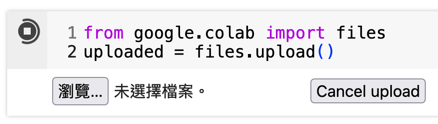
- 接下來點選「瀏覽」選取檔案後即可將檔案上傳至Colab
**** 檔案上傳到哪裡?
這個上傳的檔案會被放在Colab的臨時目錄中，通常是`/content/`。你可以使用以下程式碼來查看目前所在的目錄以及該目錄下的檔案:
#+BEGIN_SRC python -r -n :results output :exports both
!ls
#+END_SRC
ls是Linux系統的指令，可以列出目前目錄下的檔案清單，你應該可以看到剛剛上傳的CSV檔案。如果你想確認目前所在的目錄，

也可以執行!pwd查看現在在哪一個目錄(資料夾)
#+BEGIN_SRC python -r -n :results output :exports both
!pwd
#+END_SRC
pwd是Linux系統的指令，可以顯示目前所在的目錄路徑。

**** 在Google Colab以Pandas查看csv檔
接下來你就可以再新增一個Code Cell來讀取這個CSV檔案並建立DataFrame了。假設你上傳的檔案名稱是`scores.csv`，那麼你可以使用以下程式碼來讀取這個檔案:
#+BEGIN_SRC python -r -n :results output :exports both
import pandas as pd

# 讀取csv
df = pd.read_csv("/content/scores.csv") #這裡的路徑要自行更改
print("===全部資料===")
print(df)
#+end_src

*** 由Pandas直接讀取線上CSV檔
最後，我們來看最簡單的方法: 直接讓Pandas讀取線上的CSV檔案。這樣你就不需要先下載檔案再上傳了，Pandas會自動幫你下載並讀取檔案。
#+begin_src python -r -n :results output :exports both
import pandas as pd
docURL = 'https://letranger.github.io/PythonCourse/scores.csv' #直接指定檔案的URL
df = pd.read_csv(docURL)
print('=====dataFrame的維度')
print(df.shape)
print('=====dataFrame的數值分佈概況')
print(df.describe())
print('=====dataFrame的前5筆記錄')
print(df.head(5))
#+end_src

#+RESULTS:
#+begin_example
=====dataFrame的維度
(212, 6)
=====dataFrame的數值分佈概況
       classparti     typing    homework     midexam   finalexam
count  212.000000  212.00000  212.000000  211.000000  212.000000
mean    92.386792   82.09434   89.394764   62.863033   49.458491
std     13.798874   23.06041   19.471763   34.104173   34.831187
min     14.000000    0.00000   10.750000    0.000000    0.000000
25%     87.000000   68.00000   83.880000   35.000000   20.000000
50%     94.000000   80.00000   97.370000   67.000000   45.000000
75%    101.000000   96.00000  102.630000   95.000000   76.000000
max    120.000000  120.00000  107.890000  113.500000  115.000000
=====dataFrame的前5筆記錄
           id  classparti  typing  homework  midexam  finalexam
0  S201910901         100      72     92.11     48.0       16.0
1  S201910902          96      56     93.42     60.0       40.0
2  S201910903          96      76    102.63     45.0       28.0
3  S201910904          93      64     86.84     44.0       25.0
4  S201910905          93      56     42.11      0.0       20.0
#+end_example

* DataFrame 的資料瀏覽
有了 DataFrame 之後，接下來就可以使用 DataFrame 提供的方法來瀏覽和操作資料了。以下是一些常用的方法:
** 基本函數
這些是在你讀入一個DataFrame之後，最常用來查看DataFrame內容的函數：
- shape
  用途：查看 DataFrame 的維度（行數與列數），傳回一個包含行數和列數的 tuple。
- describe()
  提供數據的統計摘要, 對數值型資料列出統計資訊，如平均值、標準差、最小值、四分位數等。
- head()
  顯示 DataFrame 的前幾行資料, 預設顯示前 5 行資料，但可以加入顯示行數參數。
- tail()
  顯示 DataFrame 的後幾行資料, 預設顯示最後 5 行資料，和 head() 類似，可以指定顯示行數。
- columns
  列出 DataFrame 的所有欄位名稱, 傳回所有列（欄）的名稱，幫助了解 DataFrame 的結構。
- index
  返回 DataFrame 的索引（行標籤）, 查看 DataFrame 中的行標籤，用於確認資料的索引範圍或類型。
- info()
  顯示 DataFrame 的結構化資訊, 包含 DataFrame 中的行數、列數、欄位類型、非空值計數、記憶體使用情況等，常用於總覽資料集的結構。
*** 範例
#+begin_src python -r -n :results output :exports both
import pandas as pd
docURL = 'https://letranger.github.io/PythonCourse/scores.csv'
df = pd.read_csv(docURL)

print("====df.shape====")
print(df.shape) # 回傳列數與欄數
print("====df.describe()====")
print(df.describe()) # 回傳描述性統計
print("====df.head(3)====")
print(df.head(3)) # 回傳前三筆觀測值
print("====df.tail(3)====")
print(df.tail(3)) # 回傳後三筆觀測值
print("====df.columns====")
print(df.columns) # 回傳欄位名稱
print("====df.columns====")
print(df.index) # 回傳 index
print("====df.info====")
print(df.info) # 回傳資料內容
#+end_src

#+RESULTS:
#+begin_example
====df.shape====
(212, 6)
====df.describe()====
       classparti     typing    homework     midexam   finalexam
count  212.000000  212.00000  212.000000  211.000000  212.000000
mean    92.386792   82.09434   89.394764   62.863033   49.458491
std     13.798874   23.06041   19.471763   34.104173   34.831187
min     14.000000    0.00000   10.750000    0.000000    0.000000
25%     87.000000   68.00000   83.880000   35.000000   20.000000
50%     94.000000   80.00000   97.370000   67.000000   45.000000
75%    101.000000   96.00000  102.630000   95.000000   76.000000
max    120.000000  120.00000  107.890000  113.500000  115.000000
====df.head(3)====
           id  classparti  typing  homework  midexam  finalexam
0  S201910901         100      72     92.11     48.0       16.0
1  S201910902          96      56     93.42     60.0       40.0
2  S201910903          96      76    102.63     45.0       28.0
====df.tail(3)====
             id  classparti  typing  homework  midexam  finalexam
209  S201911728          83      48    102.63     83.0       75.0
210  S201911729          87      84    105.26    112.3      103.0
211  S201911730          96      72    102.63     91.0      100.0
====df.columns====
Index(['id', 'classparti', 'typing', 'homework', 'midexam', 'finalexam'], dtype='object')
====df.columns====
RangeIndex(start=0, stop=212, step=1)
====df.info====
<bound method DataFrame.info of              id  classparti  typing  homework  midexam  finalexam
0    S201910901         100      72     92.11     48.0       16.0
1    S201910902          96      56     93.42     60.0       40.0
2    S201910903          96      76    102.63     45.0       28.0
3    S201910904          93      64     86.84     44.0       25.0
4    S201910905          93      56     42.11      0.0       20.0
..          ...         ...     ...       ...      ...        ...
207  S201911726         106      80    102.63     96.5      103.0
208  S201911727          82      60    102.63     84.0      100.0
209  S201911728          83      48    102.63     83.0       75.0
210  S201911729          87      84    105.26    112.3      103.0
211  S201911730          96      72    102.63     91.0      100.0

[212 rows x 6 columns]>
#+end_example

** DataFrame 資料排序
當資料量很大時，排序是一個很常用的功能。Pandas 提供了兩個主要的方法來對 DataFrame 進行排序:
*** sort_values():
這個方法是根據指定的欄位值來排序，可以指定單一欄位或多個欄位來進行排序，並且可以選擇是要升冪(ascending=True)還是降冪(ascending=False)排序。

這也是最常用的排序方法，因為我們通常都是根據某個欄位的值來決定資料的順序。
#+begin_src python -r -n :sync :session :results output :exports both
import pandas as pd
docURL = 'https://letranger.github.io/PythonCourse/scores.csv'
df = pd.read_csv(docURL)

print("====Original====")
print(df.head())
print("===.sort_values()====")
print(df.sort_values(by = 'classparti')[:5])
print(df.sort_values(by = ['midexam', 'finalexam'], ascending=False)[:5])
#+end_src

#+RESULTS:
#+begin_example
====Original====
           id  classparti  typing  homework  midexam  finalexam
0  S201910901         100      72     92.11     48.0       16.0
1  S201910902          96      56     93.42     60.0       40.0
2  S201910903          96      76    102.63     45.0       28.0
3  S201910904          93      64     86.84     44.0       25.0
4  S201910905          93      56     42.11      0.0       20.0
===.sort_values()====
             id  classparti  typing  homework  midexam  finalexam
18   S201910919          14      56     25.92      0.0        0.0
42   S201911006          20      68     92.11     27.0       20.0
27   S201910928          37     108     89.47      0.0       20.0
116  S201911307          53      60     41.45      0.0        0.0
10   S201910911          62      44     20.39      4.0        0.0
             id  classparti  typing  homework  midexam  finalexam
88   S201911115         120      88    105.26    113.5     111.00
98   S201911125         119      80    107.89    113.2     115.00
210  S201911729          87      84    105.26    112.3     103.00
11   S201910912          87      92     92.11    110.8     103.75
195  S201911714         102      44    107.89    110.0     110.00
#+end_example
*** sort_index():
依欄位名稱或index值來排。當你的資料欄位很多而且大多是依照字母順序排列時，這個方法就很有用。
  #+begin_src python -r -n :async :session :results output :exports both
import pandas as pd
docURL = 'https://letranger.github.io/PythonCourse/scores.csv'
df = pd.read_csv(docURL)

print("====Original====")
print(df.head())
print("===.sort_index()====")
print(df.sort_index(axis = 1, ascending = True))
print("===.sort_index()====")
print(df.sort_index(axis = 0, ascending = False))
  #+end_src

  #+RESULTS:
  #+begin_example
  ====Original====
             id  classparti  typing  homework  midexam  finalexam
  0  S201910901         100      72     92.11     48.0       16.0
  1  S201910902          96      56     93.42     60.0       40.0
  2  S201910903          96      76    102.63     45.0       28.0
  3  S201910904          93      64     86.84     44.0       25.0
  4  S201910905          93      56     42.11      0.0       20.0
  ===.sort_index()====
       classparti  finalexam  homework          id  midexam  typing
  0           100       16.0     92.11  S201910901     48.0      72
  1            96       40.0     93.42  S201910902     60.0      56
  2            96       28.0    102.63  S201910903     45.0      76
  3            93       25.0     86.84  S201910904     44.0      64
  4            93       20.0     42.11  S201910905      0.0      56
  ..          ...        ...       ...         ...      ...     ...
  207         106      103.0    102.63  S201911726     96.5      80
  208          82      100.0    102.63  S201911727     84.0      60
  209          83       75.0    102.63  S201911728     83.0      48
  210          87      103.0    105.26  S201911729    112.3      84
  211          96      100.0    102.63  S201911730     91.0      72

  [212 rows x 6 columns]
  ===.sort_index()====
               id  classparti  typing  homework  midexam  finalexam
  211  S201911730          96      72    102.63     91.0      100.0
  210  S201911729          87      84    105.26    112.3      103.0
  209  S201911728          83      48    102.63     83.0       75.0
  208  S201911727          82      60    102.63     84.0      100.0
  207  S201911726         106      80    102.63     96.5      103.0
  ..          ...         ...     ...       ...      ...        ...
  4    S201910905          93      56     42.11      0.0       20.0
  3    S201910904          93      64     86.84     44.0       25.0
  2    S201910903          96      76    102.63     45.0       28.0
  1    S201910902          96      56     93.42     60.0       40.0
  0    S201910901         100      72     92.11     48.0       16.0

  [212 rows x 6 columns]
  #+end_example
*** 有關排序的重要說明
sort 後的結果為 *複本* ，不改變原本的資料，意思是說，當你使用 sort_values() 或 sort_index() 來排序 DataFrame 時，Pandas 會回傳一個 **新的**  DataFrame，這個新的 DataFrame 是排序後的結果，而原本的 DataFrame 仍然 **保持不變** 。
#+begin_src python -r -n :async :session :results output :exports both
import pandas as pd
docURL = 'https://letranger.github.io/PythonCourse/scores.csv'
df = pd.read_csv(docURL)

print("====Original====")
print(df.head())
print("===.sort_index()====")
print(df.sort_index(axis = 1, ascending = True))

print('=== 在經過排序後，現在的df內容為 ===')
print(df.head())
  #+end_src

  #+RESULTS:
  #+begin_example
  ====Original====
             id  classparti  typing  homework  midexam  finalexam
  0  S201910901         100      72     92.11     48.0       16.0
  1  S201910902          96      56     93.42     60.0       40.0
  2  S201910903          96      76    102.63     45.0       28.0
  3  S201910904          93      64     86.84     44.0       25.0
  4  S201910905          93      56     42.11      0.0       20.0
  ===.sort_index()====
       classparti  finalexam  homework          id  midexam  typing
  0           100       16.0     92.11  S201910901     48.0      72
  1            96       40.0     93.42  S201910902     60.0      56
  2            96       28.0    102.63  S201910903     45.0      76
  3            93       25.0     86.84  S201910904     44.0      64
  4            93       20.0     42.11  S201910905      0.0      56
  ..          ...        ...       ...         ...      ...     ...
  207         106      103.0    102.63  S201911726     96.5      80
  208          82      100.0    102.63  S201911727     84.0      60
  209          83       75.0    102.63  S201911728     83.0      48
  210          87      103.0    105.26  S201911729    112.3      84
  211          96      100.0    102.63  S201911730     91.0      72

  [212 rows x 6 columns]
  === 在經過排序後，現在的df內容為 ===
             id  classparti  typing  homework  midexam  finalexam
  0  S201910901         100      72     92.11     48.0       16.0
  1  S201910902          96      56     93.42     60.0       40.0
  2  S201910903          96      76    102.63     45.0       28.0
  3  S201910904          93      64     86.84     44.0       25.0
  4  S201910905          93      56     42.11      0.0       20.0
  #+end_example

** [課堂練習]班級成績排行榜 :TNFSH:
使用以下資料建立 DataFrame，完成指定任務：

指定 seed：
#+begin_src python -r -n :results output :exports both
import pandas as pd
import numpy as np
np.random.seed(5566)

names = ['阿明', '小花', '阿傑', '小美', '阿強', '小玲', '阿偉', '小芳', '阿志', '小萍']
data = {
    '姓名': names,
    '班級': np.random.choice(['甲班', '乙班', '丙班'], 10),
    '國文': np.random.randint(40, 100, 10),
    '英文': np.random.randint(30, 100, 10),
    '數學': np.random.randint(20, 100, 10),
}
df = pd.DataFrame(data)
#+end_src

任務：
1. 用 =describe()= 顯示三科的統計摘要
2. 找出數學前三名的姓名與分數（提示：=sort_values()= + =head()=）
3. 篩選出英文不及格（<60）的同學，並印出人數
4. 用 =groupby()= 計算各班國文平均分數

結果範例
#+RESULTS:
#+begin_example
=== 1. 各科統計摘要 ===
         國文    英文    數學
count  10.0  10.0  10.0
mean   72.4  64.8  61.5
std    20.8  20.7  21.3
min    40.0  30.0  20.0
25%    57.0  50.5  55.5
50%    73.5  63.0  59.5
75%    91.8  80.5  80.0
max    98.0  97.0  87.0

=== 2. 數學前三名 ===
   姓名  數學
0  阿明  87
4  阿強  85
1  小花  83

=== 3. 英文不及格 ===
   姓名  英文
4  阿強  47
8  阿志  30
9  小萍  44
共 3 人

=== 4. 各班國文平均 ===
班級
丙班    94.0
乙班    74.8
甲班    66.2
#+end_example

*** solution :noexport:
#+begin_src python -r -n :results output :exports both
import pandas as pd
import numpy as np
np.random.seed(5566)

names = ['阿明', '小花', '阿傑', '小美', '阿強', '小玲', '阿偉', '小芳', '阿志', '小萍']
data = {
    '姓名': names,
    '班級': np.random.choice(['甲班', '乙班', '丙班'], 10),
    '國文': np.random.randint(40, 100, 10),
    '英文': np.random.randint(30, 100, 10),
    '數學': np.random.randint(20, 100, 10),
}
df = pd.DataFrame(data)

print('=== 1. 各科統計摘要 ===')
print(df[['國文', '英文', '數學']].describe().round(1))
print()

print('=== 2. 數學前三名 ===')
print(df.sort_values('數學', ascending=False).head(3)[['姓名', '數學']])
print()

print('=== 3. 英文不及格 ===')
fail = df[df['英文'] < 60]
print(fail[['姓名', '英文']])
print(f'共 {len(fail)} 人')
print()

print('=== 4. 各班國文平均 ===')
print(df.groupby('班級')['國文'].mean().round(1))
#+end_src

** DataFrame 處理遺漏值
在現實世界的資料集中，遺漏值（Missing Values）是非常常見的情況。不管你的資料是來自問卷調查、感測器讀取，還是從網路下載，都可能會有一些資料缺失的情況。Pandas 提供了多種方法來檢查和處理這些遺漏值，以下是一些常用的方法:
*** 觀察遺失狀況
不要只想著你可以用眼睛看資料來找遺漏值，因為當資料量很大時，這樣做是非常不切實際的。
我們可以使用以下幾個函數來檢查 DataFrame 中的遺漏值:
- isnull(): 用來檢查 DataFrame 中的遺漏值，並傳回一個布林值的 DataFrame，True 表示該值為 NaN，False 表示該值不是 NaN。
- notnull(): 傳回一個與原資料相同大小的布林值 DataFrame，其中 True 表示資料「不是」NaN（即該處有有效值），False 表示該值為 NaN。
- any(): 一個常用於處理布林值資料的函數，它用來檢查在一個特定的軸（列或行）上，是否有 任何一個值 為 True。這在處理遺漏值時特別有用，因為你可以用它來檢查一個 DataFrame 的每一行或每一列中是否存在至少一個 True 值（例如：NaN 值）。
#+begin_src python -r -n :results output :exports both :session
import pandas as pd
docURL = 'https://letranger.github.io/PythonCourse/scores-null.csv'
df = pd.read_csv(docURL)

print("====原始資料====")
print(df)
# 查詢遺失值狀況
print('====遺失值====')
print(df.isnull())
print(df.isnull().sum())
#+end_src

#+RESULTS:
#+begin_example
====原始資料====
          id  classparti  typing  homework  finalExam
0  201910901       100.0    72.0     92.11       48.0
1  201910902        96.0    56.0     93.42       60.0
2  201910903        96.0    76.0    102.63        NaN
3  201910904         NaN    64.0     86.84       44.0
4  201910905        93.0    56.0     42.11        0.0
5  201910906       101.0   108.0    100.00        NaN
6  201910907       101.0     NaN     92.11       55.0
7  201910908        94.0    68.0    105.26       61.0
8  201910909         NaN    64.0     44.74       20.0
9  201910910        93.0   120.0     97.37       16.0
====遺失值====
      id  classparti  typing  homework  finalExam
0  False       False   False     False      False
1  False       False   False     False      False
2  False       False   False     False       True
3  False        True   False     False      False
4  False       False   False     False      False
5  False       False   False     False       True
6  False       False    True     False      False
7  False       False   False     False      False
8  False        True   False     False      False
9  False       False   False     False      False
id            0
classparti    2
typing        1
homework      0
finalExam     2
dtype: int64
#+end_example
*** dropna()
在確定資料中有遺失值之後，接下來就要考慮如何處理這些遺失值。最簡單的方法就是刪除這些包含遺失值的行或列，Pandas 提供了 dropna() 方法來實現這個功能。

什麼？刪除？

是的，直接刪除！雖然聽起來有點殘酷，但在某些情況下，刪除包含遺失值的行或列是最有效的方法，特別是當遺失值的比例很小時。當然，在刪除之前，你應該先評估這樣做是否會對你的分析結果產生重大影響。

dropna()就是用來刪除包含遺失值的行或列的方法。以下是 dropna() 方法的主要參數說明:
#+begin_src python -r :results output :exports both
DataFrame.dropna(axis=0, how='any', thresh=None, subset=None, inplace=False)
#+end_src
- axis: 指定刪除的方向。axis=0 刪除包含遺失值的「列(row)」，axis=1 刪除包含遺失值的「行(column)」，預設為 0（列）。
- how: 確定是否刪除的條件。how='any' 表示只要行或列中有一個 NaN 就刪除，how='all' 表示必須全部是 NaN 才刪除，預設為 'any'。
- thresh: 保留至少有 thresh 個非 NaN 的行或列。
- subset: 只在特定列中尋找遺失值。
- inplace: 是否在原 DataFrame 中直接修改，True 表示在原地修改，False 則返回一個新的 DataFrame。
#+begin_src python -r -n :session :results output :exports both
import pandas as pd
docURL = 'https://letranger.github.io/PythonCourse/scores-null.csv'
df = pd.read_csv(docURL)
print("====原始資料====")
print(df.shape)
print("====刪除有遺失值的記錄====")
df0 = df.dropna()
print(df0.shape)
print(df.shape) #原來的df不受影響
df.dropna(inplace=True)
print(df.shape) #原來的df被改掉了QQ
#+end_src
#+RESULTS:
: ====原始資料====
: (10, 5)
: (5, 5)
: (10, 5)
: (5, 5)
*** fillna()
當然，有些情況下，刪除遺失值並不是一個好選擇，特別是當遺失值的比例較高時。或者，你在處理學生的段考資料，有幾個學生有某幾科缺考，你總不能把這些學生整個刪掉吧？這時候，我們可以選擇用某個值來填補這些遺失值，Pandas 提供了 fillna() 方法來實現這個功能。

fillna() 方法允許你指定一個值或方法來填補 DataFrame 中的遺失值。以下是 fillna() 方法的主要參數說明:
#+begin_src python -r :results output :exports both
DataFrame.fillna(value=None, axis=None, inplace=False, limit=None)
#+end_src
- value: 用來填補遺失值的值，這個值可以是單個標量或字典來指定每列不同的填補值。
- 想「用前一個有效值填補」請改用 =df.ffill()= ，「用後一個有效值填補」請改用 =df.bfill()= 。
  - 註：pandas 2.1 起 fillna 的 =method= 參數已棄用、3.0 起移除，改以獨立的 =ffill()= / =bfill()= 方法取代。
- axis: 指定填補的方向，axis=0 表示沿「列(row)」方向填補，axis=1 表示沿「行(column)」方向填補，預設為 0。
- inplace: 是否直接修改原 DataFrame，預設為 False。
- limit: 限制每一行或每一列最多填補幾個遺失值。
#+begin_src python -r -n :results output :exports both :session
import pandas as pd
docURL = 'https://letranger.github.io/PythonCourse/scores-null.csv'
df = pd.read_csv(docURL)

print("====原始資料====")
print(df)

fill0 = df.fillna(0)
print("====遺失值填零====")
print(fill0)
fillv = df.fillna({"classparti":999, "typing":0, "finalExam":"NULL"})
print("====遺失值填特定值====")
print(fillv)
#+end_src

#+RESULTS:
#+begin_example
====原始資料====
          id  classparti  typing  homework  finalExam
0  201910901       100.0    72.0     92.11       48.0
1  201910902        96.0    56.0     93.42       60.0
2  201910903        96.0    76.0    102.63        NaN
3  201910904         NaN    64.0     86.84       44.0
4  201910905        93.0    56.0     42.11        0.0
5  201910906       101.0   108.0    100.00        NaN
6  201910907       101.0     NaN     92.11       55.0
7  201910908        94.0    68.0    105.26       61.0
8  201910909         NaN    64.0     44.74       20.0
9  201910910        93.0   120.0     97.37       16.0
====遺失值填零====
          id  classparti  typing  homework  finalExam
0  201910901       100.0    72.0     92.11       48.0
1  201910902        96.0    56.0     93.42       60.0
2  201910903        96.0    76.0    102.63        0.0
3  201910904         0.0    64.0     86.84       44.0
4  201910905        93.0    56.0     42.11        0.0
5  201910906       101.0   108.0    100.00        0.0
6  201910907       101.0     0.0     92.11       55.0
7  201910908        94.0    68.0    105.26       61.0
8  201910909         0.0    64.0     44.74       20.0
9  201910910        93.0   120.0     97.37       16.0
====遺失值填特定值====
          id  classparti  typing  homework finalExam
0  201910901       100.0    72.0     92.11      48.0
1  201910902        96.0    56.0     93.42      60.0
2  201910903        96.0    76.0    102.63      NULL
3  201910904       999.0    64.0     86.84      44.0
4  201910905        93.0    56.0     42.11       0.0
5  201910906       101.0   108.0    100.00      NULL
6  201910907       101.0     0.0     92.11      55.0
7  201910908        94.0    68.0    105.26      61.0
8  201910909       999.0    64.0     44.74      20.0
9  201910910        93.0   120.0     97.37      16.0
#+end_example

** [課堂練習] :TNFSH:
以下列程式碼讀取線上資料檔，然後完成下列任務
1. print出[[file:prac_scores.csv][原始資料]]，觀察數據中是否有遺漏值。
2. 使用 isnull() 和 notnull() 來檢查 DataFrame 中的遺漏值。顯示哪些欄位包含遺漏值。
3. 列出成績不完整(有缺失值)的學生姓名
4. 使用 dropna() 刪除包含遺漏值的學生記錄，並顯示刪除後的結果。
5. 使用 fillna() 將遺漏值填充為平均值或其他特定值。依續以下列幾種填充方式：
   a. 科學、地理兩科缺考者一律給60分。
   b. 使用 0 填充其他所有遺漏值。
*** 參考
#+begin_src python -r -n :results output :exports both
import pandas as pd
docURL = 'https://letranger.github.io/PythonCourse/prac_scores.csv'
df = pd.read_csv(docURL)
print(df.head())
#+end_src
#+RESULTS:
:      數學    英文    科學    歷史    地理   姓名
: 0   NaN  76.0  84.0  96.0  56.0  學生1
: 1  78.0   NaN  63.0  73.0  58.0  學生2
: 2  64.0  77.0  66.0  75.0  57.0  學生3
: 3  92.0   NaN  85.0  74.0  61.0  學生4
: 4  57.0  64.0  99.0  94.0  83.0  學生5
*** Solution :noexport:
#+begin_src python -r -n :results output :exports both
import pandas as pd
docURL = 'https://letranger.github.io/PythonCourse/prac_scores.csv'
df = pd.read_csv(docURL)
# 2. 檢查遺漏值
missing_values = df.isnull()
columns_with_missing = df.columns[df.isnull().any()]
print('===2.===')
print(missing_values)
# 3. 列出成績不完整的學生姓名
students_with_missing = df[df.isnull().any(axis=1)]['姓名']
print('===3.===')
print(students_with_missing)
missing_values, columns_with_missing, students_with_missing
# 4. 使用 dropna() 刪除包含遺漏值的學生記錄
df_dropped = df.dropna()
print('===4.===')
print(df_dropped)
# 5a. 使用 fillna() 將科學、地理缺考者一律給 60 分
df_filled = df.copy()
print('===5.===')
df_filled['科學'] = df_filled['科學'].fillna(60)
df_filled['地理'] = df_filled['地理'].fillna(60)
# 5b. 使用 0 填充其他所有遺漏值
df_filled = df_filled.fillna(0)
print(df_filled)
#+end_src

#+RESULTS:
#+begin_example
===2.===
       數學     英文     科學     歷史     地理     姓名
0    True  False  False  False  False  False
1   False   True  False  False  False  False
2   False  False  False  False  False  False
3   False   True  False  False  False  False
4   False  False  False  False  False  False
5   False  False  False  False   True  False
6   False  False  False  False  False  False
7    True  False   True   True  False  False
8   False  False  False  False  False  False
9   False  False   True   True  False  False
10  False  False   True  False  False  False
11   True  False  False  False  False  False
12  False  False  False  False  False  False
13   True   True   True   True   True  False
14  False  False   True  False   True  False
15  False  False  False  False  False  False
16  False  False  False  False   True  False
17   True  False  False   True  False  False
18  False  False  False  False   True  False
19  False  False  False  False  False  False
20  False   True  False  False  False  False
21  False  False  False  False  False  False
22  False  False  False  False  False  False
23  False  False  False  False  False  False
24  False  False  False  False  False  False
25  False  False  False   True  False  False
26  False  False  False  False  False  False
27  False  False  False  False  False  False
28  False  False  False  False  False  False
29  False   True  False  False  False  False
===3.===
0      學生1
1      學生2
3      學生4
5      學生6
7      學生8
9     學生10
10    學生11
11    學生12
13    學生14
14    學生15
16    學生17
17    學生18
18    學生19
20    學生21
25    學生26
29    學生30
Name: 姓名, dtype: object
===4.===
      數學     英文    科學     歷史    地理    姓名
2   64.0   77.0  66.0   75.0  57.0   學生3
4   57.0   64.0  99.0   94.0  83.0   學生5
6   88.0  100.0  53.0   78.0  97.0   學生7
8   72.0   52.0  55.0   94.0  73.0   學生9
12  85.0   70.0  67.0   58.0  89.0  學生13
15  52.0   67.0  83.0   93.0  84.0  學生16
19  93.0   99.0  80.0  100.0  96.0  學生20
21  87.0   75.0  64.0   57.0  52.0  學生22
22  51.0   51.0  57.0   84.0  50.0  學生23
23  70.0   69.0  63.0   84.0  54.0  學生24
24  82.0   77.0  72.0   82.0  75.0  學生25
26  71.0   56.0  70.0   91.0  88.0  學生27
27  93.0   93.0  65.0   88.0  76.0  學生28
28  74.0   57.0  94.0   90.0  58.0  學生29
===5.===
      數學     英文    科學     歷史    地理    姓名
0    0.0   76.0  84.0   96.0  56.0   學生1
1   78.0    0.0  63.0   73.0  58.0   學生2
2   64.0   77.0  66.0   75.0  57.0   學生3
3   92.0    0.0  85.0   74.0  61.0   學生4
4   57.0   64.0  99.0   94.0  83.0   學生5
5   70.0   96.0  89.0   90.0  60.0   學生6
6   88.0  100.0  53.0   78.0  97.0   學生7
7    0.0   93.0  60.0    0.0  72.0   學生8
8   72.0   52.0  55.0   94.0  73.0   學生9
9   60.0   86.0  60.0    0.0  86.0  學生10
10  60.0  100.0  60.0   74.0  84.0  學生11
11   0.0   56.0  78.0   56.0  93.0  學生12
12  85.0   70.0  67.0   58.0  89.0  學生13
13   0.0    0.0  60.0    0.0  60.0  學生14
14  73.0   88.0  60.0   50.0  60.0  學生15
15  52.0   67.0  83.0   93.0  84.0  學生16
16  71.0   53.0  59.0   57.0  60.0  學生17
17   0.0   74.0  85.0    0.0  84.0  學生18
18  73.0   63.0  63.0   60.0  60.0  學生19
19  93.0   99.0  80.0  100.0  96.0  學生20
20  79.0    0.0  97.0   66.0  63.0  學生21
21  87.0   75.0  64.0   57.0  52.0  學生22
22  51.0   51.0  57.0   84.0  50.0  學生23
23  70.0   69.0  63.0   84.0  54.0  學生24
24  82.0   77.0  72.0   82.0  75.0  學生25
25  61.0   96.0  89.0    0.0  63.0  學生26
26  71.0   56.0  70.0   91.0  88.0  學生27
27  93.0   93.0  65.0   88.0  76.0  學生28
28  74.0   57.0  94.0   90.0  58.0  學生29
29  98.0    0.0  67.0   77.0  64.0  學生30
#+end_example

**** 資料生成
#+begin_src python -r -n :results output :exports both
import pandas as pd
import numpy as np

# Generating a DataFrame with 30 rows and 5 subjects
np.random.seed(42)  # Ensure reproducibility
subjects = ['數學', '英文', '科學', '歷史', '地理']
names = [f'學生{i}' for i in range(1, 31)]

data = {subject: np.random.randint(50, 101, size=30) for subject in subjects}
data['姓名'] = names

# Introduce some missing values randomly
df = pd.DataFrame(data)
df.loc[np.random.choice(df.index, size=5, replace=False), '數學'] = np.nan
df.loc[np.random.choice(df.index, size=5, replace=False), '英文'] = np.nan
df.loc[np.random.choice(df.index, size=5, replace=False), '科學'] = np.nan
df.loc[np.random.choice(df.index, size=5, replace=False), '歷史'] = np.nan
df.loc[np.random.choice(df.index, size=5, replace=False), '地理'] = np.nan

# 匯出
df.to_csv('prac_scores.csv', index=False)

print(df)
#+end_src

#+RESULTS:
#+begin_example
      數學     英文    科學     歷史    地理    姓名
0    NaN   76.0  84.0   96.0  56.0   學生1
1   78.0    NaN  63.0   73.0  58.0   學生2
2   64.0   77.0  66.0   75.0  57.0   學生3
3   92.0    NaN  85.0   74.0  61.0   學生4
4   57.0   64.0  99.0   94.0  83.0   學生5
5   70.0   96.0  89.0   90.0   NaN   學生6
6   88.0  100.0  53.0   78.0  97.0   學生7
7    NaN   93.0   NaN    NaN  72.0   學生8
8   72.0   52.0  55.0   94.0  73.0   學生9
9   60.0   86.0   NaN    NaN  86.0  學生10
10  60.0  100.0   NaN   74.0  84.0  學生11
11   NaN   56.0  78.0   56.0  93.0  學生12
12  85.0   70.0  67.0   58.0  89.0  學生13
13   NaN    NaN   NaN    NaN   NaN  學生14
14  73.0   88.0   NaN   50.0   NaN  學生15
15  52.0   67.0  83.0   93.0  84.0  學生16
16  71.0   53.0  59.0   57.0   NaN  學生17
17   NaN   74.0  85.0    NaN  84.0  學生18
18  73.0   63.0  63.0   60.0   NaN  學生19
19  93.0   99.0  80.0  100.0  96.0  學生20
20  79.0    NaN  97.0   66.0  63.0  學生21
21  87.0   75.0  64.0   57.0  52.0  學生22
22  51.0   51.0  57.0   84.0  50.0  學生23
23  70.0   69.0  63.0   84.0  54.0  學生24
24  82.0   77.0  72.0   82.0  75.0  學生25
25  61.0   96.0  89.0    NaN  63.0  學生26
26  71.0   56.0  70.0   91.0  88.0  學生27
27  93.0   93.0  65.0   88.0  76.0  學生28
28  74.0   57.0  94.0   90.0  58.0  學生29
29  98.0    NaN  67.0   77.0  64.0  學生30
#+end_example

** [課堂練習]成績表操作 :TNFSH:
使用以下資料建立 DataFrame，完成指定任務：

指定 seed：
#+begin_src python -r -n :results output :exports both
import pandas as pd
import numpy as np
np.random.seed(8888)

data = {
    '姓名': ['小明', '小華', '小美', '小強', '小玲', '小偉', '小芳', '小傑'],
    '國文': np.random.randint(50, 100, 8),
    '英文': np.random.randint(40, 100, 8),
    '數學': np.random.randint(30, 100, 8),
}
df = pd.DataFrame(data)
#+end_src

任務：
1. 新增「總分」欄位（國文+英文+數學）
2. 按總分由高到低排序
3. 篩選出數學不及格（<60）的同學
4. 計算各科平均分數

結果範例
#+RESULTS:
#+begin_example
=== 原始成績表 ===
   姓名  國文  英文  數學
0  小明  53  91  51
1  小華  85  49  91
2  小美  58  78  30
3  小強  91  99  84
4  小玲  50  68  70
5  小偉  94  71  67
6  小芳  98  69  68
7  小傑  65  51  98

=== 1. 新增總分欄位 ===
   姓名  國文  英文  數學   總分
0  小明  53  91  51  195
1  小華  85  49  91  225
2  小美  58  78  30  166
3  小強  91  99  84  274
4  小玲  50  68  70  188
5  小偉  94  71  67  232
6  小芳  98  69  68  235
7  小傑  65  51  98  214

=== 2. 按總分排序 ===
   姓名  國文  英文  數學   總分
3  小強  91  99  84  274
6  小芳  98  69  68  235
5  小偉  94  71  67  232
1  小華  85  49  91  225
7  小傑  65  51  98  214
0  小明  53  91  51  195
4  小玲  50  68  70  188
2  小美  58  78  30  166

=== 3. 數學不及格的同學 ===
   姓名  數學
0  小明  51
2  小美  30

=== 4. 各科平均分數 ===
國文: 74.2
英文: 72.0
數學: 69.9
#+end_example

*** solution :noexport:
#+begin_src python -r -n :results output :exports both
import pandas as pd
import numpy as np
np.random.seed(8888)

data = {
    '姓名': ['小明', '小華', '小美', '小強', '小玲', '小偉', '小芳', '小傑'],
    '國文': np.random.randint(50, 100, 8),
    '英文': np.random.randint(40, 100, 8),
    '數學': np.random.randint(30, 100, 8),
}
df = pd.DataFrame(data)

print('=== 原始成績表 ===')
print(df)
print()

df['總分'] = df['國文'] + df['英文'] + df['數學']
print('=== 1. 新增總分欄位 ===')
print(df)
print()

df_sorted = df.sort_values('總分', ascending=False)
print('=== 2. 按總分排序 ===')
print(df_sorted)
print()

math_fail = df[df['數學'] < 60]
print('=== 3. 數學不及格的同學 ===')
print(math_fail[['姓名', '數學']])
print()

print('=== 4. 各科平均分數 ===')
for col in ['國文', '英文', '數學']:
    print(f'{col}: {df[col].mean():.1f}')
#+end_src

* Dataframe 的選取與過濾
比起Python內建的資料結構，Pandas的DataFrame提供了更多方便的資料選取與過濾功能。這些功能讓使用者能夠更靈活地操作資料，進行各種分析與處理。以下將介紹幾種常用的選取與過濾方法。
** 資料選取：選取欄位 (Column)
1. 使用 df['column_name'] 來選取單個欄位
   這種方式傳回的是一個 Series，適用於只選取一個欄位的情況。這種方法最為直觀，當你知道欄位名稱時，直接使用 df['column_name'] 即可。
2. 使用 =df[['col1', 'col2']]= 選取多個欄位
   如果需要一次選取多個欄位，可以將多個欄位名稱放入一個列表中，再傳入 DataFrame 中。這樣做會傳回一個新的 DataFrame，並且可以進行進一步操作，例如使用 head() 來查看前幾行的數據。
3. 使用 df.column_name 的簡寫方式
   這是一種更簡潔的語法，它只適用於列名為有效的 Python 識別符時（例如，列名中沒有空格或特殊字符）。通過 df.column_name 來選取欄位和 df['column_name'] 效果相同，傳回一個 Series。
*** 範例
#+BEGIN_SRC python -r -n :results output :exports both :session
import pandas as pd
docURL = 'https://letranger.github.io/PythonCourse/scores.csv'
df = pd.read_csv(docURL)

print(df.head(3))
# 以 df.column name來選欄位
print('=== df.id ===')
print(df.id)
# 以 df[['column']]  來選欄位
print("=== df[['id']] ===")
print(df[['id']])
# df[['id', 'typing']]的結果仍是dataframe，後面可以再加上dataframe的function
print(df[['id', 'typing']].head(3))
# 以 df.column 來選欄位
print(df.id, df.homework)
#+END_SRC

#+RESULTS:
#+begin_example
           id  classparti  typing  homework  midexam  finalexam
0  S201910901         100      72     92.11     48.0       16.0
1  S201910902          96      56     93.42     60.0       40.0
2  S201910903          96      76    102.63     45.0       28.0
=== df.id ===
0      S201910901
1      S201910902
2      S201910903
3      S201910904
4      S201910905
          ...
207    S201911726
208    S201911727
209    S201911728
210    S201911729
211    S201911730
Name: id, Length: 212, dtype: object
=== df[['id']] ===
             id
0    S201910901
1    S201910902
2    S201910903
3    S201910904
4    S201910905
..          ...
207  S201911726
208  S201911727
209  S201911728
210  S201911729
211  S201911730

[212 rows x 1 columns]
           id  typing
0  S201910901      72
1  S201910902      56
2  S201910903      76
0      S201910901
1      S201910902
2      S201910903
3      S201910904
4      S201910905
          ...
207    S201911726
208    S201911727
209    S201911728
210    S201911729
211    S201911730
Name: id, Length: 212, dtype: object 0       92.11
1       93.42
2      102.63
3       86.84
4       42.11
        ...
207    102.63
208    102.63
209    102.63
210    105.26
211    102.63
Name: homework, Length: 212, dtype: float64
#+end_example

** 資料選取：使用索引選取列 (Row)
在資料處理與分析中，Pandas 提供了方便的方法來根據列索引或條件選取 DataFrame 中的資料列。這讓使用者能夠靈活地篩選與操作資料，進行更精細的分析。
1. 使用索引範圍選取資料列
   Pandas 支援使用索引範圍來選取 DataFrame 的資料列。類似於 Python 的切片語法:
   - df[start:end] : 選取第 start 到 end 行的資料。這種方法非常直觀，用於選取連續的一組資料列。
2. 使用條件選取資料列
   除了直接選取特定的資料列，Pandas 也允許使用條件來篩選資料:
   - df[condition] :可以選取符合條件的資料。例如，篩選出作業成績小於 30 的學生記錄。
   - 可以用df.column_name來表示條件
3. 合併列索引與欄位條件
   我們還可以結合列索引與欄位條件來選取資料。例如，使用條件選取特定列後，再篩選出符合條件的資料列，進行進一步操作。
*** 範例
#+BEGIN_SRC python -r -n :results output :exports both
import pandas as pd
docURL = 'https://letranger.github.io/PythonCourse/scores.csv'
df = pd.read_csv(docURL)

# 以row index來選取資料
print(df[1:3])
# 以條件來選取資料
print(df[df.homework<30])
# 合併row and column兩項條件
print(df.id[df.homework<30])
print(df[['id', 'homework']][1:3])
#+END_SRC

#+RESULTS:
#+begin_example
           id  classparti  typing  homework  midexam  finalexam
1  S201910902          96      56     93.42     60.0       40.0
2  S201910903          96      76    102.63     45.0       28.0
             id  classparti  typing  homework  midexam  finalexam
10   S201910911          62      44     20.39      4.0        0.0
18   S201910919          14      56     25.92      0.0        0.0
23   S201910924          75      48     10.75      0.0        0.0
124  S201911315          71     120     15.35      0.0        0.0
140  S201911331          93     120     25.88      0.0       16.0
10     S201910911
18     S201910919
23     S201910924
124    S201911315
140    S201911331
Name: id, dtype: object
           id  homework
1  S201910902     93.42
2  S201910903    102.63
#+end_example

** 條件式選取資料
1. 單一條件篩選
   需要根據單一條件篩選資料時:
   - df[condition]: 傳回一個新的 DataFrame，包含所有符合條件的資料列。
2. 多條件篩選
   如果你需要根據多個條件來篩選資料，可以使用邏輯運算符來結合條件：
   - df[(condition)]
   - df[(condition 1) & (condition 2) ] : 使用 & 代表「且」的邏輯運算符，表示同時滿足兩個條件。
   - df[(condition 1) | (condition 2) ] : 使用 | 代表「或」的邏輯運算符，表示滿足任一條件。
   - 使用多個條件時，必須 *將每個條件放在括號內* ，這樣才能正確解析每個條件的優先級。
*** 範例
#+BEGIN_SRC python -r -n :results output :exports both
import pandas as pd

docURL = 'https://letranger.github.io/PythonCourse/scores.csv'
df = pd.read_csv(docURL)

print(df[(df.midexam >= 100) & (df.finalexam >= 100)])
#+END_SRC

#+RESULTS:
#+begin_example
             id  classparti  typing  homework  midexam  finalexam
11   S201910912          87      92     92.11    110.8     103.75
70   S201911034         104      92    102.63    100.8     101.00
88   S201911115         120      88    105.26    113.5     111.00
98   S201911125         119      80    107.89    113.2     115.00
102  S201911129         106      52    102.63    103.6     100.00
127  S201911318         108      80    102.63    104.8     100.00
138  S201911329         105      48    107.89    100.0     100.00
143  S201911334         100     120     81.58    104.8     113.00
153  S201911608          88       0    102.63    100.0     100.00
169  S201911624          82     100    102.63    101.5     105.00
182  S201911701         103     108     92.63    100.0     100.00
189  S201911708         106     108    102.63    107.2     101.00
190  S201911709         108      88    107.89    104.8     105.00
191  S201911710         102     100    102.63    100.0     105.00
193  S201911712         105      96    101.58    107.5     100.00
195  S201911714         102      44    107.89    110.0     110.00
196  S201911715         106     120    107.89    102.4     105.00
198  S201911717          80     120    107.89    106.0     100.00
201  S201911721         109      76    100.00    100.0     100.00
203  S201911722         105     120    102.63    101.5     105.00
210  S201911729          87      84    105.26    112.3     103.00
#+end_example

** 進階條件過濾[loc/iloc]
在 Pandas 中，除了基本的索引與條件篩選，loc 和 iloc 提供了更加靈活且強大的資料篩選功能。這些方法允許我們根據行標籤、列標籤，或者純粹基於數值索引來選取資料。此外，between 方法則可以用來方便地篩選特定區間內的數值。

先來看看 loc 和 iloc 的差異：
| 特性     | =loc=                          | =iloc=                         |
|----------+--------------------------------+--------------------------------|
| 索引方式 | 用標籤（名稱）選取             | 用整數位置選取                 |
| 語法     | =df.loc[row_label, col_label]= | =df.iloc[row_index, col_index]= |
| 切片範圍 | 頭尾都包含（='a':'c'= 包含 c） | 包含頭、不包含尾（=0:3= 不含 3）|
| 適用情境 | 你知道欄位名稱或列標籤時       | 你知道確切位置（第幾列第幾行）時 |

簡單來說：用名字找就用 =loc= ，用位置編號找就用 =iloc= 。

*** loc, iloc, between [fn:5]
**** loc
- 用法：df.loc[row_label, column_label]
- 這種方式是基於標籤（label）的選取，適合用於對特定行列進行精準選取。基於行標籤和列標籤（x_label、y_label）進行索引，以 column 名做為 index
#+BEGIN_SRC python -r -n :results output :exports both
import pandas as pd

# 從遠端讀取 CSV 檔案
docURL = 'https://letranger.github.io/PythonCourse/scores.csv'
df = pd.read_csv(docURL)

# 查看前3行資料
print(df.head(3))
print("========")

# 使用 loc 選取 'homework' 小於 25 的資料，並只顯示 'id' 和 'homework' 兩個欄位
print(df.loc[df.homework < 25, ['id', 'homework']])
print("========")

# 使用 loc 選取第 2 行的 'homework' 欄位數值
print(df.loc[2, 'homework'])
#+END_SRC

#+RESULTS:
#+begin_example
           id  classparti  typing  homework  midexam  finalexam
0  S201910901         100      72     92.11     48.0       16.0
1  S201910902          96      56     93.42     60.0       40.0
2  S201910903          96      76    102.63     45.0       28.0
========
             id  homework
10   S201910911     20.39
23   S201910924     10.75
124  S201911315     15.35
========
102.63
#+end_example
**** iloc
- iloc 是基於行索引和列索引的數字位置來選取資料。這種方法使用索引的數值來選擇資料，從 0 開始計數，適合在你知道具體位置而非標籤時使用。
- 用法：df.iloc[row_index, column_index]
- 索引都是基於數字的位置，而不是標籤。
#+BEGIN_SRC python -r -n :results output :exports both
import pandas as pd

# 從遠端讀取 CSV 檔案
docURL = 'https://letranger.github.io/PythonCourse/scores.csv'
df = pd.read_csv(docURL)

# 使用 iloc 選取前 3 行資料
print(df.iloc[:3])

# 使用 iloc 選取前 2 行的第 2 和第 3 欄資料
print(df.iloc[:2, 1:3])
#+END_SRC

#+RESULTS:
:            id  classparti  typing  homework  midexam  finalexam
: 0  S201910901         100      72     92.11     48.0       16.0
: 1  S201910902          96      56     93.42     60.0       40.0
: 2  S201910903          96      76    102.63     45.0       28.0
:    classparti  typing
: 0         100      72
: 1          96      56

**** between
- between 方法可以用來篩選特定區間內的數值資料。例如，如果你需要篩選出某列的值位於某個範圍之間，可以使用 between 方法。
- 用法：df['column'].between(left, right, inclusive='both')
- 註：pandas 1.3 起 =inclusive= 參數改為接受字串（'both'、'neither'、'left'、'right'），不再接受 True/False；'both' 表示左右邊界都包含。
- 這種方法會傳回布林值序列，表示每個值是否位於指定範圍內。
#+begin_src python -r -n :results output :exports both :session cond :async
import pandas as pd

# 從遠端讀取 CSV 檔案
docURL = 'https://letranger.github.io/PythonCourse/scores.csv'
df = pd.read_csv(docURL)

# 使用 between 方法篩選期中考成績在 50 到 60 之間的資料
print(df['midexam'].between(50, 60))

# 篩選期中考成績在 50 到 55 之間的學生資料
midFilter = df['midexam'].between(50, 55)
print(df[midFilter])

#+end_src

#+RESULTS:
#+begin_example
0      False
1       True
2      False
3      False
4      False
       ...
207    False
208    False
209    False
210    False
211    False
Name: midexam, Length: 212, dtype: bool
             id  classparti  typing  homework  midexam  finalexam
6    S201910907         101     120     92.11     55.0       20.0
65   S201911029          93      60     82.00     50.0       16.0
72   S201911036          88      80    102.63     53.0       76.0
92   S201911119          82     104     89.47     50.0       20.0
94   S201911121          95     100     88.51     52.0       72.0
109  S201911136          91     100     81.58     51.0        4.0
171  S201911626          98      72     97.37     50.0       75.0
#+end_example

** [課堂練習]成績資料探索 :TNFSH:
使用線上成績資料 =scores.csv= ，搭配 =loc=, =iloc=, =between= 完成以下任務：

#+begin_src python -r -n :results output :exports both
import pandas as pd
docURL = 'https://letranger.github.io/PythonCourse/scores.csv'
df = pd.read_csv(docURL)
#+end_src

任務：
1. 用 =loc= 取出前 5 位同學（index 0~4）的 =id= 和 =midexam= 欄位
2. 用 =iloc= 取出最後 3 列、前 3 行的資料
3. 用 =between()= 找出期中考 80~100 分的同學，印出前 5 筆及總人數
4. 篩選「打字 >80 且 期末考 >80」的同學，印出 =id=, =typing=, =finalexam= 及總人數

結果範例
#+RESULTS:
#+begin_example
=== 1. loc 選取 ===
           id  midexam
0  S201910901     48.0
1  S201910902     60.0
2  S201910903     45.0
3  S201910904     44.0
4  S201910905      0.0

=== 2. iloc 選取 ===
             id  classparti  typing
209  S201911728          83      48
210  S201911729          87      84
211  S201911730          96      72

=== 3. 期中考 80~100 分 ===
            id  midexam
5   S201910906     99.8
15  S201910916     94.7
17  S201910918     80.0
19  S201910920     85.4
20  S201910921     90.0
共 71 人

=== 4. 打字>80 且 期末>80 ===
共 26 人
#+end_example

*** solution :noexport:
#+begin_src python -r -n :results output :exports both
import pandas as pd
docURL = 'https://letranger.github.io/PythonCourse/scores.csv'
df = pd.read_csv(docURL)

print('=== 1. loc 選取 ===')
print(df.loc[0:4, ['id', 'midexam']])
print()

print('=== 2. iloc 選取 ===')
print(df.iloc[-3:, :3])
print()

print('=== 3. 期中考 80~100 分 ===')
mid_range = df[df['midexam'].between(80, 100)]
print(mid_range[['id', 'midexam']].head())
print(f'共 {len(mid_range)} 人')
print()

print('=== 4. 打字>80 且 期末>80 ===')
good = df[(df['typing'] > 80) & (df['finalexam'] > 80)]
print(good[['id', 'typing', 'finalexam']])
print(f'共 {len(good)} 人')
#+end_src

* 進階分析
** 由其他 column 產生新的 column(重要、實用)
在資料分析過程中，我們經常需要從現有的資料欄位中計算出新的欄位，以便進行進一步的分析。Pandas 提供了靈活且簡便的方法來根據現有欄位生成新的欄位，這可以應用在加總、條件篩選和分組操作上。
*** 生成新欄位 - 全部指定
我們可以使用運算符來操作 DataFrame 的欄位，並將結果存入新的欄位。這種方式適合應用於所有資料列，並且可以用於進行數值運算。
**** 範例: 生成新欄位 Final（學期總分）
#+begin_src python -r -n :results output :exports both  :session cond :async
import pandas as pd

# 讀取csv
docURL = 'https://letranger.github.io/PythonCourse/scores.csv'
df = pd.read_csv(docURL)

# 計算學期總分，並生成新欄位 'Final'
df['Final'] = df.classparti * 0.1 + df.typing * 0.1 + df.homework * 0.2 + df.midexam * 0.3 + df.finalexam * 0.3

# 查看新增的欄位
print(df.head())
#+end_src

#+RESULTS:
:            id  classparti  typing  homework  midexam  finalexam   Final
: 0  S201910901         100      72     92.11     48.0       16.0  54.822
: 1  S201910902          96      56     93.42     60.0       40.0  63.884
: 2  S201910903          96      76    102.63     45.0       28.0  59.626
: 3  S201910904          93      64     86.84     44.0       25.0  53.768
: 4  S201910905          93      56     42.11      0.0       20.0  29.322
*** 生成新欄位 - 條件指定
我們還可以根據條件來生成新欄位。使用 loc 方法，可以根據某欄位的值來篩選資料，並指定符合條件的資料對應的欄位值。例如，可以依據成績來指定 PASS 或 FAIL 狀態，或者依據打字速度來分類為 LOW、MID、HIGH。
**** 範例: 依條件新增欄位 PASS 和 TypingSpeed
#+begin_src python -r -n :results output :exports both  :session cond :async
# 依學期總分新增一個欄位 'PASS'
df.loc[df.Final < 60, 'PASS'] = False
df.loc[df.Final >= 60, 'PASS'] = True

# 依據打字速度新增一個分類欄位 'TypingSpeed'
df.loc[df.typing < 30, 'TypingSpeed'] = 'LOW'
df.loc[df.typing.between(30, 60), 'TypingSpeed'] = 'MID'
df.loc[df.typing > 60, 'TypingSpeed'] = 'HIGH'

# 查看結果
print(df.head(3))
#+end_src

#+RESULTS:
:            id  classparti  typing  homework  midexam  finalexam   Final   PASS TypingSpeed
: 0  S201910901         100      72     92.11     48.0       16.0  54.822  False        HIGH
: 1  S201910902          96      56     93.42     60.0       40.0  63.884   True         MID
: 2  S201910903          96      76    102.63     45.0       28.0  59.626  False        HIGH

** 資料型別轉換：astype()
在處理資料時，有時候欄位的型別不是你要的（例如數字被讀成字串），這時候就需要用 =astype()= 來轉換。

- 語法： =series.astype(dtype)= 或 =df.astype(dtype)=
- 常用 dtype 值：=int=, =float=, =str=, ='category'=

#+begin_src python -r -n :results none :exports code
# 把 score 欄位轉成浮點數
df['score'] = df['score'].astype(float)

# 把學號轉成字串（方便後續做字串操作）
df['id'] = df['id'].astype(str)

# 一次轉多個欄位
df = df.astype({'score': float, 'id': str})
#+end_src

** 字串操作：.str 存取器
當 Series 裡面裝的是字串資料時，可以用 =.str= 存取器來對每個元素進行向量化的字串操作，不用自己寫迴圈。

常用方法：
| 方法              | 說明                         | 範例                                  |
|-------------------+------------------------------+---------------------------------------|
| =.str.contains()= | 檢查是否包含特定字串        | =df['name'].str.contains('王')=      |
| =.str.replace()=  | 取代字串                    | =df['tel'].str.replace('-', '')=      |
| =.str.split()=    | 分割字串                    | =df['addr'].str.split('市')=         |
| =.str.strip()=    | 去除前後空白                | =df['name'].str.strip()=             |
| =.str.len()=      | 字串長度                    | =df['name'].str.len()=               |
| =.str.upper()=    | 轉大寫                      | =df['name'].str.upper()=             |
| =.str[start:end]= | 字串切片                    | =df['id'].str[4:7]=（取第 5~7 碼）   |

#+begin_src python -r -n :results none :exports code
# 範例：從學號中取出班級代碼（假設學號第 5~7 碼是班級）
df['班級'] = df['學號'].astype(str).str[4:7]

# 範例：把名字全部轉大寫
df['name'] = df['name'].str.upper()
#+end_src

注意：使用 =.str= 之前，要先確定該欄位的型別是字串。如果不是，先用 =.astype(str)= 轉換。

** 交叉分析：分組與資料轉置
分組分析是資料分析的核心操作之一，Pandas 的 =groupby()= 可以把資料依照某個欄位分組，然後對每組進行統計運算。

=df.groupby()= 常用參數：
| 參數       | 說明                                                       | 預設值 |
|------------+------------------------------------------------------------+--------|
| by         | 欄位名稱或名稱 list，用來分組                              | （必填）|
| axis       | =0= 按列分組、=1= 按行分組                                | =0=    |
| sort       | 是否對分組的 key 排序                                      | =True= |
| as_index   | 分組欄位是否設為索引；=False= 則結果保持一般 DataFrame     | =True= |

=groupby()= 後面常搭配聚合函式來計算各組的統計量：
- =.mean()= ：平均值
- =.sum()= ：加總
- =.count()= ：計數
- =.agg()= ：同時套用多種聚合函式，如 =.agg(['mean', 'max'])=

*** 範例：依打字速度分組與資料統計
#+begin_src python -r -n :results output :exports both  :session cond :async
# 依據打字速度分組，計算每組的學期總分平均值
print('---依打字速度分組---')
print(df.groupby('TypingSpeed')['Final'].mean())

# 依據 PASS 分組，計算打字成績和作業成績的平均值
print(df.groupby('PASS')[['typing', 'homework']].mean())

# 將結果轉置，查看不同分組下的平均打字成績和作業成績
print('---置換row/column(轉90度)---')
print(df.groupby('PASS')[['typing', 'homework']].mean().T)
#+end_src

#+RESULTS:
#+begin_example
---依打字速度分組---
TypingSpeed
HIGH    69.977451
LOW     68.517333
MID     64.086303
Name: Final, dtype: float64
          typing   homework
PASS
False  77.567568  76.409054
True   84.525547  96.350730
---置換row/column(轉90度)---
PASS          False      True
typing    77.567568  84.525547
homework  76.409054  96.350730
#+end_example

** 資料檔下載: [[file:scores.csv]]

* 資料視覺化
Pandas自己內建了一些簡單的繪圖功能，可以快速地將DataFrame資料視覺化。以下介紹幾種常用的圖表類型及其範例。

=df.plot()= 常用參數：
| 參數    | 說明                                                                              | 預設值   |
|---------+-----------------------------------------------------------------------------------+----------|
| kind    | 圖表類型：='line'=, ='bar'=, ='barh'=, ='hist'=, ='box'=, ='scatter'=, ='pie'= 等 | ='line'= |
| x       | 指定欄位名稱作為 x 軸                                                             | =None=   |
| y       | 指定欄位名稱作為 y 軸                                                             | =None=   |
| figsize | 圖片大小（英吋），格式為 =(寬, 高)=                                               | =None=   |
| title   | 圖表標題                                                                          | =None=   |
| rot     | x 軸標籤旋轉角度                                                                  | =None=   |
| legend  | 是否顯示圖例                                                                      | =True=   |
|---------+-----------------------------------------------------------------------------------+----------|
** Bar chart
#+BEGIN_SRC python -r -n :results output :exports both
# 載入函式庫
import pandas as pd
import matplotlib.pyplot as plt

# 讀取csv
docURL = 'https://letranger.github.io/PythonCourse/scores.csv'
df = pd.read_csv(docURL)

# 計算總分
df['Final'] = df.classparti*.1 + df.typing*.1 + df.homework*.2 + df.midexam*.3 + df.finalexam*.3

# create new column according to typing speed
df.loc[df.typing < 30, 'TypingSpeed' ] = 'Level-1'
df.loc[df.typing.between(30, 60), 'TypingSpeed' ] = 'Level-2'
df.loc[df.typing > 60, 'TypingSpeed' ] = 'Level-3'

x = df.groupby('TypingSpeed')[['homework','classparti']].mean()
print(x)
# 關於圖表的屬性設定方式
fig = df.groupby('TypingSpeed')[['homework','classparti']].mean().plot(kind='bar', title="XXX", rot=0, legend=True)
fig.set_xlabel("Typing Speed")
fig.set_ylabel("score")
savefig = fig.get_figure() # 如果不存圖檔就不用設定這行
# 關於圖表的屬性設定方式
fig1 = df.groupby('TypingSpeed')[['homework','classparti']].mean().T.plot(kind='bar', title="XXX", rot=0, legend=True)
fig1.set_xlabel("Subject")
fig1.set_ylabel("score")
savefig1 = fig1.get_figure()# 如果不存圖檔就不用設定這行

# 如果不存圖檔就不用執行以下程式
savefig.savefig('images/pandasPlot1.png', bbox_inches='tight')
savefig1.savefig('images/pandasPlot10.png', bbox_inches='tight')
#+END_SRC

#+RESULTS:
:               homework  classparti
: TypingSpeed
: Level-1      96.053333   87.666667
: Level-2      85.273939   88.696970
: Level-3      90.053920   93.159091
#+CAPTION: Pandas plot bar chart
#+LABEL: fig:PandasPlot-1
#+name: fig:PandasPlot-1
#+ATTR_LATEX: :width 300
#+ATTR_HTML: :width 500
#+ATTR_ORG: :width 500
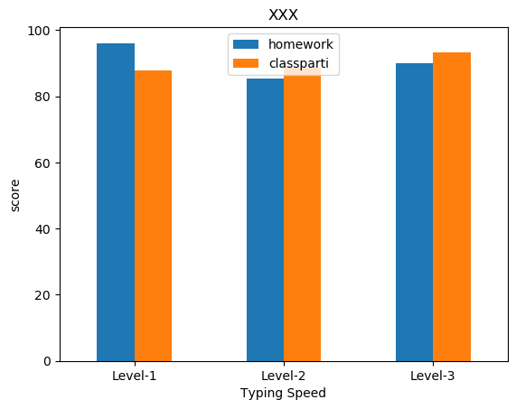
#+CAPTION: Pandas plot bar chart
#+LABEL: fig:PandasPlot-10
#+name: fig:PandasPlot-10
#+ATTR_LATEX: :width 300
#+ATTR_HTML: :width 500
#+ATTR_ORG: :width 500
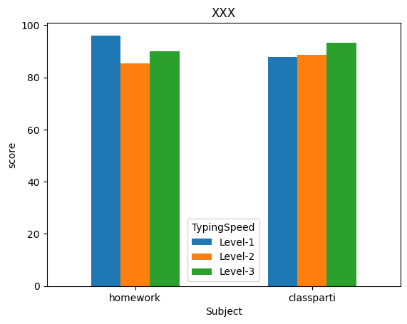

** Regression line chart
#+BEGIN_SRC python -r -n :results output :exports both
# 載入函式庫
import pandas as pd
import seaborn as sns

# 讀取csv
docURL = 'https://letranger.github.io/PythonCourse/scores.csv'
df = pd.read_csv(docURL)

sns.regplot(x="midexam", y='finalexam', data=df);

#fig = sns.regplot(x="midexam", y='finalexam', data=df);
#savefig = fig.get_figure()
#savefig.savefig('images/PandasPlot4.png')

#+END_SRC

#+RESULTS:

#+CAPTION: Pandas plot scatter chart
#+LABEL: fig:PandasPlot-4
#+name: fig:PandasPlot-4
#+ATTR_LATEX: :width 400
#+ATTR_HTML: :width 500
#+ATTR_ORG: :width 500
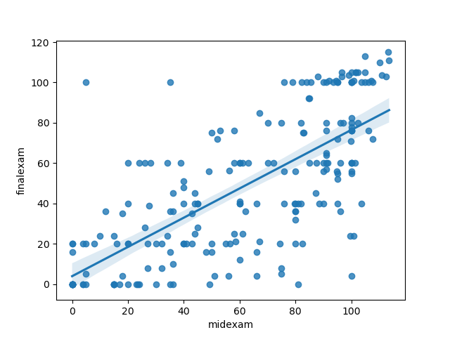

** Pie chart
*** DEMO
#+BEGIN_SRC python -r -n :results output :exports both :wrap
# 載入函式庫
import pandas as pd

# 讀取csv
docURL = 'https://letranger.github.io/PythonCourse/scores.csv'
df = pd.read_csv(docURL)

# 計算總分
df['Final'] = df.classparti*.1 + df.typing*.1 + df.homework*.2 + df.midexam*.3 + df.finalexam*.3

# create new column according to typing speed
df.loc[df.typing < 60, 'TypingSpeed' ] = 'Level-1'
df.loc[df.typing.between(60, 80), 'TypingSpeed' ] = 'Level-2'
df.loc[df.typing > 80, 'TypingSpeed' ] = 'Level-3'
print(df.groupby('TypingSpeed').count())
df.groupby('TypingSpeed')['TypingSpeed'].count().plot(kind='pie', title="XXX", rot=0, legend=True)
# 如果不存圖檔就不用執行以下程式
#fig = df.groupby('TypingSpeed')['TypingSpeed'].count().plot(kind='pie', title="XXX", rot=0, legend=True)
#savefig = fig.get_figure()
#savefig.savefig('images/pandasPlot2.png', bbox_inches='tight')
#+END_SRC

#+RESULTS:
#+begin_results
              id  classparti  typing  homework  midexam  finalexam  Final
TypingSpeed
Level-1       25          25      25        25       25         25     25
Level-2       86          86      86        86       86         86     86
Level-3      101         101     101       101      100        101    100
#+end_results

#+CAPTION: Pandas plot pie chart
#+LABEL: fig:PandasPlot-2
#+name: fig:PandasPlot-2
#+ATTR_LATEX: :width 400
#+ATTR_HTML: :width 300
#+ATTR_ORG: :width 400
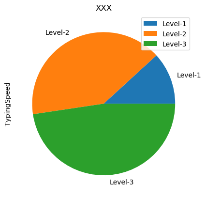
*** 如何避免圖例擋住圖表
- [[https://stackoverflow.com/questions/4700614/how-to-put-the-legend-out-of-the-plot][How to put the legend out of the plot]]

** Scatter chart
#+BEGIN_SRC python -r -n :results output :exports both
# 載入函式庫
import pandas as pd

# 讀取csv
docURL = 'https://letranger.github.io/PythonCourse/scores.csv'
df = pd.read_csv(docURL)

df[['midexam','finalexam']].plot(kind='scatter', x=1, y=0)
fig = df[['midexam','finalexam']].plot(kind='scatter', x=1, y=0)

# 如果不存圖檔就不用執行以下程式
#savefig = fig.get_figure()
#savefig.savefig('images/PandasPlot3.png')
#+END_SRC

#+RESULTS:
#+CAPTION: Pandas plot scatter chart
#+LABEL: fig:PandasPlot-3
#+name: fig:PandasPlot-3
#+ATTR_LATEX: :width 400
#+ATTR_HTML: :width 500
#+ATTR_ORG: :width 400
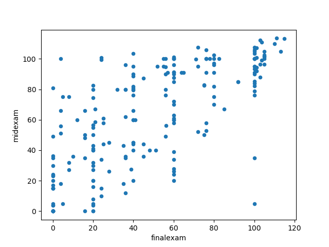

** 六角箱圖 (Hexbin Chart)
#+Begin_SRC python -r -n :results output :exports both
# 載入函式庫
import pandas as pd

# 讀取csv
docURL = 'https://letranger.github.io/PythonCourse/scores.csv'
df = pd.read_csv(docURL)

df[['midexam','finalexam']].plot(kind='hexbin', x=1, y=0, gridsize=25)

fig = df[['midexam','finalexam']].plot(kind='hexbin', x=1, y=0, gridsize=25)
#savefig = fig.get_figure()
#savefig.savefig('images/PandasPlot6.png')
#+END_SRC

#+RESULTS:
#+CAPTION: Pandas plot hexbin chart
#+LABEL: fig:PandasPlot-hexbin
#+name: fig:PandasPlot-hexbin
#+ATTR_LATEX: :width 400
#+ATTR_HTML: :width 500
#+ATTR_ORG: :width 400
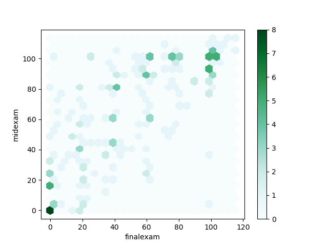

** [課堂練習]手搖飲料店營運分析 :TNFSH:
綜合運用 DataFrame 建立、欄位運算、排序、篩選與 groupby，分析一家手搖飲料店的營運數據。

指定 seed：
#+begin_src python -r -n :results output :exports both
import pandas as pd
import numpy as np
np.random.seed(7788)

drinks = ['珍珠奶茶', '綠茶', '紅茶拿鐵', '冬瓜茶', '多多綠', '四季春', '烏龍茶', '可可']
data = {
    '品項': drinks,
    '價格': [55, 25, 65, 30, 50, 35, 40, 60],
    '熱量': np.random.randint(50, 600, 8),
    '月銷量': np.random.randint(100, 1000, 8),
}
df = pd.DataFrame(data)
#+end_src

任務：
1. 新增「月營收」欄位（=價格 × 月銷量=）
2. 按月營收由高到低排序，印出品項與月營收
3. 篩選出低熱量飲品（熱量 < 200），印出品項與熱量
4. 用 =pd.cut()= 將價格分為三個區間（平價 0~35、中價 35~50、高價 50~100），再用 =groupby()= 計算各價位的平均月銷量

結果範例
#+RESULTS:
#+begin_example
=== 1. 新增月營收 ===
     品項  價格   熱量  月銷量    月營收
0  珍珠奶茶  55  353  878  48290
1    綠茶  25  307  653  16325
2  紅茶拿鐵  65  151  655  42575
3   冬瓜茶  30  480  202   6060
4   多多綠  50  350  205  10250
5   四季春  35  254  685  23975
6   烏龍茶  40  339  285  11400
7    可可  60  495  204  12240

=== 2. 營收排行 ===
     品項    月營收
0  珍珠奶茶  48290
2  紅茶拿鐵  42575
5   四季春  23975
1    綠茶  16325
7    可可  12240
6   烏龍茶  11400
4   多多綠  10250
3   冬瓜茶   6060

=== 3. 低熱量飲品 (<200) ===
     品項   熱量
2  紅茶拿鐵  151

=== 4. 各價位平均月銷量 ===
價位
平價    513.0
中價    245.0
高價    579.0
#+end_example

*** solution :noexport:
#+begin_src python -r -n :results output :exports both
import pandas as pd
import numpy as np
np.random.seed(7788)

drinks = ['珍珠奶茶', '綠茶', '紅茶拿鐵', '冬瓜茶', '多多綠', '四季春', '烏龍茶', '可可']
data = {
    '品項': drinks,
    '價格': [55, 25, 65, 30, 50, 35, 40, 60],
    '熱量': np.random.randint(50, 600, 8),
    '月銷量': np.random.randint(100, 1000, 8),
}
df = pd.DataFrame(data)

# 1. 新增月營收欄位
df['月營收'] = df['價格'] * df['月銷量']
print('=== 1. 新增月營收 ===')
print(df)
print()

# 2. 按月營收排序
print('=== 2. 營收排行 ===')
print(df.sort_values('月營收', ascending=False)[['品項', '月營收']])
print()

# 3. 低熱量飲品
print('=== 3. 低熱量飲品 (<200) ===')
low_cal = df[df['熱量'] < 200]
print(low_cal[['品項', '熱量']])
print()

# 4. 各價位平均月銷量
df['價位'] = pd.cut(df['價格'], bins=[0, 35, 50, 100], labels=['平價', '中價', '高價'])
print('=== 4. 各價位平均月銷量 ===')
print(df.groupby('價位', observed=False)['月銷量'].mean().round(0))
#+end_src

* [作業] :TNFSH:
** 403期中考得分統計
- 原始數據
#+CAPTION: CSV 內容
#+LABEL: fig:scoreCSV
#+name: fig:scoreCSV
#+ATTR_LATEX: :width 400
#+ATTR_HTML: :width 500
#+ATTR_ORG: :width 500
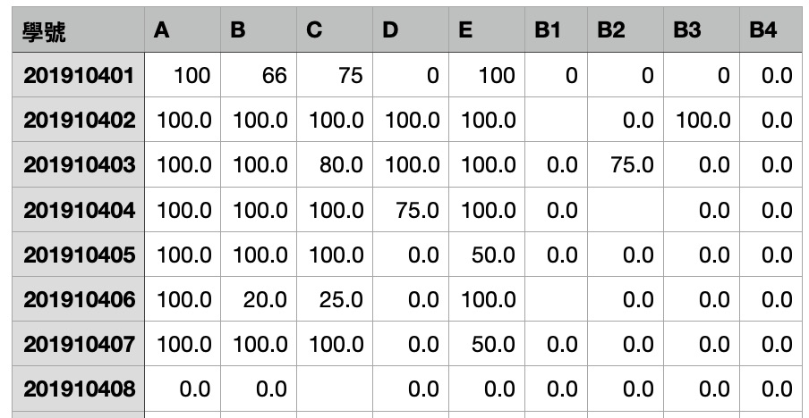
- [[file:cs109score.csv][cs109score.csv]]為 T 市某校的資訊科線上期中考系統所匯出的成績檔，該次考試共計 10 題，其中
  - 前 5 題(A,B,C,D,E)為基本題，每題 100 分，
  - 後 4 題為加分題(B1~B4)，每題 100 分
  - 本次考試原始總分(TOTAL)最高為 800 分；
  - 原始總分除以 5 即為期中考得分(SCORE)
  - 此次期中考得分(SCORE)上限為 160 分。
*** 任務 1 (10%):
- 將有缺失值的部份以 0 分取代。
- 直接輸出前10筆資料
*** 任務 2 (20%):
- 求出每個人的原始總分(即所有分數)，新增的欄位名稱為TOTAL
- 新增欄位SCORE, 其值為每個人的實際得分(原始總分TOTAL除以 5)
- 直接輸出前10筆資料
*** 任務 3 (20%)
- 新增班級欄位(已知學號的前四碼為入學年份、接下來的三碼為班級、末兩碼為座號）
- 輸出前10筆資料(依SCORE由高到低排序)
*** 任務 4 (10%):
求所有受試者第 B 及 B1 兩題的 scatter plot 以及 regression line。如下圖:
  #+CAPTION: 任務4
  #+LABEL: fig:task4
  #+name: fig:task4
  #+ATTR_LATEX: :width 400
  #+ATTR_HTML: :width 560
  #+ATTR_ORG: :width 560
  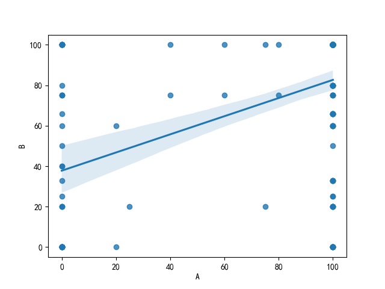
*** 任務 5 (20%):
- 新增ABILITY欄位，依以下條件填入類別
  - SCORE < 60, ABILITY: 'LEVEL-1'
  - 60 <= SCORE < 80, ABILITY: 'LEVEL-2'
  - SCORE >= 80, ABILITY: 'LEVEL-3'
*** 任務 6 (20%):
交叉分析，依ABILITY分組，查看此三組學生的前三題(A, B, C)得分情況，並繪製圖表
#+CAPTION: 任務6
#+LABEL: fig:task6-cross
#+name: fig:task6-cross
#+ATTR_LATEX: :width 300
#+ATTR_ORG: :width 300
#+ATTR_HTML: :width 500
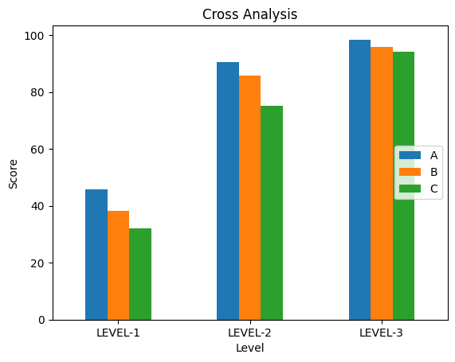
*** 其他任務 :noexport:
**** 任務 4:
- 由學號欄中提出班級資料， 新增一欄班級欄(欄位名稱CLAS)，班級為學號的第 5~7 碼，如 201910107，表示該生為 101 班。
- 直接輸出前10筆資料
**** 任務 5: 求出各題的平均得分，以直條長條圖顯示。如下圖:
  #+CAPTION: task5
  #+LABEL: fig:task5
  #+name: fig:task5
  #+ATTR_LATEX: :width 400
  #+ATTR_HTML: :width 560
  #+ATTR_ORG: :width 560
  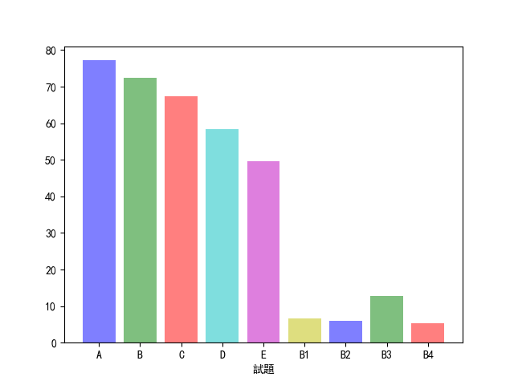
**** 任務 6: 以班級為分組依據，畫出各班平均得分，以橫向長條圖顯示。如下圖:
  #+CAPTION: task6
  #+LABEL: fig:task6
  #+name: fig:task6
  #+ATTR_LATEX: :width 400
  #+ATTR_HTML: :width 560
  #+ATTR_ORG: :width 560
  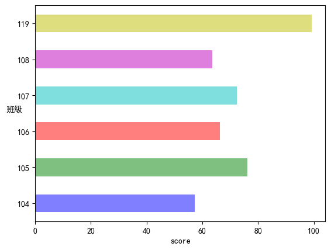
**** 任務 7: 求 119 班各題平均得分，以 pie chart 顯示。如下圖:
  #+CAPTION: task7
  #+LABEL: fig:task7
  #+name: fig:task7
  #+ATTR_LATEX: :width 400
  #+ATTR_HTML: :width 560
  #+ATTR_ORG: :width 560
  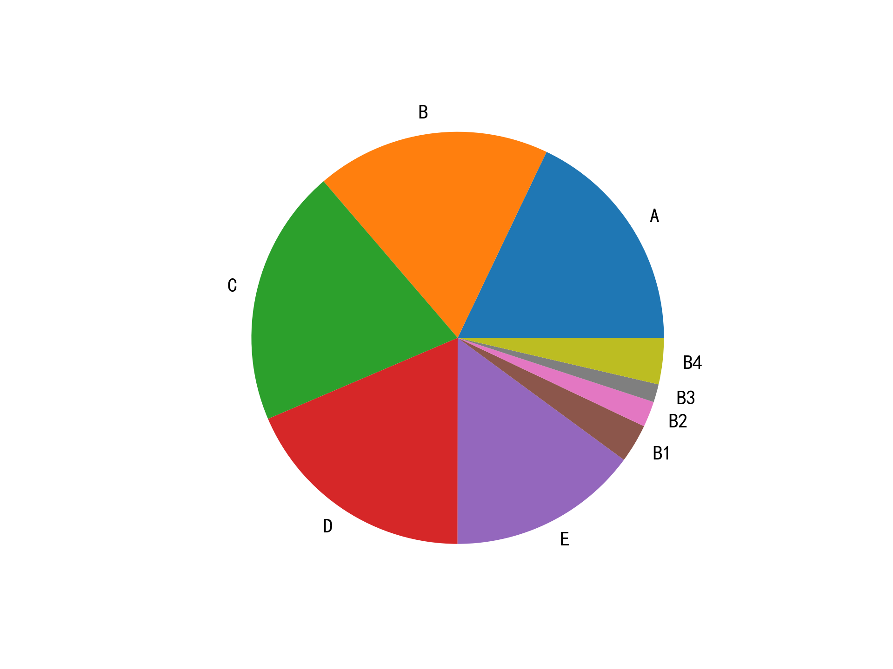
*** Solution :noexport:
**** 任務1
#+begin_src python -r -n :results output :exports both
import numpy as np
import pandas as pd
import seaborn as sns
import matplotlib.pyplot as plt

origdf = pd.read_csv("cs109score.csv")

plt.rcParams['font.sans-serif'] = ['SimHei'] # 步驟一（替換sans-serif字型）
plt.rcParams['axes.unicode_minus'] = False  # 步驟二（解決座標軸負數的負號顯示問題）
##1
#origdf.fillna(0, inplace=True)
origdf = origdf.fillna(0)
print(origdf.head(10))
#+end_src

#+RESULTS:
#+begin_example
          學號      A      B      C      D      E    B1     B2     B3   B4
0  201910401  100.0   66.0   75.0    0.0  100.0   0.0    0.0    0.0  0.0
1  201910402  100.0  100.0  100.0  100.0  100.0   0.0    0.0  100.0  0.0
2  201910403  100.0  100.0   80.0  100.0  100.0   0.0   75.0    0.0  0.0
3  201910404  100.0  100.0  100.0   75.0  100.0   0.0    0.0    0.0  0.0
4  201910405  100.0  100.0  100.0    0.0   50.0   0.0    0.0    0.0  0.0
5  201910406  100.0   20.0   25.0    0.0  100.0   0.0    0.0    0.0  0.0
6  201910407  100.0  100.0  100.0    0.0   50.0   0.0    0.0    0.0  0.0
7  201910408    0.0    0.0    0.0    0.0    0.0   0.0    0.0    0.0  0.0
8  201910409  100.0  100.0   75.0  100.0   25.0  25.0  100.0    0.0  0.0
9  201910410  100.0   60.0  100.0  100.0  100.0   0.0    0.0    0.0  0.0
#+end_example

**** 任務2

#+begin_src python -r -n :results output :exports both
import numpy as np
import pandas as pd
import seaborn as sns
import matplotlib.pyplot as plt

origdf = pd.read_csv("cs109score.csv")

plt.rcParams['font.sans-serif'] = ['SimHei'] # 步驟一（替換sans-serif字型）
plt.rcParams['axes.unicode_minus'] = False  # 步驟二（解決座標軸負數的負號顯示問題）
##1
#origdf.fillna(0, inplace=True)
origdf = origdf.fillna(0)
##2
items = ['A', 'B', 'C', 'D', 'E', 'B1', 'B2' ,'B3', 'B4']
origdf['TOTAL'] = origdf['A']+origdf['B']+origdf['C']+origdf['D']+origdf['E']+origdf['B1']+origdf['B2']+origdf['B3']+origdf['B4']

origdf['SCORE'] = origdf['TOTAL']/5
print('=========2============')
print(origdf.head(10))
##4
origdf['班級'] = origdf['學號'].astype(str).str[4:7]

print(origdf.sort_values(by='SCORE', ascending=False).head(10))

origdf.loc[origdf.SCORE < 60, 'ABILITY' ] = 'LEVEL-1'
origdf.loc[origdf.SCORE.between(60, 80, inclusive='left'), 'ABILITY' ] = 'LEVEL-2'  # 60 <= SCORE < 80
origdf.loc[origdf.SCORE >= 80, 'ABILITY' ] = 'LEVEL-3'
print('=========4============')
print(origdf.head(10))

fig = origdf.groupby('ABILITY')[['A','B','C']].mean().plot(kind='bar', title="Cross Analysis", rot=0, legend=True)
fig.set_xlabel("Level")
fig.set_ylabel("Score")
fig.legend(loc="center right")
savefig = fig.get_figure()# 如果不存圖檔就不用設定這行
savefig.savefig('images/pandastask5.png', bbox_inches='tight')
##5
#y_pos = np.arange(len(items))
#plt.bar(y_pos, origdf[items].mean(), color = ['b','g','r','c','m','y'], alpha=0.5)
#plt.xticks(y_pos, items)
#plt.xlabel('試題')
#plt.savefig('images/task5.png')
#plt.clf()
###6
#fig = origdf.groupby('班級')['分數'].mean().plot(kind='barh', color = ['b','g','r','c','m','y'], alpha=0.5)
#fig.set_xlabel('score')
#fig.set_ylabel('班級', rotation=0)
#resfig = fig.get_figure()
#resfig.savefig('images/task6.png', bbox_inches='tight')
###7
#df119 = origdf[(origdf.班級 == '119')]
#plt.clf()
##print(df119[items].mean())
#plt.pie(df119[items].mean(), labels = items)
#plt.savefig('images/task7.png', dpi=300)
###8
#import seaborn as sns
#plt.clf()
#fig = sns.regplot(x="A",  y="B", data=origdf)
#                       resfig = fig.get_figure()
#resfig.savefig("images/task8.png")
#+end_src

#+RESULTS:
#+begin_example
=========2============
          學號      A      B      C      D  ...     B2     B3   B4  TOTAL  SCORE
0  201910401  100.0   66.0   75.0    0.0  ...    0.0    0.0  0.0  341.0   68.2
1  201910402  100.0  100.0  100.0  100.0  ...    0.0  100.0  0.0  600.0  120.0
2  201910403  100.0  100.0   80.0  100.0  ...   75.0    0.0  0.0  555.0  111.0
3  201910404  100.0  100.0  100.0   75.0  ...    0.0    0.0  0.0  475.0   95.0
4  201910405  100.0  100.0  100.0    0.0  ...    0.0    0.0  0.0  350.0   70.0
5  201910406  100.0   20.0   25.0    0.0  ...    0.0    0.0  0.0  245.0   49.0
6  201910407  100.0  100.0  100.0    0.0  ...    0.0    0.0  0.0  350.0   70.0
7  201910408    0.0    0.0    0.0    0.0  ...    0.0    0.0  0.0    0.0    0.0
8  201910409  100.0  100.0   75.0  100.0  ...  100.0    0.0  0.0  525.0  105.0
9  201910410  100.0   60.0  100.0  100.0  ...    0.0    0.0  0.0  460.0   92.0

[10 rows x 12 columns]
            學號      A      B      C      D  ...     B3     B4  TOTAL  SCORE   班級
52   201910517  100.0  100.0  100.0  100.0  ...  100.0  100.0  800.0  160.0  105
99   201910627  100.0  100.0  100.0  100.0  ...  100.0  100.0  760.0  152.0  106
184  201911905  100.0  100.0  100.0  100.0  ...   50.0  100.0  750.0  150.0  119
56   201910521  100.0  100.0  100.0  100.0  ...  100.0   80.0  740.0  148.0  105
189  201911910  100.0  100.0  100.0  100.0  ...    0.0  100.0  725.0  145.0  119
116  201910707  100.0  100.0  100.0  100.0  ...   20.0  100.0  720.0  144.0  107
42   201910507  100.0  100.0  100.0  100.0  ...  100.0  100.0  700.0  140.0  105
136  201910727  100.0  100.0  100.0  100.0  ...   20.0   20.0  690.0  138.0  107
188  201911909  100.0  100.0  100.0  100.0  ...   25.0   50.0  675.0  135.0  119
181  201910836  100.0  100.0  100.0  100.0  ...   20.0   20.0  640.0  128.0  108

[10 rows x 13 columns]
=========4============
          學號      A      B      C      D  ...   B4  TOTAL  SCORE   班級  ABILITY
0  201910401  100.0   66.0   75.0    0.0  ...  0.0  341.0   68.2  104  LEVEL-2
1  201910402  100.0  100.0  100.0  100.0  ...  0.0  600.0  120.0  104  LEVEL-3
2  201910403  100.0  100.0   80.0  100.0  ...  0.0  555.0  111.0  104  LEVEL-3
3  201910404  100.0  100.0  100.0   75.0  ...  0.0  475.0   95.0  104  LEVEL-3
4  201910405  100.0  100.0  100.0    0.0  ...  0.0  350.0   70.0  104  LEVEL-2
5  201910406  100.0   20.0   25.0    0.0  ...  0.0  245.0   49.0  104  LEVEL-1
6  201910407  100.0  100.0  100.0    0.0  ...  0.0  350.0   70.0  104  LEVEL-2
7  201910408    0.0    0.0    0.0    0.0  ...  0.0    0.0    0.0  104  LEVEL-1
8  201910409  100.0  100.0   75.0  100.0  ...  0.0  525.0  105.0  104  LEVEL-3
9  201910410  100.0   60.0  100.0  100.0  ...  0.0  460.0   92.0  104  LEVEL-3

[10 rows x 14 columns]
#+end_example
#+CAPTION: task5
#+LABEL: fig:task5-sol
#+name: fig:task5-sol
#+ATTR_LATEX: :width 400
#+ATTR_HTML: :width 560
#+ATTR_ORG: :width 560

#+CAPTION: task6
#+LABEL: fig:task6-sol
#+name: fig:task6-sol
#+ATTR_LATEX: :width 400
#+ATTR_HTML: :width 560
#+ATTR_ORG: :width 560

#+CAPTION: task7
#+LABEL: fig:task7-sol
#+name: fig:task7-sol
#+ATTR_LATEX: :width 400
#+ATTR_HTML: :width 560
#+ATTR_ORG: :width 560

#+CAPTION: task8
#+LABEL: fig:task8-sol
#+name: fig:task8-sol
#+ATTR_LATEX: :width 400
#+ATTR_HTML: :width 560
#+ATTR_ORG: :width 560

#+latex:\newpage

** 進階練習
一dataframe如下
#+begin_src python -r :results output :exports both
import numpy as np
import pandas as pd
scores = {'Math': [900, 50, 70, 80],
          'English': [60, 30, 90, 50],
          'History': [33, 75, np.nan, np.nan]}
df = pd.DataFrame(scores, index=['Simon', 'Allen', 'Jimmy', 'Vanessa'])
#+end_src
- 註：NumPy 2.0 起 =np.NaN= 已移除，一律使用 =np.nan= 。
試解決以下問題：
1. 列出Math分數>100資料
2. 將Simon之Math改為90分
3. 計算History遺漏值筆數
4. 以History平均值取代History中遺漏值
5. 新增"平均"欄位，計算四人各科平均
6. 新增"名次"欄位，以四人平均分數為排序依據
7. 列出平均不及格者
8. 列出數學最高分者姓名
*** Solution :noexport:
#+begin_src python -r -n :results output :exports both
import numpy as np
import pandas as pd
scores = {'Math': [900, 50, 70, 80],
          'English': [60, 30, 90, 50],
          'History': [33, 75, np.nan, np.nan]}  # 註：NumPy 2.0 起 np.NaN 已移除，一律使用 np.nan
df = pd.DataFrame(scores, index=['Simon', 'Allen', 'Jimmy', 'Vanessa'])
print('==1.Math分數>100==')
print(df[df['Math'] > 100])
print('==2.Simon Math=90==')
df.loc[df.index == 'Simon', 'Math'] = 90
print(df)
print('==3.計算History遺漏值筆數==')
print(df.isna().sum())
print('==4.取代History遺漏值==')
#df = df.fillna({'History':df.History.mean()})
#df.fillna({'History':df.History.mean()}, inplace=True)
# 註：pandas 3.0 起預設啟用 Copy-on-Write，df['History'].fillna(..., inplace=True)
# 這種「鏈式」寫法不會改到原本的 df，必須把結果指定回去：
df['History'] = df['History'].fillna(df['History'].mean())
print(df)
print('==5.平均==')
df['平均'] = df.mean(axis=1)
print(df)
print('==6.名次==')
df['名次'] = df['平均'].rank(ascending=False)  # 分數越高名次越前面
print(df)
print('==7.平均不及格==')
print(df[df['平均']<60])
print('==8.數學最高分==')
print(df['Math'].idxmax())

#+end_src
#+latex:\newpage

* 教學影片
- [[https://www.youtube.com/watch?v=GClDLt2TCQA][4-4 假的成績真的算]]
- [[https://www.youtube.com/watch?v=GGxahUW6nF4][4-3 拿真的資料出來玩]]

* Footnotes
[fn:6] [[https://yhtechnote.com/python-pandas/#Series_vs_DataFrame][簡單 Python Pandas 教學：資料科學的入門課]]

[fn:1] [[https://blog.csdn.net/qq_18668137/article/details/80807829][conda、miniconda、anaconda的區別以及在pycharm中選擇conda的虛擬環境]]

[fn:2] [[https://oranwind.org/python-pandas-ji-chu-jiao-xue/][[Python] Pandas 基礎教學]]

[fn:4] [[https://www.itread01.com/content/1547569271.html][Python讀寫csv檔案的幾種方法 及 pandas.read_csv 引數全解]]

[fn:5] [[https://ithelp.ithome.com.tw/articles/10208412][Day23- 資料處理模組-Pandas 介紹]]
