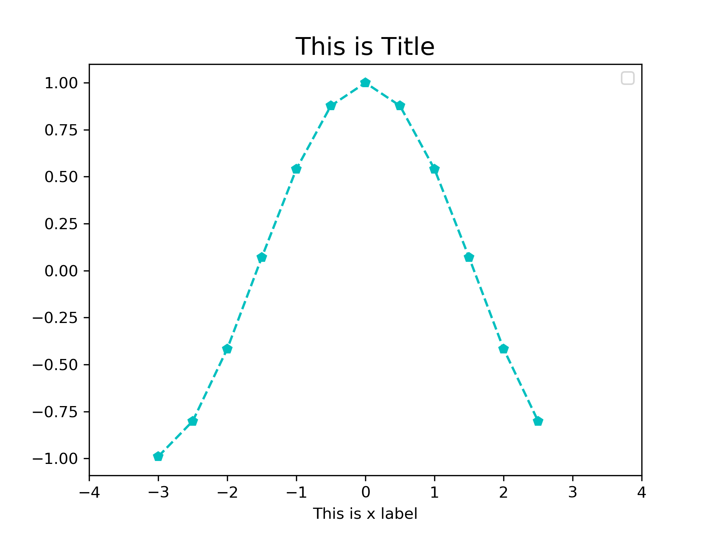
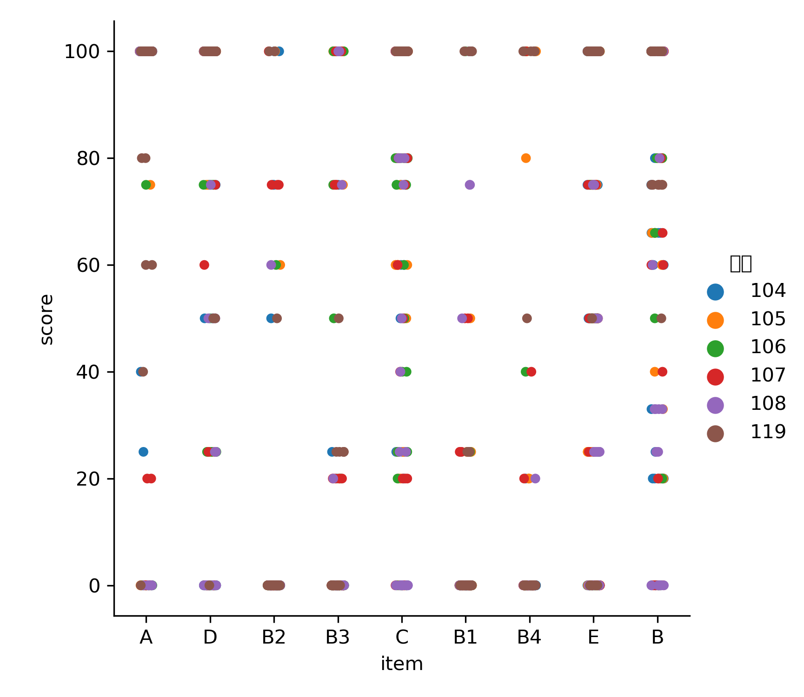

# -*- org-export-babel-evaluate: nil -*-
#+Title: Advanced Materials of Python

#+SETUPFILE: https://fniessen.github.io/org-html-themes/setup/theme-readtheorg.setup
#+STARTUP: showeverything
#+PROPERTY: header-args :eval never-export
#+STARTUP: inlineimages
#+OPTIONS: H:4
#+OPTIONS: \n:t

#+LANGUAGE: en
#+LATEX_HEADER: \usepackage[AUTO]{babel}
#+LATEX_HEADER: \addto\captionsenglish{\renewcommand\contentsname{Outline}}

#+LATEX_HEADER: \usepackage[UTF8, heading]{ctex} 
#+LATEX_HEADER: \usepackage{xltxtra}
#+LATEX_HEADER: \usepackage{xeCJK}
#+LATEX_HEADER: \usepackage{lmodern}
#+LATEX_HEADER: \usepackage{verbatim}
#+LATEX_HEADER: \usepackage{float}
#+LATEX_HEADER: \usepackage{tikz}
#+LATEX_HEADER: \usepackage{wrapfig}
#+LATEX_HEADER: \usepackage{soul}
#+LATEX_HEADER: \usepackage{textcomp}
#+LATEX_HEADER: \usepackage{listing}
#+LATEX_HEADER: \usepackage{geometry}
#+LATEX_HEADER: \usepackage{algorithm}
#+LATEX_HEADER: \usepackage{algorithmic}
#+LATEX_HEADER: \usepackage{marvosym}
#+LATEX_HEADER: \usepackage{wasysym}
#+LATEX_HEADER: \usepackage{natbib}
#+LATEX_HEADER: \usepackage{fancyhdr}
#+LATEX_HEADER: \usepackage{fontspec,xunicode,xltxtra}
#+LATEX_HEADER: \usepackage{CJKnumb}
#+LATEX_HEADER: \usepackage{amsfonts}
#+LATEX_HEADER: \usepackage[default]{sourcecodepro}
#+LATEX_HEADER: \usepackage[T1]{fontenc}
#+LATEX_HEADER: \setCJKmainfont{SimSun} % 設置缺省中文字體
#+LATEX_HEADER: \setmainfont{Times New Roman} % 英文襯線字體
#+LATEX_HEADER: \setsansfont{Source Code Pro} % 英文無襯線字體
#+LATEX_HEADER: \setmonofont{Source Code Pro} % 英文等寬字體
#+LATEX_HEADER: \setCJKmainfont[Scale=0.9]{Adobe Heiti Std} % 中文字體
#+LATEX_HEADER: \setCJKmonofont[Scale=0.9]{Adobe Heiti Std}
#+LATEX_HEADER: \usepackage{color}
#+LATEX_HEADER: \RequirePackage{fancyvrb}
#+LATEX_HEADER: \usepackage{placeins}
#+LATEX_HEADER: \vspace{-0.2cm}
#+LATEX_CLASS: article
#+LATEX_CLASS_OPTIONS: [a4paper,12pt]
#+LATEX_HEADER: \usepackage{xcolor}
#+LATEX_HEADER: \hypersetup{pdfauthor={Name},colorlinks,linkcolor={red!50!black},citecolor={blue!50!black},urlcolor={blue!80!black}}
#+LATEX_HEADER: \definecolor{dkgreen}{rgb}{0,0.6,0}
#+LATEX_HEADER: \definecolor{dred}{rgb}{0.545,0,0}
#+LATEX_HEADER: \definecolor{dblue}{rgb}{0,0,0.545}
#+LATEX_HEADER: \definecolor{lgrey}{rgb}{0.9,0.9,0.9}
#+LATEX_HEADER: \definecolor{gray}{rgb}{0.4,0.4,0.4}
#+LATEX_HEADER: \definecolor{darkblue}{rgb}{0.0,0.0,0.6}
#+LATEX_HEADER: \definecolor{bubbles}{rgb}{0.91, 1.0, 1.0}
#+LATEX_HEADER: \definecolor{foreground}{RGB}{220,220,204} % 淺灰
#+LATEX_HEADER: \definecolor{background}{RGB}{62,62,62} % 淺黑
#+LATEX_HEADER: \definecolor{preprocess}{RGB}{250,187,249} % 淺紫
#+LATEX_HEADER: \definecolor{var}{RGB}{239,224,174} % 淺肉色
#+LATEX_HEADER: \definecolor{string}{RGB}{154,150,230} % 淺紫色
#+LATEX_HEADER: \definecolor{type}{RGB}{225,225,116} % 淺黃
#+LATEX_HEADER: \definecolor{function}{RGB}{140,206,211} % 淺天藍
#+LATEX_HEADER: \definecolor{keyword}{RGB}{239,224,174} % 淺肉色
#+LATEX_HEADER: \definecolor{comment}{RGB}{180,98,4} % 深褐色
#+LATEX_HEADER: \definecolor{doc}{RGB}{175,215,175} % 淺鉛綠
#+LATEX_HEADER: \definecolor{comdil}{RGB}{111,128,111} % 深灰
#+LATEX_HEADER: \definecolor{constant}{RGB}{220,162,170} % 粉紅
#+LATEX_HEADER: \lstdefinelanguage{python}{
#+LATEX_HEADER:  backgroundcolor=\color{bubbles},
#+LATEX_HEADER:  basicstyle=\footnotesize \ttfamily \color{dblue} \small \mono \bfseries,
#+LATEX_HEADER:  breakatwhitespace=false,
#+LATEX_HEADER:  breaklines=true,
#+LATEX_HEADER:  captionpos=b,
#+LATEX_HEADER:  comment=[l]{\#},
#+LATEX_HEADER:  morecomment=[s]{/*}{*/},
#+LATEX_HEADER:  commentstyle=\color{comment} \slshape \small \itshape,
#+LATEX_HEADER:  ndkeywords={boolean, throw, import, typeof, null, catch, switch, for, in, int, str, float, self, return, class, if ,elif, endif, while, do, else, True, False , catch, def},
#+LATEX_HEADER:  ndkeywordstyle=\color{dred} \bfseries \small \mono,
#+LATEX_HEADER:  identifierstyle=\color{black},
#+LATEX_HEADER:  deletekeywords={...},
#+LATEX_HEADER:  escapeinside={\%*}{*)},
#+LATEX_HEADER:  frame=single,
#+LATEX_HEADER:  frameround=tttt,
#+LATEX_HEADER:  framesep=0pt,
#+LATEX_HEADER:  rulecolor=\color{background},
#+LATEX_HEADER:  morekeywords={BRIEFDescriptorConfig,string,TiXmlNode,DetectorDescriptorConfigContainer,istringstream,cerr,exit},
#+LATEX_HEADER:  identifierstyle=\color{black},
#+LATEX_HEADER:  stringstyle=\color{blue},
#+LATEX_HEADER:  rulecolor=\color{black},
#+LATEX_HEADER:  showspaces=false,
#+LATEX_HEADER:  showstringspaces=false,
#+LATEX_HEADER:  showtabs=false,
#+LATEX_HEADER:  stepnumber=1,
#+LATEX_HEADER:  tabsize=5,
#+LATEX_HEADER:  title=\lstname,
#+LATEX_HEADER: }
#+LATEX_HEADER: \lstdefinelanguage{shell}{
#+LATEX_HEADER:  backgroundcolor=\color{keyword},
#+LATEX_HEADER:  basicstyle=\footnotesize \ttfamily \color{dblue} \small \mono \bfseries,
#+LATEX_HEADER:  breakatwhitespace=false,
#+LATEX_HEADER:  breaklines=true,
#+LATEX_HEADER:  captionpos=b,
#+LATEX_HEADER:  comment=[l]{\#},
#+LATEX_HEADER:  morecomment=[s]{/*}{*/},
#+LATEX_HEADER:  commentstyle=\color{comment} \slshape \small \itshape,
#+LATEX_HEADER:  identifierstyle=\color{black},
#+LATEX_HEADER:  deletekeywords={...},
#+LATEX_HEADER:  escapeinside={\%*}{*)},
#+LATEX_HEADER:  frame=single,
#+LATEX_HEADER:  frameround=tttt,
#+LATEX_HEADER:  framesep=0pt,
#+LATEX_HEADER:  rulecolor=\color{background},
#+LATEX_HEADER:  morekeywords={BRIEFDescriptorConfig,string,TiXmlNode,DetectorDescriptorConfigContainer,istringstream,cerr,exit},
#+LATEX_HEADER:  identifierstyle=\color{black},
#+LATEX_HEADER:  stringstyle=\color{blue},
#+LATEX_HEADER:  rulecolor=\color{black},
#+LATEX_HEADER:  showspaces=false,
#+LATEX_HEADER:  showstringspaces=false,
#+LATEX_HEADER:  showtabs=false,
#+LATEX_HEADER:  stepnumber=1,
#+LATEX_HEADER:  tabsize=5,
#+LATEX_HEADER:  title=\lstname,
#+LATEX_HEADER: }
#+LATEX_HEADER: \usepackage{enumitem}
#+LATEX_HEADER: \setenumerate{noitemsep}
#+LATEX_HEADER: \setenumerate{nolistsep}
#+LATEX_HEADER: \setitemize{nolistsep}

#+LATEX_HEADER: \vspace{-\topsep}

#+BEGIN_COMMENT
投影片設定
#+REVEAL_ROOT: https://cdn.jsdelivr.net/reveal.js/3.0.0/
#+REVEAL_THEME: moon
#+OPTIONS: reveal_width:1400 reveal_height:960
#+OPTIONS: toc:1
#+REVEAL_MARGIN: 0.1
#+REVEAL_MIN_SCALE: 0.9
#+REVEAL_MAX_SCALE: 3.5

網頁設定
#+SETUPFILE: https://fniessen.github.io/org-html-themes/setup/theme-readtheorg.setup
#+STARTUP: showeverything
#+PROPERTY: header-args :eval never-export
#+STARTUP: inlineimages
#+OPTIONS: H:4
#+OPTIONS: \n:t
#+END_COMMENT

#+latex:\newpage
* Python 套件管理
** pip v.s. conda
*** pip or conda
- Python 的一大優勢之一便是龐大的第三方函式庫，讓使用 python 的程式設計師可以方便的呼叫、進行如網路資料下載解析、資料的視覺化、甚或是大數據的複雜分析與人工智慧的相關套件。，
- 目前用來管理這些龐大套件的工具主要有二：pip 與 Conda。
*** pip
- Pip是[[https://www.pypa.io/en/latest/][Python Packaging Authority]]推薦、用於從[[https://pypi.org/][Python Package Index]]安裝套件的工具，提供了對 Python 套件的搜㝷、下載、安裝、卸載的功能。
- 若在 python.org 下載最新版本的 python，則已內建 pip 安裝套件。 Python 3.4+ 以上版本均已包括 pip 
- 該工具類似 Linux 下的 apt/yum 或 MAC 下的[[https://brew.sh/index_zh-tw][Homebrew]]。
*** conda
- Conda 是一個開源的跨平台工具軟體，它被設計作為 Python、R、Lua、Scala、C/C++、FORTRAN/ 與 Java 等任何程式語言的套件、依賴性以及工作環境管理員，特別受到以 Python 作為主要程式語言的資料科學團隊所喜愛。
- 適用平台：Windows, macOS, Linux
- 傳統 Python 使用者以 pip 作為套件管理員（package manager）、以 venv 作為工作環境管理員（environment manager），而 conda 則達成了「兩個願望、一次滿足」既可以管理套件亦能夠管理工作環境。[fn:1]
*** In both cases:
- Written in Python
- Open source (Conda is BSD and pip is MIT)
*** difference between conda, anaconda, and miniconda
- conda is both a command line tool, and a python package. [fn:2]
- Anaconda 發行版會預裝很多套件，而 Miniconda 是最小的 conda 安裝環境， 一個乾淨的 conda 環境。
- pip  只是運與安裝 python package，而 conda 用來安裝管理任何語言的包。
- 不一定要安裝 Anaconda 或 Miniconda，也可透過 pip 直接安裝 conda
  #+BEGIN_SRC shell
  pip install conda
  #+END_SRC

** conda 安裝與使用
*** 下載 v.s. 安裝
- [[https://www.anaconda.com/distribution/][Anaconda]]
- [[https://docs.conda.io/en/latest/miniconda.html][Miniconda]]
*** 移除
- Windows: uninstall
- Linux/macOS:
  src_shell[:exports code]{ rm -rf ~/anaconda }
** python package 安裝(conda)
- 安裝 package:
  src_python[:exports code]{ conda install packageName }
  #+BEGIN_SRC shell -r -n
  conda install pandas
  #+END_SRC
- 移除 package:
  src_python[:exports code]{ conda remove packageName }
  #+BEGIN_SRC shell -r -n
  conda remove pandas
  #+END_SRC
- 安裝特定版本 python
  src_python[:exports code]{ conda install python=version }
  #+BEGIN_SRC shell -r -n
  conda install python=3.5
  #+END_SRC
- 了解目前系統可用套件
  #+begin_src shell -r -n
    conda list
  #+end_src
** Python 常用函式庫
*** 爬蟲
**** Scrapy:
#+ATTR_LATEX: :width 400
#+ATTR_HTML: :width 400
#+ATTR_ORG: :width 400
#+RESULTS:
[[file:images/scrapy.jpg]]
- Scrapy，Python 開發的一個快速、高層次的 web 數據抓取框架，用於抓取 web 站點並從頁面中提取結構化的數據。Scrapy 用途廣泛，可以用於數據挖掘、監測和自動化測試[fn:3]。
- Scrapy 吸引人的地方在於它是一個框架，任何人都可以根據需求方便的修改。它也提供了多種類型爬蟲的基類，如 BaseSpider、sitemap 爬蟲等。
**** beautifulsoup4:
#+ATTR_LATEX: :width 400
#+ATTR_HTML: :width 400
#+ATTR_ORG: :width 400
#+RESULTS:
[[file:images/bs.png]]
- Beautiful Soup 是一個可以從 HTML 或 XML 文件中提取數據的 Python 庫.[fn:4]
- Beautiful Soup 是一個 Python 的函式庫模組，可以讓開發者僅須撰寫非常少量的程式
  碼，就可以快速解析網頁 HTML 碼，從中翠取出使用者有興趣的資料、去蕪存菁，降低網
  路爬蟲程式的開發門檻、加快程式撰寫速度。[fn:5]
- 而 Beautiful Soup 是基於 HTML DOM 的，會載入整個文檔，解析整個 DOM 樹，因此時間和內存開銷都會大很多，所以性能要低於 lxml。[fn:6]
**** Selenium
#+ATTR_LATEX: :width 400
#+ATTR_HTML: :width 400
#+ATTR_ORG: :width 400
#+RESULTS:
[[file:images/selenium.jpg]]
- 原為網頁測試工具，但由於可以直接以程式碼操控瀏覽器的特性，使其成為網路爬蟲必備
  的工具之一。[fn:7]
- Selenium 執行「真實的瀏覽器」來進行網站操作的自動化，它能夠直接獲取即時的內容，包括被 JavaScript 修改過的 DOM 內容，讓程式可以直接與網頁元素即時互動、執行 JavaScript 程式，因此也適用於前端採用 AJAX 技術的網站。[fn:8]
- Selenium 是許多 Web Testing 工具的核心，利用 Selenium 操作網頁表單資料、點選按鈕或連結、取得網頁內容並進行檢驗，可以滿足相當多測試的需求。
*** 網站
**** Django
#+ATTR_LATEX: :width 400
#+ATTR_HTML: :width 400
#+ATTR_ORG: :width 400
#+RESULTS:
[[file:images/django.jpg]]
- Django (/ˈdʒæŋɡoʊ/ jang-goh) 可以說是 Python 最著名的 Web Framework，一些知名的網站如 Pinterest, Instagram, Disqus 等等都使用過它來開發。[fn:9]
- 免費開放原始碼
- 著重快速開發、高效能
- 遵從 DRY ( Don't Repeat Yourself ) 守則，致力於淺顯易懂和優雅的程式碼
- 使用類似 Model–view–controller (MVC) pattern 的架構
**** Flask
#+ATTR_LATEX: :width 400
#+ATTR_HTML: :width 400
#+ATTR_ORG: :width 400
#+RESULTS:
[[file:images/flask.png]]
- Flask 是一個使用 Python 撰寫的輕量級 Web 應用程式框架，由於其輕量特性，也稱為
  micro-framework（微框架）。[fn:10]
- Flask 和 Django 不同的地方在於 Flask 給予開發者非常大的彈性（當然你也可以說是
  需要思考更多事情），可以選用不同的用的 extension 來增加其功能。
- 相比之下，Django 雖然完善但技術選擇相對不彈性，不論是 ORM、表單驗證或是模版引
  擎都有自己的作法
- 。事實上沒有最好的框架，只有合適的使用情境。
*** 資料處理科學計算
**** Numpy
#+ATTR_LATEX: :width 400
#+ATTR_HTML: :width 400
#+ATTR_ORG: :width 400
#+RESULTS:
[[file:images/numpy.jpg]]
- Numpy 底層以 C 和 Fortran 語言實作，所以能快速操作多重維度的陣列。[fn:11]
- 當 Python 處理龐大資料時，其原生 list 效能表現並不理想（但可以動態存異質資料），而 Numpy 具備平行處理的能力，可以將操作動作一次套用在大型陣列上。
- 此外 Python 其餘重量級的資料科學相關套件（例如：Pandas、SciPy、Scikit-learn 等）都幾乎是奠基在 Numpy 的基礎上。
**** Scipy
#+ATTR_LATEX: :width 400
#+ATTR_HTML: :width 400
#+ATTR_ORG: :width 400
#+RESULTS:
[[file:images/scipy.png]]
- 科學計算神器
- Numpy 是以矩陣基礎做數據的數學運算，SciPy 就是以 Numpy 為基礎做科學、工程的運算處理的 package，包含統計、優化、整合、線性代數、傅立葉轉換圖像等較高階的科學運算。[fn:12]
**** Pandas
#+ATTR_LATEX: :width 400
#+ATTR_HTML: :width 400
#+ATTR_ORG: :width 400
#+RESULTS:
[[file:images/pandas.png]]
- 建構在 NumPy 之上，提供資料結構與資料處理工具，讓資料清理與分析更為快速與方便
- 適合處理表格或異質資料 (NumPy 適合處理同質之數值陣列資料)
*** 視覺化
**** matplotlib
#+ATTR_LATEX: :width 400
#+ATTR_HTML: :width 400
#+ATTR_ORG: :width 400
#+RESULTS:
[[file:images/matplotlib.jpg]]
- Matplotlib 就是 MATLAB+Plot+Library 的簡稱，因為是模仿 MATLAB 建立的繪圖庫，所以繪
  圖風格會與 MATLAB 有點類似。[fn:13]
- 為了提高處理大量資料的性能，Matplotlib 大量使用了 NumPy 和其相關的擴展代碼。 為了方便快速繪圖， Matplotlib 通過 pyplot 模組提供了一套和 MATLAB 類似的繪圖 API，只需要調用 pyplot 模組所提供的函數，就可以實現快速繪圖及設置圖表的各種細節。
- 另一方面 Matplotlib 也適合互動式繪製圖表，可以很方便地處理二維和三維的圖表。
**** seaborn
#+ATTR_LATEX: :width 400
#+ATTR_HTML: :width 400
#+ATTR_ORG: :width 400
#+RESULTS:
[[file:images/seaborn.png]]
#+ATTR_LATEX: :width 400
#+ATTR_HTML: :width 400
#+ATTR_ORG: :width 400
#+RESULTS:
[[file:images/seabornPlots.jpg]]
- 散點圖矩陣神器
- Seaborn 是 Python 一個著名的數據視覺化的 package, 以 matplotlib 為基底的一個擴
  展包, 它提供了易於理解的統計圖和便利的繪圖指令[fn:14]
- seaborn 庫是對 matplotlib 庫更高級別的封裝，相當於提供了各種統計圖的模板[fn:15]
**** ggplot
#+ATTR_LATEX: :width 300
#+ATTR_HTML: :width 300
#+ATTR_ORG: :width 300
#+RESULTS:
[[file:images/ggplot.jpg]]
- R 語言視覺化神器的 Python 版本
- ggplot2 是一個十分強大的 R 語言可視化包。它的核心理念是將繪圖與數據分離，數據相關
  的繪圖與數據無關的繪圖分離。[fn:16]
- 它是按圖層作圖的，一個語句做一個僅包含基礎作圖單元的圖層，然後通過不同圖層的疊
  加最後成圖。
**** plotly
#+ATTR_LATEX: :width 400
#+ATTR_HTML: :width 400
#+ATTR_ORG: :width 400
#+RESULTS:
[[file:images/plotly.png]]
- 這個神器是個 js 庫，不過也有各種流行的語言介面
- plotly 是一個能讓你畫出互動式圖表的一個開源套件,其基本操作是免費的,如果你想要使用網頁的版本,可以使用更多 plotly 的進階功能的話,就必須付費
*** 機器學習
**** scikit-learn
#+ATTR_LATEX: :width 400
#+ATTR_HTML: :width 400
#+ATTR_ORG: :width 400
#+RESULTS:
[[file:images/scikit-learn.png]]
- 幾乎所有機器學習演算法都囊括
- scikit-learn，又寫作 sklearn，是一個開源的基於 python 語言的機器學習工具包。它通
  過 NumPy, SciPy 和 Matplotlib 等 python 數值計算的庫實現高效的算法應用，並且涵蓋了幾
  乎所有主流機器學習算法。[fn:17]
- sklearn 中常用的 module 有分類、回歸、聚類、降維、模型選擇、預處理。
**** NLTK
#+ATTR_LATEX: :width 300
#+ATTR_HTML: :width 300
#+ATTR_ORG: :width 300
#+RESULTS:
[[file:images/NLTK.png]]
- NLTK 全文是 “Nature Language Tool Kit” (NLTK)，是 Python 中一個經典的、專門用於進行自然語言處理的工具。[fn:18]
- 雖然也能進行部份中文的處理，但是對於中文的支援度自然沒有英文來得好
- 目前而言，繁體中文有兩個套件可以使用，一個是中研院開發的斷詞系統，另一套系統為 jieba(結巴)。
**** TensorFlow
#+ATTR_LATEX: :width 400
#+ATTR_HTML: :width 400
#+ATTR_ORG: :width 400
#+RESULTS:
[[file:images/tensorflow.jpg]]
- Tensorflow 最初為 Google Brian 所開發。在 2015 時，Google 將之開源，為現今重要的深
  度學習框架之一，它支援各式不同的深度學習演算法，並已應用於各大企業服務上，Ex:
  Google, Youtube, Airbnb, Paypal ... 等。[fn:19]
- 此外，Tensorflow 也支援在各式不同的
  device 上運行深度學習 Ex: Tensorflow Lite 、 Tensorflow.js 等等。
- Tensorflow 為目
  前最受歡迎的機器學習、深度學習開源專案。不管是 github fork 的數量、論文的使用次
  數以及熱門程度，均比其他的框架來的多[fn:20]。

深度學習套件
**** Keras
#+ATTR_LATEX: :width 400
#+ATTR_HTML: :width 400
#+ATTR_ORG: :width 400
#+RESULTS:
[[file:images/keras.png]]
- 在 2015 年 TensorFlow 推出的同時，美國麻省理工學院（又是它，這學校開門就能賺錢）
  也推出一套能很容易被使用者透過 Python 寫 Deep learning 的應用程式介面 API ，叫
  做 Keras 。記住， Keras 只有介面喔！ Keras 本身還是得透過 TensorFlow ，或者其
  他像是微軟的 CNTK 這類引擎當作底層，才能執行。[fn:21]
- Keras 使用上比較接近人類的想法（ TensorFlow 設計上沒有錯，只不過比較是針對電腦
  系統跟網路通訊的想法），所以透過 Python 呼叫 Keras 能夠很簡單地描述我們人類想
  要電腦達到 Deep Learning 要做的事情。目前在教學上， Keras 的普及率相當高
- Keras 可以快速有方便運算的主要原因是，它已經將訓練模型的輸入層、隱藏層、輸出層，做好架構，使用者只需要加入並且填寫正確的參數 ex.神經元個數、activation function 的函式…等。[fn:22]
**** PyTorch
#+ATTR_LATEX: :width 400
#+ATTR_HTML: :width 400
#+ATTR_ORG: :width 400
#+RESULTS:
[[file:images/pytorch.jpg]]
- Numpy 的 GPU 版
- PyTorch 為 Facebook 在 2017 年初開源的深度學習框架，其建立在 Torch 之上，且標
  榜 Python First ，為量身替 Python 語言所打造，使用起來就跟寫一般 Python 專案沒
  兩樣，也能和其他 Python 套件無痛整合。PyTorch 的優勢在於其概念相當直觀且語法簡
  潔優雅，因此視為新手入門的一個好選項；再來其輕量架構讓模型得以快速訓練且有效運
  用資源。[fn:23]
- 於 PyTorch 框架中，資料類型定義為張量(Tensor)，張量可以是純量、向量或是更高維度的矩陣，而 torch 函式庫負責張量在 CPU/GPU 的運算。
** python 執行環境建立與維護
- 建立[fn:24]
  #+BEGIN_SRC shell -r -n :eval no
  conda create -n envName
  #+END_SRC
- 啟用
  #+BEGIN_SRC shell -r -n
    source activate envName
  #+END_SRC
- 退出
  #+BEGIN_SRC shell -r -n
    source deactiveate
  #+END_SRC
- 刪除
  #+BEGIN_SRC shell -r -n
    conda env remove -n envName
  #+END_SRC
- 列出目前系統中所有的虛擬環境
  #+BEGIN_SRC shell -r -n
    conda env list
  #+END_SRC

#+latex:\newpage

* Numpy 模組
** 關於 Numpy
- Numpy 是 Python 的一個重要模組，主要用於資料處理上。Numpy 底層以 C 和 Fortran 語言實作，所以能快速操作多重維度的陣列。[fn:25]
- 當 Python 處理龐大資料時，其原生 list 效能表現並不理想（但可以動態存異質資料），而 Numpy 具備平行處理的能力，可以將操作動作一次套用在大型陣列上。
- Python 其餘重量級的資料科學相關套件（例如：Pandas、SciPy、Scikit-learn 等）都幾乎是奠基在 Numpy 的基礎上。因此學會 Numpy 對於往後學習其他資料科學相關套件打好堅實的基礎。
** 匯入模組
- 使用模組裡的函式要加模組名稱
  #+BEGIN_SRC python 
    import numpy
  #+END_SRC
- 匯入 numpy 模組並使用 np 作為簡寫，這是 Numpy 官方倡導的寫法
  #+BEGIN_SRC python
    import numpy as np
  #+END_SRC
- Numpy 中的多維資料型別稱為 ndarray
** Create ndarray
- Numpy 的重點在於陣列的操作，其所有功能特色都建築在同質且多重維度的 ndarray（N-dimensional array）上。
- ndarray 的關鍵屬性是維度（ndim）、形狀（shape）和數值類型（dtype）。 一般我們稱一維陣列為 vector 而二維陣列為 matrix[fn:25]。
*** 一維陣列
- list 或 tuple 轉入
  #+BEGIN_SRC python -n :results output :exports both :wrap
    import numpy as np
    np1 = np.array( [1, 2, 3, 4] )
    print(np1)
  #+END_SRC
  
  #+RESULTS:
  : [1 2 3 4]

- 使用 np.arange( ) 方法
  #+BEGIN_SRC python -n :results output :exports both
  import numpy as np
  np2 = np.arange(5)
  print(np2)
  #+END_SRC
  
  #+RESULTS:
  : [0 1 2 3 4]
*** 二維陣列
  #+BEGIN_SRC python -n :results output :exports both
import numpy as np

np4 = np.array( [[1, 2, 4], [3, 4, 5]] )
print("shape:", np4.shape)
print("np4:\n", np4)
print("取出第0列:",np4[0])
print("取出第1行:",np4[:,1])
np5 = np.array([np.arange(3), np.arange(3)])
print('np5:\n', np5)

np6 = np.arange(8).reshape(2, 4)
print('np6:\n', np6)
  #+END_SRC
  
  #+RESULTS:
  #+begin_example
  shape: (2, 3)
  np4:
   [[1 2 4]
   [3 4 5]]
  取出第0列: [1 2 4]
  取出第1行: [2 4]
  np5:
   [[0 1 2]
   [0 1 2]]
  np6:
   [[0 1 2 3]
   [4 5 6 7]]
  #+end_example
*** 多維陣列
  #+BEGIN_SRC python -n :results output :exports both
import numpy as np

np7 = np.arange(24).reshape(2, 3, 4)
print('np7:\n',np7)
  #+END_SRC
  
  #+RESULTS:
  : np7:
  :  [[[ 0  1  2  3]
  :   [ 4  5  6  7]
  :   [ 8  9 10 11]]
  :
  :  [[12 13 14 15]
  :   [16 17 18 19]
  :   [20 21 22 23]]]
*** 隨機矩陣
#+BEGIN_SRC python -n :results output :exports both
import numpy as np

np8 = np.random.random((3, 2)) #矩陣大小以tuple表示
print('np8:\n', np8)

np9 = np.random.randint(0, 100, size=[4, 3]) #矩陣大小以list表示
print('np9:\n', np9)
#+END_SRC

  #+RESULTS:
  : np8:
  :  [[0.19177424 0.61013156]
  :  [0.02364242 0.39419561]
  :  [0.51674289 0.16583224]]
  : np9:
  :  [[72 28 95]
  :  [99 85 49]
  :  [27 67 47]
  :  [70  8 55]]

*** 0/1 矩陣
- np.zeros: np.zeros( (陣列各維度大小用逗號區分) )：建立全為 0 的陣列，可以小括號定義陣列的各個維度的大小
#+BEGIN_SRC python -n :results output :exports both
import numpy as np

zeros = np.zeros( (3, 5) )
print("zeros=>\n{0}".format(zeros))
#+END_SRC

#+RESULTS:
: zeros=>
: [[0. 0. 0. 0. 0.]
:  [0. 0. 0. 0. 0.]
:  [0. 0. 0. 0. 0.]]

- np.ones: np.ones( (陣列各維度大小用逗號區分) )：用法與 np.zeros 一樣
#+BEGIN_SRC python -n :results output :exports both
import numpy as np

ones = np.ones( (4, 3) )
print("oness=>\n{0}".format(ones))
#+END_SRC

#+RESULTS:
: oness=>
: [[1. 1. 1.]
:  [1. 1. 1.]
:  [1. 1. 1.]
:  [1. 1. 1.]]

** 矩陣運算
*** 基礎運算
- 維度相同的矩陣相加、減
#+BEGIN_SRC python -n :results output :exports both
import numpy as np
a = np.array( [6, 7, 8, 9] )
b = np.arange( 4 )
c = a - b
print("a=>{0}".format(a))
print("b=>{0}".format(b))
print("c=>{0}".format(c))
#+END_SRC
  #+RESULTS:
  : a=>[6 7 8 9]
  : b=>[0 1 2 3]
  : c=>[6 6 6 6]
- 矩陣與常數運算
#+BEGIN_SRC python -n :results output :exports both
import numpy as np
import math
a = np.random.randint(100, size=(2, 4)) #矩陣大小以tuple表示

b = a + 10
c = a**2
print("a=>{0}".format(a))
print("b=>{0}".format(b))
print("c=>{0}".format(c))
np.set_printoptions(precision=2)
#+END_SRC

#+RESULTS:
: a=>[[51 74 98 37]
:  [13 13 74 86]]
: b=>[[ 61  84 108  47]
:  [ 23  23  84  96]]
: c=>[[2601 5476 9604 1369]
:  [ 169  169 5476 7396]]
*** 矩陣相乘
- 矩陣乘法
#+begin_src python -r -n :results output :exports both
import numpy as np
A = np.array([[1, 2, 3], [4, 5, 6]])
B = np.array([[7, 8], [9, 10], [11, 12]])
print("{0}".format(A.dot(B)))
#+end_src

#+RESULTS:
: [[ 58  64]
:  [139 154]]
- 相對位置乘法
#+begin_src python -r -n :results output :exports both
import numpy as np
A = np.array([[1, 2], [4, 5]])
B = np.array([[7, 8], [9, 10]])
print("{0}".format(A*B))

#+end_src

#+RESULTS:
: [[ 7 16]
:  [36 50]]
- 取代矩陣中元素
#+begin_src python -r -n :results output :exports both
import numpy as np

C = np.array([5, -1, 3, 9, 0])
print(C<=0)
# 將矩陣中小於等於0的元素取代為0;其他轉為1
C[C<=0] = 0
C[C>0] = 1
print(C)
#+end_src

#+RESULTS:
: [False  True False False  True]
: [1 0 1 1 0]

*** 反矩陣
AB=BA=I, 其中 I 為單位矩陣
#+begin_src python -r -n :results output :exports both
import numpy as np

A = np.array([[4, -7], [2, -3]])
print("A:\n", A)
B = np.linalg.inv(A)
print("B:\n", B)
print("A dot B:\n", A.dot(B))
#+end_src

#+RESULTS:
: A:
:  [[ 4 -7]
:  [ 2 -3]]
: B:
:  [[-1.5  3.5]
:  [-1.   2. ]]
: A dot B:
:  [[1. 0.]
:  [0. 1.]]

*** 常用矩陣函數
- sum
- min
- max
- mean
#+begin_src python -r -n :results output :exports both
import numpy as np

np1 = np.random.randint(0, 10, size=[3, 2])
print("np\n", np1)
print("np1.sum", np1.sum())
print("sum:", sum(np1))
print("sum:", sum(np1,1))
print("min:", np1.min())
print("max:", np1.max())
print("mean:", np1.mean())
#+end_src

#+RESULTS:
#+begin_example
np
 [[2 8]
 [0 4]
 [5 3]]
np1.sum 22
sum: [ 7 15]
sum: [ 8 16]
min: 0
max: 8
mean: 3.6666666666666665
#+end_example

** 實作練習
1. 隨機產生某班資電腦科期中考成績(30 人，分數為 0~100)，將分數以「開根
   號乘以 10」的方式修正，求全班最高分、最低分、平均，以及不及格人數。

  #+latex:\newpage

* Matplotlib
** Matplotlib 簡介
- NumPy 的可視化操作界面
- 為 Python 最多人使用的 2D 繪圖工具
- 優點：圖形美觀、類型多、相容於 Matlab
- 官方社群網站 https://matplotlib.org/
- 維基百科 https://zh.wikipedia.org/wiki/Matplotlib
** Matplotlib 基本語法
*** 基本語法
- import matplotlib.pyplot as plt
- [[https://matplotlib.org/3.2.1/api/_as_gen/matplotlib.pyplot.plot.html][plt.plot()函式]]為 matplotlib.pyplot 模組畫線條方法，其語法如下

#+BEGIN_SRC python -n
plt.plot( [x座標資料,] y座標資料 [, 參數1, 參數2, ...] )
#+END_SRC
*** 範例:簡單的 sin 圖形
- np.sin( )函式為 Numpy 模組求正弦值
- plt.show( )函式用來顯示圖形
#+BEGIN_SRC python -r -n :results output :exports both
import matplotlib.pyplot as plt
import numpy as np

x = np.arange(-3, 3, 0.01)
plt.clf()
plt.plot(x, np.sin(x))

# 若要存圖，要先存檔再顯示 # for jupyter
plt.savefig('SimpleSin.png', dpi=300)
# plt.show()   # for jupyter

#+END_SRC
#+RESULTS:
#+CAPTION: 簡單的 sin 圖形
#+LABEL: fig:SimpleSin
#+name: fig:SimpleSin
#+ATTR_LATEX: :width 300
#+ATTR_HTML: :width 400
#+ATTR_ORG: :width 300
[[file:simpleSin.png]]
*** plot 官方語法
- plot([x], y, [fmt], *, data=None, **kwargs)
- plot([x], y, [fmt], [x2], y2, [fmt2], ..., **kwargs)
*** plot()函式兩類參數：fmt 字串、 kwarg 參數
**** fmt
- 可選引數 fmt 是定義基本格式 (如顏色、標記和 linestyle) 的簡便方法
- plot(): fmt 字串
| 字元 | 顏色 | 字元 | 標記       | 字元     | 標記     |
|------+------+------+------------+----------+----------|
| 'b'  | 藍   | '.'  | 點         | '*'      | *        |
| 'g'  | 綠   | 'o'  | 圓圈       | '+'      | +        |
| 'r'  | 紅   | 'v'  | 三角形(下) | 'x'      | x        |
| 'c'  | 青   | '^'  | 三角形(上) | 'd'      | 鑽石     |
| 'm'  | 洋紅 | '<'  | 三角形(左) | 字元     | 線條     |
| 'y'  | 黃   | '>'  | 三角形(右) | '-'      | 實線     |
| 'k'  | 黑   | 's'  | 正方形     | '--'/':' | 虛線     |
| 'w'  | 白   | 'p'  | 五邊形     | '-.'     | -.-.-.-. |
#+begin_src python -r -n :results output :exports both
import matplotlib.pyplot as plt
import numpy as np

x = np.arange(-3, 3, 0.1)
plt.clf()
plt.plot(x, np.sin(x), 'r+')
# for web-based
# plt.show()

# saving figure
plt.savefig('SimpleSin2.png', dpi=300)

#+end_src
#+RESULTS:
#+CAPTION: 簡單的 sin 圖形
#+LABEL: fig:SimpleSin2
#+name: fig:SimpleSin
#+ATTR_LATEX: :width 300
#+ATTR_HTML: :width 400
#+ATTR_ORG: :width 300
[[file:simpleSin2.png]]
- 多組資料
#+begin_src python -r -n :results output :exports both
import matplotlib.pyplot as plt
import numpy as np

x1 = np.arange(-3, +3, 0.1)
y1 = np.sin(x1)
y2 = np.cos(x1)

#plt.plot(x1, y1, 'r^--', x1, y2, 'go-')
plt.plot(x1, y1, 'r^--', x1, y2, 'go-')
plt.savefig('mline.png', dpi=300)

#+end_src
#+RESULTS:
#+CAPTION: 多組圖形
#+LABEL: fig:multi-line
#+name: fig:multi-line
#+ATTR_LATEX: :width 300
#+ATTR_HTML: :width 400
#+ATTR_ORG: :width 300
[[file:mline.png]]
**** kwgarg 參數
***** kwarg 為 Line2D 屬性：[[https://matplotlib.org/3.1.0/gallery/color/named_colors.html][color]], linestyle, marker, label, linewidth, ….
- kwargs 用於指定諸如線條標籤 (用於自動圖例)、線寬、抗鋸齒、標記面顏色等屬性
- 若 fmt 和 kwarg 設定衝突時，以 kwarg 為主
***** color
- 單字，如 g：color = 'lime'
- 字母，如 g：color = 'k'
- 色碼，如 g：color = '#FF0000'
- RGB 值(0~g1 之間)，如：color = (1, 0, 0)
| 字元 | 顏色 |
|------+------|
| 'b'  | 藍色 |
| 'g'  | 綠色 |
| 'r'  | 紅   |
| 'c'  | 青色 |
| 'm'  | 品紅 |
| 'y'  | 黃色 |
| 'k'  | 黑   |
| 'w'  | 白色 |
***** marker
| 字元    | 描述                |
|---------+---------------------|
| '.'     | 點標記              |
| ','     | 畫素標記            |
| 'o'     | 圓圈標記            |
| 'v'     | triangle\under{}down 標記 |
| '^'     | triangle\under{}up 標記 |
| '<'     | triangle\under{}left 標記 |
| '>'     | triangle\under{}right 標記 |
| '1'     | tri\under{}down 標記 |
| '2'     | tri\under{}up 標記  |
| '3'     | tri\under{}left 標記 |
| '4'     | tri\under{}right 標記 |
| 's'     | 方形標記            |
| 'p'     | 五角大樓標記        |
| '*'     | 星形標記            |
| 'h'     | hexagon1 標記       |
| 'H'     | hexagon2 標記       |
| '+'     | 加號標記            |
| 'x'     | x 標記              |
| 'D'     | 鑽石標記            |
| 'd'     | thin\under{}diamond 標記 |
| '\vert' | 圴標記              |
| '\under{}' | 修身標記            |
***** linestyle
| 字元 | 描述            |
|------+-----------------|
| '-'  | 實線樣式        |
| '--' | 虛線樣式        |
| '-.' | 破折號-點線樣式 |
| ':'  | 虛線樣式        |
***** label
- fg 呈現線條標籤，如 label = 'y = x^2'
- 需搭配 pglt.legend()函式方能呈現 label
**** 其他參數
- x / y 座標範圍：plt.xlim(起始值, 終止值)  / plt.ylim(起, 止)
- 圖表標題：plt.title(字串)
- x / y 座標標題：plt.xlabel(字串) / plt.ylabel(字串)
- 顯示 kwarg 參數裡的 label：plt.legend()
**** kwarg 示範
#+begin_src python -r -n :results output :exports both
import matplotlib.pyplot as plt
import numpy as np

x = np.arange(-3, 3, 0.5)
plt.clf()
plt.plot(x, np.cos(x), color='c', linestyle='--', marker='p')
plt.xlim(-4, 4)
plt.xlabel('This is x label')
plt.title("This is Title", fontsize=16)
plt.legend()
plt.savefig('kwarg.png', dpi=300)

#+end_src
#+RESULTS:
#+CAPTION: 多組線圖
#+LABEL: fig:kwarg
#+name: fig:kwarg
#+ATTR_LATEX: :width 400
#+ATTR_HTML: :width 400
#+ATTR_ORG: :width 400

**** 中文問題
- 解決方案
#+begin_src python -r -n :results output :exports both
# 解決中文問題
plt.rcParams['font.sans-serif'] = ['SimHei'] # 步驟一（替換sans-serif字型）
plt.rcParams['axes.unicode_minus'] = False  # 步驟二（解決座標軸負數的負號顯示問題）
#+end_src
- 實際示例
** Line Chart
*** 折線示範#1
#+BEGIN_SRC python -r -n :results output :exports both
import matplotlib.pyplot as plt
import numpy as np

x1 = [1, 2, 3, 4, 5, 6]
y1 = [1, 2, 3, 4, 5, 6]
x2 = np.arange(0, 3, 0.3)
x3 = np.arange(8).reshape(2, 4)
print(x3)
print(x3+3)
plt.plot(y1, 'c-p', x2, x2**2, 'ms:', x3, x3+3, '-*')
plt.savefig('line2.png', dpi=300)
#+END_SRC
#+RESULTS:
: [[0 1 2 3]
:  [4 5 6 7]]
: [[ 3  4  5  6]
:  [ 7  8  9 10]]
#+CAPTION: 簡單的折線圖形 2
#+LABEL: fig:SimpleSin
#+name: fig:SimpleSin
#+ATTR_LATEX: :width 400
#+ATTR_HTML: :width 400
#+ATTR_ORG: :width 400
[[file:line2.png]]

*** 練習
**** <<練習#1>>：繪製折線圖
- 利用 list 繪製

  + x1 = [1, 2, 3, 4, 5, 6]

  + y1 = [1, 2, 3, 4, 5, 6]

- 執行 plt.plot(y1) 和 plt.plot(x1, y1) 有何差別??
- 利用 numpy 繪製

  + x2 = np.arange(0, 3, 0.01)

- 執行 plt.plot(x2, x2**2)看看畫出什麼圖形??
**** <<練習#2>>：圖表美化
1. 將[[練習#1]]的圖表加上標記、線條標籤，換線條顏色、線條樣式
1. 請將下列資料繪成折線圖(男女折線不同顏色、樣式，加標記)
   | 初婚年齡 | 2006 | 2011 | 2014 | 2015 | 2016 |
   |----------+------+------+------+------+------|
   | 男       | 30.7 | 31.8 | 32.1 | 32.2 | 32.4 |
   | 女       | 27.8 | 29.4 | 29.9 | 30.0 | 30.0 |
   + 圖表標題: Age of first marriage
	
   + 座標軸標題: x ⇒ Year、y ⇒ Age
	
   + 線條標籤: 男 ⇒ Male、女 ⇒ Female
** Bar chart
- 語法
#+begin_src python :eval no
plt.bar( x座標資料, y座標資料 [, 參數1, 參數2, ...] )
plt.barh( x座標資料, y座標資料 [, 參數1, 參數2, ...] )
#+end_src
- DEMO
#+begin_src python -r -n :results output :exports both
import matplotlib.pyplot as plt
import numpy as np

objects = ('Python', 'C++', 'Java', 'Perl', 'Scala', 'Lisp')
y_pos = np.arange(len(objects))
performance = [10,8,6,4,2,1]

plt.barh(y_pos, performance, align='center', color = ['b','g','r','c','m','y'], alpha=0.5)
plt.yticks(y_pos, objects)
plt.xlabel('Usage')
plt.title('Programming language usage')
#plt.show()
plt.savefig('barChart.png', dpi=300)

#+end_src
#+RESULTS:
#+CAPTION: barChart Demo
#+LABEL: fig:barChart
#+name: fig:barChart
#+ATTR_LATEX: :width 300
#+ATTR_HTML: :width 400
#+ATTR_ORG: :width 300
[[file:barChart.png]]
- 練習#3: 請將[[練習#2]]的男女初婚年齡改成長條圖
** Pie chart
*** 語法：

plt.pie( 比例列表 [, 參數 1, 參數 2, ...] )
*** 參數：
- colors：各子圖顏色，多以 list 表示
- labels：各子圖標籤，多以 list 表示
- explode：各子圖分離突出比例，0.1 代表分離 10%，多以 list 表示
- autopct：顯示各子圖比例值，格式為%x.y%%
- startangle：繪製起始角度，預設為 0 (與三角函數角度相同)
- 若要以正圓形繪製，請再加上 [[https://matplotlib.org/3.2.1/api/_as_gen/matplotlib.pyplot.axis.html][plt.axis]]('equal')
- legend location
| Location String | Location Code |
|-----------------+---------------|
| 'best'          |             0 |
| 'upper right'   |             1 |
| 'upper left'    |             2 |
| 'lower left'    |             3 |
| 'lower right'   |             4 |
| 'right'         |             5 |
| 'center left'   |             6 |
| 'center right'  |             7 |
| 'lower center'  |             8 |
| 'upper center'  |             9 |
| 'center'        |            10 |
*** 範例
#+BEGIN_SRC python -r -n :results output :exports both
import matplotlib.pyplot as plt
import numpy as np

parts = [35.35, 23, 26.65, 15]
labels = ['Harrison', 'Vanessa', 'James', 'Ruby']
colors = ['red', 'lightblue', 'purple', 'yellow']
explodes = [0.1, 0, 0, 0.1]
plt.pie(parts, colors = colors, labels = labels, explode = explodes, autopct = '%3.2f%%')
plt.axis('equal')
plt.legend(loc='upper left')

#plt.show()
plt.savefig('simplePie.png', dpi=300)
#+END_SRC
#+RESULTS:
#+CAPTION: 簡單的 pie chart
#+LABEL: fig:SimplePie
#+name: fig:SimplePie
#+ATTR_LATEX: :width 300
#+ATTR_HTML: :width 400
#+ATTR_ORG: :width 300
[[file:simplePie.png]]
** 其它圖表
- 直方圖(Histogram)：用來呈現各資料統計結果([[https://matplotlib.org/api/_as_gen/matplotlib.pyplot.hist.html][參考資料]])
- 散佈圖(Scatter)：用來呈現群聚關係([[https://matplotlib.org/api/_as_gen/matplotlib.pyplot.scatter.html][參考資料]])
- [[https://matplotlib.org/gallery/index.html][進階學習資源]]
** 文字註解: plt.text()
*** 語法
- src_python[:exports code]{ plt.text( x相對座標, y相對座標 , 文字字串 [, 其它參數] ) }
- [[https://matplotlib.org/api/_as_gen/matplotlib.pyplot.text.html][參考資料]]
*** 範例
#+BEGIN_SRC python -r -n :results output :exports both
import matplotlib.pyplot as plt

x = [1, 2, 3, 4, 5, 6, 7, 8]
y = [1, 4, 9, 16, 25, 36, 49, 64]
plt.plot(x, y, 'r--')
for x, y in zip(x, y):
    plt.text(x-0.2, y+0.6, '(%d, %d)' %(x, y))
#plt.show()
plt.savefig('simpleText.png', dpi = 300)
#+END_SRC

#+RESULTS:

#+CAPTION: 簡單的文字註解
#+LABEL: fig:SimplePie
#+name: fig:SimplePie
#+ATTR_LATEX: :width 300
#+ATTR_HTML: :width 400
#+ATTR_ORG: :width 300
[[file:simpleText.png]]
** 子圖表: plt.subplot()
*** 範例[fn:26]
#+BEGIN_SRC python -r -n :results output :exports both
import numpy as np
import matplotlib.pyplot as plt

from matplotlib.ticker import NullFormatter  # useful for `logit` scale

# Fixing random state for reproducibility
np.random.seed(19680801)

# make up some data in the interval ]0, 1[
y = np.random.normal(loc=0.5, scale=0.4, size=1000)
y = y[(y > 0) & (y < 1)]
y.sort()
x = np.arange(len(y))

# plot with various axes scales
plt.figure()

# linear
plt.subplot(221)
plt.plot(x, y)
plt.yscale('linear')
plt.title('linear')
plt.grid(True)

# log
plt.subplot(222)
plt.plot(x, y)
plt.yscale('log')
plt.title('log')
plt.grid(True)

# symmetric log
plt.subplot(223)
plt.plot(x, y - y.mean())
plt.yscale('symlog', linthreshy=0.01)
plt.title('symlog')
plt.grid(True)

# logit
plt.subplot(224)
plt.plot(x, y)
plt.yscale('logit')
plt.title('logit')
plt.grid(True)
# Format the minor tick labels of the y-axis into empty strings with
# `NullFormatter`, to avoid cumbering the axis with too many labels.
plt.gca().yaxis.set_minor_formatter(NullFormatter())
# Adjust the subplot layout, because the logit one may take more space
# than usual, due to y-tick labels like "1 - 10^{-3}"
plt.subplots_adjust(top=0.92, bottom=0.08, left=0.10, right=0.95, hspace=0.25, wspace=0.35)

plt.savefig('simpleSubplot.png', dpi = 300)
#+END_SRC

#+RESULTS:
#+CAPTION: 簡單的子圖表
#+LABEL: fig:SimpleSubplot
#+name: fig:SimpleSubplot
#+ATTR_LATEX: :width 400
#+ATTR_HTML: :width 400
#+ATTR_ORG: :width 400
[[file:simpleSubplot.png]]

*** 進階設定
- [[https://matplotlib.org/api/_as_gen/matplotlib.pyplot.subplot.html][官網]]
- [[https://ithelp.ithome.com.tw/articles/10201670][視覺化資料 - Matplotlib - legend、subplot、GridSpec、annotate]]
- [[https://www.delftstack.com/zh-tw/howto/matplotlib/how-to-make-different-subplot-sizes-in-matplotlib/][Matplotlib 中如何建立不同大小的子圖 subplot]]
** 實作練習
*** TODO 待補充

#+latex:\newpage

* 區域資料檔分析: Pandas
** Excel/CSV: Pandas 模組
*** CSV
- 為純文字檔，以逗號分隔值（Comma-Separated Values，CSV，有時也稱為字元分隔值，因為分隔字元也可以不是逗號）。
- 純文字意味著該檔案是一個字元序列，不含必須像二進位制數字那樣被解讀的資料。
- CSV 檔案由任意數目的記錄組成，記錄間以某種換行符分隔；每條記錄由欄位組成，欄位間的分隔符是其它字元或字串，最常見的是逗號或製表符。通常，所有記錄都有完全相同的欄位序列[fn:2]。
*** Pandas
- Pandas 是 python 的一個數據分析模組，2009 年底開源出來，提供高效能、簡易使用的資料格式(Data Frame)讓使用者可以快速操作及分析資料。
- Pandas 強化了資料處理的方便性也能與處理網頁資料與資料庫資料等，有點類似於
  Office 的 Excel，能更加方便的進行運算、分析等[fn:27]。
- Pandas 主要特色有[fn:24]：
  1. 在異質數據的讀取、轉換和處理上，都讓分析人員更容易處理，例如：從列欄試算表中找到想要的值。
  1. Pandas 提供兩種主要的資料結構，Series 與 DataFrame。Series 顧名思義就是用來處理時間序列相關的資料(如感測器資料等)，主要為建立索引的一維陣列。DataFrame 則是用來處理結構化(Table like)的資料，有列索引與欄標籤的二維資料集，例如關聯式資料庫、CSV 等等。
  1. 透過載入至 Pandas 的資料結構物件後，可以透過結構化物件所提供的方法，來快速地進行資料的前處理，如資料補值，空值去除或取代等。
  1. 更多的輸入來源及輸出整合性，例如：可以從資料庫讀取資料進入 Dataframe，也可將處理完的資料存回資料庫。
** Pandas 資料結構
Pandas 兩類資料結構[fn:1]：[fn:28]
1. Series: 用來處理時間序列相關的資料(如感測器資料等)，主要為建立索引的一維陣列。
1. DataFrame: 是一個二維標籤資料結構，可以具有不同類型的行（column），類似 Excel
   的資料表，對於有使用過統計軟體的分析人員應該不陌生。簡單來說，Series 可以想像
   為一行多列（row）的資料，而 DataFrame 是多行多列的資料，藉由選擇索引（列標籤）
   和行（行標籤）的參數來操作資料，就像使用統計軟體透過樣本編號或變項名稱來操作
   資料。
** Series
*** 建立: 資料類型可為 array, dictionary
- 由 array 建立 Series
#+begin_src python -r -n :results output :exports both
import pandas as pd

cars = ["SAAB", "Audi", "BMW", "BENZ", "Toyota", "Nissan", "Lexus"]
print("資料型別:", type(cars))
carsToSeries = pd.Series(cars)
print("資料型別:", type(carsToSeries))
print(carsToSeries.shape)
print(carsToSeries)
#+end_src

#+RESULTS:
#+begin_example
資料型別: <class 'list'>
資料型別: <class 'pandas.core.series.Series'>
(7,)
0      SAAB
1      Audi
2       BMW
3      BENZ
4    Toyota
5    Nissan
6     Lexus
dtype: object
#+end_example
#+begin_src python -r -n :results output :exports both
import pandas as pd

dict = {
    "city": "Kaohsiung",
    "speedCamera1": "13213",
    "speedCamera2": "3242",
    "speedCamera3": "134343",
    "speedCamera4": "4312",
    "speedCamera5": "533"
}

dictToSeries = pd.Series(dict, index = dict.keys()) # 排序與原 dict 相同
print("型別：", type(dictToSeries))
print(dictToSeries.shape)
print(dictToSeries)
#+end_src

#+RESULTS:
: 型別： <class 'pandas.core.series.Series'>
: (6,)
: city            Kaohsiung
: speedCamera1        13213
: speedCamera2         3242
: speedCamera3       134343
: speedCamera4         4312
: speedCamera5          533
: dtype: object
*** 資料篩選
- 選擇
#+begin_src python -r -n :results output :exports both
import pandas as pd

dict = {
    "city": "Kaohsiung",
    "speedCamera1": "13213",
    "speedCamera2": "3242",
    "speedCamera3": "134343",
    "speedCamera4": "4312",
    "speedCamera5": "533"
}

dictToSeries = pd.Series(dict, index = dict.keys()) # 排序與原 dict 相同
print(dictToSeries[0])
print("=====")
print(dictToSeries['speedCamera1'])
print("=====")
print(dictToSeries[[0, 2, 4]])
print("=====")
print(dictToSeries[['city', 'speedCamera1', 'speedCamera3']])
print("=====")
print(dictToSeries[:2])
print("=====")
print(dictToSeries[4:])
#+end_src

#+RESULTS:
#+begin_example
Kaohsiung
=====
13213
=====
city            Kaohsiung
speedCamera2         3242
speedCamera4         4312
dtype: object
=====
city            Kaohsiung
speedCamera1        13213
speedCamera3       134343
dtype: object
=====
city            Kaohsiung
speedCamera1        13213
dtype: object
=====
speedCamera4    4312
speedCamera5     533
dtype: object
#+end_example

** DataFrame
*** DataFrame 建立
可利用 Dictionary 或是 Array 來建立，並使用 DataFrame 的方法來操作資料查看、資料篩選、資料切片、資料排序等運算。
**** 由 Dictionary 建立
#+begin_src python -r -n :results output :exports both
import pandas as pd

hobby = ["Movies", "Sports", "Coding", "Fishing", "Dancing", "cooking"]
count = [46, 8, 12, 12, 6, 58]

dict = {"hobby": hobby,
        "count": count
       }
print(dict)
dict2df = pd.DataFrame(dict)
print(dict2df)
#+end_src

#+RESULTS:
: {'hobby': ['Movies', 'Sports', 'Coding', 'Fishing', 'Dancing', 'cooking'], 'count': [46, 8, 12, 12, 6, 58]}
:      hobby  count
: 0   Movies     46
: 1   Sports      8
: 2   Coding     12
: 3  Fishing     12
: 4  Dancing      6
: 5  cooking     58

**** 由 Array 建立
#+begin_src python -r -n :results output :exports both
import pandas as pd

ary = [["Movies", 46],["Sports", 8], ["Coding", 12], ["Fishing",12], ["Dancing",6], ["cooking",8]]

ary2df = pd.DataFrame(ary, columns = ["hobby", "count"]) # 指定欄標籤名稱
print(ary2df)

#+end_src

#+RESULTS:
:      hobby  count
: 0   Movies     46
: 1   Sports      8
: 2   Coding     12
: 3  Fishing     12
: 4  Dancing      6
: 5  cooking      8

*** DataFrame 資料查看相關 function
- shape
- describe()
- head()
- tail()
- columns
- index
- info()
#+begin_src python -r -n :results output :exports both
import pandas as pd

hobby = ["Movies", "Sports", "Coding", "Fishing", "Dancing", "cooking"]
count = [46, 8, 12, 12, 6, 58]

dict = {"hobby": hobby,
        "count": count
       }

dict2df = pd.DataFrame(dict)
print(dict2df)
print("====")
print(dict2df.shape) # 回傳列數與欄數
print("---")
print(dict2df.describe()) # 回傳描述性統計
print("---")
print(dict2df.head(3)) # 回傳前三筆觀測值
print("---")
print(dict2df.tail(3)) # 回傳後三筆觀測值
print("---")
print(dict2df.columns) # 回傳欄位名稱
print("---")
print(dict2df.index) # 回傳 index
print("---")
print(dict2df.info) # 回傳資料內容
#+end_src

#+RESULTS:
#+begin_example
     hobby  count
0   Movies     46
1   Sports      8
2   Coding     12
3  Fishing     12
4  Dancing      6
5  cooking     58
====
(6, 2)
---
           count
count   6.000000
mean   23.666667
std    22.393451
min     6.000000
25%     9.000000
50%    12.000000
75%    37.500000
max    58.000000
---
    hobby  count
0  Movies     46
1  Sports      8
2  Coding     12
---
     hobby  count
3  Fishing     12
4  Dancing      6
5  cooking     58
---
Index(['hobby', 'count'], dtype='object')
---
RangeIndex(start=0, stop=6, step=1)
---
<bound method DataFrame.info of      hobby  count
0   Movies     46
1   Sports      8
2   Coding     12
3  Fishing     12
4  Dancing      6
5  cooking     58>
#+end_example

*** DataFrame 資料選擇 select
- 中括號 [] 選擇元素
- 將變數當作屬性選擇
- .loc .iloc 方法選擇
- 使用布林值篩選
#+begin_src python -r -n :results output :exports both
import pandas as pd

hobby = ["Movies", "Sports", "Coding", "Fishing", "Dancing", "cooking"]
count = [46, 8, 12, 12, 6, 58]

dict = {"hobby": hobby,
        "count": count
       }

dict2df = pd.DataFrame(dict)

print(dict2df)
print('==iloc[0,1]==')
print(dict2df.iloc[0, 1]) # 第一列第二欄：組的人數
print('==iloc[0:2,:]==')
print(dict2df.iloc[0:2,:]) # 第一列：組的組名與人數
print("==iloc[:, 1]")
print(dict2df.iloc[:,1]) # 第二欄：各組的人數
print("==count==")
print(dict2df["count"]) # 各組的人數
print("---")
print(dict2df.hobby) # 各組的人數

#+end_src

#+RESULTS:
#+begin_example
     hobby  count
0   Movies     46
1   Sports      8
2   Coding     12
3  Fishing     12
4  Dancing      6
5  cooking     58
==iloc[0,1]==
46
==iloc[0:2,:]==
    hobby  count
0  Movies     46
1  Sports      8
==iloc[:, 1]
0    46
1     8
2    12
3    12
4     6
5    58
Name: count, dtype: int64
==count==
0    46
1     8
2    12
3    12
4     6
5    58
Name: count, dtype: int64
---
0     Movies
1     Sports
2     Coding
3    Fishing
4    Dancing
5    cooking
Name: hobby, dtype: object
#+end_example
*** DataFrame 資料篩選 filter
#+begin_src python -r -n :results output :exports both
import pandas as pd

hobby = ["Movies", "Sports", "Coding", "Fishing", "Dancing", "cooking"]
count = [46, 8, 12, 12, 6, 58]

dict = {"hobby": hobby,
        "count": count
       }

dict2df = pd.DataFrame(dict)

filterDf = dict2df[dict2df.loc[:, "count"] > 10 ]
print(filterDf)
print(dict2df.loc[:, "count"] > 10)
#+end_src

#+RESULTS:
#+begin_example
     hobby  count
0   Movies     46
2   Coding     12
3  Fishing     12
5  cooking     58
0     True
1    False
2     True
3     True
4    False
5     True
Name: count, dtype: bool
#+end_example
*** DataFrame 資料排序
- sort\under{}index(): The axis along which to sort. The value 0 identifies the rows, and 1 identifies the columns.
- sort\under{}values()
- sort 後的結果為複本，不改變原本的資料
#+begin_src python -r -n :results output :exports both
import pandas as pd

hobby = ["Movies", "Sports", "Coding", "Fishing", "Dancing", "cooking"]
count = [46, 8, 12, 12, 6, 58]

dict = {"hobby": hobby,
        "count": count
       }

dict2df = pd.DataFrame(dict)
print("===Original===")
print(dict2df)
print("===.sort_index(axis = 1, ascending = True)===")
print(dict2df.sort_index(axis = 1, ascending = True))
print("===.sort_index(axis = 0, ascending = False)===")
print(dict2df.sort_index(axis = 0, ascending = False))
print("===.sort_values(by = 'count')===")
print(dict2df.sort_values(by = 'count'))
#+end_src

#+RESULTS:
#+begin_example
===Original===
     hobby  count
0   Movies     46
1   Sports      8
2   Coding     12
3  Fishing     12
4  Dancing      6
5  cooking     58
===.sort_index(axis = 1, ascending = True)===
   count    hobby
0     46   Movies
1      8   Sports
2     12   Coding
3     12  Fishing
4      6  Dancing
5     58  cooking
===.sort_index(axis = 0, ascending = False)===
     hobby  count
5  cooking     58
4  Dancing      6
3  Fishing     12
2   Coding     12
1   Sports      8
0   Movies     46
===.sort_values(by = 'count')===
     hobby  count
4  Dancing      6
1   Sports      8
2   Coding     12
3  Fishing     12
0   Movies     46
5  cooking     58
#+end_example

*** DataFrame 處理遺漏值
- dropna()
- fillna()
- isnull()
- notnull()
- 下載file:scores-null.csv
#+begin_src python -r -n :results output :exports both
import pandas as pd

df = pd.read_csv('scores-null.csv')
print(df)
# 刪除有遺失值的記錄
dropValue = df.dropna()
print(dropValue)
fill0 = df.fillna(0)
print(fill0)
fillv = df.fillna({"classparti":999, "typing":0, "finalExam":"NULL"})
print(fillv)
#+end_src

#+RESULTS:
#+begin_example
          id  classparti  typing  homework  finalExam
0  201910901       100.0    72.0     92.11       48.0
1  201910902        96.0    56.0     93.42       60.0
2  201910903        96.0    76.0    102.63        NaN
3  201910904         NaN    64.0     86.84       44.0
4  201910905        93.0    56.0     42.11        0.0
5  201910906       101.0   108.0    100.00        NaN
6  201910907       101.0     NaN     92.11       55.0
7  201910908        94.0    68.0    105.26       61.0
8  201910909         NaN    64.0     44.74       20.0
9  201910910        93.0   120.0     97.37       16.0
          id  classparti  typing  homework  finalExam
0  201910901       100.0    72.0     92.11       48.0
1  201910902        96.0    56.0     93.42       60.0
4  201910905        93.0    56.0     42.11        0.0
7  201910908        94.0    68.0    105.26       61.0
9  201910910        93.0   120.0     97.37       16.0
          id  classparti  typing  homework  finalExam
0  201910901       100.0    72.0     92.11       48.0
1  201910902        96.0    56.0     93.42       60.0
2  201910903        96.0    76.0    102.63        0.0
3  201910904         0.0    64.0     86.84       44.0
4  201910905        93.0    56.0     42.11        0.0
5  201910906       101.0   108.0    100.00        0.0
6  201910907       101.0     0.0     92.11       55.0
7  201910908        94.0    68.0    105.26       61.0
8  201910909         0.0    64.0     44.74       20.0
9  201910910        93.0   120.0     97.37       16.0
          id  classparti  typing  homework finalExam
0  201910901       100.0    72.0     92.11        48
1  201910902        96.0    56.0     93.42        60
2  201910903        96.0    76.0    102.63      NULL
3  201910904       999.0    64.0     86.84        44
4  201910905        93.0    56.0     42.11         0
5  201910906       101.0   108.0    100.00      NULL
6  201910907       101.0     0.0     92.11        55
7  201910908        94.0    68.0    105.26        61
8  201910909       999.0    64.0     44.74        20
9  201910910        93.0   120.0     97.37        16
#+end_example

** Pandas 讀取 CSV 實作
可以從異質資料來源讀取檔案內容，並將資料放入 DataFrame 中，進行資料查看、資料篩選、資料切片等運算。
*** 讀取 CSV 檔案
 - [[file:./scores.csv][下載範例檔:scores.csv]]
#+BEGIN_SRC python -r -n :results output :exports both
import pandas as pd

# 讀取csv
df = pd.read_csv("scores.csv")
print("===全部資料===")
print(df)
# colum
print("===只秀id欄===")
print(df.id)
print("===逐筆取兩欄===")
print(df[['id', 'typing']])
#print(df.typing, df.homework)
#+END_SRC

#+RESULTS:
#+begin_example
===全部資料===
            id  classparti  typing  homework  midexam  finalexam
0    201910901         100      72     92.11     48.0       16.0
1    201910902          96      56     93.42     60.0       40.0
2    201910903          96      76    102.63     45.0       28.0
3    201910904          93      64     86.84     44.0       25.0
4    201910905          93      56     42.11      0.0       20.0
..         ...         ...     ...       ...      ...        ...
207  201911726         106      80    102.63     96.5      103.0
208  201911727          82      60    102.63     84.0      100.0
209  201911728          83      48    102.63     83.0       75.0
210  201911729          87      84    105.26    112.3      103.0
211  201911730          96      72    102.63     91.0      100.0

[212 rows x 6 columns]
===只秀id欄===
0      201910901
1      201910902
2      201910903
3      201910904
4      201910905
         ...
207    201911726
208    201911727
209    201911728
210    201911729
211    201911730
Name: id, Length: 212, dtype: int64
===逐筆取兩欄===
            id  typing
0    201910901      72
1    201910902      56
2    201910903      76
3    201910904      64
4    201910905      56
..         ...     ...
207  201911726      80
208  201911727      60
209  201911728      48
210  201911729      84
211  201911730      72

[212 rows x 2 columns]
#+end_example

*** 資料選取
**** Select as dictinoary (column): [fn:29]
- src_python[:exports code]{ df[['col1', 'col2']] }
- src_python[:exports code]{ df.col1 }
#+BEGIN_SRC python -r -n :results output :exports both
import pandas as pd

df = pd.read_csv("scores.csv")

print(df[['id', 'typing']])
print(df.id, df.homework)
#+END_SRC

#+RESULTS:
#+begin_example
            id  typing
0    201910901      72
1    201910902      56
2    201910903      76
3    201910904      64
4    201910905      56
..         ...     ...
207  201911726      80
208  201911727      60
209  201911728      48
210  201911729      84
211  201911730      72

[212 rows x 2 columns]
0      201910901
1      201910902
2      201910903
3      201910904
4      201910905
         ...
207    201911726
208    201911727
209    201911728
210    201911729
211    201911730
Name: id, Length: 212, dtype: int64 0       92.11
1       93.42
2      102.63
3       86.84
4       42.11
        ...
207    102.63
208    102.63
209    102.63
210    105.26
211    102.63
Name: homework, Length: 212, dtype: float64
#+end_example

**** Select using index (row):
- src_python[:exports code]{ df[1:20] }
#+BEGIN_SRC python -r -n :results output :exports both
import pandas as pd

df = pd.read_csv("scores.csv")

print(df[1:3])
print(df[df.homework<30])
#+END_SRC

#+RESULTS:
:           id  classparti  typing  homework  mkdexam  finalexam
: 1  201910902          96      56     93.42     60.0       40.0
: 2  201910903          96      76    102.63     45.0       28.0
:             id  classparti  typing  homework  mkdexam  finalexam
: 10   201910911          62      44     20.39      4.0        0.0
: 18   201910919          14      56     25.92      0.0        0.0
: 23   201910924          75      48     10.75      0.0        0.0
: 124  201911315          71     120     15.35      0.0        0.0
: 140  201911331          93     120     25.88      0.0       16.0
**** loc, iloc, between [fn:30]
- loc: 基於行標籤和列標籤（x\under{}label、y\under{}label）進行索引，以 column 名做為 index
- iloc: 基於行索引和列索引（index，columns） 都是從 0 開始，以數字做為 index
- between: 檢查區間值, src_python[:exports code]{ Series.between(self, left, right, inclusive=True) }
***** 範例 1
#+BEGIN_SRC python -r -n :results output :exports both
import pandas as pd

df = pd.read_csv("scores.csv")

print(df.loc[df.homework<25, ['id', 'homework']])
print(df.iloc[:5, 2:5])

#+END_SRC

#+RESULTS:
#+begin_example
            id  homework
10   201910911     20.39
23   201910924     10.75
124  201911315     15.35
   typing  homework  mkdexam
0      72     92.11     48.0
1      56     93.42     60.0
2      76    102.63     45.0
3      64     86.84     44.0
4      56     42.11      0.0
#+end_example
***** 範例 2
#+BEGIN_SRC python -r -n :results output :exports both
# 載入函式庫
import pandas as pd

print("Pandas version:", pd.__version__)
# 讀取csv
df = pd.read_csv("scores.csv")
# 輸出前3筆
print(df.iloc[:3])
# 輸出前3筆的第2,3欄
print(df.iloc[:2, 1:3])
# 輸出第3筆user的homework成績
print(df.loc[2,'homework'])

print(df['midexam'].between(50, 60))
midFilter = df['midexam'].between(50, 55)
print(df[midFilter])
#+END_SRC

#+RESULTS:
#+begin_example
Pandas version: 0.25.1
          id  classparti  typing  homework  midexam  finalexam
0  201910901         100      72     92.11     48.0       16.0
1  201910902          96      56     93.42     60.0       40.0
2  201910903          96      76    102.63     45.0       28.0
   classparti  typing
0         100      72
1          96      56
102.63
0      False
1       True
2      False
3      False
4      False
       ...  
207    False
208    False
209    False
210    False
211    False
Name: midexam, Length: 212, dtype: bool
            id  classparti  typing  homework  midexam  finalexam
6    201910907         101     120     92.11     55.0       20.0
65   201911029          93      60     82.00     50.0       16.0
72   201911036          88      80    102.63     53.0       76.0
92   201911119          82     104     89.47     50.0       20.0
94   201911121          95     100     88.51     52.0       72.0
109  201911136          91     100     81.58     51.0        4.0
171  201911626          98      72     97.37     50.0       75.0
#+end_example
*** 條件式選取資料
**** 語法
- src_python[:exports code]{ df[(condition)] }
- src_python[:exports code]{ df[(condition 1) & (condition 2) ] }
**** 範例
#+BEGIN_SRC python -r -n :results output :exports both
import pandas as pd

df = pd.read_csv("scores.csv")

print(df[(df.midexam >= 100) & (df.finalexam >= 100)])
#+END_SRC

#+RESULTS:
#+begin_example
            id  classparti  typing  homework  midexam  finalexam
11   201910912          87      92     92.11    110.8     103.75
70   201911034         104      92    102.63    100.8     101.00
88   201911115         120      88    105.26    113.5     111.00
98   201911125         119      80    107.89    113.2     115.00
102  201911129         106      52    102.63    103.6     100.00
127  201911318         108      80    102.63    104.8     100.00
138  201911329         105      48    107.89    100.0     100.00
143  201911334         100     120     81.58    104.8     113.00
153  201911608          88       0    102.63    100.0     100.00
169  201911624          82     100    102.63    101.5     105.00
182  201911701         103     108     92.63    100.0     100.00
189  201911708         106     108    102.63    107.2     101.00
190  201911709         108      88    107.89    104.8     105.00
191  201911710         102     100    102.63    100.0     105.00
193  201911712         105      96    101.58    107.5     100.00
195  201911714         102      44    107.89    110.0     110.00
196  201911715         106     120    107.89    102.4     105.00
198  201911717          80     120    107.89    106.0     100.00
201  201911721         109      76    100.00    100.0     100.00
203  201911722         105     120    102.63    101.5     105.00
210  201911729          87      84    105.26    112.3     103.00
#+end_example
** 進階分析
*** 計算: Aggregation, Groupby
**** [[https://is.gd/y4tUl8][create new column based on other column]]
**** simple aggregation
**** groupby with aggregation function
**** 範例
#+BEGIN_SRC python -r -n :results output :exports both
# 載入函式庫
import pandas as pd

# 讀取csv
df = pd.read_csv("scores.csv")

# 計算總分'
df['Final'] = df.classparti*.1 + df.typing*.1 + df.homework*.2 + df.midexam*.3 + df.finalexam*.3

# create new column according to typing speed
df.loc[df.typing < 30, 'TypingSpeed' ] = 'LOW'
df.loc[df.typing.between(30, 60), 'TypingSpeed' ] = 'MID'
df.loc[df.typing > 60, 'TypingSpeed' ] = 'HIGH'

print(df)

# 依打字速度分組
print(df.groupby('TypingSpeed')['Final'].mean())

# PASS/FAIL
df.loc[df.Final < 60, 'PASS'] = False
df.loc[df.Final >= 60, 'PASS'] = True

print(df.groupby('PASS')['typing'].mean())

#+END_SRC

#+RESULTS:
#+begin_example
            id  classparti  typing  ...  finalexam    Final  TypingSpeed
0    201910901         100      72  ...       16.0   54.822         HIGH
1    201910902          96      56  ...       40.0   63.884          MID
2    201910903          96      76  ...       28.0   59.626         HIGH
3    201910904          93      64  ...       25.0   53.768         HIGH
4    201910905          93      56  ...       20.0   29.322          MID
..         ...         ...     ...  ...        ...      ...          ...
207  201911726         106      80  ...      103.0   98.976         HIGH
208  201911727          82      60  ...      100.0   89.926          MID
209  201911728          83      48  ...       75.0   81.026          MID
210  201911729          87      84  ...      103.0  102.742         HIGH
211  201911730          96      72  ...      100.0   94.626         HIGH

[212 rows x 8 columns]
TypingSpeed
HIGH    69.977451
LOW     68.517333
MID     64.086303
Name: Final, dtype: float64
PASS
False    77.567568
True     84.525547
Name: typing, dtype: float64
#+end_example
*** 資料檔下載: [[file:scores.csv]]
** 資料視覺化
*** Bar chart
#+BEGIN_SRC python -r -n :results output :exports both
# 載入函式庫
import pandas as pd
import matplotlib.pyplot as plt
# 讀取csv
df = pd.read_csv("scores.csv")

# 計算總分'
df['Final'] = df.classparti*.1 + df.typing*.1 + df.homework*.2 + df.midexam*.3 + df.finalexam*.3

# create new column according to typing speed
df.loc[df.typing < 30, 'TypingSpeed' ] = 'Level-1'
df.loc[df.typing.between(30, 60), 'TypingSpeed' ] = 'Level-2'
df.loc[df.typing > 60, 'TypingSpeed' ] = 'Level-3'

fig = df.groupby('TypingSpeed')['homework','classparti'].mean().plot(kind='bar', title="XXX", rot=0, legend=True)
fig.set_xlabel("Typing Speed")
fig.set_ylabel("score")
savefig = fig.get_figure()
savefig.savefig('images/pandasPlot1.png', bbox_inches='tight')
#+END_SRC

#+RESULTS:
#+CAPTION: Pandas plot bar chart
#+LABEL: fig:PandasPlot-1
#+name: fig:PandasPlot-1
#+ATTR_LATEX: :width 300
#+ATTR_HTML: :width 400
#+ATTR_ORG: :width 500
[[file:images/pandasPlot1.png]]
*** Pie chart
#+BEGIN_SRC python -r -n :results output :exports both :wrap
# 載入函式庫
import pandas as pd
import matplotlib.pyplot as plt
# 讀取csv
df = pd.read_csv("scores.csv")

# 計算總分'
df['Final'] = df.classparti*.1 + df.typing*.1 + df.homework*.2 + df.midexam*.3 + df.finalexam*.3

# create new column according to typing speed
df.loc[df.typing < 60, 'TypingSpeed' ] = 'Level-1'
df.loc[df.typing.between(60, 80), 'TypingSpeed' ] = 'Level-2'
df.loc[df.typing > 80, 'TypingSpeed' ] = 'Level-3'
print(df.groupby('TypingSpeed').count())

fig = df.groupby('TypingSpeed')['TypingSpeed'].count().plot(kind='pie', title="XXX", rot=0, legend=True)
savefig = fig.get_figure()
savefig.savefig('images/pandasPlot2.png', bbox_inches='tight')
#+END_SRC

#+RESULTS:
#+begin_results
              id  classparti  typing  homework  midexam  finalexam  Final
TypingSpeed
Level-1       25          25      25        25       25         25     25
Level-2       86          86      86        86       86         86     86
Level-3      101         101     101       101      100        101    100
#+end_results
#+begin_results
              id  classparti  typing  homework  midexam  finalexam  Final
TypingSpeed
Level-1       25          25      25        25       25         25     25
Level-2       86          86      86        86       86         86     86
Level-3      101         101     101       101      100        101    100
#+end_results
#+CAPTION: Pandas plot pie chart
#+LABEL: fig:PandasPlot-2
#+name: fig:PandasPlot-2
#+ATTR_LATEX: :width 400
#+ATTR_HTML: :width 300
#+ATTR_ORG: :width 400
[[file:images/pandasPlot2.png]]
*** Scatter chart
#+BEGIN_SRC python -r -n :results output :exports both
# 載入函式庫
import pandas as pd
import matplotlib.pyplot as plt

# 讀取csv
df = pd.read_csv("scores.csv")

fig = df[['typing','homework']].plot(kind='scatter', x=0, y=1)
df[['typing','homework']].plot.line(x=0, y=1)
#fig = df[['typing','finalexam']].plot(kind='scatter', x=0, y=1)

savefig = fig.get_figure()
savefig.savefig('images/PandasPlot3.png')
#+END_SRC

#+RESULTS:
#+CAPTION: Pandas plot scatter chart
#+LABEL: fig:PandasPlot-3
#+name: fig:PandasPlot-3
#+ATTR_LATEX: :width 400
#+ATTR_HTML: :width 400
#+ATTR_ORG: :width 400
[[file:images/PandasPlot3.png]]
*** Regression line chart
#+BEGIN_SRC python -r -n :results output :exports both
# 載入函式庫
import pandas as pd
import matplotlib.pyplot as plt
import seaborn as sns

# 讀取csv
df = pd.read_csv("scores.csv")

fig = sns.regplot(x="midexam", y='finalexam', data=df);

savefig = fig.get_figure()
savefig.savefig('images/PandasPlot4.png')

#+END_SRC

#+RESULTS:

#+CAPTION: Pandas plot scatter chart
#+LABEL: fig:PandasPlot-4
#+name: fig:PandasPlot-4
#+ATTR_LATEX: :width 400
#+ATTR_HTML: :width 400
#+ATTR_ORG: :width 500
[[file:images/PandasPlot4.png]]

** TODO 實作練習
*** 403 期中考得分統計
#+begin_src python -r -n :results output :exports both
import pandas as pd
import seaborn as sns
import matplotlib.pyplot as plt

origdf = pd.read_csv("/Volumes/Vanessa/GoogleDrive/My Drive/Letranger/TNFSH/[TNFSH] CPP/109學年度下學期期中考成績/109學年度下學期期中考.csv")
origdf['班級'] = origdf['學號'].astype(str).str[4:7]
orig1 = origdf[['學號', 'A', 'B', 'C', 'D', 'E', 'B1', 'B2' ,'B3', 'B4', '班級']]
items = ['A', 'B', 'C', 'D', 'E', 'B1', 'B2' ,'B3', 'B4']
orig2 = orig1.melt(id_vars='學號', value_vars=items, var_name='item', value_name='score').sort_values(by = '學號')
orig2['班級'] = orig2['學號'].astype(str).str[4:7]

print(orig2)
sns.catplot(x="item", y="score", hue="班級", data=orig2)
plt.savefig('images/itemanalysis.png', dpi=300)

#+end_src

#+RESULTS:
#+begin_example
             學號 item  score   班級
0     201910401    A  100.0  104
621   201910401    D    0.0  104
1242  201910401   B2    0.0  104
1449  201910401   B3    0.0  104
414   201910401    C   75.0  104
...         ...  ...    ...  ...
620   201911929    C  100.0  119
413   201911929    B   75.0  119
1448  201911929   B2    0.0  119
827   201911929    D  100.0  119
1862  201911929   B4    0.0  119

[1863 rows x 4 columns]
#+end_example
  #+ATTR_LATEX: :width 500
  #+ATTR_HTML: :width 560
  #+ATTR_ORG: :width 560
  #+RESULTS:
  

#+latex:\newpage

* 網路爬蟲
** parse JSON
*** What is JSON?
- JSON(JavaScript Object Notation，JavaScript 物件表示法)是個以純文字為基底去儲存和傳送簡單結構資料，你可以透過特定的格式去儲存任何資料(字串,數字,陣列,物件)，也可以透過物件或陣列來傳送較複雜的資料。[fn:31]
- 一旦建立了您的 JSON 資料，就可以非常簡單的跟其他程式溝通或交換資料，因為 JSON 就只是純文字個格式。
*** JSON 的優點
- 相容性高
- 格式容易瞭解，閱讀及修改方便
- 支援許多資料格式 (number,string,booleans,nulls,array,associative array)
- 許多程式都支援函式庫讀取或修改 JSON 資料
*** JSON 結構
- 物件: {}
- 陣列: []
*** 實作 1: [[https://data.gov.tw/dataset/31897][國際主要國家貨幣每月匯率概況]]
**** 下載 JSON
#+BEGIN_SRC python -r -n :results output :exports both
import requests

json_url = 'https://quality.data.gov.tw/dq_download_json.php?nid=11339&md5_url=f2fdbc21603c55b11aead08c84184b8f'
response = requests.get(json_url)

jsonRes = response.json()
print(type(jsonRes))
print(jsonRes[:3])
print('日期', ":", '美元／新台幣')
for item in jsonRes:
    print(item['日期'], ":", item['美元／新台幣'])
#+END_SRC

#+RESULTS:
#+begin_example
<class 'list'>
[{'日期': '2020/2/3', '美元／新台幣': '30.332', '人民幣／新台幣': '4.321461', '歐元／美元': '1.1077', '美元／日幣': '108.535', '英鎊／美元': '1.3147', '澳幣／美元': '0.6695', '美元／港幣': '7.7685', '美元／人民幣': '7.0189', '美元／南非幣': '14.9376', '紐幣／美元': '0.64675'}, {'日期': '2020/2/4', '美元／新台幣': '30.207', '人民幣／新台幣': '4.320537', '歐元／美元': '1.1056', '美元／日幣': '108.945', '英鎊／美元': '1.29605', '澳幣／美元': '0.67185', '美元／港幣': '7.76895', '美元／人民幣': '6.9915', '美元／南非幣': '14.8117', '紐幣／美元': '0.6466'}, {'日期': '2020/2/5', '美元／新台幣': '30.152', '人民幣／新台幣': '4.306248', '歐元／美元': '1.1044', '美元／日幣': '109.345', '英鎊／美元': '1.3046', '澳幣／美元': '0.6741', '美元／港幣': '7.7644', '美元／人民幣': '7.0019', '美元／南非幣': '14.8205', '紐幣／美元': '0.6484'}]
日期 : 美元／新台幣
2020/2/3 : 30.332
2020/2/4 : 30.207
2020/2/5 : 30.152
2020/2/6 : 30.082
2020/2/7 : 30.126
2020/2/10 : 30.102
2020/2/11 : 30.068
2020/2/12 : 30.032
2020/2/13 : 30.037
2020/2/14 : 30.051
2020/2/17 : 30.056
2020/2/18 : 30.125
2020/2/19 : 30.152
2020/2/20 : 30.254
2020/2/21 : 30.403
2020/2/24 : 30.472
2020/2/25 : 30.402
2020/2/26 : 30.383
2020/2/27 : 30.33
2020/3/2 : 30.124
2020/3/3 : 30.087
2020/3/4 : 30.038
2020/3/5 : 29.96
2020/3/6 : 30.04
2020/3/9 : 30.13
2020/3/10 : 30.036
2020/3/11 : 30.095
2020/3/12 : 30.15
2020/3/13 : 30.21
2020/3/16 : 30.22
2020/3/17 : 30.25
2020/3/18 : 30.276
2020/3/19 : 30.506
2020/3/20 : 30.302
2020/3/23 : 30.405
2020/3/24 : 30.316
2020/3/25 : 30.325
2020/3/26 : 30.306
#+end_example

**** 資料視覺化
  #+BEGIN_SRC python -r -n :results output :exports both
import requests
import pandas as pd
json_url = 'https://quality.data.gov.tw/dq_download_json.php?nid=11339&md5_url=f2fdbc21603c55b11aead08c84184b8f'
response = requests.get(json_url)
jsonRes = response.json()

dates = [i['日期'] for i in jsonRes]
NTUS = [float(i['美元／新台幣']) for i in jsonRes]
df = pd.DataFrame({'日期':dates, '美元/新台幣':NTUS})

import matplotlib.pyplot as plt

plt.clf()
plt.plot(df['日期'], NTUS)
plt.xticks(rotation=60, fontsize=6)
##plt.plot(dates, JPY)
##plt.plot(dates, EUR)
plt.savefig('images/jsonLine.png', dpi=300)
  #+END_SRC

  #+RESULTS:

  #+CAPTION: 匯率
  #+LABEL: fig:jsonLine
  #+name: fig:jsonLine
  #+ATTR_LATEX: :width 400
  #+ATTR_HTML: :width 500
  #+ATTR_ORG: :width 500
  [[file:images/jsonLine.png]]
*** 實作 2: [[https://data.gov.tw/dataset/113063][澎湖生活博物館每月參觀人次統計資料]]
1. 中文亂碼處理
   - [[https://blog.csdn.net/lztttao/article/details/99697813][Python-MacOS上matplotlib顯示中文字體]]
   - [[https://www.codenong.com/6390393/][關於python：Matplotlib使刻度標籤字體更小]]
1. DEMO
   #+BEGIN_SRC python -r -n :results output :exports both
#coding:utf-8
import requests
import pandas as pd
from datetime import datetime

json_url = 'http://opendataap2.penghu.gov.tw/resource/files/2020-01-12/eaa641fc3af66277e60b13201ca11232.json'

response = requests.get(json_url)
jsonRes = response.json()

year = [i['年度'] for i in jsonRes]
month = [i['月份'] for i in jsonRes]
visitor = [int(i['人數']) for i in jsonRes]

df = pd.DataFrame({'year':year, 'month':month, 'visitor':visitor})
df['date'] = [str(int(i)+1911)+'-'+j for i, j in zip(df['year'], df['month'])]

df['time'] = [pd.to_datetime(i, format='%y%m', errors='ignore') for i in df['date']]

import matplotlib.pyplot as plt
plt.rcParams['font.family'] = 'cwTeXFangSong'
plt.clf()
plt.bar(df['date'], df['visitor'])
plt.xticks(rotation=60, fontsize=6)
plt.ylabel('人數')
plt.xlabel('日期')
plt.title('澎湖生活博物館每月參觀人次')
plt.savefig('images/jsonBar.png', dpi=300, bbox_inches='tight')
   #+END_SRC

   #+RESULTS:

   #+CAPTION: 參觀人數
   #+LABEL: fig:jsonBar
   #+name: fig:jsonBar
   #+ATTR_LATEX: :width 400
   #+ATTR_HTML: :width 400
   #+ATTR_ORG: :width 500
    [[file:images/jsonBar.png]]
*** 實作 3: 下載 JSON
#+BEGIN_SRC python -r -n :results output :exports both
import requests
import json
json_url = 'http://www.kh.edu.tw/json/bulletin/employ/datagrid?page=1&rows=20'
response = requests.get(json_url)

print(response)
# 方法1
jsonRes1 = response.json()
print("========\n", type(jsonRes1))
# 
jsonRes2 = json.loads(response.text)
print("========\n", type(jsonRes2))

print("========\n", jsonRes2)
#+END_SRC

#+RESULTS:
: <Response [200]>
: ========
:  <class 'dict'>
: ========
:  <class 'dict'>
: ========
:  {'total': 20, 'rows': [{'author': '楠梓國中', 'attributes': {'subjects': '音樂專長-豎笛', 'url': 'https://employ.kh.edu.tw/Html/2020/5/楠梓區 108 學年度楠梓國中第 9 號第 1 次公告簡章.html', 'target': '_blank'}, 'title': '108 學年度楠梓國中第 9 號第 1 次公告', 'pubDate': '109-05-22'}, {'author': '燕巢國中', 'attributes': {'subjects': '資訊科技科(電腦科)', 'url': 'https://employ.kh.edu.tw/Html/2020/5/燕巢區 108 學年度燕巢國中第 14 號第 10 次公告簡章.html', 'target': '_blank'}, 'title': '108 學年度燕巢國中第 14 號第 10 次公告', 'pubDate': '109-05-22'}, {'author': '仁武特殊教育學校', 'attributes': {'subjects': '學前教育階段不分類巡迴輔導班', 'url': 'https://employ.kh.edu.tw/Html/2020/5/仁武區 108 學年度仁武特殊教育學校第 7 號第 5 次公告簡章.html', 'target': '_blank'}, 'title': '108 學年度仁武特殊教育學校第 7 號第 5 次公告', 'pubDate': '109-05-12'}, {'author': '大社國小', 'attributes': {'subjects': '', 'url': 'https://employ.kh.edu.tw/Html/2020/5/大社區 108 學年度大社國小第 7 號第 3 次公告簡章.html', 'target': '_blank'}, 'title': '108 學年度大社國小第 7 號第 3 次公告', 'pubDate': '109-05-11'}, {'author': '明誠高中', 'attributes': {'subjects': '', 'url': 'https://employ.kh.edu.tw/Html/2020/5/鼓山區 108 學年度明誠高中第 3 號第 3 次公告第 1 次修正簡章.html', 'target': '_blank'}, 'title': '108 學年度明誠高中第 3 號第 3 次公告第 1 次修正', 'pubDate': '109-05-04'}, {'author': '鼓山高中', 'attributes': {'subjects': '', 'url': 'https://employ.kh.edu.tw/Html/2020/5/鼓山區 108 學年度鼓山高中第 11 號第 3 次公告簡章.html', 'target': '_blank'}, 'title': '108 學年度鼓山高中第 11 號第 3 次公告', 'pubDate': '109-05-04'}, {'author': '南成國小', 'attributes': {'subjects': '兼任特教代課教師', 'url': 'https://employ.kh.edu.tw/Html/2020/5/鳳山區 108 學年度南成國小第 3 號第 3 次公告簡章.html', 'target': '_blank'}, 'title': '108 學年度南成國小第 3 號第 3 次公告', 'pubDate': '109-05-01'}, {'author': '青山國小', 'attributes': {'subjects': '', 'url': 'https://employ.kh.edu.tw/Html/2020/4/小港區 108 學年度青山國小第 8 號第 1 次公告簡章.html', 'target': '_blank'}, 'title': '108 學年度青山國小第 8 號第 1 次公告', 'pubDate': '109-04-30'}, {'author': '明宗國小', 'attributes': {'subjects': '', 'url': 'https://employ.kh.edu.tw/Html/2020/4/湖內區 108 學年度明宗國小第 5 號第 1 次公告簡章.html', 'target': '_blank'}, 'title': '108 學年度明宗國小第 5 號第 1 次公告', 'pubDate': '109-04-30'}, {'author': '大社國中', 'attributes': {'subjects': '國文', 'url': 'https://employ.kh.edu.tw/Html/2020/4/大社區 108 學年度大社國中第 5 號第 3 次公告簡章.html', 'target': '_blank'}, 'title': '108 學年度大社國中第 5 號第 3 次公告', 'pubDate': '109-04-29'}, {'author': '小港國小', 'attributes': {'subjects': '健康與體適能科', 'url': 'https://employ.kh.edu.tw/Html/2020/4/小港區 108 學年度小港國小第 15 號第 3 次公告簡章.html', 'target': '_blank'}, 'title': '108 學年度小港國小第 15 號第 3 次公告', 'pubDate': '109-04-21'}, {'author': '小港國小', 'attributes': {'subjects': '一般智能資賦優異資源班', 'url': 'https://employ.kh.edu.tw/Html/2020/4/小港區 108 學年度小港國小第 13 號第 2 次公告簡章.html', 'target': '_blank'}, 'title': '108 學年度小港國小第 13 號第 2 次公告', 'pubDate': '109-04-18'}, {'author': '鼓山國小', 'attributes': {'subjects': '普通科', 'url': 'https://employ.kh.edu.tw/Html/2020/4/旗山區 108 學年度鼓山國小第 6 號第 3 次公告簡章.html', 'target': '_blank'}, 'title': '108 學年度鼓山國小第 6 號第 3 次公告', 'pubDate': '109-04-16'}, {'author': '新民國小', 'attributes': {'subjects': '普通科代理(須代導師)', 'url': 'https://employ.kh.edu.tw/Html/2020/4/左營區 108 學年度新民國小第 9 號第 3 次公告簡章.html', 'target': '_blank'}, 'title': '108 學年度新民國小第 9 號第 3 次公告', 'pubDate': '109-04-14'}, {'author': '林園高中', 'attributes': {'subjects': '表演藝術', 'url': 'https://employ.kh.edu.tw/Html/2020/4/林園區 108 學年度林園高中第 18 號第 3 次公告簡章.html', 'target': '_blank'}, 'title': '108 學年度林園高中第 18 號第 3 次公告', 'pubDate': '109-04-14'}, {'author': '大社國中', 'attributes': {'subjects': '集中式特教班代理', 'url': 'https://employ.kh.edu.tw/Html/2020/4/大社區 108 學年度大社國中第 4 號第 3 次公告簡章.html', 'target': '_blank'}, 'title': '108 學年度大社國中第 4 號第 3 次公告', 'pubDate': '109-04-13'}, {'author': '巴楠花部落中小學', 'attributes': {'subjects': '', 'url': 'https://employ.kh.edu.tw/Html/2020/4/杉林區 108 學年度巴楠花部落中小學第 13 號第 8 次公告簡章.html', 'target': '_blank'}, 'title': '108 學年度巴楠花部落中小學第 13 號第 8 次公告', 'pubDate': '109-04-13'}, {'author': '橫山國小', 'attributes': {'subjects': '特殊教育（身心障礙類）不分類巡迴輔導班', 'url': 'https://employ.kh.edu.tw/Html/2020/4/燕巢區 108 學年度橫山國小第 7 號第 3 次公告簡章.html', 'target': '_blank'}, 'title': '108 學年度橫山國小第 7 號第 3 次公告', 'pubDate': '109-04-10'}, {'author': '林園高中', 'attributes': {'subjects': '', 'url': 'https://employ.kh.edu.tw/Html/2020/4/林園區 108 學年度林園高中第 20 號第 1 次公告簡章.html', 'target': '_blank'}, 'title': '108 學年度林園高中第 20 號第 1 次公告', 'pubDate': '109-04-10'}, {'author': '鼓山高中', 'attributes': {'subjects': '', 'url': 'https://employ.kh.edu.tw/Html/2020/4/鼓山區 108 學年度鼓山高中第 12 號第 1 次公告簡章.html', 'target': '_blank'}, 'title': '108 學年度鼓山高中第 12 號第 1 次公告', 'pubDate': '109-04-09'}]}

*** 實作: 解析 JSON
#+BEGIN_SRC python -r -n :results output :exports both
import requests
import json

response = requests.get('http://www.kh.edu.tw/json/bulletin/employ/datagrid?page=1&rows=20')
jsonRes = response.json()
#print(jsonRes['rows'])
for item in jsonRes['rows']:
    print(item['author'], ":", item['title'],"/", item['pubDate'],"\n")
    sortJR = jsonRes['rows']
    print(type(sortJR))

sortJR.sort(key=lambda x: x['author'], reverse=False)
for item in sortJR:
    print(item['author'], ":", item['title'],"/", item['pubDate'])
#+END_SRC

#+RESULTS:
#+begin_results
文德國小 : 108 學年度文德國小第 5 號第 3 次公告  /  109-03-12
興仁國中 : 108 學年度興仁國中第 8 號第 1 次公告  /  109-03-12
燕巢國中 : 108 學年度燕巢國中第 13 號第 2 次公告  /  109-03-12
登發國小 : 108 學年度登發國小第 3 號第 2 次公告  /  109-03-11
青年國中 : 108 學年度青年國中第 13 號第 1 次公告  /  109-03-10
龍華國中 : 108 學年度龍華國中第 11 號第 1 次公告  /  109-03-10
鼓山高中 : 108 學年度鼓山高中第 11 號第 1 次公告  /  109-03-10
烏林國小 : 108 學年度烏林國小第 3 號第 2 次公告  /  109-03-10
七賢國中 : 108 學年度七賢國中第 9 號第 2 次公告  /  109-03-09
溪埔國中 : 108 學年度溪埔國中第 7 號第 2 次公告  /  109-03-09
楠梓國中 : 108 學年度楠梓國中第 8 號第 4 次公告  /  109-03-09
甲仙國中 : 108 學年度甲仙國中第 5 號第 2 次公告  /  109-03-09
立志高中 : 108 學年度立志高中第 1 號第 1 次公告  /  109-03-06
阿蓮國小 : 108 學年度阿蓮國小第 12 號第 3 次公告  /  109-03-06
金潭國小 : 108 學年度金潭國小第 6 號第 3 次公告  /  109-03-06
中崙國中 : 108 學年度中崙國中第 7 號第 3 次公告  /  109-03-05
巴楠花部落中小學 : 108 學年度巴楠花部落中小學第 14 號第 3 次公告  /  109-03-04
中山國小 : 108 學年度中山國小第 10 號第 2 次公告  /  109-03-03
福誠高中 : 108 學年度福誠高中第 19 號第 3 次公告  /  109-03-03
彌陀國小 : 108 學年度彌陀國小第 5 號第 1 次公告  /  109-03-03
<class 'list'>
七賢國中 : 108 學年度七賢國中第 9 號第 2 次公告  /  109-03-09
中山國小 : 108 學年度中山國小第 10 號第 2 次公告  /  109-03-03
中崙國中 : 108 學年度中崙國中第 7 號第 3 次公告  /  109-03-05
巴楠花部落中小學 : 108 學年度巴楠花部落中小學第 14 號第 3 次公告  /  109-03-04
彌陀國小 : 108 學年度彌陀國小第 5 號第 1 次公告  /  109-03-03
文德國小 : 108 學年度文德國小第 5 號第 3 次公告  /  109-03-12
楠梓國中 : 108 學年度楠梓國中第 8 號第 4 次公告  /  109-03-09
溪埔國中 : 108 學年度溪埔國中第 7 號第 2 次公告  /  109-03-09
烏林國小 : 108 學年度烏林國小第 3 號第 2 次公告  /  109-03-10
燕巢國中 : 108 學年度燕巢國中第 13 號第 2 次公告  /  109-03-12
甲仙國中 : 108 學年度甲仙國中第 5 號第 2 次公告  /  109-03-09
登發國小 : 108 學年度登發國小第 3 號第 2 次公告  /  109-03-11
福誠高中 : 108 學年度福誠高中第 19 號第 3 次公告  /  109-03-03
立志高中 : 108 學年度立志高中第 1 號第 1 次公告  /  109-03-06
興仁國中 : 108 學年度興仁國中第 8 號第 1 次公告  /  109-03-12
金潭國小 : 108 學年度金潭國小第 6 號第 3 次公告  /  109-03-06
阿蓮國小 : 108 學年度阿蓮國小第 12 號第 3 次公告  /  109-03-06
青年國中 : 108 學年度青年國中第 13 號第 1 次公告  /  109-03-10
鼓山高中 : 108 學年度鼓山高中第 11 號第 1 次公告  /  109-03-10
龍華國中 : 108 學年度龍華國中第 11 號第 1 次公告  /  109-03-10
#+end_results

*** 練習
- 以程式抓取[[https://data.kcg.gov.tw/dataset?res_format=JSON][高雄市政府資料開放平台]]的線上 JSON 資料，parse 並輸出所需結果
** parse HTML
- what is HTML
- 精神：將程式模仿成一般 user
*** 所需套件
- BeautifulSoup
- 安裝：pip install beautifulsoup4
** 範例: 以程式抓取 PTT 電影板 header
*** 原則
1. 要抓網路資料，就要先仔細觀察網頁內容
1. 要儘量欺騙網站自己是 browser
*** 實作: 取得 HTML 資料
**** 第一版
#+begin_src python -r -n
  # 抓取PTT電影版header
  import urllib.request as req
  url = "https://www.ptt.cc/bbs/Stock/index.html"

  with req.urlopen(url) as response:
      data = response.read().decode("utf-8")
  print(data)
#+end_src

#+RESULTS:
#+BEGIN_SRC shell
urllib.error.HTTPError: HTTP Error 403: Forbidden
#+END_SRC
被拒絕原因：這隻程式的行為不像一般使用者，被網站伺服器拒絕。403 Forbidden 是 HTTP 協議中的一個 HTTP 狀態碼（Status Code）。可以簡單的理解為沒有權限訪問此站，服務器收到請求但拒絕提供服務[fn:32]。

**** 第二版:加入 header
#+begin_src python -r -n :results output :exports both :wrap
import urllib.request as req
url = "https://www.ptt.cc/bbs/Stock/index.html"
# 幫request加上一個header
request = req.Request(url, headers = {
    "User-Agent":"Mozilla/5.0 (Macintosh; Intel Mac OS X 10.14; rv:72.0) Gecko/20100101 Firefox/72.0"
})

with req.urlopen(request) as response:
    data = response.read().decode("utf-8")
print('所取得的資料型態：',type(data))
print(data[700:1200])
#+end_src

#+RESULTS:
#+begin_results
所取得的資料型態： <class 'str'>
api.js'></script></head>
    <body>

	

		<a id="logo" href="/bbs/">批踢踢實業坊</a>
		&rsaquo;
		<a class="board" href="/bbs/Stock/index.html">看板 Stock</a>
		<a class="right small" href="/about.html">關於我們</a>
		<a class="right small" href="/contact.html">聯絡資訊</a>
	

	

		

			
=1.2 | in | /Users/letranger/anaconda3/lib/python3.7/site-packages | (from   | beautifulsoup4) | (1.9.4) |
#+end_example
**** 第三版: 解析 HTML
#+begin_src python -r -n :results output :exports both
import urllib.request as req
url = "https://www.ptt.cc/bbs/Stock/index.html"
# 幫request加上一個header
request = req.Request(url, headers = {
    "User-Agent":"Mozilla/5.0 (Macintosh; Intel Mac OS X 10.14; rv:72.0) Gecko/20100101 Firefox/72.0"
})

with req.urlopen(request) as response:
    data = response.read().decode("utf-8")

import bs4
root = bs4.BeautifulSoup(data,"html.parser")

titles = root.find("div", class_="title")
titles = root.find_all("div", class_="title")

for title in titles:
    if title.a != None:
        print(title.a.string)

#+end_src

#+RESULTS:
#+begin_example
[請益] 淺談股市三麵
Re: [標的] 美股   多
Re: [心得] 貧富差距拉大是不可逆的趨勢
[新聞] 【5G手機】HTC加入5G行列　傳7月推5G旗
Re: [心得] 貧富差距拉大是不可逆的趨勢
[其他] 疫情宅經濟下誰是電商贏家？彎道超車的瘠
[新聞] 金融股15傑 低接買盤追捧
Re: [標的] 台灣加權指數 大盤
Re: [請益] 淺談股市三麵
[新聞] 元大金十大股東 籌碼拉高
Re: [請益] 為何沒人覺得技術分析只是在腦補而已
[新聞] 與時間賽跑 傳台積電趕在緩衝期內出貨華
[新聞] 香港若斷送特殊地位 上千家美企恐出走、
[請益] 銀行股被併購會怎樣？
Re: [新聞] 香港若斷送特殊地位 上千家美企恐出
Re: [請益] 為何沒人覺得技術分析只是在腦補而已
[新聞] USO被唯一期貨經紀RBC通知 不能再買部位
[標的] 台燿(6274)
[公告] 精華區導覽Q&A
[公告] Stock 板規V2.6             (2019/06/20)
[公告] 板規修正
[閒聊] 2020/05/22 盤後閒聊
[公告] 股票板板主徵選延長公告
#+end_example
**** 第四版: 解析 HTML
#+BEGIN_SRC python -r -n :results output :exports both
  import urllib.request as req
  url = "https://huodalife.pixnet.net/blog/"
  # 幫request加上一個header
  request = req.Request(url, headers = {
      "User-Agent":"Mozilla/5.0 (Macintosh; Intel Mac OS X 10.14; rv:72.0) Gecko/20100101 Firefox/72.0"
  })

  with req.urlopen(request) as response:
      data = response.read().decode("utf-8")

  import bs4
  root = bs4.BeautifulSoup(data,"html.parser")

  titles = root.find_all("li", class_="title")
  pubs = root.find_all("li", class_="publish")
  for pub, title in zip(pubs, titles):
      print(pub.span.string,title.a.string)

#+END_SRC

#+RESULTS:
#+begin_example
Dec  豁達人生選股機－免費開放使用中！
Mar  博智(8155)_強勢型成長股_2019.4Q&2020/02
Mar  月報（2019.3Q&2020/02）－好好思考長期機率的分配
Mar  個股回顧_原相(3227)
Feb  月報_穩定型成長股＆強勢型成長股_2019.3Q&2020/01－崩盤起因於過於繁榮
Jan  豁達人生2019年回顧－報酬率、再論大盤MACD、白銀ETF、傻瓜精神
Jan  原相(3227)_強勢型成長股_2019.3Q&2019/12
Jan  鈺太(6679)_穩定型成長股_2019.3Q&2019/12
Jan  月報_穩定型成長股＆強勢型成長股_2019.3Q&2019/12
Jan  個股回顧_博智(8155)
Jan  個股回顧_優群(3217)
Dec  月報_穩定型成長股＆強勢型成長股_2019.3Q&2019/11
Nov  博智(8155)_強勢型成長股_2019.3Q&2019/10
Nov  信驊(5274)_穩定型成長股_2019.3Q&2019/10
Nov  優群(3217)_穩定型成長股_2019.3Q&2019/10
#+end_example

** TODO 實作練習

#+latex:\newpage

* Python to web
** Flask
#+begin_src python -r -n :results output :exports both
from flask import Flask
app = Flask(__name__)

@app.route("/")
def hello():
    title = "<title>Advanced Materials of Python</title>"
    h1 = "<h1>Python based web</h1>"
    p1 = "
Hello python
"
    return title+h1+p1

if __name__ == "__main__":
    app.run()
#+end_src

#+RESULTS:
#+CAPTION: Flask web site
#+LABEL: fig:PandasPlot-4
#+name: fig:PandasPlot-4
#+ATTR_LATEX: :width 400
#+ATTR_HTML: :width 400
#+ATTR_ORG: :width 500
[[file:images/FlashSite.jpg]]
** test
[[file:test.py]]
** TODO 實作練習

#+latex:\newpage

* Other
- file:Pythonbasic.org

* Footnotes

[fn:1] [[https://medium.com/datainpoint/python-essentials-conda-quickstart-1f1e9ecd1025][輕鬆學習 Python：conda 的核心功能]]

[fn:2] [[https://stackoverflow.com/questions/30034840/what-are-the-differences-between-conda-and-anaconda][What are the differences between Conda nd Anaconda?]]

[fn:3] [[https://www.google.com/url?sa=t&rct=j&q=&esrc=s&source=web&cd=1&cad=rja&uact=8&ved=2ahUKEwjoq476trjpAhUKK6YKHZKAAc8QFjAAegQIAxAB&url=https%3A%2F%2Fkknews.cc%2Fzh-tw%2Fcode%2F9j99vnl.html&usg=AOvVaw0eaDh9T-x0LmUEjD4Vq0AX][分分鐘學會用python爬蟲框架Scrapy爬取心目中女神]]

[fn:4] [[https://kknews.cc/code/y3mzkgg.html][Python爬蟲解析庫——BeautifulSoup4]]

[fn:5] [[https://blog.gtwang.org/programming/python-beautiful-soup-module-scrape-web-pages-tutorial/][Python 使用 Beautiful Soup 抓取與解析網頁資料，開發網路爬蟲教學]]

[fn:6] [[https://kknews.cc/zh-tw/code/ba95qx6.html][python爬蟲CSS 選擇器-BeautifulSoup4]]

[fn:7] [[https://freelancerlife.info/zh/blog/python%E7%B6%B2%E8%B7%AF%E7%88%AC%E8%9F%B2%E6%95%99%E5%AD%B8-selenium%E5%9F%BA%E6%9C%AC%E6%93%8D%E4%BD%9C/][python網路爬蟲教學-Selenium基本操作]]

[fn:8] [[https://learngeb-ebook.readbook.tw/intro/selenium.html][[認識 Selenium]]

[fn:9] [[https://djangogirlstaipei.gitbooks.io/django-girls-taipei-tutorial/django/introduction.html][Django 介紹]]

[fn:10] [[https://blog.techbridge.cc/2017/06/03/python-web-flask101-tutorial-introduction-and-environment-setup/][Python Web Flask 實戰開發教學]]

[fn:11][[https://blog.techbridge.cc/2017/07/28/data-science-101-numpy-tutorial/][從零開始學資料科學：Numpy 基礎入門]]

[fn:12][[https://ithelp.ithome.com.tw/articles/10193295][[Day05]聊聊重要的三個package吧！ ]]

[fn:13][[https://medium.com/python-%E8%B3%87%E6%96%99%E8%A6%96%E8%A6%BA%E5%8C%96/python-%E5%95%86%E6%A5%AD%E6%95%B8%E6%93%9A%E5%88%86%E6%9E%90%E8%88%87%E5%8F%AF%E8%A6%96%E5%8C%96%E7%B9%AA%E5%9C%96-3-1%E8%AC%9B-matplotlib-%E4%BB%8B%E7%B4%B9-e1928f7dfd35][[Python 商業數據分析之可視化繪圖] 第3.1講：Matplotlib 介紹]]

[fn:14][[https://killer0001.blogspot.com/2018/09/1-seaborn.html][Seaborn 介紹 ]]

[fn:15][[https://kknews.cc/zh-tw/code/9z88248.html][python數據可視化（一）seaborn介紹及繪圖風格設置]]

[fn:16][[https://www.lizenghai.com/archives/65323.html][R語言ggplot2系列1-ggplot2簡介]]

[fn:17][[https://www.itread01.com/content/1551725786.html][機器學習入門之sklearn介紹]]

[fn:18][[https://clay-atlas.com/blog/2019/07/30/%E3%80%90nlp%E3%80%91nltk-%E5%9F%BA%E6%9C%AC%E6%95%99%E5%AD%B8/][英文自然語言處理的經典工具: NLTK]]

[fn:19][[https://ithelp.ithome.com.tw/articles/10215969?sc=iThelpR][[Day-1] Tensorflow 介紹 及 Tensorflow 2.0相關知識 ]]

[fn:20][[https://towardsdatascience.com/deep-learning-framework-power-scores-2018-23607ddf297a][Deep Learning Framework Power Scores 2018
]]

[fn:21][[https://makerpro.cc/2019/06/self-learning-series5-of-ai/][【自學AI#5】深度學習必備：Keras、Jupyter安裝教學]]

[fn:22][[https://medium.com/chiukevin0321/tensorflow%E8%88%87keras%E5%9F%BA%E6%9C%AC%E4%BB%8B%E7%B4%B9-621352fc7150][Tensorflow與Keras基本介紹]]

[fn:23][[https://medium.com/pyladies-taiwan/%E6%B7%B1%E5%BA%A6%E5%AD%B8%E7%BF%92%E6%96%B0%E6%89%8B%E6%9D%91-pytorch%E5%85%A5%E9%96%80-511df3c1c025][深度學習新手村：PyTorch入門]]

[fn:24] [[https://ithelp.ithome.com.tw/articles/10192460][Day01 Anaconda環境安裝!]]

[fn:25] [[https://blog.techbridge.cc/2017/07/28/data-science-101-numpy-tutorial/][從零開始學資料科學：Numpy 基礎入門]]

[fn:26] [[https://matplotlib.org/api/_as_gen/matplotlib.pyplot.subplot.html][matplotlib.pyplot.subplot]]

[fn:27] [[https://blog.csdn.net/qq_18668137/article/details/80807829][conda、miniconda、anaconda的區別以及在pycharm中選擇conda的虛擬環境]]

[fn:28][[https://oranwind.org/python-pandas-ji-chu-jiao-xue/][[Python] Pandas 基礎教學]]

[fn:29] [[https://www.itread01.com/content/1547569271.html][Python讀寫csv檔案的幾種方法 及 pandas.read_csv 引數全解]]

[fn:30] [[https://ithelp.ithome.com.tw/articles/10208412][Day23- 資料處理模組-Pandas 介紹]]

[fn:31] [[https://blog.wu-boy.com/2011/04/%E4%BD%A0%E4%B8%8D%E5%8F%AF%E4%B8%8D%E7%9F%A5%E7%9A%84-json-%E5%9F%BA%E6%9C%AC%E4%BB%8B%E7%B4%B9/][你不可不知的 JSON 基本介紹]]

[fn:32] [[https://medium.com/ai%E5%8F%8D%E6%96%97%E5%9F%8E/anaconda-miniconda-conda-pip%E7%9A%84%E7%9B%B8%E4%BA%92%E9%97%9C%E4%BF%82-%E8%BD%89%E8%BC%89-a0536f3a257][Anaconda、Miniconda、Conda、pip的相互關係 (轉載)]]
