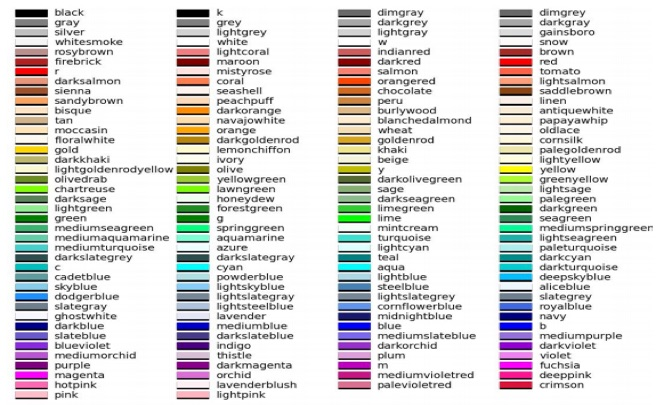
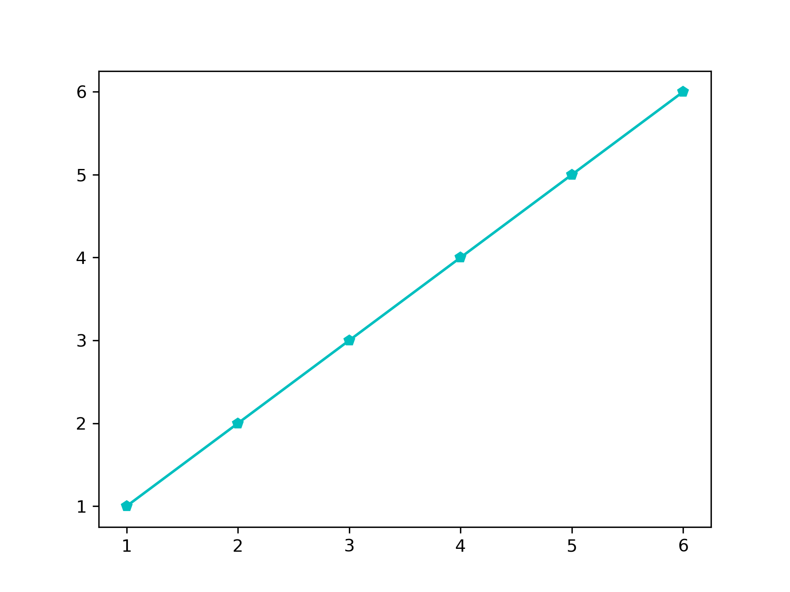
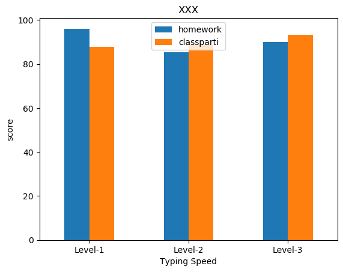
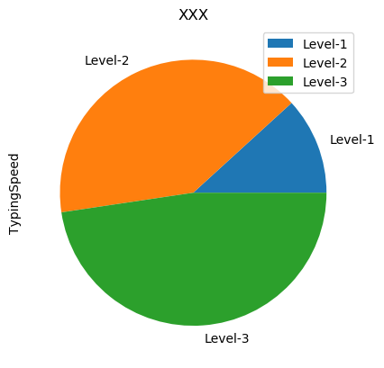
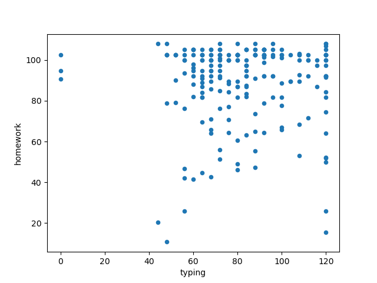
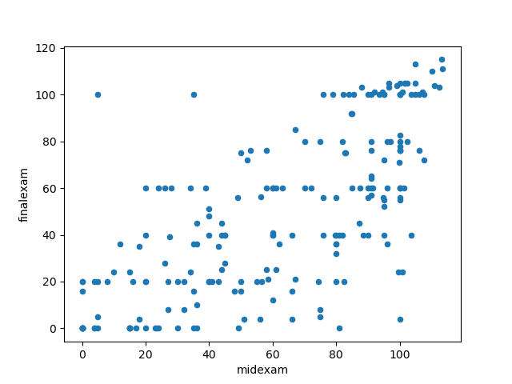
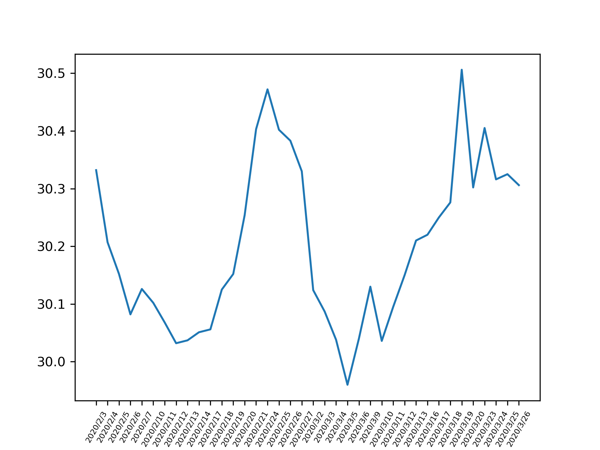

# -*- org-export-babel-evaluate: nil -*-
#+Title: Advanced Materials of Python
#+LANGUAGE: en
#+LATEX_HEADER: \usepackage[AUTO]{babel}
#+LATEX_HEADER: \addto\captionsenglish{\renewcommand\contentsname{Outline}}

#+LATEX_HEADER: \usepackage[UTF8, heading]{ctex} 
#+LATEX_HEADER: \usepackage{xltxtra}
#+LATEX_HEADER: \usepackage{xeCJK}
#+LATEX_HEADER: \usepackage{lmodern}
#+LATEX_HEADER: \usepackage{verbatim}
#+LATEX_HEADER: \usepackage{float}
#+LATEX_HEADER: \usepackage{tikz}
#+LATEX_HEADER: \usepackage{wrapfig}
#+LATEX_HEADER: \usepackage{soul}
#+LATEX_HEADER: \usepackage{textcomp}
#+LATEX_HEADER: \usepackage{listing}
#+LATEX_HEADER: \usepackage{geometry}
#+LATEX_HEADER: \usepackage{algorithm}
#+LATEX_HEADER: \usepackage{algorithmic}
#+LATEX_HEADER: \usepackage{marvosym}
#+LATEX_HEADER: \usepackage{wasysym}
#+LATEX_HEADER: \usepackage{natbib}
#+LATEX_HEADER: \usepackage{fancyhdr}
#+LATEX_HEADER: \usepackage{fontspec,xunicode,xltxtra}
#+LATEX_HEADER: \usepackage{CJKnumb}
#+LATEX_HEADER: \usepackage{amsfonts}
#+LATEX_HEADER: \usepackage[default]{sourcecodepro}
#+LATEX_HEADER: \usepackage[T1]{fontenc}
#+LATEX_HEADER: \setCJKmainfont{SimSun} % 設置缺省中文字體
#+LATEX_HEADER: \setmainfont{Times New Roman} % 英文襯線字體
#+LATEX_HEADER: \setsansfont{Source Code Pro} % 英文無襯線字體
#+LATEX_HEADER: \setmonofont{Source Code Pro} % 英文等寬字體
#+LATEX_HEADER: \setCJKmainfont[Scale=0.9]{Adobe Heiti Std} % 中文字體
#+LATEX_HEADER: \setCJKmonofont[Scale=0.9]{Adobe Heiti Std}
#+LATEX_HEADER: \usepackage{color}
#+LATEX_HEADER: \RequirePackage{fancyvrb}
#+LATEX_HEADER: \usepackage{placeins}
#+LATEX_HEADER: \vspace{-0.2cm}
#+LATEX_CLASS: article
#+LATEX_CLASS_OPTIONS: [a4paper,12pt]
#+LATEX_HEADER: \usepackage{xcolor}
#+LATEX_HEADER: \hypersetup{pdfauthor={Name},colorlinks,linkcolor={red!50!black},citecolor={blue!50!black},urlcolor={blue!80!black}}
#+LATEX_HEADER: \definecolor{dkgreen}{rgb}{0,0.6,0}
#+LATEX_HEADER: \definecolor{dred}{rgb}{0.545,0,0}
#+LATEX_HEADER: \definecolor{dblue}{rgb}{0,0,0.545}
#+LATEX_HEADER: \definecolor{lgrey}{rgb}{0.9,0.9,0.9}
#+LATEX_HEADER: \definecolor{gray}{rgb}{0.4,0.4,0.4}
#+LATEX_HEADER: \definecolor{darkblue}{rgb}{0.0,0.0,0.6}
#+LATEX_HEADER: \definecolor{bubbles}{rgb}{0.91, 1.0, 1.0}
#+LATEX_HEADER: \definecolor{foreground}{RGB}{220,220,204} % 淺灰
#+LATEX_HEADER: \definecolor{background}{RGB}{62,62,62} % 淺黑
#+LATEX_HEADER: \definecolor{preprocess}{RGB}{250,187,249} % 淺紫
#+LATEX_HEADER: \definecolor{var}{RGB}{239,224,174} % 淺肉色
#+LATEX_HEADER: \definecolor{string}{RGB}{154,150,230} % 淺紫色
#+LATEX_HEADER: \definecolor{type}{RGB}{225,225,116} % 淺黃
#+LATEX_HEADER: \definecolor{function}{RGB}{140,206,211} % 淺天藍
#+LATEX_HEADER: \definecolor{keyword}{RGB}{239,224,174} % 淺肉色
#+LATEX_HEADER: \definecolor{comment}{RGB}{180,98,4} % 深褐色
#+LATEX_HEADER: \definecolor{doc}{RGB}{175,215,175} % 淺鉛綠
#+LATEX_HEADER: \definecolor{comdil}{RGB}{111,128,111} % 深灰
#+LATEX_HEADER: \definecolor{constant}{RGB}{220,162,170} % 粉紅
#+LATEX_HEADER: \lstdefinelanguage{python}{
#+LATEX_HEADER:  backgroundcolor=\color{bubbles},
#+LATEX_HEADER:  basicstyle=\footnotesize \ttfamily \color{dblue} \small \mono \bfseries,
#+LATEX_HEADER:  breakatwhitespace=false,
#+LATEX_HEADER:  breaklines=true,
#+LATEX_HEADER:  captionpos=b,
#+LATEX_HEADER:  comment=[l]{\#},
#+LATEX_HEADER:  morecomment=[s]{/*}{*/},
#+LATEX_HEADER:  commentstyle=\color{comment} \slshape \small \itshape,
#+LATEX_HEADER:  ndkeywords={boolean, throw, import, typeof, null, catch, switch, for, in, int, str, float, self, return, class, if ,elif, endif, while, do, else, True, False , catch, def},
#+LATEX_HEADER:  ndkeywordstyle=\color{dred} \bfseries \small \mono,
#+LATEX_HEADER:  identifierstyle=\color{black},
#+LATEX_HEADER:  deletekeywords={...},
#+LATEX_HEADER:  escapeinside={\%*}{*)},
#+LATEX_HEADER:  frame=single,
#+LATEX_HEADER:  frameround=tttt,
#+LATEX_HEADER:  framesep=0pt,
#+LATEX_HEADER:  rulecolor=\color{background},
#+LATEX_HEADER:  morekeywords={BRIEFDescriptorConfig,string,TiXmlNode,DetectorDescriptorConfigContainer,istringstream,cerr,exit},
#+LATEX_HEADER:  identifierstyle=\color{black},
#+LATEX_HEADER:  stringstyle=\color{blue},
#+LATEX_HEADER:  rulecolor=\color{black},
#+LATEX_HEADER:  showspaces=false,
#+LATEX_HEADER:  showstringspaces=false,
#+LATEX_HEADER:  showtabs=false,
#+LATEX_HEADER:  stepnumber=1,
#+LATEX_HEADER:  tabsize=5,
#+LATEX_HEADER:  title=\lstname,
#+LATEX_HEADER: }
#+LATEX_HEADER: \lstdefinelanguage{shell}{
#+LATEX_HEADER:  backgroundcolor=\color{keyword},
#+LATEX_HEADER:  basicstyle=\footnotesize \ttfamily \color{dblue} \small \mono \bfseries,
#+LATEX_HEADER:  breakatwhitespace=false,
#+LATEX_HEADER:  breaklines=true,
#+LATEX_HEADER:  captionpos=b,
#+LATEX_HEADER:  comment=[l]{\#},
#+LATEX_HEADER:  morecomment=[s]{/*}{*/},
#+LATEX_HEADER:  commentstyle=\color{comment} \slshape \small \itshape,
#+LATEX_HEADER:  identifierstyle=\color{black},
#+LATEX_HEADER:  deletekeywords={...},
#+LATEX_HEADER:  escapeinside={\%*}{*)},
#+LATEX_HEADER:  frame=single,
#+LATEX_HEADER:  frameround=tttt,
#+LATEX_HEADER:  framesep=0pt,
#+LATEX_HEADER:  rulecolor=\color{background},
#+LATEX_HEADER:  morekeywords={BRIEFDescriptorConfig,string,TiXmlNode,DetectorDescriptorConfigContainer,istringstream,cerr,exit},
#+LATEX_HEADER:  identifierstyle=\color{black},
#+LATEX_HEADER:  stringstyle=\color{blue},
#+LATEX_HEADER:  rulecolor=\color{black},
#+LATEX_HEADER:  showspaces=false,
#+LATEX_HEADER:  showstringspaces=false,
#+LATEX_HEADER:  showtabs=false,
#+LATEX_HEADER:  stepnumber=1,
#+LATEX_HEADER:  tabsize=5,
#+LATEX_HEADER:  title=\lstname,
#+LATEX_HEADER: }
#+LATEX_HEADER: \usepackage{enumitem}
#+LATEX_HEADER: \setenumerate{noitemsep}
#+LATEX_HEADER: \setenumerate{nolistsep}
#+LATEX_HEADER: \setitemize{nolistsep}

#+LATEX_HEADER: \vspace{-\topsep}

#+BEGIN_COMMENT
投影片設定
#+REVEAL_ROOT: https://cdn.jsdelivr.net/reveal.js/3.0.0/
#+REVEAL_THEME: moon
#+OPTIONS: reveal_width:1400 reveal_height:960
#+OPTIONS: toc:1
#+REVEAL_MARGIN: 0.1
#+REVEAL_MIN_SCALE: 0.9
#+REVEAL_MAX_SCALE: 3.5

網頁設定
#+SETUPFILE: https://fniessen.github.io/org-html-themes/setup/theme-readtheorg.setup
#+STARTUP: showeverything
#+PROPERTY: header-args :eval never-export
#+STARTUP: inlineimages
#+OPTIONS: H:4
#+OPTIONS: \n:t
#+END_COMMENT

#+latex:\newpage
* Python 套件管理
** pip v.s. conda
*** pip or conda
- Python 的一大優勢之一便是龐大的第三方函式庫，讓使用 python 的程式設計師可以方便的呼叫、進行如網路資料下載解析、資料的視覺化、甚或是大數據的複雜分析與人工智慧的相關套件。，
- 目前用來管理這些龐大套件的工具主要有二：pip 與 Conda。
*** pip
- Pip是[[https://www.pypa.io/en/latest/][Python Packaging Authority]]推薦、用於從[[https://pypi.org/][Python Package Index]]安裝套件的工具，提供了對 Python 套件的搜㝷、下載、安裝、卸載的功能。
- 若在 python.org 下載最新版本的 python，則已內建 pip 安裝套件。 Python 3.4+ 以上版本均已包括 pip 
- 該工具類似 Linux 下的 apt/yum 或 MAC 下的[[https://brew.sh/index_zh-tw][Homebrew]]。
*** conda
- Conda 是一個開源的跨平台工具軟體，它被設計作為 Python、R、Lua、Scala 與 Java 等任何程式語言的套件、依賴性以及工作環境管理員，特別受到以 Python 作為主要程式語言的資料科學團隊所喜愛。
- 傳統 Python 使用者以 pip 作為套件管理員（package manager）、以 venv 作為工作環境管理員（environment manager），而 conda 則達成了「兩個願望、一次滿足」既可以管理套件亦能夠管理工作環境。[fn:1]
*** In both cases:
- Written in Python
- Open source (Conda is BSD and pip is MIT)
*** difference between conda, anaconda, and miniconda
- conda is both a command line tool, and a python package. [fn:3]
- Anaconda 發行版會預裝很多 pydata 生態圈裡的軟件，而 Miniconda 是最小的 conda 安裝環境， 一個乾淨的 conda 環境。
- pip  只是運與安裝 python package，而 conda 用來安裝管理任何語言的包。
- 不一定要安裝 Anaconda 或 Miniconda，也可透過 pip 直接安裝 conda
  #+BEGIN_SRC shell
  pip install conda
  #+END_SRC

** conda 安裝與使用
*** 下載 v.s. 安裝
- [[https://www.anaconda.com/distribution/][Anaconda]]
- [[https://docs.conda.io/en/latest/miniconda.html][Miniconda]]
*** 常見 conda 指令
- src_shell[:exports code]{ conda --version }: 檢視 conda 版本 
- src_shell[:exports code]{ conda update PACKAGE_NAME }: 更新指定套件
- src_shell[:exports code]{ conda --help }: 檢視 conda 指令說明文件
- src_shell[:exports code]{ conda list }: 檢視目前工作環境安裝的套件清單
- src_shell[:exports code]{ conda list --ENVIRMOMENT }: 檢視指定工作環境安裝的套件清單
- src_shell[:exports code]{ conda install PACKAGE_NAME=Version }: 在目前的工作環境安裝指定套件
- src_shell[:exports code]{ conda remove PACKAGE_NAME }: 在目前的工作環境移除指定套件
- src_shell[:exports code]{ conda create --name ENVIRMOMENT python=Version }: 建立新的工作環境且安裝指定 Python 版本
- src_shell[:exports code]{ conda activate ENVIRONMENT }: 切換至指定工作環境
- src_shell[:exports code]{ conda deactivate }: 回到 base 工作環境
- src_shell[:exports code]{ conda env export --name ENVIRMOMENT --file ENVIRMOMENT.yml }: 將指定工作環境之設定匯出為 .yml 檔藉此複製且重現工作環境
** Python 常用函式庫
*** 爬蟲
- Scrapy: 舉世聞名，分散式爬蟲框架，不僅僅是簡單的庫
- beautifulsoup4: Beautiful Soup 是一個可以從 HTML 或 XML 文件中提取數據的 Python 庫.[fn:4]
- urllib/urllib2: urllib is a package that collects several modules for working with URLs
- selenium: Selenium 原為網頁測試工具，但由於可以直接以程式碼操控瀏覽器的特性，使其成為網路爬蟲必備的工具之一。[fn:5]
*** 網站
- Django: 重量級網頁框架
- Flask: 輕量級網頁框架
*** 資料處理科學計算
- Numpy: 陣列矩陣神器
- Scipy: 科學計算神器
- Pandas
*** 視覺化
- matplotlib: matlab 風格式的套件
- seaborn: 散點圖矩陣神器
- ggplot: R 語言視覺化神器的 Python 版本
- plotly: 這個神器是個 js 庫，不過也有各種流行的語言介面
*** 機器學習
- scikit-learn:幾乎所有機器學習演算法都囊括
- NLTK: 自然語言處理工具套件 
- Theano/TensorFlow/Keras: 深度學習套件
- PyTorch: Numpy 的 GPU 版
*** 地圖學/地圖視覺化
- basemap/cartopy: 畫地圖的 package
- Folium: leaflet 的 Python 版本
- GDAL: 開源 GIS package
- geocoder: 地理編碼神器
- geopandas: 地理資料的熊貓套件
- PySAL: 空間計量經濟學的一個神套件
*** ArcGIS
- arcpy: ArcGIS 內嵌 Python 的神器，可以非常方便呼叫 ArcGIS 各項功能，但是有一點就是不開源（畢竟人家是商業軟體嘛，所以那些老想著在自己安裝的 Python 上 import arcpy 的同學可以省省
- ArcGIS API for Python: 基於 portal 和 online 的一套 API，還是有些可以玩的價值，後面也會考慮介紹這個內容。
** python package 安裝(conda)
- 安裝 package: 
  src_python[:exports code]{ conda install packageName }
  #+BEGIN_SRC shell -r -n
  conda install pandas
  #+END_SRC
- 移除 package: 
  src_python[:exports code]{ conda remove packageName }
  #+BEGIN_SRC shell -r -n
  conda remove pandas
  #+END_SRC
- 安裝特定版本 python
  src_python[:exports code]{ conda install python=version }
  #+BEGIN_SRC shell -r -n
  conda install python=3.5
  #+END_SRC
- 了解目前系統可用套件
  #+begin_src shell -r -n
    conda list
  #+end_src
** python 執行環境建立與維護
- 建立[fn:6]
  #+BEGIN_SRC shell -r -n :eval no
  conda create -n envName
  #+END_SRC
- 啟用
  #+BEGIN_SRC shell -r -n
    source activate envName
  #+END_SRC
- 退出
  #+BEGIN_SRC shell -r -n
    source deactiveate
  #+END_SRC
- 刪除
  #+BEGIN_SRC shell -r -n
    conda env remove -n envName
  #+END_SRC
- 列出目前系統中所有的虛擬環境
  #+BEGIN_SRC shell -r -n
    conda env list
  #+END_SRC

#+latex:\newpage

* Numpy 模組
** Numpy
- Numpy 是 Python 的一個重要模組，主要用於資料處理上。Numpy 底層以 C 和 Fortran 語言實作，所以能快速操作多重維度的陣列。[fn:7]
- 當 Python 處理龐大資料時，其原生 list 效能表現並不理想（但可以動態存異質資料），而 Numpy 具備平行處理的能力，可以將操作動作一次套用在大型陣列上。
- Python 其餘重量級的資料科學相關套件（例如：Pandas、SciPy、Scikit-learn 等）都幾乎是奠基在 Numpy 的基礎上。因此學會 Numpy 對於往後學習其他資料科學相關套件打好堅實的基礎。
** 匯入模組
- 使用模組裡的函式要加模組名稱
  #+BEGIN_SRC python 
    import numpy
  #+END_SRC
- 匯入 numpy 模組並使用 np 作為簡寫，這是 Numpy 官方倡導的寫法
  #+BEGIN_SRC python
    import numpy as np
  #+END_SRC
- Numpy 中的多維資料型別稱為 ndarray
** Create ndarray
- Numpy 的重點在於陣列的操作，其所有功能特色都建築在同質且多重維度的 ndarray（N-dimensional array）上。
- ndarray 的關鍵屬性是維度（ndim）、形狀（shape）和數值類型（dtype）。 一般我們稱一維陣列為 vector 而二維陣列為 matrix[fn:7]。 
*** 一維陣列
- list 或 tuple 轉入
  #+BEGIN_SRC python -n :results output :exports both :wrap
    import numpy as np
    np1 = np.array( [1, 2, 3, 4] )
    print(np1)
  #+END_SRC
  
  #+RESULTS:
  : [1 2 3 4]

- 使用 np.arange( ) 方法
  #+BEGIN_SRC python -n :results output :exports both
  import numpy as np
  np2 = np.arange(5)
  print(np2)
  #+END_SRC
  
  #+RESULTS:
  : [0 1 2 3 4]
*** 二維陣列
  #+BEGIN_SRC python -n :results output :exports both
  import numpy as np
  np4 = np.array( [[1, 2, 4], [3,4,5]])
  print("np4:\n", np4)
  
  np5 = np.array([np.arange(3), np.arange(3)])
  print('np5:\n', np5)
  
  np6 = np.arange(8).reshape(2, 4)
  print('np6:\n', np6)
  #+END_SRC
  
  #+RESULTS:
  : np4:
  :  [[1 2 4]
  :  [3 4 5]]
  : np5:
  :  [[0 1 2]
  :  [0 1 2]]
  : np6:
  :  [[0 1 2 3]
  :  [4 5 6 7]]
*** 多維陣列
  #+BEGIN_SRC python -n :results output :exports both
import numpy as np

np7 = np.arange(24).reshape(2, 3, 4)
print('np7:\n',np7)
  #+END_SRC
  
  #+RESULTS:
  : np7:
  :  [[[ 0  1  2  3]
  :   [ 4  5  6  7]
  :   [ 8  9 10 11]]
  :
  :  [[12 13 14 15]
  :   [16 17 18 19]
  :   [20 21 22 23]]]
*** 隨機矩陣
#+BEGIN_SRC python -n :results output :exports both
import numpy as np

np8 = np.random.random((3, 2)) #矩陣大小以tuple表示
print('np8:\n', np8)

np9 = np.random.randint(0, 100, size=[4, 3]) #矩陣大小以list表示
print('np9:\n', np9)
#+END_SRC

  #+RESULTS:
  : np8:
  :  [[0.25790607 0.49465406]
  :  [0.22828345 0.77978968]
  :  [0.00990244 0.71363209]]
  : np9:
  :  [[82 72 39]
  :  [72 51 84]
  :  [96 75 59]
  :  [33 40 99]]

  #+latex:\newpage

** 實作練習
* Matplotlib
** Matplotlib 簡介
- NumPy 的可視化操作界面
- 為 Python 最多人使用的 2D 繪圖工具
- 優點：圖形美觀、類型多、相容於 Matlab
- 官方社群網站 https://matplotlib.org/
- 維基百科 https://zh.wikipedia.org/wiki/Matplotlib
** 折線圖
*** 基本語法
- import matplotlib.pyplot as plt
- plt.plot( )函式為 matplotlib.pyplot 模組畫線條方法，其語法如下

  #+BEGIN_SRC python -n 
    plt.plot( [x座標資料,] y座標資料 [, 參數1, 參數2, ...] )
  #+END_SRC
- np.sin( )函式為 Numpy 模組求正弦值
- plt.show( )函式用來顯示圖形
#+BEGIN_SRC python -r -n :results output :exports both
  import matplotlib.pyplot as plt
  import numpy as np

  x = np.arange(-3, 3, 0.01)
  plt.clf()
  plt.plot(x, np.sin(x))
  # for web-based: plt.show() 

  plt.savefig('SimpleSin.png', dpi=300)
#+END_SRC

#+RESULTS:

#+CAPTION: 簡單的 sin 圖形
#+LABEL: fig:SimpleSin
#+name: fig:SimpleSin
#+ATTR_LATEX: :width 300
#+ATTR_HTML: :width 400
#+ATTR_ORG: :width 300
[[file:simpleSin.png]]
*** <<練習#1>>練習#1：繪製折線圖
- 利用 list 繪製

  + x1 = [1, 2, 3, 4, 5, 6]

  + y1 = [1, 2, 3, 4, 5, 6]

- 執行 plt.plot(y1) 和 plt.plot(x1, y1) 有何差別??
- 利用 numpy 繪製

  + x2 = np.arange(0, 3, 0.01)

- 執行 plt.plot(x2, x2**2)看看畫出什麼圖形??
*** 圖形美化: plot() function
**** plot()函式參數可分為兩類：fmt 字串 和 kwarg 參數 
- fmt 定義基本格式：顏色、標記、線條樣式
- kwarg 為 Line2D 屬性(參考資料)：color, linestyle, marker, label, linewidth, ….
- 若 fmt 和 kwarg 設定衝突時，以 kwarg 為主
- plot(): fmt 字串
| 字元 | 顏色 | 字元 | 標記       | 字元     | 標記     |
|------+------+------+------------+----------+----------|
| 'b'  | 藍   | '.'  | 點         | '*'      | *        |
| 'g'  | 綠   | 'o'  | 圓圈       | '+'      | +        |
| 'r'  | 紅   | 'v'  | 三角形(下) | 'x'      | x        |
| 'c'  | 青   | '^'  | 三角形(上) | 'd'      | 鑽石     |
| 'm'  | 洋紅 | '<'  | 三角形(左) | 字元     | 線條     |
| 'y'  | 黃   | '>'  | 三角形(右) | '-'      | 實線     |
| 'k'  | 黑   | 's'  | 正方形     | '--'/':' | 虛線     |
| 'w'  | 白   | 'p'  | 五邊形     | '-.'     | -.-.-.-. |
#+REVEAL: split
**** kwgarg 參數
- colorg
  + 單字，如 g：color = 'lime'
  + 字母，如 g：color = 'k'
  + 色碼，如 g：color = '#FF0000'
  + RGB 值(0~g1 之間)，如：color = (1, 0, 0)
- label：g 呈現線條標籤，如 label = 'y = x^2'
  + 需搭配 pglt.legend()函式方能呈現 label
**** 色彩對照
#+CAPTION: 色表
#+LABEL: fig:colors
#+name: fig:colors
#+ATTR_LATEX: :width 400
#+ATTR_HTML: :width 600
#+ATTR_ORG: :width 400

#+REVEAL: split
**** 折線示範#1
#+BEGIN_SRC python -r -n :results output :exports both
import matplotlib.pyplot as plt
import numpy as np

x1 = [1, 2, 3, 4, 5, 6]
y1 = [1, 2, 3, 4, 5, 6]
plt.clf()
plt.plot(x1, y1, color='c', linestyle='-', marker='p')
plt.savefig('line1.png', dpi=300)
#+END_SRC
#+RESULTS:
#+CAPTION: 簡單的折線圖形#1
#+LABEL: fig:SimpleSin
#+name: fig:SimpleSin
#+ATTR_LATEX: :width 300
#+ATTR_HTML: :width 400
#+ATTR_ORG: :width 300

#+REVEAL: split
**** 折線示範#2
#+BEGIN_SRC python -r -n :results output :exports both
import matplotlib.pyplot as plt
import numpy as np

x1 = [1, 2, 3, 4, 5, 6]
y1 = [1, 2, 3, 4, 5, 6]
x2 = np.arange(0, 3, 0.01)
x3 = np.arange(8).reshape(2, 4)

plt.plot(y1, 'c-p', x2, x2**2, x3, x3+3, '-*')
plt.savefig('line2.png', dpi=300)
#+END_SRC
#+RESULTS:
#+CAPTION: 簡單的折線圖形 2
#+LABEL: fig:SimpleSin
#+name: fig:SimpleSin
#+ATTR_LATEX: :width 300
#+ATTR_HTML: :width 400
#+ATTR_ORG: :width 300
[[file:line2.png]]
#+REVEAL: split
**** 其他參數
- x / y 座標範圍：plt.xlim(起始值, 終止值)  / plt.ylim(起, 止)
- 圖表標題：plt.title(字串)
- x / y 座標標題：plt.xlabel(字串) / plt.ylabel(字串)
- 顯示 kwarg 參數裡的 label：plt.legend()
*** <<練習#2>>練習#2：圖表美化
1. 將[[練習#1]]的圖表加上標記、線條標籤，換線條顏色、線條樣式
1. 請將下列資料繪成折線圖(男女折線不同顏色、樣式，加標記)
   | 初婚年齡 | 2006 | 2011 | 2014 | 2015 | 2016 |
   |----------+------+------+------+------+------|
   | 男       | 30.7 | 31.8 | 32.1 | 32.2 | 32.4 |
   | 女       | 27.8 | 29.4 | 29.9 | 30.0 | 30.0 |
   + 圖表標題: Age of first marriage
	
   + 座標軸標題: x ⇒ Year、y ⇒ Age
	
   + 線條標籤: 男 ⇒ Male、女 ⇒ Female
** bar chart: plt.bar()
- 語法
  src_python[:exports code]{ plt.bar( x座標資料, y座標資料 [, 參數1, 參數2, ...] ) }
- 練習#3: 請將[[練習#2]]的男女初婚年齡改成長條圖
** pie chart: plt.pie()
*** 語法：

plt.pie( 比例列表 [, 參數 1, 參數 2, ...] )
*** 參數： 
- colors：各子圖顏色，多以 list 表示
- labels：各子圖標籤，多以 list 表示
- explode：各子圖分離突出比例，0.1 代表分離 10%，多以 list 表示
- autopct：顯示各子圖比例值，格式為%x.y%%
- startangle：繪製起始角度，預設為 0 (與三角函數角度相同)
- 若要以正圓形繪製，請再加上 plt.axis('equal')
*** 範例
#+BEGIN_SRC python -r -n :results output :exports both
import matplotlib.pyplot as plt
import numpy as np

parts = [35.35, 23, 26.65, 15]
labels = ['Harrison', 'Vanessa', 'James', 'Ruby']
colors = ['red', 'lightblue', 'purple', 'yellow']
explodes = [0.1, 0, 0, 0.1]
plt.pie(parts, colors = colors, labels = labels, explode = explodes, autopct = '%3.2f%%')
plt.axis('equal')
plt.legend()

#plt.show()
plt.savefig('simplePie.png', dpi=300)
#+END_SRC

#+RESULTS:

#+CAPTION: 簡單的 pie chart
#+LABEL: fig:SimplePie
#+name: fig:SimplePie
#+ATTR_LATEX: :width 300
#+ATTR_HTML: :width 400
#+ATTR_ORG: :width 300
[[file:simplePie.png]]
** 其它圖表
- 直方圖(Histogram)：用來呈現各資料統計結果([[https://matplotlib.org/api/_as_gen/matplotlib.pyplot.hist.html][參考資料]])
- 散佈圖(Scatter)：用來呈現群聚關係([[https://matplotlib.org/api/_as_gen/matplotlib.pyplot.scatter.html][參考資料]])
- [[https://matplotlib.org/gallery/index.html][進階學習資源]]
** 文字註解: plt.text()
*** 語法
- src_python[:exports code]{ plt.text( x相對座標, y相對座標 , 文字字串 [, 其它參數] ) }
- [[https://matplotlib.org/api/_as_gen/matplotlib.pyplot.text.html][參考資料]]
*** 範例
#+BEGIN_SRC python -r -n :results output :exports both
  import matplotlib.pyplot as plt

  x = [1, 2, 3, 4, 5, 6, 7, 8]
  y = [1, 4, 9, 16, 25, 36, 49, 64]
  plt.plot(x, y, 'r--')
  for x, y in zip(x, y):
      plt.text(x-0.2, y+0.6, '(%d, %d)' %(x, y))
  #plt.show()
  plt.savefig('simpleText.png', dpi = 300)
#+END_SRC

#+RESULTS:

#+CAPTION: 簡單的文字註解
#+LABEL: fig:SimplePie
#+name: fig:SimplePie
#+ATTR_LATEX: :width 300
#+ATTR_HTML: :width 400
#+ATTR_ORG: :width 300
[[file:simpleText.png]]
** 子圖表: plt.subplot()
- 範例[fn:8]
#+BEGIN_SRC python -r -n :results output :exports both
  import numpy as np
  import matplotlib.pyplot as plt

  from matplotlib.ticker import NullFormatter  # useful for `logit` scale

  # Fixing random state for reproducibility
  np.random.seed(19680801)

  # make up some data in the interval ]0, 1[
  y = np.random.normal(loc=0.5, scale=0.4, size=1000)
  y = y[(y > 0) & (y < 1)]
  y.sort()
  x = np.arange(len(y))

  # plot with various axes scales
  plt.figure()

  # linear
  plt.subplot(221)
  plt.plot(x, y)
  plt.yscale('linear')
  plt.title('linear')
  plt.grid(True)

  # log
  plt.subplot(222)
  plt.plot(x, y)
  plt.yscale('log')
  plt.title('log')
  plt.grid(True)

  # symmetric log
  plt.subplot(223)
  plt.plot(x, y - y.mean())
  plt.yscale('symlog', linthreshy=0.01)
  plt.title('symlog')
  plt.grid(True)

  # logit
  plt.subplot(224)
  plt.plot(x, y)
  plt.yscale('logit')
  plt.title('logit')
  plt.grid(True)
  # Format the minor tick labels of the y-axis into empty strings with
  # `NullFormatter`, to avoid cumbering the axis with too many labels.
  plt.gca().yaxis.set_minor_formatter(NullFormatter())
  # Adjust the subplot layout, because the logit one may take more space
  # than usual, due to y-tick labels like "1 - 10^{-3}"
  plt.subplots_adjust(top=0.92, bottom=0.08, left=0.10, right=0.95, hspace=0.25,
                      wspace=0.35)

  plt.savefig('simpleSubplot.png', dpi = 300)
#+END_SRC

#+RESULTS:
#+CAPTION: 簡單的子圖表
#+LABEL: fig:SimpleSubplot
#+name: fig:SimpleSubplot
#+ATTR_LATEX: :width 300
#+ATTR_HTML: :width 400
#+ATTR_ORG: :width 300
[[file:simpleSubplot.png]]

- [[https://matplotlib.org/api/_as_gen/matplotlib.pyplot.subplot.html][參考資料]]

#+latex:\newpage

** 實作練習
* 區域資料檔分析
** Excel/CSV: Pandas 模組
*** CSV
- 為純文字檔，以逗號分隔值（Comma-Separated Values，CSV，有時也稱為字元分隔值，因為分隔字元也可以不是逗號）。
- 純文字意味著該檔案是一個字元序列，不含必須像二進位制數字那樣被解讀的資料。
- CSV 檔案由任意數目的記錄組成，記錄間以某種換行符分隔；每條記錄由欄位組成，欄位間的分隔符是其它字元或字串，最常見的是逗號或製表符。通常，所有記錄都有完全相同的欄位序列[fn:3]。
*** Pandas
- Pandas 是 python 的一個數據分析模組，2009 年底開源出來，提供高效能、簡易使用的資料格式(Data Frame)讓使用者可以快速操作及分析資料。
- Pandas 強化了資料處理的方便性也能與處理網頁資料與資料庫資料等，有點類似於 Office 的 Excel 能更加方便的進行運算、分析等[fn:9]。
- Pandas 主要特色有[fn:6]：
  1. 在異質數據的讀取、轉換和處理上，都讓分析人員更容易處理，例如：從列欄試算表中找到想要的值。
  1. Pandas 提供兩種主要的資料結構，Series 與 DataFrame。Series 顧名思義就是用來處理時間序列相關的資料(如感測器資料等)，主要為建立索引的一維陣列。DataFrame 則是用來處理結構化(Table like)的資料，有列索引與欄標籤的二維資料集，例如關聯式資料庫、CSV 等等。
  1. 透過載入至 Pandas 的資料結構物件後，可以透過結構化物件所提供的方法，來快速地進行資料的前處理，如資料補值，空值去除或取代等。
  1. 更多的輸入來源及輸出整合性，例如：可以從資料庫讀取資料進入 Dataframe，也可將處理完的資料存回資料庫。
*** Pandas 資料結構
- Pandas 是 Python 的資料分析函式庫，從 2009 年底開放原始碼，提供簡易使用的資料結構和分析工具，讓分析人員可以快速方便的處理結構化資料。
- 要使用 Pandas 之前，先瞭解兩個主要資料結構[fn:1]：
  + Series: 是一維標籤陣列（array），能夠保存任何資料類型（整數、字符串、浮點數等）。
  + DataFrame: 是一個二維標籤資料結構，可以具有不同類型的行（column），類似 Excel 的資料表，對於有使用過統計軟體的分析人員應該不陌生。
  + 簡單來說，Series 可以想像為一行多列（row）的資料，而 DataFrame 是多行多列的資料，藉由選擇索引（列標籤）和行（行標籤）的參數來操作資料，就像使用統計軟體透過樣本編號或變項名稱來操作資料。
** Pandas functions
*** 資料選取
**** Select as dictinoary (column): [fn:10]
  - src_python[:exports code]{ df[[[['col1', 'col2']]]] }
  - src_python[:exports code]{ df.col1 }
  - [[file:./scores.csv][下載範例檔:scores.csv]]
#+BEGIN_SRC python -r -n :results output :exports both
  import pandas as pd

  # 讀取csv
  df = pd.read_csv("scores.csv")

  # colum 
  print(df.id)
  print(df[['id', 'typing']])
#+END_SRC

#+RESULTS:
#+begin_example
Pandas version: 0.25.1
0      201910901
1      201910902
2      201910903
3      201910904
4      201910905
         ...    
207    201911726
208    201911727
209    201911728
210    201911729
211    201911730
Name: id, Length: 212, dtype: int64
            id  typing
0    201910901      72
1    201910902      56
2    201910903      76
3    201910904      64
4    201910905      56
..         ...     ...
207  201911726      80
208  201911727      60
209  201911728      48
210  201911729      84
211  201911730      72

[212 rows x 2 columns]
#+end_example
**** Select using index (row):
  - src_python[:exports code]{ df[1:20] }
#+BEGIN_SRC python -r -n :results output :exports both
import pandas as pd

df = pd.read_csv("scores.csv")

print(df[1:3])
print(df[df.homework<30])
#+END_SRC

#+RESULTS:
#+begin_example
          id  classparti  typing  homework  midexam  finalexam
1  201910902          96      56     93.42     60.0       40.0
2  201910903          96      76    102.63     45.0       28.0
            id  classparti  typing  homework  midexam  finalexam
10   201910911          62      44     20.39      4.0        0.0
18   201910919          14      56     25.92      0.0        0.0
23   201910924          75      48     10.75      0.0        0.0
124  201911315          71     120     15.35      0.0        0.0
140  201911331          93     120     25.88      0.0       16.0
0      False
1      False
2      False
3      False
4      False
       ...  
207    False
208    False
209    False
210    False
211    False
Name: homework, Length: 212, dtype: bool
#+end_example
**** loc, iloc, between [fn:11]
- loc: 基於行標籤和列標籤（x_label、y_label）進行索引，以 column 名做為 index
- iloc: 基於行索引和列索引（index，columns） 都是從 0 開始，以數字做為 index
- between: 檢查區間值, src_python[:exports code]{ Series.between(self, left, right, inclusive=True) }
***** 範例 1
#+BEGIN_SRC python -r -n :results output :exports both
import pandas as pd

df = pd.read_csv("scores.csv")

print(df.loc[df.homework<25, ['id', 'homework']])
print(df.iloc[:5, 2:5])

#+END_SRC

#+RESULTS:
#+begin_example
            id  homework
10   201910911     20.39
23   201910924     10.75
124  201911315     15.35
   typing  homework  midexam
0      72     92.11     48.0
1      56     93.42     60.0
2      76    102.63     45.0
3      64     86.84     44.0
4      56     42.11      0.0
#+end_example
***** 範例 2
#+BEGIN_SRC python -r -n :results output :exports both
# 載入函式庫
import pandas as pd

print("Pandas version:", pd.__version__)
# 讀取csv
df = pd.read_csv("scores.csv")
# 輸出前3筆
print(df.iloc[:3])
# 輸出前3筆的第2,3欄
print(df.iloc[:2, 1:3])
# 輸出第3筆user的homework成績
print(df.loc[2,'homework'])

print(df['midexam'].between(50, 60))
midFilter = df['midexam'].between(50, 55)
print(df[midFilter])
#+END_SRC

#+RESULTS:
#+begin_example
Pandas version: 0.25.1
          id  classparti  typing  homework  midexam  finalexam
0  201910901         100      72     92.11     48.0       16.0
1  201910902          96      56     93.42     60.0       40.0
2  201910903          96      76    102.63     45.0       28.0
   classparti  typing
0         100      72
1          96      56
102.63
0      False
1       True
2      False
3      False
4      False
       ...  
207    False
208    False
209    False
210    False
211    False
Name: midexam, Length: 212, dtype: bool
            id  classparti  typing  homework  midexam  finalexam
6    201910907         101     120     92.11     55.0       20.0
65   201911029          93      60     82.00     50.0       16.0
72   201911036          88      80    102.63     53.0       76.0
92   201911119          82     104     89.47     50.0       20.0
94   201911121          95     100     88.51     52.0       72.0
109  201911136          91     100     81.58     51.0        4.0
171  201911626          98      72     97.37     50.0       75.0
#+end_example
*** 條件式選取資料
**** 語法
- src_python[:exports code]{ df[(condition)] }
- src_python[:exports code]{ df[(condition 1) & (condition 2) ] }
**** 範例
#+BEGIN_SRC python -r -n :results output :exports both
import pandas as pd

df = pd.read_csv("scores.csv")

print(df[(df.midexam >= 100) & (df.finalexam >= 100)])
#+END_SRC

#+RESULTS:
#+begin_example
            id  classparti  typing  homework  midexam  finalexam
11   201910912          87      92     92.11    110.8     103.75
70   201911034         104      92    102.63    100.8     101.00
88   201911115         120      88    105.26    113.5     111.00
98   201911125         119      80    107.89    113.2     115.00
102  201911129         106      52    102.63    103.6     100.00
127  201911318         108      80    102.63    104.8     100.00
138  201911329         105      48    107.89    100.0     100.00
143  201911334         100     120     81.58    104.8     113.00
153  201911608          88       0    102.63    100.0     100.00
169  201911624          82     100    102.63    101.5     105.00
182  201911701         103     108     92.63    100.0     100.00
189  201911708         106     108    102.63    107.2     101.00
190  201911709         108      88    107.89    104.8     105.00
191  201911710         102     100    102.63    100.0     105.00
193  201911712         105      96    101.58    107.5     100.00
195  201911714         102      44    107.89    110.0     110.00
196  201911715         106     120    107.89    102.4     105.00
198  201911717          80     120    107.89    106.0     100.00
201  201911721         109      76    100.00    100.0     100.00
203  201911722         105     120    102.63    101.5     105.00
210  201911729          87      84    105.26    112.3     103.00
#+end_example
** 進階分析
*** 計算: Aggregation, Groupby
**** [[https://is.gd/y4tUl8][create new column based on other column]]
**** simple aggregation
**** groupby with aggregation function
**** 範例
#+BEGIN_SRC python -r -n :results output :exports both
# 載入函式庫
import pandas as pd

# 讀取csv
df = pd.read_csv("scores.csv")

# 計算總分'
df['Final'] = df.classparti*.1 + df.typing*.1 + df.homework*.2 + df.midexam*.3 + df.finalexam*.3

# create new column according to typing speed
df.loc[df.typing < 30, 'TypingSpeed' ] = 'LOW'
df.loc[df.typing.between(30, 60), 'TypingSpeed' ] = 'MID'
df.loc[df.typing > 60, 'TypingSpeed' ] = 'HIGH'

print(df)

# 依打字速度分組
print(df.groupby('TypingSpeed')['Final'].mean())

# PASS/FAIL
df.loc[df.Final < 60, 'PASS'] = False
df.loc[df.Final >= 60, 'PASS'] = True

print(df.groupby('PASS')['typing'].mean())

#+END_SRC

#+RESULTS:
#+begin_example
            id  classparti  typing  ...  finalexam    Final  TypingSpeed
0    201910901         100      72  ...       16.0   54.822         HIGH
1    201910902          96      56  ...       40.0   63.884          MID
2    201910903          96      76  ...       28.0   59.626         HIGH
3    201910904          93      64  ...       25.0   53.768         HIGH
4    201910905          93      56  ...       20.0   29.322          MID
..         ...         ...     ...  ...        ...      ...          ...
207  201911726         106      80  ...      103.0   98.976         HIGH
208  201911727          82      60  ...      100.0   89.926          MID
209  201911728          83      48  ...       75.0   81.026          MID
210  201911729          87      84  ...      103.0  102.742         HIGH
211  201911730          96      72  ...      100.0   94.626         HIGH

[212 rows x 8 columns]
TypingSpeed
HIGH    69.977451
LOW     68.517333
MID     64.086303
Name: Final, dtype: float64
PASS
False    77.567568
True     84.525547
Name: typing, dtype: float64
#+end_example
*** 資料檔下載: [[file:scores.csv]]
** 資料視覺化
*** Bar chart
#+BEGIN_SRC python -r -n :results output :exports both
  # 載入函式庫
  import pandas as pd
  import matplotlib.pyplot as plt
  # 讀取csv
  df = pd.read_csv("scores.csv")

  # 計算總分'
  df['Final'] = df.classparti*.1 + df.typing*.1 + df.homework*.2 + df.midexam*.3 + df.finalexam*.3

  # create new column according to typing speed
  df.loc[df.typing < 30, 'TypingSpeed' ] = 'Level-1'
  df.loc[df.typing.between(30, 60), 'TypingSpeed' ] = 'Level-2'
  df.loc[df.typiohong > 60, 'TypingSpeed' ] = 'Level-3'

  fig = df.groupby('TypingSpeed')['homework','classparti'].mean().plot(kind='bar', title="XXX", rot=0, legend=True)
  fig.set_xlabel("Typing Speed")
  fig.set_ylabel("score")
  savefig = fig.get_figure()
  savefig.savefig('pandasPlot1.png', bbox_inches='tight')
#+END_SRC

#+RESULTS:
#+CAPTION: Pandas plot bar chart
#+LABEL: fig:PandasPlot-1
#+name: fig:PandasPlot-1
#+ATTR_LATEX: :width 300
#+ATTR_HTML: :width 400
#+ATTR_ORG: :width 500

*** Pie chart
#+BEGIN_SRC python -r -n :results output :exports both :wrap
# 載入函式庫
import pandas as pd
import matplotlib.pyplot as plt
# 讀取csv
df = pd.read_csv("scores.csv")

# 計算總分'
df['Final'] = df.classparti*.1 + df.typing*.1 + df.homework*.2 + df.midexam*.3 + df.finalexam*.3

# create new column according to typing speed
df.loc[df.typing < 60, 'TypingSpeed' ] = 'Level-1'
df.loc[df.typing.between(60, 80), 'TypingSpeed' ] = 'Level-2'
df.loc[df.typing > 80, 'TypingSpeed' ] = 'Level-3'
print(df.groupby('TypingSpeed').count())

fig = df.groupby('TypingSpeed')['TypingSpeed'].count().plot(kind='pie', title="XXX", rot=0, legend=True)
savefig = fig.get_figure()
savefig.savefig('pandasPlot2.png', bbox_inches='tight')
#+END_SRC

#+RESULTS:
:               id  classparti  typing  homework  midexam  finalexam  Final
: TypingSpeed                                                              
: Level-1       25          25      25        25       25         25     25
: Level-2       86          86      86        86       86         86     86
: Level-3      101         101     101       101      100        101    100
#+CAPTION: Pandas plot pie chart
#+LABEL: fig:PandasPlot-2
#+name: fig:PandasPlot-2
#+ATTR_LATEX: :width 300
#+ATTR_HTML: :width 300
#+ATTR_ORG: :width 400

*** Scatter chart
#+BEGIN_SRC python -r -n :results output :exports both
# 載入函式庫
import pandas as pd
import matplotlib.pyplot as plt

# 讀取csv
df = pd.read_csv("scores.csv")

fig = df[['typing','homework']].plot(kind='scatter', x=0, y=1)
df[['typing','homework']].plot.line(x=0, y=1)
#fig = df[['typing','finalexam']].plot(kind='scatter', x=0, y=1)

savefig = fig.get_figure()
savefig.savefig('PandasPlot3.png')
#+END_SRC

#+RESULTS:
#+CAPTION: Pandas plot scatter chart
#+LABEL: fig:PandasPlot-3
#+name: fig:PandasPlot-3
#+ATTR_LATEX: :width 300
#+ATTR_HTML: :width 4f00
#+ATTR_ORG: :width 400

*** Line chart
#+BEGIN_SRC python -r -n :results output :exports both
# 載入函式庫
import pandas as pd
import matplotlib.pyplot as plt

# 讀取csv
df = pd.read_csv("scores.csv")

fig = df[['midexam','finalexam']].plot(kind='scatter', x=0, y=1)

savefig = fig.get_figure()
savefig.savefig('PandasPlot4.png')

#+END_SRC

#+RESULTS:

#+CAPTION: Pandas plot scatter chart
#+LABEL: fig:PandasPlot-4
#+name: fig:PandasPlot-4
#+ATTR_LATEX: :width 400
#+ATTR_HTML: :width 400
#+ATTR_ORG: :width 500

#+latex:\newpage

** 實作練習
* 網路爬蟲
** parse JSON
*** What is JSON?
- JSON(JavaScript Object Notation，JavaScript 物件表示法)是個以純文字為基底去儲存和傳送簡單結構資料，你可以透過特定的格式去儲存任何資料(字串,數字,陣列,物件)，也可以透過物件或陣列來傳送較複雜的資料。[fn:12]
- 一旦建立了您的 JSON 資料，就可以非常簡單的跟其他程式溝通或交換資料，因為 JSON 就只是純文字個格式。
*** JSON 的優點
- 相容性高
- 格式容易瞭解，閱讀及修改方便
- 支援許多資料格式 (number,string,booleans,nulls,array,associative array)
- 許多程式都支援函式庫讀取或修改 JSON 資料
*** JSON 結構
- 物件: {}
- 陣列: []
*** 實作 1: [[https://data.gov.tw/dataset/31897][國際主要國家貨幣每月匯率概況]]
**** 下載 JSON
#+BEGIN_SRC python -r -n :results output :exports both
import requests

json_url = 'https://quality.data.gov.tw/dq_download_json.php?nid=11339&md5_url=f2fdbc21603c55b11aead08c84184b8f'
response = requests.get(json_url)

jsonRes = response.json()
print(type(jsonRes))
print(jsonRes[:10])
print('日期', ":", '美元／新台幣')
for item in jsonRes:
    print(item['日期'], ":", item['美元／新台幣'])
#+END_SRC

#+RESULTS:
#+begin_results
<class 'list'>
[{'日期': '2020/2/3', '美元／新台幣': '30.332', '人民幣／新台幣': '4.321461', '歐元／美元': '1.1077', '美元／日幣': '108.535', '英鎊／美元': '1.3147', '澳幣／美元': '0.6695', '美元／港幣': '7.7685', '美元／人民幣': '7.0189', '美元／南非幣': '14.9376', '紐幣／美元': '0.64675'}, {'日期': '2020/2/4', '美元／新台幣': '30.207', '人民幣／新台幣': '4.320537', '歐元／美元': '1.1056', '美元／日幣': '108.945', '英鎊／美元': '1.29605', '澳幣／美元': '0.67185', '美元／港幣': '7.76895', '美元／人民幣': '6.9915', '美元／南非幣': '14.8117', '紐幣／美元': '0.6466'}, {'日期': '2020/2/5', '美元／新台幣': '30.152', '人民幣／新台幣': '4.306248', '歐元／美元': '1.1044', '美元／日幣': '109.345', '英鎊／美元': '1.3046', '澳幣／美元': '0.6741', '美元／港幣': '7.7644', '美元／人民幣': '7.0019', '美元／南非幣': '14.8205', '紐幣／美元': '0.6484'}, {'日期': '2020/2/6', '美元／新台幣': '30.082', '人民幣／新台幣': '4.315112', '歐元／美元': '1.1002', '美元／日幣': '109.905', '英鎊／美元': '1.29915', '澳幣／美元': '0.6751', '美元／港幣': '7.7633', '美元／人民幣': '6.9713', '美元／南非幣': '14.73', '紐幣／美元': '0.6466'}, {'日期': '2020/2/7', '美元／新台幣': '30.126', '人民幣／新台幣': '4.311904', '歐元／美元': '1.09685', '美元／日幣': '109.905', '英鎊／美元': '1.29315', '澳幣／美元': '0.6706', '美元／港幣': '7.76115', '美元／人民幣': '6.9867', '美元／南非幣': '14.9919', '紐幣／美元': '0.64405'}, {'日期': '2020/2/10', '美元／新台幣': '30.102', '人民幣／新台幣': '4.30883', '歐元／美元': '1.0946', '美元／日幣': '109.845', '英鎊／美元': '1.28835', '澳幣／美元': '0.6697', '美元／港幣': '7.76475', '美元／人民幣': '6.9861', '美元／南非幣': '15.014', '紐幣／美元': '0.64075'}, {'日期': '2020/2/11', '美元／新台幣': '30.068', '人民幣／新台幣': '4.307872', '歐元／美元': '1.0908', '美元／日幣': '109.915', '英鎊／美元': '1.2897', '澳幣／美元': '0.6707', '美元／港幣': '7.76335', '美元／人民幣': '6.9798', '美元／南非幣': '14.92815', '紐幣／美元': '0.6385'}, {'日期': '2020/2/12', '美元／新台幣': '30.032', '人民幣／新台幣': '4.305388', '歐元／美元': '1.0917', '美元／日幣': '109.885', '英鎊／美元': '1.2969', '澳幣／美元': '0.6732', '美元／港幣': '7.76805', '美元／人民幣': '6.97545', '美元／南非幣': '14.78', '紐幣／美元': '0.6464'}, {'日期': '2020/2/13', '美元／新台幣': '30.037', '人民幣／新台幣': '4.301749', '歐元／美元': '1.08805', '美元／日幣': '109.735', '英鎊／美元': '1.2975', '澳幣／美元': '0.67255', '美元／港幣': '7.76855', '美元／人民幣': '6.9825', '美元／南非幣': '14.96025', '紐幣／美元': '0.64555'}, {'日期': '2020/2/14', '美元／新台幣': '30.051', '人民幣／新台幣': '4.301741', '歐元／美元': '1.08345', '美元／日幣': '109.775', '英鎊／美元': '1.3052', '澳幣／美元': '0.67255', '美元／港幣': '7.7672', '美元／人民幣': '6.9858', '美元／南非幣': '14.88945', '紐幣／美元': '0.6434'}]
日期 : 美元／新台幣
2020/2/3 : 30.332
2020/2/4 : 30.207
2020/2/5 : 30.152
2020/2/6 : 30.082
2020/2/7 : 30.126
2020/2/10 : 30.102
2020/2/11 : 30.068
2020/2/12 : 30.032
2020/2/13 : 30.037
2020/2/14 : 30.051
2020/2/17 : 30.056
2020/2/18 : 30.125
2020/2/19 : 30.152
2020/2/20 : 30.254
2020/2/21 : 30.403
2020/2/24 : 30.472
2020/2/25 : 30.402
2020/2/26 : 30.383
2020/2/27 : 30.33
2020/3/2 : 30.124
2020/3/3 : 30.087
2020/3/4 : 30.038
2020/3/5 : 29.96
2020/3/6 : 30.04
2020/3/9 : 30.13
2020/3/10 : 30.036
2020/3/11 : 30.095
2020/3/12 : 30.15
2020/3/13 : 30.21
2020/3/16 : 30.22
2020/3/17 : 30.25
2020/3/18 : 30.276
2020/3/19 : 30.506
2020/3/20 : 30.302
2020/3/23 : 30.405
2020/3/24 : 30.316
2020/3/25 : 30.325
2020/3/26 : 30.306
#+end_results

**** 資料視覺化
  #+BEGIN_SRC python -r -n :results output :exports both
import requests
import pandas as pd
json_url = 'https://quality.data.gov.tw/dq_download_json.php?nid=11339&md5_url=f2fdbc21603c55b11aead08c84184b8f'
response = requests.get(json_url)
jsonRes = response.json()

dates = [i['日期'] for i in jsonRes]
NTUS = [float(i['美元／新台幣']) for i in jsonRes]
df = pd.DataFrame({'日期':dates, '美元/新台幣':NTUS})

import matplotlib.pyplot as plt

plt.clf()
plt.plot(df['日期'], NTUS)
plt.xticks(rotation=60, fontsize=6)
##plt.plot(dates, JPY)
##plt.plot(dates, EUR)
plt.savefig('jsonLine.png', dpi=300)
  #+END_SRC

  #+RESULTS:

  #+CAPTION: 匯率
  #+LABEL: fig:jsonLine
  #+name: fig:jsonLine
  #+ATTR_LATEX: :width 400
  #+ATTR_HTML: :width 500
  #+ATTR_ORG: :width 500
  
*** 實作 2: [[https://data.gov.tw/dataset/113063][澎湖生活博物館每月參觀人次統計資料]]
1. 中文亂碼處理
   - [[https://blog.csdn.net/lztttao/article/details/99697813][Python-MacOS上matplotlib顯示中文字體]]
   - [[https://www.codenong.com/6390393/][關於python：Matplotlib使刻度標籤字體更小]]
1. DEMO
   #+BEGIN_SRC python -r -n :results output :exports both
     #coding:utf-8 
     import requests
     import pandas as pd
     from datetime import datetime

     json_url = 'http://opendataap2.penghu.gov.tw/resource/files/2020-01-12/eaa641fc3af66277e60b13201ca11232.json'

     response = requests.get(json_url)
     jsonRes = response.json()

     year = [i['年度'] for i in jsonRes]
     month = [i['月份'] for i in jsonRes]
     visitor = [int(i['人數']) for i in jsonRes]

     df = pd.DataFrame({'year':year, 'month':month, 'visitor':visitor})
     df['date'] = [str(int(i)+1911)+'-'+j for i, j in zip(df['year'], df['month'])]

     df['time'] = [pd.to_datetime(i, format='%y%m', errors='ignore') for i in df['date']]

     import matplotlib.pyplot as plt
     plt.rcParams['font.family'] = 'cwTeXFangSong'
     plt.clf()
     plt.bar(df['date'], df['visitor'])
     plt.xticks(rotation=60, fontsize=6)
     plt.ylabel('人數')
     plt.xlabel('日期')
     plt.title('澎湖生活博物館每月參觀人次')
     plt.savefig('jsonBar.png', dpi=300, bbox_inches='tight')
   #+END_SRC

   #+RESULTS:

   #+CAPTION: 參觀人數
   #+LABEL: fig:jsonBar
   #+name: fig:jsonBar
   #+ATTR_LATEX: :width 400
   #+ATTR_HTML: :width 400
   #+ATTR_ORG: :width 500
    
*** 實作 3: 下載 JSON
#+BEGIN_SRC python -r -n :results output :exports both :wrap
import requests
import json
json_url = 'http://www.kh.edu.tw/json/bulletin/employ/datagrid?page=1&rows=20'
response = requests.get(json_url)

print(response)
# 方法1
jsonRes1 = response.json()
print(type(jsonRes1))
# 
jsonRes2 = json.loads(response.text)
print(type(jsonRes2))

print(jsonRes2)
#+END_SRC

#+RESULTS:
#+begin_results
<Response [200]>
<class 'dict'>
<class 'dict'>
{'total': 20, 'rows': [{'author': '加昌國小', 'attributes': {'subjects': '閩南語', 'url': 'https://employ.kh.edu.tw/Html/2020/4/楠梓區 108 學年度加昌國小第 3 號第 14 次公告簡章.html', 'target': '_blank'}, 'title': '108 學年度加昌國小第 3 號第 14 次公告', 'pubDate': '109-04-03'}, {'author': '加昌國小', 'attributes': {'subjects': '普通科', 'url': 'https://employ.kh.edu.tw/Html/2020/4/楠梓區 108 學年度加昌國小第 10 號第 1 次公告簡章.html', 'target': '_blank'}, 'title': '108 學年度加昌國小第 10 號第 1 次公告', 'pubDate': '109-04-03'}, {'author': '瑞祥高中', 'attributes': {'subjects': '', 'url': 'https://employ.kh.edu.tw/Html/2020/4/前鎮區 108 學年度瑞祥高中第 9 號第 1 次公告簡章.html', 'target': '_blank'}, 'title': '108 學年度瑞祥高中第 9 號第 1 次公告', 'pubDate': '109-04-01'}, {'author': '鼓山高中', 'attributes': {'subjects': '', 'url': 'https://employ.kh.edu.tw/Html/2020/4/鼓山區 108 學年度鼓山高中第 11 號第 2 次公告簡章.html', 'target': '_blank'}, 'title': '108 學年度鼓山高中第 11 號第 2 次公告', 'pubDate': '109-04-01'}, {'author': '橫山國小', 'attributes': {'subjects': '特殊教育（身心障礙類）不分類巡迴輔導班', 'url': 'https://employ.kh.edu.tw/Html/2020/4/燕巢區 108 學年度橫山國小第 7 號第 1 次公告簡章.html', 'target': '_blank'}, 'title': '108 學年度橫山國小第 7 號第 1 次公告', 'pubDate': '109-04-01'}, {'author': '陽明國小', 'attributes': {'subjects': '自然科', 'url': 'https://employ.kh.edu.tw/Html/2020/3/三民區 108 學年度陽明國小第 7 號第 3 次公告簡章.html', 'target': '_blank'}, 'title': '108 學年度陽明國小第 7 號第 3 次公告', 'pubDate': '109-03-31'}, {'author': '巴楠花部落中小學', 'attributes': {'subjects': '', 'url': 'https://employ.kh.edu.tw/Html/2020/3/杉林區 108 學年度巴楠花部落中小學第 13 號第 6 次公告簡章.html', 'target': '_blank'}, 'title': '108 學年度巴楠花部落中小學第 13 號第 6 次公告', 'pubDate': '109-03-31'}, {'author': '林園高中', 'attributes': {'subjects': '表演藝術', 'url': 'https://employ.kh.edu.tw/Html/2020/3/林園區 108 學年度林園高中第 18 號第 1 次公告簡章.html', 'target': '_blank'}, 'title': '108 學年度林園高中第 18 號第 1 次公告', 'pubDate': '109-03-31'}, {'author': '小港國小', 'attributes': {'subjects': '健康與體適能科', 'url': 'https://employ.kh.edu.tw/Html/2020/3/小港區 108 學年度小港國小第 14 號第 3 次公告簡章.html', 'target': '_blank'}, 'title': '108 學年度小港國小第 14 號第 3 次公告', 'pubDate': '109-03-31'}, {'author': '新民國小', 'attributes': {'subjects': '普通科代理(須代導師)', 'url': 'https://employ.kh.edu.tw/Html/2020/3/左營區 108 學年度新民國小第 9 號第 1 次公告簡章.html', 'target': '_blank'}, 'title': '108 學年度新民國小第 9 號第 1 次公告', 'pubDate': '109-03-31'}, {'author': '鳳雄國小', 'attributes': {'subjects': '普通科', 'url': 'https://employ.kh.edu.tw/Html/2020/3/燕巢區 108 學年度鳳雄國小第 2 號第 2 次公告簡章.html', 'target': '_blank'}, 'title': '108 學年度鳳雄國小第 2 號第 2 次公告', 'pubDate': '109-03-31'}, {'author': '龍華國中', 'attributes': {'subjects': '輔導活動', 'url': 'https://employ.kh.edu.tw/Html/2020/3/左營區 108 學年度龍華國中第 12 號第 1 次公告簡章.html', 'target': '_blank'}, 'title': '108 學年度龍華國中第 12 號第 1 次公告', 'pubDate': '109-03-31'}, {'author': '燕巢國中', 'attributes': {'subjects': '資訊科技科(電腦科)', 'url': 'https://employ.kh.edu.tw/Html/2020/3/燕巢區 108 學年度燕巢國中第 14 號第 2 次公告簡章.html', 'target': '_blank'}, 'title': '108 學年度燕巢國中第 14 號第 2 次公告', 'pubDate': '109-03-30'}, {'author': '蔡文國小', 'attributes': {'subjects': '普通科', 'url': 'https://employ.kh.edu.tw/Html/2020/3/路竹區 108 學年度蔡文國小第 6 號第 3 次公告簡章.html', 'target': '_blank'}, 'title': '108 學年度蔡文國小第 6 號第 3 次公告', 'pubDate': '109-03-27'}, {'author': '橋頭國中', 'attributes': {'subjects': '專任輔導', 'url': 'https://employ.kh.edu.tw/Html/2020/3/橋頭區 108 學年度橋頭國中第 6 號第 3 次公告簡章.html', 'target': '_blank'}, 'title': '108 學年度橋頭國中第 6 號第 3 次公告', 'pubDate': '109-03-27'}, {'author': '七賢國中', 'attributes': {'subjects': '體育', 'url': 'https://employ.kh.edu.tw/Html/2020/3/鼓山區 108 學年度七賢國中第 10 號第 1 次公告簡章.html', 'target': '_blank'}, 'title': '108 學年度七賢國中第 10 號第 1 次公告', 'pubDate': '109-03-26'}, {'author': '七賢國小', 'attributes': {'subjects': '雙語實驗計畫英語專長', 'url': 'https://employ.kh.edu.tw/Html/2020/3/新興區 108 學年度七賢國小第 5 號第 4 次公告簡章.html', 'target': '_blank'}, 'title': '108 學年度七賢國小第 5 號第 4 次公告', 'pubDate': '109-03-26'}, {'author': '文府國小', 'attributes': {'subjects': '', 'url': 'https://employ.kh.edu.tw/Html/2020/3/左營區 108 學年度文府國小第 5 號第 1 次公告第 1 次修正簡章.html', 'target': '_blank'}, 'title': '108 學年度文府國小第 5 號第 1 次公告第 1 次修正', 'pubDate': '109-03-24'}, {'author': '蚵寮國小', 'attributes': {'subjects': '', 'url': 'https://employ.kh.edu.tw/Html/2020/3/梓官區 108 學年度蚵寮國小第 4 號第 1 次公告簡章.html', 'target': '_blank'}, 'title': '108 學年度蚵寮國小第 4 號第 1 次公告', 'pubDate': '109-03-23'}, {'author': '高雄高工', 'attributes': {'subjects': '', 'url': 'https://employ.kh.edu.tw/Html/2020/3/三民區 108 學年度高雄高工第 3 號第 1 次公告簡章.html', 'target': '_blank'}, 'title': '108 學年度高雄高工第 3 號第 1 次公告', 'pubDate': '109-03-20'}]}
#+end_results

*** 實作: 解析 JSON
#+BEGIN_SRC python -r -n :results output :exports both
import requests
import json

response = requests.get('http://www.kh.edu.tw/json/bulletin/employ/datagrid?page=1&rows=20')
jsonRes = response.json()
#print(jsonRes['rows'])
for item in jsonRes['rows']:
    print(item['author'], ":", item['title'],"/", item['pubDate'],"\n")
    sortJR = jsonRes['rows']
    print(type(sortJR))

sortJR.sort(key=lambda x: x['author'], reverse=False)
for item in sortJR:
    print(item['author'], ":", item['title'],"/", item['pubDate'])
#+END_SRC

#+RESULTS:
#+begin_results
文德國小 : 108 學年度文德國小第 5 號第 3 次公告  /  109-03-12
興仁國中 : 108 學年度興仁國中第 8 號第 1 次公告  /  109-03-12
燕巢國中 : 108 學年度燕巢國中第 13 號第 2 次公告  /  109-03-12
登發國小 : 108 學年度登發國小第 3 號第 2 次公告  /  109-03-11
青年國中 : 108 學年度青年國中第 13 號第 1 次公告  /  109-03-10
龍華國中 : 108 學年度龍華國中第 11 號第 1 次公告  /  109-03-10
鼓山高中 : 108 學年度鼓山高中第 11 號第 1 次公告  /  109-03-10
烏林國小 : 108 學年度烏林國小第 3 號第 2 次公告  /  109-03-10
七賢國中 : 108 學年度七賢國中第 9 號第 2 次公告  /  109-03-09
溪埔國中 : 108 學年度溪埔國中第 7 號第 2 次公告  /  109-03-09
楠梓國中 : 108 學年度楠梓國中第 8 號第 4 次公告  /  109-03-09
甲仙國中 : 108 學年度甲仙國中第 5 號第 2 次公告  /  109-03-09
立志高中 : 108 學年度立志高中第 1 號第 1 次公告  /  109-03-06
阿蓮國小 : 108 學年度阿蓮國小第 12 號第 3 次公告  /  109-03-06
金潭國小 : 108 學年度金潭國小第 6 號第 3 次公告  /  109-03-06
中崙國中 : 108 學年度中崙國中第 7 號第 3 次公告  /  109-03-05
巴楠花部落中小學 : 108 學年度巴楠花部落中小學第 14 號第 3 次公告  /  109-03-04
中山國小 : 108 學年度中山國小第 10 號第 2 次公告  /  109-03-03
福誠高中 : 108 學年度福誠高中第 19 號第 3 次公告  /  109-03-03
彌陀國小 : 108 學年度彌陀國小第 5 號第 1 次公告  /  109-03-03
<class 'list'>
七賢國中 : 108 學年度七賢國中第 9 號第 2 次公告  /  109-03-09
中山國小 : 108 學年度中山國小第 10 號第 2 次公告  /  109-03-03
中崙國中 : 108 學年度中崙國中第 7 號第 3 次公告  /  109-03-05
巴楠花部落中小學 : 108 學年度巴楠花部落中小學第 14 號第 3 次公告  /  109-03-04
彌陀國小 : 108 學年度彌陀國小第 5 號第 1 次公告  /  109-03-03
文德國小 : 108 學年度文德國小第 5 號第 3 次公告  /  109-03-12
楠梓國中 : 108 學年度楠梓國中第 8 號第 4 次公告  /  109-03-09
溪埔國中 : 108 學年度溪埔國中第 7 號第 2 次公告  /  109-03-09
烏林國小 : 108 學年度烏林國小第 3 號第 2 次公告  /  109-03-10
燕巢國中 : 108 學年度燕巢國中第 13 號第 2 次公告  /  109-03-12
甲仙國中 : 108 學年度甲仙國中第 5 號第 2 次公告  /  109-03-09
登發國小 : 108 學年度登發國小第 3 號第 2 次公告  /  109-03-11
福誠高中 : 108 學年度福誠高中第 19 號第 3 次公告  /  109-03-03
立志高中 : 108 學年度立志高中第 1 號第 1 次公告  /  109-03-06
興仁國中 : 108 學年度興仁國中第 8 號第 1 次公告  /  109-03-12
金潭國小 : 108 學年度金潭國小第 6 號第 3 次公告  /  109-03-06
阿蓮國小 : 108 學年度阿蓮國小第 12 號第 3 次公告  /  109-03-06
青年國中 : 108 學年度青年國中第 13 號第 1 次公告  /  109-03-10
鼓山高中 : 108 學年度鼓山高中第 11 號第 1 次公告  /  109-03-10
龍華國中 : 108 學年度龍華國中第 11 號第 1 次公告  /  109-03-10
#+end_results

*** 練習
- 以程式抓取[[https://data.kcg.gov.tw/dataset?res_format=JSON][高雄市政府資料開放平台]]的線上 JSON 資料，parse 並輸出所需結果
** parse HTML
- what is HTML
- 精神：將程式模仿成一般 user
*** 所需套件
- BeautifulSoup
- 安裝：pip install beautifulsoup4
** 範例: 以程式抓取 PTT 電影板 header
*** 原則
1. 要抓網路資料，就要先仔細觀察網頁內容
1. 要儘量欺騙網站自己是 browser
*** 實作: 取得 HTML 資料
**** 第一版
#+begin_src python -r -n
  # 抓取PTT電影版header
  import urllib.request as req
  url = "https://www.ptt.cc/bbs/Stock/index.html"

  with req.urlopen(url) as response:
      data = response.read().decode("utf-8")
  print(data)
#+end_src

#+RESULTS:
#+BEGIN_SRC shell
urllib.error.HTTPError: HTTP Error 403: Forbidden
#+END_SRC
被拒絕原因：這隻程式的行為不像一般使用者，被網站伺服器拒絕。403 Forbidden 是 HTTP 協議中的一個 HTTP 狀態碼（Status Code）。可以簡單的理解為沒有權限訪問此站，服務器收到請求但拒絕提供服務[fn:2]。

**** 第二版:加入 header
#+begin_src python -r -n :results output :exports both :wrap
import urllib.request as req
url = "https://www.ptt.cc/bbs/Stock/index.html"
# 幫request加上一個header
request = req.Request(url, headers = {
    "User-Agent":"Mozilla/5.0 (Macintosh; Intel Mac OS X 10.14; rv:72.0) Gecko/20100101 Firefox/72.0"
})

with req.urlopen(request) as response:
    data = response.read().decode("utf-8")
print('所取得的資料型態：',type(data))
print(data[700:1200])
#+end_src

#+RESULTS:
#+begin_results
所取得的資料型態： <class 'str'>
api.js'></script></head>
    <body>

	

		<a id="logo" href="/bbs/">批踢踢實業坊</a>
		&rsaquo;
		<a class="board" href="/bbs/Stock/index.html">看板 Stock</a>
		<a class="right small" href="/about.html">關於我們</a>
		<a class="right small" href="/contact.html">聯絡資訊</a>
	

	

		

			
=1.2 | in | /Users/letranger/anaconda3/lib/python3.7/site-packages | (from   | beautifulsoup4) | (1.9.4) |
#+end_example
**** 第三版: 解析 HTML
#+begin_src python -r -n :results output :exports both
  import urllib.request as req
  url = "https://www.ptt.cc/bbs/Stock/index.html"
  # 幫request加上一個header
  request = req.Request(url, headers = {
      "User-Agent":"Mozilla/5.0 (Macintosh; Intel Mac OS X 10.14; rv:72.0) Gecko/20100101 Firefox/72.0"
  })

  with req.urlopen(request) as response:
      data = response.read().decode("utf-8")

  import bs4
  root = bs4.BeautifulSoup(data,"html.parser")

  titles = root.find("div", class_="title")
  titles = root.find_all("div", class_="title")

  for title in titles:
      if title.a != None:
          print(title.a.string)
#+end_src

#+RESULTS:
#+begin_example
[請益] 股市經典圖準嗎?
[請益] 布蘭特和西德州原油差異和淨值更新
Re: [新聞] 慘！無薪假人數飆到7916人 創8年新高
Re: [新聞] 一桶原油驚見「賣負5元」！全球儲油空間快爆滿 生產商倒
[標的]防疫概念股 大同2371
[請益] 股票還在高檔是否已反應疫情快結束?
[創作] 陳嘉偉 江偉 （改林俊傑 江南）
[心得] 日本是領先指標
Re: [心得] 日本是領先指標
Re: [新聞] 國際油價又崩跌回到25美元 川普推文只有
[心得] 美國非農數據 + 3月失業率
[標的] 中租-KY(5871)
請問UWT怎麼沒開盤了?
[公告] 精華區導覽Q&A
[公告] Stock 板規V2.6             (2019/06/20)
[公告] 版規修正
[閒聊] 2020/04/01 盤後閒聊
#+end_example
**** 第四版: 解析 HTML
#+BEGIN_SRC python -r -n :results output :exports both
  import urllib.request as req
  url = "https://huodalife.pixnet.net/blog/"
  # 幫request加上一個header
  request = req.Request(url, headers = {
      "User-Agent":"Mozilla/5.0 (Macintosh; Intel Mac OS X 10.14; rv:72.0) Gecko/20100101 Firefox/72.0"
  })

  with req.urlopen(request) as response:
      data = response.read().decode("utf-8")

  import bs4
  root = bs4.BeautifulSoup(data,"html.parser")

  titles = root.find_all("li", class_="title")
  pubs = root.find_all("li", class_="publish")
  for pub, title in zip(pubs, titles):
      print(pub.span.string,title.a.string)

#+END_SRC

#+RESULTS:
#+begin_example
Dec  豁達人生選股機－免費開放使用中！
Mar  博智(8155)_強勢型成長股_2019.4Q&2020/02
Mar  月報（2019.3Q&2020/02）－好好思考長期機率的分配
Mar  個股回顧_原相(3227)
Feb  月報_穩定型成長股＆強勢型成長股_2019.3Q&2020/01－崩盤起因於過於繁榮
Jan  豁達人生2019年回顧－報酬率、再論大盤MACD、白銀ETF、傻瓜精神
Jan  原相(3227)_強勢型成長股_2019.3Q&2019/12
Jan  鈺太(6679)_穩定型成長股_2019.3Q&2019/12
Jan  月報_穩定型成長股＆強勢型成長股_2019.3Q&2019/12
Jan  個股回顧_博智(8155)
Jan  個股回顧_優群(3217)
Dec  月報_穩定型成長股＆強勢型成長股_2019.3Q&2019/11
Nov  博智(8155)_強勢型成長股_2019.3Q&2019/10
Nov  信驊(5274)_穩定型成長股_2019.3Q&2019/10
Nov  優群(3217)_穩定型成長股_2019.3Q&2019/10
#+end_example

#+latex:\newpage

** 實作練習
* 如何把 python 程式 publish 成網站應用程式
** Flash
#+begin_src python -r -n :results output :exports both
from flask import Flask
app = Flask(__name__)

@app.route("/")
def hello():
    return "Hello World!"

if __name__ == "__main__":
    app.run()

#+end_src

#+RESULTS:

#+latex:\newpage

** 實作練習
* Footnotes

[fn:1] [[https://medium.com/datainpoint/python-essentials-conda-quickstart-1f1e9ecd1025][輕鬆學習 Python：conda 的核心功能]]

[fn:2] [[https://medium.com/ai%E5%8F%8D%E6%96%97%E5%9F%8E/anaconda-miniconda-conda-pip%E7%9A%84%E7%9B%B8%E4%BA%92%E9%97%9C%E4%BF%82-%E8%BD%89%E8%BC%89-a0536f3a257][Anaconda、Miniconda、Conda、pip的相互關係 (轉載)]]

[fn:3] [[https://stackoverflow.com/questions/30034840/what-are-the-differences-between-conda-and-anaconda][What are the differences between Conda nd Anaconda?]]

[fn:4] [[https://kknews.cc/code/y3mzkgg.html][Python爬蟲解析庫——BeautifulSoup4]]

[fn:5] [[https://freelancerlife.info/zh/blog/python%E7%B6%B2%E8%B7%AF%E7%88%AC%E8%9F%B2%E6%95%99%E5%AD%B8-selenium%E5%9F%BA%E6%9C%AC%E6%93%8D%E4%BD%9C/][python網路爬蟲教學-Selenium基本操作]]

[fn:6] [[https://ithelp.ithome.com.tw/articles/10192460][Day01 Anaconda環境安裝!]]

[fn:7] [[https://blog.techbridge.cc/2017/07/28/data-science-101-numpy-tutorial/][從零開始學資料科學：Numpy 基礎入門]]

[fn:8] [[https://matplotlib.org/api/_as_gen/matplotlib.pyplot.subplot.html][matplotlib.pyplot.subplot]]

[fn:9] [[https://blog.csdn.net/qq_18668137/article/details/80807829][conda、miniconda、anaconda的區別以及在pycharm中選擇conda的虛擬環境]]

[fn:10] [[https://www.itread01.com/content/1547569271.html][Python讀寫csv檔案的幾種方法 及 pandas.read_csv 引數全解]]

[fn:11] [[https://ithelp.ithome.com.tw/articles/10208412][Day23- 資料處理模組-Pandas 介紹]]

[fn:12] [[https://blog.wu-boy.com/2011/04/%E4%BD%A0%E4%B8%8D%E5%8F%AF%E4%B8%8D%E7%9F%A5%E7%9A%84-json-%E5%9F%BA%E6%9C%AC%E4%BB%8B%E7%B4%B9/][你不可不知的 JSON 基本介紹]]

[Fn:18] [[https://blog.wu-boy.com/2011/04/%E4%BD%A0%E4%B8%8D%E5%8F%AF%E4%B8%8D%E7%9F%A5%E7%9A%84-json-%E5%9F%BA%E6%9C%AC%E4%BB%8B%E7%B4%B9/][你不可不知的 JSON 基本介紹]]

[fn:17] [[https://oranwind.org/python-pandas-ji-chu-jiao-xue/][PythonPandas 基礎教學]]

[fn:16][[https://srdatw.blogspot.com/2019/01/python-pandas.html][ 使用Python進行資料整理 – 初探Pandas]]

[fn:15][[https://medium.com/@b89202027_37759/%E5%AF%A6%E7%94%A8%E4%BD%86%E5%B8%B8%E5%BF%98%E8%A8%98%E7%9A%84pandas-dataframe%E5%B8%B8%E7%94%A8%E6%8C%87%E4%BB%A4-1-976f48eb2bd5][ 實用但常忘記的Pandas Dataframe常用指令 1]]

[fn:14] [[https://srdatw.blogspot.com/2019/01/python-pandas.html][使用Python進行資料整理 – 初探Pandas]]

[fn:13] [[https://zh.wikipedia.org/wiki/HTTP_403][維基百科: HTTP 403]]

