# -*- org-export-babel-evaluate: nil -*-
#+Title: Advanced Materials of Python

#+TAGS: Python, Advanced
#+INCLUDE: ../web.org
#+OPTIONS: num:3
#+LATEX:\newpage

* Python 套件管理
** pip v.s. conda
*** pip or conda
- Python 的一大優勢之一便是龐大的第三方函式庫，讓使用 python 的程式設計師可以方便的呼叫、進行如網路資料下載解析、資料的視覺化、甚或是大數據的複雜分析與人工智慧的相關套件。，
- 目前用來管理這些龐大套件的工具主要有二：pip 與 Conda。
*** pip
- Pip是[[https://www.pypa.io/en/latest/][Python Packaging Authority]]推薦、用於從[[https://pypi.org/][Python Package Index]]安裝套件的工具，提供了對 Python 套件的搜㝷、下載、安裝、卸載的功能。
- 若在 python.org 下載最新版本的 python，則已內建 pip 安裝套件。 Python 3.4+ 以上版本均已包括 pip 
- 該工具類似 Linux 下的 apt/yum 或 MAC 下的[[https://brew.sh/index_zh-tw][Homebrew]]。
*** conda
- Conda 是一個開源的跨平台工具軟體，它被設計作為 Python、R、Lua、Scala、C/C++、FORTRAN/ 與 Java 等任何程式語言的套件、依賴性以及工作環境管理員，特別受到以 Python 作為主要程式語言的資料科學團隊所喜愛。
- 適用平台：Windows, macOS, Linux
- 傳統 Python 使用者以 pip 作為套件管理員（package manager）、以 venv 作為工作環境管理員（environment manager），而 conda 則達成了「兩個願望、一次滿足」既可以管理套件亦能夠管理工作環境。[fn:1]
*** In both cases:
- Written in Python
- Open source (Conda is BSD and pip is MIT)
- [[http://inspiregate.com/internet/trends/74-comparison-of-five-kinds-of-standard-open-source-license-bsd-apache-gpl-lgpl-mit.html][五種開源授權規範的比較 (BSD, Apache, GPL, LGPL, MIT)]]
*** difference between conda, anaconda, and miniconda
- conda is both a command line tool, and a python package. [fn:2]
- Anaconda 發行版會預裝很多套件，而 Miniconda 是最小的 conda 安裝環境， 一個乾淨的 conda 環境。
- pip  只是運與安裝 python package，而 conda 用來安裝管理任何語言的包。
- 不一定要安裝 Anaconda 或 Miniconda，也可透過 pip 直接安裝 conda
  #+BEGIN_SRC shell
  pip install conda
  #+END_SRC
** conda 安裝與使用
*** 下載 v.s. 安裝
- [[https://www.anaconda.com/distribution/][Anaconda]]
- [[https://docs.conda.io/en/latest/miniconda.html][Miniconda]]
*** 移除
- Windows: uninstall
- Linux/macOS:
  src_shell[:exports code]{ rm -rf ~/anaconda }
** python package 安裝(conda)
- 安裝 package:
  src_python[:exports code]{ conda install packageName }
  #+BEGIN_SRC shell
  conda install pandas
  #+END_SRC
- 移除 package:
  src_python[:exports code]{ conda remove packageName }
  #+BEGIN_SRC shell
  conda remove pandas
  #+END_SRC
- 安裝特定版本 python
  src_python[:exports code]{ conda install python=version }
  #+BEGIN_SRC shell
  conda install python=3.5
  #+END_SRC
- 了解目前系統可用套件
  #+begin_src shell
    conda list
  #+end_src
** Python 常用函式庫
*** 爬蟲
**** Scrapy:
#+ATTR_LATEX: :width 400
#+ATTR_HTML: :width 400
#+ATTR_ORG: :width 400
#+RESULTS:

- Scrapy，Python 開發的一個快速、高層次的 web 數據抓取框架，用於抓取 web 站點並從頁面中提取結構化的數據。Scrapy 用途廣泛，可以用於數據挖掘、監測和自動化測試[fn:3]。
- Scrapy 吸引人的地方在於它是一個框架，任何人都可以根據需求方便的修改。它也提供了多種類型爬蟲的基類，如 BaseSpider、sitemap 爬蟲等。
**** beautifulsoup4:
#+ATTR_LATEX: :width 400
#+ATTR_HTML: :width 400
#+ATTR_ORG: :width 400
#+RESULTS:

- Beautiful Soup 是一個 Python 的函式庫模組，可以讓開發者僅須撰寫非常少量的程式
  碼，就可以快速解析網頁 HTML 碼，從中翠取出使用者有興趣的資料、去蕪存菁，降低網
  路爬蟲程式的開發門檻、加快程式撰寫速度。[fn:4]
- 而 Beautiful Soup 是基於 HTML DOM 的，會載入整個文檔，解析整個 DOM 樹，因此時間和內存開銷都會大很多，所以性能要低於 lxml。[fn:5]
**** Selenium
#+ATTR_LATEX: :width 400
#+ATTR_HTML: :width 400
#+ATTR_ORG: :width 400
#+RESULTS:

- 原為網頁測試工具，但由於可以直接以程式碼操控瀏覽器的特性，使其成為網路爬蟲必備
  的工具之一。[fn:6]
- Selenium 執行「真實的瀏覽器」來進行網站操作的自動化，它能夠直接獲取即時的內容，包括被 JavaScript 修改過的 DOM 內容，讓程式可以直接與網頁元素即時互動、執行 JavaScript 程式，因此也適用於前端採用 AJAX 技術的網站。[fn:7]
- Selenium 是許多 Web Testing 工具的核心，利用 Selenium 操作網頁表單資料、點選按鈕或連結、取得網頁內容並進行檢驗，可以滿足相當多測試的需求。
*** 網站
**** Django
#+ATTR_LATEX: :width 400
#+ATTR_HTML: :width 400
#+ATTR_ORG: :width 400
#+RESULTS:

- Django (/ˈdʒæŋɡoʊ/ jang-goh) 可以說是 Python 最著名的 Web Framework，一些知名的網站如 Pinterest, Instagram, Disqus 等等都使用過它來開發。[fn:8]
- 免費開放原始碼
- 著重快速開發、高效能
- 遵從 DRY ( Don't Repeat Yourself ) 守則，致力於淺顯易懂和優雅的程式碼
- 使用類似 Model–view–controller (MVC) pattern 的架構
- [[https://djangostars.com/blog/10-popular-sites-made-on-django/][10 Popular Websites Built With Django]]
**** Flask
#+ATTR_LATEX: :width 400
#+ATTR_HTML: :width 400
#+ATTR_ORG: :width 400
#+RESULTS:

- Flask 是一個使用 Python 撰寫的輕量級 Web 應用程式框架，由於其輕量特性，也稱為
  micro-framework（微框架）。[fn:9]
- Flask 和 Django 不同的地方在於 Flask 給予開發者非常大的彈性（當然你也可以說是
  需要思考更多事情），可以選用不同的用的 extension 來增加其功能。
- 相比之下，Django 雖然完善但技術選擇相對不彈性，不論是 ORM、表單驗證或是模版引
  擎都有自己的作法。
- 沒有最好的框架，只有合適的使用情境。
*** 資料處理科學計算
**** Numpy
#+ATTR_LATEX: :width 400
#+ATTR_HTML: :width 400
#+ATTR_ORG: :width 400
#+RESULTS:

- Numpy 底層以 C 和 Fortran 語言實作，所以能快速操作多重維度的陣列。[fn:10]
- 當 Python 處理龐大資料時，其原生 list 效能表現並不理想（但可以動態存異質資料），而 Numpy 具備平行處理的能力，可以將操作動作一次套用在大型陣列上。
- 此外 Python 其餘重量級的資料科學相關套件（例如：Pandas、SciPy、Scikit-learn 等）都幾乎是奠基在 Numpy 的基礎上。
**** Scipy
#+ATTR_LATEX: :width 400
#+ATTR_HTML: :width 400
#+ATTR_ORG: :width 400
#+RESULTS:

- 科學計算神器
- Numpy 是以矩陣基礎做數據的數學運算，SciPy 就是以 Numpy 為基礎做科學、工程的運算處理的 package，包含統計、優化、整合、線性代數、傅立葉轉換圖像等較高階的科學運算。[fn:11]
**** Pandas
#+ATTR_LATEX: :width 400
#+ATTR_HTML: :width 400
#+ATTR_ORG: :width 400
#+RESULTS:

- 建構在 NumPy 之上，提供資料結構與資料處理工具，讓資料清理與分析更為快速與方便
- 適合處理表格或異質資料 (NumPy 適合處理同質之數值陣列資料)
*** 視覺化
**** matplotlib
#+ATTR_LATEX: :width 400
#+ATTR_HTML: :width 400
#+ATTR_ORG: :width 400
#+RESULTS:

- Matplotlib 就是 MATLAB+Plot+Library 的簡稱，因為是模仿 MATLAB 建立的繪圖庫，所以繪
  圖風格會與 MATLAB 有點類似。[fn:12]
- 為了提高處理大量資料的性能，Matplotlib 大量使用了 NumPy 和其相關的擴展代碼。 為了方便快速繪圖， Matplotlib 通過 pyplot 模組提供了一套和 MATLAB 類似的繪圖 API，只需要調用 pyplot 模組所提供的函數，就可以實現快速繪圖及設置圖表的各種細節。
- 另一方面 Matplotlib 也適合互動式繪製圖表，可以很方便地處理二維和三維的圖表。
**** seaborn
#+ATTR_LATEX: :width 400
#+ATTR_HTML: :width 400
#+ATTR_ORG: :width 400
#+RESULTS:

#+ATTR_LATEX: :width 400
#+ATTR_HTML: :width 400
#+ATTR_ORG: :width 400
#+RESULTS:

- 散點圖矩陣神器
- Seaborn 是 Python 一個著名的數據視覺化的 package, 以 matplotlib 為基底的一個擴
  展包, 它提供了易於理解的統計圖和便利的繪圖指令[fn:13]
- seaborn 庫是對 matplotlib 庫更高級別的封裝，相當於提供了各種統計圖的模板[fn:14]
**** ggplot
#+ATTR_LATEX: :width 300
#+ATTR_HTML: :width 300
#+ATTR_ORG: :width 300
#+RESULTS:

- R 語言視覺化神器的 Python 版本
- ggplot2 是一個十分強大的 R 語言可視化包。它的核心理念是將繪圖與數據分離，數據相關
  的繪圖與數據無關的繪圖分離。[fn:15]
- 它是按圖層作圖的，一個語句做一個僅包含基礎作圖單元的圖層，然後通過不同圖層的疊
  加最後成圖。
**** plotly
#+ATTR_LATEX: :width 400
#+ATTR_HTML: :width 400
#+ATTR_ORG: :width 400
#+RESULTS:

- 這個神器是個 js 庫，不過也有各種流行的語言介面
- plotly 是一個能讓你畫出互動式圖表的一個開源套件,其基本操作是免費的,如果你想要使用網頁的版本,可以使用更多 plotly 的進階功能的話,就必須付費
*** 機器學習
**** scikit-learn
#+ATTR_LATEX: :width 400
#+ATTR_HTML: :width 400
#+ATTR_ORG: :width 400
#+RESULTS:

- 幾乎所有機器學習演算法都囊括
- scikit-learn，又寫作 sklearn，是一個開源的基於 python 語言的機器學習工具包。它通
  過 NumPy, SciPy 和 Matplotlib 等 python 數值計算的庫實現高效的算法應用，並且涵蓋了幾
  乎所有主流機器學習算法。[fn:16]
- sklearn 中常用的 module 有分類、回歸、聚類、降維、模型選擇、預處理。
**** NLTK
#+ATTR_LATEX: :width 300
#+ATTR_HTML: :width 300
#+ATTR_ORG: :width 300
#+RESULTS:

- NLTK 全文是 “Nature Language Tool Kit” (NLTK)，是 Python 中一個經典的、專門用於進行自然語言處理的工具。[fn:17]
- 雖然也能進行部份中文的處理，但是對於中文的支援度自然沒有英文來得好
- 目前而言，繁體中文有兩個套件可以使用，一個是中研院開發的斷詞系統，另一套系統為
  jieba(結巴)。
- [[https://poem.msxiaobing.com/][少女詩人小冰]]
**** TensorFlow
#+ATTR_LATEX: :width 400
#+ATTR_HTML: :width 400
#+ATTR_ORG: :width 400
#+RESULTS:

- Tensorflow 最初為 Google Brian 所開發。在 2015 時，Google 將之開源，為現今重要的深
  度學習框架之一，它支援各式不同的深度學習演算法，並已應用於各大企業服務上，Ex:
  Google, Youtube, Airbnb, Paypal ... 等。[fn:18]
- 此外，Tensorflow 也支援在各式不同的
  device 上運行深度學習 Ex: Tensorflow Lite 、 Tensorflow.js 等等。
- Tensorflow 為目
  前最受歡迎的機器學習、深度學習開源專案。不管是 github fork 的數量、論文的使用次
  數以及熱門程度，均比其他的框架來的多[fn:19]。

深度學習套件
**** Keras
#+ATTR_LATEX: :width 400
#+ATTR_HTML: :width 400
#+ATTR_ORG: :width 400
#+RESULTS:

- 在 2015 年 TensorFlow 推出的同時，美國麻省理工學院（又是它，這學校開門就能賺錢）
  也推出一套能很容易被使用者透過 Python 寫 Deep learning 的應用程式介面 API ，叫
  做 Keras 。
- Keras 只有介面喔！ [[https://www.math.ntnu.no/emner/TMA4268/2018v/11NN/3-keras.html][Keras 本身還是得透過 TensorFlow ，或者其
  他像是微軟的 CNTK 這類引擎當作底層，才能執行]]。[fn:20]
- Keras 使用上比較接近人類的想法（ TensorFlow 設計上沒有錯，只不過比較是針對電腦
  系統跟網路通訊的想法），所以透過 Python 呼叫 Keras 能夠很簡單地描述我們人類想
  要電腦達到 Deep Learning 要做的事情。目前在教學上， Keras 的普及率相當高
- Keras 可以快速有方便運算的主要原因是，它已經將訓練模型的輸入層、隱藏層、輸出層，做好架構，使用者只需要加入並且填寫正確的參數 ex.神經元個數、activation function 的函式…等。[fn:21]
**** PyTorch
#+ATTR_LATEX: :width 400
#+ATTR_HTML: :width 400
#+ATTR_ORG: :width 400
#+RESULTS:

- Numpy 的 GPU 版
- PyTorch 為 Facebook 在 2017 年初開源的深度學習框架，其建立在 Torch 之上，且標
  榜 Python First ，為量身替 Python 語言所打造，使用起來就跟寫一般 Python 專案沒
  兩樣，也能和其他 Python 套件無痛整合。PyTorch 的優勢在於其概念相當直觀且語法簡
  潔優雅，因此視為新手入門的一個好選項；再來其輕量架構讓模型得以快速訓練且有效運
  用資源。[fn:22]
- 於 PyTorch 框架中，資料類型定義為張量(Tensor)，張量可以是純量、向量或是更高維度的矩陣，而 torch 函式庫負責張量在 CPU/GPU 的運算。
** python 執行環境建立與維護
- 建立[fn:23]
  #+BEGIN_SRC shell :eval no
conda create -n envName
  #+END_SRC
- 啟用
  #+BEGIN_SRC shell
conda activate envName
  #+END_SRC
- 退出
  #+BEGIN_SRC shell
 conda deactiveate
  #+END_SRC
- 刪除
  #+BEGIN_SRC shell
conda env remove -n envName
  #+END_SRC
- 列出目前系統中所有的虛擬環境
  #+BEGIN_SRC shell
conda env list
  #+END_SRC
** 將執行環境匯入 jupyter
- 於終端機(for windows: Anaconda prompt)下建立、啟用所需虛擬環境
- 將環境滙至 jupyter kernel
#+begin_src shell
python -m ipykernel install --user --name 虛擬環境名稱 --display-name "在jupyter中的名稱"
#+end_src
- 啟動 jupyter
#+latex:\newpage

* Numpy
:PROPERTIES:
:CUSTOM_ID: Numpy
:END:
** 關於 Numpy
- Numpy 是 Python 的一個重要模組，主要用於資料處理上。Numpy 底層以 C 和 Fortran 語言實作，所以能快速操作多重維度的陣列。[fn:24]
- 當 Python 處理龐大資料時，其原生 list 效能表現並不理想（但可以動態存異質資料），而 Numpy 具備平行處理的能力，可以將操作動作一次套用在大型陣列上。
- Python 多數重量級的資料科學相關套件（例如：Pandas、SciPy、Scikit-learn 等）都幾乎是奠基在 Numpy 的基礎上。因此學會 Numpy 對於往後學習其他資料科學相關套件打好堅實的基礎。
- 延伸閱讀: [[https://hsinchengchao.medium.com/%E7%82%BA%E4%BB%80%E9%BA%BC%E8%A6%81%E7%94%A8-numpy-c829e0049977][為什麼要用 Numpy？]]
** 匯入模組
- 使用模組裡的函式要加模組名稱
  #+BEGIN_SRC python 
    import numpy
  #+END_SRC
- 匯入 numpy 模組並使用 np 作為簡寫，這是 Numpy 官方倡導的寫法
  #+BEGIN_SRC python
    import numpy as np
  #+END_SRC
- Numpy 中的多維資料型別稱為 ndarray
** Create ndarray
- Numpy 的重點在於陣列的操作，其所有功能特色都建築在同質且多重維度的 ndarray（N-dimensional array）上。
- ndarray 的關鍵屬性是維度（ndim）、形狀（shape）和數值類型（dtype）。 一般我們稱一維陣列為 vector 而二維陣列為 matrix[fn:24]。
*** 一維陣列
- list 或 tuple 轉入
  #+BEGIN_SRC python -n :results output :exports both :wrap
    import numpy as np
    np1 = np.array( [1, 2, 3, 4] )
    print(np1)
  #+END_SRC
  
  #+RESULTS:
  : [1 2 3 4]

- 使用 np.arange( ) 方法
  #+BEGIN_SRC python -n :results output :exports both
import numpy as np

np2 = np.arange(5)
print("=====np2=====")
print(np2)
np3 = np.arange(1, 4, 0.5)
print("=====np3=====")
print(np3)
  #+END_SRC

  #+RESULTS:
  : =====np2=====
  : [0 1 2 3 4]
  : =====np3=====
  : [1.  1.5 2.  2.5 3.  3.5]

- np.arange() v.s. range()
  差異：
  + range()為 python 內建函數
  + range() return 的是 range object，而 np.nrange() return 的是 numpy.ndarray()
  + range()不支援 step 為小數，np.arange()支援 step 為小數
*** 二維陣列
  #+BEGIN_SRC python -n :results output :exports both
import numpy as np

np4 = np.array( [[1, 2, 4], [3, 4, 5]] )
print("shape:", np4.shape)
print("np4:\n", np4)
print("取出第0列:",np4[0])
print("取出第1行:",np4[:,1])
np5 = np.array([np.arange(3), np.arange(3)])
print('np5:\n', np5)

np6 = np.arange(8).reshape(2, 4)
print('np6:\n', np6)
  #+END_SRC
  
  #+RESULTS:
  #+begin_example
  shape: (2, 3)
  np4:
   [[1 2 4]
   [3 4 5]]
  取出第0列: [1 2 4]
  取出第1行: [2 4]
  np5:
   [[0 1 2]
   [0 1 2]]
  np6:
   [[0 1 2 3]
   [4 5 6 7]]
  #+end_example
*** 多維陣列
  #+BEGIN_SRC python -n :results output :exports both
import numpy as np

np7 = np.arange(24).reshape(2, 3, 4)
print('np7:\n',np7)

np8 = np.arange(13, 60, 2).reshape(2, 3, 4)
print("np8:\n", np8)
  #+END_SRC
  
  #+RESULTS:
  #+begin_example
  np7:
   [[[ 0  1  2  3]
    [ 4  5  6  7]
    [ 8  9 10 11]]

   [[12 13 14 15]
    [16 17 18 19]
    [20 21 22 23]]]
  np8:
   [[[13 15 17 19]
    [21 23 25 27]
    [29 31 33 35]]

   [[37 39 41 43]
    [45 47 49 51]
    [53 55 57 59]]]
  #+end_example
*** 隨機矩陣
#+BEGIN_SRC python -n :results output :exports both
import numpy as np

np8 = np.random.random((3, 2)) #矩陣大小以tuple表示
print('np8:\n', np8)
# 四個人擲骰子，每人擲兩次
np9 = np.random.randint(1, 7, size=[4, 2]) #矩陣大小以list表示
print('np9:\n', np9)
#+END_SRC

  #+RESULTS:
  : np8:
  :  [[0.7263954  0.71063088]
  :  [0.07725825 0.11562424]
  :  [0.57923875 0.85345365]]
  : np9:
  :  [[5 6]
  :  [2 2]
  :  [5 5]
  :  [5 2]]
*** 0/1 矩陣
- np.zeros: np.zeros( (陣列各維度大小用逗號區分) )：建立全為 0 的陣列，可以小括號定義陣列的各個維度的大小
#+BEGIN_SRC python -n :results output :exports both
import numpy as np

zeros = np.zeros( (3, 5) )
print("zeros=>\n{0}".format(zeros))
#+END_SRC

#+RESULTS:
: zeros=>
: [[0. 0. 0. 0. 0.]
:  [0. 0. 0. 0. 0.]
:  [0. 0. 0. 0. 0.]]

- np.ones: np.ones( (陣列各維度大小用逗號區分) )：用法與 np.zeros 一樣
#+BEGIN_SRC python -n :results output :exports both
import numpy as np

ones = np.ones( (4, 3) )
print("oness=>\n{0}".format(ones))
#+END_SRC

#+RESULTS:
: oness=>
: [[1. 1. 1.]
:  [1. 1. 1.]
:  [1. 1. 1.]
:  [1. 1. 1.]]
*** 練習
- 模擬一個37人/7科的全班月考成績
** 矩陣運算
*** 索引(Indexing)、切片(Slicing)
    索引(Indexing)的用途不外乎就是為了要從陣列和矩陣中取值，但除此之外有很多種功能！\
    可以取出連續區間，還可以間隔取值！[fn:25]
- 選取連續區間 [a:b]
  #+begin_src python -r -n :results output :exports both
import numpy as np
a = np.arange(10) ** 2
print("a=> {0}".format(a))
print("a[2:5]=> {0}".format(a[2:5]))
  #+end_src

  #+RESULTS:
  : a=> [ 0  1  4  9 16 25 36 49 64 81]
  : a[2:5]=> [ 4  9 16]
- 間隔選取[::c]
  以1維陣列來說明x[a:b:c]
  - a：選取資料的起始索引
  - b：選取資料的結束索引+1
  - c：選取資料間隔，以索引值可以被此值整除的元素，不指定表示1
#+begin_src python -r -n :results output :exports both
import numpy as np
a = np.arange(10) ** 2
print("a==> {0}".format(a))
a[2:9:3] = 999
print("a==> {0}".format(a))
#+end_src

#+RESULTS:
: a==> [ 0  1  4  9 16 25 36 49 64 81]
: a==> [  0   1 999   9  16 999  36  49 999  81]
*** 取出特定行列、特定範圍
    - 取出第x列: Ary[x]
    - 取出第x行: Ary[:,x]
    - 取出第x_{1}~x_{2}列、第y_{1}~y_{2}行的範圍: Ary[x_{1}:x_{2} + 1, y_{1}:y_{2} + 1]
#+begin_src python -r -n :results output :exports both
import numpy as np
a = np.arange(12).reshape(3, 4)
print(a)
print(a[1])
print(a[:,1])
print(a[1:3, 1:3])
#+end_src

#+RESULTS:
: [[ 0  1  2  3]
:  [ 4  5  6  7]
:  [ 8  9 10 11]]
: [4 5 6 7]
: [1 5 9]
: [[ 5  6]
:  [ 9 10]]
*** 刪除行/列
np.delete(temp,0,axis=1)#temp為操作物件，0表示要刪除的物件索引，axis表示行還是列，axis=0表示刪除行，axis=1表示刪除列。
#+begin_src python -r -n :results output :exports both
import numpy as np

a = np.arange(12).reshape(3, 4)
print(a)
a_delCol1 = np.delete(a, 1, 0)
print('刪除第1行')
print(a_delCol1)
a_delRow1 = np.delete(a, 1, 1)
print('刪除第1列')
print(a_delRow1)
print('現在的a')
print(a)
#+end_src

#+RESULTS:
#+begin_example
[[ 0  1  2  3]
 [ 4  5  6  7]
 [ 8  9 10 11]]
刪除第1行
[[ 0  1  2  3]
 [ 8  9 10 11]]
刪除第1列
[[ 0  2  3]
 [ 4  6  7]
 [ 8 10 11]]
現在的a
[[ 0  1  2  3]
 [ 4  5  6  7]
 [ 8  9 10 11]]
#+end_example
*** 迭代
- 一維陣列
#+begin_src python -r -n :results output :exports both
import numpy as np
a = np.arange(4) ** 2
print("a: ",a)
for i in a:
    print("a**(1/2)=> {0}".format(np.round(i**(1/2), 0)))
#+end_src

#+RESULTS:
: [0 1 4 9]
: a**(1/2)=> 0.0
: a**(1/2)=> 1.0
: a**(1/2)=> 2.0
: a**(1/2)=> 3.0
- 多維陣列: 多維陣列在for loop中取值時，會以第一維度為優先！
  #+begin_src python -r -n :results output :exports both
import numpy as np
a = np.arange(1, 41).reshape(5, 8)
for row in a:
    for i in row:
        print("{0:3d}".format(i), end='')
    print()

  #+end_src

  #+RESULTS:
  :   1  2  3  4  5  6  7  8
  :   9 10 11 12 13 14 15 16
  :  17 18 19 20 21 22 23 24
  :  25 26 27 28 29 30 31 32
  :  33 34 35 36 37 38 39 40
*** 基礎運算
- 維度相同的矩陣相加、減
#+BEGIN_SRC python -n :results output :exports both
import numpy as np
a = np.array( [6, 7, 8, 9] )
b = np.arange( 4 )
c = a - b
print("a=>{0}".format(a))
print("b=>{0}".format(b))
print("c=>{0}".format(c))
#+END_SRC
  #+RESULTS:
  : a=>[6 7 8 9]
  : b=>[0 1 2 3]
  : c=>[6 6 6 6]
- 矩陣與常數運算
#+BEGIN_SRC python -n :results output :exports both
import numpy as np
import math
a = np.random.randint(100, size=(2, 4)) #矩陣大小以tuple表示

b = a + 10
c = a**2
print("a=>{0}".format(a))
print("b=>{0}".format(b))
print("c=>{0}".format(c))
#+END_SRC

#+RESULTS:
: a=>[[51 74 98 37]
:  [13 13 74 86]]
: b=>[[ 61  84 108  47]
:  [ 23  23  84  96]]
: c=>[[2601 5476 9604 1369]
:  [ 169  169 5476 7396]]
*** 矩陣轉置
$$a=\begin{bmatrix}1&0\\2&3\end{bmatrix}, a^T=\begin{bmatrix}1&2\\0&3\end{bmatrix}$$
#+begin_src python -r -n :results output :exports both
import numpy as np
a = np.array([[1, 0],
              [2, 3]])
print(a)
print('--Matrix transpose--')
print(a.transpose())
#+end_src

#+RESULTS:
: [[1 0]
:  [2 3]]
: --Matrix transpose--
: [[1 2]
:  [0 3]]
*** 矩陣相乘
- 矩陣乘法
  $$a=\begin{bmatrix}a_{11}&a_{12}\\a_{21}&a_{22}\end{bmatrix}, b=\begin{bmatrix}b_{11}&b_{12}&b_{13}\\b_{21}&b_{22}&b_{23}\end{bmatrix}$$
  $$a \cdot b=\begin{bmatrix}a_{11}*b_{11}+a_{12}*b_{21}&a_{11}*b_{12}+a_{12}*b_{22}&a_{11}*b_{13}+a_{12}*b_{23}\\a_{21}*b_{11}+a_{22}*b_{21}&a_{21}*b_{12}+a_{22}*b_{22}&a_{21}*b_{13}+a_{22}*b_{23}\end{bmatrix}$$
#+begin_src python -r -n :results output :exports both
import numpy as np
A = np.array([[1, 2, 3], [4, 3, 2]])
B = np.array([[1, 2], [2, 0], [3, -1]])
print("{0}".format(A.dot(B)))
#+end_src

#+RESULTS:
: [[14 -1]
:  [16  6]]
- 相對位置乘法
  $$a=\begin{bmatrix}a_{11}&a_{12}\\a_{21}&a_{22}\end{bmatrix}, b=\begin{bmatrix}b_{11}&b_{12}\\b_{21}&b_{22}\end{bmatrix}$$
  $$a \cdot b=\begin{bmatrix}a_{11}*b_{11}&a_{12}*b_{12}\\a_{21}*b_{21}&a_{22}*b_{22}\end{bmatrix}$$
#+begin_src python -r -n :results output :exports both
import numpy as np
A = np.array([[1, 2], [4, 5]])
B = np.array([[7, 8], [9, 10]])
print("A:\n{0}".format(A))
print("B:\n{0}".format(B))
print("A*B:\n{0}".format(A*B))

#+end_src

#+RESULTS:
: A:
: [[1 2]
:  [4 5]]
: B:
: [[ 7  8]
:  [ 9 10]]
: A*B:
: [[ 7 16]
:  [36 50]]
- 取代矩陣中元素
#+begin_src python -r -n :results output :exports both
import numpy as np

C = np.array([5, -1, 3, 9, 0])
print(C<=0)
# 將矩陣中小於等於0的元素取代為0;其他轉為1
C[C<=0] = 0
C[C>0] = 1
print(C)
#+end_src

#+RESULTS:
: [False  True False False  True]
: [1 0 1 1 0]
*** 反矩陣
AB=BA=I, 其中 I 為單位矩陣
#+begin_src python -r -n :results output :exports both
import numpy as np

A = np.array([[4, -7], [2, -3]])
print("A:\n", A)
B = np.linalg.inv(A)
print("B:\n", B)
print("A dot B:\n", A.dot(B))
#+end_src

#+RESULTS:
: A:
:  [[ 4 -7]
:  [ 2 -3]]
: B:
:  [[-1.5  3.5]
:  [-1.   2. ]]
: A dot B:
:  [[1. 0.]
:  [0. 1.]]
*** 合併矩陣
**** vstack
#+begin_src python -r -n :results output :exports both
import numpy as np
a = np.ones((2, 2))
b = np.zeros(2)
print(a)
print(b)
c = np.vstack((a, b))
print(c)
#+end_src

#+RESULTS:
: [[1. 1.]
:  [1. 1.]]
: [0. 0.]
: [[1. 1.]
:  [1. 1.]
:  [0. 0.]]

**** hstack
#+begin_src python -r -n :results output :exports both
import numpy as np
a = np.ones((2, 2))
b = [[3],
     [4]]
print(a)
print(b)
c = np.hstack((a, b))
print(c)

#+end_src

#+RESULTS:
: [[1. 1.]
:  [1. 1.]]
: [[3], [4]]
: [[1. 1. 3.]
:  [1. 1. 4.]]
** 矩陣函數
*** [[https://numpy.org/doc/stable/reference/generated/numpy.sum.html][官網]]
*** numpy.sum()
**** 語法
#+begin_src python :eval no
numpy.sum(a, axis=None, dtype=None, out=None, keepdims=<no value>, initial=<no value>, where=<no value>)
#+end_src
**** 範例
#+begin_src python -r -n :results output :exports both
import numpy as np

np_array_2x3 = np.array([[0,2,4],[1,3,5]])
print('=====Array=====')
print(np_array_2x3)
print('=====列=====')
print(np.sum(np_array_2x3, axis = 0))
print('=====行=====')
print(np.sum(np_array_2x3, axis = 1))
print('=====陣列總和1=====')
print(np.sum(np_array_2x3))
print('=====陣列總和2=====')
print(np_array_2x3.sum())

#+end_src

#+RESULTS:
#+begin_example
=====Array=====
[[0 2 4]
 [1 3 5]]
=====列=====
[1 5 9]
=====行=====
[6 9]
=====陣列=====
15
=====陣列=====
15
#+end_example
*** numpy.max()
**** 語法
#+begin_src python -r -n :results output :exports both
numpy.max(a, axis=None, out=None, keepdims=False)
#+end_src
- 求序列的最值
- 最少接收一個引數
- axis：預設為列向（也即 axis=0），axis = 1 時為行方向的最值；
**** 範例
#+begin_src python -r -n :results output :exports both
import numpy as np

np_array_2x3 = np.array([[9,2,8],[4,7,5]])
print('=====Array=====')
print(np_array_2x3)
print('=====列=====')
print(np.max(np_array_2x3, axis = 0))
print('=====行=====')
print(np.max(np_array_2x3, axis = 1))
print('=====陣列=====')
print(np.max(np_array_2x3))
#+end_src

#+RESULTS:
: =====Array=====
: [[9 2 8]
:  [4 7 5]]
: =====列=====
: [9 7 8]
: =====行=====
: [9 7]
: =====陣列=====
: 9
*** numpy.maxium()
**** 語法
#+begin_src python -r -n :results output :exports both
numpy.maximum：(X, Y, out=None)
#+end_src
- X 與 Y 逐位比較取其大者；
- 最少接收兩個引數
**** 範例
#+begin_src python -r -n :results output :exports both
import numpy as np
npA1 = np.array([[9,-9,8],[4,7,5]])
npA2 = np.array([[0,1,8],[10,-7,5]])
print("=====npA1=====")
print(npA1)
print("=====npA2=====")
print(npA2)
print("=====maximum=====")
print(np.maximum(npA1, npA2))
#+end_src

#+RESULTS:
: =====npA1=====
: [[ 9 -9  8]
:  [ 4  7  5]]
: =====npA2=====
: [[ 0  1  8]
:  [10 -7  5]]
: =====maximum=====
: [[ 9  1  8]
:  [10  7  5]]
*** numpy.argmax()
**** 語法
#+begin_src python -r -n :results output :exports both
numpy.argmax(a, axis=None, out=None)[source]¶
#+end_src
- a: 可以轉換為陣列的陣列或物件，我們需要在其中找到最高值的索引。
- axis: 沿著行(axis=0)或列(axis=1)查詢最大值的索引。預設情況下，通過對陣列進行展平可以找到最大值的索引。
- out: np.argmax 方法結果的佔位符。它必須有適當的大小以容納結果。Returns the indices of the maximum values along an axis.
**** 範例
***** 一維陣列
#+begin_src python -r -n :results output :exports both
import numpy as np

a=np.array([2,6,1,6])

print("Array:")
print(a)

req_index=np.argmax(a)
print("\nIndex with the largest value:")
print(req_index)

print("\nThe largest value in the array:")
print(a[req_index])
#+end_src

#+RESULTS:
: Array:
: [2 6 1 6]
:
: Index with the largest value:
: 1
:
: The largest value in the array:
: 6

***** 二維陣列
#+begin_src python -r -n :results output :exports both
import numpy as np

a = np.array([[2,1,6],
            [7,14,5]])

print("Array:")
print(a)

req_index=np.argmax(a, axis=0)
print("\nIndex with the largest value(axis=0):")
print(req_index)
req_index=np.argmax(a, axis=1)
print("\nIndex with the largest value(axis=1):")
print(req_index)
req_index=np.argmax(a)
print("\nIndex with the largest value:")
print(req_index)

#+end_src

#+RESULTS:
#+begin_example
Array:
[[ 2  1  6]
 [ 7 14  5]]

Index with the largest value(axis=0):
[1 1 0]

Index with the largest value(axis=1):
[2 1]

Index with the largest value:
4
#+end_example
#+CAPTION: Sequence of Arg in array
#+LABEL: fig:argSeq
#+name: fig:argSeq
#+ATTR_LATEX: :width 200
#+ATTR_HTML: :width 200
#+ATTR_ORG: :width 200

*** about axis
#+CAPTION: Axis in ndarray
#+LABEL: fig:ndaryAix
#+name: fig:ndaryAix
#+ATTR_LATEX: :width 300
#+ATTR_HTML: :width 400
#+ATTR_ORG: :width 300
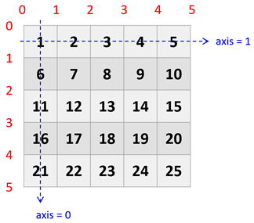
*** tile()
numpy.tile()是個什麼函數呢，說白了，就是把數組沿各個方向複製
#+begin_src python -r -n :results output :exports both
import numpy as np
print('=====一維tile=====')
b = np.array([[1, 2], [3, 4]])
b1 = np.tile(b, 2)
print(b1)
print('=====二維tile=====')
b2 = np.tile(b, (2, 3))
print(b2)
#+end_src

#+RESULTS:
: =====一維tile=====
: [[1 2 1 2]
:  [3 4 3 4]]
: =====二維tile=====
: [[1 2 1 2 1 2]
:  [3 4 3 4 3 4]
:  [1 2 1 2 1 2]
:  [3 4 3 4 3 4]]
*** numpy.allclose
- Returns True if two arrays are element-wise equal within a tolerance.
- The tolerance values are positive, typically very small numbers. The relative difference (rtol * abs(b)) and the absolute difference atol are added together to compare against the absolute difference between a and b.
- NaNs are treated as equal if they are in the same place and if equal_nan=True. Infs are treated as equal if they are in the same place and of the same sign in both arrays.
**** 語法
#+begin_src python -r -n :results output :exports both
numpy.allclose(a, b, rtol=1e-05, atol=1e-08, equal_nan=False)
#+end_src
**** Parameters
- a, b: array_like. Input arrays to compare.
- rtol: float. The relative tolerance parameter (see Notes).
- atol: float. The absolute tolerance parameter (see Notes).
- equal\under{}nan: bool. Whether to compare NaN’s as equal. If True, NaN’s in a will be considered equal to NaN’s in b in the output array.
**** Returns
- allclose: bool. Returns True if the two arrays are equal within the given tolerance; False otherwise.
**** See also:
- [[https://numpy.org/doc/stable/reference/generated/numpy.isclose.html#numpy.isclose][isclose]]
- [[https://numpy.org/doc/stable/reference/generated/numpy.all.html#numpy.all][all]]
- [[https://numpy.org/doc/stable/reference/generated/numpy.all.html#numpy.all][any]]
- [[https://numpy.org/doc/stable/reference/generated/numpy.equal.html#numpy.equal][equal]]
**** DEMO
參考: [[https://www.itdaan.com/tw/cc576c8f8162ab7ee9e3d6afdbf454fc][測試兩個numpy數組(接近)是否相等，包括形狀]]
#+begin_src python -r -n :results output :exports both
import numpy as np
import math

print(math.pi)
x = np.array([[3.14159265, -0.1], [-0.1, 0.1]])
y = np.array([[math.pi, -0.1], [-0.1, 0.1]])

z1 = np.array([[[3.14159265, -0.1], [-0.1, 0.1]],
              [[3.14159265, -0.1], [-0.1, 0.1]]])
z2 = np.array([[[math.pi, -0.1], [-0.1, 0.1]],
              [[math.pi, -0.1], [-0.1, 0.1]]])

print(np.allclose(x,y))
# Returns true, as expected

print(np.allclose(x,z1))
# Also returns true, even though matrices are different shapes. Unwanted.

a = np.array([[2,2,2],
              [3,3,3]])
b = np.array([[2,3,2],
              [3,3,2]])
print("=====allclose(atol=0.5)=====")
print(np.allclose(a, b, atol=0.5))
print("=====allclose(atol=1.0)=====")
print(np.allclose(a, b, atol=1.0))
print("=====equal()=====")
print(np.equal(a,b))

a = np.array([[2,2,2],
              [3,3,3.1]])
print(np.allclose(a, b, atol=1.0))
print('=====isclose()=====')
print(np.isclose(a, b, atol=1.0))
#+end_src

#+RESULTS:
#+begin_example
3.141592653589793
True
True
=====allclose(atol=0.5)=====
False
=====allclose(atol=1.0)=====
True
=====equal()=====
[[ True False  True]
 [ True  True False]]
False
=====isclose()=====
[[ True  True  True]
 [ True  True False]]
#+end_example

*** 其他常用函數
- min()
- max()
- argmin
- mean()
- std()
- var()
- sqrt()
- size()
- dtype()
- itemsize()
#+begin_src python -r -n :results output :exports both
import numpy as np

np1 = np.random.randint(0, 10, size=[3, 2])
print("np\n", np1)
print("np1.sum", np1.sum())
print("sum:", sum(np1))
print("sum:", sum(np1,3))
print("min:", np1.min())
print("max:", np1.max())
print("mean:", np.mean(np1))
#+end_src

#+RESULTS:
#+begin_example
np
 [[0 0]
 [0 3]
 [0 3]]
np1.sum 6
sum: [0 6]
sum: [3 9]
min: 0
max: 3
mean: 1.0
#+end_example
*** sum() v.s. np.sum()
#+CAPTION: sum() v.s. np.sum()
#+LABEL: fig:SimpleSin2
#+name: fig:SimpleSin
#+ATTR_LATEX: :width 400
#+ATTR_HTML: :width 400
#+ATTR_ORG: :width 400
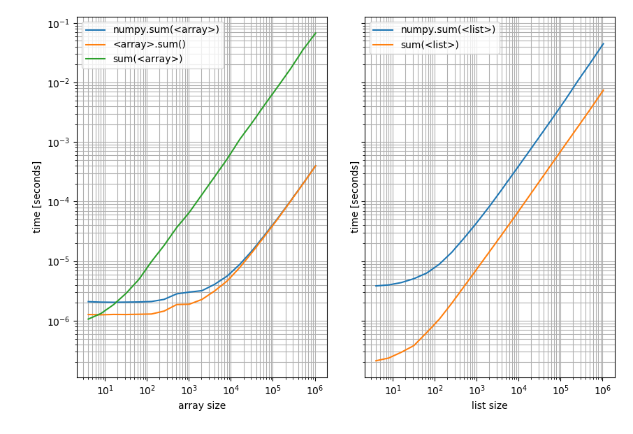
** 解聯立方程式
Numpy的linalg function可以用來解線性方程組，若目標方程式為$$Ax=b$$，其中$$x$$為所求之解，求解語法為：
#+begin_src swift -r -n :results output :exports nil
import numpy as np
x = np.linalg.solve(A, b)
#+end_src
*** 範例1
以如下方程式為例
$$\begin{cases}2x+y=5\\x+y=3\end{cases}$$
可將之視為求解$$Ax=b$$，其中
$$A=\begin{pmatrix}2&1\\1&1 \end{pmatrix}$$, $$b=\begin{pmatrix} 5\\3 \end{pmatrix} $$
**** solution
#+begin_src python -r -n :results output :exports both
import numpy as np
A = np.array([[2, 1],
              [1, 1]])
b = np.array([5, 3])
x = np.linalg.solve(A, b)
print(x)
print(np.allclose(np.dot(A, x), b)) ##評估兩個向量是否接近(relative tolerance:1e-05, absolute tolerance: 1e-08)
print(np.dot(A, x)) ##驗證正確性
#+end_src

#+RESULTS:
: [2. 1.]
: True
: [5. 3.]
*** 範例2
求解下列方程式
$$\begin{cases}3x_0+2x_1+x_2=11\\2x_0+3x_1+x_2=13\\x_0+x_1+4x_2=12 \end{cases}$$, 以$$Ax=b$$表示，則
$$A=\begin{pmatrix}3&2&1\\2&3&1\\1&1&4\end{pmatrix}, x=\begin{pmatrix}x_0\\x_1\\x_2\end{pmatrix}, b=\begin{pmatrix}11\\13\\12\end{pmatrix}$$
**** solution
#+begin_src python -r -n :results output :exports both
import numpy as np
A = np.array([[3, 2, 1],
              [2, 3, 1],
              [1, 1, 4]])
b = np.array([11, 13, 12])
x = np.linalg.solve(A, b)
print(x)
print(np.allclose(np.dot(A, x), b))
print(np.dot(A, x))
#+end_src

#+RESULTS:
: [1. 3. 2.]
: True
: [11. 13. 12.]
** 讀取外部檔案
NumPy提供了多種存取陣列內容的檔案操作函式。儲存陣列資料的檔案可以是二進位制格式或者文字格式。二進位制格式的檔案又分為NumPy專用的格式化二進位制型別和無格式型別。[fn:26][fn:27]
*** Bineary Format
**** save(), load()
#+begin_src python -r -n :results output :exports both
import numpy as np
a = np.arange(0, 12).reshape(3,4)
print(a)
np.save('a', a)
# 讀入
b = np.load('a.npy')
print(b)
#+end_src

#+RESULTS:
: [[ 0  1  2  3]
:  [ 4  5  6  7]
:  [ 8  9 10 11]]
: [[ 0  1  2  3]
:  [ 4  5  6  7]
:  [ 8  9 10 11]]
**** savez()
我們可以儲存多個陣列在一個zip的檔案中，使用np.savez就可以了！
#+begin_src python -r -n :results output :exports both
import numpy as np
aAry = [1,2,3,4,5,6]
bAry = [7,8,9,10,11,12]
#save
np.savez('ab.npz', a = aAry, b = bAry)
#load
myZip = np.load('ab.npz')
print(myZip['a'])
print(myZip['b'])
#+end_src

#+RESULTS:
: [1 2 3 4 5 6]
: [ 7  8  9 10 11 12]
*** Text Files: csv
目標文字檔(csv)如下：
#+begin_src shell -r -n :results output :exports both
cat cs-scores.csv
#+end_src

#+RESULTS:
#+begin_example
109.00,87,100.00,86.00,50.00
86.00,66,68.97,33.20,55.00
82.00,51,72.87,57.00,70.00
90.00,81,100.00,100.00,100.00
80.00,45,39.66,0.00,0.00
83.00,36,74.14,20.00,10.00
84.00,51,67.24,25.00,0.00
75.00,72,89.66,43.00,40.00
76.00,63,96.55,40.00,0.00
80.00,75,100.00,32.80,50.00
85.00,96,89.48,83.70,30.00
#+end_example
**** load
在Numpy內會使用.loadtxt或特定的np.genfromtxt來讀取文字檔
#+begin_src python -r -n :results output :exports both
import numpy as np
myAry = np.loadtxt('cs-scores.csv', delimiter=',')
print(myAry)
#+end_src

#+RESULTS:
#+begin_example
[[109.    87.   100.    86.    50.  ]
 [ 86.    66.    68.97  33.2   55.  ]
 [ 82.    51.    72.87  57.    70.  ]
 [ 90.    81.   100.   100.   100.  ]
 [ 80.    45.    39.66   0.     0.  ]
 [ 83.    36.    74.14  20.    10.  ]
 [ 84.    51.    67.24  25.     0.  ]
 [ 75.    72.    89.66  43.    40.  ]
 [ 76.    63.    96.55  40.     0.  ]
 [ 80.    75.   100.    32.8   50.  ]
 [ 85.    96.    89.48  83.7   30.  ]]
#+end_example
**** save
將處理完的陣列回存成csv檔：
#+begin_src python -r -n :results output :exports both
import numpy as np
myAry = np.loadtxt('cs-scores.csv', delimiter=',')
print(myAry)
np.savetxt('cs-scores.csv', myAry)

#+end_src
*** 讀取混合格式的文字資料
如果資料中某些欄位的資料格式是字串 (string)，處理起來相當麻煩，改用 numpy.genfromtxt 會比較簡單。[fn:28]
[[https://numpy.org/doc/stable/user/basics.io.genfromtxt.html][Importing data with genfromtxt]]
目標文字檔(csv)如下：
#+begin_src shell -r -n :results output :exports both
cat cs-scores2.csv
#+end_src

#+RESULTS:
#+begin_example
學號,平時成績,打字成績,作業成績,期中考,期末考
201811101,109.00,87,100.00,86.00,50.00
201811102,86.00,66,68.97,33.20,55.00
201811103,82.00,51,72.87,57.00,70.00
201811104,90.00,81,100.00,100.00,100.00
201811105,80.00,45,39.66,0.00,0.00
201811106,83.00,36,74.14,20.00,10.00
201811107,84.00,51,67.24,25.00,0.00
201811108,75.00,72,89.66,43.00,40.00
201811109,76.00,63,96.55,40.00,0.00
201811110,80.00,75,100.00,32.80,50.00
201811111,85.00,96,89.48,83.70,30.00
#+end_example
Pyton 3在讀取文字時，dtype應設為U(Unicode)，否則會在讀到的字首多出b[fn:29]
#+begin_src python -r -n :results output :exports both
import numpy as np
# Python3 is working with Unicode.
# I had the same issue when using loadtxt with dtype='S'. But using dtype='U as Unicode string in both numpy.loadtxt or numpy.genfromtxt, it will give output without b
data = np.genfromtxt("cs-scores2.csv", delimiter=',',
                     dtype=[('id', 'U10'), ('cls', float),
                            ('typing', float), ('hw', float),
                            ('mid', float), ('finl', float)],
                     skip_header=1, encoding='UTF-8')
print(data)
#+end_src

#+RESULTS:
#+begin_example
[('201811101', 109., 87., 100.  ,  86. ,  50.)
 ('201811102',  86., 66.,  68.97,  33.2,  55.)
 ('201811103',  82., 51.,  72.87,  57. ,  70.)
 ('201811104',  90., 81., 100.  , 100. , 100.)
 ('201811105',  80., 45.,  39.66,   0. ,   0.)
 ('201811106',  83., 36.,  74.14,  20. ,  10.)
 ('201811107',  84., 51.,  67.24,  25. ,   0.)
 ('201811108',  75., 72.,  89.66,  43. ,  40.)
 ('201811109',  76., 63.,  96.55,  40. ,   0.)
 ('201811110',  80., 75., 100.  ,  32.8,  50.)
 ('201811111',  85., 96.,  89.48,  83.7,  30.)]
#+end_example
*** 讀取一個欄位資料
在 numpy.genfromtxt() 中, 使用 usecols 參數指定取出的欄位編號, 即可取出特定欄位
#+begin_src python -r -n :results output :exports both
import numpy as np

classScore = np.genfromtxt("cs-scores2.csv", delimiter=',', skip_header=1,
                     dtype=float, usecols=(2,), unpack=True, encoding='UTF-8')
print(classScore)
#+end_src

#+RESULTS:
: [87. 66. 51. 81. 45. 36. 51. 72. 63. 75. 96.]
** 基礎練習
資料來源: [[https://www.itread01.com/content/1553930535.html][[轉]numpy 100道練習題]]
*** 創建一個長度為10的零向量，並把第五個值賦值為1
**** code :noexport:
#+begin_src python -r -n :results output :exports both
import numpy as np
z = np.zeros(10)
z[4] = 1
print(z)
#+end_src
**** example
#+RESULTS:
: [0. 0. 0. 0. 1. 0. 0. 0. 0. 0.]
*** 創建一個5x5的矩陣，值域為1,3,5,7...,49
**** code :noexport:
#+begin_src python -r -n :results output :exports both
import numpy as np
z = np.arange(1, 50, 2).reshape(5, 5)
print(z)
#+end_src
**** example
#+RESULTS:
: [[ 1  3  5  7  9]
:  [11 13 15 17 19]
:  [21 23 25 27 29]
:  [31 33 35 37 39]
:  [41 43 45 47 49]]
*** 創建一個3x3x3的隨機數組
**** code :noexport:
#+begin_src python -r -n :results output :exports both
import numpy as np
z = np.random.random((3, 3 ,3))
print(z)
#+end_src
**** example
#+RESULTS:
#+begin_example
[[[0.65641795 0.9853537  0.64412663]
  [0.52595413 0.17452888 0.44484008]
  [0.69218998 0.37001109 0.94711544]]

 [[0.80803134 0.93661621 0.61489936]
  [0.19635856 0.98132637 0.36713757]
  [0.89105201 0.31710182 0.12375642]]

 [[0.42944896 0.24734458 0.97763098]
  [0.96900319 0.64789449 0.42795362]
  [0.72306476 0.07604109 0.13012237]]]
#+end_example
*** 創建一個8x8的國際象棋棋盤矩陣（黑塊為0，白塊為1）
**** Solution #1 :noexport:
#+begin_src python -r -n :results output :exports both
import numpy as np
z = np.zeros((8, 8), dtype=int)
z[1::2, ::2] = 1
z[::2, 1::2] = 1
print(z)
#+end_src
**** example
#+RESULTS:
: [[0 1 0 1 0 1 0 1]
:  [1 0 1 0 1 0 1 0]
:  [0 1 0 1 0 1 0 1]
:  [1 0 1 0 1 0 1 0]
:  [0 1 0 1 0 1 0 1]
:  [1 0 1 0 1 0 1 0]
:  [0 1 0 1 0 1 0 1]
:  [1 0 1 0 1 0 1 0]]
**** Solution #2 :noexport:
#+begin_src python -r -n :results output :exports both
import numpy as np
z = [[0, 1], [1, 0]]
print(np.tile(z, (4, 4)))
#+end_src

#+RESULTS:
: [[0 1 0 1 0 1 0 1]
:  [1 0 1 0 1 0 1 0]
:  [0 1 0 1 0 1 0 1]
:  [1 0 1 0 1 0 1 0]
:  [0 1 0 1 0 1 0 1]
:  [1 0 1 0 1 0 1 0]
:  [0 1 0 1 0 1 0 1]
:  [1 0 1 0 1 0 1 0]]
*** 對5x5的隨機矩陣進行歸一化(Normalization)
(提示: (x - min) / (max - min))
**** code :noexport:
#+begin_src python -r -n :results output :exports both
import numpy as np
z = np.random.random((5, 5)) * 100
print(z)
Zmax, Zmin = z.max(), z.min()
z = (z-Zmin)/(Zmax-Zmin)
print(z)
#+end_src
**** example
#+RESULTS:
#+begin_example
[[93.91707     7.2497428  80.03357931 67.36581629 11.58313519]
 [12.57003038 38.52508111 83.86899353 27.63880275 25.8237963 ]
 [18.68409281 64.40845991 41.08228881 62.87822465 52.23296308]
 [90.53354354 78.60844019 46.98888235 29.757448   38.46802081]
 [71.53666934 63.90804362 64.40403658 29.34575551 82.74560132]]
[[1.         0.         0.8398071  0.69364172 0.0500003 ]
 [0.06138747 0.36086654 0.88406154 0.23525659 0.21431437]
 [0.1319338  0.65951863 0.39037256 0.64186221 0.5190332 ]
 [0.96095961 0.82336331 0.45852504 0.25970231 0.36020815]
 [0.74176658 0.65374464 0.65946759 0.25495205 0.87109942]]
#+end_example
*** 如何找出兩個數組公共的元素?
(提示: np.intersect1d)
**** code :noexport:
#+begin_src python -r -n :results output :exports both
import numpy as np
Z1 = np.random.randint(0, 10, 10)
Z2 = np.random.randint(0, 10, 10)
print(Z1)
print(Z2)
print(np.intersect1d(Z1, Z2))
#+end_src
**** example
#+RESULTS:
: [3 4 2 8 0 3 5 4 7 9]
: [9 3 4 6 5 6 3 0 5 6]
: [0 3 4 5 9]
*** 如何用一個生成10個整數的函數來構建數組
(提示: np.fromiter)
**** code :noexport:
#+begin_src python -r -n :results output :exports both
import numpy as np
def generate():
    for x in range(10):
      yield x
Z = np.fromiter(generate(), dtype=float, count=-1)
print (Z)
#+end_src
**** example
#+RESULTS:
: [0. 1. 2. 3. 4. 5. 6. 7. 8. 9.]
*** 對一個小數組進行求和有沒有辦法比np.sum更快?
(提示: np.add.reduce)
**** code :noexport:
#+begin_src python -r -n :results output :exports both
import numpy as np
Z = np.arange(10)
print(np.sum(Z))
print(np.add.reduce(Z))

# np.add.reduce 是numpy.add模塊中的一個ufunc(universal function)函數,C語言實現
#+end_src
**** example
#+RESULTS:
: 45
: 45
*** 如何判斷兩隨機數組相等
(提示: np.allclose, np.array\under{}equal)
**** code :noexport:
#+begin_src python -r -n :results output :exports both
import numpy as np
A = np.random.randint(0, 2, 5)
B = np.random.randint(0, 2, 5)
print('=====A=====')
print(A)
print('=====B=====')
print(B)
# 假設array的形狀(shape)相同和一個誤差容限（tolerance）
equal = np.allclose(A,B)
print(equal)

# 檢查形狀和元素值，沒有誤差容限（值必須完全相等）
equal = np.array_equal(A,B)
print(equal)
#+end_src
**** example
#+RESULTS:
: =====A=====
: [1 1 0 0 0]
: =====B=====
: [1 1 0 0 0]
: True
: True
*** 創建一個大小為10的隨機向量並且將該向量中最大的值替換為0
(提示: argmax)
**** code :noexport:
#+begin_src python -r -n :results output :exports both
import numpy as np
Z = np.random.random(10)
np.set_printoptions(precision=3)
print(Z)
Z[Z.argmax()] = 0
print(Z)
#+end_src
**** example
#+RESULTS:
: [0.509 0.491 0.888 0.604 0.409 0.136 0.523 0.068 0.307 0.869]
: [0.509 0.491 0.    0.604 0.409 0.136 0.523 0.068 0.307 0.869]
*** 思考形狀為(100, 2)的隨機向量，求出點與點之間的距離
(提示: np.atleast\under{}2d, T, np.sqrt)
**** code :noexport:
#+begin_src python -r -n :results output :exports both
import numpy as np
Z = np.random.random((5, 2))
np.set_printoptions(precision=2)
print(Z)
X, Y = np.atleast_2d(Z[:, 0], Z[:, 1])
D = np.sqrt((X-X.T)**2 + (Y-Y.T)**2)
print(D)

# 使用scipy庫可以更快
import scipy.spatial

Z = np.random.random((5,2))
D = scipy.spatial.distance.cdist(Z,Z)
print(D)
#+end_src
**** example
#+RESULTS:
#+begin_example
[[0.24 0.44]
 [0.87 0.84]
 [0.87 0.63]
 [0.56 0.11]
 [0.67 0.47]]
[[0.   0.74 0.66 0.46 0.43]
 [0.74 0.   0.21 0.79 0.42]
 [0.66 0.21 0.   0.61 0.26]
 [0.46 0.79 0.61 0.   0.37]
 [0.43 0.42 0.26 0.37 0.  ]]
[[0.   0.45 0.29 0.77 0.78]
 [0.45 0.   0.68 1.04 0.76]
 [0.29 0.68 0.   0.93 1.05]
 [0.77 1.04 0.93 0.   0.58]
 [0.78 0.76 1.05 0.58 0.  ]]
#+end_example
*** 如何在二維數組的隨機位置放置p個元素?(提示: np.put, np.random.choice)
**** code :noexport:
#+begin_src python -r -n :results output :exports both
import numpy as np
# Author: Divakar

n = 5
p = 3
Z = np.zeros((n,n))
np.put(Z, np.random.choice(range(n*n), p, replace=False),1)
print(Z)
#+end_src
**** example
#+RESULTS:
: [[0. 0. 0. 0. 1.]
:  [0. 0. 1. 0. 0.]
:  [0. 0. 1. 0. 0.]
:  [0. 0. 0. 0. 0.]
:  [0. 0. 0. 0. 0.]]
***  如何對數組通過第n列進行排序? (提示: argsort)
**** code :noexport:
#+begin_src python -r -n :results output :exports both
import numpy as np
# Author: Steve Tjoa

Z = np.random.randint(0,10,(3,3))
print(Z)
print(Z[ Z[:,2].argsort() ])
#+end_src
**** example
#+RESULTS:
: [[6 1 5]
:  [8 7 9]
:  [9 5 1]]
: [[9 5 1]
:  [6 1 5]
:  [8 7 9]]
*** 從數組中找出與給定值最接近的值(提示: np.abs, argmin, flat)
**** code :noexport:
#+begin_src python -r -n :results output :exports both
import numpy as np
Z = np.random.uniform(0,1,10)
z = 0.5
print(Z)
print('=====最接近',z,'的陣列值及其位置=====')
m = Z.flat[np.abs(Z - z).argmin()]
print(np.where(Z==m),': ',m)
#+end_src
**** example
#+RESULTS:
: [0.10888426 0.00635016 0.80979507 0.99058779 0.37085609 0.0438693
:  0.33289479 0.02195115 0.74203634 0.48734223]
: =====最接近 0.5 的陣列值及其位置=====
: (array([9]),) :  0.487342230530487
*** 創建一個具有name屬性的數組類(提示: class method)
**** code :noexport:
#+begin_src python -r -n :results output :exports both
import numpy as np
class NameArray(np.ndarray):
    def __new__(cls, array, name="no name"):
        obj = np.asarray(array).view(cls)
        obj.name = name
        return obj
    def __array_finalize__(self, obj):
        if obj is None: return
        self.info = getattr(obj, 'name', "no name")

Z = NameArray(np.arange(10), "range_10")
print (Z.name)
#+end_src
**** example
#+RESULTS:
: range_10
*** 考慮一個維度(5,5,3)的數組，如何將其與一個(5,5)的數組相乘？(提示: array[:, :, None])
**** code :noexport:
#+begin_src python -r -n :results output :exports both
import numpy as np
A = np.ones((5,5,3))
B = 2*np.ones((5,5))
print(A * B[:,:,None])
#+end_src
**** example
#+RESULTS:
#+begin_example
[[[2. 2. 2.]
  [2. 2. 2.]
  [2. 2. 2.]
  [2. 2. 2.]
  [2. 2. 2.]]

 [[2. 2. 2.]
  [2. 2. 2.]
  [2. 2. 2.]
  [2. 2. 2.]
  [2. 2. 2.]]

 [[2. 2. 2.]
  [2. 2. 2.]
  [2. 2. 2.]
  [2. 2. 2.]
  [2. 2. 2.]]

 [[2. 2. 2.]
  [2. 2. 2.]
  [2. 2. 2.]
  [2. 2. 2.]
  [2. 2. 2.]]

 [[2. 2. 2.]
  [2. 2. 2.]
  [2. 2. 2.]
  [2. 2. 2.]
  [2. 2. 2.]]]
#+end_example
***  如何對一個數組中任意兩行做交換?(提示: array[[]] = array[[]])
**** code :noexport:
#+begin_src python -r -n :results output :exports both
import numpy as np
A = np.arange(25).reshape(5,5)
print(A)
A[[0,1]] = A[[1,0]]
print(A)
#+end_src
**** example
#+RESULTS:
#+begin_example
[[ 0  1  2  3  4]
 [ 5  6  7  8  9]
 [10 11 12 13 14]
 [15 16 17 18 19]
 [20 21 22 23 24]]
[[ 5  6  7  8  9]
 [ 0  1  2  3  4]
 [10 11 12 13 14]
 [15 16 17 18 19]
 [20 21 22 23 24]]
#+end_example
*** 思考描述10個三角形（共享頂點）的一組10個三元組，找到組成所有三角形的唯一線段集(提示: repeat, np.roll, np.sort, view, np.unique)
**** code :noexport:
#+begin_src python -r -n :results output :exports both
import numpy as np
# Author: Nicolas P. Rougier

faces = np.random.randint(0,100,(10,3))
F = np.roll(faces.repeat(2,axis=1),-1,axis=1)
F = F.reshape(len(F)*3,2)
F = np.sort(F,axis=1)
G = F.view( dtype=[('p0',F.dtype),('p1',F.dtype)] )
G = np.unique(G)
print(G)
#+end_src
**** example
#+RESULTS:
: [( 1, 31) ( 1, 77) ( 2, 23) ( 2, 33) ( 8, 43) ( 8, 88) ( 9, 55) ( 9, 93)
:  (17, 61) (17, 65) (17, 70) (17, 74) (21, 38) (21, 67) (23, 33) (31, 77)
:  (36, 58) (36, 63) (38, 67) (43, 88) (52, 65) (52, 92) (55, 93) (58, 63)
:  (61, 70) (65, 74) (65, 92) (90, 91) (90, 98) (91, 98)]
*** 如何找出數組中出現頻率最高的值?(提示: np.bincount, argmax)
**** code :noexport:
#+begin_src python -r -n :results output :exports both
import numpy as np
Z = np.random.randint(0,10,50)
print(np.bincount(Z).argmax())
#+end_src
*** 從一個5x5的矩陣中提取出連續的3x3區塊**(提示: stride\under{}tricks.as_strided)
**** code :noexport:
#+begin_src python -r -n :results output :exports both
import numpy as np
# Author: Chris Barker

Z = np.random.randint(0,9,(5,5))
print(Z)
n = 3
i = 1 + (Z.shape[0]-3)
j = 1 + (Z.shape[1]-3)
C = np.lib.stride_tricks.as_strided(Z, shape=(i, j, n, n), strides=Z.strides + Z.strides)
print(C)
#+end_src
**** example
#+RESULTS:
#+begin_example
[[2 5 1 4 6]
 [2 6 7 2 4]
 [3 7 7 4 6]
 [8 1 4 0 3]
 [1 1 7 7 4]]
[[[[2 5 1]
   [2 6 7]
   [3 7 7]]

  [[5 1 4]
   [6 7 2]
   [7 7 4]]

  [[1 4 6]
   [7 2 4]
   [7 4 6]]]

 [[[2 6 7]
   [3 7 7]
   [8 1 4]]

  [[6 7 2]
   [7 7 4]
   [1 4 0]]

  [[7 2 4]
   [7 4 6]
   [4 0 3]]]

 [[[3 7 7]
   [8 1 4]
   [1 1 7]]

  [[7 7 4]
   [1 4 0]
   [1 7 7]]

  [[7 4 6]
   [4 0 3]
   [7 7 4]]]]
#+end_example
*** 對於一個16x16的數組，如何得到一個區域的和(區域大小為4x4)? (提示: np.add.reduceat)
**** code :noexport:
#+begin_src python -r -n :results output :exports both
import numpy as np
# Author: Robert Kern

Z = np.ones((16,16))
k = 4
S = np.add.reduceat(np.add.reduceat(Z, np.arange(0, Z.shape[0], k), axis=0), np.arange(0, Z.shape[1], k), axis=1)
print(S)
#+end_src
*** 如何找到一個數組的第n個最大值?(提示: np.argsort | np.argpartition)
**** code :noexport:
#+begin_src python -r -n :results output :exports both
import numpy as np
Z = np.arange(10000)
np.random.shuffle(Z)
n = 5

# Slow
print (Z[np.argsort(Z)[-n:]])

# Fast
print (Z[np.argpartition(-Z,n)[:n]])
#+end_src
** 作業
*** 作業1
1. 隨機產生一組 150 個 0~100 的陣列。
1. 將上述陣列 reshape 為 30*5 的二維陣列，模擬成一個班級的某次考試成績(30 人*5 科)。
1. 輸出此次 5 科考科的全班總分、平均。某班資電腦科期中考成績(30 人，分數為 0~100)，將分數以「開根
   號乘以 10」的方式修正，求全班最高分、最低分、平均。
1. 輸出各科標準差(提示：std)
1. 將全班分數以「開根號乘以 10」的方式進行調整。
1. 上述輸出至小數點第二位(提示：set\under{}printoptions)
**** 結果範例
#+begin_example
各科總分: [1427 1338 1417 1380 1678]
各科平均: [47.57 44.6  47.23 46.   55.93]
各科最高分: [97 95 98 96 99]
各科最低分: [2 0 0 6 0]
各科標準差: [31.56 30.23 31.07 30.47 32.93]
調整分數:
 [[96.95 68.56 24.49 36.06 81.24]
 [75.5  20.   55.68 97.98 92.74]
 [20.   70.   60.   94.34 91.65]
 [41.23 56.57 91.1  55.68 97.47]
 [98.49 43.59  0.   36.06 71.41]
 [52.92 41.23 95.92 83.07 53.85]
 [97.98 94.34 52.92 50.   93.81]
 [47.96 74.83 54.77 50.   22.36]
 [81.85 63.25 90.   68.56 97.47]
 [67.82 66.33 82.46 86.02 91.65]
 [81.85 75.5  46.9  66.33 40.  ]
 [45.83 80.62 56.57 30.   87.18]
 [50.99 97.47 98.99 93.81 99.5 ]
 [98.49 95.39 88.88 24.49 91.65]
 [60.   73.48 90.55 24.49 74.16]
 [50.   93.27 89.44 91.65 99.5 ]
 [77.46 28.28 34.64 24.49 28.28]
 [91.65 46.9  72.11 97.98 57.45]
 [60.83 87.75 68.56 75.5  61.64]
 [93.81 24.49 84.85 36.06 96.95]
 [69.28 55.68 83.67 36.06 95.39]
 [96.44 86.6  17.32 76.16 60.  ]
 [77.46 83.67 37.42 96.95  0.  ]
 [31.62 14.14 76.16 67.08 61.64]
 [64.81 30.   36.06 84.26 87.75]
 [40.   26.46 97.98 40.   10.  ]
 [31.62 95.92 85.44 82.46 76.16]
 [14.14  0.   58.31 54.77 74.83]
 [85.44 67.08 33.17 68.56 44.72]
 [17.32 69.28 37.42 68.56 40.  ]]
#+end_example
**** solution :noexport:
#+begin_src python -r -n :results output :exports both
import numpy as np
import math

#1
sc1 = np.random.randint(0, 100, size=[1, 150])
#2
sc2 = sc1.reshape(30, 5)
#3
np.set_printoptions(precision=2)
print("各科總分:",sum(sc2))
print("各科平均:",sum(sc2)/30)
print("各科最高分:",sc2.max(0))
print("各科最低分:",sc2.min(0))
#4
print("各科標準差:",sc2.std(0))
#5
print("調整分數:\n",np.sqrt(sc2)*10)

#+end_src

#+RESULTS:
#+begin_example
各科總分: [1427 1338 1417 1380 1678]
各科平均: [47.57 44.6  47.23 46.   55.93]
各科最高分: [97 95 98 96 99]
各科最低分: [2 0 0 6 0]
各科標準差: [31.56 30.23 31.07 30.47 32.93]
調整分數:
 [[96.95 68.56 24.49 36.06 81.24]
 [75.5  20.   55.68 97.98 92.74]
 [20.   70.   60.   94.34 91.65]
 [41.23 56.57 91.1  55.68 97.47]
 [98.49 43.59  0.   36.06 71.41]
 [52.92 41.23 95.92 83.07 53.85]
 [97.98 94.34 52.92 50.   93.81]
 [47.96 74.83 54.77 50.   22.36]
 [81.85 63.25 90.   68.56 97.47]
 [67.82 66.33 82.46 86.02 91.65]
 [81.85 75.5  46.9  66.33 40.  ]
 [45.83 80.62 56.57 30.   87.18]
 [50.99 97.47 98.99 93.81 99.5 ]
 [98.49 95.39 88.88 24.49 91.65]
 [60.   73.48 90.55 24.49 74.16]
 [50.   93.27 89.44 91.65 99.5 ]
 [77.46 28.28 34.64 24.49 28.28]
 [91.65 46.9  72.11 97.98 57.45]
 [60.83 87.75 68.56 75.5  61.64]
 [93.81 24.49 84.85 36.06 96.95]
 [69.28 55.68 83.67 36.06 95.39]
 [96.44 86.6  17.32 76.16 60.  ]
 [77.46 83.67 37.42 96.95  0.  ]
 [31.62 14.14 76.16 67.08 61.64]
 [64.81 30.   36.06 84.26 87.75]
 [40.   26.46 97.98 40.   10.  ]
 [31.62 95.92 85.44 82.46 76.16]
 [14.14  0.   58.31 54.77 74.83]
 [85.44 67.08 33.17 68.56 44.72]
 [17.32 69.28 37.42 68.56 40.  ]]
#+end_example
*** 作業2
Nearest neighbor: Find nearest neighbors according to )of a numpy array in list of numpy arrays
**** 結果範例
#+BEGIN_EXAMPLE
[[21 89 59 80]
 [94 48 85 34]
 [39 10 79 31]
 [88 76 94 37]]
最接近50的值在Array[1][1]: 48
#+END_EXAMPLE

**** solution :noexport:
題目提示說用 argmin 函數，用 argmin 函數找出 A - z 中絕對值最小的元素的位置，返回 A 中相應位置的元素。
#+begin_src python -r -n :results output :exports both
import numpy as np

def find_closest(A, z):
    C = np.abs(A - z)
    idx = np.argmin(C)
    return idx // A.shape[0], idx % A.shape[0] , A[idx // A.shape[0]][idx % A.shape[0]]

A = (np.random.random((4, 4))*100).astype(int)
print(A)
n = 50
x, y, value = find_closest(A, n)
print("最接近%d的值在Array[%d][%d]: %d" %(n, x, y, value))
#+end_src
**** example
#+RESULTS:
: [[21 89 59 80]
:  [94 48 85 34]
:  [39 10 79 31]
:  [88 76 94 37]]
: 最接近50的值在Array[1][1]: 48
** 資料的正規化(Normalization)及標準化(Standardization)
當我們在比較分析兩組數據資料時，可能會遭遇因單位的不同(例如：身高與體重)，或數字大小的代表性不同(例如：粉專1萬人與滿足感0.8)，造成各自變化的程度不一，進而影響統計分析的結果；為解決此類的問題，我們可利用資料的正規化(Normalization)與標準化(Standardization)，藉由將原始資料轉換成無量綱(Dimensionless)的純量後，來進行數據的比較及分析。[fn:30]
*** Normalization
原始資料的數據按比例縮放於 [0, 1] 區間中，且不改變其原本分佈。舉例來說，若我們現有兩組數據資料，分別表示 500 項商品的銷售量 Sample 1 及銷售額 Sample 2，如下圖所示，很明顯地，此兩組資料的單位不同，且數字上有著懸殊的差異，分別透過資料正規化後，兩組資料將同時轉換成純量縮放於 [0,1] 區間中，如下右圖所示；這樣的資料轉換，能排除資料單位的限制，提供我們一個相同的基準來進行後續比較分析。
#+CAPTION: Normalization
#+LABEL: fig:Normalization
#+name: fig:Normalization
#+ATTR_LATEX: :width 400
#+ATTR_HTML: :width 400
#+ATTR_ORG: :width 500
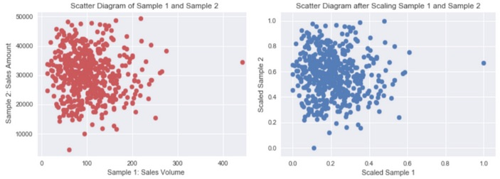
**** 實作
最小值最大值正規化的用意，是將資料等比例縮放到 [0, 1] 區間中，可利用下列公式進行轉換：
$$X_{nom} = \frac{X-X_{min}}{X_{max}-X{min}} \in [0,1]$$
其中 Xmax 與 Xmin 分別為資料中的最小值與最大值。此種方法有一點需我們特別注意，即若原始資料有新的數據加入，有可能導致最小值 Xmin 及最大值 Xmax 的改變，則這時候我們需再重新定義公式中的 Xmin 及 Xmax。另外，若將轉換公式修改成下列：
$$X_{nom} = \frac{X-\mu}{X_{max}-X{min}} \in [-1,1]$$
其中$$\mu$$為資料的平均值，則資料將縮放到 [-1, 1] 區間中且平均值 = 0，我們稱這為平均值正規化(Mean Normalization)。

在實務操作最小值最大值正規化時，我們可使用 Scikit-learn 套件的MinMaxScaler 物件執行。
*** Standardization
會將所有特徵數據縮放成平均為0、平方差為1。資料的標準化(Standardization)可運用在機器學習演算法中，它能帶給模型下面兩個好處：
- 提升模型的收斂速度
  在建構機器學習模型時，我們會利用梯度下降法(Gradient Descent)來計算成本函數(Cost Function)的最佳解；假設我們現有兩個特徵值 x1 in [0,1] 與 x2 in [0,10000]，則在 x1-x2 平面上成本函數的等高線會呈窄長型，導致需較多的迭代步驟，另外也可能導致無法收斂的情況發生。因此，若將資料標準化，則能減少梯度下降法的收斂時間。
- 提高模型的精準度
  將特徵值 x1 及 x2 餵入一些需計算樣本彼此的距離(例如:歐氏距離)分類器演算法中，則 x2 的影響很可能將遠大於 x1，若實際上 x1 的指標意義及重要性高於 x2，這將導致我們分析的結果失真。因此，資料的標準化是有必要的，可讓每個特徵值對結果做出相近程度的貢獻。
**** 實作
$$Z = \frac{X-\mu}{\delta} \sim N(0, 1)$$
經 Z分數標準化後，資料將符合標準常態分佈(Standard Normal Distribution)，轉換後的平均值=0、標準差=1，且用標準分數或稱 Z分數(Z-Score)來作為單位。Z分數標準化適用於分佈大致對稱的資料，因為在非常不對稱的分佈中，標準差的意義並不明確，此時若標準化資料，可能會對結果做出錯誤的解讀，另外，當我們未知資料的最大值與最小值，或存在超出觀察範圍的離群值時，可透過 Z分數標準化來降低離群值對整個模型的影響。

在實務操作時，我們可先分別計算資料的平均值及標準差，再代入上述公式完成標準化，另一種方法，我們可使用Scikit-learn 套件的preprocessing 模組來執行資料標準化。

  #+latex:\newpage

* Matplotlib
:PROPERTIES:
:CUSTOM_ID: Matplotlib
:END:
** Matplotlib 簡介
- Matplotlib 是利用 Python 所實作的繪圖套件，其中包含兩個最重要的模組: pylab 和
  pyplot。
- pylab 已經幾乎實作了在學術界最常用的套件 — Matlab 所支援的繪圖功能，或
  者可以說 pylab 其實就是 Matlab 的 Python 版本；
- pyplot 是把 pylab 再加上 Numpy，讓使用者在使用 pyplot 時，可以直
  接呼叫 Numpy 的函式做計算後再以圖型的方式呈現。[fn:31]
- 為 Python 最多人使用的 2D 繪圖工具
- 優點：圖形美觀、類型多、相容於 Matlab
- 官方社群網站 https://matplotlib.org/
- 維基百科 https://zh.wikipedia.org/wiki/Matplotlib
** Matplotlib 基本語法
*** 基本語法
- import matplotlib.pyplot as plt
- [[https://matplotlib.org/3.2.1/api/_as_gen/matplotlib.pyplot.plot.html][plt.plot()函式]]為 matplotlib.pyplot 模組畫線條方法，其語法如下

#+BEGIN_SRC python
plt.plot( [x座標資料,] y座標資料 [, 參數1, 參數2, ...] )
#+END_SRC
*** 範例:簡單的 sin 圖形
- np.sin( )函式為 Numpy 模組求正弦值
- plt.show( )函式用來顯示圖形
#+BEGIN_SRC python -r -n :results output :exports both
import matplotlib.pyplot as plt
import numpy as np

x = np.arange(-3, 3, 0.1)
plt.clf()
plt.plot(x, np.sin(x))

# 若要存圖，要先存檔再顯示 # for jupyter
plt.savefig('images/SimpleSin.png', dpi=300)
# plt.show()   # for jupyter

#+END_SRC
#+RESULTS:
#+CAPTION: 簡單的 sin 圖形
#+LABEL: fig:SimpleSin
#+name: fig:SimpleSin
#+ATTR_LATEX: :width 300
#+ATTR_HTML: :width 400
#+ATTR_ORG: :width 300
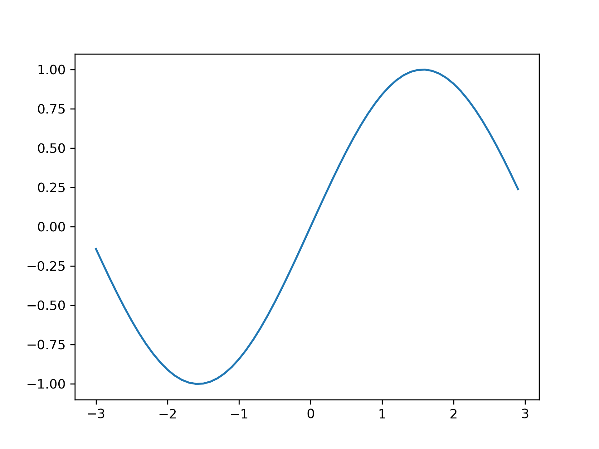
*** plot 官方語法
plot()函式控制輸出主要有以下兩類參數：
- fmt 字串
- kwarg 參數
基本語法如下:
- plot([x], y, [fmt], *, data=None, **kwargs)
- plot([x], y, [fmt], [x2], y2, [fmt2], ..., **kwargs)
** fmt控制參數
- 可選引數 fmt 是定義基本格式 (如顏色、標記和 linestyle) 的簡便方法
- plot(): fmt 字串
| 字元 | 顏色 | 字元 | 標記       | 字元     | 標記     |
|------+------+------+------------+----------+----------|
| 'b'  | 藍   | '.'  | 點         | '*'      | *        |
| 'g'  | 綠   | 'o'  | 圓圈       | '+'      | +        |
| 'r'  | 紅   | 'v'  | 三角形(下) | 'x'      | x        |
| 'c'  | 青   | '^'  | 三角形(上) | 'd'      | 鑽石     |
| 'm'  | 洋紅 | '<'  | 三角形(左) | 字元     | 線條     |
| 'y'  | 黃   | '>'  | 三角形(右) | '-'      | 實線     |
| 'k'  | 黑   | 's'  | 正方形     | '--'     | 虛線     |
| 'w'  | 白   | 'p'  | 五邊形     | '-.'     | -.-.-.-. |
*** Demo #1
#+begin_src python -r -n :results output :exports both
import matplotlib.pyplot as plt
import numpy as np

x = np.arange(-3, 3, 0.1)
plt.clf()
plt.plot(x, np.sin(x), 'r+')
# for web-based
# plt.show()

# saving figure
plt.savefig('SimpleSin2.png', dpi=300)

#+end_src
#+RESULTS:
#+CAPTION: 簡單的 sin 圖形
#+LABEL: fig:SimpleSin
#+name: fig:SimpleSin
#+ATTR_LATEX: :width 400
#+ATTR_HTML: :width 400
#+ATTR_ORG: :width 400
[[file:simpleSin2.png]]
*** Demo #2
#+begin_src python -r -n :results output :exports both
import matplotlib.pyplot as plt
import numpy as np

x = np.arange(-3, 3, 0.1)
plt.clf()
plt.plot(x, np.cos(x), 'c-.')
# for web-based
# plt.show()

# saving figure
plt.savefig('SimpleCos.png', dpi=300)

#+end_src
#+RESULTS:
#+CAPTION: 簡單的 cos圖形
#+LABEL: fig:SimpleCos
#+name: fig:SimpleCos
#+ATTR_LATEX: :width 400
#+ATTR_HTML: :width 400
#+ATTR_ORG: :width 400
[[file:simpleCos.png]]
*** Demo: 多組資料
#+begin_src python -r -n :results output :exports both
import matplotlib.pyplot as plt
import numpy as np

x1 = np.arange(-3, +3, 0.1)
y1 = np.sin(x1)
y2 = np.cos(x1)

#plt.plot(x1, y1, 'r^--', x1, y2, 'go-')
plt.plot(x1, y1, 'r^--', x1, y2, 'go-')
plt.savefig('mline.png', dpi=300)

#+end_src
#+RESULTS:
#+CAPTION: 多組圖形
#+LABEL: fig:multi-line
#+name: fig:multi-line
#+ATTR_LATEX: :width 300
#+ATTR_HTML: :width 400
#+ATTR_ORG: :width 300
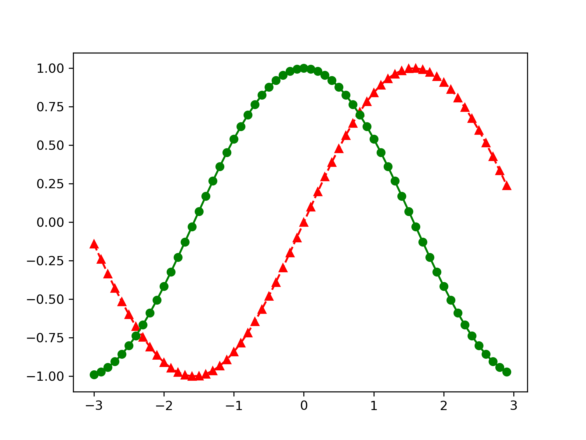
** kwgarg 參數
*** kwarg 為 Line2D 屬性：[[https://matplotlib.org/3.1.0/gallery/color/named_colors.html][color]], linestyle, marker, label, linewidth, ….
- kwargs 用於指定諸如線條標籤 (用於自動圖例)、線寬、抗鋸齒、標記面顏色等屬性
- 若 fmt 和 kwarg 設定衝突時，以 kwarg 為主
*** color
- 單字，如 g：color = 'lime'
- 字母，如 g：color = 'k'
- 色碼，如 g：color = '#FF0000'
- RGB 值(0~g1 之間)，如：color = (1, 0, 0)
| 字元 | 顏色 |
|------+------|
| 'b'  | 藍色 |
| 'g'  | 綠色 |
| 'r'  | 紅   |
| 'c'  | 青色 |
| 'm'  | 品紅 |
| 'y'  | 黃色 |
| 'k'  | 黑   |
| 'w'  | 白色 |
*** marker
| 字元    | 描述                |
|---------+---------------------|
| '.'     | 點標記              |
| ','     | 畫素標記            |
| 'o'     | 圓圈標記            |
| 'v'     | triangle\under{}down 標記 |
| '^'     | triangle\under{}up 標記 |
| '<'     | triangle\under{}left 標記 |
| '>'     | triangle\under{}right 標記 |
| '1'     | tri\under{}down 標記 |
| '2'     | tri\under{}up 標記  |
| '3'     | tri\under{}left 標記 |
| '4'     | tri\under{}right 標記 |
| 's'     | 方形標記            |
| 'p'     | 五角大樓標記        |
| '*'     | 星形標記            |
| 'h'     | hexagon1 標記       |
| 'H'     | hexagon2 標記       |
| '+'     | 加號標記            |
| 'x'     | x 標記              |
| 'D'     | 鑽石標記            |
| 'd'     | thin\under{}diamond 標記 |
| '\vert' | 圴標記              |
| '\under{}' | 修身標記            |
**** linestyle
| 字元 | 描述            |
|------+-----------------|
| '-'  | 實線樣式        |
| '--' | 虛線樣式        |
| '-.' | 破折號-點線樣式 |
| ':'  | 虛線樣式        |
**** label
- fg 呈現線條標籤，如 label = 'y = x^2'
- 需搭配 pglt.legend()函式方能呈現 label
*** 其他參數
- x / y 座標範圍：plt.xlim(起始值, 終止值)  / plt.ylim(起, 止)
- 圖表標題：plt.title(字串)
- x / y 座標標題：plt.xlabel(字串) / plt.ylabel(字串)
- 顯示 kwarg 參數裡的 label：plt.legend()
*** kwarg 示範
#+begin_src python -r -n :results output :exports both
import matplotlib.pyplot as plt
import numpy as np

x = np.arange(-3, 3, 0.5)
plt.clf()
plt.plot(x, np.cos(x), color='c', linestyle='--', marker='p')
plt.xlim(-4, 4)
plt.xlabel('This is x label')
plt.title("This is Title", fontsize=16)

plt.savefig('images/kwarg.png', dpi=300)

#+end_src
#+RESULTS:
#+CAPTION: kwarg參數控制
#+LABEL: fig:kwarg
#+name: fig:kwarg
#+ATTR_LATEX: :width 400
#+ATTR_HTML: :width 400
#+ATTR_ORG: :width 400

*** 中文問題
- 解決方案
#+begin_src python -r -n :results output :exports both
# 解決中文問題
plt.rcParams['font.sans-serif'] = ['SimHei'] # 步驟一（替換sans-serif字型）
plt.rcParams['axes.unicode_minus'] = False  # 步驟二（解決座標軸負數的負號顯示問題）
#+end_src
- 實際示例
#+CAPTION: 簡單的折線圖及圖例
#+LABEL: fig:SimpleLineLegend
#+name: fig:SimpleLineLegend
#+ATTR_LATEX: :width 400
#+ATTR_HTML: :width 400
#+ATTR_ORG: :width 400
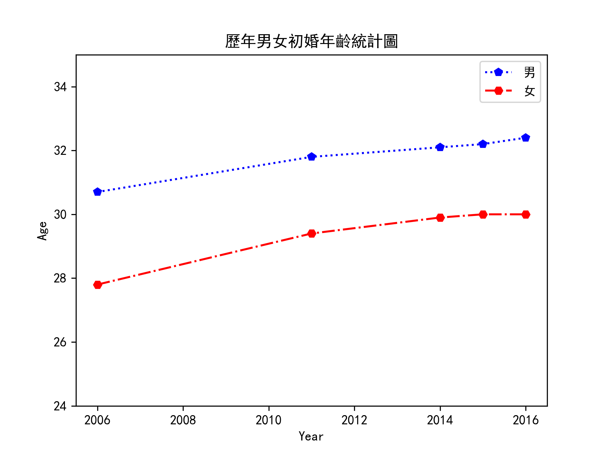
** Line Chart
*** Demo #1
#+BEGIN_SRC python -r -n :results output :exports both
import matplotlib.pyplot as plt
import numpy as np

x1 = [1, 2, 3, 4, 5, 6]
y1 = [1, 2, 3, 4, 5, 6]
x2 = np.arange(0, 3, 0.3)
x3 = np.arange(8).reshape(2, 4)
print(x3)
print(x3+3)
plt.plot(y1, 'c-p', x2, x2**2, 'ms:', x3, x3+3, '-*')
plt.savefig('line2.png', dpi=300)
#+END_SRC
#+RESULTS:
: [[0 1 2 3]
:  [4 5 6 7]]
: [[ 3  4  5  6]
:  [ 7  8  9 10]]
#+CAPTION: 簡單的折線圖形 2
#+LABEL: fig:SimpleSin
#+name: fig:SimpleSin
#+ATTR_LATEX: :width 400
#+ATTR_HTML: :width 400
#+ATTR_ORG: :width 400
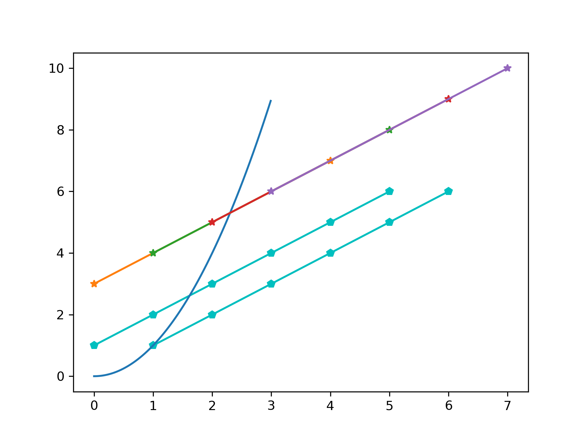
*** <<P#1>>練習1: 繪製折線圖
1. 利用 list 繪製

  + x1 = [1, 2, 3, 4, 5, 6]

  + y1 = [1, 2, 3, 4, 5, 6]

1. 執行 plt.plot(y1) 和 plt.plot(x1, y1) 有何差別??
1. 利用 numpy 繪製

  + x2 = np.arange(0, 3, 0.01)

1. 執行 plt.plot(x2, x2**2)看看畫出什麼圖形??
*** 課堂作業: 圖表美化
1. 將[[P#1]]的圖表加上標記、線條標籤，換線條顏色、線條樣式
1. 請將下列資料繪成折線圖(男女折線不同顏色、樣式，加標記)
   | 初婚年齡 | 2006 | 2011 | 2014 | 2015 | 2016 |
   |----------+------+------+------+------+------|
   | 男       | 30.7 | 31.8 | 32.1 | 32.2 | 32.4 |
   | 女       | 27.8 | 29.4 | 29.9 | 30.0 | 30.0 |
   + 圖表標題: Age of first marriage
	
   + 座標軸標題: x ⇒ Year、y ⇒ Age
	
   + 線條標籤: 男 ⇒ Male、女 ⇒ Female
   + 結果示例
     #+CAPTION: 簡單的折線圖及圖例
#+LABEL: fig:SimpleLineLegend
#+name: fig:SimpleLineLegend
#+ATTR_LATEX: :width 400
#+ATTR_HTML: :width 400
#+ATTR_ORG: :width 400

**** solution :noexport:
#+begin_src python -r -n :results output :exports both
import matplotlib.pyplot as plt
import numpy as np

year = [2006, 2011, 2014, 2015, 2016]
male = [30.7, 31.8, 32.1, 32.2, 32.4]
female = [27.8, 29.4, 29.9, 30.0, 30.0]
plt.clf()

plt.rcParams['font.sans-serif'] = ['SimHei']
plt.rcParams['axes.unicode_minus'] = False

plt.plot(year, male, 'bp:', label='男')
plt.plot(year, female, 'rH-.', label='女')
plt.xlabel('Year')
plt.ylim(24,35)
plt.ylabel('Age')
plt.title('歷年男女初婚年齡統計圖')
plt.legend()
# 若要存圖，要先存檔再顯示 # for jupyter
# plt.savefig('SimpleSin.png', dpi=300)
#plt.show()   # for jupyter
plt.savefig('images/marriage.png', dpi=300)
#+end_src
** Bar chart
- 語法
#+begin_src python :eval no
plt.bar( x座標資料, y座標資料 [, 參數1, 參數2, ...] )
plt.barh( x座標資料, y座標資料 [, 參數1, 參數2, ...] )
#+end_src
- DEMO
#+begin_src python -r -n :results output :exports both
import matplotlib.pyplot as plt
import numpy as np

objects = ('Python', 'C++', 'Java', 'Perl', 'Scala', 'Lisp')
y_pos = np.arange(len(objects))
performance = [10,8,6,4,2,1]

plt.barh(y_pos, performance, align='center', color = ['b','g','r','c','m','y'], alpha=0.5)
plt.yticks(y_pos, objects)
plt.xlabel('Usage')
plt.title('Programming language usage')
#plt.show()
plt.savefig('barChart.png', dpi=300)

#+end_src
#+RESULTS:
#+CAPTION: barChart Demo
#+LABEL: fig:barChart
#+name: fig:barChart
#+ATTR_LATEX: :width 300
#+ATTR_HTML: :width 400
#+ATTR_ORG: :width 300
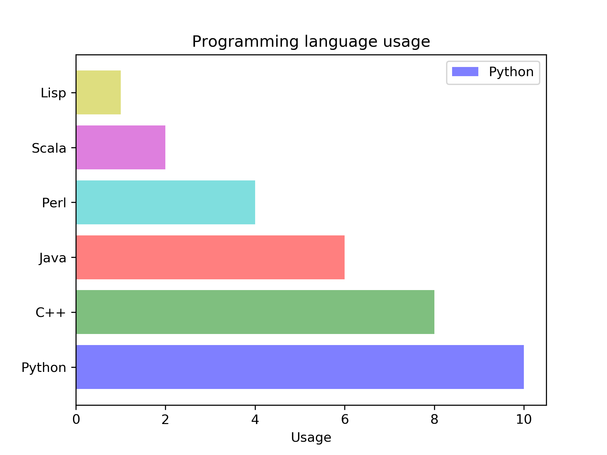
** Pie chart
*** 語法：

plt.pie( 比例列表 [, 參數 1, 參數 2, ...] )
*** 參數：
- colors：各子圖顏色，多以 list 表示
- labels：各子圖標籤，多以 list 表示
- explode：各子圖分離突出比例，0.1 代表分離 10%，多以 list 表示
- autopct：顯示各子圖比例值，格式為%x.y%%
- startangle：繪製起始角度，預設為 0 (與三角函數角度相同)
- 若要以正圓形繪製，請再加上 [[https://matplotlib.org/3.2.1/api/_as_gen/matplotlib.pyplot.axis.html][plt.axis]]('equal')
- legend location
| Location String | Location Code |
|-----------------+---------------|
| 'best'          |             0 |
| 'upper right'   |             1 |
| 'upper left'    |             2 |
| 'lower left'    |             3 |
| 'lower right'   |             4 |
| 'right'         |             5 |
| 'center left'   |             6 |
| 'center right'  |             7 |
| 'lower center'  |             8 |
| 'upper center'  |             9 |
| 'center'        |            10 |
*** 範例
#+BEGIN_SRC python -r -n :results output :exports both
import matplotlib.pyplot as plt
import numpy as np

parts = [35.35, 23, 26.65, 15]
labels = ['Harrison', 'Vanessa', 'James', 'Ruby']
colors = ['red', 'lightblue', 'purple', 'yellow']
explodes = [0.1, 0, 0, 0.1]
plt.pie(parts, colors = colors, labels = labels, explode = explodes, autopct = '%3.2f%%')
plt.axis('equal')
plt.legend(loc='upper left')

#plt.show()
plt.savefig('simplePie.png', dpi=300)
#+END_SRC
#+RESULTS:
#+CAPTION: 簡單的 pie chart
#+LABEL: fig:SimplePie
#+name: fig:SimplePie
#+ATTR_LATEX: :width 300
#+ATTR_HTML: :width 400
#+ATTR_ORG: :width 300

** 其它圖表
- 直方圖(Histogram)：用來呈現各資料統計結果([[https://matplotlib.org/api/_as_gen/matplotlib.pyplot.hist.html][參考資料]])
- 散佈圖(Scatter)：用來呈現群聚關係([[https://matplotlib.org/api/_as_gen/matplotlib.pyplot.scatter.html][參考資料]])
- [[https://matplotlib.org/gallery/index.html][進階學習資源]]
** 文字註解: plt.text()
*** 語法
- src_python[:exports code]{ plt.text( x相對座標, y相對座標 , 文字字串 [, 其它參數] ) }
- [[https://matplotlib.org/api/_as_gen/matplotlib.pyplot.text.html][參考資料]]
*** 範例
#+BEGIN_SRC python -r -n :results output :exports both
import matplotlib.pyplot as plt

x = [1, 2, 3, 4, 5, 6, 7, 8]
y = [1, 4, 9, 16, 25, 36, 49, 64]
plt.plot(x, y, 'r--')
for x, y in zip(x, y):
    plt.text(x-0.2, y+0.6, '(%d, %d)' %(x, y))
#plt.show()
plt.savefig('simpleText.png', dpi = 300)
#+END_SRC

#+RESULTS:

#+CAPTION: 簡單的文字註解
#+LABEL: fig:SimplePie
#+name: fig:SimplePie
#+ATTR_LATEX: :width 300
#+ATTR_HTML: :width 400
#+ATTR_ORG: :width 300
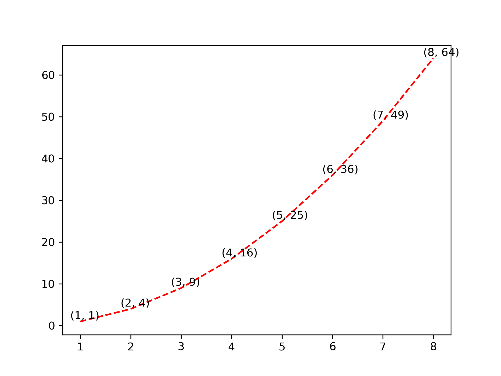
** 子圖表: plt.subplot()
*** 範例[fn:32]
#+BEGIN_SRC python -r -n :results output :exports both
import numpy as np
import matplotlib.pyplot as plt

from matplotlib.ticker import NullFormatter  # useful for `logit` scale

# Fixing random state for reproducibility
np.random.seed(19680801)

# make up some data in the interval ]0, 1[
y = np.random.normal(loc=0.5, scale=0.4, size=1000)
y = y[(y > 0) & (y < 1)]
y.sort()
x = np.arange(len(y))

# plot with various axes scales
plt.figure()

# linear
plt.subplot(221)
plt.plot(x, y)
plt.yscale('linear')
plt.title('linear')
plt.grid(True)

# log
plt.subplot(222)
plt.plot(x, y)
plt.yscale('log')
plt.title('log')
plt.grid(True)

# symmetric log
plt.subplot(223)
plt.plot(x, y - y.mean())
plt.yscale('symlog', linthreshy=0.01)
plt.title('symlog')
plt.grid(True)

# logit
plt.subplot(224)
plt.plot(x, y)
plt.yscale('logit')
plt.title('logit')
plt.grid(True)
# Format the minor tick labels of the y-axis into empty strings with
# `NullFormatter`, to avoid cumbering the axis with too many labels.
plt.gca().yaxis.set_minor_formatter(NullFormatter())
# Adjust the subplot layout, because the logit one may take more space
# than usual, due to y-tick labels like "1 - 10^{-3}"
plt.subplots_adjust(top=0.92, bottom=0.08, left=0.10, right=0.95, hspace=0.25, wspace=0.35)

plt.savefig('simpleSubplot.png', dpi = 300)
#+END_SRC

#+RESULTS:
#+CAPTION: 簡單的子圖表
#+LABEL: fig:SimpleSubplot
#+name: fig:SimpleSubplot
#+ATTR_LATEX: :width 400
#+ATTR_HTML: :width 400
#+ATTR_ORG: :width 400
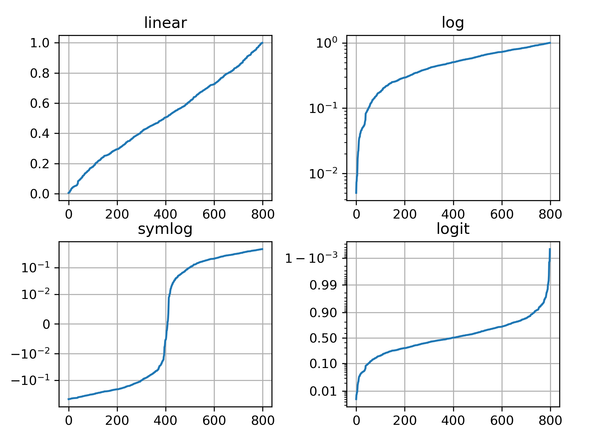

*** 進階設定
- [[https://matplotlib.org/api/_as_gen/matplotlib.pyplot.subplot.html][官網]]
- [[https://ithelp.ithome.com.tw/articles/10201670][視覺化資料 - Matplotlib - legend、subplot、GridSpec、annotate]]
- [[https://www.delftstack.com/zh-tw/howto/matplotlib/how-to-make-different-subplot-sizes-in-matplotlib/][Matplotlib 中如何建立不同大小的子圖 subplot]]
** 實作練習
*** 輸入 a, b, c，畫出曲線圖：y=$ax^2+bx+c$
*** 將前一章的練習題所產生 30*5 的二維隨機陣列，將五科科目的平均製成長條圖，此五科科目設定為:國文、英文、數學、理化、史地。
*** 找出國文與英文兩科成績，畫出兩科成績的散佈圖(Scatter)，觀察學生在這兩科的得分是否有正相關。

*** 參考解答
**** #1
#+BEGIN_COMMENT
#+begin_src python -r -n :results output :exports both
import matplotlib.pyplot as plt
import numpy as np

x = np.arange(-10, 10, 0.5)
plt.clf()

a = 2
b = -3
c = -1

y = a*x**2 + b*x + c

plt.plot(x, y, 'bp:')
plt.xlabel('x')
plt.ylabel('y')

plt.grid(True)
#plt.show()   # for jupyter
plt.savefig('images/eqcurve.png', dpi=300)

#+end_src
#+END_COMMENT

#+RESULTS:
#+CAPTION: 方程式曲線圖
#+LABEL: fig:SimpleSubplot
#+name: fig:SimpleSubplot
#+ATTR_LATEX: :width 400
#+ATTR_HTML: :width 400
#+ATTR_ORG: :width 400
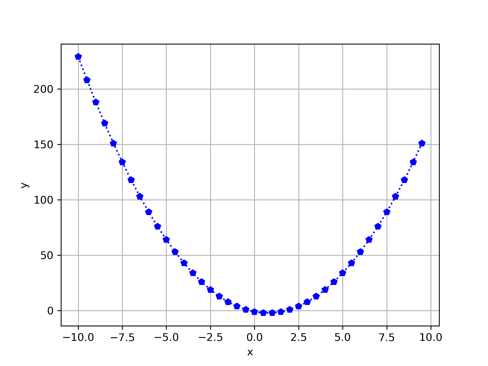
**** #2
#+BEGIN_COMMENT
#+begin_src python -r -n :results output :exports both
import matplotlib.pyplot as plt
import numpy as np
import math

#1
sc1 = np.random.randint(0, 100, size=[1, 150])
#2
sc2 = sc1.reshape(30, 5)
#3
sctitle = ['國文', '英文', '數學', '理化', '史地']
y_pos = np.arange(len(sctitle))
colors = ['b', 'g', 'r', 'c', 'm']
scavg = sum(sc2)/30

plt.rcParams['font.sans-serif'] = ['SimHei']
plt.rcParams['axes.unicode_minus'] = False

plt.barh(y_pos, scavg, color = colors, alpha=0.5)
plt.yticks(y_pos, sctitle)
plt.xlabel('分數')

plt.savefig('images/scobars.png')
#+end_src
#+END_COMMENT

#+RESULTS:
#+CAPTION: 分數長條圖
#+LABEL: fig:SimpleSubplot
#+name: fig:SimpleSubplot
#+ATTR_LATEX: :width 400
#+ATTR_HTML: :width 400
#+ATTR_ORG: :width 400
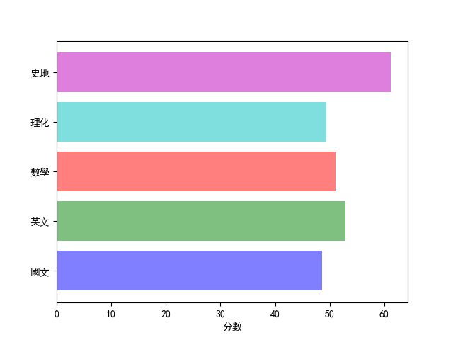
**** #3
#+BEGIN_COMMENT
#+begin_src python -r -n :results output :exports both
import matplotlib.pyplot as plt
import numpy as np
import math

#1
st = np.arange(1, 31, 1)

sc1 = np.random.randint(0, 100, size=[1, 150])
#2
sc2 = sc1.reshape(30, 5)
#3
st1 = sc2[:,0]
st2 = sc2[:,1]
print(st1)

plt.rcParams['font.sans-serif'] = ['SimHei']
plt.rcParams['axes.unicode_minus'] = False

plt.xlabel('國文')
plt.ylabel('英文')

plt.scatter(st1, st2, s=st ,label=st,  alpha=0.5)
plt.savefig('images/scosct.png')

#+end_src
#+END_COMMENT

#+RESULTS:
#+CAPTION: 兩科成績的關係圖
#+LABEL: fig:SimpleSubplot
#+name: fig:SimpleSubplot
#+ATTR_LATEX: :width 400
#+ATTR_HTML: :width 400
#+ATTR_ORG: :width 400
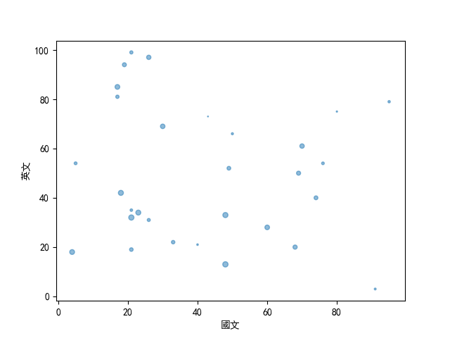
#+latex:\newpage

* Pandas
** Excel/CSV: Pandas 模組
*** CSV
- 為純文字檔，以逗號分隔值（Comma-Separated Values，CSV，有時也稱為字元分隔值，因為分隔字元也可以不是逗號）。
- 純文字意味著該檔案是一個字元序列，不含必須像二進位制數字那樣被解讀的資料。
- CSV 檔案由任意數目的記錄組成，記錄間以某種換行符分隔；每條記錄由欄位組成，欄位間的分隔符是其它字元或字串，最常見的是逗號。
*** Pandas
- Pandas 為建構於 NumPy 之上的套件，為 python 的一個數據分析模組，適合處理表格資料或
  異質資料。
- 於 2009 年底開源出來，提供高效能、簡易使用的
  資料格式(Data Frame，為 R 語言主要資料格式)，可以讓使用者可以快速操作及分析資料。
- Pandas 強化了資料處理的方便性也能與處理網頁資料與資料庫資料等，有點類似於
  Office 的 Excel，能更加方便的進行運算、分析等[fn:33]。
- Pandas 主要特色有[fn:23]：
  1. 在異質數據的讀取、轉換和處理上，都讓分析人員更容易處理，例如：從列欄試算表中找到想要的值。
  1. Pandas 提供兩種主要的資料結構，Series 與 DataFrame。Series 顧名思義就是用來處理時間序列相關的資料(如感測器資料等)，主要為建立索引的一維陣列。DataFrame 則是用來處理結構化(Table like)的資料，有列索引與欄標籤的二維資料集，例如關聯式資料庫、CSV 等等。
  1. 透過載入至 Pandas 的資料結構物件後，可以透過結構化物件所提供的方法，來快速地進行資料的前處理，如資料補值，空值去除或取代等。
  1. 更多的輸入來源及輸出整合性，例如：可以從資料庫讀取資料進入 Dataframe，也可將處理完的資料存回資料庫。
** Pandas 資料結構
Pandas 兩類資料結構[fn:1]：[fn:34]
1. Series: 用來處理時間序列相關的資料(如感測器資料等)，主要為建立索引的一維陣列。
1. DataFrame: 是一個二維標籤資料結構，可以具有不同類型的行（column），類似 Excel
   的資料表，對於有使用過統計軟體的分析人員應該不陌生。簡單來說，Series 可以想像
   為一行多列（row）的資料，而 DataFrame 是多行多列的資料，藉由選擇索引（列標籤）
   和行（行標籤）的參數來操作資料，就像使用統計軟體透過樣本編號或變項名稱來操作
   資料。
** Series
*** 建立: 資料類型可為 array, dictionary
- 由 array 建立 Series
#+begin_src python -r -n :results output :exports both
import pandas as pd

cars = ["SAAB", "Audi", "BMW", "BENZ", "Toyota", "Nissan", "Lexus"]
print("資料型別:", type(cars))
carsToSeries = pd.Series(cars)
print("資料型別:", type(carsToSeries))
print(carsToSeries.shape)
print(carsToSeries)
print("carsToSeries[1]: ", carsToSeries[1])
#+end_src

#+RESULTS:
#+begin_example
資料型別: <class 'list'>
資料型別: <class 'pandas.core.series.Series'>
(7,)
0      SAAB
1      Audi
2       BMW
3      BENZ
4    Toyota
5    Nissan
6     Lexus
dtype: object
Audi
#+end_example

*** 資料篩選
- 選擇
#+begin_src python -r -n :results output :exports both
import pandas as pd

dict = {
    "city": "Kaohsiung",
    "speedCamera1": "13213",
    "speedCamera2": "3242",
    "speedCamera3": "134343",
    "speedCamera4": "4312",
    "speedCamera5": "533"
}

dictToSeries = pd.Series(dict, index = dict.keys()) # 排序與原 dict 相同
print(dictToSeries[0])
print("=====")
print(dictToSeries['speedCamera1'])
print("=====")
print(dictToSeries[[0, 2, 4]])
print("=====")
print(dictToSeries[['city', 'speedCamera1', 'speedCamera3']])
print("=====")
print(dictToSeries[:2])
print("=====")
print(dictToSeries[4:])
#+end_src

#+RESULTS:
#+begin_example
Kaohsiung
=====
13213
=====
city            Kaohsiung
speedCamera2         3242
speedCamera4         4312
dtype: object
=====
city            Kaohsiung
speedCamera1        13213
speedCamera3       134343
dtype: object
=====
city            Kaohsiung
speedCamera1        13213
dtype: object
=====
speedCamera4    4312
speedCamera5     533
dtype: object
#+end_example
** DataFrame
*** DataFrame 建立
可利用 Dictionary 或是 Array 來建立，並使用 DataFrame 的方法來操作資料查看、資料篩選、資料切片、資料排序等運算。
*** 由 Dictionary 建立
#+begin_src python -r -n :results output :exports both
import pandas as pd

hobby = ["Movies", "Sports", "Coding", "Fishing", "Dancing", "cooking"]
count = [46, 8, 12, 12, 6, 58]

dict = {"hobby": hobby,
        "count": count
       }
print(dict)
df = pd.DataFrame(dict)
print(df)
#+end_src

#+RESULTS:
: {'hobby': ['Movies', 'Sports', 'Coding', 'Fishing', 'Dancing', 'cooking'], 'count': [46, 8, 12, 12, 6, 58]}
:      hobby  count
: 0   Movies     46
: 1   Sports      8
: 2   Coding     12
: 3  Fishing     12
: 4  Dancing      6
: 5  cooking     58

*** 由 Array 建立
#+begin_src python -r -n :results output :exports both
import pandas as pd

ary = [["Movies", 46],["Sports", 8], ["Coding", 12], ["Fishing",12], ["Dancing",6], ["cooking",8]]
print(ary)
ary2df = pd.DataFrame(ary, columns = ["hobby", "count"]) # 指定欄標籤名稱
print(ary2df)

#+end_src

#+RESULTS:
: [['Movies', 46], ['Sports', 8], ['Coding', 12], ['Fishing', 12], ['Dancing', 6], ['cooking', 8]]
:      hobby  count
: 0   Movies     46
: 1   Sports      8
: 2   Coding     12
: 3  Fishing     12
: 4  Dancing      6
: 5  cooking      8

*** 讀入已存在的資料檔來建立 Dataframe
- 可以從異質資料來源讀取檔案(如 CSV 檔)內容，並將資料放入 DataFrame 中，進行資料查看、資料篩選、資料切片等運算。
- 如果資料檔和程式放在同一目錄(資料夾)
- 如果資料檔放在本機在其他地方
  + 絕對路徑
  + 相對路徑
- [[file:./scores.csv][下載範例檔:scores.csv]]
#+BEGIN_SRC python -r -n :results output :exports both
import pandas as pd

# 讀取csv
df = pd.read_csv("scores.csv")
print("===全部資料===")
print(df)

#+END_SRC

#+RESULTS:
#+begin_example
===全部資料===
            id  classparti  typing  homework  midexam  finalexam
0    201910901         100      72     92.11     48.0       16.0
1    201910902          96      56     93.42     60.0       40.0
2    201910903          96      76    102.63     45.0       28.0
3    201910904          93      64     86.84     44.0       25.0
4    201910905          93      56     42.11      0.0       20.0
..         ...         ...     ...       ...      ...        ...
207  201911726         106      80    102.63     96.5      103.0
208  201911727          82      60    102.63     84.0      100.0
209  201911728          83      48    102.63     83.0       75.0
210  201911729          87      84    105.26    112.3      103.0
211  201911730          96      72    102.63     91.0      100.0

[212 rows x 6 columns]
#+end_example
** DataFrame 的資料瀏覽
*** 碁本函數
- shape
- describe()
- head()
- tail()
- columns
- index
- info()
#+begin_src python -r -n :results output :exports both
import pandas as pd

hobby = ["Movies", "Sports", "Coding", "Fishing", "Dancing", "cooking"]
count = [46, 8, 12, 12, 6, 58]

dict = {"hobby": hobby,
        "count": count
       }

df = pd.DataFrame(dict)
print(df)
print("====")
print(df.shape) # 回傳列數與欄數
print("---")
print(df.describe()) # 回傳描述性統計
print("---")
print(df.head(3)) # 回傳前三筆觀測值
print("---")
print(df.tail(3)) # 回傳後三筆觀測值
print("---")
print(df.columns) # 回傳欄位名稱
print("---")
print(df.index) # 回傳 index
print("---")
print(df.info) # 回傳資料內容
#+end_src

#+RESULTS:
#+begin_example
     hobby  count
0   Movies     46
1   Sports      8
2   Coding     12
3  Fishing     12
4  Dancing      6
5  cooking     58
====
(6, 2)
---
           count
count   6.000000
mean   23.666667
std    22.393451
min     6.000000
25%     9.000000
50%    12.000000
75%    37.500000
max    58.000000
---
    hobby  count
0  Movies     46
1  Sports      8
2  Coding     12
---
     hobby  count
3  Fishing     12
4  Dancing      6
5  cooking     58
---
Index(['hobby', 'count'], dtype='object')
---
RangeIndex(start=0, stop=6, step=1)
---
<bound method DataFrame.info of      hobby  count
0   Movies     46
1   Sports      8
2   Coding     12
3  Fishing     12
4  Dancing      6
5  cooking     58>
#+end_example

*** DataFrame 資料排序
- sort\under{}index(): The axis along which to sort. The value 0 identifies the rows, and 1 identifies the columns.
- sort\under{}values()
- sort 後的結果為複本，不改變原本的資料
#+begin_src python -r -n :results output :exports both
import pandas as pd

hobby = ["Movies", "Sports", "Coding", "Fishing", "Dancing", "cooking"]
count = [46, 8, 12, 12, 6, 58]

dict = {"hobby": hobby,
        "count": count
       }

df = pd.DataFrame(dict)
print("===Original")
print(df)
print("===.sort_index()")
print(df.sort_index(axis = 1, ascending = True))
print("===.sort_index()")
print(df.sort_index(axis = 0, ascending = False))
print("===.sort_values()")
print(df.sort_values(by = 'count'))
#+end_src

#+RESULTS:
#+begin_example
===Original
     hobby  count
0   Movies     46
1   Sports      8
2   Coding     12
3  Fishing     12
4  Dancing      6
5  cooking     58
===.sort_index()
   count    hobby
0     46   Movies
1      8   Sports
2     12   Coding
3     12  Fishing
4      6  Dancing
5     58  cooking
===.sort_index()
     hobby  count
5  cooking     58
4  Dancing      6
3  Fishing     12
2   Coding     12
1   Sports      8
0   Movies     46
===.sort_values()
     hobby  count
4  Dancing      6
1   Sports      8
2   Coding     12
3  Fishing     12
0   Movies     46
5  cooking     58
#+end_example

*** DataFrame 處理遺漏值
- dropna()
- fillna()
- isnull()
- notnull()
- 下載file:scores-null.csv
#+begin_src python -r -n :results output :exports both
import pandas as pd

df = pd.read_csv('scores-null.csv')
print(df)
# 刪除有遺失值的記錄
dropValue = df.dropna()
print(dropValue)
fill0 = df.fillna(0)
print(fill0)
fillv = df.fillna({"classparti":999, "typing":0, "finalExam":"NULL"})
print(fillv)
#+end_src

#+RESULTS:
#+begin_example
          id  classparti  typing  homework  finalExam
0  201910901       100.0    72.0     92.11       48.0
1  201910902        96.0    56.0     93.42       60.0
2  201910903        96.0    76.0    102.63        NaN
3  201910904         NaN    64.0     86.84       44.0
4  201910905        93.0    56.0     42.11        0.0
5  201910906       101.0   108.0    100.00        NaN
6  201910907       101.0     NaN     92.11       55.0
7  201910908        94.0    68.0    105.26       61.0
8  201910909         NaN    64.0     44.74       20.0
9  201910910        93.0   120.0     97.37       16.0
          id  classparti  typing  homework  finalExam
0  201910901       100.0    72.0     92.11       48.0
1  201910902        96.0    56.0     93.42       60.0
4  201910905        93.0    56.0     42.11        0.0
7  201910908        94.0    68.0    105.26       61.0
9  201910910        93.0   120.0     97.37       16.0
          id  classparti  typing  homework  finalExam
0  201910901       100.0    72.0     92.11       48.0
1  201910902        96.0    56.0     93.42       60.0
2  201910903        96.0    76.0    102.63        0.0
3  201910904         0.0    64.0     86.84       44.0
4  201910905        93.0    56.0     42.11        0.0
5  201910906       101.0   108.0    100.00        0.0
6  201910907       101.0     0.0     92.11       55.0
7  201910908        94.0    68.0    105.26       61.0
8  201910909         0.0    64.0     44.74       20.0
9  201910910        93.0   120.0     97.37       16.0
          id  classparti  typing  homework finalExam
0  201910901       100.0    72.0     92.11        48
1  201910902        96.0    56.0     93.42        60
2  201910903        96.0    76.0    102.63      NULL
3  201910904       999.0    64.0     86.84        44
4  201910905        93.0    56.0     42.11         0
5  201910906       101.0   108.0    100.00      NULL
6  201910907       101.0     0.0     92.11        55
7  201910908        94.0    68.0    105.26        61
8  201910909       999.0    64.0     44.74        20
9  201910910        93.0   120.0     97.37        16
#+end_example
** Dataframe 的選取與過濾

*** 資料選取: Select column(s) [fn:35]
- src_python[:exports code]{ df[['col1', 'col2']] }
- src_python[:exports code]{ df.col1 }
#+BEGIN_SRC python -r -n :results output :exports both
import pandas as pd

df = pd.read_csv("scores.csv")
print(df.head(3))
print(df[['id', 'typing']].head(3))
print(df.id, df.homework)
#+END_SRC

#+RESULTS:
#+begin_example
          id  classparti  typing  homework  midexam  finalexam
0  201910901         100      72     92.11     48.0       16.0
1  201910902          96      56     93.42     60.0       40.0
2  201910903          96      76    102.63     45.0       28.0
          id  typing
0  201910901      72
1  201910902      56
2  201910903      76
0      201910901
1      201910902
2      201910903
3      201910904
4      201910905
         ...
207    201911726
208    201911727
209    201911728
210    201911729
211    201911730
Name: id, Length: 212, dtype: int64 0       92.11
1       93.42
2      102.63
3       86.84
4       42.11
        ...
207    102.63
208    102.63
209    102.63
210    105.26
211    102.63
Name: homework, Length: 212, dtype: float64
#+end_example

*** 資料選取: Select using index (row)
- src_python[:exports code]{ df[1:20] }
#+BEGIN_SRC python -r -n :results output :exports both
import pandas as pd

df = pd.read_csv("scores.csv")

print(df[1:3])
print(df[df.homework<30])
# 合併row and column
print(df.id[df.homework<30])
print(df[['id', 'homework']][1:3])
#+END_SRC

#+RESULTS:
#+begin_example
          id  classparti  typing  homework  midexam  finalexam
1  201910902          96      56     93.42     60.0       40.0
2  201910903          96      76    102.63     45.0       28.0
            id  classparti  typing  homework  midexam  finalexam
10   201910911          62      44     20.39      4.0        0.0
18   201910919          14      56     25.92      0.0        0.0
23   201910924          75      48     10.75      0.0        0.0
124  201911315          71     120     15.35      0.0        0.0
140  201911331          93     120     25.88      0.0       16.0
10     201910911
18     201910919
23     201910924
124    201911315
140    201911331
Name: id, dtype: int64
          id  homework
1  201910902     93.42
2  201910903    102.63
#+end_example

*** 條件式選取資料
**** 語法
- src_python[:exports code]{ df[(condition)] }
- src_python[:exports code]{ df[(condition 1) & (condition 2) ] }
**** 範例
#+BEGIN_SRC python -r -n :results output :exports both
import pandas as pd

df = pd.read_csv("scores.csv")

print(df[(df.midexam >= 100) & (df.finalexam >= 100)])
#+END_SRC

#+RESULTS:
#+begin_example
            id  classparti  typing  homework  midexam  finalexam
11   201910912          87      92     92.11    110.8     103.75
70   201911034         104      92    102.63    100.8     101.00
88   201911115         120      88    105.26    113.5     111.00
98   201911125         119      80    107.89    113.2     115.00
102  201911129         106      52    102.63    103.6     100.00
127  201911318         108      80    102.63    104.8     100.00
138  201911329         105      48    107.89    100.0     100.00
143  201911334         100     120     81.58    104.8     113.00
153  201911608          88       0    102.63    100.0     100.00
169  201911624          82     100    102.63    101.5     105.00
182  201911701         103     108     92.63    100.0     100.00
189  201911708         106     108    102.63    107.2     101.00
190  201911709         108      88    107.89    104.8     105.00
191  201911710         102     100    102.63    100.0     105.00
193  201911712         105      96    101.58    107.5     100.00
195  201911714         102      44    107.89    110.0     110.00
196  201911715         106     120    107.89    102.4     105.00
198  201911717          80     120    107.89    106.0     100.00
201  201911721         109      76    100.00    100.0     100.00
203  201911722         105     120    102.63    101.5     105.00
210  201911729          87      84    105.26    112.3     103.00
#+end_example
** Dataframe 進階條件過濾
*** loc, iloc, between [fn:36]
- loc: 基於行標籤和列標籤（x\under{}label、y\under{}label）進行索引，以 column 名做為 index
- iloc: 基於行索引和列索引（index，columns） 都是從 0 開始，以數字做為 index
- between: 檢查區間值, src_python[:exports code]{ Series.between(self, left, right, inclusive=True) }
**** 範例 1
#+BEGIN_SRC python -r -n :results output :exports both
import pandas as pd

df = pd.read_csv("scores.csv")
print(df.head(3))
print("========")
print(df.loc[df.homework<25, ['id', 'homework']])
print("========")
print(df.loc[2,'homework'])
#+END_SRC

#+RESULTS:
#+begin_example
          id  classparti  typing  homework  midexam  finalexam
0  201910901         100      72     92.11     48.0       16.0
1  201910902          96      56     93.42     60.0       40.0
2  201910903          96      76    102.63     45.0       28.0
========
            id  homework
10   201910911     20.39
23   201910924     10.75
124  201911315     15.35
========
102.63
#+end_example
**** 範例 2
#+BEGIN_SRC python -r -n :results output :exports both
# 載入函式庫
import pandas as pd

print("Pandas version:", pd.__version__)
# 讀取csv
df = pd.read_csv("scores.csv")
# 輸出前3筆
print(df.iloc[:3])
# 輸出前3筆的第2,3欄
print(df.iloc[:2, 1:3])

print(df['midexam'].between(50, 60))
midFilter = df['midexam'].between(50, 55)
print(df[midFilter])
#+END_SRC

#+RESULTS:
#+begin_example
Pandas version: 0.25.1
          id  classparti  typing  homework  midexam  finalexam
0  201910901         100      72     92.11     48.0       16.0
1  201910902          96      56     93.42     60.0       40.0
2  201910903          96      76    102.63     45.0       28.0
   classparti  typing
0         100      72
1          96      56
102.63
0      False
1       True
2      False
3      False
4      False
       ...
207    False
208    False
209    False
210    False
211    False
Name: midexam, Length: 212, dtype: bool
            id  classparti  typing  homework  midexam  finalexam
6    201910907         101     120     92.11     55.0       20.0
65   201911029          93      60     82.00     50.0       16.0
72   201911036          88      80    102.63     53.0       76.0
92   201911119          82     104     89.47     50.0       20.0
94   201911121          95     100     88.51     52.0       72.0
109  201911136          91     100     81.58     51.0        4.0
171  201911626          98      72     97.37     50.0       75.0
#+end_example
** 進階分析
*** 由其他 column 產生新的 column
- 全部指定
- 條件指定
*** 資料分組: groupby
*** 範例
#+BEGIN_SRC python -r -n :results output :exports both
# 載入函式庫
import pandas as pd

# 讀取csv
df = pd.read_csv("scores.csv")
print(df.head(3))
# 計算總分'
df['Final'] = df.classparti*.1 + df.typing*.1 + df.homework*.2 + df.midexam*.3 + df.finalexam*.3

# PASS/FAIL
df.loc[df.Final < 60, 'PASS'] = False
df.loc[df.Final >= 60, 'PASS'] = True

# create new column according to typing speed
df.loc[df.typing < 30, 'TypingSpeed' ] = 'LOW'
df.loc[df.typing.between(30, 60), 'TypingSpeed' ] = 'MID'
df.loc[df.typing > 60, 'TypingSpeed' ] = 'HIGH'

print(df.head(3))

# 依打字速度分組
print(df.groupby('TypingSpeed')['Final'].mean())
print(df.groupby('PASS')['typing' ,'homework'].mean())

#+END_SRC

#+RESULTS:
#+begin_example
          id  classparti  typing  homework  midexam  finalexam
0  201910901         100      72     92.11     48.0       16.0
1  201910902          96      56     93.42     60.0       40.0
2  201910903          96      76    102.63     45.0       28.0
          id  classparti  typing  ...   Final   PASS  TypingSpeed
0  201910901         100      72  ...  54.822  False         HIGH
1  201910902          96      56  ...  63.884   True          MID
2  201910903          96      76  ...  59.626  False         HIGH

[3 rows x 9 columns]
TypingSpeed
HIGH    69.977451
LOW     68.517333
MID     64.086303
Name: Final, dtype: float64
          typing   homework
PASS
False  77.567568  76.409054
True   84.525547  96.350730
#+end_example

*** 資料檔下載: [[file:scores.csv]]
** 資料視覺化
*** Bar chart
#+BEGIN_SRC python -r -n :results output :exports both
# 載入函式庫
import pandas as pd

# 讀取csv
df = pd.read_csv("scores.csv")

# 計算總分'
df['Final'] = df.classparti*.1 + df.typing*.1 + df.homework*.2 + df.midexam*.3 + df.finalexam*.3

# create new column according to typing speed
df.loc[df.typing < 30, 'TypingSpeed' ] = 'Level-1'
df.loc[df.typing.between(30, 60), 'TypingSpeed' ] = 'Level-2'
df.loc[df.typing > 60, 'TypingSpeed' ] = 'Level-3'

x = df.groupby('TypingSpeed')['homework','classparti'].mean()
print(x)

fig = df.groupby('TypingSpeed')['homework','classparti'].mean().plot(kind='bar', title="XXX", rot=0, legend=True)
fig.set_xlabel("Typing Speed")
fig.set_ylabel("score")
savefig = fig.get\under{}figure()
savefig.savefig('images/pandasPlot1.png', bbox_inches='tight')
#+END_SRC

#+RESULTS:
:               homework  classparti
: TypingSpeed
: Level-1      96.053333   87.666667
: Level-2      85.273939   88.696970
: Level-3      90.053920   93.159091
#+CAPTION: Pandas plot bar chart
#+LABEL: fig:PandasPlot-1
#+name: fig:PandasPlot-1
#+ATTR_LATEX: :width 300
#+ATTR_HTML: :width 400
#+ATTR_ORG: :width 500
[[file:images/pandasPlot1.png]]

*** Pie chart
**** DEMO
#+BEGIN_SRC python -r -n :results output :exports both :wrap
# 載入函式庫
import pandas as pd

# 讀取csv
df = pd.read_csv("scores.csv")

# 計算總分'
df['Final'] = df.classparti*.1 + df.typing*.1 + df.homework*.2 + df.midexam*.3 + df.finalexam*.3

# create new column according to typing speed
df.loc[df.typing < 60, 'TypingSpeed' ] = 'Level-1'
df.loc[df.typing.between(60, 80), 'TypingSpeed' ] = 'Level-2'
df.loc[df.typing > 80, 'TypingSpeed' ] = 'Level-3'
print(df.groupby('TypingSpeed').count())

fig = df.groupby('TypingSpeed')['TypingSpeed'].count().plot(kind='pie', title="XXX", rot=0, legend=True)
savefig = fig.get\under{}figure()
savefig.savefig('images/pandasPlot2.png', bbox_inches='tight')
#+END_SRC

#+RESULTS:
#+begin_results
              id  classparti  typing  homework  midexam  finalexam  Final
TypingSpeed
Level-1       25          25      25        25       25         25     25
Level-2       86          86      86        86       86         86     86
Level-3      101         101     101       101      100        101    100
#+end_results

#+CAPTION: Pandas plot pie chart
#+LABEL: fig:PandasPlot-2
#+name: fig:PandasPlot-2
#+ATTR_LATEX: :width 400
#+ATTR_HTML: :width 300
#+ATTR_ORG: :width 400
[[file:images/pandasPlot2.png]]

**** 如何避免圖例擋住圖表
- [[https://stackoverflow.com/questions/4700614/how-to-put-the-legend-out-of-the-plot][How to put the legend out of the plot]]

*** Scatter chart
#+BEGIN_SRC python -r -n :results output :exports both
# 載入函式庫
import pandas as pd

# 讀取csv
df = pd.read_csv("scores.csv")
  fig = df[['midexam','finalexam']].plot(kind='scatter', x=1, y=0)

  savefig = fig.get\under{}figure()
savefig.savefig('images/PandasPlot3.png')
#+END_SRC

#+RESULTS:
#+CAPTION: Pandas plot scatter chart
#+LABEL: fig:PandasPlot-3
#+name: fig:PandasPlot-3
#+ATTR_LATEX: :width 400
#+ATTR_HTML: :width 400
#+ATTR_ORG: :width 400
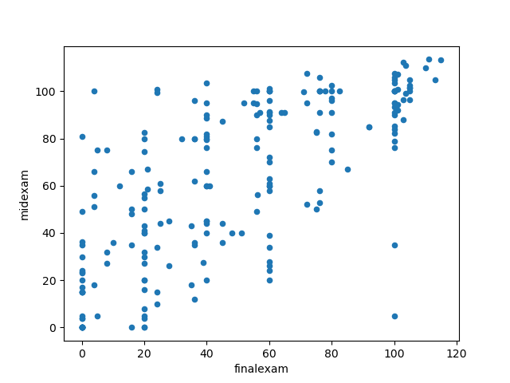

*** Haxbin chart
#+Begin_SRC python -r -n :results output :exports both
# 載入函式庫
import pandas as pd

# 讀取csv
df = pd.read_csv("scores.csv")
fig = df[['midexam','finalexam']].plot(kind='hexbin', x=1, y=0, gridsize=25)

savefig = fig.get\under{}figure()
savefig.savefig('images/PandasPlot6.png')
#+END_SRC

#+RESULTS:
#+CAPTION: Pandas plot hexbin chart
#+LABEL: fig:PandasPlot-3
#+name: fig:PandasPlot-3
#+ATTR_LATEX: :width 400
#+ATTR_HTML: :width 400
#+ATTR_ORG: :width 400
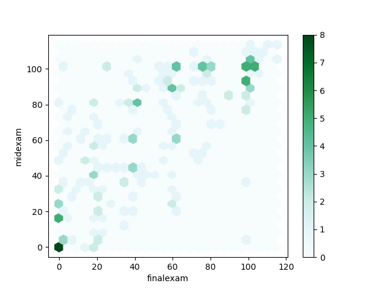

*** Regression line chart
#+BEGIN_SRC python -r -n :results output :exports both
# 載入函式庫
import pandas as pd
import seaborn as sns

# 讀取csv
df = pd.read_csv("scores.csv")

fig = sns.regplot(x="midexam", y='finalexam', data=df);

savefig = fig.get\under{}figure()
savefig.savefig('images/PandasPlot4.png')

#+END_SRC

#+RESULTS:

#+CAPTION: Pandas plot scatter chart
#+LABEL: fig:PandasPlot-4
#+name: fig:PandasPlot-4
#+ATTR_LATEX: :width 400
#+ATTR_HTML: :width 400
#+ATTR_ORG: :width 500
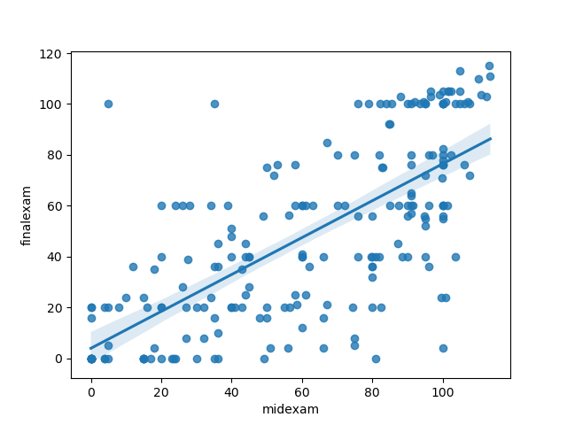
** 實作練習
*** 403 期中考得分統計
- 原始數據
#+CAPTION: CSV 內容
#+LABEL: fig:scoreCSV
#+name: fig:scoreCSV
#+ATTR_LATEX: :width 400
#+ATTR_HTML: :width 400
#+ATTR_ORG: :width 500
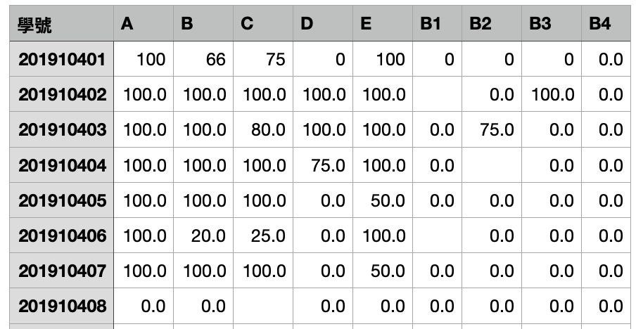
- [[file:cs109score.csv][cs109score.csv]]為 T 市某校的資訊科線上期中考系統所匯出的成績檔，該次考試共計 10 題，
  其中 A~F 為基本題，B1~B4 為加分題，前 5 題(A,B,C,D,E)為基本題，每題 100 分，後 4 題
  為加分題(Bonus1~Bonus4)，每題 25 分，本份考卷總分：600；總得分除以 5 即為期中考得分，此次期中考總分 120 分。
- 任務 1: 將有缺失值的部份以 0 分取代。
- 任務 2: 求出每個人的原始總分(即所有分數)。
- 任務 3: 求出換算得分(即總得分除以 5)。
- 任務 4: 由學號欄提出班級資料， 新增一欄班級欄，班級為學號的第 5~7 碼，如 201910107，
  表示該生為 101 班。
- 任務 5: 求出各題的平均得分，以直條長條圖顯示。
- 任務 6: 以班級為分組依據，畫出各班平均得分，以橫向長條圖顯示。
- 任務 7: 求 119 班各題平均得分，以 pie chart 顯示。
- 任務 8: 求所有受試者第 B 及 B1 兩題的 scatter plot 以及 regression line。
#+begin_src python -r -n :results output :exports both
}import numpy as np
import pandas as pd
import seaborn as sns
import matplotlib.pyplot as plt

origdf = pd.read_csv("cs109score.csv")

plt.rcParams['font.sans-serif'] = ['SimHei'] # 步驟一（替換sans-serif字型）
plt.rcParams['axes.unicode_minus'] = False  # 步驟二（解決座標軸負數的負號顯示問題）

##1
#origdf.fillna(0, inplace=True)
origdf = origdf.fillna(0)
##2
items = ['A', 'B', 'C', 'D', 'E', 'B1', 'B2' ,'B3', 'B4']
origdf['原始總分'] = origdf['A']+origdf['B']+origdf['C']+origdf['D']+origdf['E']+origdf['B1']+origdf['B2']+origdf['B3']+origdf['B4']
##3
origdf['分數'] = origdf['原始總分']/5
##4
origdf['班級'] = origdf['學號'].astype(str).str[4:7]
##5
y_pos = np.arange(len(items))
plt.bar(y_pos, origdf[items].mean(), color = ['b','g','r','c','m','y'], alpha=0.5)
plt.xticks(y_pos, items)
plt.xlabel('試題')
plt.savefig('images/task5.png')
plt.clf()
##6
fig = origdf.groupby('班級')['分數'].mean().plot(kind='barh', color = ['b','g','r','c','m','y'], alpha=0.5)
fig.set_xlabel('score')
fig.set_ylabel('班級', rotation=0)
resfig = fig.get\under{figure()
resfig.savefig('images/task6.png', bbox_inches='tight')
##7
df119 = origdf[(origdf.班級 == '119')]
plt.clf()
#print(df119[items].mean())
plt.pie(df119[items].mean(), labels = items)
plt.savefig('images/task7.png', dpi=300)
##8
import seaborn as sns
plt.clf()
fig = sns.regplot(x="A",  y="B", data=origdf)
                       resfig = fig.get\under{}figure()
resfig.savefig("images/task8.png")
#+end_src

#+RESULTS:
#+CAPTION: task5
#+LABEL: fig:task5
#+name: fig:task5
  #+ATTR_LATEX: :width 400
  #+ATTR_HTML: :width 560
  #+ATTR_ORG: :width 560
  #+RESULTS:
  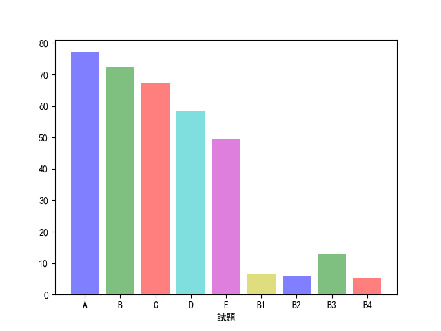
#+CAPTION: task6
#+LABEL: fig:tas6
#+name: fig:task6
  #+ATTR_LATEX: :width 400
  #+ATTR_HTML: :width 560
  #+ATTR_ORG: :width 560
  #+RESULTS:
  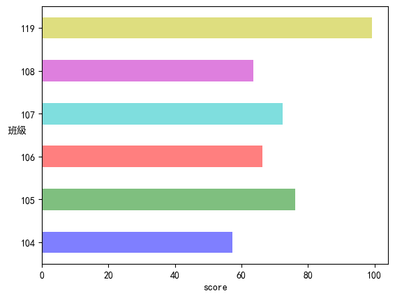
#+CAPTION: task7
#+LABEL: fig:tas7
#+name: fig:task7
  #+ATTR_LATEX: :width 400
  #+ATTR_HTML: :width 560
  #+ATTR_ORG: :width 560
  #+RESULTS:
  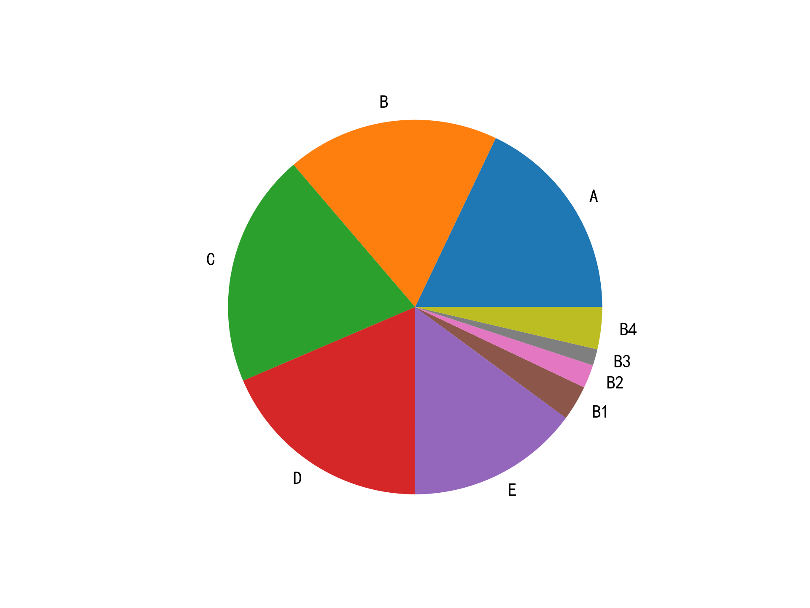
#+CAPTION: task8
#+LABEL: fig:tas
#+name: fig:task
  #+ATTR_LATEX: :width 400
  #+ATTR_HTML: :width 560
  #+ATTR_ORG: :width 560
  #+RESULTS:
  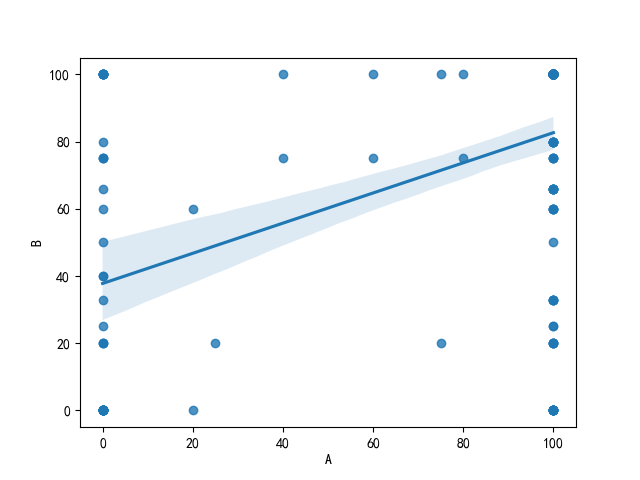

#+latex:\newpage

* 網路資料解析與爬蟲
** 網路資料分析的兩種類型
- 可直接下載的靜態結構化資料，如 CSV、JSON、XML
- 直接分析網站的線上內容(HTML): 爬蟲(Web Crawler)
** JSON
*** What is JSON?
- JSON(JavaScript Object Notation，JavaScript 物件表示法)是個以純文字來描述
  資料的簡單結構，在 JSON 中可以透過特定的格式去儲存任何資料(字串,數字,陣列,物件)，
  也可以透過物件或陣列來傳送較複雜的資料。[fn:37]
- JSON 常用於網站上的資料呈現、傳輸 (例如將資料從伺服器送至用戶端，以利顯示網頁)。
- 一旦建立了 JSON 資料，就可以非常簡單的跟其他程式溝通或交換資料，因為 JSON 就只
  是純文字格式。
*** JSON 的優點
- 相容性高
- 格式容易瞭解，閱讀及修改方便
- 支援許多資料格式 (number,string,booleans,nulls,array,associative array)
- 許多程式都支援函式庫讀取或修改 JSON 資料
- NoSQL Database
*** JSON 結構
- 物件: {}
- 陣列: []
*** JSON 支援的資料格式
- 字串 (string)，要以雙引號括起來: 
  + {"name": "Mike"}
- 數值 (number)
  + {"age": 25}
- 布林值 (boolean)
  + {"pass": True}
- 空值 (null)
  + {"middlename": null}
- 物件 (object)
- 陣列 (array)
*** JSON 物件
- 格式
- key 只能是字串，也一定要加上雙引號
#+begin_src python -r -n :results output :exports both
{
    "key1": value1,
    "key2": value2,
    ......
    "keyN": valueN
}
#+end_src
- 範例 1
#+begin_src python -r -n :results output :exports both
{
    "id": 1,
    "name": "Jamees, Yen",
    "price": 19,
    "gender": "M",
    "hobby": ["music", "programming"]
}
#+end_src
- 範例 2
#+begin_src python -r -n :results output :exports both
{
    "id": 382192
    "name": "Jamees, Yen",
    "price": 19,
    "gender": "M",
    "exams": [
        { "title": "期中考",
          "chinese": 85,
          "math": 98,
          "englihs": 92
        },
        { "title": "期末考",
          "chinese": 81,
          "math": 92,
          "englihs": 97
        }
    ],
    "hobby": ["music", "programming"]
}
#+end_src
*** 實作 1: [[https://data.gov.tw/dataset/31897][國際主要國家貨幣每月匯率概況]]
**** 下載 JSON
#+BEGIN_SRC python -r -n :results output :exports both :eval no
import requests

json_url = 'https://quality.data.gov.tw/dq_download_json.php?nid=11339&md5_url=f2fdbc21603c55b11aead08c84184b8f'
response = requests.get(json_url)

jsonRes = response.json()
print(type(jsonRes))
print(jsonRes[:3])
print('日期', ":", '美元／新台幣')
for item in jsonRes:
    print(item['日期'], ":", item['美元／新台幣'])
#+END_SRC

#+RESULTS:
#+begin_example -r -n 
<class 'list'>
[
{'日期': '2020/2/3',
  '美元／新台幣': '30.332',
  '人民幣／新台幣': '4.321461',
  '歐元／美元': '1.1077',
  '美元／日幣': '108.535',
  '英鎊／美元': '1.3147',
  '澳幣／美元': '0.6695',
  '美元／港幣': '7.7685',
  '美元／人民幣': '7.0189',
  '美元／南非幣': '14.9376',
  '紐幣／美元': '0.64675'},
{'日期': '2020/2/4',
  '美元／新台幣': '30.207',
  '人民幣／新台幣': '4.320537',
  '歐元／美元': '1.1056',
  '美元／日幣': '108.945',
  '英鎊／美元': '1.29605',
  '澳幣／美元': '0.67185',
  '美元／港幣': '7.76895',
  '美元／人民幣': '6.9915',
  '美元／南非幣': '14.8117',
  '紐幣／美元': '0.6466'},
{'日期': '2020/2/5',
 '美元／新台幣': '30.152',
 '人民幣／新台幣': '4.306248',
 '歐元／美元': '1.1044',
 '美元／日幣': '109.345',
 '英鎊／美元': '1.3046',
 '澳幣／美元': '0.6741',
 '美元／港幣': '7.7644',
 '美元／人民幣': '7.0019',
 '美元／南非幣': '14.8205',
 '紐幣／美元': '0.6484'}
]
==============================
日期 : 美元／新台幣
2020/2/3 : 30.332
2020/2/4 : 30.207
2020/2/5 : 30.152
2020/2/6 : 30.082
2020/2/7 : 30.126
2020/2/10 : 30.102
2020/2/11 : 30.068
2020/2/12 : 30.032
2020/2/13 : 30.037
2020/2/14 : 30.051
2020/2/17 : 30.056
2020/2/18 : 30.125
2020/2/19 : 30.152
2020/2/20 : 30.254
2020/2/21 : 30.403
2020/2/24 : 30.472
2020/2/25 : 30.402
2020/2/26 : 30.383
2020/2/27 : 30.33
2020/3/2 : 30.124
2020/3/3 : 30.087
2020/3/4 : 30.038
2020/3/5 : 29.96
2020/3/6 : 30.04
2020/3/9 : 30.13
2020/3/10 : 30.036
2020/3/11 : 30.095
2020/3/12 : 30.15
2020/3/13 : 30.21
2020/3/16 : 30.22
2020/3/17 : 30.25
2020/3/18 : 30.276
2020/3/19 : 30.506
2020/3/20 : 30.302
2020/3/23 : 30.405
2020/3/24 : 30.316
2020/3/25 : 30.325
2020/3/26 : 30.306
#+end_example

**** 資料視覺化
  #+BEGIN_SRC python -r -n :results output :exports both
import requests

json_url = 'https://quality.data.gov.tw/dq_download_json.php?nid=11339&md5_url=f2fdbc21603c55b11aead08c84184b8f'
response = requests.get(json_url)
jsonRes = response.json()

dates = [i['日期'] for i in jsonRes]
NTUS = [float(i['美元／新台幣']) for i in jsonRes]

import matplotlib.pyplot as plt

plt.clf()
plt.plot(dates, NTUS)
plt.xticks(rotation=60, fontsize=6)
plt.savefig('images/jsonLine.png', dpi=300)
  #+END_SRC

  #+RESULTS:

  #+CAPTION: 匯率
  #+LABEL: fig:jsonLine
  #+name: fig:jsonLine
  #+ATTR_LATEX: :width 500
  #+ATTR_HTML: :width 500
  #+ATTR_ORG: :width 500
  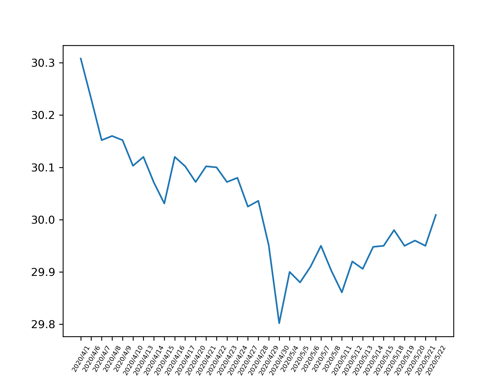
*** 實作 2: [[https://data.gov.tw/dataset/113063][澎湖生活博物館每月參觀人次統計資料]]
   #+BEGIN_SRC python -r -n :results output :exports both
#coding:utf-8
import requests
import pandas as pd
from datetime import datetime

json_url = 'http://opendataap2.penghu.gov.tw/resource/files/2020-01-12/eaa641fc3af66277e60b13201ca11232.json'

response = requests.get(json_url)
jsonRes = response.json()

year = [str(int(i['年度'])+1911) for i in jsonRes]
month = [i['月份'] for i in jsonRes]
visitor = [int(i['人數']) for i in jsonRes]

dates = [x+'/'+y for x, y in zip(year, month)]

from datetime import datetime
#date_object = datetime.strptime(date_str, '%m-%d-%Y').date()

#df['time'] = [pd.to_datetime(i, format='%y%m', errors='ignore') for i in df['date']]
dates = datetime.strptime(dates, '%Y-%m').date()

import matplotlib.pyplot as plt

plt.rcParams['font.family'] = 'cwTeXFangSong'
plt.clf()
plt.bar(dates, visitor)
plt.xticks(rotation=60, fontsize=6)
plt.ylabel('人數')
plt.xlabel('日期')
plt.title('澎湖生活博物館每月參觀人次')
plt.savefig('images/jsonBar.png', dpi=300, bbox_inches='tight')
   #+END_SRC

   #+RESULTS:

   #+CAPTION: 參觀人數
   #+LABEL: fig:jsonBar
   #+name: fig:jsonBar
   #+ATTR_LATEX: :width 400
   #+ATTR_HTML: :width 400
   #+ATTR_ORG: :width 500
    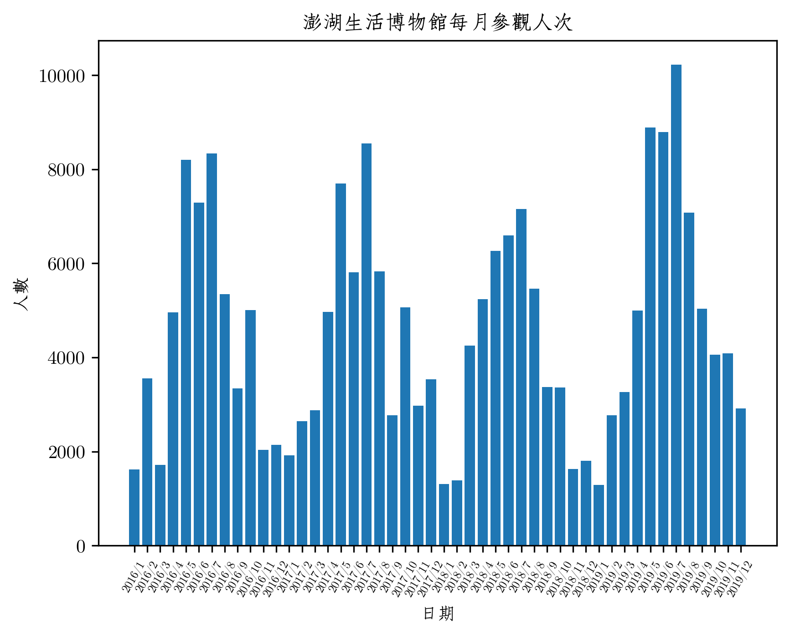
*** 實作 3: 學校甄選公告#1
#+BEGIN_SRC python -r -n :results output :exports both
import requests
import json
json_url = 'http://www.kh.edu.tw/json/bulletin/employ/datagrid?page=1&rows=20'
response = requests.get(json_url)

print(response)
# 方法1
jsonRes1 = response.json()
print("========\n", type(jsonRes1))
# 
jsonRes2 = json.loads(response.text)
print("========\n", type(jsonRes2))

print("========\n", jsonRes2)
#+END_SRC

#+RESULTS:
:
: <Response [200]>
: ========
:  <class 'dict'>
: ========
:  <class 'dict'>
: ========
: {'total'. 20, 'rows': [
: {'author': '楠梓國中',
:  'attributes': {'subjects': '音樂專長-豎笛',
:                 'url': 'https://employ.kh.edu.tw/Html/2020/5/楠梓區 108 學年度楠梓國中第 9 號第 1 次公告簡章.html',
:                 'target': '_blank' },
:  'title': '108 學年度楠梓國中第 9 號第 1 次公告',
:  'pubDate': '109-05-22'},
: {'author': '燕巢國中',
:  'attributes': {'subjects':
:                 '資訊科技科(電腦科)',
:                 'url': 'https://employ.kh.edu.tw/Html/2020/5/燕巢區 108 學年度燕巢國中第 14 號第 10 次公告簡章.html',
:                 'target': '_blank'},
:  'title': '108 學年度燕巢國中第 14 號第 10 次公告',
:  'pubDate': '109-05-22'},
: {'author': '仁武特殊教育學校',
:  'attributes': {'subjects': '學前教育階段不分類巡迴輔導班',
:                 'url':'https://employ.kh.edu.tw/Html/2020/5/仁武區 108 學年度仁武特殊教育學校第 7 號第 5 次公告簡章.html',
:                 'target': '_blank'},
:   'title': '108 學年度仁武特殊教育學校第 7 號第 5 次公告',
:   'pubDate': '109-05-12'},
: {'author': '大社國小',
:  'attributes': {'subjects': '',
:                'url': 'https://employ.kh.edu.tw/Html/2020/5/大社區 108 學年度大社國小第 7 號第 3 次公告簡章.html',
:                'target': '_blank'},
:  'title': '108 學年度大社國小第 7 號第 3 次公告',
:  'pubDate': '109-05-11'},
: {'author': '明誠高中',
:  'attributes': {'subjects': '',
:                 'url': 'https://employ.kh.edu.tw/Html/2020/5/鼓山區 108 學年度明誠高中第 3 號第 3 次公告第 1 次修正簡章.html',
:                 'target':'_blank'},
:  'title': '108 學年度明誠高中第 3 號第 3 次公告第 1 次修正',
:  'pubDate': '109-05-04'},
: {'author': '鼓山高中',
:  'attributes': {'subjects': '',
:                 'url': 'https://employ.kh.edu.tw/Html/2020/5/鼓山區 108 學年度鼓山高中第 11 號第 3 次公告簡章.html',
:                 'target': '_blank'},
:  'title': '108 學年度鼓山高中第 11 號第 3 次公告',
:  'pubDate': '109-05-04'},
: {'author': '南成國小',
:  'attributes': {'subjects': '兼任特教代課教師',
:                 'url': 'https://employ.kh.edu.tw/Html/2020/5/鳳山區 108 學年度南成國小第 3 號第 3 次公告簡章.html',
:                 'target': '_blank'},
:  'title': '108 學年度南成國小第 3 號第 3 次公告',
:  'pubDate': '109-05-01'},
: {'author': '青山國小',
:  'attributes': {'subjects': '',
:                 'url':'https://employ.kh.edu.tw/Html/2020/4/小港區 108 學年度青山國小第 8 號第 1 次公告簡章.html',
:                 'target': '_blank'},
:  'title': '108 學年度青山國小第 8 號第 1 次公告',
:  'pubDate': '109-04-30'},
: {'author': '明宗國小',
:  'attributes': {'subjects':'',
:                 'url': 'https://employ.kh.edu.tw/Html/2020/4/湖內區 108 學年度明宗國小第 5 號第 1 次公告簡章.html',
:                 'target': '_blank'}, 'title': '108 學年度明宗國小第 5 號第 1 次公告',
:                 'pubDate': '109-04-30'},
: {'author': '大社國中',
:  'attributes':{'subjects': '國文',
:                'url': 'https://employ.kh.edu.tw/Html/2020/4/大社區 108 學年度大社國中第 5 號第 3 次公告簡章.html',
:                'target': '_blank'},
:  'title': '108 學年度大社國中第 5 號第 3 次公告',
:  'pubDate': '109-04-29'},
: {'author': '小港國小',
:  'attributes': {'subjects': '健康與體適能科',
:                 'url':'https://employ.kh.edu.tw/Html/2020/4/小港區 108 學年度小港國小第 15 號第 3 次公告簡章.html',
:                 'target': '_blank'},
:  'title': '108 學年度小港國小第 15 號第 3 次公告',
:  'pubDate': '109-04-21'},
: {'author': '小港國小',
:  'attributes': {'subjects':'一般智能資賦優異資源班',
:                 'url': 'https://employ.kh.edu.tw/Html/2020/4/小港區 108 學年度小港國小第 13 號第 2 次公告簡章.html',
:                 'target': '_blank'},
:  'title':'108 學年度小港國小第 13 號第 2 次公告',
:  'pubDate': '109-04-18'}, {'author': '鼓山國小',
:  'attributes': {'subjects': '普通科',
:                 'url':'https://employ.kh.edu.tw/Html/2020/4/旗山區 108 學年度鼓山國小第 6 號第 3 次公告簡章.html',
:                 'target': '_blank'}, 'title': '108 學年度鼓山國小第 6 號第 3 次公告',
:                 'pubDate': '109-04-16'},
: {'author': '新民國小',
:  'attributes': {'subjects':'普通科代理(須代導師)',
:                 'url': 'https://employ.kh.edu.tw/Html/2020/4/左營區 108 學年度新民國小第 9 號第 3 次公告簡章.html',
:                 'target': '_blank'},
:  'title': '108 學年度新民國小第 9 號第 3 次公告',
:  'pubDate': '109-04-14'},
: {'author': '林園高中',
:  'attributes': {'subjects': '表演藝術',
:                 'url':'https://employ.kh.edu.tw/Html/2020/4/林園區 108 學年度林園高中第 18 號第 3 次公告簡章.html',
:                 'target': '_blank'},
:  'title': '108 學年度林園高中第 18 號第 3 次公告',
:  'pubDate': '109-04-14'},
: {'author': '大社國中',
:  'attributes': {'subjects':'集中式特教班代理',
:                 'url': 'https://employ.kh.edu.tw/Html/2020/4/大社區 108 學年度大社國中第 4 號第 3 次公告簡章.html',
:                 'target': '_blank'},
:  'title': '108 學年度大社國中第 4 號第 3 次公告',
:  'pubDate': '109-04-13'},
: {'author': '巴楠花部落中小學',
:  'attributes': {'subjects': '',
:                 'url':'https://employ.kh.edu.tw/Html/2020/4/杉林區 108 學年度巴楠花部落中小學第 13 號第 8 次公告簡章.html',
:                 'target': '_blank'},
:  'title': '108 學年度巴楠花部落中小學第 13 號第 8 次公告',
:  'pubDate': '109-04-13'},
: {'author': '橫山國小',
:  'attributes': {'subjects': '特殊教育（身心障礙類）不分類巡迴輔導班',
:                 'url':'https://employ.kh.edu.tw/Html/2020/4/燕巢區 108 學年度橫山國小第 7 號第 3 次公告簡章.html',
:                 'target': '_blank'},
:  'title': '108 學年度橫山國小第 7 號第 3 次公告',
:  'pubDate': '109-04-10'},
: {'author': '林園高中',
:  'attributes': {'subjects':'',
:                 'url': 'https://employ.kh.edu.tw/Html/2020/4/林園區 108 學年度林園高中第 20 號第 1 次公告簡章.html',
:                 'target': '_blank'},
:  'title': '108 學年度林園高中第 20 號第 1 次公告',
:  'pubDate': '109-04-10'},
: {'author': '鼓山高中',
:  'attributes': {'subjects': '',
:                 'url': 'https://employ.kh.edu.tw/Html/2020/4/鼓山區 108 學年度鼓山高中第 12 號第 1 次公告簡章.html',
:                 'target': '_blank'},
:  'title': '108 學年度鼓山高中第 12 號第 1 次公告',
:  'pubDate': '109-04-09'}
: ]
: }

*** 實作 4: 學校甄選公告
#+BEGIN_SRC python -r -n :eval no
import requests
import json

response = requests.get('http://www.kh.edu.tw/json/bulletin/employ/datagrid?page=1&rows=20')
jsonRes = response.json()
#print(jsonRes['rows'])
for item in jsonRes['rows']:
    print(item['author'], ":", item['title'],"/", item['pubDate'])
#    sortJR = jsonRes['rows']
#    print(type(sortJR))
#
#sortJR.sort(key=lambda x: x['author'], reverse=False)
#for item in sortJR:
#    print(item['author'], ":", item['title'],"/", item['pubDate'])
#+END_SRC

#+RESULTS:
#+begin_example
明誠高中 : 109學年度明誠高中第1號第1次公告 / 109-06-01
八卦國小 : 109學年度八卦國小第1號第1次公告 / 109-06-01
新莊國小 : 109學年度新莊國小第1號第1次公告 / 109-06-01
楠梓國中 : 108學年度楠梓國中第9號第3次公告 / 109-06-02
燕巢國中 : 108學年度燕巢國中第14號第11次公告 / 109-05-29
前鎮國中 : 108學年度前鎮國中第10號第1次公告 / 109-05-25
仁武特殊教育學校 : 108學年度仁武特殊教育學校第7號第5次公告 / 109-05-12
大社國小 : 108學年度大社國小第7號第3次公告 / 109-05-11
明誠高中 : 108學年度明誠高中第3號第3次公告第1次修正 / 109-05-04
鼓山高中 : 108學年度鼓山高中第11號第3次公告 / 109-05-04
南成國小 : 108學年度南成國小第3號第3次公告 / 109-05-01
青山國小 : 108學年度青山國小第8號第1次公告 / 109-04-30
明宗國小 : 108學年度明宗國小第5號第1次公告 / 109-04-30
大社國中 : 108學年度大社國中第5號第3次公告 / 109-04-29
小港國小 : 108學年度小港國小第15號第3次公告 / 109-04-21
小港國小 : 108學年度小港國小第13號第2次公告 / 109-04-18
鼓山國小 : 108學年度鼓山國小第6號第3次公告 / 109-04-16
新民國小 : 108學年度新民國小第9號第3次公告 / 109-04-14
林園高中 : 108學年度林園高中第18號第3次公告 / 109-04-14
大社國中 : 108學年度大社國中第4號第3次公告 / 109-04-13
#+end_example
** 網路爬蟲
*** HTML
**** What is HTML
- [[https://data.gov.tw/datasets/search?qs=tid%3A6410][政府資料開放平台]]
- 超文本標記語言（HyperText Markup Language）是一種用於建立網頁的標準標記語言。HTML 是一種基礎技術，常與 CSS、JavaScript 一起被眾多網站用於設計網頁、網頁應用程式以及行動應用程式的使用者介面。[fn:38]
- HTML 元素是構建網站的基石。HTML 允許嵌入圖像與物件，並且可以用於建立互動式表單，它被用來結構化資訊——例如標題、段落和列表等等，也可用來在一定程度上描述文件的外觀和語意。[fn:38]
- HTML 的語言形式為<>包圍的 HTML 元素（如<html>），瀏覽器使用 HTML 標籤和指
  令碼來詮釋網頁內容，但不會將它們顯示在頁面上。 [fn:38]
- 網頁就是由各式標籤 (tag) 所組成的階層式文件。
**** HTML 範例
- HTML code
#+BEGIN_src html  -r -n :exports results :results html
<html>
  <head>
    <title>我是網頁標題</title>
    
  </head>
  <body>
    <h1 class="large">我是變色且置中的抬頭</h1>
    
我是段落一

    
我是段落二

    
<a href='http://blog.castman.net' style="font-size:200%;">我是放大的超連結</a>

  </body>
</html>
#+END_src
- RESULTS
#+BEGIN_EXPORT html
<html>
  <head>
    <title>我是網頁標題</title>
    
  </head>
  <body>
    <h1 class="large">我是變色且置中的抬頭</h1>
    
我是段落一

    
我是段落二

    
<a href='http://blog.castman.net' style="font-size:200%;">我是放大的超連結</a>

  </body>
</html>
#+END_EXPORT
- HTML tree
#+RESULTS:
#+CAPTION: HTML tree
#+LABEL: fig:HTML-tree
#+name: fig:HTML-tree
#+ATTR_LATEX: :width 400
#+ATTR_HTML: :width 400
#+ATTR_ORG: :width 500
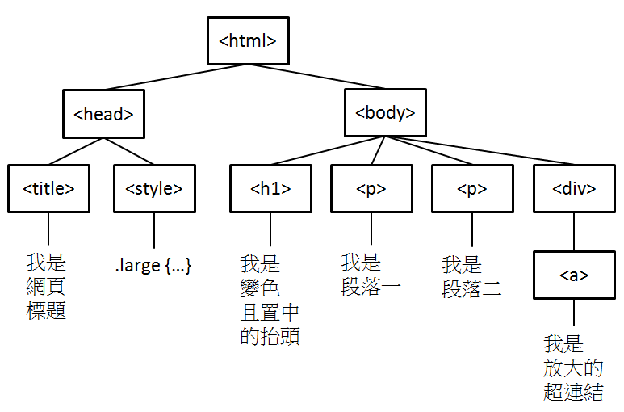
- HTML 文件內不同的標籤 (例如 <title>, <h1>, 
, <a> 
- 不同的標籤有著不同的語義，表示建構網頁用的不同元件，且標籤可以有各種屬性 (例如 id, class, style 等通用屬性, 或 href 等專屬屬性)，
- 因此我們可以用標籤 + 屬性去定位資料所在的區塊並取得資料。[fn:39]
**** 爬蟲精神：將程式模仿成一般 user
***** 原則
1. 要抓網路資料，就要先仔細觀察網頁內容
1. 要儘量欺騙網站自己是 browser
***** 實作範例: 取得 HTML 資料
****** 第一版
#+begin_src python -r -n :eval no
  # 抓取PTT電影版header
  import urllib.request as req
  url = "https://www.ptt.cc/bbs/Stock/index.html"

  with req.urlopen(url) as response:
      data = response.read().decode("utf-8")
  print(data)
#+end_src

#+RESULTS:
#+BEGIN_SRC shell :eval no
urllib.error.HTTPError: HTTP Error 403: Forbidden
#+END_SRC
- 被拒絕原因：這隻程式的行為不像一般使用者，被網站伺服器拒絕。403 Forbidden 是 HTTP 協議中的一個 [[https://zh.wikipedia.org/zh-tw/HTTP%E7%8A%B6%E6%80%81%E7%A0%81][HTTP 狀態碼（Status Code）]]。可以簡單的理解為沒有權限訪問此站，服務器收到請求但拒絕提供服務[fn:40]。
- urllib.request 是一個用來從 URLs (Uniform Resource Locators)取得資料的 Python 模
  組。它提供一個了非常簡單的介面能接受多種不同的協議(protocol, 如 http, ftp)， urlopen 函數。
****** 第二版:加入 headers
#+begin_src python :eval no
import urllib.request as req
url = "https://www.ptt.cc/bbs/Stock/index.html"
# 幫request加上一個header
request = req.Request(url, headers = {
    "User-Agent":"Mozilla/5.0 (Macintosh; Intel Mac OS X 10.14; rv:72.0) Gecko/20100101 Firefox/72.0"
})

with req.urlopen(request) as response:
    data = response.read().decode("utf-8")
print('所取得的資料型態：',type(data))
print(data[700:1200])
#+end_src

#+RESULTS:
#+begin_results
所取得的資料型態： <class 'str'>
api.js'></script></head>
    <body>

	

		<a id="logo" href="/bbs/">批踢踢實業坊</a>
		&rsaquo;
		<a class="board" href="/bbs/Stock/index.html">看板 Stock</a>
		<a class="right small" href="/about.html">關於我們</a>
		<a class="right small" href="/contact.html">聯絡資訊</a>
	

	

		

			
=1.2 | in | /Users/letranger/anaconda3/lib/python3.7/site-packages | (from   | beautifulsoup4) | (1.9.4) |
#+end_example
***** 第三版: 解析 HTML
#+begin_src python -r -n :eval no
import urllib.request as req
url = "https://www.ptt.cc/bbs/Stock/index.html"
# 幫request加上一個header
request = req.Request(url, headers = {
    "User-Agent":"Mozilla/5.0 (Macintosh; Intel Mac OS X 10.14; rv:72.0) Gecko/20100101 Firefox/72.0"
})

with req.urlopen(request) as response:
    data = response.read().decode("utf-8")

import bs4
root = bs4.BeautifulSoup(data,"html.parser")
#print(root)
print(type(root))
#print(root.prettify())
print(type(root.prettify()))
##print(root.prettify()[:300])
#+end_src

#+RESULTS:
: <class 'bs4.BeautifulSoup'>
: <class 'str'>
**** Beautifulsoup 解析器
- 在上面的語句中，大家可以看到我們使用了一個 html.parser。 這是一個解析器，在構造
  BeautifulSoup 物件的時候，需要用到解析器。BeautifulSoup 支援 python 內建的解析器
  和少數第三方解析器。[fn:41]
- 詳細對比如下：[fn:42]
#+Results:
#+Caption: Parsers 比較
#+Label: fig:Parsers 比較
#+name: fig:Parsers 比較
#+ATTR_LATEX: :width 500
#+ATTR_HTML: :width 600
#+ATTR_ORG: :width 500
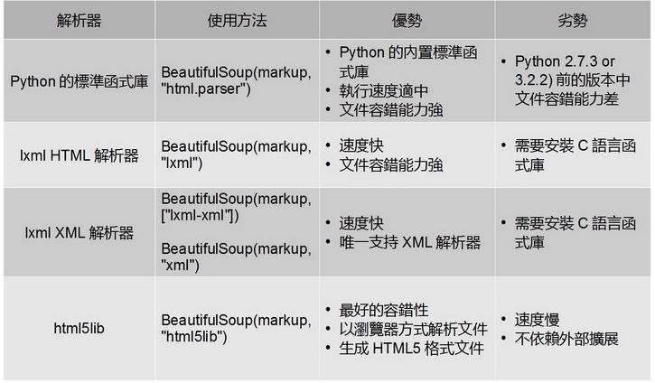
- 一般來說，對於速度或效能要求不太高的話，還是建議大家使用 html5lib 來進行解析的，
  但是當規模達到一定程度的時候，解析速度就會影響到整體專案的快慢了，所以如果你對
  效能有要求的話，還是推薦使用 lxml 來進行解析的。具體的視情況而定吧。
**** BeautifulSoup4 四大物件
BeautifulSoup4 將複雜 HTML 文件轉換成一個複雜的樹形結構,每個節點都是 Python 物件,所有物件可以歸納為 4 種:
- Tag: HTML 中的一個個標籤，例如：<title>, <head>, 
, <link>, <a>...，Tag 下
  擁有許多屬性和方法，和前端類似，例如 a 標籤一定會有它的 href 屬性，某些屬性是某
  些標籤所獨有的。
- NavigableString: 標籤內部的文字:  .string
- BeautifulSoup: BeautifulSoup 物件就是通過解析網頁所得到的物件，我們的 soup 即
  是 BeautifulSoup 物件. 可以把它當作 Tag 物件，是一個特殊的 Tag，我們可以分別獲取它的型別，名稱，以及屬性
- Comment: 物件是網頁中的註釋及特殊字串，當你提取網頁中的註釋的時候，它會自動幫你生成 Comment 物件
**** Tag 物件:
- Tag 物件可以說 BeautifulSoup 中最為重要的物件，通過 BeautifulSoup 來提取資料基本都圍繞著這個物件來進行操作。
- 一個節點中是可以包含多個子節點和多個字串的。例如 html 節點中包含著 head 和 body 節點。
  所以 BeautifulSoup 就可以將一個 HTML 的網頁用這樣一層層巢狀的節點來進行表示。
- name: 每一個 tag 標籤都有 name 屬性
- attributes: 在 html 中,某個 Tag 可能有多個屬性, Tag 屬性使用和字典一樣的方法取值:
- get\under{}text(): 通過 get\under{}text() 方法我們可以獲取某個 Tag 下所有的文字內容：
- find\under{}all(): 在前面我們講了通過標籤的屬性來進行標籤的訪問的方法，大多都只適用於
  簡單的一些場景，所以 BeautifulSoup 還提供了搜尋整個文件樹的方法，即 find\under{}all()。
  該方法基本適用於任何節點
**** 第四版：擷取所需資訊
#+begin_src python -r -n :eval no
import urllib.request as req
url = "https://www.ptt.cc/bbs/Kaohsiung/index.html"
# 幫request加上一個header
request = req.Request(url, headers = {
    "User-Agent":"Mozilla/5.0 (Macintosh; Intel Mac OS X 10.14; rv:72.0) Gecko/20100101 Firefox/72.0"
})

with req.urlopen(request) as response:
    data = response.read().decode("utf-8")

import bs4
root = bs4.BeautifulSoup(data,"html.parser")

titles = root.find_all("div", class_="title")

for t in titles:
    print(t.a)

#+end_src

#+RESULTS:
: <a href="/bbs/Kaohsiung/M.1591426133.A.8A9.html">[閒聊] 新興區雨暫停了！</a>
: <a href="/bbs/Kaohsiung/M.1591426899.A.142.html">[閒聊] 通通給我出去投</a>
: <a href="/bbs/Kaohsiung/M.1544812880.A.AEE.html">[公告] 高雄板板規+違規檢舉區 (2018/06/11)</a>
: <a href="/bbs/Kaohsiung/M.1544813221.A.C34.html">[公告] 置底買賣專區</a>
: <a href="/bbs/Kaohsiung/M.1591246810.A.667.html">[公告] 20.06.06 0:00 禁止宣傳贊成/反對罷免資訊</a>
: <a href="/bbs/Kaohsiung/M.1591396114.A.CBC.html">[公告] 投票路程聊天區(禁止拉票)</a>
: <a href="/bbs/Kaohsiung/M.1591314761.A.E1C.html">[閒聊] 0605-0607 天氣提醒(1300 陣雨)</a>
** 實作練習
- 由[[https://data.kcg.gov.tw/dataset?res_format=JSON][高雄市政府資料開放平台]]找到[高雄市各級學校甄選公告]，線上讀取其線上 JSON 資料，輸
  出校名及出缺科別。
- 由[[https://data.gov.tw/][政府資料開放平台]]找到[[https://data.gov.tw/dataset/107578][高雄市電動機車充電站名稱及充電站地址]]，線上讀取 JSON 檔，列
  出所有高雄市機車充電站之[計費方式]以及[充電站所在位址]。
- Google 美食達人「壽司羊」，以爬蟲程
  式列出其部落格(在痞客邦)最近五篇文章
  的標題以及文章月份。

  + 參考解答
#+RESULTS:
: Jun  【高雄食記】初一車輪燒紅豆餅／只要 25 元就可以吃到一大塊的巧克力戚風蛋糕做成的雙重巧克力車輪餅，會牽絲的起司蛋也很好吃((附菜單
: Jun  【高雄美食】長代堂食品行／好吃的長崎蜂蜜蛋糕，底下那一層才是配上無糖紅茶的隱藏版超級美味甜點，千萬不要丟掉了！！！
: Jun  【冷凍宅配】蝦大俠室內有機養殖 白蝦 草蝦／不出門簡單煮，在家就可以吃到美味的蝦子，不管是烤蝦，水煮蝦都很方便快速。
: Jun  【台北美食】地中海牛排館 歐華酒店／超高 CP 值的用餐優惠方案，濕式熟成 50 天肋眼牛排+1000 元送高級雙人房住宿一晚((附菜單
: Jun  【高雄食記】玖雞炸物／堅持使用新鮮雞肉，每天到鳳農市場採購，吃得到雞肉鮮味鹽酥雞小店，墨魚黑輪也很好吃，脫油機不油膩((附菜單

#+BEGIN_COMMENT

import urllib.request as req
url = "https://lintzuyang79.pixnet.net/blog/"
# 幫 request 加上一個 header
request = req.Request(url, headers = {
    "User-Agent":"Mozilla/5.0 (Macintosh; Intel Mac OS X 10.14; rv:72.0) Gecko/20100101 Firefox/72.0"
})

with req.urlopen(request) as response:
    data = response.read().decode("utf-8")

import bs4
root = bs4.BeautifulSoup(data,"html.parser")

titles = root.find_all("li", class_="title")
pubs = root.find_all("li", class_="publish")
for pub, title in zip(pubs[:5], titles[:5]):
    print(pub.span.string,title.a.string)

#+END_COMMENT

#+latex:\newpage

* Python to web
** Flask
#+begin_src python -r -n :eval no
from flask import Flask
app = Flask(__name__)

@app.route("/")
def hello():
    title = "<title>Advanced Materials of Python</title>"
    h1 = "<h1>Python based web</h1>"
    p1 = "
Hello python
"
    return title+h1+p1

if __name__ == "__main__":
    app.run()
#+end_src

#+Results:
#+Caption: Flask Web Site
#+Label: fig:PandasPlot-4
#+name: fig:PandasPlot-4
#+ATTR_LATEX: :width 400
#+ATTR_HTML: :width 400
#+ATTR_ORG: :width 500

#+latex:\newpage

* Footnotes

[fn:1] [[https://medium.com/datainpoint/python-essentials-conda-quickstart-1f1e9ecd1025][輕鬆學習 Python：conda 的核心功能]]

[fn:2] [[https://stackoverflow.com/questions/30034840/what-are-the-differences-between-conda-and-anaconda][What are the differences between Conda nd Anaconda?]]

[fn:3] [[https://www.google.com/url?sa=t&rct=j&q=&esrc=s&source=web&cd=1&cad=rja&uact=8&ved=2ahUKEwjoq476trjpAhUKK6YKHZKAAc8QFjAAegQIAxAB&url=https%3A%2F%2Fkknews.cc%2Fzh-tw%2Fcode%2F9j99vnl.html&usg=AOvVaw0eaDh9T-x0LmUEjD4Vq0AX][分分鐘學會用python爬蟲框架Scrapy爬取心目中女神]]

[fn:4] [[https://blog.gtwang.org/programming/python-beautiful-soup-module-scrape-web-pages-tutorial/][Python 使用 Beautiful Soup 抓取與解析網頁資料，開發網路爬蟲教學]]

[fn:5] [[https://kknews.cc/zh-tw/code/ba95qx6.html][python爬蟲CSS 選擇器-BeautifulSoup4]]

[fn:6] [[https://freelancerlife.info/zh/blog/python%E7%B6%B2%E8%B7%AF%E7%88%AC%E8%9F%B2%E6%95%99%E5%AD%B8-selenium%E5%9F%BA%E6%9C%AC%E6%93%8D%E4%BD%9C/][python網路爬蟲教學-Selenium基本操作]]

[fn:7] [[https://learngeb-ebook.readbook.tw/intro/selenium.html][[認識 Selenium]]

[fn:8] [[https://djangogirlstaipei.gitbooks.io/django-girls-taipei-tutorial/django/introduction.html][Django 介紹]]

[fn:9] [[https://blog.techbridge.cc/2017/06/03/python-web-flask101-tutorial-introduction-and-environment-setup/][Python Web Flask 實戰開發教學]]

[fn:10] [[https://blog.techbridge.cc/2017/07/28/data-science-101-numpy-tutorial/][從零開始學資料科學：Numpy 基礎入門]]

[fn:11] [[https://ithelp.ithome.com.tw/articles/10193295][[Day05]聊聊重要的三個package吧！ ]]

[fn:12] [[https://medium.com/python-%E8%B3%87%E6%96%99%E8%A6%96%E8%A6%BA%E5%8C%96/python-%E5%95%86%E6%A5%AD%E6%95%B8%E6%93%9A%E5%88%86%E6%9E%90%E8%88%87%E5%8F%AF%E8%A6%96%E5%8C%96%E7%B9%AA%E5%9C%96-3-1%E8%AC%9B-matplotlib-%E4%BB%8B%E7%B4%B9-e1928f7dfd35][[Python 商業數據分析之可視化繪圖] 第3.1講：Matplotlib 介紹]]

[fn:13][[https://killer0001.blogspot.com/2018/09/1-seaborn.html][ Seaborn 介紹 ]]

[fn:14] [[https://kknews.cc/zh-tw/code/9z88248.html][python數據可視化（一）seaborn介紹及繪圖風格設置]]

[fn:15] [[https://www.lizenghai.com/archives/65323.html][R語言ggplot2系列1-ggplot2簡介]]

[fn:16] [[https://www.itread01.com/content/1551725786.html][機器學習入門之sklearn介紹]]

[fn:17] [[https://clay-atlas.com/blog/2019/07/30/%E3%80%90nlp%E3%80%91nltk-%E5%9F%BA%E6%9C%AC%E6%95%99%E5%AD%B8/][英文自然語言處理的經典工具: NLTK]]

[fn:18] [[https://ithelp.ithome.com.tw/articles/10215969?sc=iThelpR][[Day-1] Tensorflow 介紹 及 Tensorflow 2.0相關知識 ]]

[fn:19] [[https://towardsdatascience.com/deep-learning-framework-power-scores-2018-23607ddf297a][Deep Learning Framework Power Scores 2018
]]

[fn:20][[https://makerpro.cc/2019/06/self-learning-series5-of-ai/][【自學AI#5】深度學習必備：Keras、Jupyter安裝教學]]

[fn:21] [[https://medium.com/chiukevin0321/tensorflow%E8%88%87keras%E5%9F%BA%E6%9C%AC%E4%BB%8B%E7%B4%B9-621352fc7150][Tensorflow與Keras基本介紹]]

[fn:22] [[https://medium.com/pyladies-taiwan/%E6%B7%B1%E5%BA%A6%E5%AD%B8%E7%BF%92%E6%96%B0%E6%89%8B%E6%9D%91-pytorch%E5%85%A5%E9%96%80-511df3c1c025][深度學習新手村：PyTorch入門]]

[fn:23] [[https://ithelp.ithome.com.tw/articles/10192460][Day01 Anaconda環境安裝!]]

[fn:24] [[https://blog.techbridge.cc/2017/07/28/data-science-101-numpy-tutorial/][從零開始學資料科學：Numpy 基礎入門]]

[fn:25] [[https://www.brilliantcode.net/1093/numpy-1-14-tutorial-04-indexing-slicing-iterating-from-function/][NumPy 1.14 教學:索引(Indexing)、切片(Slicing)、迭代(Iterating)、From Function]]

[fn:26] [[https://ithelp.ithome.com.tw/articles/10196167][[Day18]Numpy檔案輸入與輸出！ ]]

[fn:27] [[https://codertw.com/%E7%A8%8B%E5%BC%8F%E8%AA%9E%E8%A8%80/570647/][NumPy 檔案存取 tofile，fromfile， load，save]]

[fn:28] [[https://hackmd.io/@yizhewang/HJjG8ha5r][使用 numpy.genfromtxt 讀取混合格式的資料]]

[fn:29] [[https://stackoverflow.com/questions/33655641/b-character-added-when-using-numpy-loadtxt]['b' character added when using numpy loadtxt]]

[fn:30] [[https://aifreeblog.herokuapp.com/posts/54/data_science_203/][資料的正規化與標準化]]

[fn:31] [[https://medium.com/@jemmy1234/matplotlib-%E7%B0%A1%E4%BB%8B-857323964e2d][Matplotlib 簡介]]

[fn:32] [[https://matplotlib.org/api/_as_gen/matplotlib.pyplot.subplot.html][matplotlib.pyplot.subplot]]

[fn:33] [[https://blog.csdn.net/qq_18668137/article/details/80807829][conda、miniconda、anaconda的區別以及在pycharm中選擇conda的虛擬環境]]

[fn:34] [[https://oranwind.org/python-pandas-ji-chu-jiao-xue/][[Python] Pandas 基礎教學]]

[fn:35] [[https://www.itread01.com/content/1547569271.html][Python讀寫csv檔案的幾種方法 及 pandas.read_csv 引數全解]]

[fn:36] [[https://ithelp.ithome.com.tw/articles/10208412][Day23- 資料處理模組-Pandas 介紹]]

[fn:37] [[https://blog.wu-boy.com/2011/04/%E4%BD%A0%E4%B8%8D%E5%8F%AF%E4%B8%8D%E7%9F%A5%E7%9A%84-json-%E5%9F%BA%E6%9C%AC%E4%BB%8B%E7%B4%B9/][你不可不知的 JSON 基本介紹]]

[fn:38] [[https://zh.wikipedia.org/zh-tw/HTML][HTML]]

[fn:39] [[http://blog.castman.net/%E6%95%99%E5%AD%B8/2016/12/22/python-data-science-tutorial-3.html][給初學者的 Python 網頁爬蟲與資料分析 (3) 解構並擷取網頁資料]]

[fn:40] [[https://medium.com/ai%E5%8F%8D%E6%96%97%E5%9F%8E/anaconda-miniconda-conda-pip%E7%9A%84%E7%9B%B8%E4%BA%92%E9%97%9C%E4%BF%82-%E8%BD%89%E8%BC%89-a0536f3a257][Anaconda、Miniconda、Conda、pip的相互關係 (轉載)]]

[fn:41] [[https://iter01.com/60617.html][Python 爬蟲十六式 - 第五式：BeautifulSoup，美味的湯]]

[fn:42] [[https://hiskio.com/courses/112/lectures/3161][解析器之間的差異]]

[fn:43] [[https://kknews.cc/code/y3mzkgg.html][Python爬蟲解析庫——BeautifulSoup4]]
