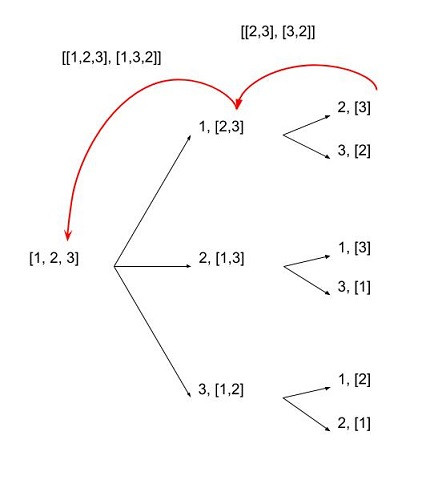
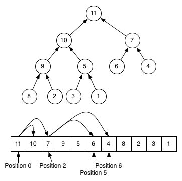
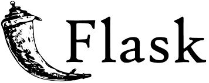
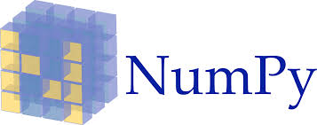
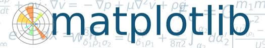
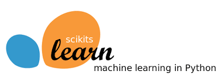
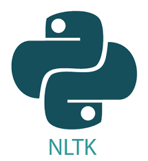
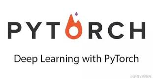
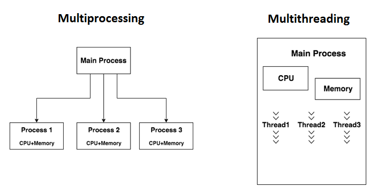

# -*- org-export-babel-evaluate: nil -*-
#+Title: Advanced Materials of Python

#+INCLUDE: ../pdf.org
#+PROPERTY: header-args :eval never-export
#+TAGS: Python
#+EXCLUDE_TAGS: noexport
#+OPTIONS: toc:2 ^:nil num:3
#+OPTIONS: H:4
#+LATEX:\newpage
#+HTML_HEAD: <link rel="stylesheet" type="text/css" href="../css/muse.css" />
#+HTML_HEAD_EXTRA: 
#+begin_export html

#+end_export

* FUNCTION
:PROPERTIES:
:CUSTOM_ID: py-functions
:END:
在 Python 中，function 屬於一級物件(first-class object)，意思是可以被指派給變數、存在資料結構中、做為參數傳給其他 function，甚至可以當作其他 function 的傳回值。

** Function 有什麼用？
*** 2B. 三角形面積求解[基本變數輸入輸出]
在作業 2B 中，我們的任務是根據三角形的三邊長來計算面積
#+begin_src python -r -n :results output :exports both
a, b, c = 3, 4, 5
s = (a + b + c) / 2
area = (s * (s - a) * (s - b) * (s - c)) ** 0.5
print(area)
#+end_src

*** 如果有個 function 叫 triangleArea()，傳給它三個整數、它就會傳回面積，那上面的程式就可以簡化為：
#+begin_src python -r -n :results output :exports both
a, b, c = 3, 4, 5
print(triangleArea(a, b, c))
#+end_src
若真能如此，一切就太完美了。但，雖然 python 提供了很多有用的 function，但是總不可能預測到所有人的需求，此時就需要我們自己來設計這個 function 了.....

** 函式(function)基本操作
*** 函式(function)的重要性
- function 為一段程式的集合，可視為一個獨立的區段。
- function 可重覆使用，因此為結構化程式語言的重要元素。
可將龐大複雜的程式分解為小問題，由多人分別以 function 解決，縮短開發時間。
- function 可區分為以下三類：
  + Python 內建 function，如: print()、len()、int()、str()...。
  + 第三方公司所開發的模組 module(多個 function 組合)。
  + 自定義 function。

*** 自定義函式
- 宣告語法
  #+BEGIN_SRC python -r -n
def 函式名稱 ( [參數1, 參數2, ...] ):
    程式區塊

    [ return 值 ]
  #+END_SRC
- 說明 :
  + 參數可省略，亦即呼叫 function 不需傳入任何資料(引數)。
  + 若無回傳值，則無需 return。
  + 若多個回傳值可用逗號隔開。

*** 自定義函式的呼叫
- 呼叫函式語法：
#+BEGIN_SRC python -r -n
  [ 變數 ] = 函式名稱( [引數1, 引數2, ... ] )
#+END_SRC
範例:
#+BEGIN_SRC python -r -n :results output :exports both
def circle(r):
    return r*r*3.14

r = 10
print('半徑%d的圓面積：%.2f' %(r, circle(r)))
#+END_SRC

  #+RESULTS:
  : 半徑 10 的圓面積：314.00

*** 多參數函式
- 呼叫函式時引數(argument)個數
- 自定義函式的參數(parameter)個數
- 設定參數初始值。
若呼叫時無引數傳入，
則使用其初始值。

前文中提及的 triangleArea()需要傳入三個參數(三角形的三邊)，這就是典型的多參數 function。
#+begin_src python -r -n :results output :exports both
def triangleArea(a, b, c):
    s = (a + b + c) / 2
    area = (s * (s - a) * (s - b) * (s - c)) ** 0.5
    return area

print(triangleArea(3, 4, 5))
#+end_src

#+RESULTS:
: 6.0

*** 多回傳值函式
- 呼叫函式多個回傳值語法
  #+BEGIN_SRC python -r -n
[ 變數1, 變數2, ... ] = 函式名稱( [引數1, 引數2, ... ] )
  #+END_SRC
範例: 輸入全班分數，傳回全班總分、全班平均
#+BEGIN_SRC python -r -n :results output :exports both
def scoreProcessor(score):
     sos = 0
     for x in score:
         sos += x
     # sos = sum(score)
     return sos, sos/len(score)

scores = (21, 33, 83, 100, 75, 60)
sum, avg = scoreProcessor(scores)
print('sum=',sum,',average=',avg)
#+END_SRC

  #+RESULTS:
  : sum= 372 ,average= 62.0

** 引數(argument)的傳遞
- 每一個函式都是獨立的，所以函式只知道自己程式區域內的變數，不認識函式外的變數。
- 變數因其所宣告位置，可區分為全域變數(Global variable)、區域變數(Local variable)。
  + 全域變數：宣告在任何函式外，所有函式皆可存取。
  + 區域變數：宣告在函式內，僅函式內可存取。
- 全域變數與區域變數範例
  #+BEGIN_SRC python -r -n :results output :exports both
# 這是全域變數，所有函式都可以讀取與使用
x = 5
y = 10

def use_global():
    # 使用全域變數 x 和 y 來計算
    print("use_global:", x + y)

def use_local():
    # 這裡定義了區域變數 x 和 y，僅在這個函式中有效
    x = 20
    y = 30
    print("use_local:", x + y)

use_global()   # 使用全域的 x=5, y=10，輸出 15
use_local()    # 使用區域的 x=20, y=30，輸出 50

# 再次使用全域變數確認未受影響
print("Global variables remain:", x, y)  # 輸出 5 10
  #+END_SRC

  #+RESULTS:
  : use_global: 15
  : use_local: 50
  : Global variables remain: 5 10
*** 說明重點：
1. use_global()：函式內沒有定義 x 或 y，因此會使用函式外的全域變數。
1. use_local()：函式內重新定義了 x 和 y，這些是區域變數，只在這個函式中有效，函式外的全域變數不會受到影響。
1. 最後再次印出全域變數，確認它們仍然是原本的值。
*** 傳值與傳址
這裡要講的概念是：我傳給 function 的參數到底會不會被 function 偷偷改掉?
舉個例子:如果我在 function circle 裡把主程式傳過來的半徑改掉，那麼，原來主程式的半徑會不會跟著被改掉呢？
#+begin_src python -r -n :results output :exports both
def circle(r):
    r = 100 #我在這裡把半徑改掉
    return r*r*3.14

r = 10
print('原來的r:', r)
print('算面積：', circle(r))
print('後來的r:', r)
#+end_src

#+RESULTS:
: 原來的 r: 10
: 算面積： 31400.0
: 後來的 r: 10
有些參數可以在 function 中被修改，有些則不行，這就是傳值/傳址的差異。
- 引數(argument)的傳遞分為兩種方式，由 Python 自動判別：
  + 傳值呼叫(Call-by-Value): 參數不會被 function 修正
  + 傳址呼叫(Call-by-Reference): 參數可以被 function 修改
|--------------------------+-------------+--------+-----------------------------------|
| 引數傳遞                   | 傳遞內容      | 參數改變 | 資料型別                            |
|--------------------------+-------------+--------+-----------------------------------|
| 傳值呼叫 call-by-value     | 引數值        | 否      | bool, int, float, str, tuple, chr |
| 傳址呼叫 call-by-reference | 引數記憶體位址 | 是      | List, dict, set                   |
|--------------------------+-------------+--------+-----------------------------------|
也就是說，如果你傳進去的參數是 list，那很有可能就會被修改：
範例:
#+BEGIN_SRC python -r -n :results output :exports both
# str傳值、List傳址
def ccc(name, score):
    name = 'Amy'
    score.append(99)
    print('--函式內輸出---')
    print('name:', name,'\tscore:',score)

name = 'Josh'
score = [77, 88]

print('--原來的list--')
print(score)
print('--呼叫function ccc--')
ccc(name, score)
print('--現在的list--')
print(score)
#+END_SRC

#+RESULTS:
: --原來的 list--
: [77, 88]
: --呼叫 function ccc--
: --函式內輸出---
: name: Amy 	score: [77, 88, 99]
: --現在的 list--
: [77, 88, 99]

** 模組(module)
*** 匯入模組語法：
Python 中的函式庫稱為模組(module)。
#+BEGIN_SRC python -r -n
import 模組1 [, 模組2, ... ]
from 模組 import 函式
#+END_SRC
*** 範例
#+BEGIN_SRC python -r -n :results output :exports both
import random as ran

print(ran.randint(1, 100))
print(ran.randint(1, 100))
print(ran.randint(1, 100))
#+END_SRC

#+RESULTS:
: 50
: 78
: 16
*** 自訂模組
- 定義: myModule.py
#+begin_src python -r -n :results output :exports both
# name: myModule.py

def pp(n):
    return n+1

def mm(n):
    return n-1
#+end_src
- 使用
#+begin_src python -r -n :results output :exports both
import myModule as my

print(my.pp(5))
print(my.mm(5))
print(my.__name__)
print(dir(my))
#+end_src

#+RESULTS:
: 6
: 4
: myModule
: ['__builtins__', '__cached__', '__doc__', '__file__', '__loader__', '__name__', '__package__', '__spec__', 'mm', 'pp']

** 全域變數(Global variable)
:PROPERTIES:
:ID:       fbaa9857-039f-4dc3-be90-8322e37f0784
:END:
前面提到 function 內的變數是區域變數，無法影響外部。但如果你真的需要在 function 裡修改全域變數，可以使用 =global= 關鍵字。
#+begin_src python -r -n :async :results output :exports both

def f1(x):
    y = x - 3       # 這裡的 y 是區域變數，和外面的 y 無關
    if y < 0:
        return 2*x+1
    return x - 1

def f2(x):
    global y         # 宣告要使用全域的 y
    y = x - 3        # 這裡會修改到全域的 y
    if y < 0:
        return 2*x+1
    return x - 1

y = -1
print(f1(1), y)   # f1 不會改到全域的 y，所以 y 仍然是 -1
print(f2(1), y)    # f2 用了 global，所以全域的 y 被改成 1-3 = -2
#+end_src

#+RESULTS:
: 3 -1
: 3 -2

#+begin_tip
注意：雖然 =global= 可以用，但過度使用全域變數會讓程式難以維護（因為不知道哪個 function 偷偷改了它）。建議盡量用參數傳遞和 return 來交換資料。
#+end_tip

* 遞迴(Recursion)
:PROPERTIES:
:CUSTOM_ID: py-recursion
:END:
#+begin_verse
從前有座山，山上有座廟，廟裡有個老和尚和一個小和尚，一天，老和尚給小和尚講了一個故事，故事的內容是「從前有座山，山上有座廟，廟裡有個老和尚和一個小和尚，一天，老和尚給小和尚講了一個故事，是「從前有座山，山上有座廟，廟裡有個老和尚和一個小和尚，故事的內容......」」。
#+end_verse
前節提及我們寫了一支 function 後，可以在其他地方呼叫(call)執行這支程式，像底下這樣：
#+begin_src python -r -n :results output :exports both
def storyTeller():
    print('從前有座山，山上有座廟，廟裡有個老和尚和一個小和尚，一天，老和尚給小和尚講了一個故事')

# 主程式
storyTeller()
#+end_src
#+RESULTS:
: 從前有座山，山上有座廟，廟裡有個老和尚和一個小和尚，一天，老和尚給小和尚講了一個故事

但，如果我們 *在 function 裡又呼叫自己呢?像底下這樣：
#+begin_src python -r -n :results output :exports both
def storyTeller():
    print('從前有座山，山上有座廟，廟裡有個老和尚和一個小和尚，一天，老和尚給小和尚講了一個故事')
    storyTeller() #storyTeller在結束前呼叫自己
# 主程式
storyTeller()
#+end_src

上述的概念即是 recursion，明明我們沒寫 for 或 while，但確有重複執行的能力；只是它有個小小但致命的缺點: 停不下來...QQ

再看另一個例子：
#+begin_src python -r -n :results output :exports both :eval no
def printN(n):
    print(n)
    printN(n-1)

#主程式
printN(5)
#+end_src
猜一下上述程式會得到什麼結果...
** Recursion 的必要條件
1. 自我呼叫
   即，在 function 自己呼叫自己
2. 停止條件
   顯然，上面的自我呼叫必須有所節制，例如，將之置於 if 裡，只在某些條件成立下才允許呼叫自己
** 練習
為 printN()加入停止條件，讓它可以傳入一個參數 n，輸出 1 到 n，即，當參數(n)的值小於 1 時就不再呼叫自己
#+begin_src python -r -n :results output :exports both
#主程式
printN(5)
#+end_src
輸出以下結果
#+RESULTS:
: 5 4 3 2 1
*** solution :noexport:
#+begin_src python -r -n :results output :exports both
def printN(n):
    if n >= 1:
        print(n, end=' ')
        printN(n-1)

#主程式
printN(5)
#+end_src

#+RESULTS:
: 5 4 3 2 1
** Recursion 能幹嘛?
上述這種 function 自己呼叫自己的有趣執行方式，除了能拿來取代重複架構(for, while)之外，還能用來做什麼事?
*** 例 1: N!
**** for-solution
#+begin_src python -r -n :results output :exports both
def frac(n):
    fsum = 1
    for i in range(1, n+1):
        fsum *= i
    return fsum

print(frac(5))
#+end_src

#+RESULTS:
: 120
**** Recursion-solution
$$f(n)=
\begin{cases}
1 & n=1\\
n*f(n-1) & n \geq 2
\end{cases}$$
#+begin_src python -r -n :results output :exports both
def frac(n):
    if n == 1:
        return 1
    return n*frac(n-1)
#主程式
print(frac(5))
#+end_src

#+RESULTS:
: 120
*** 例 2: 費氏數列
**** 費氏數列數學表示法
$$f(n)=
\begin{cases}
1 & n=1\\
1 & n=2\\
f(n-1)+f(n-2) & n > 2
\end{cases}$$
**** for-solution
#+begin_src python -r -n :results output :exports both
def fib(n):
    if n <=2:
        return 1
    a = b = 1
    for i in range(2, n):
        c = a + b
        a, b = b, c
    return c
#主程式
print('The %d-th Fibonacci number = %d' %(5, fib(5)))
#+end_src

#+RESULTS:
: The 5-th Fibonacci number = 5
**** Recursion-solution :noexport:

#+BEGIN_SRC python -r -n :results output :exports both
def fib(n):
    if n == 1 or n == 2:
        return 1
    else:
        return fib(n-1) + fib(n-2)
#主程式
print('The %d-th Fibonacci number = %d' %(5, fib(5)))
#+END_SRC

#+RESULTS:
: The 5-th Fibonacci number = 5

** 實作練習
*** 最大公因數 :Recursion:
**** while solution :noexport:
#+begin_src python -r -n :results output :exports both
m, n = 20, 50
while (n>0):
    m, n = n, m % n
    print(m)

#+end_src

#+RESULTS:
: 50
: 20
: 10

**** Solution :noexport:
#+begin_src python -r -n :results output :exports both
def gcd(a, b):
    if b == 0:
        return a
    return gcd(b, a % b)

a, b = 10, 50
print(gcd(a, b))
#+end_src
*** 計算 C(n, r)組合數
排列組合中的組合數公式為：
$$ C(n, r) = \frac{n!}{r! \times (n-r)!} $$

請利用遞迴寫一個 function 計算 C(n, r) 的值。

提示：可以先寫一個遞迴的階乘 function =factorial(n)= ，再利用它來計算組合數。
*** 調和級數 :Recursion:
寫一個遞迴 function 計算前 n-1 項的調和級數（harmonic sum），也就是正整數倒數的和：
$$ 1 + \frac{1}{2} + \frac{1}{3} + \frac{1}{4} + ... +  \frac{1}{n-1}    $$
**** Solution :noexport:
#+begin_src python -r -n :results output :exports both
def harmonic_sum(n):
  if n < 2:
    return 1
  else:
    return 1 / n + (harmonic_sum(n - 1))

print("{0:.4f}".format(harmonic_sum(7)))
print("{0:.4f}".format(harmonic_sum(1)))
print("{0:.4f}".format(harmonic_sum(27)))
print("{0:.4f}".format(harmonic_sum(37)))

#+end_src

#+RESULTS:
: 2.5929
: 1.0000
: 3.8915
: 4.2016
*** 遞迴 List 加總 :List:recursion:
寫一個遞迴 function，計算巢狀 List 中所有數字的總和。
測試資料: [1, 2, [3,4], [5,6]]
預期結果: 21
**** solution :noexport:
#+begin_src python -r -n :results output :exports both
import ast

def sumOfList(intLst):
    total = 0
    for element in intLst:
        if type(element) == type([]):
            total += sumOfList(element)
        else:
            total += element
    return total

intStr = '[1, 2, [3, 4, [5, 6, 7]]]'

intLst = ast.literal_eval(intStr)

print(sumOfList(intLst))
#+end_src

#+RESULTS:
: 28

#+latex:\newpage
*** MAX: Recursive solution :List:recursion:noexport:
#+begin_src python -r -n :results output :exports both
def recuMax(numList):
    if len(numList) == 2:
        if numList[0] < numList[1]:
            return numList[1]
        else:
            return numList[0]
    leftMax = numList[0]
    rightMax = recuMax(numList[1:])
    if rightMax > leftMax:
        return rightMax
    else:
        return leftMax

print(recuMax([3, 5, -1, 10, 2]))

#+end_src

#+RESULTS:
: 10

** 作業
*** permutation
[[https://stackoverflow.com/questions/104420/how-to-generate-all-permutations-of-a-List][How to generate all permutations of a List?]]
**** Solution 1 :noexport:
#+begin_src python -r -n :results output :exports both
def perm(a, k=0):
   if k == len(a):
      print(a)
   else:
      for i in range(k, len(a)):
         a[k], a[i] = a[i] ,a[k]
         perm(a, k+1)
         a[k], a[i] = a[i], a[k]

perm([1,2,3])

#+end_src

#+RESULTS:
: [1, 2, 3]
: [1, 3, 2]
: [2, 1, 3]
: [2, 3, 1]
: [3, 2, 1]
: [3, 1, 2]
**** Solution 2 :noexport:
#+begin_src python -r -n :results output :exports both
def permute_in_place(a):
    a.sort()
    yield list(a)

    if len(a) <= 1:
        return

    first = 0
    last = len(a)
    while 1:
        i = last - 1

        while 1:
            i = i - 1
            if a[i] < a[i+1]:
                j = last - 1
                while not (a[i] < a[j]):
                    j = j - 1
                a[i], a[j] = a[j], a[i] # swap the values
                r = a[i+1:last]
                r.reverse()
                a[i+1:last] = r
                yield list(a)
                break
            if i == first:
                a.reverse()
                return
#+end_src
**** Solution 3 :noexport:
#+CAPTION: Permutation
#+LABEL:fig:PERM
#+name: fig:PERM
#+ATTR_LATEX: :width 300
#+ATTR_ORG: :width 300
#+ATTR_HTML: :width 500

#+begin_src python -r -n :results output :exports both
def getPermutations(array):
    if len(array) == 1:
        yield array
    else:
        for i in range(len(array)):
            perms = getPermutations(array[:i] + array[i+1:])
            for p in perms:
                yield [array[i], *p]
#+end_src
*** 遞迴計算
**** 說明
寫一個遞迴 function，計算 n+(n-2)+(n-4)+... 的總和（一直加到 n-x ≤ 0 為止）。
**** 輸入
6
**** 輸出
12
**** solution :noexport:
#+begin_src python -r -n :results output :exports both
def sum_series(n):
  if n < 1:
    return 0
  else:
    return n + sum_series(n - 2)

print(sum_series(6))
print(sum_series(10))
print(sum_series(3))
print(sum_series(11))
print(sum_series(100))
print(sum_series(298))
#+end_src

#+RESULTS:
: 12
: 30
: 4
: 36
: 2550
: 22350
*** 這不是巴斯卡
**** 說明
給你一串數字，請你依序兩兩相加，直到剩下一個數字，並將過程反向輸出
**** 輸入
1 2 3 4 5
**** 輸出
48
28 28
8 12 16
3 5 7 9
1 2 3 4 5
**** solution :noexport:
#+begin_src python -r -n :results output :exports both
def printSum(sumList):
    if len(sumList) < 1:
        return

    tmp = [0]*(len(sumList)-1)

    for i in range(len(sumList)-1):
        nv = sumList[i] + sumList[i+1]
        tmp[i] = nv
    #算好了，繼續呼叫自己求出上一列結果(先不輸出)
    printSum(tmp)
    #最後開始輸出
    print(''.join(str(x)+' ' for x in sumList))

printSum([1,0,1,0,1])
#+end_src

#+RESULTS:
: 8
: 4 4
: 2 2 2
: 1 1 1 1
: 1 0 1 0 1
** 參考題庫
- [[https://www.geeksforgeeks.org/recursion-practice-problems-solutions/][Recursive Practice Problems with Solutions]]

* yield 與 Generator
=yield= 的用法很像 =return= ，但有一個關鍵差異：=return= 會結束整個 function，而 =yield= 只是「暫停」function，等下一次被呼叫時會從暫停的地方繼續執行。

使用 =yield= 的 function 叫做 *generator function*，呼叫它不會立即執行，而是產生一個 generator object，可以用 =next()= 或 =for= 迴圈來逐步取值。
#+begin_src python -r -n :results output :exports both
def countdown(n):
    while n > 0:
        yield n     # 每次暫停在這裡，傳回 n 的值
        n -= 1

for num in countdown(5):
    print(num, end=' ')
#+end_src

#+RESULTS:
: 5 4 3 2 1

Generator 的好處是「用多少算多少」——不會一次把所有結果都存在記憶體裡，特別適合處理大量資料。

延伸閱讀：[[https://chriskang028.medium.com/python-%E8%A3%A1%E7%9A%84-yield-%E8%AE%93%E4%BD%A0%E7%B0%A1%E5%96%AE-%E5%BF%AB%E9%80%9F%E7%9E%AD%E8%A7%A3-yield-%E7%9A%84%E6%A6%82%E5%BF%B5-f660521f3aa7][Python 裡的 yield — 讓你簡單、快速瞭解 yield 的概念]]

* 星號
在 Python 中，星號除了用於乘法數值運算和冪運算外，還有一種特殊的用法"在變量前添加單個星號或兩個星號"，實現多參數的傳入或變量的拆解[fn:16]。

* 函數的參數傳遞
最初，星號變量是用在函數的參數傳遞上，其用法如下：
- *: 該位置接受任意多個非關鍵字（non-keyword）參數，在函數中將其轉化為元組（1,2,3,4）
- **: 該位置接受任意多個關鍵字（keyword）參數，在函數**位置上轉化為詞典 [key:value, key:value ]
** 單星號的用法
#+begin_src python -r -n :results output :exports both
def one(a, *b):
    #a是一個普通的傳入參數; *b是一個非關鍵字(non-keyword)參數
    print('a的type為:', type(a))
    print('a的value為:', a)
    print('b的type為:', type(b))
    print('b的value為:', b)

one(11, 22, 33, 44, 55)
#+end_src

#+RESULTS:
: a 的 type 為: <class 'int'>
: a 的 value 為: 11
: b 的 type 為: <class 'tuple'>
: b 的 value 為: (22, 33, 44, 55)

由執行結果可以看出，第 1 個參數(11)對映到 function one 的第一個引數(a)，至於剩下的 4 個參數(22, 33, 44, 55)則全都被引數(b)接收了，原因就是 b 前面的星號，這個單星號代表這個位置接收任意多個非關鍵字參數，接收後的所有資料會被轉成一個 tuple。
** 單星號使用情境
例如，我們想寫個 function 計算某學生成績，這個 function 會傳若干成績，成績數不確定，最後傳回該生總分、平均。
#+begin_src python -r -n :results output :exports both
def scoProc(*scores):
    return sum(scores), sum(scores)/len(scores)

sctot, scavg = scoProc(10, 30, 88, 17, 96, 94)
print('總分', sctot)
print('平均', scavg)

#+end_src

#+RESULTS:
: 總分 335
: 平均 55.833333333333336
** 雙星號的用法
#+begin_src python -r -n :results output :exports both
def two(a, **b):
    #a是一個普通的關鍵字參數，**b是一個關鍵字雙星號參數
    print('a的type為:', type(a))
    print('a的value為:', a)
    print('b的type為:', type(b))
    print('b的value為:', b)
two(a=3, b=2, c=3, d=4, e=5, f=6)
#+end_src

#+RESULTS:
: a 的 type 為: <class 'int'>
: a 的 value 為: 3
: b 的 type 為: <class 'dict'>
: b 的 value 為: {'b': 2, 'c': 3, 'd': 4, 'e': 5, 'f': 6}
由執行結果可以看出：第 1 個參數(3)的值被 assign 給引數 a，至於其他的 5 個參數(b, c, d, e, f)則都被第 2 個引數(b)接收了，原因是雙星號代表這個位置接收任意多個關鍵字參數，至於接收後的值，其類型變為 dict。
** 雙星號使用情境
例如，我們想寫個 function 計算某學生成績，這個 function 會傳入各科成績，學科數不確定，最後傳回該生總分、平均。
#+begin_src python -r -n :results output :exports both
def scoProc(**scores):
    return sum(scores.values()), sum(scores.values())/len(scores)

sctot, scavg = scoProc(ch=10, ma=30, en=88, ph=17, sc=96, ar=94)
print('總分', sctot)
print('平均', scavg)

#+end_src

#+RESULTS:
: 總分 335
: 平均 55.833333333333336

* 運算思維 :noexport:
** 動態規劃
- 從找出一個遞迴的解開始
- 到將遞迴解法改為非遞迴版本為止
演算法的精神:
- 避免重複的計算
- 避免不必要的計算
遞迴違反了第一個精神，例
#+begin_src python -r -n :async :results output :exports both
def f(n):
    if n < 2:
        return 1
    return f(n-1) + f(n-2)
print(f(10))
#+end_src

#+RESULTS:
: 89
神奇的費氏數列...到底重複計算了幾次
#+begin_src python -r -n :results output :exports both
times = 0
def f(n):
    global times
    times += 1
    if n < 2:
        return 1
    return f(n-1) + f(n-2)
for i in range(20):
    print(f(i), ':', times, '次')
#+end_src

#+RESULTS:
#+begin_example
1 : 1 次
1 : 2 次
2 : 5 次
3 : 10 次
5 : 19 次
8 : 34 次
13 : 59 次
21 : 100 次
34 : 167 次
55 : 276 次
89 : 453 次
144 : 740 次
233 : 1205 次
377 : 1958 次
610 : 3177 次
987 : 5150 次
1597 : 8343 次
2584 : 13510 次
4181 : 21871 次
6765 : 35400 次
#+end_example
** 4444
五位數減四位數等於 44444,其中被減數與減數是由 1 至 9 的數字組成其不重複。
1. 1-9 共 9 個數字，不能重複，所以被減數應該是 5 個數字，減數是 4 個數字；
1. 出現在萬位置的 3，肯定是被減數借位後出現的，所以，萬位置肯定是 4；
1. 剩下的差是 3 的數對可以是 9-6 或 6-3、8-5、，還有單個的數 1、2、7；
1. 我們把被減數和減數的個位和十位按照 9-6,6-3,8-5，然後剩下的百位和千位都要存在借位的情況，只能是 6-3 或者 8-5；
1. 這樣搭配的結果就是：41268-7935 或者 41286-7953；
1. 結果就是被減數和減數分別為 41269 和 7935 或者 41286 和 7953.

#+begin_src python -r -n :results output :exports both
digs = {1, 2, 3, 4, 5, 6, 7, 8, 9}
for i in range(41235, 49876):
    for j in range(1234, 9876):
        if i - j == 44444:
            #確認數字不重複
            xset = set([int(d) for d in str(i)])
            yset = set([int(d) for d in str(j)])
            if xset.union(yset) == digs:
                print(i, j, '=', i-j)

#+end_src

#+RESULTS:
#+begin_example
46279 1835 = 44444
46297 1853 = 44444
46819 2375 = 44444
46981 2537 = 44444
47629 3185 = 44444
47962 3518 = 44444
48169 3725 = 44444
48196 3752 = 44444
49627 5183 = 44444
49681 5237 = 44444
49762 5318 = 44444
49816 5372 = 44444
#+end_example
** 33333
#+begin_src python -r -n :results output :exports both
digs = {1, 2, 3, 4, 5, 6, 7, 8, 9}
for i in range(31240, 49876):
    for j in range(1234, 9876):
        if i - j == 33333:
            #確認數字不重複
            xset = set([int(d) for d in str(i)])
            yset = set([int(d) for d in str(j)])
            if xset.union(yset) == digs:
                print(i, j, '=', i-j)

#+end_src

#+RESULTS:
: 41268 7935 = 33333
: 41286 7953 = 33333

* Function II
** Function的特性
在第一章我們學了如何定義和呼叫 function。這一章要來看看 Python 的 function 還有哪些有趣的特性。在 Python 中，function 和整數、字串一樣，都是一種物件（object），因此可以像操作一般變數一樣來操作 function。

*** Function 為物件
既然 function 是物件，那就可以把它「指定」給其他變數。看看底下的例子：
#+begin_src python -r -n :results output :exports both
def yell(text):
    return text.upper() + '!'

print(yell('hello'))
bark = yell # 把 yell 這個 function 指定給 bark
print(bark('woof')) # bark 和 yell 指向同一個 function，所以效果一樣
#+end_src

#+RESULTS:
: HELLO!
: WOOF!
注意第 5 行：我們把 =yell= 指定給 =bark= 時，後面沒有加小括號 =()= ，因為我們不是要「呼叫」它，而是要把這個 function 本身當成一個值來傳遞。

*** Function可被放在資料結構中
#+begin_src python -r -n :results output :exports both
def yell(text):
    return text.upper() + '!'

bark = yell

funcs = [bark, str.lower, str.capitalize]

for func in funcs:
    print(func('hey there!'))
#+end_src

#+RESULTS:
: HEY THERE!!
: hey there!
: Hey there!
*** Function可做為參數傳給其他function
Function是物件，所以除了能指定給變數，更可以當成其他function的參數。
#+begin_src python -r -n :results output :exports both
def yell(text):
    return text.upper() + '!'

bark = yell

def greet(func):
    greeting = func('Hi, I am a Python Program')
    print(greeting)

greet(bark)
#+end_src

#+RESULTS:
: HI, I AM A PYTHON PROGRAM!
這種能接續其他function做為參數的格式也稱為高階function(higher-order function)。Python內建的map function即為higher-order的經典範例，它接受一個function object與一個可走訪物件(iterable)做為參數，然後會套用該function到iterable object內的每一元素，產出一系列結果：
#+begin_src python -r -n :results output :exports both
list = map(function, iterable object)
#+end_src

#+RESULTS:

例如：
#+begin_src python -r -n :results output :exports both
def yell(text):
    return text.upper() + '!'

bark = yell

list1 = ['hello', 'hey', 'hi']
print(list(map(bark, list1)))
#+end_src

#+RESULTS:
*** Function可構成巢狀結構
在function內定義function，稱之為巢狀function(nested function)或內部function(inner function)
#+begin_src python -r -n :results output :exports both
def speak(text):
    def whisper(t):
        return t.lower() + '...'
    return whisper(text)

print(speak('Hello, world'))
#+end_src

#+RESULTS:
: hello, world...
每次呼叫speak時，它會先定義內部function,而這個inner function在speak外並不存在。若一定要在speak之外存取內部function whisper，則要先把內部function傳回給父function的呼叫者：
#+begin_src python -r -n :results output :exports both
def get_speak_func(volume):
    def whisper(text):
        return text.lower() + '...'
    def yell(text):
        return text.upper() + '!'
    if volume > 0.5:
        return yell
    else:
        return whisper

print(get_speak_func(0.3))
print(get_speak_func(0.7))
#+end_src

#+RESULTS:
: <function get_speak_func.<locals>.whisper at 0x101986af0>
: <function get_speak_func.<locals>.yell at 0x101986a60>
*** Inner function可記住父function的參數狀態
Function還可「捕捉並保留父function的部份狀態」：
#+begin_src python -r -n :results output :exports both
def get_speak_func(text, volume):
    def whisper():
        return text.lower() + '...'
    def yell():
        return text.upper() + '!'
    if volume > 0.5:
        return yell
    else:
        return whisper

func = get_speak_func('Hello, world', 0.7)
print(func())
#+end_src

#+RESULTS:
: HELLO, WORLD!
這種會捕捉並記住外部參數的function，稱之為詞法閉包(lexical closure)，或簡稱閉包(closure)。閉包會記住外圍程式範圍裡的變數值，即便其程式流程已經離開該變數所在的範圍也一樣。

簡單來說：closure 就像一個「帶著行李箱的 function」——它不只記得自己要做什麼事，還記得當初被建立時周圍的環境（變數）。上面的例子中，即使 =get_speak_func= 已經執行完畢，=func= 仍然記得 =text= 的值是 ='Hello, world'= 。
*** 物件也能像function一樣被呼叫
在Python中，function皆為object，反之object不見得是function，不過，我們能讓不是function的object變成可呼叫(callable)，許多情況下，甚至可以把callable object當成function，在後面加上小括號來呼叫它，甚至能傳入參數。要使object變為callable，方法是在類別加入__call__：
#+begin_src python -r -n :results output :exports both
class Addr:
    def __init__(self, n):
        self.n = n
    def __call__(self, x):
        return self.n + x

plus_3 = Addr(3) #建立Addr物件，屬性n=3
print(plus_3(4))
#+end_src

#+RESULTS:
: 7
** lambda
lambda 提供了可用來宣告小型匿名 function 的快速宣告方式:
#+begin_src python -r :results output :exports both
函式名稱 = lambda 參數:運算式
#+end_src

#+RESULTS:

這種語法也稱為function expression，這與用def宣告的function一樣
#+begin_src python -r -n :results output :exports both
add = lambda x, y : x + y

print(add(5, 3))
#+end_src

#+RESULTS:
: 8
那麼，以lambda定義function的優勢為何？
#+begin_src python -r -n :results output :exports both
print((lambda x, y : x + y)(5, 3))
#+end_src

#+RESULTS:
: 8
在許多場合中，使用lambda來定義臨時性的function就比較方便，但 lambda function 有個語法上的限制：只能含有一條運算式。

lambda function使用時機: 任何需要快速用上function object的地方，例如sorted()：
#+begin_src python -r -n :results output :exports both
sorted(iterable object, key=function)
#+end_src

#+RESULTS:

其中參數key可輸入一個function, sorted()會依據function的傳回值來排序物件的元素，如果忽略key參數，則會依據原始元素(或者元素的第一個值)來排序。
#+begin_src python -r -n :results output :exports both
tuples_list = [(1, 'd'), (2, 'b'), (4, 'a'), (3, 'c')]
print(sorted(tuples_list))

print(sorted(tuples_list, key=lambda x: x[1])) #指定key以tuple元素的第二子元素來排序
print(sorted(range(-5, 6), key=lambda x: x**2)) #指定依平方值來排序
# 上述方式只是為展示lambda用法，更精簡的方式為:
print(sorted(range(-5, 6), key=abs))
#+end_src

#+RESULTS:
: [(1, 'd'), (2, 'b'), (3, 'c'), (4, 'a')]
: [(4, 'a'), (2, 'b'), (3, 'c'), (1, 'd')]
: [0, -1, 1, -2, 2, -3, 3, -4, 4, -5, 5]
: [0, -1, 1, -2, 2, -3, 3, -4, 4, -5, 5]

使用lambda的缺點：不易閱讀
** decorator
簡單來說，decorator（修飾器）就是一個「包裝函式的函式」——它能在不修改原本 function 程式碼的情況下，幫它加上額外的功能。想像你有一個蛋糕（原本的 function），decorator 就像在外面加上一層糖霜，蛋糕本身沒變，但吃起來多了新風味。

Python 的修飾器可用來間接修改 callable object（function, method, class）的行為，但不直接改動 object 本身，其用途包括:
- 加入日誌(logging)
- 存取權限管控與身份驗證
- 加入監測function及衡量執行時間
- 限制function執行頻率
- 用快取暫存function的執行結果
*** 修飾無參數function
先看一個最簡單的例子，然後拆解它的運作流程：
#+begin_src python -r -n :results output :exports both
def uppercase(func):        # (1) 定義一個 decorator，接收一個 function 做為參數
    def wrapper():          # (2) 在裡面定義一個新的 function（叫 wrapper）
        original_result = func()        # (3) 呼叫原始 function
        modified_result = original_result.upper()  # (4) 對結果加工
        return modified_result
    return wrapper          # (5) 傳回這個加工過的 wrapper

@uppercase #以uppercase修飾greet
def greet():
    return 'Hello'

print(greet())
#+end_src

#+RESULTS:
: HELLO

上面的 =@uppercase= 放在 =greet()= 上方，效果等同於：
#+begin_src python -r -n
greet = uppercase(greet)
#+end_src
也就是說，=greet= 被「偷天換日」了——原本的 =greet= 被丟進 =uppercase()= 裡加工，出來的是一個會自動轉大寫的新版 =greet= 。
*** 多重修飾
#+begin_src python -r -n :results output :exports both
def strong(func):
    def wrapper():
        return f'<strong> { func() } </strong>'
    return wrapper

def emphasis(func):
    def wrapper():
        return f'<em> { func() } </em>'
    return wrapper

@strong
@emphasis
def greet():
    return 'Hello!'

print(greet)
print(greet())
#+end_src

#+RESULTS:
: <function strong.<locals>.wrapper at 0x10fd3ab80>
: <strong> <em> Hello! </em> </strong>
唯一要注意的是：若套用修飾器的層級過多會影響程式執行效能。
*** 修飾有傳入參數的function
若要修飾的function有帶參數，則wrapper()要改為wrapper(*args, **kwargs),這分別用來收集所有傳入的positional與keyword類參數，以tuple及dict形式儲存在args與kwargs變數裡，然後wrapper利用*與**將收集到的參數unpack後傳給原始func，如此就不會限制到參數個數。
#+begin_src python -r -n :results output :exports both
def trace(func):
    def wrapper(*args, **kwargs):
        print(f'trace: callable function {func.__name__}, with arguments: {args}, {kwargs}')
        original_results = func(*args, **kwargs)
        print(f'trace: function {func.__name__} return results: {original_results}!')
        return original_results
    return wrapper

@trace
def say(name, line):
    return f'{name}, {line}'

print(say('James', 'hi'))
#+end_src

#+RESULTS:
: trace: callable function say, with arguments: ('James', 'hi'), {}
: trace: function say return results: James, hi!
: James, hi

幫function加上效能監測功能
#+begin_src python -r -n :results output :exports both
import time
def eval_time(func):
    def wrapper(*args, **kwargs):
        start = time.perf_counter()
        res = func(*args, **kwargs)
        finish = time.perf_counter()
        print(f'Finished in {round(finish-start, 2)} second(s)')
        return res
    return wrapper

@eval_time
def sigma(n):
    sum = 0
    for i in range(n):
        sum = sum + i
    return sum

print(sigma(100000000))
#+end_src

#+RESULTS:
: Finished in 5.3 second(s)
: 4999999950000000
** *args and **kwargs
*與**能讓function接受數量不定的額外參數，讓module與class能提供更有彈性的存取介面：
#+begin_src python -r -n :results output :exports both
def foo(required, *args, **kwargs):
    print(required)
    if args:
        print(f'args: {args}')
    if kwargs:
        print(f'kwargs: {kwargs}')

foo('1. Hi')
foo('2. Hi', 1, 2, 3)
foo('3. Hi', 1, 2, 3, Key1='value1', key2=456)
#+end_src

#+RESULTS:
: 1. Hi
: 2. Hi
: args: (1, 2, 3)
: 3. Hi
: args: (1, 2, 3)
: kwargs: {'Key1': 'value1', 'key2': 456}
- *args接收額外的位置型參數(positional parameters)(沒有鍵的參數)，將之放入一個tuple。
- **kwargs接收額外的關鍵字參數(keyword parameters)(有鍵的參數)，將之放入一個dict。
** 拆解函式參數（Unpack）
=*= 與 =**= 除了用在定義 function 時接收不定數量參數，也可以反過來在 *呼叫 function 時* 使用，把現有的資料「拆開」傳入：
- =*= 加在 list 或 tuple 前面：會把裡面的元素一個一個拆開，當成位置型參數（positional parameters）傳入
- =**= 加在 dict 前面：會把 key-value 拆開，當成關鍵字參數（keyword parameters）傳入
#+begin_src python -r -n :results output :exports both
def print_vector(x, y, z):
    print(f'<{x}, {y}, {z}>')

tuple_vector = (1, 0, 1)
print_vector(tuple_vector[0], tuple_vector[1], tuple_vector[2])
print_vector(*tuple_vector)

dict_vector = { 'y': 4, 'z': 5, 'x': 3}
print_vector(**dict_vector)
#+end_src

#+RESULTS:
: <1, 0, 1>
: <1, 0, 1>
: <3, 4, 5>
** 要不要寫 return？
- =return= 與 =return None= 效果一樣，都會傳回 =None=
- 如果 function 沒有需要傳回的值，可以省略 =return= 。例如，一個只負責 =print= 的 function 並沒有任何值需要傳回，硬寫 =return= 反而很奇怪
- 小技巧：如果你的 function 是「做事」（印出、儲存、修改），通常不需要 return；如果是「算東西」（計算面積、找最大值），就需要 return 把結果傳出來

* Class v.s. Object
到目前為止，我們一直在使用 Python 內建的型態（int, str, list...）。但如果我們想自己「發明」一種新的型態呢？例如，你想寫一個程式管理學校的學生資料，每個學生都有姓名、學號、成績——這時候 class 就派上用場了。

** 什麼是class? 什麼是object?
影片參考：https://youtu.be/JeznW_7DlB0
#+begin_quote
在 Python 中，所有東西都是物件(object)。
#+end_quote
#+begin_src python -r -n :results output :exports both
a = 2022
b = 'TNFSH'

def c():
    print('TNFSH')

print(type(a))
print(type(b))
print(type(c))
#+end_src

#+RESULTS:
: <class 'int'>
: <class 'str'>
: <class 'function'>
由上面的例子，我們可以發現：在Python裡，幾乎所有我們用到的變數、函數都是class。
當我們寫下
#+begin_src python -r -n :results output :exports both
a = 2022
#+end_src
其實是在說，我們有一個變數，它是一種int class，它的值是2022。這個變數就是一個object: 某種屬於某一類class的實體。
一種常見的說法是：class是一張藍圖，依照這張藍圖蓋出的房子有同樣的架構，有同樣的功能，但是可能在外觀或顏色上會有些許差異，就好比一樣是整數物件，每個變數的值可能會有所不同。

不同的class有其特定的功能與限制，例如:
#+begin_src python -r -n :results output :exports both :eval no
x = 1
y = 'TNFSH'
print(x+y)
#+end_src
執行上述程式會得到以下錯誤訊息：
#+begin_src shell -r :results output :exports both :eval no
  File "<stdin>", line 3, in <module>
TypeError: unsupported operand type(s) for +: 'int' and 'str'
#+end_src
這裡告訴我們：int與str這兩種class的object不支援+這個運算。我們再來看另一個例子：
#+begin_src python -r -n :results output :exports both :eval no
x = 'tnfsh'
y = 1
print(x.upper())
print(y.upper())
#+end_src
: TNFSH
上述程式會產生如下錯誤訊息：
#+begin_src shell -r -n :results output :exports both
Traceback (most recent call last):
  File "<stdin>", line 4, in <module>
AttributeError: 'int' object has no attribute 'upper'
#+end_src
意思是：int這種class的object沒有一種叫做upper的屬性。這就是我們上面所說的，不同的class有其特定的功能與限制。
** 建立自己的class
用 =class= 關鍵字就能定義一個新的 class。class 裡面可以定義 method（屬於這個 class 的 function），每個 method 的第一個參數一定要寫 =self= ，它代表「這個 object 本身」。
#+begin_src python -r -n :results output :exports both
class Dog:
    def bark(self):
        print('汪汪汪')

a = Dog()       # 用 Dog() 建立一個 Dog 物件
print(type(a))  # 看看它的型態
a.bark()        # 呼叫這個物件的 bark method
#+end_src

#+RESULTS:
: <class '__main__.Dog'>
: 汪汪汪
在上述範例中，我們建立了一個叫 Dog 的 class，然後用 =Dog()= 建立一個屬於 Dog 這個 class 的 object。
從這個 object 的 type，可以看出它是 =<class '__main__.Dog'>= ，這裡的 =__main__= 意思是這個 class 被定義在目前這支 Python 程式中。

*** __init__ 建構子
大多數 class 都需要一個 =__init__= method（建構子），它會在建立 object 時自動被呼叫，通常用來設定 object 的初始屬性：
#+begin_src python -r -n :results output :exports both
class Dog:
    def __init__(self, name, age):
        self.name = name  # 設定 object 的 name 屬性
        self.age = age    # 設定 object 的 age 屬性

    def bark(self):
        print(f'{self.name} 說：汪汪汪！')

    def info(self):
        print(f'名字：{self.name}，年齡：{self.age} 歲')

dog1 = Dog('小白', 3)
dog2 = Dog('阿黑', 5)
dog1.bark()
dog2.bark()
dog2.info()
#+end_src

#+RESULTS:
: 小白 說：汪汪汪！
: 阿黑 說：汪汪汪！
: 名字：阿黑，年齡：5 歲

上面的例子中，=Dog('小白', 3)= 會自動呼叫 =__init__(self, '小白', 3)= ，把名字和年齡存進這個 object 裡。之後透過 =self.name= 和 =self.age= 就能存取這些資料。
** == 與 is 的差異
- ~==~ 比較的是「值（value）」是否相等：內容一樣就是 True
- ~is~ 比較的是「身份（identity）」是否相同：必須是同一個物件才是 True（可以想成：是不是住在記憶體中的同一個地址）
#+begin_src python -r -n :results output :exports both
a = [1, 2, 3]
b = [1, 2, 3]
c = a
print(a == b)
print(a is b)
print(a == c)
print(a is c)
#+end_src

#+RESULTS:
: True
: False
: True
: True

上面的例子中，=a= 和 =b= 雖然內容一樣（都是 [1, 2, 3]），但它們是分別建立的兩個 list，住在不同的記憶體位址，所以 ~a == b~ 是 True，但 ~a is b~ 是 False。而 =c = a= 只是幫 =a= 取了一個別名，所以 =a is c= 是 True。

#+begin_tip
實用建議：一般比較資料時用 ~==~ 就好。只有在你特別需要確認「這是不是同一個物件」時才用 ~is~ （最常見的用法是 ~if x is None~）。
#+end_tip

** 淺複製與深複製（Shallow copy v.s. Deep copy）
簡單來說，淺與深的區別[fn:1]：
- 淺複製僅複製容器中元素的地址
- 深複製完全複製了一份副本，容器與容器中的元素地址都不一樣
*** shallow copy
#+begin_src python -r -n :results output :exports both
xs = [[1, 2, 3], [4, 5, 6], [7, 8, 9]]
ys = list(xs) # shallow copy
print(xs == ys) # 二者內容相同
print(xs is ys) # 但為不同物件

xs.append([10, 11, 12])
print(xs)
print(ys)

# 但若是修改二者相同的部份，如
xs[1][0] = 'X'
print(xs)
print(ys)
#+end_src

#+RESULTS:
: True
: False
: [[1, 2, 3], [4, 5, 6], [7, 8, 9], [10, 11, 12]]
: [[1, 2, 3], [4, 5, 6], [7, 8, 9]]
: [[1, 2, 3], ['X', 5, 6], [7, 8, 9], [10, 11, 12]]
: [[1, 2, 3], ['X', 5, 6], [7, 8, 9]]
由上述例子中可發現，xs與ys其實共享同一份資料。
*** deep copy
#+begin_src python -r -n :results output :exports both
import copy
xs = [[1, 2, 3], [4, 5, 6], [7, 8, 9]]
zs = copy.deepcopy(xs)

print(xs == zs)
print(xs is zs)

xs[1][0] = 'X'
print(xs)
print(zs)
#+end_src

#+RESULTS:
: True
: False
: [[1, 2, 3], ['X', 5, 6], [7, 8, 9]]
: [[1, 2, 3], [4, 5, 6], [7, 8, 9]]
*** copy any object
不管想copy什麼object，包括自訂物件，解決之道亦是用copy module的copy()與deepcopy()。
#+begin_src python -r -n :results output :exports both
import copy

class Point:
    def __init__(self, x, y):
        self.x = x
        self.y = y
    def __repr__(self):
        return f'Point({self.x}, {self.y})'

a = Point(23, 42)
b = Point(23, 42)
#b = copy.copy(a)
print(a)
print(b)
print(a == b)
print(a is b)
#+end_src

#+RESULTS:
: Point(23, 42)
: Point(23, 42)
: False
: False
** ABC: Abstract Base Class
C++、Java等語言都有「介面」(interface)這種本身無法建立object、卻能當成建立object template的機制。Python則可藉由ABC來實作。藉由ABC來建立class，便是可確保繼承之sub-class均有正確的特定method。
#+begin_src python -r -n :results output :exports both
from abc import ABC, abstractmethod

class Base(ABC):

    @abstractmethod
    def foo(self):
        pass

    @abstractmethod
    def bar(self):
        pass

class Concrete(Base):
    def foo(self):
        pass

print(issubclass(Concrete, Base))
#+end_src

#+RESULTS:
: True
** 物件方法、類別方法與靜態方法
在 class 中可以定義三種不同類型的 method，它們的差異在於能存取的資料範圍不同：
#+begin_src python -r -n :results output :exports both
class MyClass:

    def objmethod(self): #object method
        print(f'呼叫object method: {self}')

    @classmethod
    def clsmethod(cls):
        print(f'呼叫class method: {cls}')

    @staticmethod
    def stcmethod():
        print(f'呼叫static method')

obj = MyClass()
obj.objmethod()
obj.clsmethod()
obj.stcmethod()
#+end_src

#+RESULTS:
: 呼叫object method: <__main__.MyClass object at 0x1081f7940>
: 呼叫class method: <class '__main__.MyClass'>
: 呼叫static method
- objmethod為一般object method，必須有self參數，該參數指向object本身
- clsmethod為class method，必須有cls參數，指向class本身
- stcmethod為static method，沒有參數，無法修改物件或類別狀態，只能處理user傳入的參數
*** DEMO
#+begin_src python -r -n :results output :exports both
class Drink:
    def __init__(self, name, price, counts):
        self.name = name
        self.price = price
        self.counts = counts

    def costs(self):
        return self.drink_costs(self.price, self.counts)

    @classmethod
    def blacktea(cls):
        return cls('紅茶', 1, 25)

    @classmethod
    def coffee(cls):
        return cls('熱美式', 1, 50)

    @staticmethod
    def drink_costs(price, counts):
        return price * counts

drink1 = Drink.blacktea()
drink2 = Drink.coffee()
drink3 = Drink('義式', 60, 3)
print(f'{drink1.name}')
print(f'{drink2.price}')
print(f'{drink3.name!r} * {drink3.counts} = {drink3.costs()}')
#+end_src

#+RESULTS:
: 紅茶
: 1
: '義式' * 3 = 180
** 類別變數與實例變數（class variable v.s. instance variable）
- class variable（類別變數）: 宣告在 class 定義裡，但位置在所有 method 之外。所有由這個 class 建立的 object 都共享同一份資料
- instance variable（實例變數）: 屬於由 class 所建立的某個 instance，其內容並非存在 class 中，而是由各別 instance 各自負責。每個 object 有自己獨立的一份
*** 差異
#+begin_src python -r -n :results output :exports both
class Dog:
    num_dogs = 0 #Demo class variable的適用時機
    num_leg = 4

    def __init__(self, name):
        self.name = name
        self.__class__.num_dogs += 1

dd = Dog('DaiDai')
bd = Dog('Bad luck')
lk = Dog('Lucky')
bd.num_leg = 3
print(dd.num_leg)
print(bd.num_leg)
print(f'目前共有{Dog.num_dogs}隻狗')
#+end_src

#+RESULTS:
: 4
: 3
: 目前共有3隻狗
由class variable num_dogs的示範也可看出，善用class variable可以在各個instance object間取得某程程度的連繫。

* 資料型別 II
** Dict
*** collections.ChainMap
collections.ChainMap可以把多個dict集結串成單一個dict，如
#+begin_src python -r -n :results output :exports both
import collections

dict1 = {'one':1, 'two': 2}
dict2 = {'two':'貳', 'three': 'III', 'four': 4}
chain = collections.ChainMap(dict1, dict2)

print(chain)
print(chain['two'])
chain['five'] = 5
print(chain)
#+end_src

#+RESULTS:
: ChainMap({'one': 1, 'two': 2}, {'two': '貳', 'three': 'III', 'four': 4})
: 2
: ChainMap({'one': 1, 'two': 2, 'five': 5}, {'two': '貳', 'three': 'III', 'four': 4})
要留意的是：若對ChainMap做新增、修改、刪除，則只會影響裡面的第一個dict。
** types.MappingProxyType
透過MappingProxyType class可以把dict變為唯讀。
#+begin_src python -r -n :results output :exports both
from types import MappingProxyType

writable = {'one': 1, 'two': 2}
writable['three'] = 3
readOnly = MappingProxyType(writable)
readOnly['three'] = 4 #TypeError: 'mappingproxy' object does not support item assignment
readOnly['four'] = 4 #TypeError: 'mappingproxy' object does not support item assignment
#+end_src

#+RESULTS:
** array.array
若要和C語言程式交換資料，或是只需要一個儲存數值型態資料的空間，則可用array.array，優點是比list或tuple省空間。array.array的method與list大致相同，許多情況下甚至可直接交換二者的資料型別而無需修改相關程式碼。
#+begin_src python -r -n :results output :exports both
import array
arr = array.array('f', (1.0, 3.5, 2.0, 6.1))
print(arr)
print(arr[1])
arr.append(2.1)
del arr[1]
print(arr)
#+end_src

#+RESULTS:
: array('f', [1.0, 3.5, 2.0, 6.099999904632568])
: 3.5
: array('f', [1.0, 2.0, 6.099999904632568, 2.0999999046325684])
** Record（紀錄型態）
當我們需要把多個相關的資料欄位組合在一起時（就像資料庫裡的一筆「紀錄」），Python 提供了好幾種做法。以下用儲存一台車的紀錄（color, mileage, automatic）為例，比較不同做法的優缺點：
*** list/tuple
- 建立速度快、執行效率高，
- 但沒有欄位名稱，建立資料時可能弄錯順序
- 很難檢查兩個資料物件是否有一致的欄位
#+begin_src python -r -n :results output :exports both
car1 = ['red', 3812, True] #list, 可變
car2 = ('blue', 3123, False) #tuple, 不可變
car3 = (343, 'black', True, 'James') #順序錯誤、欄位也不一致
#+end_src

#+RESULTS:

*** dict
- 可透過key/value來當成欄位名稱
- 仍缺乏欄位監控機制，防止使用者在建立object時打錯或漏打欄位
#+begin_src python -r -n :results output :exports both
Car = {
    'color': 'red',
    'mileage': 3213,
    'automatic': True
}
print(Car)
print(Car['color'])
Car['windshield'] = 'broken'
print(Car)
#+end_src

#+RESULTS:
: {'color': 'red', 'mileage': 3213, 'automatic': True}
: red
: {'color': 'red', 'mileage': 3213, 'automatic': True, 'windshield': 'broken'}
*** 自訂類別
- 麻煩，在其__init__建構子內要設定每個欄位，還要自己寫__repr__ method
#+begin_src python -r -n :results output :exports both
class Car:
    def __init__(self, color, mileage):
        self.color = color
        self.mileage = mileage

car = Car('red', 1234)
car.mileage = 4343 #可修改欄位內容
car.automatic = True #可新增欄位
#+end_src

#+RESULTS:

*** typing.NamedTuple
- readonly
- 欄位型別無強制性
#+begin_src python -r -n :results output :exports both
from typing import NamedTuple

class Car(NamedTuple):
    color: str
    mileage: float
    automatic: bool

car = Car('red', 3123, True)
print(car)
#car.mileage = 3123 # 不能變更欄位內容
#car.windshield = 'broken' #不能新增欄位
car2 = Car('blue', 'test', 1234)
print(car2)
#+end_src

#+RESULTS:
: Car(color='red', mileage=3123, automatic=True)
: Car(color='blue', mileage='test', automatic=1234)
*** types.SimpleNamespace
- 本質上是dict,把dict的key變成class attribute
- 可以新增、修改、刪除attribute
- 不若想動用到class，此為簡易替代品
- 仍缺乏結構
#+begin_src python -r -n :results output :exports both
from types import SimpleNamespace

car = SimpleNamespace(color = 'red',
                      mileage = 1341,
                      automatic = True)

car.color = 'blue'
print(car)
#+end_src

#+RESULTS:
: namespace(color='blue', mileage=1341, automatic=True)
*** dataclass (Python 3.7+)
- 能自動建立__init__、__repr__等method
- 可加入自訂method
- 可繼承
- 可設為read only(在@dataclass後加入參數 frozen=True)
#+begin_src python -r -n :results output :exports both
from dataclasses import dataclass

@dataclass
class Car:
    color: str
    mileage: float
    automatic: bool

    def mileage_km(self): #可自訂method
        return self.mileage * 1.609

car = Car('red', 3123, True)
print(dir(car))
print(car.mileage_km)
print(car.__repr__)

@dataclass
class ElectronicCar(Car): #繼承
    charge: float = 0.0

car2 = ElectronicCar('white', 3123, True, 1000)
print(car2)

#+end_src

#+RESULTS:
: ['__annotations__', '__class__', '__dataclass_fields__', '__dataclass_params__', '__delattr__', '__dict__', '__dir__', '__doc__', '__eq__', '__format__', '__ge__', '__getattribute__', '__gt__', '__hash__', '__init__', '__init_subclass__', '__le__', '__lt__', '__module__', '__ne__', '__new__', '__reduce__', '__reduce_ex__', '__repr__', '__setattr__', '__sizeof__', '__str__', '__subclasshook__', '__weakref__', 'automatic', 'color', 'mileage', 'mileage_km']
: <bound method Car.mileage_km of Car(color='red', mileage=3123, automatic=True)>
: <bound method __create_fn__.<locals>.__repr__ of Car(color='red', mileage=3123, automatic=True)>
: ElectronicCar(color='white', mileage=3123, automatic=True, charge=1000)
**** __slots__
如果你的程式會建立同一類別的大量object，但不會增刪object attribute，則可以考慮使用__slots__來節省object占用的記憶體，同時加快存取速度。
#+begin_src python -r -n :results output :exports both
from dataclasses import dataclass

@dataclass
class Car:

    __slots__ = ['color', 'mileage', 'automatic']

    color: str
    mileage: float
    automatic: bool
#+end_src

#+RESULTS:
__slots__不限於dataclass，在任何class均可使用
*** struct.Struct
- 與C的struct交換資料的管道
#+begin_src python -r -n :results output :exports both
from struct import Struct

MyStruct = Struct('1?f') #指定資料格式
data = MyStruct.pack(23, False, 42.0) #資料打包成二進位資料
print(data)
x = MyStruct.unpack(data)
print(x)
#+end_src

#+RESULTS:
** Set
- Python建立set，除了用{}、也可以用set comprehension
- 若要建立empty set，一定要call set()建構子，因為空的{}會被當成dict
#+begin_src python -r -n :results output :exports both
vowels = {'a', 'e', 'i', 'o', 'u'}
squares = { x ** 2 for x in range(10) }
empty = set()

print(vowels)
print(squares)
print(empty)
#+end_src

#+RESULTS:
: {'a', 'o', 'i', 'u', 'e'}
: {0, 1, 64, 4, 36, 9, 16, 49, 81, 25}
: set()
*** frozenset
- frozenset class為set的不可變版本，一旦建立就無法增刪修，只能查詢
- 但frozenset為靜態iterable object,故為hashable object,能當成dict object的key或其他set的element，這是一般set無法做到的事
#+begin_src python -r -n :results output :exports both
vowels = frozenset({'a', 'e', 'i', 'o', 'u'})
d = {vowels: 'hello'} # set變為dict的key
print(d)

#+end_src

#+RESULTS:
: {frozenset({'e', 'o', 'u', 'a', 'i'}): 'hello'}
*** collections.Counter
- collections module底下的Counter實作了「多重集合」(multisets)，能輸入多個iterable object(set, dict, string)並統整各元素的出現次數
- Counter實際為dict的subclass，當我們把新的iterable object輸入Counter object時，該iterable object的element會新增為dict的key，而該element出現次數則為dict的value
#+begin_src python -r -n :results output :exports both
from collections import Counter

inventory = Counter()
loot = {'sward': 1, 'bread': 3}  #裝備品名及數量
inventory.update(loot)
print(inventory)

more_loot = ['sward', 'coins']
inventory.update(more_loot)

yet_more_loot = ['sward', 'bread', 'drink']
inventory.update(yet_more_loot)
print(inventory)
#+end_src

#+RESULTS:
: Counter({'bread': 3, 'sward': 1})
: Counter({'bread': 4, 'sward': 3, 'coins': 1, 'drink': 1})
** Stack
Stack（堆疊）是一種 *後進先出*（Last In, First Out, LIFO）的資料結構。想像一疊盤子：你只能從最上面放盤子（push），也只能從最上面拿盤子（pop）。Python 有幾種方式可以實作 Stack：
*** list
- python內部以動態陣列來實作list，所以會配置比element所需更大的空間，視需要增減。故push與pop不見會需要調整大小，平均效率可達O(1)
- 但為了達到這種效率，element必須從tail做push, pop
- 若改由list的head做push,pop，則list內所有element均需位移，效率會降為O(n)
#+begin_src python -r -n :results output :exports both
a = []
a.append('eating')
a.append('sleeping')
a.append('coding')
print(a)
a.pop()
print(a)

#自head做push, pop
a.insert(0, 'drinking')
a.insert(0, 'playing')
a.pop(0)
print(a)
#+end_src

#+RESULTS:
: ['eating', 'sleeping', 'coding']
: ['eating', 'sleeping']
: ['drinking', 'eating', 'sleeping']
*** collections.deque
- 快速穩定的stack
- 支援從head,tail做push,pop，效率均為O(1)
- 若要取出中間element，效率為O(n)
#+begin_src python -r -n :results output :exports both
from collections import deque

a = deque()

a.append('eating')
a.append('sleeping')
a.append('coding')
print(a)
a.pop()
print(a)

#自中間取值，效能差
print(a[1])

#+end_src

#+RESULTS:
: deque(['eating', 'sleeping', 'coding'])
: deque(['eating', 'sleeping'])
: sleeping
*** queue.LifoQueue
- 可用於multithreading進行parallelism平行運算時的共享資料
- 這些資料結構還提供了上鎖機制，好讓同一時間只有一個thread能從queue取出資料
- queue module裡的LifoQueue class雖名為queue,但採Last In, First Out(LIFO)，運作上與Stack相同
#+begin_src python -r -n :results output :exports both
from queue import LifoQueue
s = LifoQueue()
s.put('eating')
s.put('sleeping')
s.put('coding')
print(s.get())
print(s.get())
#+end_src
#+RESULTS:
: coding
: sleeping
** Queue
Queue（佇列）是一種 *先進先出*（First In, First Out, FIFO）的資料結構。想像排隊買飲料：先排的人先買，後排的人後買。以下是幾種實作 Queue 的方式：
*** list
- 用 list 來當 Queue 非常慢，沒有效率（因為從頭部取出元素時，後面所有元素都要往前移）
*** collections.deque
- 快速穩定
#+begin_src python -r -n :results output :exports both
from collections import deque
q = deque()
q.append('eating')
q.append('sleeping')
q.append('coding')
q.append('writing')
print(q)
print(q.popleft())
print(q.popleft())
print(q)

#+end_src

#+RESULTS:
: deque(['eating', 'sleeping', 'coding', 'writing'])
: eating
: sleeping
: deque(['coding', 'writing'])
*** queue.Queue
- 和queue.LifoQueue一樣，內建上鎖機制，可以用來讓multithreading共享資料或任務
*** multiprocessing.Queue
- multi-thread在python中其實不算真正的平行運算，各thread實際上是在同一個interpreter下執行，只用到一個core，藉由不斷切換的方式來達到平行運算的效果。
*** priority queue
- 不遵循FIFO原則，而是以priority為順序考量
- priority由totally-ordered key來決定
*** heapq
- 借用list實作的binary tree(heap)結構
- 可實作priority
- 可於O(log n)的時間完成插入元素或取出最小元素
- heapq的各note實際上是存在一個list中；node在list中是依binary tree的順序儲存
- 借由binary tree所依據的sort key即可實作出priority queue
- 限制之一是預設為由小到大排序
#+CAPTION: heapq
#+LABEL: fig:heapq
#+name: fig:heapq
#+ATTR_LATEX: :width 300
#+ATTR_HTML: :width 300
#+ATTR_ORG: :width 300

#+begin_src python -r -n :results output :exports both
import heapq

q = []
heapq.heappush(q, (2, 'coding'))
heapq.heappush(q, (1, 'eating'))
heapq.heappush(q, (3, 'sleeping'))
while q:
    next_item = heapq.heappop(q)
    print(next_item)
#+end_src

#+RESULTS:
: (1, 'eating')
: (2, 'coding')
: (3, 'sleeping')
*** queue.PriorityQueue
- 可用於multi-thread的heapq

* LOOP
** enumerate()
- 如果想保留for-each的寫法，但同時又希望能取得每個element的index
#+begin_src python -r -n :results output :exports both
my_items = ['a', 'b', 'c']
print(list(enumerate(my_items)))
for i, item in enumerate(my_items):
    print(f'{i}: {item}')
#+end_src

#+RESULTS:
: [(0, 'a'), (1, 'b'), (2, 'c')]
: 0: a
: 1: b
: 2: c
** zip()
- 可用來同時走訪多個container
- 可用來旋轉二維list
#+begin_src python -r -n :results output :exports both
my_items = ['a', 'b', 'c']
my_no = [1, 2, 3]
print(list(zip(my_no, my_items)))

for no, item in zip(my_no, my_items):
    print(f'{no}: {item}')
#+end_src

#+RESULTS:
: [(1, 'a'), (2, 'b'), (3, 'c')]
: 1: a
: 2: b
: 3: c
*** 旋轉list
#+begin_src python -r -n :results output :exports both
a = [1, 2, 3]
b = [4, 5, 6]
c = [7, 8, 9]
matrix = [a, b, c]
print(matrix)
print(list(zip(*matrix)))
print(list(zip(*reversed(matrix))))
#+end_src

#+RESULTS:
: [[1, 2, 3], [4, 5, 6], [7, 8, 9]]
: [(1, 4, 7), (2, 5, 8), (3, 6, 9)]
: [(7, 4, 1), (8, 5, 2), (9, 6, 3)]
** comprehension
- 即簡單的單行for-loop
- 可以讓我們用單行程式產生出包含特定元素的list, set, dict
*** 語法
#+begin_src python -r -n :results output :exports both
list = [運算式 for 變數 in iterable object]
#+end_src

#+RESULTS:

*** list comprehension
#+begin_src python -r -n :results output :exports both
squares = [x ** 2 for x in range(10)]
print(squares)
#+end_src

#+RESULTS:
: [0, 1, 4, 9, 16, 25, 36, 49, 64, 81]
*** comprehension過濾條件
#+begin_src python -r -n :results output :exports both
list = [x ** 2 for x in range(10) if x % 2 == 0]
print(list)
#+end_src

#+RESULTS:
: [0, 4, 16, 36, 64]
*** set與dict comprehension
#+begin_src python -r -n :results output :exports both
setA = [x ** 2 for x in range(10)]
print(setA)
dicA = {x: x ** 2 for x in range(10)}
print(dicA)
#+end_src

#+RESULTS:
: [0, 1, 4, 9, 16, 25, 36, 49, 64, 81]
: {0: 0, 1: 1, 2: 4, 3: 9, 4: 16, 5: 25, 6: 36, 7: 49, 8: 64, 9: 81}
** list
*** slice
語法
#+begin_src python -r -n :results output :exports both
list[index start: index end: step]
#+end_src

#+RESULTS:

#+begin_src python -r -n :results output :exports both
nums = [1, 2, 3, 4, 5, 6, 7, 8]
print(nums[::])
print(nums[1:6:2])
nums[1:6:2] = [10, 20, 30]
print(nums)

#+end_src

#+RESULTS:
: [1, 2, 3, 4, 5, 6, 7, 8]
: [2, 4, 6]
: [1, 10, 3, 20, 5, 30, 7, 8]
*** copy
#+begin_src python -r -n :results output :exports both
l = list(range(6))
print(l)
cl = l # 指向同一list
dl = l[::] # shallow copy
l[3] = 10
print(cl)
print(dl)
#+end_src

#+RESULTS:
: [0, 1, 2, 3, 4, 5]
: [0, 1, 2, 10, 4, 5]
: [0, 1, 2, 3, 4, 5]
#+latex:\newpage

* Python 套件管理
** pip v.s. conda
*** pip or conda
- Python 的一大優勢之一便是龐大的第三方函式庫，讓使用 Python 的程式設計師可以方便地進行網路資料下載與解析、資料視覺化，甚至是大數據分析與人工智慧等工作。
- 目前用來管理這些龐大套件的工具主要有二：pip 與 Conda。
*** pip
- Pip是[[https://www.pypa.io/en/latest/][Python Packaging Authority]]推薦、用於從[[https://pypi.org/][Python Package Index]]安裝套件的工具，提供了對 Python 套件的搜尋、下載、安裝、卸載的功能。
- 若在 python.org 下載最新版本的 python，則已內建 pip 安裝套件。 Python 3.4+ 以上版本均已包括 pip 
- 該工具類似 Linux 下的 apt/yum 或 MAC 下的[[https://brew.sh/index_zh-tw][Homebrew]]。
*** conda
- Conda 是一個開源的跨平台工具軟體，它被設計作為 Python、R、Lua、Scala、C/C++、FORTRAN/ 與 Java 等任何程式語言的套件、依賴性以及工作環境管理員，特別受到以 Python 作為主要程式語言的資料科學團隊所喜愛。
- 適用平台：Windows, macOS, Linux
- 傳統 Python 使用者以 pip 作為套件管理員（package manager）、以 venv 作為工作環境管理員（environment manager），而 conda 則達成了「兩個願望、一次滿足」既可以管理套件亦能夠管理工作環境。[fn:2]
*** 兩者的共同點
- 都以 Python 撰寫
- 都是開源軟體（Conda 採 BSD 授權、pip 採 MIT 授權）
- [[http://inspiregate.com/internet/trends/74-comparison-of-five-kinds-of-standard-open-source-license-bsd-apache-gpl-lgpl-mit.html][五種開源授權規範的比較 (BSD, Apache, GPL, LGPL, MIT)]]
*** conda、Anaconda 與 Miniconda 的差異
- conda 既是一個命令列工具，也是一個 Python 套件。[fn:3]
- Anaconda 發行版會預裝很多套件，而 Miniconda 是最小的 conda 安裝環境， 一個乾淨的 conda 環境。
- pip 只用於安裝 Python 套件，而 conda 可以安裝管理任何語言的套件。
- 不一定要安裝 Anaconda 或 Miniconda，也可透過 pip 直接安裝 conda
  #+BEGIN_SRC shell
  pip install conda
  #+END_SRC
** conda 安裝與使用
*** 下載 v.s. 安裝
- [[https://www.anaconda.com/distribution/][Anaconda]]
- [[https://docs.conda.io/en/latest/miniconda.html][Miniconda]]
*** 安裝conda
for macOS
#+begin_src shell -r -n :results output :exports both
brew install --cask anaconda
export PATH="/usr/local/anaconda3/bin:$PATH"
#+end_src
*** 移除
- Windows: uninstall
- Linux/macOS:
  src_shell[:exports code]{ rm -rf ~/anaconda }
** python package 安裝(conda)
- 安裝 package:
  src_python[:exports code]{ conda install packageName }
  #+BEGIN_SRC shell
  conda install pandas
  #+END_SRC
- 移除 package:
  src_python[:exports code]{ conda remove packageName }
  #+BEGIN_SRC shell
  conda remove pandas
  #+END_SRC
- 安裝特定版本 python
  src_python[:exports code]{ conda install python=version }
  #+BEGIN_SRC shell
  conda install python=3.5
  #+END_SRC
- 了解目前系統可用套件
  #+begin_src shell
    conda list
  #+end_src
** Python 常用函式庫
*** 爬蟲
**** Scrapy:
#+ATTR_LATEX: :width 400
#+ATTR_HTML: :width 400
#+ATTR_ORG: :width 400
#+RESULTS:

- Scrapy，Python 開發的一個快速、高層次的 web 數據抓取框架，用於抓取 web 站點並從頁面中提取結構化的數據。Scrapy 用途廣泛，可以用於數據挖掘、監測和自動化測試[fn:4]。
- Scrapy 吸引人的地方在於它是一個框架，任何人都可以根據需求方便的修改。它也提供了多種類型爬蟲的基類，如 BaseSpider、sitemap 爬蟲等。
**** beautifulsoup4:
#+ATTR_LATEX: :width 400
#+ATTR_HTML: :width 400
#+ATTR_ORG: :width 400
#+RESULTS:

- Beautiful Soup 是一個 Python 的函式庫模組，可以讓開發者僅須撰寫非常少量的程式
  碼，就可以快速解析網頁 HTML 碼，從中萃取出使用者有興趣的資料、去蕪存菁，降低網
  路爬蟲程式的開發門檻、加快程式撰寫速度。[fn:5]
- 而 Beautiful Soup 是基於 HTML DOM 的，會載入整個文檔，解析整個 DOM 樹，因此時間和內存開銷都會大很多，所以性能要低於 lxml。[fn:6]
**** Selenium
#+ATTR_LATEX: :width 400
#+ATTR_HTML: :width 400
#+ATTR_ORG: :width 400
#+RESULTS:

- 原為網頁測試工具，但由於可以直接以程式碼操控瀏覽器的特性，使其成為網路爬蟲必備
  的工具之一。[fn:7]
- Selenium 執行「真實的瀏覽器」來進行網站操作的自動化，它能夠直接獲取即時的內容，包括被 JavaScript 修改過的 DOM 內容，讓程式可以直接與網頁元素即時互動、執行 JavaScript 程式，因此也適用於前端採用 AJAX 技術的網站。[fn:8]
- Selenium 是許多 Web Testing 工具的核心，利用 Selenium 操作網頁表單資料、點選按鈕或連結、取得網頁內容並進行檢驗，可以滿足相當多測試的需求。
*** 網站
**** Django
#+ATTR_LATEX: :width 400
#+ATTR_HTML: :width 400
#+ATTR_ORG: :width 400
#+RESULTS:

- Django (/ˈdʒæŋɡoʊ/ jang-goh) 可以說是 Python 最著名的 Web Framework，一些知名的網站如 Pinterest, Instagram, Disqus 等等都使用過它來開發。[fn:9]
- 免費開放原始碼
- 著重快速開發、高效能
- 遵從 DRY ( Don't Repeat Yourself ) 守則，致力於淺顯易懂和優雅的程式碼
- 使用類似 Model–view–controller (MVC) pattern 的架構
- [[https://djangostars.com/blog/10-popular-sites-made-on-django/][10 Popular Websites Built With Django]]
**** Flask
#+ATTR_LATEX: :width 400
#+ATTR_HTML: :width 400
#+ATTR_ORG: :width 400
#+RESULTS:

- Flask 是一個使用 Python 撰寫的輕量級 Web 應用程式框架，由於其輕量特性，也稱為
  micro-framework（微框架）。[fn:10]
- Flask 和 Django 不同的地方在於 Flask 給予開發者非常大的彈性（當然你也可以說是
  需要思考更多事情），可以選用不同的用的 extension 來增加其功能。
- 相比之下，Django 雖然完善但技術選擇相對不彈性，不論是 ORM、表單驗證或是模版引
  擎都有自己的作法。
- 沒有最好的框架，只有合適的使用情境。
*** 資料處理科學計算
**** Numpy
#+ATTR_LATEX: :width 400
#+ATTR_HTML: :width 400
#+ATTR_ORG: :width 400
#+RESULTS:

- Numpy 底層以 C 和 Fortran 語言實作，所以能快速操作多重維度的陣列。[fn:11]
- 當 Python 處理龐大資料時，其原生 list 效能表現並不理想（但可以動態存異質資料），而 Numpy 具備平行處理的能力，可以將操作動作一次套用在大型陣列上。
- 此外 Python 其餘重量級的資料科學相關套件（例如：Pandas、SciPy、Scikit-learn 等）都幾乎是奠基在 Numpy 的基礎上。
**** Scipy
#+ATTR_LATEX: :width 400
#+ATTR_HTML: :width 400
#+ATTR_ORG: :width 400
#+RESULTS:
[[file:images/scipy.png]]
- 科學計算神器
- Numpy 是以矩陣基礎做數據的數學運算，SciPy 就是以 Numpy 為基礎做科學、工程的運算處理的 package，包含統計、優化、整合、線性代數、傅立葉轉換圖像等較高階的科學運算。[fn:12]
**** Pandas
#+ATTR_LATEX: :width 400
#+ATTR_HTML: :width 400
#+ATTR_ORG: :width 400
#+RESULTS:

- 建構在 NumPy 之上，提供資料結構與資料處理工具，讓資料清理與分析更為快速與方便
- 適合處理表格或異質資料 (NumPy 適合處理同質之數值陣列資料)
*** 視覺化
**** matplotlib
#+ATTR_LATEX: :width 400
#+ATTR_HTML: :width 400
#+ATTR_ORG: :width 400
#+RESULTS:

- Matplotlib 就是 MATLAB+Plot+Library 的簡稱，因為是模仿 MATLAB 建立的繪圖庫，所以繪
  圖風格會與 MATLAB 有點類似。[fn:13]
- 為了提高處理大量資料的性能，Matplotlib 大量使用了 NumPy 和其相關的擴展代碼。 為了方便快速繪圖， Matplotlib 通過 pyplot 模組提供了一套和 MATLAB 類似的繪圖 API，只需要調用 pyplot 模組所提供的函數，就可以實現快速繪圖及設置圖表的各種細節。
- 另一方面 Matplotlib 也適合互動式繪製圖表，可以很方便地處理二維和三維的圖表。
**** seaborn
#+ATTR_LATEX: :width 400
#+ATTR_HTML: :width 400
#+ATTR_ORG: :width 400
#+RESULTS:

#+ATTR_LATEX: :width 400
#+ATTR_HTML: :width 400
#+ATTR_ORG: :width 400
#+RESULTS:

- 散點圖矩陣神器
- Seaborn 是 Python 一個著名的數據視覺化的 package, 以 matplotlib 為基底的一個擴
  展包, 它提供了易於理解的統計圖和便利的繪圖指令[fn:14]
- seaborn 庫是對 matplotlib 庫更高級別的封裝，相當於提供了各種統計圖的模板[fn:15]
**** ggplot
#+ATTR_LATEX: :width 300
#+ATTR_HTML: :width 300
#+ATTR_ORG: :width 300
#+RESULTS:

- R 語言視覺化神器的 Python 版本
- ggplot2 是一個十分強大的 R 語言可視化包。它的核心理念是將繪圖與數據分離，數據相關
  的繪圖與數據無關的繪圖分離。[fn:16]
- 它是按圖層作圖的，一個語句做一個僅包含基礎作圖單元的圖層，然後通過不同圖層的疊
  加最後成圖。
**** plotly
#+ATTR_LATEX: :width 400
#+ATTR_HTML: :width 400
#+ATTR_ORG: :width 400
#+RESULTS:

- 這個神器是個 js 庫，不過也有各種流行的語言介面
- plotly 是一個能讓你畫出互動式圖表的一個開源套件,其基本操作是免費的,如果你想要使用網頁的版本,可以使用更多 plotly 的進階功能的話,就必須付費
*** 機器學習
**** scikit-learn
#+ATTR_LATEX: :width 400
#+ATTR_HTML: :width 400
#+ATTR_ORG: :width 400
#+RESULTS:

- 幾乎所有機器學習演算法都囊括
- scikit-learn，又寫作 sklearn，是一個開源的基於 python 語言的機器學習工具包。它通過 NumPy, SciPy 和 Matplotlib 等 python 數值計算的庫實現高效的算法應用，並且涵蓋了幾乎所有主流機器學習算法。[fn:17]
- sklearn 中常用的 module 有分類、回歸、聚類、降維、模型選擇、預處理。
**** NLTK
#+ATTR_LATEX: :width 300
#+ATTR_HTML: :width 300
#+ATTR_ORG: :width 300
#+RESULTS:

- NLTK 全文是 “Nature Language Tool Kit” (NLTK)，是 Python 中一個經典的、專門用於進行自然語言處理的工具。[fn:18]
- 雖然也能進行部份中文的處理，但是對於中文的支援度自然沒有英文來得好
- 目前而言，繁體中文有兩個套件可以使用，一個是中研院開發的斷詞系統，另一套系統為
  jieba(結巴)。
- [[https://poem.msxiaobing.com/][少女詩人小冰]]
**** TensorFlow
#+ATTR_LATEX: :width 400
#+ATTR_HTML: :width 400
#+ATTR_ORG: :width 400
#+RESULTS:

- Tensorflow 最初為 Google Brian 所開發。在 2015 時，Google 將之開源，為現今重要的深
  度學習框架之一，它支援各式不同的深度學習演算法，並已應用於各大企業服務上，Ex:
  Google, Youtube, Airbnb, Paypal ... 等。[fn:19]
- 此外，Tensorflow 也支援在各式不同的
  device 上運行深度學習 Ex: Tensorflow Lite 、 Tensorflow.js 等等。
- Tensorflow 為目
  前最受歡迎的機器學習、深度學習開源專案。不管是 github fork 的數量、論文的使用次
  數以及熱門程度，均比其他的框架來的多[fn:20]。

深度學習套件
**** Keras
#+ATTR_LATEX: :width 400
#+ATTR_HTML: :width 400
#+ATTR_ORG: :width 400
#+RESULTS:

- 在 2015 年 TensorFlow 推出的同時，美國麻省理工學院（又是它，這學校開門就能賺錢）
  也推出一套能很容易被使用者透過 Python 寫 Deep learning 的應用程式介面 API ，叫
  做 Keras 。
- Keras 只有介面喔！ [[https://www.math.ntnu.no/emner/TMA4268/2018v/11NN/3-keras.html][Keras 本身還是得透過 TensorFlow ，或者其
  他像是微軟的 CNTK 這類引擎當作底層，才能執行]]。[fn:21]
- Keras 使用上比較接近人類的想法（ TensorFlow 設計上沒有錯，只不過比較是針對電腦
  系統跟網路通訊的想法），所以透過 Python 呼叫 Keras 能夠很簡單地描述我們人類想
  要電腦達到 Deep Learning 要做的事情。目前在教學上， Keras 的普及率相當高
- Keras 可以快速有方便運算的主要原因是，它已經將訓練模型的輸入層、隱藏層、輸出層，做好架構，使用者只需要加入並且填寫正確的參數 ex.神經元個數、activation function 的函式…等。[fn:22]
**** PyTorch
#+ATTR_LATEX: :width 400
#+ATTR_HTML: :width 400
#+ATTR_ORG: :width 400
#+RESULTS:

- Numpy 的 GPU 版
- PyTorch 為 Facebook 在 2017 年初開源的深度學習框架，其建立在 Torch 之上，且標
  榜 Python First ，為量身替 Python 語言所打造，使用起來就跟寫一般 Python 專案沒
  兩樣，也能和其他 Python 套件無痛整合。PyTorch 的優勢在於其概念相當直觀且語法簡
  潔優雅，因此視為新手入門的一個好選項；再來其輕量架構讓模型得以快速訓練且有效運
  用資源。[fn:23]
- 於 PyTorch 框架中，資料類型定義為張量(Tensor)，張量可以是純量、向量或是更高維度的矩陣，而 torch 函式庫負責張量在 CPU/GPU 的運算。
** python 執行環境建立與維護
- 建立[fn:24]
  #+BEGIN_SRC shell :eval no
conda create -n envName
  #+END_SRC
- 啟用
  #+BEGIN_SRC shell
conda activate envName
  #+END_SRC
- 退出
  #+BEGIN_SRC shell
 conda deactivate
  #+END_SRC
- 刪除
  #+BEGIN_SRC shell
conda env remove -n envName
  #+END_SRC
- 列出目前系統中所有的虛擬環境
  #+BEGIN_SRC shell
conda env list
  #+END_SRC
** 將執行環境匯入 jupyter
- 於終端機(for windows: Anaconda prompt)下建立、啟用所需虛擬環境
- 將環境滙至 jupyter kernel
#+begin_src shell
python -m ipykernel install --user --name 虛擬環境名稱 --display-name "在jupyter中的名稱"
#+end_src
- 啟動 jupyter
#+latex:\newpage
** poetry
pip 最主要的缺點在於套件的相依性。pip 在解決套件之間的版本衝突時很容易遇到困難。它不具備先進的依賴解析算法，這可能導致不穩定的環境和不可預知的錯誤。更重要的是，移除套件時，pip 只會移除該套件本身，而不會移除其他相依的套件。也因此發展出針對套件相依性更好的工具，例如 poetry[fn:25]。

Poetry 是一個現代化的套件管理工具，它不僅可以幫助我們管理套件的依賴，還提供了一個虛擬環境的解決方案。Poetry 使用一個 toml 檔 pyproject.toml 文件來管理專案配置和依賴，這符合 – Specifying Minimum Build System Requirements for Python Projects 所提倡的現代 Python 專案的依賴項管理[fn:25]。
*** 安裝
for Python 3.8+
#+begin_src shell -r :results output :exports both
curl -sSL https://install.python-poetry.org | python3 -
#+end_src
*** 結合虛擬環境與專案
#+begin_src shell -r :results output :exports both
poetry config virtualenvs.in-project true
#+end_src
*** 建立新專案
假設專案名稱為 tnfshbot
#+begin_src shell -r :results output :exports both
poetry new tnfshbot
cd tnfshbot
poetry init
#+end_src
*** 修改pyproject.toml
#+begin_src shell -r -n :results output :exports both
[tool.poetry.dependencies]
python = "^3.12"
#+end_src
*** 安裝
當你手動添加了新的套件後(poetry add XXX)，使用 poetry install 將會：
- 安裝 pyproject.toml 中列出的所有套件，包括新添加的與其依賴項。
- 如果 poetry.lock 文件存在，它將依照該文件中固定的版本來安裝依賴項。
- 如果 poetry.lock 文件不存在，它將創建一個新的，其中固定了依賴的版本。
#+begin_src shell -r -n :results output :exports both
poetry install
#+end_src
會生成一個.venv資料夾
#+begin_src shell -r -n :results output :exports both
poetry run python --version
#+end_src
*** 新增tnfshbot/main.py
安裝新套件
#+begin_src shell -r -n :results output :exports both
poetry add pendulum
#+end_src
執行python
#+begin_src python -r -n :results output :exports both
import pendulum
import sys

print("Hello World!")
print(sys.version)
print(pendulum.now())
#+end_src
執行方式為
#+begin_src shell -r -n :results output :exports both
poetry run python tnfshbot/main.py
#+end_src
*** 整個資料夾架構如下
#+begin_example
.
├── README.md
├── poetry.lock
├── pyproject.toml
├── tests
│   └── __init__.py
└── tnfshbot
    ├── __init__.py
    └── main.py
#+end_example
*** pyproject.toml
**** 精確版本
指定一個精確的版本，意味著只有該特定版本會被接受。例如:
#+begin_src toml -r -n :results output :exports both
[tool.poetry.dependencies]
numpy = "1.21.0"
#+end_src
**** 版本範圍
可以使用比較運算符來指定一個版本範圍：
#+begin_src toml -r -n :results output :exports both
[tool.poetry.dependencies]
numpy = ">=1.21.0, <2.0.0"
#+end_src
在上面的範例中，任何版本從 1.21.0 (含) 到 2.0.0 (不含) 都是可以接受的。
**** 星字號
使用星號（*）是允許任何兼容的版本：
#+begin_src toml -r -n :results output :exports both
[tool.poetry.dependencies]
numpy = "1.21.*"
#+end_src
在上面的範例中，任何 1.21 系列的版本都是可以接受的。如
**** Caret
使用Caret（^）可以指定一個允許任何相容的版本，但不會改變最左邊的非零數字：
#+begin_src toml -r -n :results output :exports both
[tool.poetry.dependencies]
numpy = "^1.21.0"
#+end_src
這將允許 1.21.0 以及任何更高但低於 2.0.0 的版本。
**** 波浪號版本
使用波浪號（~）可以指定一個允許在特定範圍內的版本：
#+begin_src toml -r -n :results output :exports both
[tool.poetry.dependencies] numpy = "~1.21.0"
#+end_src
這會允許 1.21.0 以及任何更高但低於 1.22.0 的版本。
**** 多版本指定
你也可以指定多個版本，並且只要符合其中一個條件就可以：
#+begin_src toml -r -n :results output :exports both
[tool.poetry.dependencies]
numpy = [ ">=1.20.0, <1.21.0", ">=1.22.0, <1.23.0" ]
#+end_src
*** poetry update
在添加新的依賴後使用 poetry update 將會[fn:26]：
- 更新所有依賴到最新可用版本，並更新 poetry.lock 文件。
- 它會安裝新添加的套件和更新所有其他依賴。
- 這個指令超級強大，更新套件版本時也解析並更新依賴。有更新過 Python 套件的人常常都會受到依賴項衝突所困，用這個指令就能簡單解決了。
- 可以指定要更新什麼套件，例如說 poetry update pendulum
*** poetry to jupyter kernel
#+begin_src shell -r -n :results output :exports both
poetry run ipython kernel install --name=tnfshbot --user
#+end_src

* TODO Multiprocessing
** 執行緒 vs. 程序
程序(process)是系統資源分配的最小單位，而一個程序可以有很多個執行緒(thread)。

我們每次開啟一個python檔案，都是在開啟一個新的程序，而每個程序都有自己的記憶體空間，這些記憶體空間是獨立的，互不影響。那為什麼還需要去探討執行緒呢？因為執行緒是程序中最小的執行單位，當我們在一個程序中開啟多個執行緒時，這些執行緒會共享這個程序的記憶體空間，這樣就可以讓我們在同一個程序中同時執行多個任務。

** 非執行緒的程式
為了對照執行緒的程式，我們先來看一個非執行緒的程式，這個程式會依序執行三個函式，並且計算總共花了多少時間來執行這三個函式。
#+begin_src python -r -n :results output :exports both
from time import sleep, perf_counter

def print_hello(): # 此func所需執行時間應為1秒
    for i in range(10):
        sleep(0.1)
        print('Says HELLO!')

def print_message(message): # 此func所需執行時間應為1秒
    for i in range(10):
        sleep(0.1)
        print(f'Print {message}!')

start = perf_counter()

print_hello()
print_hello()
print_message('FUNCTION 3')

end = perf_counter()
print(f'Time taken: {end - start:.2f} seconds')
print(f'All done!')

#+end_src

#+RESULTS:
#+begin_example
Says HELLO!
Says HELLO!
Says HELLO!
Says HELLO!
Says HELLO!
Says HELLO!
Says HELLO!
Says HELLO!
Says HELLO!
Says HELLO!
Says HELLO!
Says HELLO!
Says HELLO!
Says HELLO!
Says HELLO!
Says HELLO!
Says HELLO!
Says HELLO!
Says HELLO!
Says HELLO!
Print FUNCTION 3!
Print FUNCTION 3!
Print FUNCTION 3!
Print FUNCTION 3!
Print FUNCTION 3!
Print FUNCTION 3!
Print FUNCTION 3!
Print FUNCTION 3!
Print FUNCTION 3!
Print FUNCTION 3!
Time taken: 3.11 seconds
All done!
#+end_example

** 建立及執行執行緒
#+begin_src python -r -n :results output :exports both
from threading import current_thread, Thread as Thread
from time import sleep, perf_counter

def print_hello(): # 此func所需執行時間應為1秒
    for i in range(10):
        sleep(0.1)
        print(f'{current_thread().name} says HELLO!')

def print_message(message): # 此func所需執行時間應為1秒
    for i in range(10):
        sleep(0.1)
        print(f'{current_thread().name} says {message}!')

start = perf_counter()

thread1 = Thread(target=print_hello, name='Thread 1')
thread2 = Thread(target=print_hello, name='Thread 2')
thread3 = Thread(target=print_message, args=('This is Thread 3',), name='Thread 3')

thread1.start()
thread2.start()
thread3.start()

thread1.join()
thread2.join()
thread3.join()

end = perf_counter()
print(f'Time taken: {end - start:.2f} seconds')
print(f'Current thread: {current_thread().name}')
print(f'All done!')

#+end_src

#+RESULTS:
#+begin_example
Thread 1 says HELLO!
Thread 2 says HELLO!
Thread 3 says This is Thread 3!
Thread 3 says This is Thread 3!
Thread 1 says HELLO!
Thread 2 says HELLO!
Thread 3 says This is Thread 3!
Thread 2 says HELLO!
Thread 1 says HELLO!
Thread 3 says This is Thread 3!
Thread 2 says HELLO!
Thread 1 says HELLO!
Thread 2 says HELLO!
Thread 3 says This is Thread 3!
Thread 1 says HELLO!
Thread 2 says HELLO!
Thread 3 says This is Thread 3!
Thread 1 says HELLO!
Thread 2 says HELLO!
Thread 3 says This is Thread 3!
Thread 1 says HELLO!
Thread 2 says HELLO!
Thread 3 says This is Thread 3!
Thread 1 says HELLO!
Thread 2 says HELLO!
Thread 3 says This is Thread 3!
Thread 1 says HELLO!
Thread 2 says HELLO!
Thread 3 says This is Thread 3!
Thread 1 says HELLO!
Time taken: 1.05 seconds
Current thread: MainThread
All done!
#+end_example

上述程式中，我們建立了三個執行緒:
- thread1 和 thread2，這兩個執行緒都會執行 print_hello 函式，
- 第三個執行緒 thread3 則會執行 print_message 函式。

仔細觀察執行輸出，我們可以發現兩項重要的事項：
1. 這三個執行緒都是 *同時* 執行的，所以我們可以看到它們的輸出是交錯在一起的
2. 照理說這三個執行緒都需要 1 秒的時間來執行，但實際上卻只花了 1.05 秒，這是因為這三個執行緒是同時執行的，所以它們的執行時間是重疊的。

這就是為什麼我們需要使用執行緒的原因，因為它可以讓我們在同一個程序中同時執行多個任務，這樣就可以提高我們的程式效率。
** 延伸閱讀
#+CAPTION: Multiprocessing v.s. Multithreading
#+LABEL: fig:multi
#+name: fig:multi
#+ATTR_LATEX: :width 400
#+ATTR_HTML: :width 500
#+ATTR_ORG: :width 400

- [[https://www.youtube.com/watch?v=fKl2JW_qrso][Python Multiprocessing Tutorial: Run Code in Parallel Using the Multiprocessing Module]]
- [[https://levelup.gitconnected.com/diy-multithreading-vs-multiprocessing-in-python-fb93698ca7f3][DIY: Multithreading vs Multiprocessing in Python]]
- [[https://medium.com/erens-tech-book/%E7%90%86%E8%A7%A3-process-thread-94a40721b492][【恐龍】理解 Process & Thread]]
- [[https://qing-yao.blogspot.com/2016/08/writeByMind-2.html][多執行緒 vs 多進程]]
#+latex:\newpage

* TODO Jupyter Notebook 互動式圖表
https://www.youtube.com/watch?v=rkBPgTL-D3Y
#+latex:\newpage

* Videos :noexport:
- https://www.youtube.com/channel/UC9wS7xcL3uQFQ2gmd9zQQWA
#+latex:\newpage

* Footnotes

[fn:1] [[https://ithelp.ithome.com.tw/articles/10221255][Python - 淺複製(shallow copy)與深複製(deep copy)]]

[fn:2] [[https://medium.com/datainpoint/python-essentials-conda-quickstart-1f1e9ecd1025][輕鬆學習 Python：conda 的核心功能]]

[fn:3] [[https://stackoverflow.com/questions/30034840/what-are-the-differences-between-conda-and-anaconda][What are the differences between Conda nd Anaconda?]]

[fn:4] [[https://www.google.com/url?sa=t&rct=j&q=&esrc=s&source=web&cd=1&cad=rja&uact=8&ved=2ahUKEwjoq476trjpAhUKK6YKHZKAAc8QFjAAegQIAxAB&url=https%3A%2F%2Fkknews.cc%2Fzh-tw%2Fcode%2F9j99vnl.html&usg=AOvVaw0eaDh9T-x0LmUEjD4Vq0AX][分分鐘學會用python爬蟲框架Scrapy爬取心目中女神]]

[fn:5] [[https://blog.gtwang.org/programming/python-beautiful-soup-module-scrape-web-pages-tutorial/][Python 使用 Beautiful Soup 抓取與解析網頁資料，開發網路爬蟲教學]]

[fn:6] [[https://kknews.cc/zh-tw/code/ba95qx6.html][python爬蟲CSS 選擇器-BeautifulSoup4]]

[fn:7] [[https://freelancerlife.info/zh/blog/python%E7%B6%B2%E8%B7%AF%E7%88%AC%E8%9F%B2%E6%95%99%E5%AD%B8-selenium%E5%9F%BA%E6%9C%AC%E6%93%8D%E4%BD%9C/][python網路爬蟲教學-Selenium基本操作]]

[fn:8] [[https://learngeb-ebook.readbook.tw/intro/selenium.html][[認識 Selenium]]

[fn:9] [[https://djangogirlstaipei.gitbooks.io/django-girls-taipei-tutorial/django/introduction.html][Django 介紹]]

[fn:10] [[https://blog.techbridge.cc/2017/06/03/python-web-flask101-tutorial-introduction-and-environment-setup/][Python Web Flask 實戰開發教學]]

[fn:11] [[https://blog.techbridge.cc/2017/07/28/data-science-101-numpy-tutorial/][從零開始學資料科學：Numpy 基礎入門]]

[fn:12] [[https://ithelp.ithome.com.tw/articles/10193295][[Day05]聊聊重要的三個package吧！ ]]

[fn:13] [[https://medium.com/python-%E8%B3%87%E6%96%99%E8%A6%96%E8%A6%BA%E5%8C%96/python-%E5%95%86%E6%A5%AD%E6%95%B8%E6%93%9A%E5%88%86%E6%9E%90%E8%88%87%E5%8F%AF%E8%A6%96%E5%8C%96%E7%B9%AA%E5%9C%96-3-1%E8%AC%9B-matplotlib-%E4%BB%8B%E7%B4%B9-e1928f7dfd35][[Python 商業數據分析之可視化繪圖] 第3.1講：Matplotlib 介紹]]

[fn:14][[https://killer0001.blogspot.com/2018/09/1-seaborn.html][ Seaborn 介紹 ]]

[fn:15] [[https://kknews.cc/zh-tw/code/9z88248.html][python數據可視化（一）seaborn介紹及繪圖風格設置]]

[fn:16] [[https://www.lizenghai.com/archives/65323.html][R語言ggplot2系列1-ggplot2簡介]]

[fn:17] [[https://www.itread01.com/content/1551725786.html][機器學習入門之sklearn介紹]]

[fn:18] [[https://clay-atlas.com/blog/2019/07/30/%E3%80%90nlp%E3%80%91nltk-%E5%9F%BA%E6%9C%AC%E6%95%99%E5%AD%B8/][英文自然語言處理的經典工具: NLTK]]

[fn:19] [[https://ithelp.ithome.com.tw/articles/10215969?sc=iThelpR][[Day-1] Tensorflow 介紹 及 Tensorflow 2.0相關知識 ]]

[fn:20] [[https://towardsdatascience.com/deep-learning-framework-power-scores-2018-23607ddf297a][Deep Learning Framework Power Scores 2018
]]
[fn:21][[https://makerpro.cc/2019/06/self-learning-series5-of-ai/][【自學AI#5】深度學習必備：Keras、Jupyter安裝教學]]

[fn:22] [[https://medium.com/chiukevin0321/tensorflow%E8%88%87keras%E5%9F%BA%E6%9C%AC%E4%BB%8B%E7%B4%B9-621352fc7150][Tensorflow與Keras基本介紹]]

[fn:23] [[https://medium.com/pyladies-taiwan/%E6%B7%B1%E5%BA%A6%E5%AD%B8%E7%BF%92%E6%96%B0%E6%89%8B%E6%9D%91-pytorch%E5%85%A5%E9%96%80-511df3c1c025][深度學習新手村：PyTorch入門]]

[fn:24] [[https://ithelp.ithome.com.tw/articles/10192460][Day01 Anaconda環境安裝!]]

[fn:25] [[https://ithelp.ithome.com.tw/articles/10322014][全端 LLM 應用開發-Day03-Poetry 入門 ]]

[fn:26] [[https://ithelp.ithome.com.tw/articles/10323102][全端 LLM 應用開發-Day05-Poetry 其他重要指令 ]]
