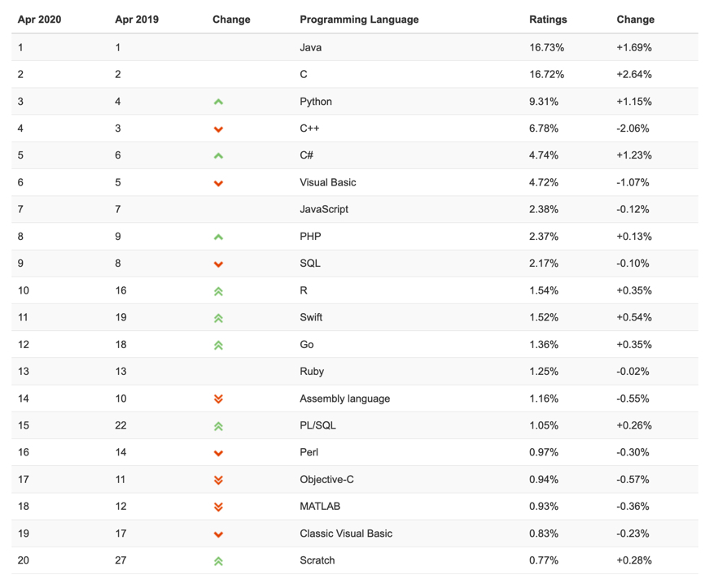
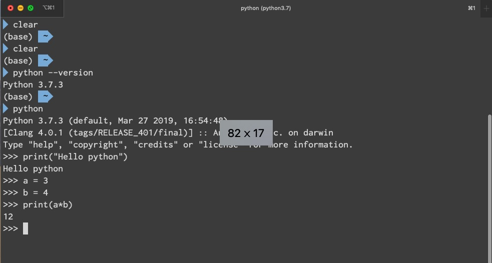
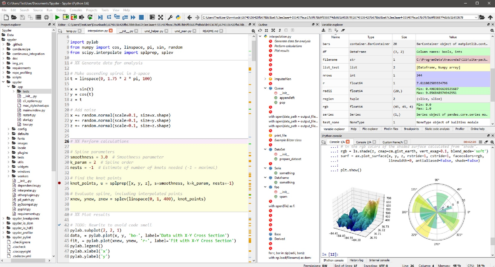
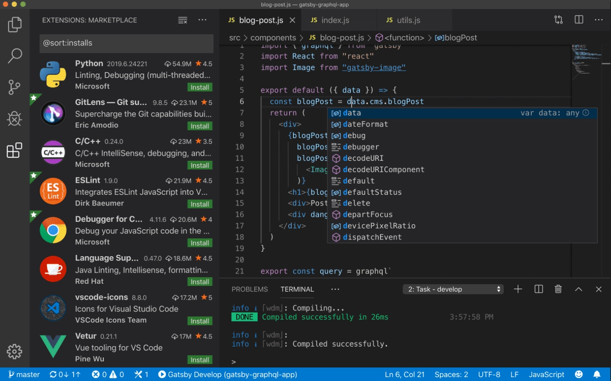
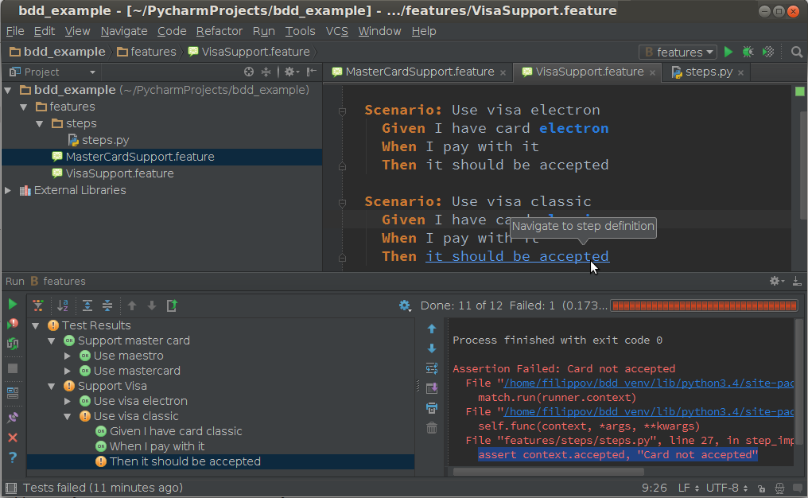
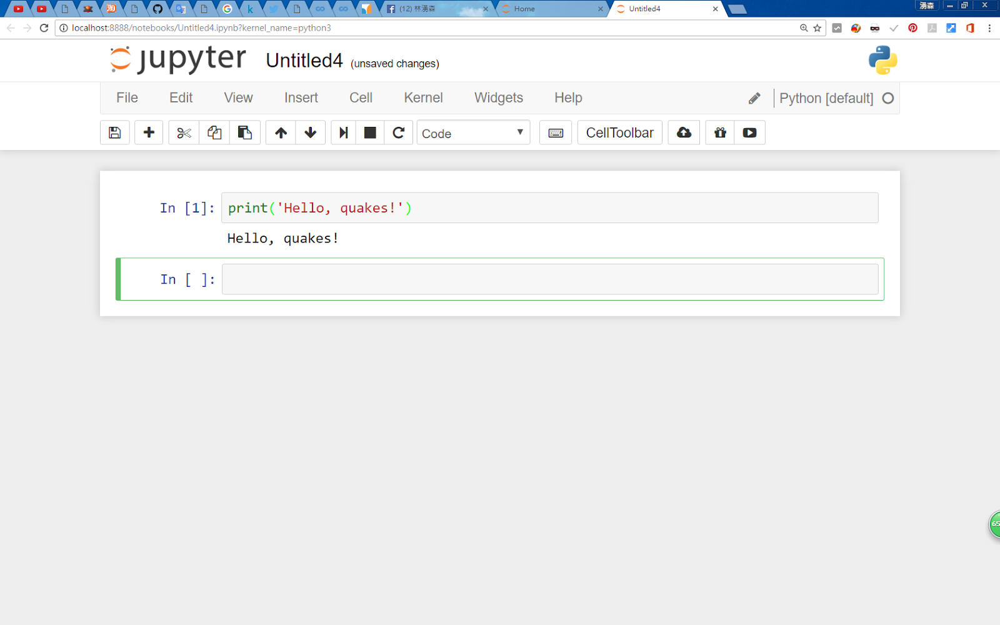
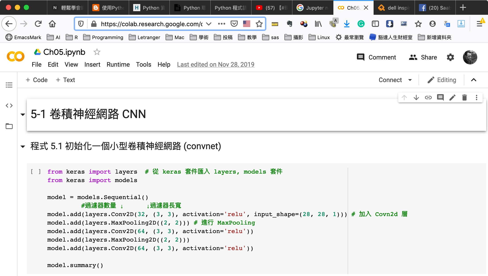
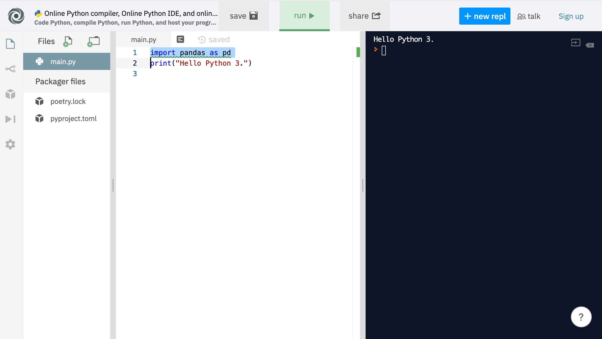
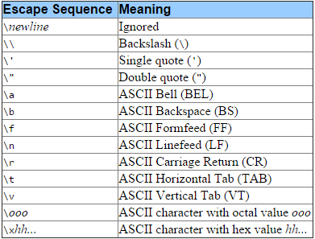
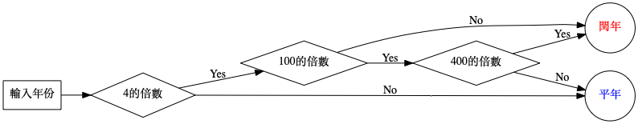

# -*- org-export-babel-evaluate: nil -*-
#+Title: Basic Materials of Python Basic

# -*- org-export-babel-evaluate: nil -*-
#+TAGS: Python, Basic
#+INCLUDE: ../web.org

* Python 簡介
:PROPERTIES:
:CUSTOM_ID: py-introduction
:END:
** What is Python
Python is an advanced *scripting language* that is being used successfully to *glue together* large software components. It spans *multiple platforms*, middleware products, and application domains. Python is an *object-oriented language* with *high-level data structures*, *dynamic typing*, and *dynamic binding*. Python has been around since 1991, and has a very active user community. For more information, see the Python website http://www.python.org.
** Python 的誕生
*** 一句話講完一部電影
- The Martian
  #+ATTR_LATEX: :width 200
  #+ATTR_HTML: :width 300
  #+ATTR_ORG: :width 300
  #+RESULTS:
  
- 一個男人在火星上種菜的故事
*** 一句話講完 Python 的誕生
- 1989 年，一個宅男工程師為了打發聖誔假期(順便打趴其他語言)、花了三個月創造了一
  種新的程式語言。[fn:1]
- [[https://zh.wikipedia.org/zh-tw/%E5%90%89%E5%A4%9A%C2%B7%E8%8C%83%E7%BD%97%E8%8B%8F%E5%A7%86][Guido van Rossum]]
  #+ATTR_LATEX: :width 200
  #+ATTR_HTML: :width 300
  #+ATTR_ORG: :width 300
  #+RESULTS:
  
- 30 年後，每天都有數百萬人使用他創立的這一新語言。
  + Python Customers
    Get access to data on [[https://trends.builtwith.com/websitelist/Python/Historical][941,453 websites]] that are Python Customers. We know of
    120,915 live websites using Python and an additional 820,538 sites that used
    Python historically and [[https://trends.builtwith.com/websitelist/Python/Taiwan][807 websites in Taiwan]]. [fn:2]
  + 依據 TOIBE 的調查，目前 Python 在[[https://www.tiobe.com/tiobe-index/][TOIBE]]最受歡迎語言的排名第三[fn:3]
    #+ATTR_LATEX: :width 400
    #+ATTR_HTML: :width 400
    #+ATTR_ORG: :width 400
    #+RESULTS:
    
  + [[https://www.youtube.com/watch?v=A_B7owR94XY][幾種不同語言受歡迎程度的變化:TIOBE 2001-2019]]
- 研究人員於 2019 年首次將 5500 萬光年之外黑洞的照片拼湊出來，使用的程式語言也是 Python。
  #+ATTR_LATEX: :width 300
  #+ATTR_HTML: :width 300
  #+ATTR_ORG: :width 300
  #+RESULTS:
  

*** Guido van Rossum 自己的說法
- ...in December 1989, I was looking for a "hobby" programming project that would keep me occupied during the week around Christmas.[fn:4]
- My office (a government-run research lab in Amsterdam) would be closed, but I had a home computer, and not much else on my hands. I decided to write an interpreter for the new [[https://zh.wikipedia.org/wiki/%E8%84%9A%E6%9C%AC%E8%AF%AD%E8%A8%80][Script language]] I had been thinking about lately: a descendant of [[https://zh.wikipedia.org/wiki/ABC_(%E7%A8%8B%E5%BC%8F%E8%AA%9E%E8%A8%80)][ABC]] that would appeal to Unix/C hackers.
- I chose Python as a working title for the project, being in a slightly irreverent mood (and a big fan of Monty Python's Flying Circus). [fn:5]

** Python 的優勢與應用
*** Advantages[fn:6]
1. Easy to learn
2. High-level language
3. User-friendly data structures
4. [[https://www.itread01.com/p/1441246.html][Dynamically typed language]](No need to mention data type based on value assigned, it takes data type)
5. Object-oriented language
6. Open source and community development
7. Presence of third-party modules
8. Extensive support libraries(NumPy for numerical calculations, Pandas for data analytics etc)
9. Portable and Interactive
10. Portable across Operating systems
*** Applications
1. GUI based desktop applications(Games, Scientific Applications)
2. Web frameworks and applications
3. Enterprise and Business applications
*** Organizations using Python
1. [[https://www.google.com/][Google]] (Components of Google spider and Search Engine)
2. [[https://www.youtube.com/channel/UCNJIEbGZaScUDsq_DMYTjYg][Youtube]]
3. [[https://www.instagram.com/][Instagram]]
4. [[https://www.netflix.com/][Netflix]]
5. [[https://www.dropbox.com/][Dropbox]]
6. [[https://www.reddit.com/][Reddit]]
7. [[https://www.uber.com/][Uber]]
8. [[https://www.pinterest.com/][Pinterest]]

#+latex:\newpage
* Python 環境建置
:PROPERTIES:
:CUSTOM_ID: py-environment
:END:
** 下載 python
- google: python download
- 網址: [[https://www.python.org/downloads/][https://www.python.org/downloads/]]
- 若為 Mac 系統，則已預載安裝 Python 2.7
- 若為 Linux 系統，則多數也預載 Python 2.x 及 3.x
- 查詢目前的 python 版本，目前官方最新版本為 3.8.2[fn:7]
  #+begin_src shell
    python --version
  #+end_src

** python 的幾種編寫環境
*** 終端機(shell, command line): interpreter
**** 執行環境
- Linux / Mac: terminal
- Windows: 命令提示字元
#+CAPTION: 命令列下執行 Python interpreter
#+ATTR_LATEX: :width 300
#+ATTR_HTML: :width 400
#+ATTR_ORG: :width 400
#+RESULTS:
    
**** 執行方式
- 啟用 Python interpreter
  #+begin_src shell -r -n :eval no
    python
  #+end_src
- 結束/回到 terminal
  + 指令
    #+begin_src shell :eval no
      exit()
    #+end_src
  + 快速鍵: Ctrl-D
- 此模式可配合文字編輯器(如[[https://www.sublimetext.com/3][Sublime Text 3]]、[[https://notepad-plus-plus.org/downloads/][Notepad++]])撰寫程式碼，若檔名為 test.py，執行該程式的方法為：於終端機下輸入
  #+begin_src shell :eval no
python test.py
  #+end_src

*** IDE(Integrated Development Environment)環境
**** [[https://www.spyder-ide.org/][Spyder]]
#+CAPTION: Spyder IDE for Python
#+name: fig:Spyder
#+ATTR_LATEX: :width 400
#+ATTR_HTML: :width 800 
#+ATTR_ORG: :width 560
#+RESULTS:

**** [[https://code.visualstudio.com/][Visual Studio Code]]
#+CAPTION: Visual Studio Code
#+name: fig:VisualStudioCode
#+ATTR_LATEX: :width 400
#+ATTR_HTML: :width 800 
#+ATTR_ORG: :width 560
#+RESULTS:

**** [[https://www.jetbrains.com/pycharm/][PyCharm]]
#+CAPTION: PyCharm
#+name: fig:PyCharm
#+ATTR_LATEX: :width 400
#+ATTR_HTML: :width 800 
#+ATTR_ORG: :width 560
#+RESULTS:

*** Web-based 環境
**** [[https://ipython.org/notebook.html][The Jupyter Notebook]]
#+CAPTION: The Jupyter Notebook
#+name: fig:JupyterNotebook
#+ATTR_LATEX: :width 400
#+ATTR_HTML: :width 800 
#+ATTR_ORG: :width 560
#+RESULTS:   

**** [[https://colab.research.google.com/][Google Colaboratory]]
#+CAPTION: The Google Colaboratory
#+name: fig:GoogleCoLab
#+ATTR_LATEX: :width 400
#+ATTR_HTML: :width 800
#+ATTR_ORG: :width 560
#+RESULTS:   

**** [[https://www.programiz.com/python-programming/online-compiler/][Python Online Compiler: repl.it]]
#+CAPTION: Repl.it
#+name: fig:ReplIt
#+ATTR_LATEX: :width 400
#+ATTR_HTML: :width 800
#+ATTR_ORG: :width 560
#+RESULTS:   

** 兩種執行模式
*** Interactive mode
**** 啟動方式
#+begin_src shell :eval no
python -i filename.py
#+end_src
**** 優點[fn:8]
- Helpful when your script is extremely short and you want immediate results.
- Faster as you only have to type a command and then press the enter key to get the results.
- Good for beginners who need to understand Python basics.
**** 缺點
- Editing the code in interactive mode is hard as you have to move back to the previous commands or else you have to rewrite the whole command again.
- It's very tedious to run long pieces of code.
*** Script Mode
**** 啟動方式
#+begin_src shell-script :eval no
python filename.py
#+end_src
**** 優點:
- It is easy to run large pieces of code.
- Editing your script is easier in script mode.
- Good for both beginners and experts.
**** 缺點:
- Can be tedious when you need to run only a single or a few lines of cod.
- You must create and save a file before executing your code.

** 安裝 Jupyter Notebook
*** Mac/Linux 系統
**** 安裝 pip
***** 檢查是否已安裝 Python 套件管理工具(命令提示字元)
#+begin_src shell
  python -m pip --version
  pip --version
#+end_src
***** 下載並安裝 pip(命令提示字元)
1. 下載 pip 安裝檔
  [[https://bootstrap.pypa.io/get-pip.py][ 點此下載get-pip.py]]
2. 執行 get-pip.py
   #+begin_src shell
     python get-pip.py
   #+end_src
3. 升級 pip
   #+begin_src shell
     pip3 install --upgrade pip
   #+end_src
**** 安裝 Jupyter(命令提示字元)
- 安裝
  #+begin_src shell
    pip install jupyter
  #+end_src
- 啟動
  #+begin_src shell
    jupyter notebook
  #+end_src
- 預設網址: http://localhost:8888
*** Windows 系統
**** 直接下載安裝[[https://www.anaconda.com/download][Anaconda]]，內建 Jupyter
*** Jupyter Notebook 基本操作
- 變更預設 port: XXXX
  #+begin_src shell
    jupyter notebook --port XXXX
  #+end_src
- 登出後重新登入：tokenk Python

#+latex:\newpage
* 變數、資料型態、輸出輸入
:PROPERTIES:
:CUSTOM_ID: py-variables
:END:
** Hello World
*** C++
#+begin_src cpp -r -n :results output :exports both
#include <iostream>
using namespace std;
int main() {
  cout << "Hellow world!";
}
#+end_src
*** Python
#+begin_src python -r -n :results output :exports both
print("Hello world!")
#+end_src

#+begin_src python -r -n :results output :exports both
print("This is a test")
#+end_src

#+RESULTS:
: This is a test
** 變數
*** 命名規則
- 由英文、數字、底線、中文(不建議)組成
- 不得以數字開頭
- 不能與 Python 內建的保留字相同

*** 範例
#+ATTR_LATEX: :options [noitemsep]
|----------------+-------|
| Example        | \checkmark / \times |
|----------------+-------|
| abc\under123        | \checkmark     |
| 3pigs          | \times     |
| Happy New Year | \times     |
| Class          | \times     |
| Good!          | \times     |
|----------------+-------|

*** 變數的指派(assign)
- Python 變數不需宣告，依指派值自動設定資料型態(dynamically typing)。
- 語法
  #+BEGIN_SRC python 
  變數名稱 = 指派值
  #+END_SRC
- 變數不再使用時，可用 del 指令將其刪除，以節省記憶體。
- 範例：

#+begin_src python -r -n :results output :exports both
a = 5
b = 3.14
c = 'TNFSH'
a = b = c = 10
name, number = 'TNFSH', 35
del c
print(name)
#+end_src
** 資料型態
*** 變數型態的判斷: type()
#+begin_src python -r -n :eval no
print(type(2020))
print(type(3.1416))
print(type('Hello world'))
#+end_src

*** 常用類型
- 整數: int
- 浮點數: float
- 布林值(True / False): bool, T 與 F 要大寫
- 字串: str, 以'或"含括,若輸出字串要包含引號，則以另一種引號含括該字串。如: 
#+begin_src python -r -n :eval no
age = 18
weight = 67.87
good_words = " 請常說'請'、'謝謝'、'對不起' "
#+end_src
- 序列型態: list, tuple
- 集合型態: set
- 對映型態: dict

*** 型態間的轉換
- 自動轉換
#+begin_src python -r -n :eval no
  score = 60 + 3.5		# 自動轉換為浮點數，結果為63.5	
#+end_src
- 強制轉換
#+begin_src python -r -n :eval no
score = int(30.22)			# 將括弧內的資料轉換為整數
score = float(score)		# 將括弧內的資料轉換為浮點數
test = str(score)				# 將括弧內的資料轉換為字串
#+end_src
** 進階輸出: print
*** 語法
 - print( 項目 1, [ 項目 2, … , sep = 分隔字元 , end = 結束字元 ] )
 - sep (分隔字元) 預設為空白字元
 - end (結束字元) 預設為換行字元\n 
*** 範例
#+begin_src python -r -n :results output :exports both
a, b = 5, 10
print(a, b)
print(a, b, sep =',')
print(a, b, sep ='分隔')
print(a, b, end='\r')
print(a, b, end='\r\n')
print(a, b, end='\t')
print(a, b, end='')
#+end_src

#+RESULTS:
: 5 10
: 5,10
: 5 分隔 10
: 5 10
5 10
: 5 10	5 10
*** 跳脫字元
#+CAPTION: Escape char
#+name: fig:EscapeCharMap
#+ATTR_LATEX: :width 400
#+ATTR_HTML: :width 400
#+ATTR_ORG: :width 400
#+RESULTS:

[[https://www.itread01.com/content/1545069543.html][CRLF、CR、LF詳解]]
*** 格式化輸出: % (舊版)
- 語法
  + 格式化輸出語法：print( 字串  %(參數) )

  + 字串裡 %s 代表字串、%d 代表整數、%f 代表浮點數

- 範例
  #+begin_src python -r -n :results output :exports both
name = '台北101'
height = 508
fee = 18.24
print('%s的高度為%d公尺，參觀門票為%8.2f美金.' %(name, height, fee))
print('%s的高度為%d公尺，參觀門票為%0.2f美金.' %(name, height, fee))
  #+end_src

  #+RESULTS:
  : 台北 101 的高度為 508 公尺，參觀門票為   18.24 美金.
  : 台北 101 的高度為 508 公尺，參觀門票為 18.24 美金.
*** 格式化輸出: format() (新版)
- 語法 
  + format 格式化輸出語法：print(字串.format (參數) )

  + 字串裡以{0}、{1}、... 來對應參數列裡的變數

- 範例
#+begin_src python -r -n :results output :exports both
name = 'Taipei101'
height = 508.35
print('{0}的高度為{1}公尺'.format (name, height))
print('{0:15s}的高度為{1:10.1f}公尺'.format (name, height))
print('{building}的高度為{height}'.format(building=name, height=height))
#+end_src

  #+RESULTS:
  : Taipei101 的高度為 508.35 公尺
  : Taipei101      的高度為     508.4 公尺
  : Taipei101 的高度為 508.35
*** 格式化輸出: Template
#+begin_src python -r -n :results output :exports both
from string import Template

name = 'TNFSH'
tmp = Template('Hello, $who')
print(tmp.substitute(who = name))

#+end_src

#+RESULTS:
: Hello, TNFSH
*** 進階閱讀
- [[https://blog.techbridge.cc/2019/05/03/how-to-use-python-string-format-method/][如何使用 Python 進行字串格式化]]
** 進階輸出: f-string
Python 3.6起增加的新字串格式化功能，可以把Python運算式嵌入在字串裡，由於f-string轉換時會做最佳化，其速度會比前面的文字格式化稍稍快一點。
#+begin_src python -r -n :results output :exports both
name = 'James'
age = 19
print(f'{name} is {age} years old now')
x, y = 3, 5
print(f'{x} * {y} = {x*y}')
#+end_src

#+RESULTS:
: James is 19 years old now
: 3 * 5 = 15
** 輸入
*** 語法/範例
- 語法
  #+begin_src python -r -n :results both :eval no
    variable = intpu([提示字元])
  #+end_src
- PS: 經由 input( )函式讀入的資料，其資料型態皆為字串

- 範例
  #+begin_src python -r -n  :eval no
    a = input('輸入國文成績:')
    b = input('輸入數學成績:')
    c = input()
    print('三科成績分別為%5s %5s %5s' %(a, b, c))
  #+end_src

*** 輸入搭配型別轉換
#+begin_src python -r -n :eval no
  a = int(input('輸入國文成績:'))
  b = int(input('輸入數學成績:'))
  c = int(input())
  print('總分為%5d' %(a+b+c))
#+end_src

*** input 注意事項
- input 每筆輸入讀至換行符號為止
- 若測試資料輸入以空白間隔，則讀入整行字串後，
再以字串分割處理
  #+begin_src python -r -n :results output :exports both
    inp = input()
    inpstr = inp.split()
    # 依此類推逐一取得輸入值
    a = int(inpstr[0])
    b = int(inpstr[1])
    c = int(inpstr[2])
  #+end_src
** 註解
- 語法
  + 單行註解：以 # 開頭
  + 多行註解：前後以  '''  或  """  含括
- 範例
  #+begin_src python -r -n :results output :exports both
    ## 這是單行註解
    int a = 3
    '''
    這是多行註解
    LALALA
    '''
    print(a)
    """
    這也是
    """
  #+end_src

#+latex:\newpage
* 運算元與運算式
:PROPERTIES:
:CUSTOM_ID: py-operation
:END:
** 算術運算
- +: 加
- -: 減
- *: 乘
- /: 除
- %: 取餘數
- //: 求商
- **: 指數
*** 算術運算範例#1
 #+BEGIN_SRC python -r -n :results output :exports both
   # python code for arithematic opearation
   print(5+3)
   print(5-3)
   print(5*3)
   print(5/3)
   print(5%3)
   print(5//3)
   print(5**3)
 #+END_SRC

 #+RESULTS:
 : 8
 : 2
 : 15
 : 1.6666666666666667
 : 2
 : 1
 : 125

*** 算術運算範例#2
#+NAME: 計算機
#+BEGIN_SRC python -r -n :results output :exports both
  a = int(input("input a: "))
  op = input("input op: ")
  b = int(input("input b: "))

  if op == '+':
      ans = a + b;
  elif op == '-':
      ans = a - b;
  elif op == '*':
      ans = a * b;
  elif op == '/':
      ans = a / b;
  elif op == '%':
      ans = a % b;

  print(str(a) + op + str(b) + "=" + str(ans))
#+END_SRC

*** 字串運算
#+begin_src python -r -n :results output :exports both
print("Python"+"基䂾")
print(3*"Python基礎")
#+end_src

#+RESULTS:
: Python 基䂾
: Python 基礎 Python 基礎 Python 基礎
** 關係運算子
|------+------+----------+----------+------+--------|
| >    | <    | >=       | <=       | ==   | !=     |
|------+------+----------+----------+------+--------|
| 大於 | 小於 | 大於等於 | 小於等於 | 等於 | 不等於 |
|------+------+----------+----------+------+--------|
** 邏輯運算子
|---------------+----------------+----------|
| and           | or             | not      |
|---------------+----------------+----------|
| (a>b) and (a<c) | (a>b) or (a==b)  | not (a>b) |
|---------------+----------------+----------|
** 複合指定運算子
|----+----+----+----+----+-----+-----|
| += | -= | *= | /= | %= | //= | **= |
|----+----+----+----+----+-----+-----|
** 指派運算子
Assignment expression, Python 3.8起加入的新功能，其功能是指派值或運算式的結果給變數、接著傳回該變數的值。
以下列程式為例，原本要每次都輸入一個值，判斷其值是否為0，再決定是否繼續下去。
#+begin_src python -r -n :results output :exports both
a = int(input())
while a != 0:
    print(f'value: {a}')
    a = int(input())
#+end_src
若改為assignment(:=)，則可以寫為
#+begin_src python -r -n :results output :exports both
# 這個要再測試
while a := int(input()):
    print(f'value: {a}')
#+end_src
** 實作練習
- [[http://skyoj.tnfsh.tn.edu.tw/sky/index.php/problem/view/161/][skyoj #161華氏溫度轉攝氏溫度]]
- [[http://skyoj.tnfsh.tn.edu.tw/sky/index.php/problem/view/277/][skyoj #277. 一元二次方程式求解]]

#+latex:\newpage
* 內建函數
:PROPERTIES:
:CUSTOM_ID: py-build-in-functions
:END:
** 基本函數與運算子
- ord(): 傳回某字元的 ASCII code /Unicode
#+begin_src python -r -n :results output :exports both
print(ord('A'))
print(ord('©'))
#+end_src
  #+RESULTS:
  : 65
  : 169
- chr(): 傳回某 ASCII/Unicode 所代表的字元
#+begin_src python -r -n :results output :exports both
print(chr(97))
print(chr(169))
#+end_src
#+RESULTS:
: a
: ©
- len(): 傳回字串長度
#+begin_src python -r -n :results output :exports both
print(len('Python基礎'))
#+end_src

#+RESULTS:
: 8

- max()/min(): 傳回字串 Unicode 最大/最小字元
#+begin_src python -r -n :results output :exports both
print(max('Python基礎'))
print(min('Python基礎'))
#+end_src

#+RESULTS:
: 礎
: P

- str(): 將數值參數轉為字串
#+begin_src python -r -n :results output :exports both
print(str(3.1416) + str(2020))
#+end_src

#+RESULTS:
: 3.14162020
** 字串處理函數
*** 字串轉換函數
- str.upper(): 將字串 s 所有字元轉成大寫
#+begin_src python -r -n :results output :exports both
s = 'To be or not to BE'
print(s.upper())
#+end_src

#+RESULTS:

- str.lower(s): 將字串 s 所有字元轉成小寫
#+begin_src python -r -n :results output :exports both
s = 'To be or not to BE'
print(s.lower())
#+end_src

#+RESULTS:
: to be or not to be

- str.swapcase(s): 將字串 s 大小寫互換
#+begin_src python -r -n :results output :exports both
s = 'To be or not to BE'
print(s.swapcase())
#+end_src

#+RESULTS:
: tO BE OR NOT TO be

- str.capitalize(s): 首字大寫
#+begin_src python -r -n :results output :exports both
s = 'To be or not to BE'
print(s.capitalize())
#+end_src

#+RESULTS:
: To be or not to be

- str.title(s): 每個單字的第一個字元大寫
#+begin_src python -r -n :results output :exports both
s = 'To be or not to BE'
print(s.title())
#+end_src

#+RESULTS:
: To Be Or Not To Be

- str.replace(old, new): 置換子字串
#+begin_src python -r -n :results output :exports both
s = 'To be or not to BE'
print(s.replace('be', 'die'))
#+end_src

#+RESULTS:
: To die or not to BE

*** 字串測試函數
- str.isupper(): 是否整段字串均為大寫英文字母
#+begin_src python -r -n :results output :exports both
s = 'To be or not to BE'
print(s.isupper())
print("PYTHON".isupper())
#+end_src

#+RESULTS:
: False
: True

- str.islower()
#+begin_src python -r -n :results output :exports both
s = 'To be or not to BE'
print(s.islower())
print("python".islower())
#+end_src

#+RESULTS:
: False
: True

- str.isidentifier(): 是否為合法的識別字(含關鍵字)
#+begin_src python -r -n :results output :exports both
print("while".isidentifier())
print("computer".isidentifier())
print("-_-".isidentifier())
#+end_src

#+RESULTS:
: True
: True
: False

- str.isalpha(): 字串是否只包含英文
#+begin_src python -r -n :results output :exports both
Print("Abcdxyz".Isalpha())
Print("1a2b".Isalpha())
#+End_src

#+Results:
: True
: False

- str.isdecimal(), str.isdigit(), str.isnumeric(): 字串是否為數字[fn:9]以涵蓋範圍論，isdecimal() ⊆ isdigit() ⊆ isnumeric()，即，若一字串為 decimal，則一定也是 digit 和 numeric。
- isdigit()
  - True: Unicode 數字，byte 數字（單位元組），全形數字（雙位元組），羅馬數字
  - False: 漢字數字
  - Error: 無
- isdecimal()
  - True: Unicode 數字，，全形數字（雙位元組）
  - False: 羅馬數字，漢字數字
  - Error: byte 數字（單位元組）
- isnumeric()
  - True: Unicode 數字，全形數字（雙位元組），羅馬數字，漢字數字
  - False: 無
  - Error: byte 數字（單位元組）
- Some examples of characters isdecimal()==True [fn:10]
  1. "0123456789"  DIGIT ZERO~NINE
  1. "٠١٢٣٤٥٦٧٨٩"  ARABIC-INDIC DIGIT ZERO~NINE
  1. "०१२३४५६७८९"  DEVANAGARI DIGIT ZERO~NINE
  1. "০১২৩৪৫৬৭৮৯"  BENGALI DIGIT ZERO~NINE
  1. "੦੧੨੩੪੫੬੭੮੯"  GURMUKHI DIGIT ZERO~NINE
  1. "૦૧૨૩૪૫૬૭૮૯"  GUJARATI DIGIT ZERO~NINE
  1. "୦୧୨୩୪୫୬୭୮୯"  ORIYA DIGIT ZERO~NINE
  1. "௦௧௨௩௪௫௬௭௮௯"  TAMIL DIGIT ZERO~NINE
  1. "౦౧౨౩౪౫౬౭౮౯"  TELUGU DIGIT ZERO~NINE
  1. "೦೧೨೩೪೫೬೭೮೯"  KANNADA DIGIT ZERO~NINE
  1. "൦൧൨൩൪൫൬൭൮൯"  MALAYALAM DIGIT ZERO~NINE
  1. "๐๑๒๓๔๕๖๗๘๙"  THAI DIGIT ZERO~NINE
  1. "໐໑໒໓໔໕໖໗໘໙"  LAO DIGIT ZERO~NINE
  1. "༠༡༢༣༤༥༦༧༨༩"  TIBETAN DIGIT ZERO~NINE
  1. "၀၁၂၃၄၅၆၇၈၉"  MYANMAR DIGIT ZERO~NINE
  1. "០១២៣៤៥៦៧៨៩"  KHMER DIGIT ZERO~NINE
  1. "０１２３４５６７８９"  FULLWIDTH DIGIT ZERO~NINE
- Some examples of characters isdecimal()==False but isdigit()==True
  1. "⁰¹²³⁴⁵⁶⁷⁸⁹"  SUPERSCRIPT ZERO~NINE
  1. "₀₁₂₃₄₅₆₇₈₉"  SUBSCRIPT ZERO~NINE
  1. "🄀⒈⒉⒊⒋⒌⒍⒎⒏⒐"  DIGIT ZERO~NINE FULL STOP
  1. "🄁🄂🄃🄄🄅🄆🄇🄈🄉🄊"  DIGIT ZERO~NINE COMMA
  1. "⓪①②③④⑤⑥⑦⑧⑨"  CIRCLED DIGIT ZERO~NINE
  1. "⓿❶❷❸❹❺❻❼❽❾"  NEGATIVE CIRCLED DIGIT ZERO~NINE
  1. "⑴⑵⑶⑷⑸⑹⑺⑻⑼"  PARENTHESIZED DIGIT ONE~NINE
  1. "➀➁➂➃➄➅➆➇➈"  DINGBAT CIRCLED SANS-SERIF DIGIT ONE~NINE
  1. "⓵⓶⓷⓸⓹⓺⓻⓼⓽"  DOUBLE CIRCLED DIGIT ONE~NINE
  1. "➊➋➌➍➎➏➐➑➒"  DINGBAT NEGATIVE CIRCLED SANS-SERIF DIGIT ONE~NINE
  1. "፩፪፫፬፭፮፯፰፱"  ETHIOPIC DIGIT ONE~NINE
- Some examples of characters isdecimal()==False and isdigit()==False but isnumeric()==True
  1. "½⅓¼⅕⅙⅐⅛⅑⅒⅔¾⅖⅗⅘⅚⅜⅝⅞⅟↉"  VULGAR FRACTION
  1. "৴৵৶৷৸৹"  BENGALI CURRENCY NUMERATOR
  1. "௰௱௲"  TAMIL NUMBER TEN, ONE HUNDRED, ONE THOUSAND
  1. "౸౹౺౻౼౽౾"  TELUGU FRACTION DIGIT
  1. "൰൱൲൳൴൵"  MALAYALAM NUMBER, MALAYALAM FRACTION
  1. "༳༪༫༬༭༮༯༰༱༲"  TIBETAN DIGIT HALF ZERO~NINE
  1. "፲፳፴፵፶፷፸፹፺፻፼"  ETHIOPIC NUMBER TEN~NINETY, HUNDRED, TEN THOUSAND
  1. "៰៱៲៳៴៵៶៷៸៹"  KHMER SYMBOL LEK ATTAK
  1. "ⅠⅡⅢⅣⅤⅥⅦⅧⅨⅩⅪⅫⅬⅭⅮⅯ"  ROMAN NUMERAL
  1. "ⅰⅱⅲⅳⅴⅵⅶⅷⅸⅹⅺⅻⅼⅽⅾⅿ"  SMALL ROMAN NUMERAL
  1. "ↀↁↂↅↆ"  ROMAN NUMERAL
  1. "⑩⑪⑫⑬⑭⑮⑯⑰⑱⑲⑳㉑㉒㉓㉔㉕㉖㉗㉘㉙㉚㉛㉜㉝㉞㉟㊱㊲㊳㊴㊵㊶㊷㊸㊹㊺㊻㊼㊽㊾㊿"  CIRCLED NUMBER TEN~FIFTY
  1. "㉈㉉㉊㉋㉌㉍㉎㉏"  CIRCLED NUMBER TEN~EIGHTY ON BLACK SQUARE
  1. "⑽⑾⑿⒀⒁⒂⒃⒄⒅⒆⒇"  PARENTHESIZED NUMBER TEN~TWENTY
  1. "⒑⒒⒓⒔⒕⒖⒗⒘⒙⒚⒛"  NUMBER TEN~TWENTY FULL STOP
  1. "⓫⓬⓭⓮⓯⓰⓱⓲⓳⓴"  NEGATIVE CIRCLED NUMBER ELEVEN
  1. "⓾➉❿➓"  various styles of CIRCLED NUMBER TEN
  1. "🄌"  DINGBAT NEGATIVE CIRCLED SANS-SERIF DIGIT ZERO
  1. "〇"  IDEOGRAPHIC NUMBER ZERO
  1. "〡〢〣〤〥〦〧〨〩〸〹〺"  HANGZHOU NUMERAL ONE~TEN, TWENTY, THIRTY
  1. "㆒㆓㆔㆕"  IDEOGRAPHIC ANNOTATION ONE~FOUR MARK
  1. "㈠㈡㈢㈣㈤㈥㈦㈧㈨㈩"  PARENTHESIZED IDEOGRAPH ONE~TEN
  1. "㊀㊁㊂㊃㊄㊅㊆㊇㊈㊉"  CIRCLED IDEOGRAPH ONE~TEN
  1. "一二三四五六七八九十壹貳參肆伍陸柒捌玖拾零百千萬億兆弐貮贰㒃㭍漆什㐅陌阡佰仟万亿幺兩㠪亖卄卅卌廾廿"  CJK UNIFIED IDEOGRAPH
  1. "參拾兩零六陸什"  CJK COMPATIBILITY IDEOGRAPH

#+begin_src python -r -n :results output :exports both
print("4".isdecimal())
print("4".isdigit())
print("4".isnumeric())
print("Ⅳ".isdecimal())
print("Ⅳ".isdigit())
print("Ⅳ".isnumeric())
print("四".isdecimal())
print("四".isdigit())
print("四".isnumeric())
#+end_src

#+RESULTS:
: True
: True
: True
: False
: False
: True
: False
: False
: True

- str.isspace(): 字串是否為空白
- str.istitle(): 字串是否每個單字

*** 搜尋子字串函數
- str.count(s): 傳回字串中出現 s 的次數
#+begin_src python -r -n :results output :exports both
x = "HIHI Python"
print(x.count('HI'))
#+end_src

#+RESULTS:
: 2

- str.startswith(s): 字串是否以 s 開頭
#+begin_src python -r -n :results output :exports both
x = 'HIHI Python'
print(x.startswith('HI'))
print(x.startswith('python'))
#+end_src

#+RESULTS:
: True
: False

- str.endswith(s): 字串是否以 s 結尾
#+begin_src python -r -n :results output :exports both
x = 'HIHI Python'
print(x.endswith('HI'))
print(x.endswith('python'))
#+end_src

#+RESULTS:
: False
: False

- str.find(s): s 在字串中的位置(找到的第一個)
#+begin_src python -r -n :results output :exports both
x = 'HIHI Python'
print(x.find('HI'))
print(x.find('Python'))
print(x.find('python'))
#+end_src

#+RESULTS:
: 0
: 5
: -1

- str.rfind(s): s 在字串中的位置(找到的最後一個)
#+begin_src python -r -n :results output :exports both
x = 'HIHI Python'
print(x.rfind('HI'))
print(x.rfind('Python'))
print(x.rfind('python'))
#+end_src

#+RESULTS:
: 2
: 5
: -1

*** 切割/刪除字串
- str.split([chars]): 從整個字串中根據 chars 來切割，若省略 chars 則以空白進行切割
#+begin_src python -r -n :results output :exports both
x = 'To be or not to be.'
print(x.split())
print(x.split('be'))
#+end_src

#+RESULTS:
: ['To', 'be', 'or', 'not', 'to', 'be.']
: ['To ', ' or not to ', '.']

- str.strip([chars]): 由字串*兩側*刪除 chars，若省略 chars 則以空白進行切割
#+begin_src python -r -n :results output :exports both
x = '  Cogito, ergo sum   '
print(x.strip())
print('ABCDEDCBA'.strip('A'))
#+end_src

#+RESULTS:
: Cogito, ergo sum
: BCDEDCB

- str.lstrip([chars]): 由字串*左側*刪除 chars，若省略 chars 則以空白進行切割
- str.rstrip([chars]): 由字串*右側*刪除 chars，若省略 chars 則以空白進行切割

*** 格式化函數
- str.center(width): 傳回欄位索度為 width 所指定的置中字串
#+begin_src python -r -n :results output :exports both
s = '**'
x = 'Hello python'
print(s + x.center(20) + s)
#+end_src

#+RESULTS:
: **    Hello python    **

- str.ljust(width): 傳回欄位索度為 width 所指定的靠左字串
#+begin_src python -r -n :results output :exports both
s = '**'
x = 'Hello python'
print(s + x.ljust(20) + s)
#+end_src

#+RESULTS:
: **Hello python        **

- str.rjust(width): 傳回欄位索度為 width 所指定的靠右字元
#+begin_src python -r -n :results output :exports both
s = '**'
x = 'Hello python'
print(s + x.rjust(20) + s)
#+end_src

#+RESULTS:
: **        Hello python**

- str.zfill(width): 左側填零
#+begin_src python -r -n :results output :exports both
s = '**'
x = 'Hello python'
print(s + x.zfill(20) + s)
#+end_src

#+RESULTS:
: **00000000Hello python**

- str.format(spec): 設定欄位寬度與對齊方式
#+begin_src python -r -n :results output :exports both
s = '**'
x = 'Hello python'
print(s + format(x, '20') + s)
print(s + format(x, '>20') + s)
print(s + format(x, '<20') + s)
#+end_src

#+RESULTS:
: **Hello python        **
: **        Hello python**
: **Hello python        **
** 數值處理函數
- abs(x)
- min(x1, x2 [, x3...])
- max(x1, x2 [, x3...])
- pow(x, y)
- divmod(x, y)
** 作業
*** 小編日常
**** solution :noexport:
#+begin_src python -r -n :results output :exports both
words = "Pen Pie Pineapple Apple Pen"
# words = input()
print(words.lower().capitalize())
#+end_src
*** 小編日常二
**** solution #1 :noexport:
#+begin_src python -r -n :results output :exports both
words = "He has resigned from the position of chairperson."
print(words.lower().replace(" does ", " did ").replace(" has "," had ").replace(" have "," had ").replace(" do "," did ").replace(".","!").replace("she ","I ").replace("he ","I ").capitalize())
#+end_src
**** solution #2 :noexport:
#+begin_src python -r -n :results output :exports both
import re
words = "He has resigned from the position of chairperson."
words = words.lower()
words = re.sub(r"\bhe\b","I", words)
words = re.sub(r"\bshe\b","I", words)
words = re.sub(r"\bhas\b","had", words)
words = re.sub(r"\bhave\b","had", words)
words = re.sub(r"\bdo\b","did", words)
words = re.sub(r"\bdoes\b","did", words)
words = words.replace(".","!")
words = words.capitalize()
print(words)
#+end_src

*** 資安檢查
**** solution :noexport:
#+begin_src python -r -n :results output :exports both
urls = "https://www.google.com.tw"
ok = False
if urls.startswith("https://") and urls.endswith("tn.edu.tw"):
    ok = True
if urls.endswith("tnfsh.tn.edu.tw"):
    if urls.startswith("http://") or urls.startswith("https://"):
        ok = True
if ok:
    print("OK.")
else:
    print("Invalid web site URL!")
#+end_src

#+latex:\newpage
* 判斷結構
:PROPERTIES:
:CUSTOM_ID: py-if-else
:END:
** if
*** 語法
- 條件式可不用括號( )含括，條件式後需搭配冒號：
- 程式區塊以縮排方式處理，同一層縮排視為同一程式區塊

#+BEGIN_SRC python -r -n :eval no
  if condition:
      statement 1
      ...
#+END_SRC

*** 範例
 #+BEGIN_SRC python -r -n :results output :exports both
   num = 31
   if num % 2 == 0:
       print('%d is even' %(num))
   if num % 2 == 1:
       print('%d is odd' %(num))
#+END_SRC

#+RESULTS:
: 31 is odd

** if ... else ...
*** 語法
#+BEGIN_SRC python -r -n :eval no
  if condition:
      statement 1
      ...
  else:
      statement 3
      ...
#+END_SRC

*** 範例
#+BEGIN_SRC python -r -n :results output :exports 
  num = 32
  if num % 2 == 0:
      print('%d is even' %(num))
  else:
      print('%d is odd' %(num))
#+END_SRC

#+RESULTS:
: 32 is even

** if ... elif ... else ...
*** 語法
#+BEGIN_SRC python -r -n :eval no
  if condition 1:
      statement 1
      ...
  elif condition 2:
      statement 3
      ...
  elif condition 3:
      statement 5
      ...
  else:
      statement N
#+END_SRC

*** 範例
#+BEGIN_SRC python -r -n :results output :exports 
  score = 87
  if score >= 90:
      print('A')
  elif score >= 80:
      print('B')
  elif score >= 70:
      print('C')
  elif score >= 60:
      print('D')
  else:
      print('F')
#+END_SRC

#+RESULTS:
: B

** 巢狀 if
*** 語法
#+BEGIN_SRC python -r -n :eval no
  if condition 1:
      statement 1
      ...
      if condition 2:
          statement 3
          ...
      else:
          statement 5
          ...
  else:
      if conditi6on 3:
          statement 7
          ...
      else:
          statement N
          ...
#+END_SRC

*** 範例: 某年份是否為閏年
#+BEGIN_SRC dot :file ./YearJudge.png :cmdline -Kdot -Tpng :noexport:
  digraph TLS{
    rankdir=LR;
    x1[shape=box, labeVisualStudioCodel = "輸入年份"];
    x2[shape=diamond, label = "4的倍數"];
    x3[shape=diamond, label = "100的倍數"];
    x4[shape=diamond, label = "400的倍數"];
    xY[shape=circle, fontcolor=Red, label="閏年"]
    xN[shape=circle, fontcolor=Blue, label="平年"]

    x1 -> x2; 
    x2 -> xN[label="No"]; x2 -> x3[label="Yes"];
    x3 -> xY[label="No"]; x3 -> x4[label="Yes"]; 
    x4 -> xN[label="No"]; x4 -> xY[label="Yes"]; 
  }
#+END_SRC
#+CAPTION: 閏年判斷流程
#+name: fig:YearJudge
#+ATTR_LATEX: :width 400
#+ATTR_HTML: :width 560
#+ATTR_ORG: :width 560
#+RESULTS:

*** code #1
#+BEGIN_SRC python :session :exports both :tangle input.py
  year = int(input("請輸入一個年份:"))
  if (year % 4) == 0:
      if (year % 100) == 0:
          if (year % 400) == 0:
              print("%s年是世紀閏年" % year)
          else:
              print("%s年為平年" % year)
      else:
          print("%s年是普通閏年" % year)
  else:
      print("%s年為平年" % year)
#+END_SRC

*** code #2
#+BEGIN_SRC python :session :exports both :tangle input.py
  year = int(input("請輸入一個年份:"))
  if (year % 4) == 0 and (year % 100) !=0 or (year % 400) == 0:
      print("%s年是閏年" % year)
  else:
      print("%s年為平年" % year)
#+END_SRC

** 實作練習
- [[http://skyoj.tnfsh.tn.edu.tw/sky/index.php/problem/view/162/][skyoj #162 成績等第判別]]
- [[http://skyoj.tnfsh.tn.edu.tw/sky/index.php/problem/view/164/][skyoj #164 獎金給多少]]
- [[http://skyoj.tnfsh.tn.edu.tw/sky/index.php/problem/view/278/][skyoj #278 三角關係]]

** 作業
*** [[https://moodle.tnfsh.tn.edu.tw/mod/vpl/view.php?id=1870][5D. No one is perfect]]
**** solution 1 :noexport:
#+begin_src python -r -n :results output :exports both
import sys
##x = int(input())
##y = int(input())
x = 20
y = 200

for n in range(x, y+1):
    sum = 0
    for i in range(1, n):
        if n % i == 0:
            sum += i
    if sum == n:
        print(sum)
        sys.exit()
print("No one is perfect")
#+end_src

#+RESULTS:
: 28

#+latex:\newpage
**** solution 2 :noexport:
#+begin_src python -r -n :results output :exports both
import sys
##x = int(input())
##y = int(input())
x = 29
y = 10000

for n in range(x, y+1):
    sum = 0
    for i in range(1, n):
        if n % i == 0:
            sum += i
    if sum == n:
        print(sum)
        break;
else:
    print("No one is perfect")
#+end_src

#+RESULTS:
: 496

#+latex:\newpage
* 迴圈結構
:PROPERTIES:
:CUSTOM_ID: py-for-loop
:END:
** for
*** 語法
#+BEGIN_SRC python -r -n :eval no
  for variable in sequence:
      statement 1
      ...
#+END_SRC
- for 迴圈的變數會依序走訪 sequence 中的元素
- sequence[fn:11]可為 range 函式、字串(string)、表列(list)、元組(tuple)、字典(dict)、集合(set)

*** List 為 range() function 語法
#+BEGIN_SRC python :exports both :eval no 
  for variable in range([起始值,] 終止值 [,遞增值]):
      statement 1
      ...
#+END_SRC
- 起始值預設為 0，遞增值預設為 1
- 起始值 ≤ range( )的範圍 < 終止值

*** List 為 range() function 語法
#+BEGIN_SRC python -r -n :results output :exports both
for x in range(4):
    print(x)
print('========')
for x in range(3, 10):
    print(x, end=', ')
print('\n========')
for x in range(3, 10, 2):
    print(x, end=',')
#+END_SRC

#+RESULTS:
: 0
: 1
: 2
: 3
: ========
: 3, 4, 5, 6, 7, 8, 9,
: ========
: 3,5,7,9,

*** List 為 String
#+BEGIN_SRC python -r -n :results output :exports both:eval no 
school = 'TNFSH'
for x in school:
    print(x, end=' ')
print('\n=========')
for x in school:
    print(chr(ord(x)+1), end=' ')
#+END_SRC

#+RESULTS:
: T N F S H 
: =========
: U O G T I 

- ord( ) -> 將字元轉為 [[https://zh.wikipedia.org/wiki/ASCII][ASCII]] 編碼(整數)
- chr( ) -> 將 ASCII 編碼(整數)轉為字元

#+begin_src python -r -n :results output :exports both
school = '高雄市'
for x in school:
    print(x, end=' ')
print('\n=========')
for x in school:
    print(chr(ord(x)+1), end=' ')

#+end_src

#+RESULTS:
: 高 雄 市
: =========
: 髙 雅 布

*** 課堂練習
以 FOR 輸出以下字串
: abcdefghijklmnopqrstuvwxyz
: zyxwvutsrqponmlkjihgfedcba

** while
*** 語法
#+BEGIN_SRC python :exports both :eval no 
  while (condition):
      statement 1
      ...
#+END_SRC

*** 範例
#+BEGIN_SRC python -r -n :results output :exports both
  n = 12345
  while (n > 0):
      print(n%10)
      n //= 10
#+END_SRC

#+RESULTS:
: 5 
: 4
: 3
: 2
: 1

#+NAME:最大公因數
#+BEGIN_SRC python -r -n :results output :exports both
  m, n = 42, 75
  while (n > 0):
      m, n = n, m % n
  print(m)
#+END_SRC

#+RESULTS:
: 3

** break
跳出整個 loop
*** 範例
#+BEGIN_SRC python -r -n :results output :exports both
  for letter in 'Python':
      if letter == 'h':
          print('Now stop...')
          break
      print('Processing Letrer:', letter)
#+END_SRC

#+RESULTS:
: Processing Letrer: P
: Processing Letrer: y
: Processing Letrer: t
: Now stop...
*** 練習
Given a positive integer N. The task is to write a Python program to check if the number is prime or not.
- Definition:
  A prime number is a natural number greater than 1 that has no positive divisors other than 1 and itself. The first few prime numbers are {2, 3, 5, 7, 11, ….}.
- Examples :
#+BEGIN_EXAMPLE
Input:  11
Output: true
Input:  15
Output: false
Input:  1
Output: false
#+END_EXAMPLE

** continue
跳出單次 loop
*** 範例
#+BEGIN_SRC python -r -n :results output :exports both
  for letter in 'Python':
      if letter == 'h':
          print('Now skip...')
          continue
      print('Processing Letrer:', letter)
#+END_SRC

#+RESULTS:
: Processing Letrer: P
: Processing Letrer: y
: Processing Letrer: t
: Now skip...
: Processing Letrer: o
: Processing Letrer: n
*** 練習
Given a string. Print all letters in this string except 'N' and 'S'.
- Example:
#+BEGIN_EXAMPLE
Input: TNFSH
Output: TFH
#+END_EXAMPLE

**** solution :noexport:
#+begin_src python -r -n :results output :exports both
for letter in 'TNFSH':
    if letter in ['N', 'S']:
        continue
    print(letter, end='')
#+end_src

** for / while + else
Python 一個十分有趣的 loop 語法是它能配合 else 來用，語法如下：
#+begin_src python -r -n :results output :exports both
for n in ...:
    if condition is true:
        ....
        break
else:
    print("all condition is false")
#+end_src
如果上述的 for 迴圈從頭到尾都沒有去跑過 break(也就是說 condition 都不成立，for 正常結束)，那麼 else 裡的程式碼就會被執行。那麼，何時會用到這個有趣的語法呢？

以質數判斷為例：原本的寫法為:
#+begin_src python -r -n :results output :exports both
n = 22
isPrime = True
for x in range(2, n//2 + 1):
    if n % x == 0:
        isPrime = False
        print("Composite Number!")
        break
if isPrime:
    print("Prime number")
#+end_src

#+RESULTS:
: Composite Number!

套用 else 後則可改為
#+begin_src python -r -n :results output :exports both
n = 23
for x in range(2, n//2 + 1):
    if n % x == 0:
        print("Composite Number!")
        break
else:
    print("Prime number")

#+end_src

#+RESULTS:
: Prime number

當我們要在 for/while 內佈署一些條件判斷(如果條件成立就 break，例如，判斷某數是否為質數)，如果找到因數，則臢
*** reading: [[https://note.pcwu.net/2017/02/26/python-loop-else/][[Python] Loop 配合 else 的妙用]]

** 巢狀迴圈
*** 範例
#+BEGIN_SRC python -r -n :results output :exports both
for i in range(1, 10):
    for j in range(1, 10):
        print('%d*%d=%2d' %(i, j, i*j), end=' ')
    print()

#+END_SRC

#+RESULTS:
: 1*1= 1 1*2= 2 1*3= 3 1*4= 4 1*5= 5 1*6= 6 1*7= 7 1*8= 8 1*9= 9
: 2*1= 2 2*2= 4 2*3= 6 2*4= 8 2*5=10 2*6=12 2*7=14 2*8=16 2*9=18
: 3*1= 3 3*2= 6 3*3= 9 3*4=12 3*5=15 3*6=18 3*7=21 3*8=24 3*9=27
: 4*1= 4 4*2= 8 4*3=12 4*4=16 4*5=20 4*6=24 4*7=28 4*8=32 4*9=36
: 5*1= 5 5*2=10 5*3=15 5*4=20 5*5=25 5*6=30 5*7=35 5*8=40 5*9=45
: 6*1= 6 6*2=12 6*3=18 6*4=24 6*5=30 6*6=36 6*7=42 6*8=48 6*9=54
: 7*1= 7 7*2=14 7*3=21 7*4=28 7*5=35 7*6=42 7*7=49 7*8=56 7*9=63
: 8*1= 8 8*2=16 8*3=24 8*4=32 8*5=40 8*6=48 8*7=56 8*8=64 8*9=72
: 9*1= 9 9*2=18 9*3=27 9*4=36 9*5=45 9*6=54 9*7=63 9*8=72 9*9=81

** 實作練習
*** 所有位數平方和
輸入一整整數，輸出該整數所有位數平方和
Example
#+BEGIN_EXAMPLE

Input: 12345
Output: 55
#+END_EXAMPLE

**** solution #1 :noexport:
#+begin_src python -r -n :results output :exports both
qnum = 12345
sos = 0
while (num>0):
    dig  = num % 10
    sos += dig * dig
    num //= 10
print(sos)

#+end_src

#+RESULTS:
: 55

*** 求 1+2+3+...+n<=m，已知 m 時之最大的 n 值。輸入 m，輸出 n。
*** 輸出 99 乘法表
*** 拉斯維加斯

** 作業
*** 5A. 因數和
**** solution :noexport:
#+begin_src python -r -n :results output :exports both
import sys
n = 23
sum = 0
i = 2
while i <= n/2 + 1:
    if n % i == 0:
        sum += i
    i += 1
if sum == 0:
    print("XD")
    sys.exit(0)
print(sum)
#+end_src

#+RESULTS:
: XD

*** 5C. 所有位數和
**** solution 1 :noexport:
#+begin_src python -r -n :results output :exports both
str = '12345'
intLst = map(int, list(str))

print(sum(intLst))
#+end_src

#+RESULTS:
: 15

*** 6B. 保安～～可以讓人這樣一乘再乘嗎？
- 輸入： 讀入一整數 n、接下來讀入 n 個整數，最後輸入一個整數 m。
- 輸出：將所有 n 個數相乘、再將所得乘積除以 m、輸出餘數
- 提示：( a * b) % c = ( ( a % c ) * ( b % c ) ) % c
**** solution :noexport:
#+begin_src python -r -n :results output :exports both
def findremainder(arr, lens, n):
    mul = 1

    for iin range(lens):
        mul = (mul * (arr[i] % n)) % n

    return mul % n

arr = [ 100, 10, 5, 25, 35, 14 ]
lens = len(arr)
n = 11

print( findremainder(arr, lens, n))
#+end_src
* 資料型別
:PROPERTIES:
:CUSTOM_ID: py-types
:END:
** 字串 string
*** 資料格式
以單引號(')d [index]: 字串中 index 所在字元
- [start:end:increment]: 截取部份字串
- in: 判斷是否為子字串
*** 範例 2
#+BEGIN_SRC python -r -n :results output :exports both
  tel = '06-2371206'
  ext = '#600'
  # +
  print('tel+ext:',tel+ext)
  # *
  print('ext*2:', ext*2)
  # [index]
  print('tel[5]:', tel[5])
  # [start:end:increment]
  print('tel[1:4]:',tel[1:4])
  print('tel[6: ]:',tel[6: ])
  print('tel[ :6]:',tel[ :6])
  print('tel[::-1]:',tel[::-1])
  # in
  print("'9' in tel:", '9' in tel)
#+END_SRC

#+RESULTS:
: tel+ext: 06-2371206#600
: ext*2: #600#600
: tel[5]: 7
: tel[1:4]: 6-2
: tel[6: ]: 1206
: tel[ :6]: 06-237
: tel[::-1]: 6021732-60
: '9' in tel: False
*** 字串 function 與 method
- len(<str>):	計算字串長度
- <str>.lower(): 字串轉小寫
- <str>.upper(): 字串轉大寫
- <str>.islower(): 字串中英文全大寫
- <str>.isupper(): 字串中英文全小寫
- <str>.find(<str1>): 在<str>尋找<str1>，回傳索引值；
若未找到，回傳-1
- <str>.replace(<str1>, <str2>): 將<str>中的<str1>以<str2>取代
- <str>.split([sep]): 字串以 sep 分割, sep 預設值為空白
*** 範例 3
#+BEGIN_SRC python -r -n :results output :exports both
school = 'Tnfsh'
print('school:', school)
print('len(school):', len(school))
print('school.lower():', school.lower())
print('school.isupper():', school.isupper())
print("school.find('fsh'):", school.find('fsh'))
print("school.replace('fsh', ssh'):", school.replace('fsh', 'ssh'))
print("school.split('f'):", school.split('f'))
#+END_SRC

#+RESULTS:
: school: Tnfsh
: len(school): 5
: school.lower(): tnfsh
: school.isupper(): False
: school.find('fsh'): 2
: school.replace('fsh', ssh'): Tnssh
: school.split('f'): ['Tn', 'sh']
** 列表 list
list為Python的核心功能之一，雖名為list，實際為一種dynamic array，即，在新增或移除元素時，Python會負責調整list的儲存空間，動態配置或釋放記憶體。
*** 資料格式
- 以[ ]將不同型態的資料含括起來，以 , 分隔
- 表列中的資料是有序排列，從 0 開始編號
- 格式：表列名稱 = [元素 1, 元素 2, … ]
#+BEGIN_SRC python -r -n :results output :exports both
data = ['John', [95, 118], 'May', 100]
print(data[0])
print(data[1])
print(data[1][1])
print(data[2])
print(data[2][1])
#+END_SRC

#+RESULTS:
: John
: [95, 118]
: 118
: May
: a
*** list 函式與方法
- len(<list>): 計算表列元素個數
- list(<str>): 將<str>轉成表列
- <list>.clear():	清除表列中所有元素
- <list>.append(<obj>): 將<obj>加到<list>尾端
- <list>.extend(<list1>): 將<list1>合併至<list>尾端
- <list>.remove(<obj>): 移除<list>中<obj>元素
- <list>.insert(<i>,<obj>): 將<obj>加到<list>的索引值<i>位置
- <list>.pop([index]): 從<list>取出指定元素
若[index]未指定，則取出尾端元素
- <list>.reverse():	反轉表列元素
- sum(<list>): 將表列中所有元素加總(註：僅限表列元素皆為數字)
- <list>.sort(): 將表列中所有元素排序
-  '[sep]'.join( <list>): 用[sep]來連結表列元素，若未指定[sep]，則無間隔(僅限表列元素皆為字串)
*** list 範例
#+BEGIN_SRC python -r -n :results output :exports both
  data = ['John', [95, 118], 'May', 100]
  print(len(data))
  print(len(data[1]))
  print(list('TNFSH'))
  data.clear()  #清空list
  data.append(35)
  print(data)
  data1 = [89, 'James', 100]
  data.extend(data1)
  print(data)
  data.remove('James')
  print(data)
  data.insert(1, 200)
  print(data)
  data.pop()
  data.reverse()
  print(data)
  print(sum(data))
  data.sort()
  print(data)
  # string
  data_s = ["a", "b", "c"]
  sep = "-"
  print(sep.join(data_s))
#+END_SRC

#+RESULTS:
#+begin_example
4
2
['T', 'N', 'F', 'S', 'H']
[]
[35]
[35, 89, 'James', 100]
[35, 89, 100]
[35, 200, 89, 100]
[89, 200, 35]
324
[35, 89, 200]
a-b-c
#+end_example
*** 課堂練習
將以下 list 複製貼上至程式碼中
#+begin_src python -r -n :results output :exports both
scores = [78, 12, 97, 45, 12, 45, 98, 100, 9, 23]
#+end_src
輸出以下資訊
- 全班平均：至小數點第 2 位
- 全班最高分分數
- 全班最低分分數
*** zip()
**** zip 與 for 迴圈
在 Python 中若要將兩個 list 以迴圈的方式一次各取一個元素出來處理，可以使用 zip 打包之後配合 for 迴圈來處理，如下例
#+begin_src python -r -n :results output :exports both
# 第一個 List
names = ["A", "B", "C"]

# 第二個 List
values = [11, 23, 46]

# 使用 zip 同時迭代兩個 List
for x, y in zip(names, values):
  print(x, y)
#+end_src
這裡的 zip(names, values) 會將 names 與 values 的每個元素以一對一的方式配對起來，組成一個新的迭代器，然後交給 for 迴圈進行迭代，所以每一次迭代時所取的 x 值會來自於 names，而 y 則會來自於 values[fn:12]。結果如下：
#+RESULTS:
: A 11
: B 23
: C 46
**** 不同長度的 Lists
zip 若遇到不同長度的 list 時，會以長度最短的 list 為準，超過長度的部分就會被捨棄。zip 也可應用於兩個以上的 list，如：
#+begin_src python -r -n :results output :exports both
# 多個 Lists
names = ["A", "B", "C"]
values = [11, 23, 46]
ages = [45, 67, 82]

# 使用 zip 同時迭代多個 List
for x, y, z in zip(names, values, ages):
  print(x, y, z)
#+end_src
*** list 練習
- 連續輸入成績(輸入-1 結束)，將成績由高至低排序輸出，並輸出總分、平均
#+NAME: 分數排序
#+BEGIN_SRC python -n -r :eval no
score = []
while(True):
    sc = int(input())
    if (sc != -1):
        score.append(sc)
    else:
        break
score.sort(reverse=True)
print(score)
sos = sum(score)
print('全班總分：{0:d},全班平均：{1:0.2f}'.format(sos, sos/len(score)))
#+END_SRC
- 連續輸入成績(加入提示字元)
#+NAME: 計算機
#+BEGIN_SRC python -n :eval no
  sum = 0
  grades = []
  for i in range(0, 5):
      x = int(input("請輸入第" + str(i + 1) + "個成績: "))
      grades.append(x)
      sum += x
  print(sum/5)
  print(grades)
#+END_SRC
*** 課堂練習
- Given a two Python list. Iterate both lists simultaneously such that list1 should display item in original order and list2 in reverse order
- Example:
#+BEGIN_EXAMPLE
Input: [可以將輸入直接複製貼上到 code 中]
list1 = [10, 20, 30, 40]
list2 = [100, 200, 300, 400]
Output:
10 400
20 300
30 200
40 100
#+END_EXAMPLE
*** 作業
**** lone wolf
讀入一整數 n、接下來讀入 n 個整數，列出這幾個整數中未成對者
- Examples
#+BEGIN_EXAMPLE
Input: 3 2 2 1
Output: 1
Input: 5 4 1 2 1 2
Output: 4
#+END_EXAMPLE
***** solution #1 :noexport:
#+begin_src python -r -n :results output :exports both
nums = [11, 11, 1, 5, 100, 1, 5]
n = nums[0]
for i in nums[1:]:
    n ^= i
print(n)
#+end_src

#+RESULTS:
: 20
***** solution #2 :noexport:
#+begin_src python -r -n :results output :exports both
strList = [11, 11, 1, 5, 100, 1, 5]
##str = input()
##strList = str.split()

for x in strList:
  if strList.count(x) == 1:
    print(x)
    break
#+end_src

#+RESULTS:
: 100

**** removing the Nth occurence element
- 讀入一字串
- 再讀入一 word x, 一整數 n (n<字串長度)，刪除上述字串中第 n 個重複出現的 x
- 輸出剩下的字串
- Examples
  #+BEGIN_EXAMPLE
Input: to be or not to be, that is the question.
       be
       2
Output: to be or not to, that is the question.
  #+END_EXAMPLE
***** solution :noexport:
#+begin_src python -r -n :results output :exports both
str = "to be or not to be that is the question"
list = str.split()
print(list)

tarList = []
n = 2
word = 'be'
for item in list:
    if item == word:
        if n > 1:
            tarList.append(item)
            n -= 1
    else:
        tarList.append(item)

tarStr = " "
print(tarStr.join(tarList))
#+end_src

**** Maximum Subarray
item description here...

***** Solution #1 :noexport:
#+begin_src python -r -n :results output :exports both
nums = [-2, 1, -3, 4, -1, 2, 1, -5, 4]
max = nums[0]
for i in range(0, len(nums), 1):
    for j in range(i, len(nums), 1):
        sum = 0
        for k in range(i, j+1, 1):
            sum += nums[k]
        if sum > max:
            max = sum
print(max)
#+end_src

***** Solution #2 :noexport:
#+begin_src python -r -n :results output :exports both
nums = [-2, 1, -3, 4, -1, 2, 1, -5, 4]
max = nums[0]
for i in range(0, len(nums), 1):
    sum = 0
    for j in range(i, len(nums), 1):
        sum += nums[j]
        if sum > max:
            max = sum
print(max)
#+end_src

***** Solution #3 :noexport:
#+begin_src python -r -n :results output :exports both
nums = [-2, 1, -3, 4, -1, 2, 1, -5, 4]
f = []
f.append(nums[0])
for i in range(1, len(nums), 1):
    f.append(max(f[i-1] + nums[i], nums[i]))

print(max(f))
#+end_src

***** Solution #4 :noexport:
#+begin_src python -r -n :results output :exports both
nums = [-2, 1, -3, 4, -1, 2, 1, -5, 4]

ans = nums[0]
sum = nums[0]

for i in range(1, len(nums), 1):
    sum = max(sum + nums[i], nums[i])
    if sum > ans:
        ans = sum
print(ans)
#+end_src
*** 2d List
**** 練習: 利用 for-loop 取出二維 List 中的元素
#+begin_src python -r -n :results output :exports both
ClassNo = [[101,102,103], [201,202,203], [301,302,303]]
#+end_src
** 元組 tuple
A tuple in Python is similar to a list. The difference between the two is that we cannot change the elements of a tuple once it is assigned whereas we can change the elements of a list.[fn:13]
*** 資料格式
- 資料格式：以( )將不同型態的資料含括起來，以 , 分隔
- 元組中的資料是有序排列，從 0 開始編號
- 格式：元組名稱 = (元素 1, 元素 2, … )
- 與表列 list 類似，但元組 tuple 內的元素不能修改
*** Creating a Tuple
A tuple is created by placing all the items (elements) inside parentheses (), separated by commas. The parentheses are optional, however, it is a good practice to use them.
#+begin_src python -r -n :results output :exports both
# Different types of tuples

# Empty tuple
my_tuple = ()
print(my_tuple)

# Tuple having integers
my_tuple = (1, 2, 3)
print(my_tuple)

# tuple with mixed datatypes
my_tuple = (1, "Hello", 3.4)
print(my_tuple)

# nested tuple
my_tuple = ("mouse", [8, 4, 6], (1, 2, 3))
print(my_tuple)

tup1 = (53, )    #只有一個元素時，其後要加逗號
print(tup1)

#+end_src

#+RESULTS:
: ()
: (1, 2, 3)
: (1, 'Hello', 3.4)
: ('mouse', [8, 4, 6], (1, 2, 3))
*** Access Tuple Elements
**** Indexing
We can use the index operator [] to access an item in a tuple, where the index starts from 0.
#+begin_src python -r -n :results output :exports both
# Accessing tuple elements using indexing
my_tuple = ('p','e','r','m','i','t')

print(my_tuple[0])   # 'p'
print(my_tuple[5])   # 't'

# IndexError: list index out of range
# print(my_tuple[6])

# Index must be an integer
# TypeError: list indices must be integers, not float
# my_tuple[2.0]

# nested tuple
n_tuple = ("mouse", [8, 4, 6], (1, 2, 3))

# nested index
print(n_tuple[0][3])       # 's'
print(n_tuple[1][1])       # 4
#+end_src

#+RESULTS:
: p
: t
: s
: 4

**** Negative Indexing
Python allows negative indexing for its sequences.
#+begin_src python -r -n :results output :exports both
# Negative indexing for accessing tuple elements
my_tuple = ('p', 'e', 'r', 'm', 'i', 't')

# Output: 't'
print(my_tuple[-1])

# Output: 'p'
print(my_tuple[-6])
#+end_src

#+RESULTS:
: t
: p

**** Slicing
We can access a range of items in a tuple by using the slicing operator colon :.
#+begin_src python -r -n :results output :exports both
# Accessing tuple elements using slicing
my_tuple = ('p','r','o','g','r','a','m','i','z')

# elements 2nd to 4th
# Output: ('r', 'o', 'g')
print(my_tuple[1:4])

# elements beginning to 2nd
# Output: ('p', 'r')
print(my_tuple[:-7])

# elements 8th to end
# Output: ('i', 'z')
print(my_tuple[7:])

# elements beginning to end
# Output: ('p', 'r', 'o', 'g', 'r', 'a', 'm', 'i', 'z')
print(my_tuple[:])
#+end_src

#+RESULTS:
: ('r', 'o', 'g')
: ('p', 'r')
: ('i', 'z')
: ('p', 'r', 'o', 'g', 'r', 'a', 'm', 'i', 'z')

**** Tuple Methods
Methods that add items or remove items are not available with tuple. Only the following two methods are available.
#+begin_src python -r -n :results output :exports both
my_tuple = ('a', 'p', 'p', 'l', 'e',)

print(my_tuple.count('p'))  # Output: 2
print(my_tuple.index('l'))  # Output: 3
#+end_src

#+RESULTS:
: 2
: 3

**** Tuple遍歷
#+begin_src python -r -n :results output :exports both
# Using a for loop to iterate through a tuple
for name in ('John', 'Kate'):
    print("Hello", name)
#+end_src

#+RESULTS:
: Hello John
: Hello Kate
*** 練習
**** Modify the first item (maybe any number, 33 in this case) of a list inside a following tuple to n
Examples
#+BEGIN_EXAMPLE
tuple1 = (11, [22, 33], 44, 55)
Expected output:
tuple1 = (11, [222, 33], 44, 55)
#+END_EXAMPLE
#+begin_src python -r -n :results output :exports both
tuple1 = (11, [22, 33], 44, 55)
tuple1[1][0] = 222
print(tuple1)
#+end_src

#+RESULTS:
: (11, [222, 33], 44, 55)

**** 練習: 史上最強掌法
自從鐵掌無敵馬掌門出任武林盟主後，綠林豪傑一片哀鴻，民不聊生，痛苦指數破表，眾家名門弟子甚至遠避異鄉以求溫飽。近來馬掌門更獨創「油電雙掌」，以圖鞏固武林領導地位，此套掌法高深莫測，武林中人聞風喪膽，少林、武當各派高手不得不拋開門戶之見，齊聚「竹園崗」合作商議對策。目前僅由歴來幾次掌下逃生者的對戰經驗分析出以下數據
| 與馬掌門對戰時間(秒) | 對戰者每秒接受之傷害值 |
|----------------------+------------------------|
| 120 以下             |                   2.10 |
| 121~330              |                   3.02 |
| 331~500              |                   4.39 |
| 501~700              |                   4.97 |
| 701 以上             |                   5.63 |
請你幫這些可憐的高手寫一個程式分析對戰時間與受傷指數間的關係。
輸入：0 ~ 10000 秒之間任意值
輸出：受傷指數

***** 解 1
#+BEGIN_SRC python -r -n :results output :exports both
  #sec = input()
  sec = 800
  if sec <= 120:
      print(sec*2.10)
  elif sec > 120 and sec <= 330:
      print(120*2.10+(sec-120)*3.02)
  elif sec > 330 and sec <= 500:
      print(120*2.10+(330-120)*3.02+(sec-300)*4.39)
  elif sec > 500 and sec <= 700:
      print(120*2.10+(330-120)*3.02+(500-330)*4.39+(sec-500)*4.97)
  elif sec > 700:
      print(120*2.10+(330-120)*3.02+(500-330)*4.39+(700-500)*4.97+(sec-700)*5.63)
#+END_SRC

#+RESULTS:
: 3189.5

***** 解 2
#+BEGIN_SRC python -r -n :results output :exports both
  #sec = input()
  sec = 800
  hurt = 0
  gap = (700, 500, 330, 120, 0)
  rate = (5.63, 4.97, 4.39, 3.02, 2.10)
  for i in range(5):
      if sec > gap[i]:
          hurt += (sec-gap[i])*rate[i]
          sec = gap[i]
  print(hurt)
#+END_SRC

#+RESULTS:
: 3189.5
** 字典 dict
*** 資料格式
- 以{ }將各組鍵:值對應資料含括起來，以 , 分隔
- 字典中的資料是無序的
- 格式：字典名稱 = {k1:v1, k2:v2,  … }
- 範例：
- 註：若字典中有相同的 key，則會取出最後的 value

*** 範例
#+BEGIN_SRC python -r -n :results output :exports both
  data = { 'John': 95,  'May': 100 }
  print(data['May'])
#+END_SRC

#+RESULTS:
: 100

*** dic 操作
- 新增、修改、刪除
#+BEGIN_SRC python -r -n :results output :exports both
  data = { 'John': 95,  'May': 100 }
  # 新增
  data['Harrison'] = 88
  # 修改
  data['John'] = 99
  # 刪除鍵值對
  del data['John']
  print(data)
  # 刪除dic
  del data
  # print(data) --> NameError: name 'data' is not defined
#+END_SRC

#+RESULTS:
: {'May': 100, 'Harrison': 88}

*** dic method
**** 增/剛
- <dict>.clear()
- <dict>.popitem()
- <dict>.copy()
#+BEGIN_SRC python -r -n :results output :exports both
  data = { 'John': 95,  'May': 100, 'John': 105 }
  data1 = data.copy()
  print("data1 = data.copy():",data1.copy())
  print("data:",data)
  print("data.clear():",data.clear())
  pop1 = data1.popitem()
  print(pop1)
#+END_SRC

#+RESULTS:
: data1 = data.copy(): {'John': 105, 'May': 100}
: data: {'John': 105, 'May': 100}
: data.clear(): None
: ('May', 100)

**** 取值
- <dict>.get(key, default=None)
- <dict>.items()
- <dict>.keys()
- <dict>.values()
#+BEGIN_SRC python -r -n :results output :exports both
data = { 'Vanessa': 95,  'May': 100, 'John': 105 }
print("data.get('John'):",data.get('John'))
print("data.items():",data.items())
print("data.keys():",data.keys())
print("data.values(),data.values"())
#+END_SRC

#+RESULTS:
: data.get('John'): 105
: data.items(): dict_items([('Vanessa', 95), ('May', 100), ('John', 105)])
: data.keys(): dict_keys(['Vanessa', 'May', 'John'])
: data.values() dict_values([95, 100, 105])

**** fromkes
- <dict>.fromkeys(<seq>[, val]): Python 字典 fromkeys() 函數用於創建一個新字典，以序列 seq 中元素做字典的鍵，value 為字典所有鍵對應的初始值。
#+BEGIN_SRC python -r -n :results output :exports both
name = ('Vanessa', 'May', 'John')
data = dict.fromkeys(name)
print(data)
data = dict.fromkeys(name, 100)
print(data)
#+END_SRC

#+RESULTS:
: {'Vanessa': None, 'May': None, 'John': None}
: {'Vanessa': 100, 'May': 100, 'John': 100}

**** 遍歷 Dict
#+begin_src python -r -n :results output :exports both
data = { 'John': 95,  'May': 100, 'Vanessa': 105, 'James': 999 }
for k, v in data.items():
    print(k, " : ", v)
#+end_src

#+RESULTS:
: John  :  95
: May  :  100
: Vanessa  :  105
: James  :  999

*** 練習
Get the key corresponding to the minimum value from the following dictionary
#+BEGIN_EXAMPLE
sampleDict = {
  'Physics': 82,
  'Math': 65,
  'history': 75
}

Expected output:
Math
#+END_EXAMPLE
**** solution #1 :noexport:
#+begin_src python -r -n :results output :exports both
sampleDict = {
  'Physics': 82,
  'Math': 65,
  'history': 75
}

minV = min(sampleDict.values())
print(minV)
for k, v in sampleDict.items():
    if v == minV:
        print(k)
        break

#+end_src

#+RESULTS:
: 65
: Math
**** solution #2 :noexport:
#+begin_src python -r -n :results output :exports both
sampleDict = {
  'Physics': 82,
  'Math': 65,
  'history': 75
}

print(min(sampleDict, key=lambda k: sampleDict[k]))
#+end_src

#+RESULTS:
: Math
**** solution #3 :noexport:
#+begin_src python -r -n :results output :exports both
sampleDict = {
  'Physics': 82,
  'Math': 65,
  'history': 75
}

from operator import itemgetter
min_key, _ = min(sampleDict.items(), key=itemgetter(1))
print(min_key)
#+end_src

#+RESULTS:
: Math
** List v.s. Tuple
二者的差異與適用時機[fn:3]：
*** 能否改變內容
- Using a tuple instead of a list can give the programmer and the interpreter a hint that the data should not be changed. 
*** 可讀性
- Reading data is simpler when tuples are stored inside a list. For example,
  #+BEGIN_SRC python -r -n :results output :exports both
[(2,4), (5,7), (3,8), (5,9)]
  #+END_SRC
  is easier to read than
  #+BEGIN_SRC python -r -n :results output :exports both
[[2,4], [5,7], [3,8], [5,9]]
  #+END_SRC

*** Tuple 與 dictionary 的相似性
- Tuples are commonly used as the equivalent of a dictionary without keys to store data. For Example,
  #+BEGIN_SRC python -r -n :results output :exports both
[('Swordfish', 'Dominic Sena', 2001), ('Snowden', ' Oliver Stone', 2016), ('Taxi Driver', 'Martin Scorsese', 1976)]
  #+END_SRC
- Above example contains tuples inside list which has a list of movies.
- Tuple can also be used as key in dictionary due to their hashable and immutable nature whereas Lists are not used as key in a dictionary because list can't handle \under{}\under{}hash\under{}\under{}() and have mutable nature.
#+BEGIN_SRC python -r -n :results output :exports both
key_val= {('alpha','bravo'):123} #Valid
#key_val = {['alpha','bravo']:123} #Invalid
print(key_val)
print(key_val.keys())
print(key_val.values())
#+END_SRC

#+RESULTS:
: {('alpha', 'bravo'): 123}
: dict_keys([('alpha', 'bravo')])
: dict_values([123])
** 集合 set
*** 資料格式
- 資料格式：以{}將各組資料含括起來，以','分隔,或以 set()建立
- 集合中的資料是無序的，會自動刪除重複元素
- 格式
  #+BEGIN_SRC python -r -n :results output :exports both
集合名稱 = {元素1, 元素2, … }
  #+END_SRC
- 註：set(<seq>)函式的參數<seq>可為字串、表列、元組、字典

*** 空集合
如果你要建立空集合，不可以直接使用{}不 包括任何元素的實字寫法，因為{}不 包括任何元素的實字寫法表示一個空字典物件，如果你要建立空集合，必須使用 set 類 別建構[fn:14]。例如：
#+begin_src python -r -n :results output :exports both
family = set()
family.add("James")
family.add("Vanessa")
print(family)
#+end_src

#+RESULTS:
: {'James', 'Vanessa'}

*** 範例
#+BEGIN_SRC python -r -n :results output :exports both
S1 = { 'John', 95, 'May', 100, 'John' }

S2 = set('apple')  ⇒ {'l', 'a', 'e', 'p'}  # 集合的資料是無序的
#+END_SRC

*** 元素新增刪除
#+BEGIN_SRC python -r -n :results output :exports both
<set>.add(<item>)
<set>.remove(<item>)
#+END_SRC
- remove()若無此 item 會發生錯誤
#+BEGIN_SRC python -r -n :results output :exports both
s = set('apple')
s.add('x')
print(s)
s.remove('p')
print(s)
#+END_SRC

#+RESULTS:
: {'e', 'p', 'x', 'l', 'a'}
: {'e', 'x', 'l', 'a'}

*** 集合可使用函式
與串列 (List) 和數組 (Tuple) 一樣可以使用以下函式[fn:15]
- len(): 回傳長度
- sum(): 回傳總和
- max(): 回傳最大值
- min(): 回傳最小值

*** 判斷某 element 是否存在於 set 中
與串列 (List) 和數組 (Tuple) 一樣可以使用 in 和 not in 來判斷元素是否存在於集合中
#+begin_src python -r -n :results output :exports both
set1 = {2, 4, 6, 8, 10}

print(2 in set1)
print(11 in set1)
print(3 not in set1)
print(4 not in set1)

#+end_src

#+RESULTS:
: True
: False
: True
: False

*** 遍歷 set
因為集合 (Set) 沒辦法使用索引 (Index) 來印出, 所以用 for 迴圈寫時要這樣寫
#+begin_src python -r -n :results output :exports both
set1 = {2, 4, 6, 8, 10}

for i in set1:
	print(i, end = ' ')
#+end_src

#+RESULTS:
: 2 4 6 8 10

*** 集合運算
| 運算 | 符號 |
|------+------|
| 聯集 | \vert    |
| 交集 | &    |
| 差集 | -    |
| 互斥 | ^    |
| 屬於 | in   |
#+BEGIN_SRC python -r -n :results output :exports both
a = {'a', '2', '3', '4'}
b = set('357')
print("a | b:", a | b)
print("a & b:", a & b)
print("a - b:", a - b)
print("a ^ b:", a ^ b)
print("'5' in a:", '5' in a)
print("'5' in b:", '5' in b)
#+END_SRC

#+RESULTS:
: a | b: {'a', '4', '3', '2', '5', '7'}
: a & b: {'3'}
: a - b: {'a', '4', '2'}
: a ^ b: {'a', '2', '5', '4', '7'}
: '5' in a: False
: '5' in b: True

*** 練習
Remove items from set1 that are not common to both set1 and set2
#+BEGIN_EXAMPLE
set1 = {10, 20, 30, 40, 50}
set2 = {30, 40, 50, 60, 70}

Expected output:
{40, 50, 30}
#+END_EXAMPLE
** 作業[set]
*** 測資讀取的方式
- [[https://ithelp.ithome.com.tw/articles/10230292][OJ上如何讀測資的教學? ]]
- [[https://stackoverflow.com/questions/28990034/whats-the-equivalent-for-while-cin-var-in-python][What's the equivalent for while (cin >> var) in python?]]
*** 你快樂嗎？我很快樂
快樂數有以下的特性：在給定的進位制下，該數字所有數位（英語：digits）的平方和，得到的新數再次求所有數位的平方和，如此重複進行，最終結果必為 1。 [fn:16]
- 輸入任一整數，回傳 Happy/Unhappy 來說明這個數是否快樂。
- Examples:
#+BEGIN_EXAMPLE
Input: 28
Output: Happy
Input: 4
Output: Unhappy
#+END_EXAMPLE
**** solution :noexport:
***** #1
#+begin_src python -r -n :results output :exports both
def nextN(n):
    sos = 0
    while n != 0:
        r = n % 10
        sos += r * r
        n //= 10
    return sos

n = 4
histN = set()

while n not in histN:
    histN.add(n)
    n = nextN(n)

if n == 1:
    print("Happy")
else:
    print("Unhappy")

#+end_src
***** #2
#+begin_src python -r -n :results output :exports both
### better solution: 不用 set 來存歷史記錄
def nextN(n):
    sos = 0
    while n != 0:
        r = n % 10
        sos += r * r
        n //= 10
    return sos

n = 28

slow = n
fast = n
while True:
    slow = nextN(slow)
    fast = nextN(nextN(fast))
    if slow == fast:
        break

if fast == 1:
    print("Happy")
else:
    print("Unhappy")

#+end_src
*** read data into Dict :dict:
輸入購物清單，轉成dict，輸出dict，輸出總金額
週年慶到了，將敗家視為日常活動的小珍開始認真研究各家百貨公司寄來的敗家專用廣告。由於小珍是百貨公司敗家排行榜中的VVIP，自然在啟動敗家專案前自然是要先做好規劃。
以下這列字串是小珍隨手寫下的敗家行動計劃，請你幫忙把這份計劃轉成較為清楚的格式，並列出全部金額以及最高金額的項目名稱。

**** solution :noexport:
#+begin_src python -r -n :results output :exports both
buyStr = "LAMY:2000,Waterman:20000,Platinum:30000,TWSBI:100000,Pelikan:54000,Montblanc:200000,SAILOR:90000"
d = dict()
buyList = buyStr.split(",")

for x in buyList:
    d[x.split(":")[0]] = int(x.split(":")[1])

print(d)
for key, value in d.items():
    print(key,":",value)

# Summary value
print("Sum",":",sum(map(int, list(d.values()))))
# Find the max value in a dictionary
max_key = max(d, key=d.get)
print("Top",":",max_key)
print("Top",":",list(d.keys())[list(d.values()).index(max(list(d.values())))])
#+end_src

#+RESULTS:
#+begin_example
{'LAMY': 2000, 'Waterman': 20000, 'Platinum': 30000, 'TWSBI': 100000, 'Pelikan': 54000, 'Montblanc': 200000, 'SAILOR': 90000}
LAMY : 2000
Waterman : 20000
Platinum : 30000
TWSBI : 100000
Pelikan : 54000
Montblanc : 200000
SAILOR : 90000
Sum : 496000
Top : Montblanc
Top : Montblanc
#+end_example

*** unique character in string check :set:
讀入字串若干行(我也不知道有幾行)，每行代表一集合。輸出所有集合的交集項目數與聯集項目數。
A,B,D,X,Q,M,G,C
B,C,Y,N,M,L,H
Q,C,Y,M,D,H

**** solution :noexport:
#+begin_src python -r -n :results output :exports both
strA = 'A,B,D,X,Q,M,G,C'
strB = 'B,C,Y,N,M,L,H'
strC = 'Q,C,Y,M,D,H'
strD = 'M'

setA = set(strA.split(','))
setB = set(strB.split(','))
setC = set(strC.split(','))

print(len(setA & setB),':',sorted(setA & setB))
print(sorted(setA | setB))
print(len(setA & setB))
print(len(setA | setB))
#+end_src

#+RESULTS:
: 3 : ['B', 'C', 'M']
: ['A', 'B', 'C', 'D', 'G', 'H', 'L', 'M', 'N', 'Q', 'X', 'Y']
: 3
: 12
**** solution for moodle :noexport:
while input()
#+begin_src python -r -n :results output :exports both
interSet = set()
unionSet = set()
while True:
    try:
        interSet = interSet & set(input().split(','))
    except:
        break
print(len(interSet))
#+end_src
*** removing all duplicate words and sorting :set:noexport:
Write a program that accepts a sequence of whitespace separated words as input and prints the words after removing all duplicate words and sorting them alphanumerically.
Suppose the following input is supplied to the program:
hello world and practice makes perfect and hello world again
Then, the output should be:
again and hello makes perfect practice world

Hints:
In case of input data being supplied to the question, it should be assumed to be a console input.
We use set container to remove duplicated data automatically and then use sorted() to sort the data.
**** solution :noexport:
#+begin_src python -r -n :results output :exports both
s = raw_input()
words = [word for word in s.split(" ")]
print " ".join(sorted(list(set(words))))
#+end_src
*** word frequency :dict:
讀入一段字，輸出所有字的頻率
**** solution :noexport:
#+begin_src python -r -n :results output :exports both
tmpStr = 'I have a dream that one day on the red hills of Georgia, the sons of former slaves and the sons of former slave owners will be able to sit down together at the table of brotherhood. I have a dream that one day even the state of Mississippi, a state sweltering with the heat of injustice, sweltering with the heat of oppression, will be transformed into an oasis of freedom and justice. I have a dream that my four little children will one day live in a nation where they will not be judged by the color of their skin but by the content of their character.'

symbs = ['.', ',', '?']
for s in symbs:
    tmpStr = tmpStr.replace(s, '')

tmpList = list(tmpStr.lower().split(' '))
frqDict = {}

for w in tmpList:
    if w in frqDict:
        frqDict[w] = frqDict.get(w) + 1
    else:
        frqDict[w] = 1

for k, v in frqDict.items():
    print(k, ':', v)

#+end_src

#+RESULTS:
#+begin_example
i : 3
have : 3
a : 5
dream : 3
that : 3
one : 3
day : 3
on : 1
the : 9
red : 1
hills : 1
of : 10
georgia : 1
sons : 2
former : 2
slaves : 1
and : 2
slave : 1
owners : 1
will : 4
be : 3
able : 1
to : 1
sit : 1
down : 1
together : 1
at : 1
table : 1
brotherhood : 1
even : 1
state : 2
mississippi : 1
sweltering : 2
with : 2
heat : 2
injustice : 1
oppression : 1
transformed : 1
into : 1
an : 1
oasis : 1
freedom : 1
justice : 1
my : 1
four : 1
little : 1
children : 1
live : 1
in : 1
nation : 1
where : 1
they : 1
not : 1
judged : 1
by : 2
color : 1
their : 2
skin : 1
but : 1
content : 1
character : 1
#+end_example
** 資料型別整理
|-------------+------------+-----------+-----------+-------------|
| 資料型別    | 符號       | 資料可改? | 資料有序? | 資料類型    |
|-------------+------------+-----------+-----------+-------------|
| 字串 string | ' ' 或 " " | ✖️         | ✔️         | 相同(字元)  |
| 表列 list   | [ ]        | ✔️         | ✔️         | 可不同      |
| 元組 tuple  | ( )        | ✖         | ️✔         | ️可不同      |
| 字典 dict   | { }        | ✔️         | ✖️         | 相同(鍵:值) |
| 集合 set    | { }        | ✔️         | ✖️         | 可不同      |
|-------------+------------+-----------+-----------+-------------|

#+latex:\newpage
* FUNCTION
:PROPERTIES:
:CUSTOM_ID: py--functions
:END:
在Python中，function屬於一級物件(first-class object)，意思是可以被指派給變數、存在資料結構中、做為參數傳給其他function，甚至可以當作其他function的傳回值。
** What for?
*** 作業 5A: No one is perfect
#+begin_src python -r -n :results output :exports both
import sys
a , b = int(input()), int(input())
d=0
for i in range(a,b+1):
    c=0
    for j in range(1,i):
        if i%j==0:
            c=c+j
    if c == i and c!=1:
        print(i)
        sys.exit()
print("No number is perfect")
#+end_src
*** 如果有個 fucntion 叫 isPerfect，傳入一整數，若該整數為完全數，則傳回 True，否則傳回 False，那上述 solution 就能改為:
#+begin_src python -r -n :results output :exports both
import sys
a , b = int(input()), int(input())
for i in range(a,b+1):
    c=0
    if isPerfect(i):
        print(i)
        sys.exit()
print("No number is perfect")
#+end_src
** 函式(function)基本操作
*** 函式(function)的重要性
- function 為一段程式的集合，可視為一個獨立的區段。
- function 可重覆使用，因此為結構化程式語言的重要元素。
可將龐大複雜的程式分解為小問題，由多人分別以 function 解決，縮短開發時間。
- function 可區分為以下三類：
  + Python 內建 function，如: print()、len()、int()、str()...。
  + 第三方公司所開發的模組 module(多個 function 組合)。
  + 自定義 function。

*** 自定義函式
- 宣告語法
  #+BEGIN_SRC python -r -n :eval no
    def 函式名稱 ( [參數1, 參數2, ...] ):
        程式區塊

        [ return 值 ]
  #+END_SRC
- 說明 :
  + 參數可省略，亦即呼叫 function 不需傳入任何資料(引數)。
  + 若無回傳值，則無需 return。
  + 若多個回傳值可用逗號隔開。

*** 自定義函式的呼叫
- 呼叫函式語法：
#+BEGIN_SRC python -r -n :eval no
  [ 變數 ] = 函式名稱( [引數1, 引數2, ... ] )
#+END_SRC
#+BEGIN_SRC python -r -n :results output :exports both
def circle(r):
    return r*r*3.14;

r = 10
print('半徑%d的圓面積：%.2f' %(r, circle(r)))
#+END_SRC

  #+RESULTS:
  : 半徑 10 的圓面積：314.00

*** 多參數函式
- 呼叫函式時引數(arugment)個數
- 自定義函式的參數(parameter)個數
- 設定參數初始值。
若呼叫時無引數傳入，
則使用其初始值。
#+BEGIN_SRC python -r -n :results output :exports both
def printInfo(name, school='TNFSH'):
    print('學生:',name,'就讀:',school)
    return

printInfo(name='James')
printInfo(name='Harrison',school='TNSSH')
#+END_SRC

  #+RESULTS:
  : 學生: James 就讀: TNFSH
  : 學生: Harrison 就讀: TNSSH

*** 多回傳值函式
- 呼叫函式多個回傳值語法
#+BEGIN_SRC python -r -n :eval no
  [ 變數1, 變數2, ... ] = 函式名稱( [引數1, 引數2, ... ] )
#+END_SRC

#+BEGIN_SRC python -r -n :results output :exports both
def scoreProcessor(score):
     sos = 0
     for x in score:
         sos += x
     # sos = sum(score)
     return sos, sos/len(score)

scores = (21, 33, 83, 100, 75, 60)
sum, avg = scoreProcessor(scores)
print('sum=',sum,',average=',avg)
#+END_SRC

  #+RESULTS:
  : sum= 372 ,average= 62.0
** 引數(argument)的傳遞
- 每一個函式都是獨立的，所以函式只知道自己程式區域內的變數，不認識函式外的變數。
- 變數因其所宣告位置，可區分為全域變數(Global variable)、區域變數(Local variable)。
  + 全域變數：宣告在任何函式外，所有函式皆可存取。
  + 區域變數：宣告在函式內，僅函式內可存取。c
- 全域變數與區域變數範例
#+BEGIN_SRC python -r -n :results output :exports both
  def printGlobal(x, y):
      print(a+b)

  def printLocal(a, b):
      print(a+b)

  a, b = 5, 10
  printGlobal(10, 10)
  printLocal(10,10)
#+END_SRC

  #+RESULTS:
  : 15
  : 20

*** 傳值與傳址
- 引數(argument)的傳遞分為兩種方式，由 Python 自動判別：
  + 傳值呼叫(Call-by-Value)
  + 傳址呼叫(Call-by-Reference)
| 引數傳遞                   | 傳遞內容       | 參數改變 | 資料型別                          |
|----------------------------+----------------+----------+-----------------------------------|
| 傳值呼叫 call-by-value     | 引數值         | 否       | bool, int, float, str, tuple, chr |
| 傳址呼叫 call-by-reference | 引數記憶體位址 | 是       | list, dict, set                   |
#+BEGIN_SRC python -r -n :results output :exports both
  # str傳值、list傳址
  def ccc(name, score):
      name = 'Amy'
      score.append(99)
      print('--函式內輸出---')
      print('name:', name,'\tscore:',score)

  name = 'Josh'
  score = [77, 88]
  
  ccc(name, score)
  print('--主程式輸出--')
  print('name:', name,'\tscore:',score)
#+END_SRC

#+RESULTS:
: --函式內輸出---
: name: Amy 	score: [77, 88, 99]
: --主程式輸出--
: name: Josh 	score: [77, 88, 99]
** 模組(module)
*** 匯入模組語法：
A library in Python is called a module.
#+BEGIN_SRC python -r -n :eval no
import 模組1 [, 模組2, ... ]
from 模組 import 函式
#+END_SRC
*** 範例
#+BEGIN_SRC python -r -n :results output :exports both
import random as ran

print(ran.randint(1, 100))
print(ran.randint(1, 100))
print(ran.randint(1, 100))
#+END_SRC

#+RESULTS:
: 50
: 78
: 16
*** 自訂模組
- 定義: myModule.py
#+begin_src python -r -n :results output :exports both
# name: myModule.py

def pp(n):
    return n+1

def mm(n):
    return n-1
#+end_src
- 使用
#+begin_src python -r -n :results output :exports both
import myModule as my

print(my.pp(5))
print(my.mm(5))
print(my.__name__)
print(dir(my))
#+end_src

#+RESULTS:
: 6
: 4
: myModule
: ['__builtins__', '__cached__', '__doc__', '__file__', '__loader__', '__name__', '__package__', '__spec__', 'mm', 'pp']
** 遞迴(recursive)
*** 語法
- 遞迴(recursive)：一個函式直接呼叫函式本身
#+BEGIN_SRC python -r -n :results output :exports both
  def fib(n):
      if n == 1 or n == 2:
          return 1
      else:
          return fib(n-1) + fib(n-2)

  print('The %d-th Fibonacci number = %d' %(10, fib(10)))
#+END_SRC

#+RESULTS:
: The 10-th Fibonacci number = 55

*** 基本條件
- 遞迴程式設計要滿足兩條件:
  1. 遞迴關係式，如 
     #+BEGIN_SRC python -r -n :results output :exports both
       fib(n) = fib(n-1) + fib(n-2)
       sum(n) = n + sum(n-1)

     #+END_SRC
  2. 遞迴終止式，如
     #+BEGIN_SRC python -r -n :results output :exports both
        f(1) = f(2) = 1
        sum(0) = 0
     #+END_SRC
- 範例:GCD-while
  #+BEGIN_SRC python -r -n :results output :exports both
    m, n = 20, 50
    while (n>0):
        m, n = n, m % n
    print(m)
  #+END_SRC

  #+RESULTS:
  : 10

*** 範例
- 範例:GCD-recursive
  #+BEGIN_SRC python -r -n :results output :exports both
    def gcd(a, b):
        if b == 0:
            return a
        return gcd(b, a % b)
  
    a, b = 10, 50
    print(gcd(a, b))
  #+END_SRC

  #+RESULTS:
  : 10
** 實作練習
*** 計算 n! 值。
輸入 n，輸出 n! = XXXXX。如輸入 5，輸出 5! = 120。
*** 計算 C(n, r)組合數。
輸入 n, r，輸出 C(n, r) = XX。如輸入 9, 4，輸出 C(9, 4) = 126。
*** Harmonic sum :Recursion:
Write a Python program to calculate the harmonic sum of n-1.
Note: The harmonic sum is the sum of reciprocals of the positive integers.
$$ 1 + \frac{1}{2} + \frac{1}{3} + \frac{1}{4} + ... +  \frac{1}{n-1}    $$
**** COMMENT solution :noexport:
#+begin_src python -r -n :results output :exports both
def harmonic_sum(n):
  if n < 2:
    return 1
  else:
    return 1 / n + (harmonic_sum(n - 1))

print("{0:.4f}".format(harmonic_sum(7)))
print("{0:.4f}".format(harmonic_sum(1)))
print("{0:.4f}".format(harmonic_sum(27)))
print("{0:.4f}".format(harmonic_sum(37)))

#+end_src

#+RESULTS:
: 2.5929
: 1.0000
: 3.8915
: 4.2016

*** Sum of recursive list :list:recursion:
Write a Python program of recursion list sum. Go to the editor
Test Data: [1, 2, [3,4], [5,6]]
Expected Result: 21
**** solution :noexport:
#+begin_src python -r -n :results output :exports both
import ast

def sumOfList(intLst):
    total = 0
    for element in intLst:
        if type(element) == type([]):
            total += sumOfList(element)
        else:
            total += element
    return total

intStr = '[1, 2, [3, 4, [5, 6, 7]]]'

intLst = ast.literal_eval(intStr)

print(sumOfList(intLst))
#+end_src

#+RESULTS:
: 28

#+latex:\newpage
* Test
#+begin_src swift -r -n :results output :exports nil
import this
#+end_src

#+RESULTS:
: <stdin>:1:8: error: no such module 'this'
: import this
:        ^

* Footnotes

[fn:1] [[https://buzzorange.com/techorange/2019/08/20/the-history-of-python][Python的誕生故事]]

[fn:2] [[https://trends.builtwith.com/framework/Python][Python Usage Statistics]]

[fn:3] [[https://www.tiobe.com/][https://www.tiobe.com/]]

[fn:4] [[https://en.wikipedia.org/wiki/Guido_van_Rossum][Guido van Rossum]]

[fn:5] [[https://www.python.org/doc/essays/foreword/][Foreword for "Programming Python" (1st ed.)]]

[fn:6] [[https://www.geeksforgeeks.org/python-language-advantages-applications/][Python Language advantages and applications]]

[fn:7] [[https://www.python.org/downloads/][https://www.python.org/downloads/]]

[fn:8] [[https://stackabuse.com/python-programming-in-interactive-vs-script-mode/][Python Programming in Interactive vs Script Mode]]

[fn:9] [[https://www.itread01.com/content/1550041754.html][python判斷字串，str函式isdigit、isdecimal、isnumeric的區別]]

[fn:10] [[https://stackoverflow.com/questions/44891070/whats-the-difference-between-str-isdigit-isnumeric-and-isdecimal-in-python][What's the difference between str.isdigit, isnumeric and isdecimal in python?]]

[fn:11] [[http://liyangbit.com/tutorials/python-list/][Python數據類型-List介紹]]

[fn:12] [[https://blog.gtwang.org/programming/python-iterate-through-multiple-lists-in-parallel/][Python 使用 zip 與 for 迴圈同時對多個 List 進行迭代]]

[fn:13] [[https://www.programiz.com/python-programming/tuple][Python Tuple]]

[fn:14] [[https://openhome.cc/Gossip/Python/SetType.html][集合]]

[fn:15] [[https://wenyuangg.github.io/posts/python3/python-set.html][[Python] 學習使用集合 (Set)]]

[fn:16] [[https://zh.wikipedia.org/wiki/%E5%BF%AB%E6%A8%82%E6%95%B8][快樂數]]
