#+Title: Basic Materials of Python
# -*- org-confirm-babel-evaluate: nil -*-

#+INCLUDE: ../pdf.org
#+PROPERTY: header-args :eval never-export
#+TAGS: Python
#+EXCLUDE_TAGS: noexport
#+OPTIONS: toc:2 ^:nil num:3
#+OPTIONS: H:4
#+LATEX:\newpage
#+HTML_HEAD: <link rel="stylesheet" type="text/css" href="../css/muse.css" />
#+HTML_HEAD_EXTRA: 
#+begin_export html

#+end_export

* Python 簡介
:PROPERTIES:
:CUSTOM_ID: py-introduction
:END:
** Python 是什麼？
Python 是一種進階的直譯語言（scripting language，或譯為腳本語言），常用來整合（glue together）大型軟體元件，支援跨平台、多種中介軟體產品，可應用於各種領域。Python 是一種物件導向語言，具備高階資料結構、動態型別與動態繫結的特性。Python 自 1991 年問世以來，一直擁有非常活躍的使用者社群。如需更多資訊，請參閱 Python 官方網站：http://www.python.org。

** Python 的誕生
*** 一句話講完一個故事
- The Martian: 一個男人在火星上種菜的故事
  #+ATTR_LATEX: :width 200
  #+ATTR_HTML: :width 300
  #+ATTR_ORG: :width 300
  #+RESULTS:
  
- Python: 一個宅男工程師為了打發聖誕假期打造了一種新的程式語言[fn:1]。
  [[https://zh.wikipedia.org/zh-tw/%E5%90%89%E5%A4%9A%C2%B7%E8%8C%83%E7%BD%97%E8%8B%8F%E5%A7%86][Guido van Rossum]]
  #+ATTR_LATEX: :width 200
  #+ATTR_HTML: :width 300
  #+ATTR_ORG: :width 300
  #+RESULTS:
  
- 30 年後，每天都有數百萬人使用他創立的這一新語言。
   + 依據 TIOBE 的調查，目前 Python 在[[https://www.tiobe.com/tiobe-index/][TIOBE]]最受歡迎語言的排名第一[fn:3]
     #+CAPTION: 2025 年 7 月 TIOBE 語言排行榜
     #+ATTR_LATEX: :width 400
     #+ATTR_HTML: :width 400
     #+ATTR_ORG: :width 400
     #+RESULTS:
     
  + [[https://www.tiobe.com/tiobe-index/][幾種不同語言受歡迎程度的變化:TIOBE 2001-2025]]
    #+CAPTION: 2002-2005 TIOBE 語言排行變化
    #+LABEL:fig:Labl
    #+name: fig:Name
    #+ATTR_LATEX: :width 400
    #+ATTR_ORG: :width 400
    #+ATTR_HTML: :width 500
    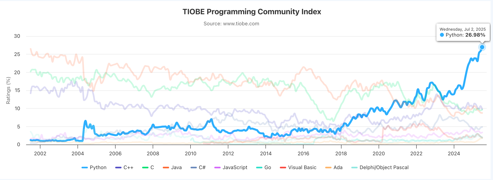
- 研究人員於 2019 年首次將 5500 萬光年之外黑洞的照片拼湊出來，使用的程式語言也是 Python。
  #+ATTR_LATEX: :width 300
  #+ATTR_HTML: :width 300
  #+ATTR_ORG: :width 300
  #+RESULTS:
  
*** Guido van Rossum 自己的說法
#+begin_quote
1989 年 12 月，我正在尋找一個「興趣使然」的程式設計專案，好讓我在聖誕節前後那一週能有事可做。
我的辦公室（位於阿姆斯特丹的一間政府研究實驗室）那段期間會關門，
不過我在家裡有一台電腦，手頭上也沒什麼其他事情。

於是我決定動手寫一個我最近一直在構想的新 Script 語言的直譯器：
一個 ABC 語言的後裔，能夠吸引 Unix/C 駭客的注意。

我為這個專案取了個工作名稱叫 *Python*，
當時的我心情略帶戲謔，也因為我是《Monty Python’s Flying Circus》的超級粉絲。
#+end_quote
原文：
#+begin_quote
...in December 1989, I was looking for a "hobby" programming project that would keep me occupied during the week around Christmas.[fn:4]

My office (a government-run research lab in Amsterdam) would be closed, but I had a home computer, and not much else on my hands. I decided to write an interpreter for the new [[https://zh.wikipedia.org/wiki/%E8%84%9A%E6%9C%AC%E8%AF%AD%E8%A8%80][Script language]] I had been thinking about lately: a descendant of [[https://zh.wikipedia.org/wiki/ABC_(%E7%A8%8B%E5%BC%8F%E8%AA%9E%E8%A8%80)][ABC]] that would appeal to Unix/C hackers.

I chose Python as a working title for the project, being in a slightly irreverent mood (and a big fan of Monty Python's Flying Circus). [fn:5]
#+end_quote

** Python 的優勢與應用
*** 優勢[fn:6]
1) 容易學習
2) 高階語言
3) 使用者友善的資料結構
4) [[https://www.itread01.com/p/1441246.html][動態型別語言]]（根據指派的數值自動判定資料型別，無需明確指定）
5) 物件導向語言
6) 開源且由社群共同開發
7) 有許多第三方模組
8) 豐富的支援函式庫（如 NumPy 用於數值運算，Pandas 用於資料分析等）
9) 可攜性與互動性強
10) 跨作業系統皆可執行

*** 應用領域
1. 基於圖形介面的桌面應用程式（例如遊戲、科學應用程式）
2. 網頁框架與應用程式
3. 企業級與商業應用程式

*** 使用 Python 的知名組織
1. [[https://www.google.com/][Google]]（部分搜尋引擎與網路爬蟲元件）
2. [[https://www.youtube.com/channel/UCNJIEbGZaScUDsq_DMYTjYg][YouTube]]
3. [[https://www.instagram.com/][Instagram]]
4. [[https://www.netflix.com/][Netflix]]
5. [[https://www.dropbox.com/][Dropbox]]
6. [[https://www.reddit.com/][Reddit]]
7. [[https://www.uber.com/][Uber]]
8. [[https://www.pinterest.com/][Pinterest]]

* Python 環境建置
:PROPERTIES:
:CUSTOM_ID: py-IDE
:END:
目前 Python 已經成為一種非常流行的程式語言，幾乎所有的作業系統都已經內建了 Python 解譯器(interpreter)，所以你可以直接在終端機或命令列中執行 Python 程式碼。但為了方便撰寫與測試 Python 程式碼，通常我們會使用一些整合開發環境(IDE)來撰寫程式碼，這些 IDE 通常會提供語法高亮、程式碼補全、除錯工具等功能，讓我們更容易撰寫與測試程式碼。

除了在單機上執行 Python 程式外，還有許多線上 IDE 也支援 Python 程式的撰寫與執行，這些線上 IDE 通常不需要安裝任何軟體，只要有網路連線就可以使用。最有名的線上 IDE 包括 Google Colab、Jupyter Notebook 等。

** 單機環境建置
當你寫好了一支 Python 程式(如下圖)

#+begin_src python -r -n :results output :exports both
print('Hello world!')
print('我要開始來學習Python')
#+end_src

這段就是 Python 的程式碼，但很可惜的，電腦其實看不懂這段程式碼，此時就需要一個「翻譯」來把這段程式「翻」成電腦看的懂的語言（機器碼），這就是 Python 解譯器在做的事。

目前多數的作業系統(如 Windows, MacOS, Linux)都已內建 Python 解譯器，如果你要手動安裝，可以到[[https://www.python.org/downloads/][官網]]去下載安裝程式。

有了 Python 解譯器之後，你就可以開始撰寫如上面的 Python 程式了，但是要用什麼軟體來撰寫程式碼呢？這就是我們所說的整合開發環境(Development Environment)。

如上所述，既然 Python 程式碼就只是一些文字，那麼我們可以用任何文字編輯器來撰寫程式碼，像是 Windows 的記事本、MacOS 的 TextEdit...(如下圖，但，相信我，這不會是什麼好主意 QQ)。
#+CAPTION: 以 MacOS 裡的 TextEdit 撰寫 Python 程式
#+LABEL:fig:Labl
#+name: fig:Name
#+ATTR_LATEX: :width 300
#+ATTR_ORG: :width 300
#+ATTR_HTML: :width 300
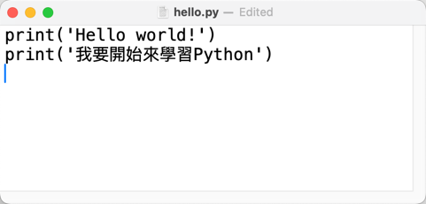

使用上面這種純文字編輯器來撰寫程式碼有幾個缺點:
1. 沒有執行環境：需要手動切換到終端機或命令列來執行程式碼，操作不便。
2. 沒有語法高亮：程式碼中的關鍵字、變數等不會有顏色區分，閱讀起來不夠清晰。
3. 沒有程式碼補全：當你輸入程式碼時，沒有自動補全功能，容易打錯字。
4. 沒有除錯工具：如果程式碼有錯誤，沒有提示或建議，除錯過程會很麻煩。

這其中最顯著的缺點就是沒有執行環境，這意味著你必須先將程式碼存成檔案，然後再到終端機或命令列中執行。例如你寫完上面的程式後，就要再打開終端機或命令列，然後輸入以下指令來執行程式碼:
#+begin_src shell -r -n :results output :exports both
python3 hello.py
#+end_src

然後你就會看到終端機或命令列中顯示出程式的輸出結果:
#+RESULTS:
: Hello world!
: 我要開始來學習 Python

這樣的操作雖然可以完成程式的執行，但對於初學者來說，操作起來會有點麻煩，尤其是當你需要不斷修改程式碼並重新執行時。所以就有了更方便的方式來撰寫與執行 Python 程式碼，那就是使用整合開發環境(IDE)。
*** IDE
雖然我們可以用一般的文字編輯器來寫程式，但正所謂「工欲善其事、必先利其器」，有更好的工具可用，我們為什麼要將就用一些勉強堪用的工具呢？

程式設計師是一群非常 +懒惰+ 重視工作效率的人類，他們可以用五年來開發一個工具，只是為了將來的工作能節省五分鐘，於是這世界就存在了一些專門用來輔助程式設計師寫程式的應用程式。

但是如果只是把它叫做「寫程式的程式」，一來整個格調就沒了，二來還要先解釋哪個是名詞哪個是動詞。

於是，聰明的程式設計師給它取了一個聽起來比較厲害的名字: 整合式開發環境(Integrated Development Environment, IDE)。

市面上常見的、可以拿來寫 python 的 IDE 有以下幾種:
**** Visual Studio Code
這是一個由微軟開發的免費開源編輯器，支援多種程式語言，包括 Python。它提供了強大的擴充功能，可以安裝各種插件來增強功能，如語法高亮、程式碼補全、除錯工具等。如果你有 GitHub copilot 的話，還可以使用它來自動補全程式碼。官網: [[https://code.visualstudio.com/]]
#+CAPTION: 以 Visual Studio Code 撰寫 Python 程式
#+LABEL:fig:Labl
#+name: fig:Name
#+ATTR_LATEX: :width 300
#+ATTR_ORG: :width 300
#+ATTR_HTML: :width 500
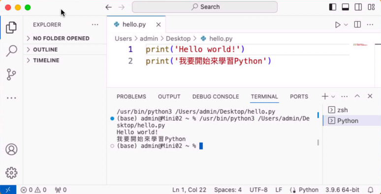

**** PyCharm
PyCharm 是 JetBrains 公司開發的一款專門用於 Python 開發的 IDE。它提供了強大的功能，如語法高亮、程式碼補全、除錯工具、版本控制等。PyCharm 有免費的社群版和付費的專業版，社群版已經足夠用來學習和開發 Python 程式。官網: [[https://www.jetbrains.com/pycharm/]]
#+CAPTION: 以 PyCharm 撰寫 Python 程式
#+LABEL:fig:Labl
#+name: fig:Name
#+ATTR_LATEX: :width 300
#+ATTR_ORG: :width 300
#+ATTR_HTML: :width 500
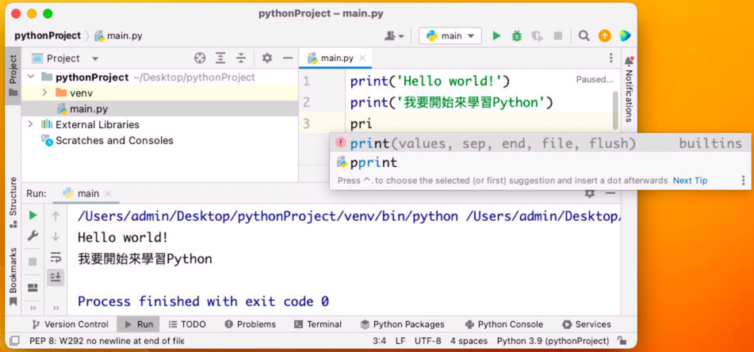

**** Emacs
Emacs 是一個非常強大的文字編輯器，支援多種程式語言，包括 Python。它有一個名為 Emacs Python Mode 的套件(package)，可以提供語法高亮、程式碼補全、除錯工具等功能。Emacs 的學習曲線比較陡峭，但一旦掌握了，就可以非常高效地編寫 Python 程式。官網: [[https://www.gnu.org/software/emacs/]]
#+CAPTION: 以 Emacs 撰寫 Python 程式
#+LABEL:fig:Labl
#+name: fig:Name
#+ATTR_LATEX: :width 300
#+ATTR_ORG: :width 300
#+ATTR_HTML: :width 500
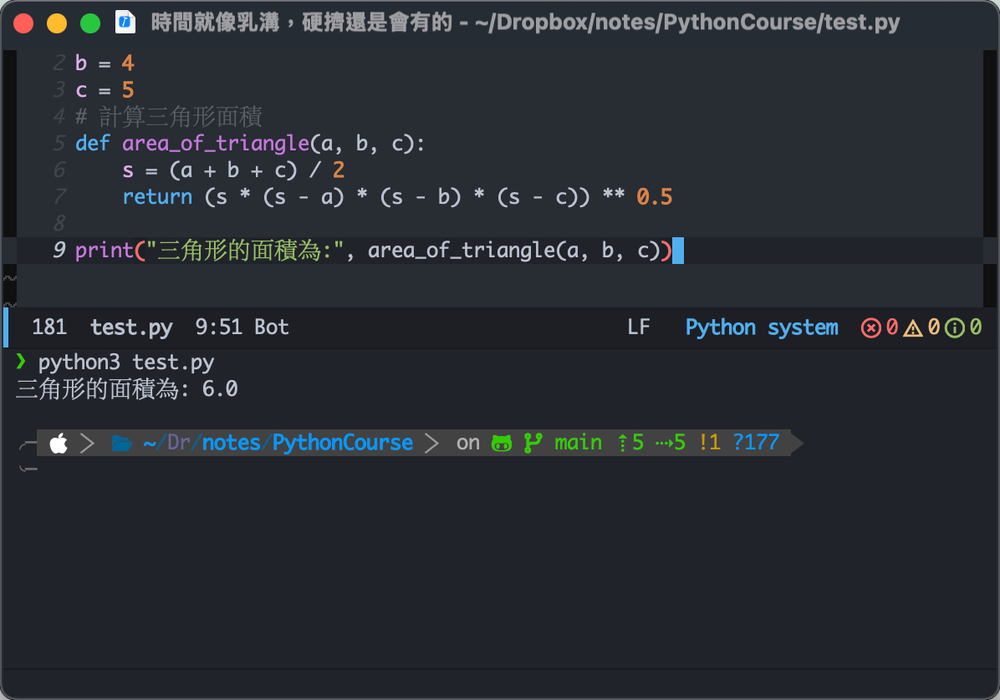

Emacs 也支援 AI 輔助撰寫程式，例如使用 Copilot 或 ChatGPT 等 AI 工具來自動補全程式碼，這樣可以大大提高編寫程式的效率。例如:
#+CAPTION: 以 Emacs 與 Copilot 撰寫 Python 程式
#+LABEL:fig:Labl
#+name: fig:Name
#+ATTR_LATEX: :width 300
#+ATTR_ORG: :width 300
#+ATTR_HTML: :width 500
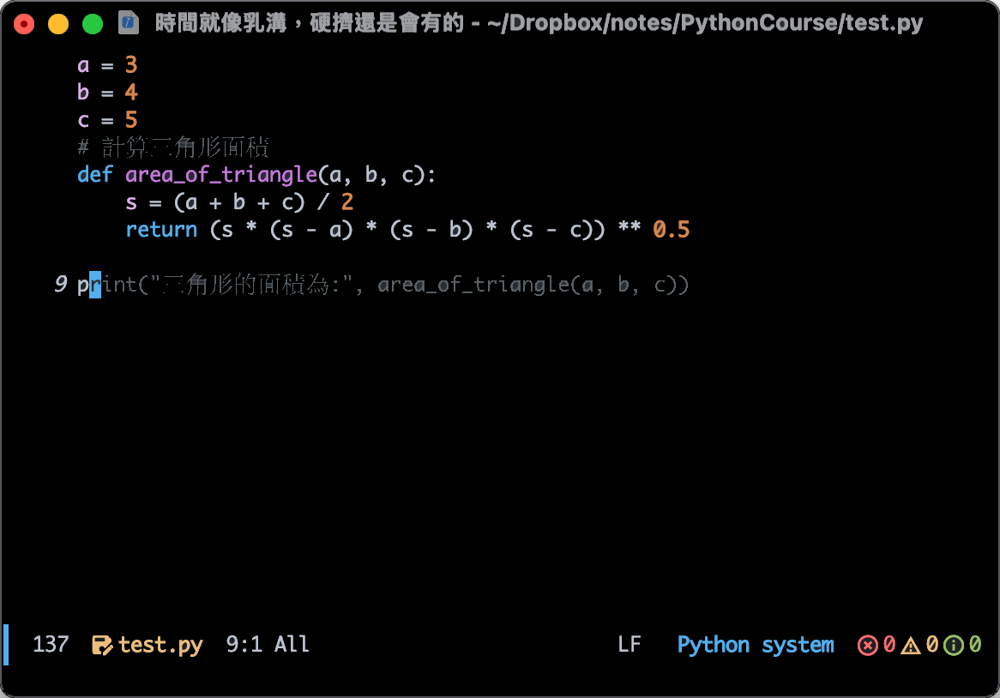

如果你是那種需要把程式寫在文件裡的學習者，Emacs 也有一個名為 Org-mode 的 package，可以讓你在 Emacs 中撰寫文件、程式碼和筆記，並且可以直接執行程式碼。這樣你就可以在同一個環境中完成所有的工作，非常方便。

例如底下這段程式碼就是在 Emacs 的 Org-mode 中撰寫的，並且可以直接執行程式碼，輸出結果也會顯示在文件中。
#+begin_src python -r -n :results output :exports both
a = 3
b = 4
c = 5
# 計算三角形面積
def area_of_triangle(a, b, c):
    s = (a + b + c) / 2
    return (s * (s - a) * (s - b) * (s - c)) ** 0.5

print("三角形的面積為:", area_of_triangle(a, b, c))
#+end_src

#+RESULTS:
: 三角形的面積為: 6.0

Emacs Org-mode 的程式編寫環境如下圖所示：
#+CAPTION: Emacs Org-mode 中的 Python 程式編寫環境
#+LABEL:fig:Labl
#+name: fig:Name
#+ATTR_LATEX: :width 300
#+ATTR_ORG: :width 300
#+ATTR_HTML: :width 500
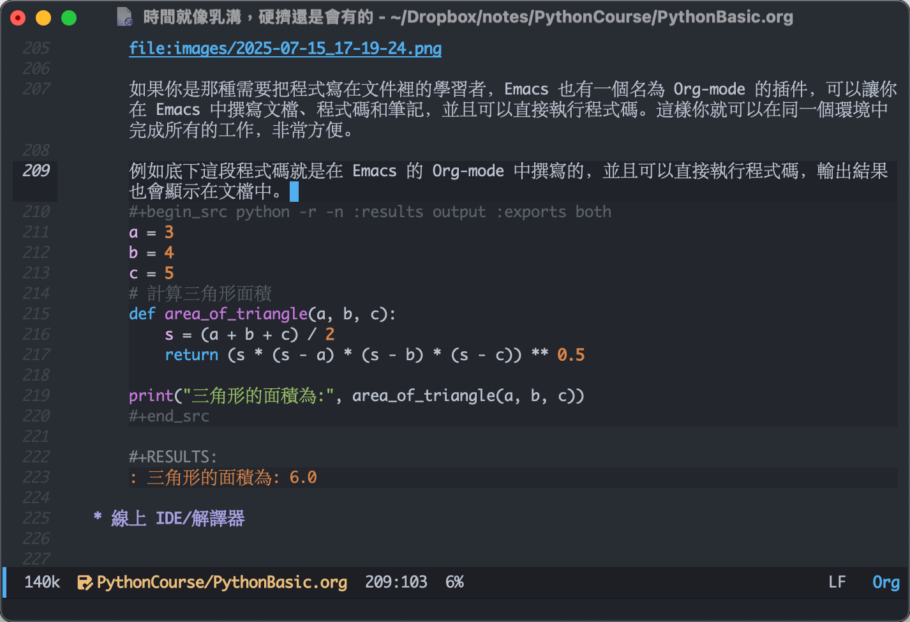

事實上，早在 1980 年代，Emacs 就已經是一個非常強大的編輯器了，它支援多種程式語言的編輯和執行，並且有許多插件可以擴展其功能，許多使用者甚至認為 Emacs 是一個擁有編輯器功能的作業系統，其彈性與強大功能由此可見。在當時能與 Emacs 對抗的編輯器只有 Vim：Vim 號稱「編輯器之神」；而 Emacs 則是「神的編輯器」，兩者的粉絲經常互相爭論誰才是最好的編輯器。
#+CAPTION: Vim, Emacs v.s. nano
#+LABEL:fig:Labl
#+name: fig:Name
#+ATTR_LATEX: :width 300
#+ATTR_ORG: :width 300
#+ATTR_HTML: :width 500

聽起來很完美是吧，但是要當神是要付出代價的，Emacs 的學習曲線非常陡峭，需要花費大量時間來學習和適應它的操作方式。Emacs 的操作方式與其他編輯器有很大的不同，它使用了許多快捷鍵和命令，這些快捷鍵和命令需要花時間去記憶和練習。以下是典型的幾種文字編輯器學習曲線比較圖：
#+CAPTION: Emacs 與其他編輯器的學習曲線比較
#+LABEL:fig:Labl
#+name: fig:Name
#+ATTR_LATEX: :width 300
#+ATTR_ORG: :width 300
#+ATTR_HTML: :width 700
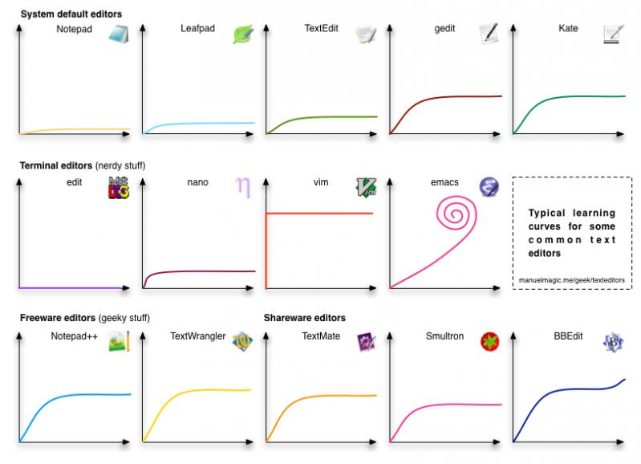

天下沒有白吃的午餐，Emacs 除了學習曲線非常陡峭，許多操作都需要大量的複合按鍵（例如 Ctrl-x Ctrl-f），這對於初學者來說可能會感到困惑和不便。此外，Emacs 的界面也比較簡單，沒有像其他 IDE 那樣的圖形化界面，這可能會讓一些使用者感到不習慣，需要花費大量時間來學習和適應它的操作方式。

所以，如果你是初學者，還是建議先從其他 IDE 開始學習，等到閒著沒其他事可做了再來浪費時間研究 Emacs 吧。畢竟根據 PYPL(PopularitY of Programming Language)的統計，目前 Emacs 的市佔率僅有 0.15%，排名第 16 位，而 Visual Studio 與 Visual Studio Code 則分列前兩名，市佔率分別是 30%、16%[fn:2]。

#+CAPTION: PYPL IDE Index
#+LABEL:fig:Labl
#+name: fig:Name
#+ATTR_LATEX: :width 300
#+ATTR_ORG: :width 300
#+ATTR_HTML: :width 500

** 線上 IDE/解譯器
前述的 IDE 一來要下載、二來要安裝，對於初學者來說委實有點麻煩，於是腦筋動的快的商人就看到了這個商機，把 IDE 做成了網頁服務的型式，如此一來只要能上網就可以寫程式了，只要能克服手機或平板的輸入，你甚至可以在這些裝置上寫程式。

這些線上 IDE 通常提供了 Python 解譯器，可以直接在瀏覽器中撰寫和執行 Python 程式碼，並且支援多種 Python 版本。以下是一些常見的線上 IDE：
*** Online-Python
這是一個線上 Python 編輯器和執行環境，提供了簡單易用的介面，可以直接在瀏覽器中撰寫和執行 Python 程式碼。它支援多種 Python 版本，並且可以儲存程式碼到雲端。官網: [[https://www.online-python.com/]]
#+CAPTION: 以 Online Python 撰寫 Python 程式
#+LABEL:fig:Labl
#+name: fig:Name
#+ATTR_LATEX: :width 300
#+ATTR_ORG: :width 300
#+ATTR_HTML: :width 500
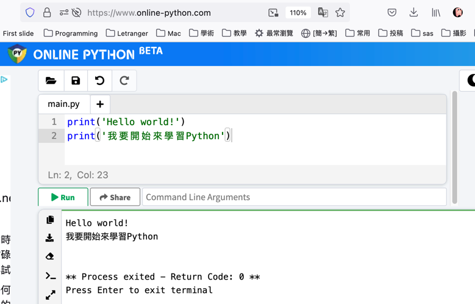

*** Google Colab
Google Colab 是 Google 提供的一個線上 Jupyter Notebook 環境，可以用來撰寫和執行 Python 程式碼。它支援多種 Python 版本，並且可以使用 Google Drive 儲存程式碼和資料。Colab 還提供了 GPU 和 TPU 支援，可以用來加速深度學習模型的訓練。如果你是 AI 的初學者，Colab 絕對是你的首選，因為它提供了許多現成的範例和教學資源，可以幫助你快速入門。Colab 還支援與其他 Google 服務的整合，如 Google Sheets、Google Drive 等，可以方便地存取和處理資料。官網: [[https://colab.research.google.com/]]。
#+CAPTION: 以 Google Colab 撰寫 Python 程式
#+LABEL:fig:Labl
#+name: fig:Name
#+ATTR_LATEX: :width 300
#+ATTR_ORG: :width 300
#+ATTR_HTML: :width 500
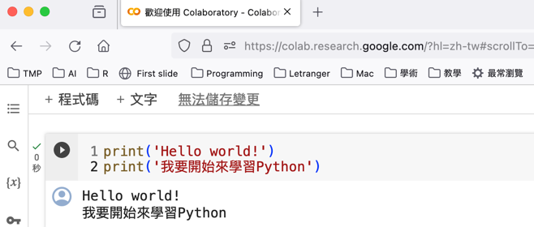

#+latex:\newpage

* 輸出
為什麼要寫程式？不外乎是想解決某些問題，而最終的結果應如何呈現？也許是機械做出某些動作、發出某些聲音、創作出一幅圖畫、輸出一篇文章、讓 ESP32 控制一個機器人、或是讓 Raspberry Pi 控制一個燈泡等等，這些都是輸出(output)的方式。輸出可以是任何形式的結果呈現，甚至是將資料存入檔案或資料庫中，或是將資料傳送到其他裝置或系統中。

以上這些都屬於輸出，而最常見的輸出就是將結果以文字形式呈現在電腦螢幕上，在 C++，我們可以用 cout 或 printf() 來達成這個目的，在 Python 則是 print()。
** 基本輸出
*** C/C++
#+begin_src cpp -r -n :results output :exports both
#include <iostream>
using namespace std;
int main() {
  cout << "Hello world!";
}
#+end_src

#+RESULTS:
: Hello world!
*** Python
**** 輸出文字時，前後加上"或是'
在 Python 中，輸出文字時可以使用單引號(')或雙引號(")來包裹文字，這樣就可以讓 Python 解譯器知道這是一段文字，而不是變數或其他語法。
#+begin_src python -r -n :results output :exports both
print("Hello world!")
#+end_src

#+RESULTS:
: Hello world!
**** 也可以輸出數字或運算式
在 Python 中，print() 函式可以輸出任何類型的資料，包括數字、運算式等。當輸出數字時，Python 會自動將其轉換為字串形式。
#+begin_src python -r -n :results output :exports both
print(3.1415)
print(10*10*3.1416)
print((1+3)/20)
#+end_src
上面那段程式碼會輸出以下結果:
#+RESULTS:
: 3.1415
: 314.15999999999997
: 0.2
print() 在輸出時，會把數字轉成文字顯示在螢幕上，但變數本身的型態並不會改變。也就是說，執行 =print(3.1415)= 之後，3.1415 在 Python 裡仍然是浮點數(float)，不會因為被 print 出來就變成字串。
**** print()裡可以用逗號連接不同類型的資料
在 Python 中，print() 函式可以接受多個參數，如果使用逗號來連接不同類型的資料，在輸出時會自動加上空格作為分隔符號。
#+begin_src python -r -n :results output :exports both
print('半徑為',10,'的圓，其面積為:',10*10*3.14)
#+end_src
請留意如下輸出中的 10，其前後有空格，這是因為 在上面的程式中，print() 函式使用了逗號作為分隔符號。
#+RESULTS:
: 半徑為 10 的圓，其面積為: 314.0
**** 多個指令也可以寫在一行
但要以分號間隔(是的，像 C/C++那樣....)
#+begin_src python -r -n :async :results output :exports both
print("hi"); print("how are you?")
#+end_src

#+RESULTS:
: hi
: how are you?

** 進階輸出
*** 語法
- print( 項目 1, [ 項目 2, … , sep = 分隔字元 , end = 結束字元 ] )
- sep (分隔字元) 預設為空白字元
- end (結束字元) 預設為換行字元"\n"
*** 範例
#+begin_src python -r -n :results output :exports both
a, b, c = 5, 10, 20
print(a, b, c)
print('完全不呈現預設的空白: ',a, b, c, sep ='')
print('以逗號來當分隔符號: ',a, b, c, sep =',')
print('==測試end的用法1==')
print(a, end='\n') #end預設值為跳行，這和 print(a)是一樣的
print(b, end='\n')
print(c, end='\n')
print('==測試end的用法2==')
print('不進行跳行: ', a, end=' ')
print(b, end=' ')
print(c, end=' ')
#+end_src

#+RESULTS:
: 5 10 20
: 完全不呈現預設的空白: 51020
: 以逗號來當分隔符號: ,5,10,20
: ==測試 end 的用法 1==
: 5
: 10
: 20
: ==測試 end 的用法 2==
: 不進行跳行:  5 10 20

留意上面第二行的輸出：當 sep='' 時，print() 會把 *所有* 參數之間的分隔都拿掉，所以字串 '完全不呈現預設的空白: ' 和後面的 5、10、20 全部黏在一起變成了 =完全不呈現預設的空白: 51020= 。而第三行 sep=',' 時，逗號也會插在字串參數和數字參數之間，所以才會出現 =以逗號來當分隔符號: ,5,10,20= （注意冒號後面緊接著一個逗號）。
*** 跳脫字元
#+CAPTION: Escape char
#+name: fig:EscapeCharMap
#+ATTR_LATEX: :width 300
#+ATTR_HTML: :width 300
#+ATTR_ORG: :width 300
#+RESULTS:
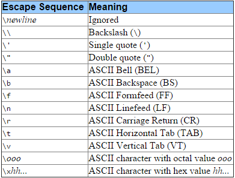
所謂跳脫字元(escape character)，就是在字串中使用特殊符號來表示一些特殊的字元，例如換行符號(\n)、tab 符號(\t)、單引號(\')、雙引號(\")等。這些特殊符號可以讓我們在字串中包含一些無法直接輸入的字元。
在 Python 中，跳脫字元通常以反斜線(\)開頭，後面跟著一個或多個字元。
如果要輸出單引號(')或雙引號(")，除了使用跳脫字元(\)，也可以利用單引號、雙引號互換的作法，如下例：
#+begin_src python -r -n :async :results output :exports both
#使用跳脫字元\
print("他說：\"好，我試試!!\"，然後他就逝世了。")
#外層使用單引號
print('他說："好，我試試!!"，然後他就逝世了。')
#單引號、雙引號互換的作法
print("他說：'好，我試試!!'，然後他就逝世了。")
#+end_src

#+RESULTS:
: 他說："好，我試試!!"，然後他就逝世了。
: 他說："好，我試試!!"，然後他就逝世了。
: 他說：'好，我試試!!'，然後他就逝世了。
- 進階閱讀: [[https://www.itread01.com/content/1545069543.html][CRLF、CR、LF詳解]]
*** 課堂練習
請以 print()輸出以下文字
#+begin_quote
Your brain has two parts: the left and the right.
Your left brain has nothing "right", and your right brain has nothing "left".
#+end_quote

** f-string
f-string 是 Python 3.6 以後新增的字串格式化方法，它可以讓我們在字串中直接嵌入變數，並且可以控制輸出的格式。f-string 的語法是以字母 f 開頭，然後在字串中使用大括號({})來包裹變數或表達式。

由於 f-string 轉換時會做最佳化，其速度會比前面的文字格式化稍稍快一點。
*** 輸出一個數字，不控制格式
#+begin_src python -r -n :results output :exports both
score = 83
print(score)
print(f'{score}')
#+end_src

#+RESULTS:
: 83
: 83
*** 輸出一個數字並控制輸出到小數點第二位
#+begin_src python -r -n :results output :exports both
height = 168.3

print(f'{height:.2f}')
# 加入文字
print(f'身高為:{height:.2f}')
#+end_src

#+RESULTS:
: 168.30
: 身高為:168.30
*** 輸出兩個變數並控制輸出格式
#+begin_src python -r -n :results output :exports both
weight = 65.33
height = 168.33
# 不跳行,加逗號
print(f'{height:.2f}, {weight:.3f}')
# 跳行
print(f'{height:.2f}\n{weight:.3f}')
# 跳行並加入說明文字
print(f'身高:{height:.2f}\n體重:{weight:.3f}')
#+end_src

#+RESULTS:
: 168.33, 65.330
: 168.33
: 65.330
: 身高:168.33
: 體重:65.330
*** 輸出三個不同型別的變數
#+begin_src python -r -n :results output :exports both
name = 'Vanessa'
height = 165
weight = 52.3
print(f'{name}的身高是{height}公分、體重是{weight:.2f}公斤')
#+end_src

#+RESULTS:
: Vanessa 的身高是 165 公分、體重是 52.30 公斤
*** 如何控制輸出字串的靠齊方向
和數字輸出一樣，我們可以預留一些空間給文字輸出，並控制文字的靠齊方向，例如
- {:>}: 向右靠
- {:<}: 向左靠
- {:^}: 置中對齊

下例中我們預留了 8 個空格來顯示姓名(name) ,並要求向右對齊
#+begin_src python -r -n :results output :exports both
name1 = 'James'
name2 = 'Vanessa'
height1 = 165
weight1 = 52.3
height2 = 175
weight2 = 72.3
print(f'{name1:>8}的身高是{height1:>6}公分、體重是{weight1:10.2f}公斤')
print(f'{name2:>8}的身高是{height2:>6}公分、體重是{weight2:10.2f}公斤')
#+end_src

#+RESULTS:
:    James 的身高是   165 公分、體重是     52.30 公斤
:  Vanessa 的身高是   175 公分、體重是     72.30 公斤

** 其他格式化輸出方法
前面介紹的 f-string 是目前最推薦的格式化方式，但 Python 的歷史上還有其他幾種格式化方法。雖然現在寫新程式建議優先用 f-string，但你在網路上搜尋範例、閱讀別人的程式碼（尤其是比較早期的專案或教學）時，一定會看到以下這些寫法，所以還是有必要認識一下。
*** 格式化輸出: format() (新版)
format() 是 Python 2.7 以後新增的字串格式化方法，它可以讓我們在字串中使用大括號({})來包裹變數，並且可以控制輸出的格式。format() 的語法是字串.format(變數 1, 變數 2, ...)，其中變數可以是任何類型的資料，包括數字、字串、列表、字典等。
- 語法
  + format 格式化輸出語法：print(字串.format(變數))

  + 字串裡以{0}、{1}、... 來對應參數列裡的變數
  + 格式控制：print('{0:控制字串}'.format(參數))
*** format()輸出範例
**** 輸出一個數字，不控制格式
#+begin_src python -r -n :results output :exports both
score = 83
print(score)
print('{}'.format(score))
#+end_src

#+RESULTS:
: 83
: 83
**** 輸出一個數字並控制輸出到小數點第二位
#+begin_src python -r -n :results output :exports both
height = 168.3

print('{0:.2f}'.format(height))
# 上一行{}中的0代表該處要輸出format()中的第0個變數，只有一個時也可以省略
print('{:.2f}'.format(height))

# 加入文字
print('身高為:{:.2f}'.format(height))
#+end_src

#+RESULTS:
: 168.30
: 168.30
: 身高為:168.30
**** 輸出兩個變數並控制輸出格式
#+begin_src python -r -n :results output :exports both
weight = 65.33
height = 168.33
# 不跳行
print('{0:.2f}{1:.3f}'.format(height, weight))
# 跳行
print('{0:.2f}\n{1:.3f}'.format(height, weight))
# 跳行並加入說明文字
print('身高:{0:.2f}\n體重:{1:.3f}'.format(height, weight))
#+end_src

#+RESULTS:
: 168.3365.330
: 168.33
: 65.330
: 身高:168.33
: 體重:65.330
**** 輸出三個不同型別的變數
#+begin_src python -r -n :results output :exports both
name = 'Vanessa'
height = 165
weight = 52.3
print('{0}的身高是{1}公分、體重是{2:.2f}公斤'.format(name, height, weight))
#+end_src

#+RESULTS:
: Vanessa 的身高是 165 公分、體重是 52.30 公斤
**** 如何控制輸出字串的靠齊方向
和數字輸出一樣，我們可以預留一些空間給文字輸出，並控制文字的靠齊方向，例如
- {:>}: 向右靠
- {:<}: 向左靠
- {:^}: 置中對齊

下例中我們預留了 8 個空格來顯示姓名(name) ,並要求向右對齊
#+begin_src python -r -n :results output :exports both
name1 = 'James'
name2 = 'Vanessa'
print('My name is {0:>8}. Nice to meet you.'.format(name1))
print('My name is {0:>8}. Nice to meet you.'.format(name2))
#+end_src

#+RESULTS:
: My name is    James. Nice to meet you.
: My name is  Vanessa. Nice to meet you.
*** 格式化輸出: Template
Template 是 Python 2.4 以後新增的字串格式化方法，它可以讓我們在字串中使用 $ 符號來包裹變數，並且可以控制輸出的格式。Template 的語法是字串.Template(變數)，其中變數可以是任何類型的資料，包括數字、字串、列表、字典等。
#+begin_src python -r -n :results output :exports both
from string import Template

name = 'TNFSH'
tmp = Template('Hello, $who')
print(tmp.substitute(who = name))

#+end_src

#+RESULTS:
: Hello, TNFSH
*** 格式化輸出: % (舊版)
% 是 Python 2.x 版本的字串格式化方法，它可以讓我們在字串中使用百分號(%)來包裹變數，並且可以控制輸出的格式。% 的語法是字串 % (變數 1, 變數 2, ...)，其中變數可以是任何類型的資料，包括數字、字串、列表、字典等。
- 語法
  + 格式化輸出語法：print( 字串  %(參數) )

  + 字串裡 %s 代表字串、%d 代表整數、%f 代表浮點數

- 範例
  #+begin_src python -r -n :results output :exports both
name = '台北101'
height = 508
fee = 18.24
print('%s的高度為%d公尺，參觀門票為%8.2f美金.' %(name, height, fee))
print('%s的高度為%d公尺，參觀門票為%0.2f美金.' %(name, height, fee))
  #+end_src

  #+RESULTS:
  : 台北 101 的高度為 508 公尺，參觀門票為   18.24 美金.
  : 台北 101 的高度為 508 公尺，參觀門票為 18.24 美金.

* 變數
:PROPERTIES:
:CUSTOM_ID: py-variables
:END:
想法: 讓底下的程式碼更有彈性些，可以算任何的半徑值....

#+begin_src python -r -n :results output :exports both
print('半徑為',10,'的圓，其面積為:',10*10*3.14)
#+end_src
以變數來儲存半徑
#+begin_src python -r -n :results output :exports both
r = 10
print('半徑為',r,'的圓，其面積為:',r*r*3.14)
r = 20
print('半徑為',r,'的圓，其面積為:',r*r*3.14)
r = 30
print('半徑為',r,'的圓，其面積為:',r*r*3.14)
#+end_src
變數是一種用來儲存資料的容器，它可以讓我們在程式中使用這些資料，而不需要每次都重新計算或輸入。變數可以儲存任何類型的資料，包括數字、字串、列表、字典等。

** 變數的指派(assign)
- 指派(assign)是將一個值(或運算式)指派給一個變數的過程。
- 和 C/C++不同，Python 變數不需宣告，依指派值自動設定資料型態(dynamically typing)。
- 語法
  #+BEGIN_SRC python
  變數名稱 = 指派值
  #+END_SRC
- 變數不再使用時，可用 del 指令將其刪除，以節省記憶體。
- 範例：
#+begin_src python -r -n :results output :exports both
a = 5
b = 3.14
c = 'TNFSH'
a = b = c = 10
a += 1 # 相當於 a = a + 1，還有 -=, *=, /=
name, number = 'TNFSH', 35 # 多個變數一同指派
quotient, mod = divmod(10, 3)
print(quotient)
print(mod)
del c
print(name)
# swap交換兩個變數的值
print(a, b)
a, b = b, a
print(a, b)
#+end_src

#+RESULTS:
: 3
: 1
: TNFSH
: 11 10
: 10 11
變數,顧名思義，它的儲存內容會改變，所以有時我們會看到這種在數學定義中看起來矛盾的運算式
#+begin_src python -r -n :results output :exports both
a = 3
a = a + 10
#+end_src
這是因為等號(=)的意思是指定，而且 Python 的直譯器會先將=右側的結果運算出來，再將結果 assign 給=左側的變數
1. 先看看以下的程式碼(複製程式碼、貼到你的編輯器上)
1. 再猜一猜執行結果
1. 最後再執行，看看你有沒有猜對
#+begin_src python -r -n :results output :exports both
score = 10
score = score + 5
score = score * 6
print(score)
#+end_src

** 變數的命名規則
和 C/C++一樣的，變數的命名規則如下:
- 由英文、數字、底線、中文(不建議)組成
- 不得以數字開頭
- 不能與 Python 內建的保留字相同
*** 範例
|----------------+-------|
| <l>            | <l>   |
| Example        | \checkmark / \times |
|----------------+-------|
| abc\under123   | \checkmark     |
| 3pigs          | \times     |
| Happy New Year | \times     |
| class          | \times     |
| Good!          | \times     |
|----------------+-------|

** 變數的各種資料型態
Python 的變數型態是動態的(dynamically typed)，這意味著在程式執行時，變數的型態可以隨時改變。Python 會根據變數所儲存的值自動判斷其型態，而不需要在宣告變數時指定型態。
*** 變數型態的判斷: type()
既然是動態的，那麼我們如何知道變數的型態呢？Python 提供了 type() 函式來判斷變數的型態。
#+begin_src python -r -n :results output :exports both
print(type(2020))
print(type(3.1416))
print(type('Hello world'))
#+end_src

#+RESULTS:
: <class 'int'>
: <class 'float'>
: <class 'str'>

可以看到，type() 會告訴你這個值是什麼型態：int 代表整數、float 代表浮點數（小數）、str 代表字串。
*** 常用類型
常用的資料型態有:
- 整數: int
- 浮點數: float
- 布林值(True / False): bool, T 與 F 要大寫。布林值只有兩個： =True= 和 =False= ，通常用在條件判斷中（例如 if 的條件式結果就是一個布林值）。注意：Python 的 True/False 首字母大寫，和 C/C++ 的 true/false 不同。
- 字串: str, 以'或"含括,若輸出字串要包含引號，則以另一種引號含括該字串，或是在前面加上跳脫字元（\)。
#+begin_src python -r -n :results output :exports both
age = 18
weight = 67.87
good_words = " 請常說'請'、'謝謝'、'對不起' "
other_words = "請常說\"請\"、\"謝謝\"、\"對不起\""
print(type(age))
print(type(weight))
print(type(good_words))
print(other_words)
#+end_src

#+RESULTS:
: <class 'int'>
: <class 'float'>
: <class 'str'>
: 請常說"請"、"謝謝"、"對不起"

- 序列型態: list, tuple
- 集合型態: set
- 對映型態: dict
*** 型態轉換
在 Python 中，變數的型態可以隨時轉換，這稱為型態轉換(type conversion)。Python 提供了幾個內建函式來進行型態轉換，例如 int()、float()、str() 等。
- 自動轉換
#+begin_src python -r -n :results output :exports both
score = 60
print(type(score))
score = score + 3.5       # 自動轉換為浮點數，結果為63.5
print(type(score))
#+end_src

#+RESULTS:
: <class 'int'>
: <class 'float'>

- 強制轉換
#+begin_src python -r -n
score = int(30.22)        # 將括弧內的資料轉換為整數
score = float(score)      # 將括弧內的資料轉換為浮點數
test = str(score)# 將括弧內的資料轉換為字串
#+end_src
#+latex:\newpage

* 輸入
:PROPERTIES:
:CUSTOM_ID: py-input
:END:
在上一個版本的程式中，我們使用變數來儲存半徑的值，這樣就可以讓程式更有彈性，可以計算不同半徑的圓面積。但是，這樣還是需要我們手動修改程式碼中的變數值，才能計算不同半徑的圓面積：

想法: 讓前一版的程式更有彈性
#+begin_src python -r -n :results output :exports both
print('半徑為',10,'的圓，其面積為:',10*10*3.14)
#+end_src
如果我們可以讓 *使用者* 在 *每次執行程式時* 輸入半徑的值，那麼程式就可以自動計算不同半徑的圓面積，而不需要修改程式碼。這就是輸入(input)的概念。

請試著執行以下程式碼，看看它的輸入與輸出結果：
#+begin_src python -r -n :results output :exports both
r = input()
print('半徑為',r,'的圓，其面積為:',r*r*3.14)
#+end_src

如果你執行了上面的程式碼，你會發現程式在執行到 =r*r*3.14= 時就 crash 了，並出現類似如下的錯誤訊息：
: TypeError: can't multiply sequence by non-int of type 'float'
這是因為 input() 讀入的資料型態是 *字串(str)* ，而字串是不能和浮點數相乘的。即使你輸入的是數字 10，Python 也會把它當成字串 '10' 來處理。

要解決這個問題，我們需要將輸入的值轉換為數字型態。Python 提供了 int() 和 float() 函式來將字串轉換為整數或浮點數。以下是修正後的程式碼：
#+begin_src python -r -n :results output :exports both
r = input()
r = int(r)
print('半徑為',r,'的圓，其面積為:',r*r*3.14)
#+end_src
上述程式中的前兩行也可以寫成一行
#+begin_src python -r -n :results output :exports both
r = int(input())
print('半徑為',r,'的圓，其面積為:',r*r*3.14)
#+end_src

** 輸入/input(): 基本輸入與型別轉換
Python 使用 input() 函式來讀取使用者輸入的資料。這個函式會等待使用者輸入一行文字，然後將這行文字作為字串傳回。需要注意的是，input() 函式讀取的資料型態是字串(str)，如果需要其他型別的資料，需要進行型別轉換。
*** 語法/範例
**** 語法
#+begin_src python -r -n :results both
variable = input([提示字元])
#+end_src
- PS: 經由 input( )函式讀入的資料，其資料型態皆為字串
- 如果你在語法中看到[]，表示這個參數是可選(optional)的，可以省略。
**** 範例
#+begin_src python -r -n
a = input('輸入國文成績:')
b = input('輸入數學成績:')
c = input()
print('三科成績分別為%5s %5s %5s' %(a, b, c))
#+end_src
*** 輸入搭配型別轉換
#+begin_src python -r -n
  a = int(input('輸入國文成績:'))
  b = int(input('輸入數學成績:'))
  c = int(input())
  print('總分為%5d' %(a+b+c))
#+end_src

** 進階輸入處理
:PROPERTIES:
:CUSTOM_ID: py-input-split
:END:
python 的 input()函數每次讀入一行資料，直到換行為止，但如果這行資料裡就包含了許多變數，那就應該先把字串切割(split())成許多子部份，然後視需要另做型別轉換。
*** split() 語法
#+begin_src python -r -n :results both
input().split(separator, maxsplit)
#+end_src
- separator（可選）：分隔符號，字串會在指定的分隔符號處被切割。如果沒有指定，預設以任何空白字元（空格、換行等）作為分隔符號。
- maxsplit（可選）：最多切割幾次。預設值為 -1，表示不限制切割次數。
- 回傳值：split() 會回傳一個由切割後的子字串所組成的 list。
*** 適用狀況
假設我們面對兩種不同的資料輸入方式：
- 狀況一：輸入的資料為三個成績同時寫在一行(以空白分隔)
  #+begin_src python -r -n :results both
  23 45 66
  #+end_src
- 狀況二：三個成績分為三列(每次都按 enter)
  #+begin_src cpp -r -n :results output
  23
  45
  66
  #+end_src
對 C/C++來說，這並不是什麼特別的問題，上述兩種狀況都可以用三個 cin 將成績讀進程式：
#+begin_src cpp -r -n
#include <iostream>
using namespace std;
int main() {
    int a, b, c;
    cin >> a >> b >> c;
}
#+end_src
但是對 python 來說，如果針對狀況一的資料以下列方式讀入
#+begin_src python -r -n :results both
scoreX = input() #一次把整列資料讀完
scoreY = input() #沒資料可以讀
scoreZ = input()
#+end_src
則 scoreX 的值會變成字串'23 45 66'，而 scoreY, scoreZ 會沒有值，因為這行裡的所有資料全部被讀入 scoreX 中。
*** 解決方案
**** 作法 1:
讀入整行字串後，
再以字串分割處理，最後將分割後的字串分別 assign 給不同的變數。例如已知第一行有三個值，則可以先準備好三個變數來儲存被 split 切割後的三個值
#+begin_src python -r -n :results both
scoreX, scoreY, scoreZ = input().split()
#+end_src
**** 作法 2:
先把這段輸入存成一個字串變數(inp)，再對這個變數做 split，從這裡我們也可以隱約了解 split()這個 function 是 *字串變數* 專屬的 function(split()是 python 字串的切割 function，[[https://shengyu7697.github.io/python-split/][進階閱讀]])。
#+begin_src python -r -n :results output :exports both
inp = input() #先把輸入的字串存到字串變數inp裡
a, b, c = inp.split() #再用split()去切割inp字串，
# 依此類推逐一取得輸入值
a = int(a)
b = int(b)
c = int(c)
#+end_src
**** 作法 3:
也可以用一個 list 來儲存所有被 split 切割的值，最後再由 list 來取得值(詳見本章 *資料型別* 中的 *串列 List* )
**** 作法 4:
利用 =map()= 函式一次把所有切割出來的字串批量轉成整數。 =map(函式, 序列)= 的意思是「把這個函式套用到序列中的每一個元素上」，所以 =map(int, input().split())= 就是把 split() 切出來的每個字串都套用 int() 轉成整數。
#+begin_src python -r -n :results both
scoreX, scoreY, scoreZ = map(int, input().split())
#+end_src
上面這行做了三件事：
1. =input()= 讀入一整行字串，例如 ='23 45 66'=
2. =.split()= 把字串以空白切割成 =['23', '45', '66']=
3. =map(int, ...)= 把每個字串元素都用 int() 轉成整數，最後分別 assign 給 scoreX、scoreY、scoreZ
**** 作法 5:
在一行輸入不定個數的整數，且不確定到底有幾個數字時，可以用 list comprehension（串列生成式）來處理：
#+begin_src python -r -n :async :results output :exports both
a = [int(x) for x in input().split()]
#+end_src
- 得到的 a 為 int list
- 這行的意思是：「對 input().split() 切出來的每個元素 x，都做 int(x) 轉換，然後把所有結果收集成一個 list」
- 可以想像為數學的集合表示法 $S = \{int(x) \mid x \in input().split()\}$
- 這種寫法叫做 list comprehension，會在後面的 List 章節中詳細介紹，現在先知道怎麼用就好

* try-except 例外處理
:PROPERTIES:
:CUSTOM_ID: py-try-exception
:ID:       651e122a-c513-493f-90c2-d36848b676e3
:END:
測試一下底下的程式：
#+begin_src python -r -n :session :results output :exports both  :tangle tryInput.py :noeval
import math
instr = input() #輸入a9
score = float(instr) #出問題了

score = math.sqrt(score)*10
print('{0:.4f}'.format(score))
#+end_src

如果你輸入了 10，程式會輸出 31.6228（即 $\sqrt{10} \times 10$ ），但如果你輸入了 a9，程式就會 crash 掉，因為 Python 無法將字串 'a9' 轉換成浮點數(程式第 3 行的 =float(instr)= )，也因此變數 score 無法被賦值(assign value)。此時程式就會發生錯誤並停止執行，並出現類似如下的錯誤訊息：
#+RESULTS:
: Traceback (most recent call last):
:   File "main.py", line 3, in <module>
:     score = float(instr)
: ValueError: could not convert string to float: 'a9'

對於寫程式的人來說，這樣的錯誤雖然常見，而且明顯是因為使用者的輸入錯誤所導致，但
#+begin_quote
使用者永遠是對的
程式執行到當掉是不允許的
#+end_quote

為了避免發生這種情況，Python 提供了 try-except 機制來處理可能發生的錯誤。這樣可以讓程式在遇到錯誤時不會直接崩潰，而是可以給使用者一個友好的提示或進行其他處理。

- 大部分執行中的錯誤， Python 直譯器 (interpreter) 會以發起例外 (exception) 的方式來中斷程式的執行。
- 凡是可能會產生例外的程式碼， Python 利用 try-except 陳述 (try-except statement) 讓程式設計師自行處理例外。 try-except 為關鍵字 (keyword) 之一，專門用來例外處理 (exception handling) 的。
- [[https://www.w3schools.com/python/python_try_except.asp][進階: Python Try Except]]

** 解決上述問題
為了解決上述問題，我們可以使用 try-except 來捕捉可能發生的錯誤，並給出適當的提示。以下是修改後的程式碼：
#+begin_src python -r -n :session :results output :exports both :tangle tryInput.py
import math

instr = input() #輸入a9

try:
    score = float(instr)
    score = math.sqrt(score)*10
    print(score)
except:
    print("Error")
#+end_src

#+RESULTS:
: Error
在上述程式中，我們使用了 try-except 來捕捉可能發生的錯誤。如果在 try 區塊中的程式碼發生錯誤，Python 會跳到 except 區塊執行，並輸出 "Error"。這樣就避免了程式直接崩潰的情況。
** 注意事項
並不是有了 try...except 就天下太平了，試著執行下列程式
#+begin_src python -r -n :results output :exports both
import math

try:
    score = int(input()) #輸入 xyz
except:
    print('error')

print(math.sqrt(score))
#+end_src
想一下為什麼程式還是 crash 掉....

以上述程式為例，我們基本上有以下幾種解決方案：
1. 在 except 區塊中加入一個 return 或 exit()
   即，在 except 區塊中處理完錯誤（如輸出提示錯誤訊息）後，明確地終止程式執行，以防止程式碼繼續執行到依賴於 try 區塊成功結果的部分，也就是 print(math.sqrt(score))。
2. 把 print(math.sqrt(score)) 放在 try 區塊中
   將所有依賴於 try 區塊中可能成功操作的程式碼（包括後續的計算和輸出），都放在 try 區塊內部。這樣，一旦 try 區塊中的任何一行程式碼引發例外，程式就會立即跳轉到 except 區塊，而不會執行 try 區塊中剩餘的、依賴於錯誤結果的程式碼。
3. 把原本的 print(math.sqrt(score)) 放在一個檢查 score 是否為數字的條件判斷中
   雖然可以在 except 區塊之外添加條件判斷（例如檢查 score 變數是否已定義，或者它的值是否有效），但這不是 Python 處理例外的慣用方法。Python 鼓勵使用 try-except 來處理預期之外的錯誤，而不是預先進行大量的條件檢查。
4. 把 input()放在一個 while 迴圈中，直到使用者輸入正確的數字為止
   使用 while 迴圈結合 try-except 實現一個有效的輸入驗證機制。在 try 區塊中嘗試轉換輸入，如果成功則 break 離開迴圈；如果發生錯誤，則在 except 區塊中提示使用者重新輸入，並繼續迴圈，直到輸入有效為止。這能提供更好的使用者體驗。

   例如類似如下的程式架構：
   #+begin_src python -r -n :results output :exports both
   import math
   while True:
       try:
           score = int(input("請輸入一個整數: "))  # 輸入整數
           break  # 如果成功，跳出迴圈
       except ValueError:  # 捕捉特定的錯誤類型
           print("輸入錯誤，請重新輸入一個整數。")
   print(math.sqrt(score))
   #+end_src
** 指定具體的例外類型
我們也可以在 except 後面指定具體的例外類型，這樣可以更精確地捕捉特定的錯誤。例如：
#+begin_src python -r -n :results output :exports both
import math

instr = input() #輸入a9

try:
    score = float(instr)
    score = math.sqrt(score)*10
    print(score)
except ValueError: # 專門捕捉 ValueError
    print("輸入的不是有效的數字。")
except TypeError: # 範例，如果 math.sqrt() 收到不兼容的類型
    print("數值類型錯誤，無法計算。")
except Exception as e: # 捕捉所有其他未預期的錯誤，並打印錯誤訊息
    print(f"發生了未預期的錯誤: {e}")
#+end_src
這樣可以根據錯誤類型給出更精確的提示。

** try-except-else
在 Python 中，try-except 還可以搭配 else 使用。else 區塊會在 try 區塊中的程式碼沒有引發任何例外時執行。這樣可以讓我們在沒有錯誤的情況下執行一些額外的程式碼。
#+begin_src python -r -n :results output :exports both
import math

instr = input()

try:
    score = float(instr)
except ValueError:
    print("輸入的不是有效的數字。")
else: # 如果 try 區塊沒有發生錯誤，則執行這裡
    if score >= 0: # math.sqrt 不接受負數
        result = math.sqrt(score) * 10
        print(f'{result:.4f}')
    else:
        print("輸入的數字不能是負數。")
# 注意：如果 math.sqrt(score) 也在 try 區塊內，則不需要在這裡檢查負數
#+end_src

** try-except-finally
finally 區塊中的程式碼無論是否發生例外都會執行。它常用於清理資源，例如關閉文件或網絡連接。
#+begin_src python -r -n :results output :exports both
try:
    f = open("myfile.txt")
    # 讀取文件
except FileNotFoundError:
    print("檔案不存在。")
finally:
    if 'f' in locals() and not f.closed: # 確保 f 已定義且未關閉
        f.close() # 無論如何都要關閉文件
#+end_src

** 如果有很多個變數需要檢查例外呢
也許你可以一個一個去變更資料類型，如果出問題後就 *結束* 程式，不要再往下執行，在 python 中，你可以透過呼叫 sys 模組中的 exit()或是 os 模組中的_exit()來終止程式，例如在 print('error')後就結束程式，詳情請自行參閱[[https://appdividend.com/2022/07/14/how-to-stop-python-script-from-execution/][這篇]]。

或者，你更應該自己透過關鍵字去膜拜一下 Google 大神，例如 python stop program 之類的....
*** 提示
回顧一下一年級學 C/C++時，有提及 if 的巢狀寫法，例如
#+begin_src cpp -r -n :results output :exports both
#include <iostream>
using namespace std;
int main() {
    int a, b;
    cin >> a >> b;
    if (a>=60) {
        if (b>=60) {
            cout << "all pass";
        } else {
            cout << "第2科掛了";
        }
    } else {
        cout << "第1科掛了";
    }
}
#+end_src
你可以想一下能不能把  這種寫法套用在 try...except 上。

** 進階閱讀
- [[https://steam.oxxostudio.tw/category/python/basic/try-except.html][例外處理 ( try、except )]]

* 註解
Python 的註解方式與 C/C++有些不同，Python 沒有像 C/C++ 那樣的 =/* ... */= 多行註解語法，主要有以下方式：
- 單行註解：以 # 開頭，後面跟著註解內容。這是 Python 唯一正式的註解語法。
- 多行註解：可以使用三個單引號（'''）或三個雙引號（"""）來包裹多行內容。嚴格來說，這其實是一個多行字串（string literal），只是因為沒有被 assign 給任何變數，所以執行時會被 Python 忽略，因此常被拿來當作多行註解使用。

** 語法
  + 單行註解：以 # 開頭
  + 多行註解：前後以  '''  或  """  含括（本質上是多行字串）
** 範例
#+begin_src python -r -n :results output :exports both
## 這是單行註解
a = 3
'''
這是多行註解
LALALA
'''
print(a)
"""
這也是註解
可以放多行
"""
#+end_src

#+latex:\newpage

* 運算元與運算式
:PROPERTIES:
:CUSTOM_ID: py-operation
:END:
** 算術運算
Python 支援多種算術運算，以下是常用的算術運算子：
- +: 加
- -: 減
- *: 乘
- /: 除
- %: 取餘數
- //: 求商
- **: 指數
*** 算術運算範例#1
#+BEGIN_SRC python -r -n :results output :exports both
# python code for arithematic opearation
print(5+3)
print(5-3)
print(5*3)
print(5/3)
print(5%3)
print(5//3)
print(5**3)
#+END_SRC

 #+RESULTS:
 : 8
 : 2
 : 15
 : 1.6666666666666667
 : 2
 : 1
 : 125
*** 算術運算範例#2
#+NAME: 計算機
#+BEGIN_SRC python -r -n :results output :exports both
  a = int(input("input a: "))
  op = input("input op: ")
  b = int(input("input b: "))

  if op == '+':
      ans = a + b;
  elif op == '-':
      ans = a - b;
  elif op == '*':
      ans = a * b;
  elif op == '/':
      ans = a / b;
  elif op == '%':
      ans = a % b;

  print(str(a) + op + str(b) + "=" + str(ans))

#+END_SRC
*** 字串運算
#+begin_src python -r -n :results output :exports both
print("Python"+"基礎")
print(3*"Python基礎")
#+end_src

#+RESULTS:
: Python基礎
: Python基礎Python基礎Python基礎

** 關係運算子
Python 也支援多種關係運算子，用來比較兩個值的大小或相等性。以下是常用的關係運算子：
|--------+------+------+----------+----------+------+--------|
| 運算子 | >    | <    | >=       | <=       | ==   | !=     |
|--------+------+------+----------+----------+------+--------|
| 範例   | 大於 | 小於 | 大於等於 | 小於等於 | 等於 | 不等於 |
|--------+------+------+----------+----------+------+--------|

** 邏輯運算子
當我們需要對多個條件進行邏輯運算時，可以使用邏輯運算子。Python 提供了以下邏輯運算子：
|------+-----------------+-----------------+-----------|
| 運算子 | and             | or              | not       |
|------+-----------------+-----------------+-----------|
| 範例 | (a>b) and (a<c) | (a>b) or (a==b) | not (a>b) |
|------+-----------------+-----------------+-----------|

** 複合指定運算子
如果我們需要對變數進行多次運算並更新其值，可以使用複合指定運算子。這些運算子結合了算術運算和指定運算，讓程式碼更簡潔。以下是常用的複合指定運算子：
|----------+-------+-------+-------+-------+-------+--------+--------|
| 運算子   | +=    | -=    | *=    | /=    | %=    | //=    | **=    |
|----------+-------+-------+-------+-------+-------+--------+--------|
| 範例     | a+=3  | a-=3  | a*=3  | a/=3  | a%=3  | a//=3  | a**=3  |
|----------+-------+-------+-------+-------+-------+--------+--------|
| 等價運算 | a=a+3 | a=a-3 | a=a*3 | a=a/3 | a=a%3 | a=a//3 | a=a**3 |
|----------+-------+-------+-------+-------+-------+--------+--------|

** 指派運算子
我們最常見的指派運算子是 = ，它將右邊的值或運算式結果指派給左邊的變數。

除了 = 之外，Python 3.8 起新增了一個稱為「海象運算子」(Walrus Operator) 的 := ，因為 := 長得像海象的眼睛和長牙而得名。它的功能是在 *運算式中* 同時完成「指派值給變數」和「傳回該值」兩件事，常用來簡化 while 迴圈中需要先讀取再判斷的重複寫法。

~:=~ 和 ~=~ 的差別在於：
- ~=~ 是陳述句(statement)，只能單獨使用，不能放在 if/while 的條件式中
- ~:=~ 是運算式(expression)，可以嵌入在 if/while 等條件式中使用

以下列程式為例，原本要每次都輸入一個值，判斷其值是否為 0，再決定是否繼續下去。
#+begin_src python -r -n :results output :exports both
a = int(input())
while a != 0:
    print(f'value: {a}')
    a = int(input())
#+end_src
若改為 assignment(:=)，則可以寫為
#+begin_src python -r -n :results output :exports both
# a不為int時結束
while a := int(input()):
    print(f'value: {a}')
#+end_src
如此一來，我們就不需要在每次迴圈開始時再重新輸入 a 的值了。這樣的寫法可以讓程式碼更簡潔，並且避免了重複的輸入操作。

海象運算子也可以用在 ~if~ 裡面，在判斷的同時把結果存下來。例如我們想計算一個 list 的長度，並在長度超過 3 時印出來：
#+begin_src python -r -n :results output :exports both
a = [1, 2, 3, 4, 5]
# 傳統寫法：先算長度，再判斷
n = len(a)
if n > 3:
    print(f'List 長度為 {n}，超過 3')

# 海象運算子寫法：算長度和判斷同時完成
if (n := len(a)) > 3:
    print(f'List 長度為 {n}，超過 3')
#+end_src

#+RESULTS:
: List 長度為 5，超過 3
: List 長度為 5，超過 3

如果要防止轉換錯誤發生:
#+begin_src python -r -n :results output :exports both
while a := input():
    try:
        print(f'value: {int(a)}')
    except ValueError:
        print(f'Not integer')
        break;
#+end_src

** 實作練習 :noexport:
- [[http://skyoj.tnfsh.tn.edu.tw/sky/index.php/problem/view/161/][skyoj #161華氏溫度轉攝氏溫度]]
- [[http://skyoj.tnfsh.tn.edu.tw/sky/index.php/problem/view/277/][skyoj #277. 一元二次方程式求解]]

#+latex:\newpage

* 內建與外部函數
:PROPERTIES:
:CUSTOM_ID: py-build-in-functions
:END:
函數是 Python 中一段可以重複使用的程式碼，它可以接受輸入參數並返回結果。Python 提供了許多內建函數，這些函數可以直接使用，而不需要額外的 import。
** 基本函數與運算子
*** ord()
傳回某字元的 ASCII code /Unicode
#+begin_src python -r -n :results output :exports both
print(ord('A'))
print(ord('©'))
print(ord('南'))
print(ord('一'))
#+end_src
  #+RESULTS:
  : 65
  : 169
  : 21335
  : 19968
*** chr()
傳回某 ASCII/Unicode 所代表的字元
#+begin_src python -r -n :results output :exports both
print(chr(97))
print(chr(169))
#+end_src
#+RESULTS:
: a
: ©
*** len()
傳回字串長度
#+begin_src python -r -n :results output :exports both
print(len('Python基礎'))
#+end_src

#+RESULTS:
: 8
*** max()/min()
傳回字串 Unicode 最大/最小字元
#+begin_src python -r -n :results output :exports both
print(max('Python基礎LALALA'))
print(min('Python基礎LALALA'))
print(len('Hello'))
#+end_src

#+RESULTS:
: 礎
: A
: 5
*** str()
將數值參數轉為字串
#+begin_src python -r -n :results output :exports both
print(str(3.1416) + str(2020))
#+end_src

#+RESULTS:
: 3.14162020

** 數值處理函數
- abs(x)
- min(x1, x2 [, x3...])
- max(x1, x2 [, x3...])
- pow(x, y [, z]): [[https://docs.python.org/3/library/functions.html#pow][docs.python.org]]
- divmod(x, y)
#+begin_src python -r -n :results output :exports both
print(max(23, 41, 90))
print(min(23, 41, 90))
print(pow(2,10))
print(divmod(10, 3)) #傳回10/3的商和餘數
#+end_src

#+RESULTS:
: 90
: 23
: 1024
: (3, 1)

** 作業 :noexport:
*** 小編日常
**** solution :noexport:
#+begin_src python -r -n :results output :exports both
words = "Pen Pie Pineapple Apple Pen"
# words = input()
print(words.lower().capitalize())
#+end_src
*** 小編日常二
**** solution #1 :noexport:
#+begin_src python -r -n :results output :exports both
words = "He has resigned from the position of chairperson."
print(words.lower().replace(" does ", " did ").replace(" has "," had ").replace(" have "," had ").replace(" do "," did ").replace(".","!").replace("she ","I ").replace("he ","I ").capitalize())
#+end_src
**** solution #2 :noexport:
#+begin_src python -r -n :results output :exports both
import re
words = "He has resigned from the position of chairperson."
words = words.lower()
words = re.sub(r"\bhe\b","I", words)
words = re.sub(r"\bshe\b","I", words)
words = re.sub(r"\bhas\b","had", words)
words = re.sub(r"\bhave\b","had", words)
words = re.sub(r"\bdo\b","did", words)
words = re.sub(r"\bdoes\b","did", words)
words = words.replace(".","!")
words = words.capitalize()
print(words)
#+end_src
*** 資安檢查
**** solution :noexport:
#+begin_src python -r -n :results output :exports both
urls = "https://www.google.com.tw"
ok = False
if urls.startswith("https://") and urls.endswith("tn.edu.tw"):
    ok = True
if urls.endswith("tnfsh.tn.edu.tw"):
    if urls.startswith("http://") or urls.startswith("https://"):
        ok = True
if ok:
    print("OK.")
else:
    print("Invalid web site URL!")
#+end_src

#+latex:\newpage

** 外部函數
有些函數被定義在其他的函式庫中，要使用時必須先 import，例如 sqrt()這個函數就是被定義在 math 函式庫中
#+begin_src python -r -n :results output :exports both
import math

a = 36
b = math.sqrt(a)
print(b)
#+end_src

#+RESULTS:
: 6.0

* 字串
:PROPERTIES:
:CUSTOM_ID: py-string
:END:
字串(string)是 Python 中表示字元序列的資料結構，字串的應用十分廣泛，例如用來儲存文字資料、表示名稱、地址以及可以表示為文字的其他類型的資料。

** 字串的建立
可以用一對單引號(')、雙引號("")或是三個雙引號來建立字串，例如:
#+begin_src python -r -n :results output :exports both
str1 = 'This is a string variable'
str2 = "這也是字串"
str3 = """這還是字串"""
print(str1)
print(str2)
print(str3)
#+end_src

#+RESULTS:
: This is a string variable
: 這也是字串
: 這還是字串

** 字串資料表示格式
當你建立一個字串變數時，Python 會將它存儲為字元的序列，且每個字元都有一個索引值（index），這使得我們可以透過索引值來存取字串中的特定字元。
#+begin_src python -r -n :results output :exports both
s = 'TNFSH'
#+end_src
這個變數 s 的實際內容就類似圖[[fig:str-1]]所示
#+begin_src plantuml :file images/string.png
@startuml
object 字串 {
  <#lightblue,#black>|=  儲存格內容  |=  'T'  |=  'N'  |=  'F'  |=  'S'  |=  'H'  |
  <#white>|  正向index  | s[0] |  s[1] |  s[2] |  s[3] |  s[4] |
  <#white>|  反向index  | s[-5] |  s[-4] |  s[-3] |  s[-2] |  s[-1] |
}

@enduml
#+END_SRC

#+CAPTION: s='TNFSH'的字串內容與索引方式
#+LABEL:fig:str-1
#+name: fig:str-1
#+ATTR_LATEX: :width 300
#+ATTR_ORG: :width 300
#+ATTR_HTML: :width 500
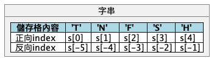

如同一年級在 C++中看到的陣列一樣，我們可以用如下的語法取得字串中的字元
#+begin_src python -r -n :results output :exports both
字串變數[index]: 字串中 index 所在字元
#+end_src
例如
#+begin_src python -r -n :results output :exports both
sch = 'Tainan First Senior High School'
print(sch[0])  # 取得第一個字元
print(sch[1])  # 取得第二個字元
#+end_src
與 C/C++的陣列不同的是:在 Python 中，索引值可以是正數或負數。正數從左到右計算，負數則從右到左計算。
#+begin_src python -r -n :results output :exports both
sch = 'Tainan First Senior High School'
print(sch[-1])  # 最後一個字元
print(sch[-2])  # 倒數第二個字元
#+end_src

#+RESULTS:
: l
: o

** 字串資料切片(slice)
字串資料的索引可以使用範圍表示法進行部分切片。語法如下：
#+begin_src python -r -n :results output :exports both
字串變數[start:end]: 截取部份字串
#+end_src
上述語法可取得 start <= index < end 的所有子字串。注意這裡是 *左閉右開* 區間：包含 start 的位置，但 *不包含* end 的位置。例如 =[1:3]= 會取得 index 1 和 index 2 的字元，不會取到 index 3。這個設計和 range() 一樣，都是「含頭不含尾」。例如
#+begin_src python -r -n :results output :exports both
sch = 'Tainan First Senior High School'
print(sch[1:3])
#+end_src
#+RESULTS:
: ai
此外，你也可以省略 start 和 end，讓 Python 自動取用整個字串。
#+begin_src python -r -n :results output :exports both
sch = 'Tainan First Senior High School'
print(sch[:3])
print(sch[3:])
print(sch[:])
#+end_src

#+RESULTS:
: Tai
: na First Senior High School
: Tainan First Senior High School

也可再加入另一個 increment，每隔數個字元取一個，語法為:
#+begin_src python -r -n :results output :exports both
字串變數[start:end:increment]: 截取部份字串
#+end_src
例如
#+begin_src python -r -n :results output :exports both
sch = 'Tainan First Senior High School'
print(sch[1:10:2])
#+end_src

#+RESULTS:
: an is

** 字串為不可變的資料
在 python 中，字串資料為一種不可變(immutable)的資料類型，這意味著一旦創建了字串，就無法更改它。如果你嘗試直接修改字串中的某個字元，會導致錯誤。
#+begin_src python -r -n :results output :exports both
sch = 'tainan First Senior High School'
sch[0] = 'T'
#+end_src
但可賦予字串變數另一個全新的值，例如
#+begin_src python -r -n :results output :exports both
sch = 'Tainan First Senior High School'
print(sch)
sch = 'I Love TNFSH'
print(sch)
#+end_src

#+RESULTS:
: Tainan First Senior High School
: I Love TNFSH

** 範例 2
#+BEGIN_SRC python -r -n :results output :exports both
tel = '06-2371206'
ext = '#600'
# +
print('tel+ext:',tel+ext)
# *
print('ext*2:', ext*2)
# [index]
print('tel[5]:', tel[5])
# [start:end:increment]
print('tel[1:4]:',tel[1:4])
print('tel[6: ]:',tel[6: ])
print('tel[ :6]:',tel[ :6])
print('tel[::-1]:',tel[::-1])
# in
print("'9' in tel:", '9' in tel)
#+END_SRC

#+RESULTS:
: tel+ext: 06-2371206#600
: ext*2: #600#600
: tel[5]: 7
: tel[1:4]: 6-2
: tel[6: ]: 1206
: tel[ :6]: 06-237
: tel[::-1]: 6021732-60
: '9' in tel: False

上面最後一個範例用到了 =in= 這個運算子，它可以拿來判斷某個子字串是否存在於另一個字串中，結果會是 True 或 False。這在日後處理字串時非常好用，例如：
#+begin_src python -r -n :results output :exports both
email = 'student@tnfsh.tn.edu.tw'
if '@' in email:
    print('這是一個 email 地址')
if 'tnfsh' in email:
    print('這是南一中的 email')
#+end_src

#+RESULTS:
: 這是一個 email 地址
: 這是南一中的 email

** 相關的字串 function
- len(<str>): 計算字串長度
- <str>.lower(): 字串轉小寫
- <str>.upper(): 字串轉大寫
- <str>.islower(): 字串中英文全小寫
- <str>.isupper(): 字串中英文全大寫
- <str>.find(<str1>): 在<str>尋找<str1>，回傳索引值；
若未找到，回傳-1
- <str>.replace(<str1>, <str2>): 將<str>中的<str1>以<str2>取代
- <str>.split([sep]): 字串以 sep 分割, sep 預設值為空白

** 範例 3
#+BEGIN_SRC python -r -n :results output :exports both
school = 'Tnfsh'
print('school:', school)
print('len(school):', len(school))
print('school.lower():', school.lower())
print('school.isupper():', school.isupper())
print("school.find('fsh'):", school.find('fsh'))
print("school.replace('fsh', 'ssh'):", school.replace('fsh', 'ssh'))
print("school.split('f'):", school.split('f'))
#+END_SRC

#+RESULTS:
: school: Tnfsh
: len(school): 5
: school.lower(): tnfsh
: school.isupper(): False
: school.find('fsh'): 2
: school.replace('fsh', 'ssh'): Tnssh
: school.split('f'): ['Tn', 'sh']

** 注意事項
上述的 lower()等 function 貌似改變了字串本身的內容，但實則不然，執行一下底下的程式
#+begin_src python -r -n :results output :exports both
school = 'TNFSH'
print(school)
print(school.lower())
print(school)
#+end_src

#+RESULTS:
: TNFSH
: tnfsh
: TNFSH
或是
#+begin_src python -r -n :results output :exports both
text = 'The quick brown fox jumps over the lazy dog'
print(text.replace('dog', 'pig'))
print(text)
#+end_src

#+RESULTS:
: The quick brown fox jumps over the lazy pig
: The quick brown fox jumps over the lazy dog
如果你真想直接改變字串本身的內容，可以用底下的方式
#+begin_src python -r -n :results output :exports both
text = 'The quick brown fox jumps over the lazy dog'
text = text.replace('dog', 'pig')
print(text)
#+end_src

#+RESULTS:
: The quick brown fox jumps over the lazy pig
這種策略適用所有的字串 function，請自己測試。

** 字串與 List
前面提到字串可以用底下的語法來取得子字串
#+begin_src python -r -n :results output :exports both
text = 'The quick brown fox jumps over the lazy dog'
print(text[5:])
print(text[:5])
print(text[-1])
#+end_src
這個[ ]的用法是不是有點眼熟呢? 還記得在講 split()時，我們提及字串的 split()函數會把分割的子字串分割成如下的結果
#+begin_src python -r -n :results output :exports both
text = 'The quick brown fox jumps over the lazy dog'
print(text.split())
#+end_src

#+RESULTS:
: ['The', 'quick', 'brown', 'fox', 'jumps', 'over', 'the', 'lazy', 'dog']
我們當時有提及[ ]這個用法代表這是個 List，也就是說，其實我們可以把字串當成一個 List，由一個一個字母所組成的 List，就像以前學 C/C++的陣列，所以可以用 index 來取得陣列中的元素，只是 List 的取用彈性比陣列大的多。
*** 字串 v.s. List
前面提及 *字串* 與 *字元組成的* List 有點類似，但是還是有幾個地方不同:
**** 1. 元素類型：List 中可以包含不同的資料型態，但字串只能包含字元。
#+begin_src python -r -n :results output :exports both
scName = ['T', 'N', 'F', 'S', 'H']
scList = [93, 44, 79]
#+end_src
**** 2. List 是可變的（可以修改其中的元素），而字串是不可變的。
如下的 scList，我們可以直接變更其中的元素
#+begin_src python -r -n :results output :exports both
scName = ['T', 'N', 'F', 'S', 'H']
scName[2] = 'S'
#+end_src
但如下的字串就不能變更
#+begin_src python -r -n :results output :exports both
scStr = 'TNFSH'
scStr[1] = 'S' #會出錯
#+end_src
你必須用底下的方式生成一個全新的字串內容
#+begin_src python -r -n :results output :exports both
scStr = 'TNFSH'
scStr = 'TNSSH'
#+end_src
**** 3. 型態不同
最後，雖然二者在語法應用上有些許類似的地方，但本質上是不同的變數型態
#+begin_src python -r -n :results output :exports both
scName = ['T', 'N', 'F', 'S', 'H']
scStr = 'TNFSH'
print(type(scName))
print(type(scStr))
#+end_src

#+RESULTS:
: <class 'list'>
: <class 'str'>

* 判斷結構
:PROPERTIES:
:CUSTOM_ID: py-if-else
:END:

** if
*** 語法
- 條件式可不用括號( )含括，條件式後需搭配冒號：
- 程式區塊以縮排方式處理，同一層縮排視為同一程式區塊
- *特別注意*：Python 不像 C/C++ 用大括號 ~{}~ 來界定程式區塊，而是靠 *縮排*（通常是 4 個空格）。縮排不正確會直接導致程式出錯（IndentationError），這是 Python 初學者最常踩到的坑。
#+BEGIN_SRC python -r -n
if condition:
    statement 1
    ...
#+END_SRC
*** 範例
#+BEGIN_SRC python -r -n :results output :exports both
num = 31
if num % 2 == 0:
    print('{0} is even'.format(num))
if num % 2 == 1:
    print('{0} is odd'.format(num))
#+END_SRC

#+RESULTS:
: 31 is odd
*** 測試
請先觀察以下程式碼，試著猜測輸出結果後再執行驗證：
#+begin_src python -r -n :async :results output :exports both
import math
magicNum = 37

if math.sqrt(magicNum)*10 < 60:
    print('NO', sep='', end='')
print('YES', sep='', end='')
#+end_src

#+RESULTS:
: YES
想一下：為什麼輸出只有 YES 而不是 NOYES？注意第二個 print() 並不在 if 的縮排區塊內，所以不管 if 的條件是否成立，它都會被執行。而 $\sqrt{37} \times 10 \approx 60.83$ ，不小於 60，所以 if 區塊中的 print('NO') 不會執行。

** if ... else ...
*** 語法
#+BEGIN_SRC python -r -n
if condition:
    statement 1
    ...
else:
    statement 3
    ...
#+END_SRC
*** 範例
#+BEGIN_SRC python -r -n :results output :exports
num = 32
if num % 2 == 0:
    print('{0} is even'.format(num))
else:
    print('{0} is odd'.format(num))
#+END_SRC

#+RESULTS:
: 32 is even

** if ... elif ... else ...
*** 語法
#+BEGIN_SRC python -r -n
if condition 1:
    statement 1
    ...
elif condition 2:
    statement 3
    ...
elif condition 3:
    statement 5
    ...
else:
    statement N
#+END_SRC
*** 範例
#+BEGIN_SRC python -r -n :results output :exports
score = 87
if score >= 90:
    print('A')
elif score >= 80:
    print('B')
elif score >= 70:
    print('C')
elif score >= 60:
    print('D')
else:
    print('F')
#+END_SRC

#+RESULTS:
: B
*** 課堂練習
請撰寫一個程式，根據使用者輸入的年齡來判斷該使用者的票價。票價標準如下：
1. 年齡 0 到 5 歲：免費
2. 年齡 6 到 12 歲：票價 100 元
3. 年齡 13 到 64 歲：票價 200 元
4. 年齡 65 歲以上：票價 50 元
5. 若輸入年齡不合法（負數），輸出「年齡不合法」。
**** Solution :noexport:
#+begin_src python -r -n :results output :exports both
# 讀取輸入

#+end_src

** 在 C/C++中寫出來會被駡的語法
不同於 C 或 C++，python 允許下列方便的邏輯判斷：
#+begin_src python -r -n :async :results output :exports both
score = 87
if 60 <= score <= 100:
    print("Pass")
else:
    print("Fail")
#+end_src

#+RESULTS:
: Pass

** 巢狀 if
這部份的語法與 C/C++ 中的巢狀 if 相同，Python 也支援巢狀 if 結構。巢狀 if 是指在一個 if 語句內部再包含另一個 if 語句。這樣可以根據多個條件來決定程式的執行路徑。你只要注意 *縮排* 即可。
*** 語法
#+BEGIN_SRC python -r -n
if condition 1:
    statement 1
    ...
    if condition 2:
        statement 3
        ...
    else:
        statement 5
        ...
else:
    if condition 3:
        statement 7
        ...
    else:
        statement N
        ...
#+END_SRC
*** 範例: 某年份是否為閏年
**** Flowchart code :noexport:
#+BEGIN_SRC dot :file ./YearJudge.png :cmdline -Kdot -Tpng :noexport:
  digraph TLS{
    rankdir=LR;
    x1[shape=box, label = "輸入年份"];
    x2[shape=diamond, label = "4的倍數"];
    x3[shape=diamond, label = "100的倍數"];
    x4[shape=diamond, label = "400的倍數"];
    xY[shape=circle, fontcolor=Red, label="閏年"]
    xN[shape=circle, fontcolor=Blue, label="平年"]

    x1 -> x2;
    x2 -> xN[label="No"]; x2 -> x3[label="Yes"];
    x3 -> xY[label="No"]; x3 -> x4[label="Yes"];
    x4 -> xN[label="No"]; x4 -> xY[label="Yes"];
  }
#+END_SRC
**** 解題流程
閏年判斷流程
#+CAPTION: 閏年判斷流程
#+ATTR_LATEX: :width 500
#+ATTR_ORG: :width 600
#+ATTR_HTML: :width 600
#+RESULTS:
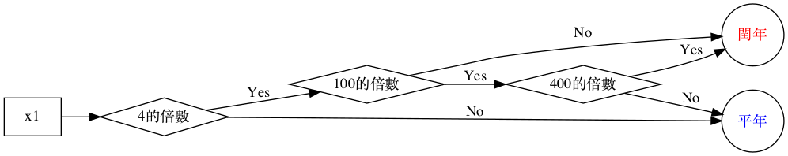
**** code #1
#+BEGIN_SRC python :session :exports both :tangle tangleInput-1.py
year = int(input("請輸入一個年份:"))
if (year % 4) == 0:
    if (year % 100) == 0:
        if (year % 400) == 0:
            print("{0}年是世紀閏年".format(year))
        else:
            print("{0}年為平年".format(year))
    else:
        print("{0}年是普通閏年".format(year))
else:
    print("{0}年為平年".format(year))
#+END_SRC

#+RESULTS:
**** code #2
#+BEGIN_SRC python :session :exports both :tangle tangleInput-1.py
year = int(input("請輸入一個年份:"))
if (year % 4) == 0 and (year % 100) !=0 or (year % 400) == 0:
    print("%s年是閏年" % year)
else:
    print("%s年為平年" % year)
#+END_SRC

** match-case (Python 3.10)
類似 C/C++的 switch-case 結構，從 3.10 版開始支援，使用前請先確定 python 版本。

當你有很多個值要逐一比對時，用 if-elif-else 可以做到，但寫起來會比較冗長。match-case 提供了更簡潔的寫法：
- =match= 後面放要比對的變數
- 每個 =case= 後面放一個要比對的值（或用 =|= 連接多個值）
- =case _= 是萬用匹配，類似 C/C++ 的 default，表示「以上都不符合時」

#+begin_src python -r -n :results output :exports both
#name = input("What's your name? ")
name = "Harry"

match name:
    case "Harry" | "Hermione" | "Ron":
        print("Gryffindor")
    case "Draco":
        print("Slytherin")
    case _:
        print("Who?")
#+end_src

** 如何確認 python 版本
*** Python script
1. System module
#+begin_src python -r -n :async :results output :exports both
import sys
print(sys.version)
#+end_src

#+RESULTS:
: 3.9.12 (main, Apr  5 2022, 01:53:17)
: [Clang 12.0.0 ]
2. platform module
#+begin_src python -r -n :async :results output :exports both
import platform
print(platform.python_version())
#+end_src

#+RESULTS:
: 3.9.12
*** Terminal
#+begin_src shell -r -n :results output :exports both
python --version
#+end_src

#+RESULTS:
: Python 3.9.12

** 實作練習 :noexport:
- [[http://skyoj.tnfsh.tn.edu.tw/sky/index.php/problem/view/162/][skyoj #162 成績等第判別]]
- [[http://skyoj.tnfsh.tn.edu.tw/sky/index.php/problem/view/164/][skyoj #164 獎金給多少]]
- [[http://skyoj.tnfsh.tn.edu.tw/sky/index.php/problem/view/278/][skyoj #278 三角關係]]

** 作業 :noexport:
*** 三角形 :noexport:
#+begin_src python -r -n :async :results output :exports both
a, b, c = map(int, input().split())
e1 = min(a, b, c)
e3 = max(a, b, c)
e2 = a+b+c-e1-e3
#+end_src
*** Binary code
- 任何文字與數字在電腦中儲存時都是使用二元編碼，而所謂二元編碼也就是一段由 0 與 1 構成的序列。在本題中，A~F 這六個字元由一種特殊方 nnnnnnnn 式來編碼，在這種編碼方 式中，這六個字元的編碼都是一個長度為 4 的二元序列，對照表如下:
  |------+------+------+------+------+------|
  | 字元 |    A |    B |    C |    D |    E |
  |------+------+------+------+------+------|
  | 1101 | 0111 | 0010 | 0101 | 1000 | 1100 |
  |------+------+------+------+------+------|
- 輸出：輸出編碼所代表的 N 個字元，字元之間不需要空白或換行間格。
**** solution :noexport:
#+begin_src python -r -n :results output :exports both
instr = input()
c = instr.split()

ch = ""

if c[0]=="0":
  if c[1]=="0": ch='C'
  else:
      if c[2]=="0": ch='A'
      else: ch='B'
else:
  if c[1]=="0": ch='E'
  else:
      if c[3]=="0": ch='F'
      else: ch='D'
print('{alph}'.format(alph=ch))
#+end_src
*** [[https://moodle.tnfsh.tn.edu.tw/mod/vpl/view.php?id=1870][5D. No one is perfect]]
**** solution 1 :noexport:
#+begin_src python -r -n :results output :exports both
import sys
##x = int(input())
##y = int(input())
x = 20
y = 200

for n in range(x, y+1):
    sum = 0
    for i in range(1, n):
        if n % i == 0:
            sum += i
    if sum == n:
        print(sum)
        sys.exit()
print("No one is perfect")
#+end_src

#+RESULTS:
: 28

#+latex:\newpage
**** solution 2 :noexport:
#+begin_src python -r -n :results output :exports both
import sys
##x = int(input())
##y = int(input())
x = 29
y = 10000

for n in range(x, y+1):
    sum = 0
    for i in range(1, n):
        if n % i == 0:
            sum += i
    if sum == n:
        print(sum)
        break;
else:
    print("No one is perfect")
#+end_src

#+RESULTS:
: 496

#+latex:\newpage

* 迴圈結構
:PROPERTIES:
:CUSTOM_ID: py-for-loop
:END:
和 C/C++一樣，Python 也有迴圈結構，主要有兩種：while 迴圈和 for 迴圈。while 迴圈會在條件為真時持續執行，而 for 迴圈則是用來遍歷序列（如列表、字串等）。
** for
Python 的 for 迴圈非常好用，除了可以像 C/C++那樣遍歷數字序列，還可以遍歷字串、列表、元組、字典等資料結構。這使得 Python 的 for 迴圈在處理資料時非常靈活和方便。
*** 語法
#+BEGIN_SRC python -r -n
for variable in sequence:
    statement 1
    ...
#+END_SRC
- for 迴圈的變數會依序走訪 sequence 中的元素
- 這裡的 sequence 可以放 字串(string)、range 函式、表列(list)、元組(tuple)、字典(dict)、集合(set)
*** Sequence 為 String
在之前的章節中，我們提及了字串(string)是由一個一個字元所組成的，所以，字串本質上也是一種序列(sequence)，可以使用 for 迴圈來遍歷字串中的每個字元。這使得 Python 的字串處理非常方便。
#+BEGIN_SRC python -r -n :results output :exports both
school = 'TNFSH'
for x in school:
    print(x, end=' ')
print('\n=========')
for x in school:
    print(chr(ord(x)+1), end=' ')
#+END_SRC

#+RESULTS:
: T N F S H
: =========
: U O G T I

- ord( ) -> 將字元轉為 [[https://zh.wikipedia.org/wiki/ASCII][ASCII]] 編碼(整數)
- chr( ) -> 將 ASCII 編碼(整數)轉為字元

#+begin_src python -r -n :results output :exports both
school = '高雄市'
for x in school:
    print(x, end=' ')
print('\n=========')
for x in school:
    print(chr(ord(x)+1), end=' ')

#+end_src

#+RESULTS:
: 高 雄 市
: =========
: 髙 雅 布
*** Sequence(序列) 為 range() function 語法
但是，如果我們需要像在 C++那樣生成一個整數序列來控制迴圈呢？例如：
#+begin_src cpp -r -n :results output :exports both
#include <iostream>
using namespace std;
for(int i=0; i<10; i++){
    cout << i << " ";
}
#+end_src
在 Python 裡，我們可使用 range() 函式，這個函式會 *產生* 一個 *整數* 序列，通常用於迴圈中。
**** 語法
#+BEGIN_SRC python :exports both
for variable in range([起始值,] 終止值 [,遞增值]):
    statement 1
    ...
#+END_SRC
- 起始值預設為 0，遞增值預設為 1
- 起始值 ≤ range( )的範圍 < 終止值

想知道 range() 產生的序列內容，可以使用 list() 函式將其轉換為列表來查看
#+begin_src python -r -n :results output :exports both
print(range(4))
print(list(range(4)))
#+end_src

#+RESULTS:
: range(0, 4)
: [0, 1, 2, 3]

range()傳回的是一個 range 物件，所以要用 list()
**** 範例
#+BEGIN_SRC python -r -n :results output :exports both
for x in range(4):
    print(x)
print('========')
for x in range(3, 10):
    print(x, end=', ')
print('\n========')
for x in range(3, 10, 2):
    print(x, end=',')
#+END_SRC

#+RESULTS:
: 0
: 1
: 2
: 3
: ========
: 3, 4, 5, 6, 7, 8, 9,
: ========
: 3,5,7,9,
**** 重要觀念
***** 請問下列程式會輸出幾個*
#+begin_src python -r -n :async :results output :exports both
for i in range(10):
    i = 5
    print('*')
#+end_src
答案是 *10 個* 。因為 =range(10)= 已經預先產生了 [0,1,2,...,9] 這個序列，每次迴圈開始時 Python 會從序列中取出下一個值指派給 i，所以即使你在迴圈裡把 i 改成 5，下一輪 i 還是會被序列中的下一個值覆蓋。
***** 如果把程式改成這樣，會輸出什麼?
#+begin_src python -r -n :async :results output :exports both
for i in range(10):
    i = 5
    print(i)
#+end_src
答案是輸出 10 次 5。
***** 這和你所熟悉的 C/C++有什麼不一樣呢?
在 C/C++ 中，如果你在 for 迴圈裡改變了迴圈變數 i 的值（例如 =for(int i=0; i<10; i++)= 中把 i 改成 5），那下一輪就會從 i=6 開始判斷，可能會影響迴圈的執行次數。

但在 Python 中，=for i in range(10)= 的運作方式不同：range(10) 會預先產生一個序列 [0, 1, 2, ..., 9]，每一輪迴圈開始時，Python 會從這個序列中依序取出下一個值重新指派給 i。所以即使你在迴圈中把 i 改成 5，到了下一輪 i 還是會被序列中的下一個值覆蓋，迴圈照樣跑滿 10 次。
*** 把 range()用在字串上
雖然上面提到以 for 迴圈直接走訪字串的每個字元，但有時我們也會需要用 index 來走訪字串，這時就可以把 range() 與 len() 函式搭配使用。
#+begin_src python -r -n :results output :exports both
school = 'TNFSH'
for i in range(len(school)):
    print(school[i], end=' ')
#+end_src
*** 課堂練習
以 FOR 輸出以下字串(提示:字串有兩個常用 function: ord()/chr())
: abcdefghijklmnopqrstuvwxyz
: zyxwvutsrqponmlkjihgfedcba
*** Sequence 為 List
和字串十分類似，Python 的列表（List）也是一種序列，因此可以使用 for 迴圈來遍歷列表中的每個元素。這使得 Python 的列表處理非常方便。
#+begin_src python -r -n :results output :exports both
nums = [60, 70, 30, 110, 90]
for i in nums:
    print(i)
#+end_src
*** 如何將 *一整列以空白為間隔的數字* 全部轉成整數再讀進 List 中
想像一下我們要讀入並處理底下這一行的 5 個數字(也許是把它們加總起來):
: 55 34 12 93 78
以前使用 C/C++時，我們可以直接用 cin >> 來讀入每個數字，然後再將它們加總起來。
#+begin_src cpp -r -n :results output :exports both
#include <iostream>
using namespace std;
int main() {
    int a, b, c, d, e;
    cin >> a >> b >> c >> d >> e;
    cout << a + b + c + d + e << endl;
    return 0;
}
#+end_src
但是在 Python 中，如果我們使用 input() 函式來讀取資料，結果就是這一行資料都會被一口氣讀進來，我們得到就一串以空白間隔的字串：
#+begin_src python -r -n :results output :exports both
numStr = input()
print(numStr)
#+end_src
結果會是這樣：
: 55 34 12 93 78

如何把這個字串裡的數字分割開來，並轉換成整數呢?
1. 我們可以先利用 split() 方法將字串分割成一個列表，這樣每個數字就會成為列表中的一個元素。
2. 接著，我們可以使用 map() 函式將列表中的每個元素轉換為整數。
3. map()函式傳回的是一個迭代器，因此我們可以使用 list() 函式將其轉換為列表。

以下是上述步驟的實作：
#+begin_src python -r -n :results output :exports both
numList = list(map(int, input().split()))
tot = 0
for i in numList:
    tot += i
print(tot)
#+end_src
#+RESULTS:
: 272

** break / else / continue / pass
:PROPERTIES:
:CUSTOM_ID: py-break-else
:END:
break 顧名思義就是「中斷」的意思，當你在迴圈中使用 break 時，迴圈會立即終止，並跳出迴圈。else 則是用來處理迴圈正常結束後的情況。
*** break
在迴圈中，只要碰到 break 就會跳出迴圈，無論是 while 或 for 迴圈都會馬上跳出。使用 break 陳述句，你只需要打上 break，不須加其他東西。
**** 例
#+begin_src python -r -n :results output :exports both
for i in range(10):
    print(i)
    if i == 5:
        break
print('END')
#+end_src

#+RESULTS:
: 0
: 1
: 2
: 3
: 4
: 5
: END

看起來好像沒什麼用對吧？如果只是希望迴圈跑到某個數字就結束，這樣的寫法確實有點多餘，但如果我們想要在迴圈中找到某個特定的條件時就結束迴圈，那麼 break 就非常有用了。
**** 適用時機
檢查某一數是否為質數(假設 n=15)時，常見的做法是由 2~7 逐一測試是否能整除 n，然而測到 3 時就會發現 n 可以被 3 整除，此時還需要再往下測嗎?當然不用，這就是 break 最佳出場時機了...
#+begin_src python -r -n :results output :exports both
num = 32
for i in range(2, num//2):
    if num % i == 0: #找到因數
        print('這不是質數')
        # 既然已經確定不是質數，就不用再去找其他因數了，可以結束這個for迴圈
        break
#+end_src

#+RESULTS:
: 這不是質數

有沒有覺得上面的要求有點 déjà vu?

高一時我們曾經練習過利用 C++寫出判斷某數是否為質數的程式，上面的例子就可以用來解決其中的一個部份功能：如果找到因數，那麼這個數就不是質數....
**** 練習
給定一個正整數 N，請寫一個 Python 程式判斷它是否為質數。
- 質數的定義：大於 1 的自然數，除了 1 和自己之外沒有其他因數。最前面幾個質數為 {2, 3, 5, 7, 11, ...}。
- 範例：
#+BEGIN_EXAMPLE
Input:  11
Output: true
Input:  15
Output: false
Input:  1
Output: false
#+END_EXAMPLE
*** else
這是 Python 的一個獨特語法，在 C/C++ 裡是不存在的：你可以在 for 迴圈後面接一個 else。

直覺上你可能會覺得「迴圈為什麼要配 else？」，其實這裡的 else 可以理解為「如果迴圈 *沒有被 break 中斷*，就執行 else 裡的程式碼」。換個角度想：
- 迴圈跑到尾巴自然結束（正常結束）→ 執行 else
- 迴圈中途被 break 打斷（不正常結束）→ 不執行 else
**** 範例
回到上面的例子，那如果找一直找不到因數呢?顯然 for 迴圈就會從頭跑到尾，都沒機會去執行 break，換句話說，就是迴圈 *正常結束* ，這代表:這個數就是質數，這就是 else 出場的時候了....
#+begin_src python -r -n :results output :exports both
num = 37
for i in range(2, num//2):
    if num % i == 0:
        print('這不是質數')
        # 既然已經確定不是質數，就不用再去找其他因數了，可以結束這個for迴圈
        break
else:
    # 如果上面的for迴圈都沒被break，表示if一直不成立，表示都找不到一個因數
    print('這是質數')
#+end_src

#+RESULTS:
: 這是質數
有沒有覺得這個設計很好用?沒有的話再把這段從頭看一次......
**** 進階閱讀
- [[https://note.pcwu.net/2017/02/26/python-loop-else/][[Python] Loop 配合 else 的妙用]]
*** continue
跳出單次 loop、繼續下一個迴圈。和 break 不同，continue 只會跳過其中的一次迴圈，但是仍會繼續往下把整個迴圈跑完。
**** 範例
#+BEGIN_SRC python -r -n :results output :exports both
count = 0
for letter in 'Python':
    count += 1
    if letter == 'h':
        continue
    print('Processing Letter:', letter)
print(f'迴圈一共跑了{count}次')
#+END_SRC

#+RESULTS:
: Processing Letter: P
: Processing Letter: y
: Processing Letter: t
: Processing Letter: o
: Processing Letter: n
: 迴圈一共跑了 6 次
**** 練習
給定一個字串，印出該字串中除了 'N' 和 'S' 以外的所有字母。
- 範例：
#+BEGIN_EXAMPLE
Input: TNFSH
Output: TFH
#+END_EXAMPLE

***** solution :noexport:
#+begin_src python -r -n :results output :exports both
for letter in 'TNFSH':
    if letter in ['N', 'S']:
        continue
    print(letter, end='')
#+end_src
*** pass
什麼事都不幹.....
- pass 是 Python 中的一個空語句，當你需要一個語句但又不想執行任何操作時，可以使用 pass。它通常用於佔位符，表示這裡將來會有程式碼，但目前還沒有實作。
**** 範例
#+begin_src python -r -n :results output :exports both
count = 0
for letter in 'Python':
    count += 1
    if letter == 'h':
        pass
    print('Processing Letter:', letter)
print(f'迴圈一共跑了{count}次')
#+end_src

#+RESULTS:
: Processing Letter: P
: Processing Letter: y
: Processing Letter: t
: Processing Letter: h
: Processing Letter: o
: Processing Letter: n
: 迴圈一共跑了 6 次
**** 啊有差嗎?
在迴圈中使用 pass 語句，執行程式後，你會發現什麼事也沒做，完全不起任何作用，只是一個空運算而已，那問題就來了：
#+begin_verse
如果什麼事都不做，就不用寫拉，那 pass 語句是要做什麼的？ …… ✍︎
#+end_verse
其實有時候會有非寫不可的情況！！

pass 就像是 To do 的概念，在寫程式的時候，有時候想的比實際寫出來的速度快，例如定義一個函數，但還沒有實作出來，空著內容不寫又會產生語法錯誤，這時就會使用 pass 來替代，當作是個指標，提醒自己之後要來完成[fn:8]。
#+begin_src python -r -n :async :results output :exports both
def myfunction():
    pass  #提醒自己之後要來完成
#+end_src
或是，如果你要自訂一個 Exception class
#+begin_src python -r -n :async :results output :exports both
class MyException(Exception):
    pass

try:
    1/0
except:
    pass
#+end_src
沒有 pass 的話上述程式碼就會出錯

又或者看一下底下的例子[fn:9]:
#+begin_src python -r -n :async :results output :exports both
text = "I am a coder."

if text == "I am not a coder.":
    print("Programming is interesting! You should try it out!")
elif text == "I am a coder.":
    pass
#+end_src
- 簡單來說，~pass~ 就是一個「什麼都不做」的佔位符。Python 的語法規定 if、迴圈、函式裡面不能完全留空，所以當你暫時不想寫任何東西時，就用 ~pass~ 來佔位。
- ~pass~ 常用在還沒實作完成的函式、類別或迴圈中，作為未來補上程式碼的提醒。

** while
:PROPERTIES:
:CUSTOM_ID: py-while
:END:
*** 語法
基本用法與 C/C++相同
#+BEGIN_SRC python :exports both
while (condition):
    statement 1
    ...
#+END_SRC
*** 範例
#+BEGIN_SRC python -r -n :results output :exports both
n = 12345
while (n > 0):
    print(n%10)
    n //= 10
#+END_SRC

#+RESULTS:
: 5
: 4
: 3
: 2
: 1

#+NAME:最大公因數
#+BEGIN_SRC python -r -n :results output :exports both
  m, n = 42, 75
  while (n > 0):
      m, n = n, m % n
  print(m)
#+END_SRC

#+RESULTS:
: 3
*** break / else
while 迴圈也支援 break 和 else，規則和前面 for 迴圈學到的一樣：break 會立刻跳出迴圈，而 else 只在迴圈「沒有被 break 中斷」時才會執行。

while 迴圈中 break 最常見的用法是搭配 ~while True~ 來做「先做再判斷」的迴圈，這在需要持續讀取使用者輸入時特別好用：
#+begin_src python -r -n :results output :exports both
while True:
    print('How is your day?')
    your_reply = input()
    if your_reply == 'quit':
        break
print('good bye')
#+end_src

同樣以質數判斷為例，用 while 來寫的話，和前面 for 的寫法有點不同——我們需要自己控制迴圈變數 ~i~ 的遞增：
#+begin_src python -r -n :results output :exports both
n = 37
i = 2
while i <= n//2:
    if n % i == 0: #找到因數
        print('n不是質數')
        break
    i += 1 #i的值從2測到n的一半
else: #如果都沒被break，表示都沒找到因數
    print('n是質數')
#+end_src

#+RESULTS:
: n 是質數
*** 練習
取代 flag
**** code 1
#+begin_src python -r -n :results output :exports both
nums = [60, 70, 30, 110, 90]
found = False
for n in nums:
    if n > 100:
        found = True
        print("There is a number bigger than 100")
        break

if not found:
    print("Not found!")
#+end_src
**** code 2
#+begin_src python -r -n :results output :exports both
nums = [60, 70, 30, 110, 90]
for n in nums:
    if n > 100:
        print("There is a number bigger than 100")
        break
else:
    print("Not found!")
#+end_src
*** 連續輸入類型問題
某些狀況下，我們需要連續讀入資料，直到 *讀完* 所有資料為止......
**** 方法 1
#+begin_src python -r -n :results output :exports both
ins = input()
while ins !='':
    print(ins)
    ins = input()
#+end_src
**** 方法 2
#+begin_src python -r -n :results output :exports both
while True:
    ins = input()
    if ins == '':
        break
    print(ins)
#+end_src
*** 作業
**** 6C. 分數統計
**** 因數列舉: 使用 else

** 多測資輸入
:PROPERTIES:
:CUSTOM_ID: EOFError
:END:
大多數的輸入要求都會很善良的告訴你接下來有幾個數值要輸入，例如[[https://moodle.tnfsh.tn.edu.tw/course/view.php?id=53#section-7][教學網作業5C: You shell not pass!!]]
#+BEGIN_QUOTE
- 甘道夫在《魔戒》裡的一句「You Shall not PASS！」已經變成這個世代拿來嘲諷改造的一句名言，然而對於正在高中受難的你，仍然很害怕這句詛咒.....，每個學期總要接受來自各個老師的挑戰.........
- 輸入：讀入一個整數 n，接下來要讀入 n 個數字，代表你這學期的 n 科成績。
- 輸出：若你這學期的所有科目均為 60 以上，則輸出"HAHA, I PASS!!! Bite me!!!"，若至少有一科不及格，則輸出"Oh, No!!!"，所有輸出最後均要跳行。
#+END_QUOTE
接下來會有這麼一段輸入：
#+begin_src python -r -n :results output :exports both
3
60
80
12
#+end_src
於是我們就可以很舒服愉快的用以下的程式碼來讀完所有的資料：
#+begin_src python -r -n :results output :exports both
n = int(input())
for i in range(n):
    score = input()
#+end_src
但是，可惜有些時後我們並無法確定到底一共會有多少筆資料要讀取，所以任務就變成 *一直讀入資料，讀到沒東西讀* 。以前在 C++面對這種待讀資料筆數不確定的狀況時可以用 while 來處理:
#+begin_src cpp -r -n :results output :exports both
int n;
while (cin>>n) {
    //....
}
#+end_src
意思非常直白，就是讀到沒東西讀為止，cin>>讀不到東西後就會傳回 false，結束 while()。

在 Python 中，我們可以利用 try...except 來處理這個問題，在此之前我們先來認識一下 EOF 這個東西：如圖[[fig:eof]]，一般的文字檔其實在檔案結尾的地方都有一個特殊符號叫 EOF(End of File)，文書處理軟體在讀到這個符號時就知道這個檔案到此為止，後面沒東西了。

#+CAPTION: 檔案中的 EOF
#+LABEL:fig:eof
#+name: fig:eof
#+ATTR_LATEX: :width 300
#+ATTR_ORG: :width 300
#+ATTR_HTML: :width 300
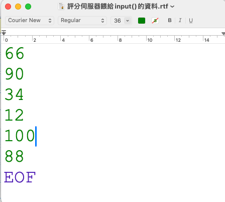

那，這和用我們用 input()讀資料有什麼關係呢？當我們把一隻像這樣的程式送到評分伺服器(online judge server)時...
#+begin_src python -r -n :results output :exports both
for i in range(3):
    n = int(input())
#+end_src
其實網上評分系統是把要「餵」給我們程式的資料以「檔案」的型式準備好，所以，我們的作業每次在做 input()都像是在讀檔，只是以前都會先告訴你一共有幾筆資料，所以我們不用處理 EOF 檔案結尾的問題。現在如果題目有點機車，不告訴你一共有多少變數，要你讀到沒東西讀，那我們就要來學怎麼判斷 EOF 了。

*** 做法 1: '' checking
判斷是否讀到空的資料，下例中，如果是對空資料進行 int()型態轉換，就會得到 ValueError，也可以藉此判斷是否已無資料可讀取
#+begin_src python -r -n :async :results output :exports both
while True:
    try:
        test = int(input())
    except ValueError:
        break
#+end_src
*** EOF checking
有時，某些程式的要求是要你不斷的輸入、計算、輸出結果，直到沒有輸入為止，這種多測資的問題常常會在考試或比賽時遇到。其實，有些評分系統在"餵"輸入給你的程式時，是從 *一個存了許多測資的文字檔* 裡一列一列把資料讀出來，然後餵給你程式中的 input()，當文字資料讀到檔案結尾，就會出現一個 EOF(End of File)的符號，而如果我們想把這個符號用 int()轉成整數，就會出現錯誤，所以，我們可以用 try...except 來抓這個錯誤。如下:
#+begin_src python -r -n :results output :exports both
t = []
while True:
    try:
        n = int(input())  # 讀取輸入並轉換為整數
        t.append(n)
    except: 
        break              # 結束迴圈

print(t) #檢查一下讀到的資料
#+end_src
- EOF 是從檔案讀取資料時結果讀到檔案結尾符號，但是一般我們在寫程式都是從鍵盤輸入資料來進行測試，那怎麼送出一個 EOF 符號給程式呢？答案是按 cmd-D(for MacOS)、Ctrl-D(for Linux)或是 Ctrl-Z(for windows 系統)
- 注意: 用上述方式讀資料，在教學網中似乎有時會導致多讀一個''的元素進來，原因還不清楚，建議在送出到教學網後，可以在將資料讀入 list 後先 print 出來檢測一下，如果發現最後多了一筆資料，就將它 pop 掉。
- 如果你用了 EOFError 卻 *無法正常執行* ，請試著把 EOFError 拿掉，如:

** 巢狀迴圈
*** 範例
#+BEGIN_SRC python -r -n :results output :exports both
for i in range(1, 10):
    for j in range(1, 10):
        print('%d*%d=%2d' %(i, j, i*j), end=' ')
    print()

#+END_SRC

#+RESULTS:
: 1*1= 1 1*2= 2 1*3= 3 1*4= 4 1*5= 5 1*6= 6 1*7= 7 1*8= 8 1*9= 9
: 2*1= 2 2*2= 4 2*3= 6 2*4= 8 2*5=10 2*6=12 2*7=14 2*8=16 2*9=18
: 3*1= 3 3*2= 6 3*3= 9 3*4=12 3*5=15 3*6=18 3*7=21 3*8=24 3*9=27
: 4*1= 4 4*2= 8 4*3=12 4*4=16 4*5=20 4*6=24 4*7=28 4*8=32 4*9=36
: 5*1= 5 5*2=10 5*3=15 5*4=20 5*5=25 5*6=30 5*7=35 5*8=40 5*9=45
: 6*1= 6 6*2=12 6*3=18 6*4=24 6*5=30 6*6=36 6*7=42 6*8=48 6*9=54
: 7*1= 7 7*2=14 7*3=21 7*4=28 7*5=35 7*6=42 7*7=49 7*8=56 7*9=63
: 8*1= 8 8*2=16 8*3=24 8*4=32 8*5=40 8*6=48 8*7=56 8*8=64 8*9=72
: 9*1= 9 9*2=18 9*3=27 9*4=36 9*5=45 9*6=54 9*7=63 9*8=72 9*9=81
*** 如何將資料讀入二維陣列
#+begin_src python -r -n :results output :exports both
a = [1, 2, 3, 4]
b = [5, 6, 7, 8]
c = []
c.append(a)
c.append(b)
print(c)
#+end_src

#+RESULTS:
: [[1, 2, 3, 4], [5, 6, 7, 8]]

** 實作練習
*** 所有位數平方和
輸入一個整數，輸出該整數所有位數平方和
Example
#+BEGIN_EXAMPLE

Input: 12345
Output: 55
#+END_EXAMPLE

**** solution #1 :noexport:
#+begin_src python -r -n :results output :exports both
num = 12345
sos = 0
while (num>0):
    dig  = num % 10
    sos += dig * dig
    num //= 10
print(sos)

#+end_src

#+RESULTS:
: 55
*** 從 1 加到多少才會大於 m?
- 求 1+2+3+...+n<=m，已知 m 時之最大的 n 值。
- 輸入 m，輸出 n。
**** solution :noexport:
#+begin_src python -r -n :results output :exports both
m = 300
n, s = 0, 0
while s <= m:
    n += 1
    s += n
print(n-1)
#+end_src

#+RESULTS:
: 24

*** 輸出 99 乘法表
輸出如下的結果
#+RESULTS:
: 1*1= 1   1*2= 2   1*3= 3   1*4= 4   1*5= 5   1*6= 6   1*7= 7   1*8= 8   1*9= 9
: 2*1= 2   2*2= 4   2*3= 6   2*4= 8   2*5=10   2*6=12   2*7=14   2*8=16   2*9=18
: 3*1= 3   3*2= 6   3*3= 9   3*4=12   3*5=15   3*6=18   3*7=21   3*8=24   3*9=27
: 4*1= 4   4*2= 8   4*3=12   4*4=16   4*5=20   4*6=24   4*7=28   4*8=32   4*9=36
: 5*1= 5   5*2=10   5*3=15   5*4=20   5*5=25   5*6=30   5*7=35   5*8=40   5*9=45
: 6*1= 6   6*2=12   6*3=18   6*4=24   6*5=30   6*6=36   6*7=42   6*8=48   6*9=54
: 7*1= 7   7*2=14   7*3=21   7*4=28   7*5=35   7*6=42   7*7=49   7*8=56   7*9=63
: 8*1= 8   8*2=16   8*3=24   8*4=32   8*5=40   8*6=48   8*7=56   8*8=64   8*9=72
: 9*1= 9   9*2=18   9*3=27   9*4=36   9*5=45   9*6=54   9*7=63   9*8=72   9*9=81
**** solution :noexport:
#+begin_src python -r -n :results output :exports both
for i in range(1, 10):
    for j in range(1, 10):
        print(f'{i}*{j}={i*j:2}', end='   ')
    print()

#+end_src

** 作業
*** 因數和
- 輸入 n，輸出 n 的所有因數和
- 若該數為質數，則輸出 XD
**** solution :noexport:
#+begin_src python -r -n :results output :exports both
import sys
n = 23
sum = 0
i = 2
while i <= n/2 + 1:
    if n % i == 0:
        sum += i
    i += 1
if sum == 0:
    print("XD")
    sys.exit(0)
print(sum)
#+end_src

#+RESULTS:
: XD
*** 所有位數和
輸入一整數，輸出該整數的所有位數和
**** solution 1 :noexport:
#+begin_src python -r -n :results output :exports both
str = '12345'
intLst = map(int, list(str))

print(sum(intLst))
#+end_src

#+RESULTS:
: 15
*** 級數求和
:PROPERTIES:
:ID:       3199d504-9733-4c6e-8476-7381ad15d95d
:END:
- 已知: $S_n = 1 + \frac{1}{2}+\frac{1}{3}+\dots+\frac{1}{n}$ 。顯然對於任意一個整數 K，當 n 足夠大時，S_n 就會大於 K。
  現在給出一個整數 K($1 \leq K \leq 15$)，求一個最小的 n，使$S_n>K$ 。
- 輸入: K
- 輸出: n
**** solution :noexport:
#+begin_src python -r -n :results output :exports both
K = 15
sn = 1
n = 1
while sn <= K:
    n += 1
    sn += 1/n
print(n)
#+end_src

#+RESULTS:
: 1835421
*** 保安～～可以讓人這樣一乘再乘嗎？
- 輸入： 讀入一整數 n、接下來讀入 n 個整數，最後輸入一個整數 m。
- 輸出：將所有 n 個數相乘、再將所得乘積除以 m、輸出餘數
- 提示：( a * b) % c = ( ( a % c ) * ( b % c ) ) % c
**** solution :noexport:
#+begin_src python -r -n :results output :exports both
def findremainder(arr, lens, n):
    mul = 1

    for i in range(lens):
        mul = (mul * (arr[i] % n)) % n

    return mul % n

arr = [ 100, 10, 5, 25, 35, 14 ]
lens = len(arr)
n = 11

print( findremainder(arr, lens, n))
#+end_src
*** To pass or not to pass; that is a question.[APCS]
- 一次考試中,於所有及格學生中獲取最低分數者最為幸運,反之,於所有不及格同學中,獲取最高分數者,可以說是最為不幸,而此二種分數,可以視為成績指標。
  請你設計一支程式,讀入全班成績(人數不固定),請對所有分數進行排序,並分別找出不及格中最高分數,以及及格中最低分數。
  當找不到最低及格分數,表示對於本次考試而言,這是一個不幸之班級,此時請你印出:「worst case」;反之,當找不到最高不及格分數時,請你印出「best case」。
  註:假設及格分數為 60,每筆測資皆為 0~100 間整數,且筆數未定。
- 輸入：第一行為各學生分數(0~100 間),分數與分數之間以一個空白間格。每一筆測資的學生人數為 1~20 的整數。
- 輸出：每筆測資輸出三行。
  第一行由大而小印出所有成績,兩數字之間以一個空白間格,最後一個數字後無空白;
  第二行印出最高不及格分數,如果全數及格時,於此行印出 best case;
  第三行印出最低及格分數,當全數不及格時,於此行印出 worst case。
**** solution :noexport:
#+begin_src python -r -n :results output :exports both
import random

#scStr = ''
#for i in range(2):
#    scStr += ' ' + str(random.randint(0, 100))
#print(scStr)
scStr = ''
scList = list(map(int, scStr.split()))

scList.sort(reverse=True)

for i in range(0, len(scList)-1):
    print(scList[i], end=' ')
print(scList[-1])

fails = sum(1 for x in scList if x <60)

if fails != 0:
    print(scList[-fails])
else:
    print('best case')
if fails == len(scList):
    print('worst case')
else:
    print(scList[-(fails+1)])
#+end_src

#+RESULTS:
*** Binary code[APCS]
- 任何文字與數字在電腦中儲存時都是使用二元編碼，而所謂二元編碼也就是一段由 0 與 1 構成的序列。在本題中，A~F 這六個字元由一種特殊方式來編碼，在這種編碼方式中，這六個字元的編碼都是一個長度為 4 的二元序列，對照表如下:
- 輸入：第一行是一個正整數 N，1  N  4，以下有 N 行，每行有 4 個 0 或 1 的數字，數字間彼此以空白隔開，每一行必定是上述六個字元其中之一的編碼。
- 輸出：輸出編碼所代表的 N 個字元，字元之間不需要空白或換行間格。
**** solution :noexport:
#+begin_src python -r -n :results output :exports both
n = int(input())
out='' # output string
for i in range(n):
  c=[int(x) for x in input().split()]
  if c[0]==0:
    if c[1]==0: ch='C'
    else:
      if c[2]==0: ch='A'
      else: ch='B'
  else:
    if c[1]==0: ch='E'
    else:
      if c[3]==0: ch='F'
      else: ch='D'
  out+=ch #字串後面串接一個字元
print(out)
#+end_src
*** 奇奇復奇奇[APCS]
- 將一個十進位正整數的奇數位數的和稱為 A,偶數位數的和稱為 B,則 A 與 B 的絕對差值|A-B|稱為這個正整數的奇偶差。
  例如:263541 的奇數位數的和 A = 6+5+1 = 12,偶數位數的和 B = 2+3+4 = 9,所以 263541 的奇偶差是|12-9|= 3。
  給定一個十進位正整數 X,請找出 X 的奇偶差。
- 輸入：輸入為一行含有一個十進位表示法的正整數 X,之後是一個換行字元。
- 輸出：請輸出 X 的秘密差 Y(以十進位表示法輸出),以換行字元結尾。

**** solution :noexport:
APCS: 106-03-A 秘密差
#+begin_src python -r -n :results output :exports both
#ns = input()
ns = '89273464123'
ns = ns[::-1]

os = es = 0
o = True
for i in range(len(ns)):
    if o:
        os += int(ns[i])
        o = False
    else:
        es += int(ns[i])
        o = True
print(abs(os-es))
#+end_src

#+RESULTS:
: 3
*** Super Mario[簡化版]
- 應俱備能力
  + for
  + if
- 瑪莉歐(Mario)在最後的城堡。他現在需要跳過一些牆壁，然後進入庫巴(Koopa)的房間，他要打敗怪物，以拯救公主。
  對於這個問題，我們只關注“翻過牆”的一部分。
  你將被給予 N 個牆壁(由左至右)的高度。
  瑪莉歐(Mario)目前站在第一個牆壁。他必須跳到相鄰的牆壁直到最後一個。
  這意味著，他將跳躍 N - 1 次。a high jump 代表瑪莉歐(Mario)跳到一個較高的牆，同樣，a low jump 代表瑪莉歐(Mario)跳到一個較矮的牆。
  你能找出 a high jump 和 a low jump 的總數嗎?
- 輸入：測資有兩列，第一列為一個正整數 N（N < 50），表示牆壁的數目。下一行依序為 N 個牆壁的高度(由左至右)。每一個高度是不超過 10 的非負整數。
- 輸出：兩列，每列一個數字，第一列數字代表 high jumps 總數；第二列數字代表 low jumps 的總數。
**** solution :noexport:
UVa: 11764 - Jumping Mario
#+begin_src python -r -n :results output :exports both
n = int(input())
for i in range(0, n):
    highers = lowers = 0
    m = int(input())
    actions = input().split()
    for j in range(0, m-1):
        a1 = int(actions[j])
        a2 = int(actions[j+1])
        if a2>a1: highers += 1
        if a2<a1: lowers += 1
    print(f'Case {i+1}: {highers} {lowers}')
#+end_src

#+RESULTS:
*** Rotate :noexport:
#+begin_src python -r -n :results output :exports both
ma = [[ 1, 2, 3 ],
      [ 4,10,12],
      [ 5, 6, 7 ]]

"""
ma = []
while True:
    try:
        ma.append(input().split())
    except:
        break
print(ma)

"""
for i in ma:
    for j in i:
        print('{0:3d}'.format(j), end='')
    print()

rma = [[0]*len(ma)]*len(ma[0])
"""
for i in range(len(ma[0])):
    for j in range(len(ma)):
        rma[j][i] = ma[i][j]
"""
for i in range(len(ma[0])-1, -1, -1):
    for j in range(len(ma)):
        print('{0:3d}'.format(ma[j][i]), end='')
    print()
#+end_src

#+RESULTS:
:   1  2  3
:   4 10 12
:   5  6  7
:   3 12  7
:   2 10  6
:   1  4  5
*** 打疫苗囉
**** 說明
- BNT 開打了， 一堆學生跑去排隊，只是，到了現場排好隊後，有一堆學生現場暈針，臉上三條線的護士只好把這些暈針的學生拉到隊伍的最後面....
- 已知學生排隊的狀況如下，其中數字代表學號，0為暈針的學生
  98122 98114 98001 98008 0 98013 0 98028
- 請在不影響其他學生排隊順序的前提下，把暈針的學生全部排到隊伍的最後面，上例的結果如下
  98122 98114 98001 98008 98013 98028
**** 輸入
以空白間隔的學號，已知學生人數不超過 10 萬人
**** 輸出
每個學生的學號都以一個英文空白間隔，最後一個學號後面沒有空白
**** Solution 1 :noexport:
#+begin_src python -r -n :results output :exports both
# 產生測資
import random
from timeit import default_timer as timer
nums = ''.join(str(random.randint(80000,90000))+' ' for i in range(10000))
nums = list(nums.split())
for i in range(len(nums)//3):
    nums.insert(random.randint(0, len(nums)), '0')
#print(nums)
# 解題
start = timer()

zeros = 0
while '0' in nums:
    if '0' in nums:
        nums.remove('0')
        zeros += 1
for times in range(zeros):
    nums.append('0')
#print(nums)

end = timer()
print(end-start)
#+end_src

#+RESULTS:
: 0.647637641
**** Solution 2 :noexport:
#+begin_src python -r -n :results output :exports both
import random
from timeit import default_timer as timer
nums = ''.join(str(random.randint(80000,90000))+' ' for i in range(10000))
nums = list(nums.split())
for i in range(len(nums)//3):
    nums.insert(random.randint(0, len(nums)), '0')
#print(nums)
start = timer()
# 解題

while True:
    counts = 0
    for i in range(len(nums)-1):
        if nums[i] == '0' and nums[i+1] != '0':
            nums[i] = nums[i+1]
            nums[i+1] = '0'
            counts += 1
    if counts == 0:
        break

#print(nums)
# 時間
end = timer()
print(end-start)
#+end_src

#+RESULTS:
: 9.098140834
**** Solution 3 :noexport:
#+begin_src python -r -n :results output :exports both
import random
from timeit import default_timer as timer
nums = ''.join(str(random.randint(80000,90000))+' ' for i in range(3000))
nums = list(nums.split())
for i in range(len(nums)//5):
    nums.insert(random.randint(0, len(nums)), '0')

tmp = ''.join(x+ ' ' for x in nums)
with open("./0.in", "w") as f:
    f.write(tmp)
#print(tmp)
start = timer()
# 解題
# 1 3 0 2 4
#       i
#     j
j = 0
for i in range(len(nums)):
    if nums[i] != '0':
        nums[j] = nums[i]
        j += 1
for i in range(j, len(nums)):
    nums[j] = '0'
    j += 1
tmp = ''.join(x+ ' ' for x in nums)
with open("./0.ans", "w") as f:
    f.write(tmp)
#print(tmp)
f.close()
# 時間
end = timer()
print('\nTime:\n',end-start)

#+end_src

#+RESULTS:
:
: Time:
:  0.0011322969999999974
**** Solution 4 :noexport:
:PROPERTIES:
:ID:       7c1b1f68-b2b8-4ec7-a546-866fec168f70
:END:
#+begin_src python -r -n :results output :exports both
x = '81016 84928 86910 80153 82044 0 89449 0 83374 81435 0 86041 88906 0 81525 82732 80739 88456 88031 86411 0 82120 84604 85999 85895 0 83377 80602 88273 88664 80704 84871 0 84089 0 0 88272 82781 83248'
nums = list(x.split())
# 解題
j = 0
for i in range(len(nums)):
    if nums[i] != '0':
        print('{0:s} '.format(nums[i]), end='')
        j += 1
for i in range(j, len(nums)):
    print('0 ', end="")
    j += 1

#+end_src

#+RESULTS:
: 81016 84928 86910 80153 82044 89449 83374 81435 86041 88906 81525 82732 80739 88456 88031 86411 82120 84604 85999 85895 83377 80602 88273 88664 80704 84871 84089 88272 82781 83248 0 0 0 0 0 0 0 0 0

* 資料型別-LIST, TUPLE
:PROPERTIES:
:CUSTOM_ID: py-types
:END:
** 為什麼需要資料型別
接下來介紹的幾種 Python 的資料型別，主要是為了讓程式能夠更有效率地處理不同種類的資料，尤其是如何有效的儲存與運算大量的資料。

為什麼需要一個能儲存大量資料的型別呢？

如果要計算 5 個學生的平均成績，當然可以用 5 個變數來儲存 5 個成績，再計算平均值，例如：
#+begin_src python -r -n :results output :exports both
a, b, c, d, e = map(int, input().split()) #輸入5個成績，以空白分隔
avg = (a + b + c + d + e) / 5
print(f'平均成績為 {avg:.2f}')
#+end_src

但是，如果要計算 100 個學生的平均成績呢？要用 100 個變數嗎？這樣不但麻煩，程式碼也會很長。而且，如果題目是先告訴你有 N 個學生，N的值可能會變動，你要怎麼辦呢？

所以，我們需要一種能夠儲存大量資料的型別，這樣就可以用一個變數來儲存所有學生的成績，然後用迴圈來計算平均值。

** 串列 List
List 為 Python 的核心功能之一，雖名為 List，實際為一種 dynamic array，即，在新增或移除元素時，Python 會負責調整 List 的儲存空間，動態配置或釋放記憶體。

如果你已經有 C/C++ 的背景，那麼你可以把 List 想像成一個陣列(array)，但比陣列更強大，因為 List 可以儲存 *不同類型* 的資料，而陣列只能儲存 *相同類型* 的資料。
可以先想像為 C/C++的陣列，但裡面可以儲存 *不同類型* 的資料。

接下來的內容，我們會先假設你的程式裡已經有了 List 這樣的資料型別，並介紹如何使用它，之後再來介紹實際解決問題時要如何新建一個 List、並將資料讀入 List 中。

*** List 的基本概念
以下是 List 的基本概念:
- List 以[ ]將不同型態的資料含括起來，以 , 分隔,
- List 中的資料是有序排列，從 0 開始編號
- 指定語法: List 變數  = [ 元素 1, 元素 2, 元素 3, 元素 4, ... ]
- 範例: data = [33, 95, 41, 45, 66, 88]

例如，我們在以下的程式中建立了一個 List 變數 data，並將 6 個整數放入其中:
#+begin_src python -r -n :results output :exports both
data = [33, 95, 41, 45, 66, 88]
#+end_src
這樣一來，變數 data 就是一個 List，裡面有 6 個元素，分別是 33、95、41、45、66、88。
|---------+---------+---------+---------+---------+------------|
| data[0] | data[1] | data[2] | data[3] | data[4] |    data[5] |
|---------+---------+---------+---------+---------+------------|
|     <c> |     <c> |     <c> |     <c> |     <c> |        <c> |
|   33    |    95   |    41   |    45   |    66   |     88     |
|---------+---------+---------+---------+---------+------------|

*** List 與字串
在 Python 中，很多不同的資料型別都可以互換，例如我們之前最常用的：
#+begin_src python -r -n :results output :exports both
a = int(input())
#+end_src
就是將輸入的字串轉換成整數(int)型別，這樣我們就可以對變數 a 進行數學運算了。

同樣地，List 也可以和字串互換，例如：
#+begin_src python -r -n :results output :exports both
s = '339541456688'
data = list(s)
print(data)
#+end_src

#+RESULTS:
: ['3', '3', '9', '5', '4', '1', '4', '5', '6', '6', '8', '8']
當字串被強制轉換成 List 時，List 中的每個元素就是字串中的每個字元。學會這個技巧後，你在面對需要處理字串的問題時，就可以更靈活地運用 List 來解決問題了！

*** List 中元素的存取與走訪
List 中的元素可以透過索引值來存取，索引值從 0 開始。例如，要存取 data 中的第一個元素，可以使用 data[0]、要存取第二個元素，可以使用 data[1]，以此類推。

是不是有點熟悉的感覺？沒錯，我們之前在介紹字串(String)時，也有提到過類似的概念，字串中的每個字元也是有序排列的，可以透過索引值來存取。

例如：
#+begin_src python -r -n :results output :exports both
data = [33, 95, 41, 45, 66, 88]
print(data[0]) #輸出第一個元素
print(data[3]) #輸出第四個元素
#+end_src

#+RESULTS:
: 33
: 45

這麼看來，List 和字串有很多相似的地方，不過 List 更加靈活，因為它可以儲存不同類型的資料。
看到這裡，你應該可以想像 List+for 迴圈的組合，可以解決很多需要處理大量資料的問題了吧！例如：

#+begin_src python -r -n :results output :exports both
data = [33, 95, 41, 45, 66, 88]
for i in range(len(data)):
    print(f'data[{i}] = {data[i]}')
#+end_src

#+RESULTS:
: data[0] = 33
: data[1] = 95
: data[2] = 41
: data[3] = 45
: data[4] = 66
: data[5] = 88

這種行為我們就稱為「遍歷 List」，也有人叫做「走訪 List」，就是用迴圈一個一個地存取 List 中的每個元素。每當你學到一個新的資料型別時，都可以試著想想看，這個資料型別能不能跟 for 迴圈搭配起來使用，這樣你就能解決更多的問題了！

這種使用 range()和 len()來遍歷 List 的方式，在 Python 中非常常見，幾乎可以說是每個 Python 程式都會用到的技巧。另一種走訪 List 的方式是直接用 for element in list 的語法，這種方式更簡潔，也更符合 Python 的風格。例如：
#+begin_src python -r -n :results output :exports both
data = [33, 95, 41, 45, 66, 88]
for element in data:
    print(element)
#+end_src

#+RESULTS:
: 33
: 95
: 41
: 45
: 66
: 88

除了走訪 List 之外，我們也可以對 list 中的元素進行加總，例如：
#+begin_src python -r -n :results output :exports both
data = [33, 95, 41, 45, 66, 88]
tot = 0
for element in data:
    tot += element
print(f'總和為 {tot}')
#+end_src

#+RESULTS:
: 總和為 368

List 另一個強大之處在於可以和很多不同的函式搭配使用，例如 sum() 函式可以用來計算 List 中所有元素的總和，max() 函式可以用來找出 List 中的最大值，min() 函式可以用來找出 List 中的最小值。例如：
#+begin_src python -r -n :results output :exports both
data = [33, 95, 41, 45, 66, 88]
print(f'總和為 {sum(data)}')
print(f'最大值為 {max(data)}')
print(f'最小值為 {min(data)}')
#+end_src

#+RESULTS:
: 總和為 368
: 最大值為 95
: 最小值為 33

*** List 的相關函式
除了前面已經介紹過的 sum()、max()、min() 之外，還有很多其他的函式也可以和 List 搭配使用，例如 len() 函式可以用來計算 List 中元素的個數，sorted() 函式可以用來將 List 中的元素排序，list() 函式可以用來將其他型別的資料轉換成 List。
例如：
#+begin_src python -r -n :results output :exports both
data = [33, 95, 41, 45, 66, 88]
print(f'元素個數為 {len(data)}')
print(f'排序後的 List 為 {sorted(data)}')
s = '339541456688'
data2 = list(s)
print(f'字串轉換成 List 為 {data2}')
#+end_src

#+RESULTS:
: 元素個數為 6
: 排序後的 List 為 [33, 41, 45, 66, 88, 95]
: 字串轉換成 List 為 ['3', '3', '9', '5', '4', '1', '4', '5', '6', '6', '8', '8']

*** List 的專用函式
除了上述的函式之外，List 本身也有很多專用的函式，可以用來操作 List，例如 append() 函式可以用來在 List 的尾端新增一個元素，remove() 函式可以用來移除 List 中的某個元素，sort() 函式可以用來將 List 中的元素排序。

但是這些專用函式並不是像 len()、max() 那樣直接呼叫的內建函式，而是 List 物件自帶的方法(method)，所以在使用時必須用 =List變數.方法名稱()= 的方式來呼叫（注意中間有個點號 =.= ）。你可以這樣理解差異：
- 內建函式：=len(x)= → 把 x 丟進 len() 裡面
- List 方法：=x.append('F')= → 對 x 這個 List 呼叫它的 append 方法

例如：
**** <List>.clear()
清除表列中所有元素
#+begin_src python -r -n :results output :exports both
x = ['A', 'B', 'C', 'D', 'E']
x.clear()
print("清除後的表列:", x)
#+end_src

#+RESULTS:
: 清除後的表列: []
**** <List>.index( *某元素* )
找出 *某個元素* 在 list 中的位置
#+begin_src python -r -n :results output :exports both
x = ['A', 'B', 'C', 'D', 'E']
print(x.index('C'))
#+end_src

#+RESULTS:
: 2
**** <List>.append( *某元素* )
將 *某元素* 加到<List>尾端
#+begin_src python -r -n :results output :exports both
x = ['A', 'B', 'C', 'D', 'E']
x.append('F')
print("加入F後的表列:", x)
#+end_src

#+RESULTS:
: 加入 F 後的表列: ['A', 'B', 'C', 'D', 'E', 'F']
**** <List>.extend(<List1>)
將<List1>合併至<List>尾端
#+begin_src python -r -n :results output :exports both
x = ['A', 'B', 'C']
y = ['D', 'E']
x.extend(y)
print("合併後的表列:", x)
#+end_src

#+RESULTS:
: 合併後的表列: ['A', 'B', 'C', 'D', 'E']
**** <List>.remove( *某元素* )
移除<List>中 *某元素* 元素(會花多一點的時間，移除 list 中間的元素後，要把後面的元素往前搬)
#+begin_src python -r -n :results output :exports both
x = ['A', 'B', 'C', 'D', 'E']
x.remove('C')
print("移除C後的表列:", x)
#+end_src

#+RESULTS:
: 移除 C 後的表列: ['A', 'B', 'D', 'E']
**** <List>.insert(<i>, *某元素* )
將 *某元素* 加到<List>的索引值<i>位置
#+begin_src python -r -n :results output :exports both
x = ['A', 'B', 'D', 'E']
x.insert(2, 'C')
print("在索引2插入C後的列表:", x)
#+end_src

#+RESULTS:
: 在索引 2 插入 C 後的列表: ['A', 'B', 'C', 'D', 'E']
**** <List>.reverse():
反轉表列元素
#+begin_src python -r -n :results output :exports both
x = ['A', 'B', 'C', 'D', 'E']
x.reverse()
print("反轉後的列表:", x)
#+end_src

#+RESULTS:
: 反轉後的列表: ['E', 'D', 'C', 'B', 'A']
**** <List>.sort()
將表列中所有元素排序，語法如下:
#+begin_src python -r -n :results output :exports both
List.sort(key=None, reverse=False)
#+end_src
- key: 可選參數，指定一個函數，用來從每個元素中提取比較的依據。例如 =key=len= 就是依照元素長度來排序。
- reverse: 排序規則，reverse = True 降序， reverse = False 升序（預設值）。
#+begin_src python -r -n :results output :exports both
x = [3, 1, 4, 1, 5, 9, 2]
x.sort()
print("升冪排序:", x)
x.sort(reverse = True)
print("降冪排序:", x)
#+end_src

#+RESULTS:
: 升冪排序: [1, 1, 2, 3, 4, 5, 9]
: 降冪排序: [9, 5, 4, 3, 2, 1, 1]
**** <List>.count( *某元素* )
計算 list 中 *某個元素* 出現的次數
#+begin_src python -r -n :results output :exports both
l = ['A', 'Q', 'S', 'A', 'Z']
print(l.count('A'))
#+end_src

#+RESULTS:
: 2

*** 對 List 中元素的修正
將資料放入 List 後，可以透過索引值來修改 List 中的元素。例如：

#+begin_src python -r -n :results output :exports both
test = [12, 13, 14]
test[1] = 999
print(test)
#+end_src

#+RESULTS:
: [12, 999, 14]

*** List 的切片(slicing)
Python 的 List 雖然在概念上與 C++的陣列頗為相似，但在應用上則擁有更大的彈性，除了可以儲存不同類型的資料，最大的特色就是 Python 的 List 提供很強大的切片功能。

以下的範例是一些 List 切片的應用範例，不過如果你已經有了字串切片的概念，那麼你會發現 List 切片的用法幾乎是一模一樣的。這部份就可以參考前面介紹字串切片的內容，不用太認真看。
**** 基本的 List sliceing
list slicing 是將 list 切出其中一部份
- 預設用法為 list[x:y]
- 區間定義為左閉右開(含左不含右)
- 負的 index 為倒數(自 list 尾端數過來)
#+begin_src python -r -n :async :results output :exports both
list1 = [1, 2, 3, 4, 5, 6]
print(list1[2:4])
print(list1[:3])
print(list1[2:])
print(list1[-2])
#+end_src

#+RESULTS:
: [3, 4]
: [1, 2, 3]
: [3, 4, 5, 6]
: 5
也可以對 list slice 賦值，即，將 list slice 放在等號左邊
#+begin_src python -r -n :async :results output :exports both
list1 = [1, 2, 3, 4, 5, 6]
list1[:3] = [9, 9, 9] # [9, 9, 9]也可以寫成 [9] * 3
print(list1)
list1[:0] = [0, 0, 0] #詭異的插值方式1
print(list1)
list1[-1:] = [8, 8, 8] #詭異的插值方式2
print(list1)
#+end_src

#+RESULTS:
: [9, 9, 9, 4, 5, 6]
: [0, 0, 0, 9, 9, 9, 4, 5, 6]
: [0, 0, 0, 9, 9, 9, 4, 5, 8, 8, 8]
**** 進階的 List slicing
不要故意把程式寫的太精簡詭異，也許日後自己會看不懂
#+begin_src python -r -n :async :results output :exports both
list1 = [1, 2, 3, 4, 5, 6, 7, 8, 9]
print(list1[2:8:2])
print(list1[::3])
print(list1[::-1]) #反轉
#+end_src

#+RESULTS:
: [3, 5, 7]
: [1, 4, 7]
: [9, 8, 7, 6, 5, 4, 3, 2, 1]

*** List 的坑: list assign
List 雖然很好用，但也有一些需要注意的地方，否則很容易掉入陷阱。其中一個常見的陷阱就是 List 的賦值(assign)。

在 Python 中，當你寫 =b = a= 時，b 並不是 a 的「副本」，而是和 a 指向 *同一份資料* 。你可以把它想像成：a 和 b 是同一間房間的兩把鑰匙，不管你用哪把鑰匙進去改了房間裡的東西，另一把鑰匙打開看到的都是改過的結果。

#+begin_src python -r -n :async :results output :exports both
a = [1, 2, 3]
b = a          # b 和 a 指向同一個 List
a[2] = 100     # 透過 a 改了第三個元素
print(a)       # a 變了
print(b)       # b 也跟著變了！因為它們是同一個 List
#+end_src

#+RESULTS:
: [1, 2, 100]
: [1, 2, 100]

這和整數、字串的行為不同（因為整數和字串是不可變的），是 Python 初學者最容易踩到的坑之一。

若真要複製一份獨立的 List，有兩種做法:
#+begin_src python -r -n :async :results output :exports both
a = [1, 2, 3]
b = a.copy()
c = a[:]
a[2] = 100
print(a)
print(b)
print(c)
#+end_src

#+RESULTS:
: [1, 2, 100]
: [1, 2, 3]
: [1, 2, 3]

**** list assign, is, ==
既然講到 list 的 assign(b=a)，我們就順便來講講 Python 的一個有趣小常識：== v.s. is，在 Python 中，is 和 == 都用來比較，但用途和比較的內容完全不同：
| 比較運算子 | 用途             | 比較的是              | 適用情境範例         |
|------------+------------------+-----------------------+----------------------|
| ==         | 值是否相等       | 兩個物件的「值」      | 數值、字串、列表等   |
| is         | 是否為同一個物件 | 兩個物件的「身份 ID」 | 是否為同一個實體物件 |
換言之，==在於判斷值相等（value equality）；而 is 在判斷身份相等（identity equality），也就是（記憶體位址相同）
舉例來說，底下有兩個變數，其內容(值)相等
#+begin_src python -r -n :results output :exports both
a = [1, 2, 3]
b = [1, 2, 3]
print(a == b)  # True，因為內容一樣
print(a is b) # False，因為兩個變數指向不同的物件
#+end_src

#+RESULTS:
: True
: False
另一個例子是，當我們用 a = b 這種方式來賦值時，a 和 b 其實是指向同一個物件，所以
#+begin_src python -r -n :results output :exports both
a = [1, 2, 3]
b = a
print(a == b)  # True，因為內容一樣
print(a is b) # True，因為兩個變數指向同一個物件
#+end_src

#+RESULTS:
: True
: True
這樣，你學廢了嗎？

*** 如何建立一個 List
介紹完 List 的基本概念與操作後，接下來要介紹如何建立一個 List 以及如何將資料讀入 List 中。作業裡很多題目都需要用到 List 來儲存大量的資料，所以這部份的內容非常重要，請務必仔細閱讀並理解。
**** 建立空的 List
建立 List 的第一步，當然是要先建立一個空的 List 變數，可以用下列語法:
#+begin_src python -r -n :async :results output :exports both
testl = []
#+end_src
**** 為 List 加入 element
接下來就可以用 append() 函式或 += 運算子來將 element 加入 List 中。例如:
#+begin_src python -r -n :async :results output :exports both
testl = []
testl.append(1)
testl.append(2)
testl += [3]
print(testl)
#+end_src

#+RESULTS:
: [1, 2, 3]
**** 把一串輸入值存入 List 中
要讀入的資料可能是逐列輸入，也可能是以空白間隔的方式輸入，以下分別介紹這兩種情況如何將輸入值存入 List 中。
***** 如果輸入是逐列輸入，共有 5 列
#+begin_src python -r -n :async :results output :exports both
'''
23
45
61
32
33
'''
testl = []
for i in range(5):
    testl.append(input())
#+end_src
***** 如果輸入是在一列，以空白間隔
#+begin_src python -r -n :async :results output :exports both
'''
輸入：23 45 61 32 33
'''
testl1 = input().split()
#+end_src
有沒有發現，其實我們之前一直在使用的 input().split() ，其結果就是一個 List，只不過裡面的元素都是字串而已。只是我們之前沒有介紹到 List，所以先讓大家以多個變數來接收這些輸入值罷了。例如：
#+begin_src python -r -n :results output :exports both
a, b, c = input().split()
#+end_src

但是像上面這樣把用 input().split()所建立的 List,其元素都是字串，如果要把它們轉成整數，還需要再做一次轉換，例如：
#+begin_src python -r -n :results output :exports both
testl1 = list(map(int, input().split()))
#+end_src
這樣就可以把輸入的字串轉成整數，並存入 List

為什麼在 map()外面還要再用 list()包起來呢？因為 map() 函式會回傳一個 map 物件，而不是 List，所以我們需要用 list() 函式將 map 物件轉成 List。

*** 判斷 list 中有沒有某個元素
可以用 *in* 或 *not in* 來判斷，例如:
#+begin_src python -r -n :results output :exports both
x = ['A', 'B', 'C', 'D', 'E']
if 'B' in x:
    print('list裡有B')
if 'Q' not in x:
    print('list裡沒有Q')
#+end_src

#+RESULTS:
: list 裡有 B
: list 裡沒有 Q

*** List 的另一個坑: 走訪 List 時修改元素
有時候我們會需要在走訪 List 時，同時修改 List 中的元素（尤其是刪除元素），這時候就要特別小心，否則很容易出錯。 例如，下面的程式碼試圖把不及格的分數從 List 中刪除:
#+begin_src python -r -n :results output :exports both
a = [75, 82, 49, 90, 33, 67]
for x in a:
    if x < 60:
        a.remove(x)
print(a)
#+end_src

#+RESULTS:

執行上述程式 *可能* 會出現下列錯誤
#+begin_src shell -r -n :results output :exports both
File "<stdin>", line 5, in <module>
ValueError: list.remove(x): x not in list
#+end_src

這是因為在走訪 List 時，同時修改 List 中的元素，會導致迴圈的行為變得不可預期。在之前介紹 for 迴圈走訪 List 時，我們提到過，for 迴圈會根據 List 的長度來決定要執行多少次迴圈，而每次迴圈會依序取出 List 中的元素。當我們刪除 List 中的元素時，List 的長度會改變，而迴圈的索引值卻沒有跟著改變，這樣就會導致某些元素被跳過，或者是出現索引值超出範圍的錯誤。

以 for 來走訪 list 時，list 中的元素是 for 迴圈重複的重要依據，一邊依賴 list 來執行迴圈，一邊又在執行時去刪除 list 中的元素，這種行為就如同那些明明領著台灣納稅人的錢但又急於刪減台灣國防預算打算與敵國裡應外合的立委一樣。
#+ATTR_LATEX: :width 300
#+ATTR_ORG: :width 300
#+ATTR_HTML: :width 400

為了避免這種情況，我們可以採用以下幾種方法來解決這個問題(這部份內容請自行閱讀):
**** 使用 List comprehension 來建立一個新的 List，只包含我們想要保留的元素。例如:
#+begin_src python -r -n :results output :exports both
a = [75, 82, 49, 90, 33, 67]
a = [x for x in a if x >= 60]
print(a)
#+end_src
#+RESULTS:
: [75, 82, 90, 67]
**** 使用反向迴圈來走訪 List，這樣在刪除元素時就不會影響到尚未走訪的元素。例如:
#+begin_src python -r -n :results output :exports both
a = [75, 82, 49, 90, 33, 67]
for i in range(len(a)-1, -1, -1):
    if a[i] < 60:
        del a[i]
print(a)
#+end_src
#+RESULTS:
: [75, 82, 90, 67]
**** 使用 while 迴圈來走訪 List，並在刪除元素後調整索引值。例如:
#+begin_src python -r -n :results output :exports both
a = [75, 82, 49, 90, 33, 67]
i = 0
while i < len(a):
    if a[i] < 60:
        a.remove(a[i])
    else:
        i += 1
print(a)
#+end_src

#+RESULTS:
: [75, 82, 90, 67]

*** '[sep]'.join( <List>)
join() 可以把一個 List 裡的字串元素全部「黏」成一個字串，中間用你指定的分隔符隔開。

注意它的語法可能和你預期的不一樣：不是 =List.join(分隔符)= ，而是 =分隔符.join(List)= 。也就是說，join() 是 *字串* 的方法，不是 List 的方法。你可以這樣記：「用什麼分隔符來 join 這個 List」。

另外要注意：List 裡的元素必須 *全部都是字串* ，如果有數字就會出錯。
#+begin_src python -r -n :results output :exports both
words = ['Hello', 'world', 'Python']
result = ' '.join(words)
print(result)
# 用不同的分隔符
print(', '.join(words))
print('-'.join(words))
# 不用分隔符（直接串接）
print(''.join(words))
#+end_src

#+RESULTS:
: Hello world Python
: Hello, world, Python
: Hello-world-Python
: HelloworldPython

join() 可以想成是 split() 的反操作：split() 把字串拆成 List，join() 把 List 合成字串。

*** 課堂練習
將以下 List 複製貼上至程式碼中
#+begin_src python -r :results output :exports both
scores = [78, 12, 97, 45, 12, 45, 98, 100, 9, 23]
#+end_src
輸出以下資訊
- 全班平均：至小數點第 2 位
- 全班最高分分數
- 全班最低分分數

*** zip()
**** zip 與 for 迴圈
在 Python 中若要將兩個 List 以迴圈的方式一次各取一個元素出來處理，可以使用 zip 打包之後配合 for 迴圈來處理，如下例
#+begin_src python -r -n :results output :exports both
# 第一個 List
names = ["A", "B", "C"]

# 第二個 List
values = [11, 23, 46]

# 使用 zip 同時迭代兩個 List
for x, y in zip(names, values):
    print(x, y)
#+end_src
這裡的 zip(names, values) 會將 names 與 values 的每個元素以一對一的方式配對起來，組成一個新的迭代器，然後交給 for 迴圈進行迭代，所以每一次迭代時所取的 x 值會來自於 names，而 y 則會來自於 values[fn:10]。結果如下：
#+RESULTS:
: A 11
: B 23
: C 46
**** 不同長度的 Lists
zip 若遇到不同長度的 List 時，會以長度最短的 List 為準，超過長度的部分就會被捨棄。zip 也可應用於兩個以上的 List，如：
#+begin_src python -r -n :results output :exports both
# 多個 Lists
names = ["A", "B", "C"]
values = [11, 23, 46]
ages = [45, 67, 82]

# 使用 zip 同時迭代多個 List
for x, y, z in zip(names, values, ages):
  print(x, y, z)
#+end_src
*** List 練習
- 連續輸入成績(輸入-1 結束)，將成績由高至低排序輸出，並輸出總分、平均
#+NAME: 分數排序
#+BEGIN_SRC python -n -r
score = []
while(True):
    sc = int(input())
    if (sc != -1):
        score.append(sc)
    else:
        break
score.sort(reverse=True)
print(score)
sos = sum(score)
print('全班總分：{0:d},全班平均：{1:0.2f}'.format(sos, sos/len(score)))
#+END_SRC
- 連續輸入成績(加入提示字元)
#+NAME: 計算機
#+BEGIN_SRC python -n
  sum = 0
  grades = []
  for i in range(0, 5):
      x = int(input("請輸入第" + str(i + 1) + "個成績: "))
      grades.append(x)
      sum += x
  print(sum/5)
  print(grades)
#+END_SRC
*** 課堂練習
- 給定兩個 List，同時走訪兩個 List，List1 以正向順序顯示，List2 以反向順序顯示
- 範例：
#+BEGIN_EXAMPLE
Input: [可以將輸入直接複製貼上到 code 中]
List1 = [10, 20, 30, 40]
List2 = [100, 200, 300, 400]
Output:
10 400
20 300
30 200
40 100
#+END_EXAMPLE
*** 作業
**** lone wolf
讀入一整數 n、接下來讀入 n 個整數，列出這幾個整數中未成對者
- Examples
#+BEGIN_EXAMPLE
Input: 3 2 2 1
Output: 1
Input: 5 4 1 2 1 2
Output: 4
#+END_EXAMPLE
***** solution #1 :noexport:
#+begin_src python -r -n :results output :exports both
nums = [11, 11, 1, 5, 100, 1, 5]
n = nums[0]
for i in nums[1:]:
    n ^= i
print(n)
#+end_src

#+RESULTS:
: 20
***** solution #2 :noexport:
#+begin_src python -r -n :results output :exports both
strList = [11, 11, 1, 5, 100, 1, 5]
##str = input()
##strList = str.split()

for x in strList:
  if strList.count(x) == 1:
    print(x)
    break
#+end_src

#+RESULTS:
: 100
**** removing the Nth occurence element
- 讀入一字串
- 再讀入一 word x, 一整數 n (n<字串長度)，刪除上述字串中第 n 個重複出現的 x
- 輸出剩下的字串
- Examples
  #+BEGIN_EXAMPLE
Input: to be or not to be, that is the question.
       be
       2
Output: to be or not to, that is the question.
  #+END_EXAMPLE
***** solution :noexport:
#+begin_src python -r -n :results output :exports both
str = "to be or not to be that is the question"
List = str.split()
print(List)

tarList = []
n = 2
word = 'be'
for item in List:
    if item == word:
        if n > 1:
            tarList.append(item)
            n -= 1
    else:
        tarList.append(item)

tarStr = " "
print(tarStr.join(tarList))
#+end_src
**** Maximum Subarray
給定一組整數 List，找出 List 中一個具有最大總和的連續子 List（至少包含一個數字），並傳回該子 List 總和。
***** 輸入範例及測資
測資 1
#+begin_src python -r -n :results output :exports both
-2 1 -3 4 -1 2 1 -5 4
#+end_src
可以用以下程式碼讀入測資
#+begin_src python -r -n :results output :exports both
nums = list(map(int, input().split()))
#+end_src
測資 1 答案
#+begin_src python -r -n :results output :exports both
6
#+end_src
***** 提示
如果我們從第 1 個值開始算起:
- 子 List [-2]：和為 -2
- 子 List [-2, 1]：和為 -1
- 子 List [-2, 1, -3]：和為 -4
- 子 List [-2, 1, -3, 4]：和為 0
- 子 List [-2, 1, -3, 4, -1]：和為 -1
- 子 List [-2, 1, -3, 4, -1, 2]：和為 1
- 子 List [-2, 1, -3, 4, -1, 2, 1]：和為 2
- 子 List [-2, 1, -3, 4, -1, 2, 1, -5]：和為 -3
- 子 List [-2, 1, -3, 4, -1, 2, 1, -5, 4]：和為 1
這是一個經典的最大子陣列問題，我們必須考慮所有可能的子數組，並計算每個子數組的總和。然後，從所有子數組的和中選擇一個最大的值。
***** Solution #1 :noexport:
#+begin_src python -r -n :results output :exports both
nums = [-2, 1, -3, 4, -1, 2, 1, -5, 4]
max = nums[0]
for i in range(0, len(nums), 1):
    for j in range(i, len(nums), 1):
        sum = 0
        for k in range(i, j+1, 1):
            sum += nums[k]
        if sum > max:
            max = sum
print(max)
#+end_src

***** Solution #2 :noexport:
#+begin_src python -r -n :results output :exports both
nums = [-2, 1, -3, 4, -1, 2, 1, -5, 4]
max = nums[0]
for i in range(0, len(nums), 1):
    sum = 0
    for j in range(i, len(nums), 1):
        sum += nums[j]
        if sum > max:
            max = sum
print(max)
#+end_src

***** Solution #3 :noexport:
#+begin_src python -r -n :results output :exports both
nums = [-2, 1, -3, 4, -1, 2, 1, -5, 4]
f = []
f.append(nums[0])
for i in range(1, len(nums), 1):
    f.append(max(f[i-1] + nums[i], nums[i]))

print(max(f))
#+end_src

***** Solution #4 :noexport:
#+begin_src python -r -n :results output :exports both
nums = [-2, 1, -3, 4, -1, 2, 1, -5, 4]

ans = nums[0]
sum = nums[0]

for i in range(1, len(nums), 1):
    sum = max(sum + nums[i], nums[i])
    if sum > ans:
        ans = sum
print(ans)
#+end_src
**** SD
標準差（又稱標準偏誤、均方差，英語：Standard Deviation，縮寫 SD），數學符號σ（sigma），在機率統計中最常使用作為測量一組數值的離散程度之用。標準差定義：為變異數開主平方根，反映組內個體間的離散程度；標準差與期望值之比為標準離差率。測量到分布程度的結果，原則上具有兩種性質：
- 為非負數值（因為開平方後再做平方根）；
- 與測量資料具有相同單位（這樣才能比對）
- 標準差的公式如下
  $$SD= \sqrt{\frac{1}{N} \sum_{i=1}^N (x_i - \mu)^2} $$
  $$\mu=\bar{x} $$

- 輸入：n個整數，為該班資訊科期中考分數，以空白間隔。但是因為出題者產生測資時不太小心，導致這些空白不太一致，有的有一個空白，有的數字間有兩個空白，有的有三個，然後出題者又因為太懶不想逐一去修改，所以請你自己解決這件麻煩的事....
- 輸出：該班資訊科期中考標準差，到小數點第三位
***** solution :noexport:
#+begin_src python -r -n :results output :exports both
# 產生測資
import numpy as np
sa = np.random.randint(10, size=1)
#print(sa)
import math

#ins = "0 11 22 33 55 66 37 29 18"
#sl = list(map(int, ins.split()))
sl = list(sa)

mu = sum(sl)/len(sl)
var = 0
for i in sl:
    var += (mu-i)**2
var /= len(sl)
#print('{0:.3f}'.format(math.sqrt(var)))

#sa = np.array(sl)
#print('{0:.3f}'.format(np.std(sa, ddof=1)))
print('{0:.3f}'.format(np.std(sa, ddof=0)))
#+end_src

#+RESULTS:
: 0.000
*** List comprehension
以描述 List 內容的方式來建構一個 list，即，把 for 內含在 list 建構中
$$S = \{x \mid 0\leq x < 10, x \in \mathbb{Z}\}$$
#+begin_src python -r -n :async :results output :exports both
a = [x for x in range(10)]
print(a)
#+end_src

#+RESULTS:
: [0, 1, 2, 3, 4, 5, 6, 7, 8, 9]
上面的 code 可以取代以下的寫法
#+begin_src python -r -n :async :results output :exports both
a = []
for i in range(10):
    a.append(i)
#+end_src
另外較複雜的例子
#+begin_src python -r -n :async :results output :exports both
a = [x for x in range(10)]
c = [x**3 for x in a]
print(c)
d = [(x, y) for x in [1, 2, 3] for y in [3, 1, 4] if x != y ]
print(d)
#+end_src

#+RESULTS:
: [0, 1, 8, 27, 64, 125, 216, 343, 512, 729]
: [(1, 3), (1, 4), (2, 3), (2, 1), (2, 4), (3, 1), (3, 4)]
*** List 與字串
字串內容無法改變，例
#+begin_src python -r -n :async :results output :exports both
s = 'abc'
s[1] = 'q'
#+end_src
結果
#+RESULTS:
TypeError: 'str' object does not support item assignment
則可以改為
#+begin_src python -r -n :async :results output :exports both
s = 'abc'
t = s[:1]+'q'+s[2:]
print(t)
#+end_src

#+RESULTS:
: aqc
也可以將字串改成 list，直接改 list
#+begin_src python -r -n :async :results output :exports both
s = 'abc'
t = [x for x in s]
print(t)
t[1] = 'q'
for x in t:
    print(x, end='')
#+end_src

#+RESULTS:
: ['a', 'b', 'c']
: aqc
*** 作業 :noexport:
**** 給 1 個數，將之反轉、與原數相加；再將結果反轉，與原數相加...直到該數成為迴文。
#+begin_src python -r -n :results output :exports both
n = 183
times = 0
while True:
    s = str(n)[::-1]
    m = int(s)
    if n == m:
        break
    n += m
    times += 1
    ##print(f'{times}: {n}')
print(times, n)
#+end_src

#+RESULTS:
: 4 13431

**** 給 n 個數，將之反轉、與原數相加；再將結果反轉，與原數相加...直到該數成為迴文。
#+begin_src python -r -n :async :results output :exports both
ncase = int(input())
for it in range(ncase):
    n = int(input())
    n += int(str(n) [::-1])
    times = 1
    while True:
        s = str(n)[::-1]
        m = int(s)
        if n == m:
            break
        n += m
        times += 1
    print(times, n)
#+end_src
*** sort() v.s. sorted()
這兩個都可以用來排序，但有一個重要差異：
- =sort()= 是 List 的方法(method)，會 *直接修改* 原本的 List，沒有回傳值（回傳 None）。
- =sorted()= 是 Python 的內建函式，會回傳一個 *新的排序後 List* ，原本的 List 不會被改變。

簡單來說：如果你想保留原本的順序，就用 sorted()；如果不需要保留，就用 sort()。
#+begin_src python -r -n :async :results output :exports both
a = [3, -4, 100, 20, 999]
b = sorted(a) #不會改變a原本的內容
print('a:', a)
print('b:', b)
a.sort() #a原本的內容被改了
print('a:', a)
#+end_src

#+RESULTS:
: a: [3, -4, 100, 20, 999]
: b: [-4, 3, 20, 100, 999]
: a: [-4, 3, 20, 100, 999]
*** SORT using lambda
如果要對二維 List 排序，Python 預設會用每個子 List 的第一個元素來排。但如果你想指定用第幾個元素來排序呢？這時可以用 =key= 參數搭配 =lambda= 。

=lambda= 是一種「匿名函式」的寫法， =lambda x: x[0]= 的意思是「給我一個東西 x，我回傳 x[0]」。所以 =key = lambda x: x[0]= 就是告訴 sort()：「排序時，請用每個元素的第 0 個值來比大小」。lambda 的詳細用法會在進階教材中介紹。
#+begin_src python -r -n :async :results output :exports both
a = [[1, 3], [2, 1], [2, 4], [-3, 6]]
a.sort(key = lambda x: x[0]) #取出x[0]做為比較對象
print(a)
a.sort(key = lambda x: x[1])
print(a)
#+end_src

#+RESULTS:
: [[-3, 6], [1, 3], [2, 1], [2, 4]]
: [[2, 1], [1, 3], [2, 4], [-3, 6]]

** 二維 List
前面提到 list 的元素可以是整數、小數、字串，更重要的是 list 的元素也可以是另一個 list，這就是以前 C++裡所看到的二維陣列的概念了...
**** 二維 list 範例
#+begin_src python -r -n :results output :exports both
demoList = [[1, 2, 3], [4, 5, 6]]
print(demoList)
print(demoList[0]) #取出第一個子List
print(demoList[0][1]) #取出第一個子List中的第二個element
#+end_src

#+RESULTS:
: [[1, 2, 3], [4, 5, 6]]
: [1, 2, 3]
: 2
**** 不同型態的二維 List
#+begin_src python -r -n :results output :exports both
#全班三科成績列表，求每個人平均
demoList = [['James', 90, 77, 55],
            ['Vanessa', 96, 78, 88],
            ['Ruby', 88, 77, 66]]
for user in demoList:
    print('{0:7s}: {1:.4f}'.format(user[0], sum(user[1:])/3))
    #print(user[0], sum(user[1:])/3))
#+end_src

#+RESULTS:
: James  : 74.0000
: Vanessa: 87.3333
: Ruby   : 77.0000

**** 課堂練習:
複製下列程式碼
#+begin_src python -r -n :results output :exports both 
demoList = [['James', 90, 77, 55],
            ['Vanessa', 96, 78, 88],
            ['Ruby', 88, 77, 66]]
#+end_src
以如下格式(文字要向右對齊)輸出前例中全班三科平均成績
#+RESULTS:
:   James: 74.00
: Vanessa: 87.33
:    Ruby: 77.00

***** solution :noexport:
#+begin_src python -r :results output :exports both
demoList = [['James', 90, 77, 55],
            ['Vanessa', 96, 78, 88],
            ['Ruby', 88, 77, 66]]
for user in demoList:
    a = sum(user[1:]) / 3
    print(f'{user[0]:>7}: {a:.2f}')
#+end_src

**** 二維 List traversal
***** solution 1
#+begin_src python -r -n :results output :exports both
demoList = [[1, 2, 3], [4, 5, 6]]
for subList in demoList:
    for element in subList:
        print(element, end=' ')
    print()
#+end_src

#+RESULTS:
: 1 2 3
: 4 5 6
***** solution 2
#+begin_src python -r -n :results output :exports both
#用這個方式排版可以更清楚看出二維List的架構
demoList = [[1, 2, 3],
            [4, 5, 6]]
for row in range(len(demoList)):
    for col in range(len(demoList[0])):
        print(demoList[row][col], end=' ')
    print()
#+end_src

#+RESULTS:
: 1 2 3
: 4 5 6

**** 如何建立一個二維 List
1. 先建立一個空的 List
2. 不斷 append 子 List
#+begin_src python -r -n :results output :exports both
my2DList = []

# 建一子List
x = []
x.append(12)
x.append(24)
x.append(88)
#將子List加入my2dList
my2DList.append(x)

# 再建一子List
x = []
x.append(33)
x.append(99)
x.append(12)
#再將子List加入my2dList
my2DList.append(x)

print(my2DList)

#+end_src

#+RESULTS:
: [[12, 24, 88], [33, 99, 12]]
上述動作可以用 for 來完成:
#+begin_src python -r -n :results output :exports both
my2DList = []
# 依序輸入12, 24, 88, 33, 99, 12
for i in range(2):
    x = []
    for j in range(3):
        x.append(int(input()))
    my2DList.append(x)
#+end_src
有發現一件事嗎？在上面的程式碼中，變數 i,j 其實用處不太大，在生成兩個數列(range(2)、range(3))後就沒什麼作用了，所以這兩個變數給什麼名字都無所謂，如果你懶的替這種沒什麼重要性的變數取名字，也可以用_來取代，將上述程式改為:
#+begin_src python -r -n :results output :exports both
for _ in range(2):
    x = []
    for _ in range(3):
        x.append(int(input()))
    my2DList.append(x)
#+end_src
**** 初始化一個 3*4(row * column)、內容都是 0 的 List
要創建一個 3 列、每列 4 個 0 的二維 list 有很多種方式..
***** 正規作法
#+begin_src python -r -n :async :results output :exports both
a = []
for _ in range(3):
    x = []
    for _ in range(4):
        x.append(0)
    a.append(x)
print(a)
a[0][1] = 9
print(a)
#+end_src

#+RESULTS:
: [[0, 0, 0, 0], [0, 0, 0, 0], [0, 0, 0, 0]]
: [[0, 9, 0, 0], [0, 0, 0, 0], [0, 0, 0, 0]]
***** 簡單不易懂版本
#+begin_src python -r -n :async :results output :exports both
a = [[0]*4 for i in range(3)]
print(a)
a[0][1] = 9
print(a)
#+end_src

#+RESULTS:
: [[0, 0, 0, 0], [0, 0, 0, 0], [0, 0, 0, 0]]
: [[0, 9, 0, 0], [0, 0, 0, 0], [0, 0, 0, 0]]
***** 錯誤作法
以下的寫法是 *錯的 錯的 錯的*
#+begin_src python -r -n :async :results output :exports both
a = [[0]*4]*3
print(a)
a[0][1] = 9 #這裡會一次改掉三個值
print(a)
#+end_src

#+RESULTS:
: [[0, 0, 0, 0], [0, 0, 0, 0], [0, 0, 0, 0]]
: [[0, 9, 0, 0], [0, 9, 0, 0], [0, 9, 0, 0]]

為什麼三列都被改了？因為 =[[0]*4]*3= 裡的 =*3= 並不是複製了三份獨立的 List，而是讓三個位置都指向 *同一個* =[0,0,0,0]= （和前面提到的 List assign 陷阱一樣）。所以改了其中一個，三個都會跟著變。這就是為什麼要用 for 迴圈或 list comprehension 來建立二維 List，確保每一列都是獨立的。

**** 課堂練習
以 for 迴圈生成一個如下的二維 List(append)
: [[0, 1, 2], [1, 2, 3], [2, 3, 4], [3, 4, 5], [4, 5, 6]]

***** solution :noexport:
#+begin_src python -r -n :results output :exports both
demoList = [] #建立一個空的List
for i in range(5): #裡面有5個子List
    demoList.append([])
    for j in range(3):
        demoList[i].append(i+j) #每個子List裡加入一些element
print(demoList)
#+end_src

#+RESULTS:
: [[0, 1, 2], [1, 2, 3], [2, 3, 4], [3, 4, 5], [4, 5, 6]]

** 元組 tuple
Tuple（元組）和 List 很像，都可以用來儲存多個資料，也都可以用 index 來存取元素。最大的差別在於：Tuple 一旦建立後，裡面的元素就 *不能修改* （immutable），而 List 是可以修改的（mutable）。

什麼時候該用 Tuple 而不是 List 呢？當你確定這組資料不應該被修改時（例如一週的七個星期名稱、某個座標 (x, y)），就適合用 Tuple，這樣可以避免不小心改到資料。

至於 Tuple 要如何唸? Python 作者 Guido 是這麼說的[fn:12]:
#+begin_quote
I pronounce tuple too-pull on Mon/Wed/Fri and tub-pull on Tue/Thu/Sat. On Sunday I don't talk about them. :)
#+end_quote
*** 資料格式
- 資料格式：以( )將不同型態的資料含括起來，以 , 分隔
- 元組中的資料是有序排列，從 0 開始編號
- 語法: tuple 變數  = ( 元素 1, 元素 2, 元素 3, 元素 4, ... )
- 範例: data = (33, 95, 41, 'TEST', 99, [123, 456])
  |---------+---------+---------+---------+---------+------------|
  | data[0] | data[1] | data[2] | data[3] | data[4] |  data[5]   |
  |---------+---------+---------+---------+---------+------------|
  |   <c>   |   <c>   |   <c>   |   <c>   |   <c>   |    <c>     |
  |   33    |   95    |   41    |  TEST   |   99    | [123, 456] |
  |---------+---------+---------+---------+---------+------------|
- tuple 與 List 類似，但 tuple 內的元素不能修改
*** 建立 Tuple
建立 Tuple 的方式是把所有元素放在小括號 () 裡面，以逗號分隔。小括號其實可以省略，但建議還是加上去比較清楚。
#+begin_src python -r -n :results output :exports both
# Different types of tuples

# Empty tuple
my_tuple = ()
print(my_tuple)

# Tuple having integers
my_tuple = (1, 2, 3)
print(my_tuple)

# tuple with mixed datatypes
my_tuple = (1, "Hello", 3.4)
print(my_tuple)

# nested tuple
my_tuple = ("mouse", [8, 4, 6], (1, 2, 3))
print(my_tuple)

tup1 = (53, )    #只有一個元素時，其後要加逗號
print(tup1)

#+end_src

#+RESULTS:
: ()
: (1, 2, 3)
: (1, 'Hello', 3.4)
: ('mouse', [8, 4, 6], (1, 2, 3))
*** 存取 Tuple 元素
**** 正向索引 (Indexing)
和 List 一樣，可以用中括號 [] 加上 index 來存取 Tuple 中的元素，index 從 0 開始。
#+begin_src python -r -n :results output :exports both
# Accessing tuple elements using indexing
my_tuple = ('p','e','r','m','i','t')

print(my_tuple[0])   # 'p'
print(my_tuple[5])   # 't'

# IndexError: List index out of range
# print(my_tuple[6])

# Index must be an integer
# TypeError: List indices must be integers, not float
# my_tuple[2.0]

# nested tuple
n_tuple = ("mouse", [8, 4, 6], (1, 2, 3))

# nested index
print(n_tuple[0][3])       # 's'
print(n_tuple[1][1])       # 4
#+end_src

#+RESULTS:
: p
: t
: s
: 4

**** 反向索引 (Negative Indexing)
和 List、字串一樣，Tuple 也支援負數索引，-1 表示最後一個元素、-2 表示倒數第二個，以此類推。
#+begin_src python -r -n :results output :exports both
# Negative indexing for accessing tuple elements
my_tuple = ('p', 'e', 'r', 'm', 'i', 't')

# Output: 't'
print(my_tuple[-1])

# Output: 'p'
print(my_tuple[-6])
#+end_src

#+RESULTS:
: t
: p

**** 切片（Slicing）
和 List 一樣，Tuple 也支援切片操作，可以用冒號 ~:~ 來取出一段範圍的元素。切片的規則同樣是「左閉右開」——包含起始索引，不包含結束索引。
#+begin_src python -r -n :results output :exports both
# 用切片取出 Tuple 中的元素
my_tuple = ('p','r','o','g','r','a','m','i','z')

# 取出索引 1 到 3 的元素（不含索引 4）
print(my_tuple[1:4])   # ('r', 'o', 'g')

# 從開頭取到倒數第 7 個之前
print(my_tuple[:-7])   # ('p', 'r')

# 從索引 7 取到最後
print(my_tuple[7:])    # ('i', 'z')

# 取出全部元素（相當於複製一份）
print(my_tuple[:])     # ('p', 'r', 'o', 'g', 'r', 'a', 'm', 'i', 'z')
#+end_src

#+RESULTS:
: ('r', 'o', 'g')
: ('p', 'r')
: ('i', 'z')
: ('p', 'r', 'o', 'g', 'r', 'a', 'm', 'i', 'z')

**** Tuple 的方法（Methods）
因為 Tuple 是不可變的，所以沒有新增或刪除元素的方法。Tuple 只提供以下兩個方法：
- ~count(x)~：計算元素 x 在 Tuple 中出現的次數
- ~index(x)~：回傳元素 x 第一次出現的索引位置
#+begin_src python -r -n :results output :exports both
my_tuple = ('a', 'p', 'p', 'l', 'e',)

print(my_tuple.count('p'))  # Output: 2
print(my_tuple.index('l'))  # Output: 3
#+end_src

#+RESULTS:
: 2
: 3

**** Tuple 遍歷
用 ~for~ 迴圈可以逐一取出 Tuple 中的每個元素：
#+begin_src python -r -n :results output :exports both
# 用 for 迴圈遍歷 Tuple
for name in ('John', 'Kate'):
    print("Hello", name)
#+end_src

#+RESULTS:
: Hello John
: Hello Kate
*** 練習
**** 修改 Tuple 中的 List 元素
雖然 Tuple 本身不可變，但如果 Tuple 裡面包含一個 List，那個 List 的內容是可以修改的。以下範例將 Tuple 中 List 的第一個元素從 22 改為 222：
#+BEGIN_EXAMPLE
tuple1 = (11, [22, 33], 44, 55)
Expected output:
tuple1 = (11, [222, 33], 44, 55)
#+END_EXAMPLE
#+begin_src python -r -n :results output :exports both
tuple1 = (11, [22, 33], 44, 55)
tuple1[1][0] = 222
print(tuple1)
#+end_src

#+RESULTS:
: (11, [222, 33], 44, 55)

**** 練習: 史上最強掌法
#+ATTR_LATEX: :width 400
#+ATTR_ORG: :width 400
#+ATTR_HTML: :width 500

自從鐵掌無敵馬掌門出任武林盟主後，綠林豪傑一片哀鴻，民不聊生，痛苦指數破表，眾家名門弟子甚至遠避異鄉以求溫飽。近來馬掌門更獨創「油電雙掌」，以圖鞏固武林領導地位，此套掌法高深莫測，武林中人聞風喪膽，少林、武當各派高手不得不拋開門戶之見，齊聚「竹園崗」合作商議對策。目前僅由歴來幾次掌下逃生者的對戰經驗分析出以下數據
| 與馬掌門對戰時間(秒) | 對戰者每秒接受之傷害值 |
|        <c>        |         <c>         |
|-------------------+---------------------|
|     120 以下      |        2.10         |
|      121~330      |        3.02         |
|      331~500      |        4.39         |
|      501~700      |        4.97         |
|     701 以上      |        5.63         |
請你幫這些可憐的高手寫一個程式分析對戰時間與受傷指數間的關係。
輸入：0 ~ 10000 秒之間任意值
輸出：受傷指數

***** 解 1
#+BEGIN_SRC python -r -n :results output :exports both
  #sec = input()
  sec = 800
  if sec <= 120:
      print(sec*2.10)
  elif sec > 120 and sec <= 330:
      print(120*2.10+(sec-120)*3.02)
  elif sec > 330 and sec <= 500:
      print(120*2.10+(330-120)*3.02+(sec-330)*4.39)
  elif sec > 500 and sec <= 700:
      print(120*2.10+(330-120)*3.02+(500-330)*4.39+(sec-500)*4.97)
  elif sec > 700:
      print(120*2.10+(330-120)*3.02+(500-330)*4.39+(700-500)*4.97+(sec-700)*5.63)
#+END_SRC

#+RESULTS:
: 3189.5

***** 解 2
#+BEGIN_SRC python -r -n :results output :exports both
  #sec = input()
  sec = 800
  hurt = 0
  gap = (700, 500, 330, 120, 0)
  rate = (5.63, 4.97, 4.39, 3.02, 2.10)
  for i in range(5):
      if sec > gap[i]:
          hurt += (sec-gap[i])*rate[i]
          sec = gap[i]
  print(hurt)
#+END_SRC

#+RESULTS:
: 3189.5

** List v.s. Tuple
二者的差異與適用時機：
*** 能否改變內容
- 使用 Tuple 而非 List，等於告訴讀程式的人（和 Python 直譯器）：「這組資料不應該被修改」。這在程式中是一個很有用的暗示，可以避免不小心改到不該改的資料。
*** 可讀性
- 當 Tuple 放在 List 裡面時，閱讀起來比巢狀 List 更容易辨識。例如：
  #+BEGIN_SRC python -r -n :results output :exports both
[(2,4), (5,7), (3,8), (5,9)]
  #+END_SRC
  比起下面這種寫法更容易一眼看出每組資料的邊界：
  #+BEGIN_SRC python -r -n :results output :exports both
[[2,4], [5,7], [3,8], [5,9]]
  #+END_SRC
*** Tuple 與 dict 的關係
- Tuple 常被當作「沒有 key 的字典」來存資料，例如用 Tuple 來存電影的（片名, 導演, 年份）：
  #+BEGIN_SRC python -r -n :results output :exports both
[('Swordfish', 'Dominic Sena', 2001), ('Snowden', ' Oliver Stone', 2016), ('Taxi Driver', 'Martin Scorsese', 1976)]
  #+END_SRC
- 上面的範例是一個 List，裡面裝了多個 Tuple，每個 Tuple 代表一部電影的資訊。
- 另外，Tuple 因為不可變，所以可以當作字典的 key 來使用；但 List 是可變的，不能當 key。
#+BEGIN_SRC python -r -n :results output :exports both
key_val= {('alpha','bravo'):123} #Valid
#key_val = {['alpha','bravo']:123} #Invalid
print(key_val)
print(key_val.keys())
print(key_val.values())
#+END_SRC

#+RESULTS:
: {('alpha', 'bravo'): 123}
: dict_keys([('alpha', 'bravo')])
: dict_values([123])

* 資料型別-集合 set
** 資料格式
- 資料格式：以{}將各組資料含括起來，以','分隔,或以 set()建立
- 集合中的資料是無序的，會自動刪除重複元素
- 格式
  #+BEGIN_SRC python -r -n :results output :exports both
集合名稱 = {元素1, 元素2, … }
  #+END_SRC
- 註：set(<seq>)函式的參數<seq>可為字串、表列、元組、字典
** 空集合
如果你要建立空集合，不可以直接使用 ~{}~，因為 Python 會把 ~{}~ 當成空字典（dict），而不是空集合。要建立空集合，必須使用 ~set()~[fn:13]。例如：
#+begin_src python -r -n :results output :exports both
family = set()
family.add("James")
family.add("Vanessa")
print(family)
#+end_src

#+RESULTS:
: {'James', 'Vanessa'}
** 範例
#+BEGIN_SRC python -r -n :results output :exports both
S1 = { 'John', 95, 'May', 100, 'John' }
print(S1)  # 'John' 只會出現一次
S2 = set('apple')  # 集合的資料是無序的
print(S2)  # {'l', 'a', 'e', 'p'}
#+END_SRC
** 元素新增刪除
#+BEGIN_SRC python -r -n :results output :exports both
<set>.add(<item>)
<set>.remove(<item>)
#+END_SRC
- remove()若無此 item 會發生錯誤
#+BEGIN_SRC python -r -n :results output :exports both
s = set('apple')
s.add('x')
print(s)
s.remove('p')
print(s)
#+END_SRC

#+RESULTS:
: {'e', 'p', 'x', 'l', 'a'}
: {'e', 'x', 'l', 'a'}
** 集合可使用函式
與串列 (List) 和數組 (Tuple) 一樣可以使用以下函式[fn:14]
- set(): 把資料換為 set 型態
  #+begin_src python -r -n :results output :exports both
List1 = ['A', 'B', 'C']
set1 = set(List1)
print(set1)
  #+end_src

  #+RESULTS:
  : {'C', 'B', 'A'}

- len(): 回傳長度
  #+begin_src python -r -n :results output :exports both
# 計算 Set 的長度
set1 = {'C', 'B', 'A'}
print(len(set1))
  #+end_src
- sum(): 回傳總和
  #+begin_src python -r -n :results output :exports both
# 計算 Set 中數字的總和
set2 = {1, 2, 3, 4, 5}
print(sum(set2))
  #+end_src
- max(): 回傳最大值
- min(): 回傳最小值
  #+begin_src python -r -n :results output :exports both
set2 = {1, 2, 3, 4, 5}
print("最大值:", max(set2))
print("最小值:", min(set2))
  #+end_src
** 判斷某 element 是否存在於 set 中
與串列 (List) 和數組 (Tuple) 一樣可以使用 in 和 not in 來判斷元素是否存在於集合中
#+begin_src python -r -n :results output :exports both
set1 = {2, 4, 6, 8, 10}

print(2 in set1)
print(11 in set1)
print(3 not in set1)
print(4 not in set1)
#+end_src

#+RESULTS:
: True
: False
: True
: False
** 遍歷 set
因為集合 (Set) 沒辦法使用索引 (Index) 來印出, 所以用 for 迴圈寫時要這樣寫
#+begin_src python -r -n :results output :exports both
set1 = {2, 4, 6, 8, 10}

for i in set1:
	print(i, end = ' ')
#+end_src

#+RESULTS:
: 2 4 6 8 10
** 集合運算
集合支援數學上常見的集合運算：
| 運算     | 符號  | 說明                                     |
| <c>      |  <c>  | <l>                                      |
|----------+-------+------------------------------------------|
| 聯集     | \vert | 兩個集合的所有元素合在一起（去重複）      |
| 交集     |   &   | 兩個集合都有的元素                        |
| 差集     |   -   | 在 a 但不在 b 的元素                     |
| 對稱差集 |   ^   | 只在其中一個集合出現的元素（互斥的部分） |
| 屬於     |  in   | 判斷某元素是否在集合中                    |
#+BEGIN_SRC python -r -n :results output :exports both
a = {'a', '2', '3', '4'}
b = set('357')
print("a | b:", a | b)
print("a & b:", a & b)
print("a - b:", a - b)
print("a ^ b:", a ^ b)
print("'5' in a:", '5' in a)
print("'5' in b:", '5' in b)
#+END_SRC

#+RESULTS:
: a | b: {'a', '4', '3', '2', '5', '7'}
: a & b: {'3'}
: a - b: {'a', '4', '2'}
: a ^ b: {'a', '2', '5', '4', '7'}
: '5' in a: False
: '5' in b: True

** 練習
:PROPERTIES:
:ID:       ef8092cb-d252-4826-8d3e-cba3d090bb57
:END:
從 set1 中只保留 set1 和 set2 的共同元素（取交集）
#+BEGIN_EXAMPLE
set1 = {10, 20, 30, 40, 50}
set2 = {30, 40, 50, 60, 70}

Expected output:
{40, 50, 30}
#+END_EXAMPLE
*** solution :noexport:
#+begin_src python -r -n :results output :exports both
set1 = {10, 20, 30, 40, 50}
set2 = {30, 40, 50, 60, 70}

print(set2 & set1)
#+end_src

#+RESULTS:
: {40, 50, 30}

** 作業[set]
*** 測資讀取的方式
- [[https://charlottehong.blogspot.com/2021/05/cc_23.html][寫C/C++測試題目時如何讀取測資]]
- [[https://domen-blog.github.io/posts/2016-09-19/online-judge-multiple-input/][Online Judge 基礎觀念：多測資輸入不需把資料都讀入後再輸出 ]]
- [[https://yuihuang.com/python-read-test-data-from-file/][【筆記】Python 從檔案讀入多行測資]]
- [[https://zerojudge.tw/ShowThread?postid=26672&reply=0][Python］進階的玩法 sys.stdin.buffer + for ]]
- [[https://stackoverflow.com/questions/28990034/whats-the-equivalent-for-while-cin-var-in-python][What's the equivalent for while (cin >> var) in python?]]
*** 你快樂嗎？我很快樂
快樂數有以下的特性：在給定的進位制下，該數字所有數位（英語：digits）的平方和，得到的新數再次求所有數位的平方和，如此重複進行，最終結果必為 1。 [fn:15]
- 輸入任一整數，回傳 Happy/Unhappy 來說明這個數是否快樂。
- Examples:
#+BEGIN_EXAMPLE
Input: 28
Output: Happy
Input: 4
Output: Unhappy
#+END_EXAMPLE
**** solution :noexport:
***** #1
#+begin_src python -r -n :results output :exports both
def nextN(n):
    sos = 0
    while n != 0:
        r = n % 10
        sos += r * r
        n //= 10
    return sos

n = 4
histN = set()

while n not in histN:
    histN.add(n)
    n = nextN(n)

if n == 1:
    print("Happy")
else:
    print("Unhappy")

#+end_src
***** #2
#+begin_src python -r -n :results output :exports both
### better solution: 不用 set 來存歷史記錄
def nextN(n):
    sos = 0
    while n != 0:
        r = n % 10
        sos += r * r
        n //= 10
    return sos

n = 28

slow = n
fast = n
while True:
    slow = nextN(slow)
    fast = nextN(nextN(fast))
    if slow == fast:
        break

if fast == 1:
    print("Happy")
else:
    print("Unhappy")

#+end_src
*** unique character in string check :set:
讀入字串若干行(我也不知道有幾行)，每行代表一集合。輸出所有集合的交集項目數與聯集項目數。
A,B,D,X,Q,M,G,C
B,C,Y,N,M,L,H
Q,C,Y,M,D,H
**** solution :noexport:
#+begin_src python -r -n :results output :exports both
import random
import string

total = random.randint(2, 3)
setList = []
for i in range(total):
    tmpSet = set()
    N = random.randint(8, 12)
    for i in range(1, N):
        tmpSet.add(random.choice(string.ascii_uppercase))
    setList.append(tmpSet)
    print(','.join(x for x in tmpSet))

set1 = setList[0]
set2 = setList[0]
for i in range(total):
    set1 = set1 & setList[i]
    set2 = set2 | setList[i]
print(len(set1))
print(len(set2))
#+end_src

#+RESULTS:
**** solution for moodle :noexport:
try while input()
#+begin_src python -r -n :results output :exports both
set1 =set2 = set(input().split(','))
print(set1)
print(set2)
try:
    while True:
        tmp = input()
        tmpSet = set(tmp.split(','))
        print(tmpSet)
        set1 = set1 & tmpSet
        set2 = set2 | tmpSet
except EOFError:
    print(len(set1))
    print(len(set2))
#+end_src
*** removing all duplicate words and sorting :set:noexport:
**** 題目
- Write a program that accepts a sequence of whitespace separated words as input and prints the words after removing all duplicate words and sorting them alphanumerically.
- Suppose the following input is supplied to the program:
  hello world and practice makes perfect and hello world again
- Then, the output should be:
  again and hello makes perfect practice world
- Hints:
  In case of input data being supplied to the question, it should be assumed to be a console input.
  We use set container to remove duplicated data automatically and then use sorted() to sort the data.
**** solution :noexport:
#+begin_src python -r -n :results output :exports both
#s = raw_input()
s = 'hello world and practice makes perfect and hello world again'
words = [word for word in s.split(" ")]
print(" ".join(sorted(list(set(words)))))
#+end_src

#+RESULTS:
: again and hello makes perfect practice world
*** word frequency :dict:
讀入一段字，輸出所有字的頻率
**** solution :noexport:dict:
#+begin_src python -r -n :results output :exports both
tmpStr = 'I have a dream that one day on the red hills of Georgia, the sons of former slaves and the sons of former slave owners will be able to sit down together at the table of brotherhood. I have a dream that one day even the state of Mississippi, a state sweltering with the heat of injustice, sweltering with the heat of oppression, will be transformed into an oasis of freedom and justice. I have a dream that my four little children will one day live in a nation where they will not be judged by the color of their skin but by the content of their character.'

symbs = ['.', ',', '?']
for s in symbs:
    tmpStr = tmpStr.replace(s, '')

tmpList = list(tmpStr.lower().split(' '))
frqDict = {}

for w in tmpList:
    if w in frqDict:
        frqDict[w] = frqDict.get(w) + 1
    else:
        frqDict[w] = 1

for k, v in frqDict.items():
    print(k, ':', v)

#+end_src

#+RESULTS:
#+begin_example
i : 3
have : 3
a : 5
dream : 3
that : 3
one : 3
day : 3
on : 1
the : 9
red : 1
hills : 1
of : 10
georgia : 1
sons : 2
former : 2
slaves : 1
and : 2
slave : 1
owners : 1
will : 4
be : 3
able : 1
to : 1
sit : 1
down : 1
together : 1
at : 1
table : 1
brotherhood : 1
even : 1
state : 2
mississippi : 1
sweltering : 2
with : 2
heat : 2
injustice : 1
oppression : 1
transformed : 1
into : 1
an : 1
oasis : 1
freedom : 1
justice : 1
my : 1
four : 1
little : 1
children : 1
live : 1
in : 1
nation : 1
where : 1
they : 1
not : 1
judged : 1
by : 2
color : 1
their : 2
skin : 1
but : 1
content : 1
character : 1
#+end_example
*** Coterie
**** 題目
***** 說明
- Q 同學正在學習程式,P 老師出了以下的題目讓他練習。
- 一群人在一起時經常會形成一個一個的小群體。假設有 N 個人,編號由 0 到 N-1,每個人都寫下他最好朋友的編號(最好朋友有可能是他自己的編號,如果他自己沒有其他好友),在本題中,每個人的好友編號絕對不會重複,也就是說 0 到 N-1 每個數字都恰好出現一次。
- 這種好友的關係會形成一些小群體。例如 N=10,好友編號如下：
  |------+---+---+---+---+---+---+---+---+---+---|
  | 編號 |   |   |   |   |   |   |   |   |   |   |
  |------+---+---+---+---+---+---+---+---+---+---|
  | 同學 | 0 | 1 | 2 | 3 | 4 | 5 | 6 | 7 | 8 | 9 |
  |------+---+---+---+---+---+---+---+---+---+---|
  | 好友 | 4 | 7 | 2 | 9 | 6 | 0 | 8 | 1 | 5 | 3 |
  |------+---+---+---+---+---+---+---+---+---+---|
- 0 的好友是 4,4 的好友是 6,6 的好友是 8,8 的好友是 5,5 的好友是 0,所以 0、4、6、8、和 5 就形成了一個小群體。另外,1 的好友是 7 而且 7 的好友是 1,所以 1 和 7 形成另一個小群體,同理,3 和 9 是一個小群體,而 2 的好友是自己,因此他自己是一個小群體。
- 總而言之,在這個例子裡有 4 個小群體:{0,4,6,8,5}、{1,7}、{3,9}、{2}。
- 本題的問題是:輸入每個人的好友編號,計算出總共有幾個小群體。
- Q 同學想了想卻不知如何下手,和藹可親的 P 老師於是給了他以下的提示:如果你從任何一人 x 開始,追蹤他的好友,好友的好友,....,這樣一直下去,一定會形成一個圈回到 x,這就是一個小群體。
- 如果我們追蹤的過程中把追蹤過的加以標記,很容易知道哪些人已經追蹤過,因此,當一個小群體找到之後,我們再從任何一個還未追蹤過的開始繼續找下一個小群體,直到所有的人都追蹤完畢。
- Q 同學聽完之後很順利的完成了作業。
- 在本題中,你的任務與 Q 同學一樣:給定一群人的好友,請計算出小群體個數。
**** 輸入
- 第一行是一個正整數 N,說明團體中人數。
- 第二行依序是 0 的好友編號、1 的好友編號、......、N-1 的好友編號。共有 N 個數字,包含 0 到 N-1 的每個數字恰好出現一次,數字間會有一個空白隔開。
**** 輸出
- 請輸出小群體的個數。不要有任何多餘的字或空白,並以換行字元結尾。
**** 輸入範例一
10
4 7 2 9 6 0 8 1 5 3
**** 輸出範例 1
4
**** 輸入範例二
3
0 2 1
**** 輸出範例二
2
**** solution :noexport:
APCA 106 B
#+begin_src python -r -n :results output :exports both
friendShips = list(map(int, '4 7 2 9 6 0 8 1 5 3'.split()))
#friendShips = list(map(int, '0 2 1'.split()))

i = 0
fsDict = {}
print(friendShips)

for i in range(len(friendShips)):
    fsDict[i] = friendShips[i]

print(fsDict)
coteries = 0

while len(fsDict) > 0:
    st = f = list(fsDict.keys())[0]
    nxtF = fsDict[f]
    while True:
        print(f, '->', nxtF)
        del fsDict[f]
        f = nxtF
        if st == f:
            break
        nxtF = fsDict[nxtF]
    coteries += 1
    print('==========')
print(coteries)
#+end_src

#+RESULTS:
#+begin_example
[4, 7, 2, 9, 6, 0, 8, 1, 5, 3]
{0: 4, 1: 7, 2: 2, 3: 9, 4: 6, 5: 0, 6: 8, 7: 1, 8: 5, 9: 3}
0 -> 4
4 -> 6
6 -> 8
8 -> 5
5 -> 0
==========
1 -> 7
7 -> 1
==========
2 -> 2
==========
3 -> 9
9 -> 3
==========
4
#+end_example
*** Drunk cockroach [2D List]
**** 說明
- 403 教室裡住著一隻蟑螂，某日，403 常駐工友將這隻蟑螂灌醉，然後隨意丟到地板讓它亂走
- 已知 403 教室的高架地板共有 m*n 塊，而且這隻大蟑螂每一步可以走一塊高架地板(感謝那些書包裡塞滿食物的學生，讓牠長這麼大)
- 無聊的工友一面喝著酒一面統計蟑螂踩過每塊地板的次數，直到每塊地板至少都被踩過一次後，工友就把蟑螂丟出窗外，結束快樂的一天
- 請列出在蟑螂非志願飛出窗外後，所有地板被踩次數旳總和
**** 輸入
- 第一行有 m,n 兩個數，代表 403 教室地板的組成
- 第二行有兩個數，表示蟑螂一開始被丟在第幾號地板(最左上角的地板編號為(0, 0) )
- 第三行有一大串的 1~4 的數字，這些數字分別代表蟑螂的行動軌跡，這串數字絕對足夠多到讓蟑螂走完每一塊地板
  1. 表示蟑螂接下來會往上走一格
  2. 表示蟑螂接下來會往右走一格
  3. 表示蟑螂接下來會往下走一格
  4. 表示蟑螂接下來會往左走一格
- 如果蟑螂走到撞牆，就會回到前一格，次數仍然+1
**** 輸入範例
- 3 3
- 1 2
- 3 2 3 1 1 1 4 4 3 3 2 1 2 3 3 4 1 2 2
- 最後地板統計會變成如下統計表
  | 1 | 2 | 2 |
  | 1 | 1 | 2 |
  | 1 | 1 | 1 |
- 一共走了 12 步
**** 輸出範例
- 12
**** solution :noexport:
#+begin_src python -r -n :results output :exports both
import random
m, n = 2, 3
x, y = 1, 1
#steps = '3 2 3 1 1 1 4 4 3 3 2 1 2 3 3 4 1 2 2 3 1 4 1 2 3 4 4 2 2 3 1 1 1 2 2 2 2 3 3 3 3 4 4 4 3 3 2 2 4 3 3 3 3 1 1 1 1 4 4 4 4 3 3 3'
#stepList = list(steps.split())
stepList = []
hist = []
counts = 1
for i in range(m):
    tmp = []
    for j in range(n):
        tmp.append(0)
    hist.append(tmp)
#hist = [[0]*n]*m 錯的
hist[x][y] = 1

#for step in stepList:
while counts < m*n:
    step = random.randint(1, 4)
    print(step, end=' ')
    stepList.append(step)
    if step == 1: #上，改x
        x -= 1
        if x < 0:
            x += 1
        hist[x][y] += 1
        if hist[x][y] == 1:
            counts += 1
    if step == 2:
        y += 1
        if y == n:
            y -= 1
        hist[x][y] += 1
        if hist[x][y] == 1:
            counts += 1
    if step == 3: #下,改x
        x += 1
        if x == m:
            x -= 1
        hist[x][y] += 1
        if hist[x][y] == 1:
            counts += 1
    if step == 4:
        y -= 1
        if y < 0:
            y += 1
        hist[x][y] += 1
        if hist[x][y] == 1:
            counts += 1
    if counts == m*n:
        break
print(sum(list(map(sum,hist))))
#+end_src

#+RESULTS:
: 2 3 1 3 3 1 4 4 1 2 1 2 4 1 1 3 2 4 4 20

* 資料型別-字典 dict
前面介紹的 List 是用 index（數字編號）來存取資料，但有時候我們希望用一個「名字」來查資料，就像查字典一樣——你知道一個字（key），就可以查到它的解釋（value）。Python 的字典（dict）就是這種「key 對應 value」的資料結構。

例如，想要儲存每個學生的成績，用 List 的話你只能記住「第 0 個是 95 分、第 1 個是 100 分」，但用字典就可以直接寫「John 是 95 分、May 是 100 分」，這樣查起來直覺多了。

** 資料格式
- 以{ }將各組鍵:值(key:value)對應資料含括起來，以 , 分隔
- 字典中的資料是無序的（不像 List 有固定的排列順序）
- 格式：字典名稱 = {k1:v1, k2:v2,  … }
- 註：若字典中有相同的 key，則會取出最後的 value
** 範例
#+BEGIN_SRC python -r -n :results output :exports both
  data = { 'John': 95,  'May': 100 }
  print(data['May'])
#+END_SRC

#+RESULTS:
: 100
** dic 操作
- 新增、修改、刪除
#+BEGIN_SRC python -r -n :results output :exports both
  data = { 'John': 95,  'May': 100 }
  # 新增
  data['Harrison'] = 88
  # 修改
  data['John'] = 99
  # 刪除鍵值對
  del data['John']
  print(data)
  # 刪除dic
  del data
  # print(data) --> NameError: name 'data' is not defined
#+END_SRC

#+RESULTS:
: {'May': 100, 'Harrison': 88}
** dic method
*** 建立一個空字典
#+begin_src python -r -n :async :results output :exports both :session python
data = {}
#+end_src
*** 加新值到字典中
#+begin_src python -r -n :async :results output :exports both :session python
data = {}
data['Vanessa'] = 95
print(data)
#+end_src
*** 取出字典中的資料
- <dict>.items()
- <dict>.keys()
- <dict>.values()
  #+begin_src python -r -n :results output :exports both
data = { 'Vanessa': 95,  'May': 100, 'John': 105 }
print(data.values()) #其值以List儲存
print(data.keys()) #其值以List儲存
print(data.items()) #其值以List(裡面的元素為tuple)儲存
  #+end_src

  #+RESULTS:
  : dict_values([95, 100, 105])
  : dict_keys(['Vanessa', 'May', 'John'])
  : dict_items([('Vanessa', 95), ('May', 100), ('John', 105)])

- <dict>.get(key, default=None)
  #+begin_src python -r -n :results output :exports both
data = { 'Vanessa': 95,  'May': 100, 'John': 105 }
print(data.get('Vanessa'))
  #+end_src
*** 為什麼要用get()？
get()可以依照key取value,但是如果只是為了這個目的,直接用data[key]也可以,像這樣：
#+begin_src python -r -n :results output :exports both
data = { 'Vanessa': 95,  'May': 100, 'John': 105 }
print(data['Vanessa'])
print(data.get('Vanessa'))
#+end_src

#+RESULTS:
: 95
: 95
看起來二者並沒有什麼差別，那為什麼還要用get()呢?

原因是：當key不存在時，data[key]會產生KeyError錯誤，而get()則會回傳None或是指定的default值。例如：
#+begin_src python -r -n :results output :exports both
data = { 'Vanessa': 95,  'May': 100, 'John': 105 }
#print(data['Ruby']) #會產生KeyError錯誤
print(data.get('Ruby')) #回傳None

#+end_src

#+RESULTS:
: None
上面的第二行會出現以下錯誤：
#+begin_src shell -r -n :results output :exports both
File "<stdin>", line 2, in <module>
KeyError: 'Ruby'
#+end_src
這就是data[key]和get()的差別所在。

其實，如果善用in這個運算子，也可以避免KeyError錯誤，例如：
#+begin_src python -r -n :results output :exports both
data = { 'Vanessa': 95,  'May': 100, 'John': 105 }
key = 'Ruby'
if key in data:
   print(data[key])
else:
   print("Key not found")
#+end_src

#+RESULTS:
: Key not found

*** 刪除字典裡的元素
- <dict>.clear()
- <dict>.popitem()
- <dict>.copy()
#+BEGIN_SRC python -r -n :results output :exports both
data = { 'Vanessa': 95,  'May': 100, 'John': 105, 'Ruby': 89 }
print("data:",data)

pop1 = data.popitem()
print(pop1) # 以Tuple型式傳回
print(data)
print("data.clear():",data.clear())
print(data)
#+END_SRC

#+RESULTS:
: data: {'Vanessa': 95, 'May': 100, 'John': 105, 'Ruby': 89}
: ('Ruby', 89)
: {'Vanessa': 95, 'May': 100, 'John': 105}
: data.clear(): None
: {}
*** 找出字典中某個 value 的 key: index
**** Solution #1: 用 for 迴圈一個一個找
#+begin_src python -r -n :results output :exports both
data = { 'Vanessa': 95,  'May': 100, 'John': 98 , 'Ruby': 88, 'Harrison': 100}
#找出98分的人
for k, v in data.items():
    if v == 98:
        print(k)
#+end_src

#+RESULTS:
: John
**** Solution #2: 把 key,values 轉成 list 後再用 index 來找
1. 把 dic.keys()轉成 list
2. 把 dic.values()轉成 list
3. 利用 list 的 index
#+begin_src python -r -n :results output :exports both
data = { 'Vanessa': 95,  'May': 100, 'John': 98 , 'Ruby': 88, 'Harrison': 100}
kl = list(data.keys())
vl = list(data.values())
#找出98分的人
print(kl)
print(vl)
print(kl[vl.index(98)])
#+end_src

#+RESULTS:
: ['Vanessa', 'May', 'John', 'Ruby', 'Harrison']
: [95, 100, 98, 88, 100]
: John
**** 簡化版
#+begin_src python -r -n :results output :exports both
# 學生成績字典
data = {'Vanessa': 95, 'May': 100, 'John': 98, 'Ruby': 89, 'Me': 98}

# 使用字典遍歷找到對應的 key
matching_keys = [key for key, value in data.items() if value == 98]
print(matching_keys)
#+end_src

#+RESULTS:
: ['John', 'Me']

*** 遍歷 Dict
#+begin_src python -r -n :results output :exports both
data = { 'John': 95,  'May': 100, 'Vanessa': 105, 'James': 999 }
for k, v in data.items():
    print(k, ": ", v)
#+end_src

#+RESULTS:
: John :  95
: May :  100
: Vanessa :  105
: James :  999

*** fromkeys
- <dict>.fromkeys(<seq>[, val]): Python 字典 fromkeys() 函數用於創建一個新字典，以序列 seq 中元素做字典的鍵，value 為字典所有鍵對應的初始值。
#+BEGIN_SRC python -r -n :results output :exports both
name = ('Vanessa', 'May', 'John')
data = dict.fromkeys(name)
print(data)
data = dict.fromkeys(name, 100)
print(data)
#+END_SRC

#+RESULTS:
: {'Vanessa': None, 'May': None, 'John': None}
: {'Vanessa': 100, 'May': 100, 'John': 100}
** 練習
從以下字典中找出最小 value 對應的 key
#+BEGIN_EXAMPLE
sampleDict = {
  'Physics': 82,
  'Math': 65,
  'history': 75
}

Expected output:
Math
#+END_EXAMPLE
*** solution #1 :noexport:
#+begin_src python -r -n :results output :exports both
sampleDict = {
  'Physics': 82,
  'Math': 65,
  'history': 75
}

minV = min(sampleDict.values())
print(minV)
for k, v in sampleDict.items():
    if v == minV:
        print(k)
        break

#+end_src

#+RESULTS:
: 65
: Math
*** solution #2 :noexport:
#+begin_src python -r -n :results output :exports both
sampleDict = {
  'Physics': 82,
  'Math': 65,
  'history': 75
}

print(min(sampleDict, key=lambda k: sampleDict[k]))
#+end_src

#+RESULTS:
: Math
*** solution #3 :noexport:
#+begin_src python -r -n :results output :exports both
sampleDict = {
  'Physics': 82,
  'Math': 65,
  'history': 75
}

from operator import itemgetter
min_key, _ = min(sampleDict.items(), key=itemgetter(1))
print(min_key)
#+end_src

#+RESULTS:
: Math
** 進階閱讀
- python dict 的運作原理(Hash table): https://www.youtube.com/watch?v=ea8BRGxGmlA

** 不同型別的互換
Python 提供了 ~list()~、~tuple()~、~set()~ 等函式，可以在不同的資料型別之間互相轉換。轉換時要注意：轉成 set 會自動去除重複元素，而且順序不保證。
*** 字串 -> list, tuple, set
#+begin_src python -r -n :results output :exports both
sh = 'TNSSH'
print(list(sh))
print(tuple(sh))
print(set(sh)) #注意集合的內容及順序
#+end_src

#+RESULTS:
: ['T', 'N', 'S', 'S', 'H']
: ('T', 'N', 'S', 'S', 'H')
: {'H', 'S', 'N', 'T'}
*** list -> tuple, set
#+begin_src python -r -n :results output :exports both
ls = 'to die or not to die that is a question'
l = ls.split()
print(l)
print(tuple(l))
print(set(l))#留意集合的內容及順序
#+end_src

#+RESULTS:
: ['to', 'die', 'or', 'not', 'to', 'die', 'that', 'is', 'a', 'question']
: ('to', 'die', 'or', 'not', 'to', 'die', 'that', 'is', 'a', 'question')
: {'a', 'is', 'to', 'not', 'die', 'question', 'or', 'that'}
*** dict -> list, tuple, set
#+begin_src python -r -n :results output :exports both
dic = {'A':89, 'B':100, 'C': 78, 'D': 100}
print(list(dic.keys()))
print(list(dic.values()))
print(tuple(dic.keys()))
print(tuple(dic.values()))
print(set(dic.keys()))
print(set(dic.values()))

#+end_src

#+RESULTS:
: ['A', 'B', 'C', 'D']
: [89, 100, 78, 100]
: ('A', 'B', 'C', 'D')
: (89, 100, 78, 100)
: {'A', 'C', 'D', 'B'}
: {89, 100, 78}
*** 類推
其他的型別互換，如 tuple->list, tuple->set 請自行類推.....

** 資料型別整理
|-------------+------------+-----------+-----------+-------------|
| 資料型別    | 符號       | 資料可改? | 資料有序? | 資料類型    |
|-------------+------------+-----------+-----------+-------------|
| 字串 string | ' ' 或 " " | ✖️         | ✔️         | 相同(字元)  |
| 表列 List   | [ ]        | ✔️         | ✔️         | 可不同      |
| 元組 tuple  | ( )        | ✖️         | ✔️         | 可不同      |
| 字典 dict   | { }        | ✔️         | ✖️         | 相同(鍵:值) |
| 集合 set    | { }        | ✔️         | ✖️         | 可不同      |
|-------------+------------+-----------+-----------+-------------|
#+latex:\newpage
*** Complete String
**** 說明
- 如果有兩個字串(字串由小寫英文字母組成)，其相加結果可以涵蓋所有的英文字母(a~z)，那我們就說這兩個字串為 complete
- 例如，字串 A 為 abcdefghijklmn ，字串 B 為 lmnopqrstuvwxyz，那就符合上述狀況
- 給你兩堆字串，請問，從這兩堆字串中各任選一字串出來做相加，其相加結果有幾種可能可以成為 complete
**** 輸入範例
- 第一列有很多字串(字串由小寫英文字母組成)
- 第二列也有很多字串(字串由小寫英文字母組成)
**** 輸出範例
- 第?組: 字串相加結果
**** 輸入
abcde wxyz
defghijklmnopqrstuvwxyz abcdefghijklmnopqrstuvwx vvvopqrstabcdefghijklmuvwxyzmmmnnnn
**** 輸出
1: abcdedefghijklmnopqrstuvwxyz
2: abcdevvvopqrstabcdefghijklmuvwxyzmmmnnnn
3: wxyzabcdefghijklmnopqrstuvwx
4: wxyzvvvopqrstabcdefghijklmuvwxyzmmmnnnn
**** 提示
你可以從這段程式碼開始做起
#+begin_src python -r -n :results output :exports both
ListA = 'abcde wxyz'.split()
ListB = 'defghijklmnopqrstuvwxyz abcdefghijklmnopqrstuvwx vvvopqrstabcdefghijklmuvwxyzmmmnnnn'.split()

#+end_src
**** solution :noexport:
#+begin_src python -r -n :results output :exports both
ListA = 'abcde wxyz'.split()
ListB = 'defghijklmnopqrstuvwxyz abcdefghijklmnopqrstuvwx vvvopqrstabcdefghijklmuvwxyzmmmnnnn'.split()
no = 1
for a in ListA:
    for b in ListB:
        if len(set(a+b)) == 26:
            print(f'{no}: {a+b}')
            no += 1

#+end_src

#+RESULTS:
: 1: abcdedefghijklmnopqrstuvwxyz
: 2: abcdevvvopqrstabcdefghijklmuvwxyzmmmnnnn
: 3: wxyzabcdefghijklmnopqrstuvwx
: 4: wxyzvvvopqrstabcdefghijklmuvwxyzmmmnnnn
*** 敗家無罪
**** solution :noexport:
#+begin_src python -r -n :results output :exports both
str = 'SKII:5000,iPhone:20000,iPad:30000,LV:100000,Prada:54000,IWC:280000,Tiffany:190000'
buyDict = {}
strList = str.split(sep=',')
for x in strList:
    print(x)
    item, cost = x.split(sep=':')
    buyDict[item] = int(cost)
print(buyDict)
#1
print(max(buyDict, key=buyDict.get))
#2
maxKey, maxValue = '', 0
for key, value in buyDict.items():
    if value > maxValue:
        maxKey, maxValue = key, value
print(maxKey, maxValue)
print(sum(buyDict.values()))
#+end_src

#+RESULTS:
#+begin_example
SKII:5000
iPhone:20000
iPad:30000
LV:100000
Prada:54000
IWC:280000
Tiffany:190000
{'SKII': 5000, 'iPhone': 20000, 'iPad': 30000, 'LV': 100000, 'Prada': 54000, 'IWC': 280000, 'Tiffany': 190000}
IWC
IWC 280000
679000
#+end_example

** 進階閱讀:
- [[https://bradfieldcs.com/algos/analysis/performance-of-python-types/][Performance of Python Types ]]

* 進階閱讀
- https://www.youtube.com/channel/UC9wS7xcL3uQFQ2gmd9zQQWA
- [[https://www.youtube.com/playList?List=PLpmg1QLbgMuSIDOgOcwf0Fbbn2ZDR7s-X][PythAPCS123]] [[https://drive.google.com/drive/folders/1mnVdO2LHq7e4vesn6pt_R0-S6YWtz4Q4?fbclid=IwAR3OT2IScTJxlwY_3QQp4S-8_ecUKA5czxZYE3TpTcNPIJ8_CGLae0nG1rs][PythoAPCS.pdf]]
- [[https://www.facebook.com/groups/359446638362710][吳邦一教授: APCS實作題檢測]]
- [[https://drive.google.com/drive/folders/10hZCMHH0YgsfguVZCHU7EYiG8qJE5f-m?fbclid=IwAR03_WU3v_vTCYTlwI9mE3MeelhY31l4s3Bib-1faQ52VkJTL3YIVu8UZNM][吳邦一教授:AP325講義]]
- [[https://www.youtube.com/playList?List=PLpmg1QLbgMuSIDOgOcwf0Fbbn2ZDR7s-X&fbclid=IwAR1qlNTFTP9imYHHa1fQAsikLo0LCu-3urluQuhg5N_nHZwIFUyDlUafnm4][吳邦一教授:PythAPCS123 的YouTube撥放清單]]
- [[https://drive.google.com/drive/folders/1mnVdO2LHq7e4vesn6pt_R0-S6YWtz4Q4?fbclid=IwAR0jSpXJxI7egmfocGMuw2LnaMTOqC7vtnGUtXjnMqteOmtNMAipzf0wXWU][吳邦一教授:PythAPCS123講義]]
- [[https://www.youtube.com/playList?List=PLpmg1QLbgMuRQXHRkX9iDHyAVIW1D6OJF&fbclid=IwAR0xU70XYu70B5F-qaUU3Bj6tSHmt3hN73ZDQoo-dTKldv8qzeF3_ZFimTA][吳邦一教授:PyAPCS45 四五級題目的Python題解教學影片]]
- [[https://www.youtube.com/watch?v=EQSsUqTSHIc][台大資訊 演算法 | ADA 1.1: Introduction ]]

* CS50P 大綱 :noexport:
- Functions, Variables
- Conditions
- Loops
- Exceptions
- Libraries
- Unit Tests
- File I/O
- Regular Expressions
- Classes

* Footnotes

[fn:1] [[https://buzzorange.com/techorange/2019/08/20/the-history-of-python][Python的誕生故事]]

[fn:2] [[https://pypl.github.io/IDE.html][PYPL IDE排行]]

[fn:3] [[https://www.tiobe.com/][https://www.tiobe.com/]]

[fn:4] [[https://en.wikipedia.org/wiki/Guido_van_Rossum][Guido van Rossum]]

[fn:5] [[https://www.python.org/doc/essays/foreword/][Foreword for "Programming Python" (1st ed.)]]

[fn:6] [[https://www.geeksforgeeks.org/python-language-advantages-applications/][Python Language advantages and applications]]

[fn:7] [[https://www.programiz.com/python-programming/tuple][Python Tuple (Programiz)]]

[fn:8] [[https://medium.com/@chiayinchen/1-%E5%88%86%E9%90%98%E6%90%9E%E6%87%82-python-%E8%BF%B4%E5%9C%88%E6%8E%A7%E5%88%B6-break-continue-pass-be290cd1f9d8][1 分鐘搞懂 Python 迴圈控制：break、continue、pass]]

[fn:9] [[https://stackoverflow.com/questions/9483979/is-there-a-difference-between-continue-and-pass-in-a-for-loop-in-python][Is there a difference between continue and pass in a for loop in Python?]]

[fn:10] [[https://blog.gtwang.org/programming/python-iterate-through-multiple-Lists-in-parallel/][Python 使用 zip 與 for 迴圈同時對多個 List 進行迭代]]

[fn:11] [[https://www.programiz.com/python-programming/tuple][Python Tuple]]

[fn:12] https://x.com/gvanrossum/status/86144775731941376

[fn:13] [[https://openhome.cc/Gossip/Python/SetType.html][集合]]

[fn:14] [[https://wenyuangg.github.io/posts/python3/python-set.html][[Python] 學習使用集合 (Set)]]

[fn:15] [[https://zh.wikipedia.org/wiki/%E5%BF%AB%E6%A8%82%E6%95%B8][快樂數]]

[fn:16] [[https://www.itread01.com/content/1549642928.html][python中 單星號（*）與雙星號（**）的使用]]

[fn:20] [[https://stackoverflow.com/questions/44891070/whats-the-difference-between-str-isdigit-isnumeric-and-isdecimal-in-python][What's the difference between str.isdigit, isnumeric and isdecimal in python?]]

[fn:19] [[https://www.itread01.com/content/1550041754.html][python判斷字串，str函式isdigit、isdecimal、isnumeric的區別]]

[fn:18] [[https://stackabuse.com/python-programming-in-interactive-vs-script-mode/][Python Programming in Interactive vs Script Mode]]

[fn:17] [[https://www.python.org/downloads/][https://www.python.org/downloads/]]
