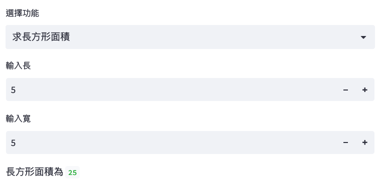

#+title: Streamlit
#+SUBTITLE: TNFSH Python教材
# -*- org-export-babel-evaluate: nil -*-
#+INCLUDE: ../pdf.org
#+PROPERTY: header-args :eval never-export
#+TAGS: AI, Python
#+EXCLUDE_TAGS: noexport
#+OPTIONS: toc:2 ^:nil num:3
#+OPTIONS: H:4
#+LATEX:\newpage
#+HTML_HEAD: <link rel="stylesheet" type="text/css" href="../css/muse.css" />
#+HTML_HEAD_EXTRA: 
#+begin_export html

#+end_export

* Streamlit 簡介
一個開放原始碼工具，使用 Python 使用者能輕鬆地建立互動式網頁應用程式。其特色為：
- 簡單易用
- 即時更新
** 模組安裝
*** 安裝
1. 於 PyCharm 開啟一新 Project
2. 打開 PyCharm 終端機
3. 輸入下列命令
   #+begin_src shell -r -n :results output :exports both
pip3 install streamlit
   #+end_src
** 使用方式
1. 打開 PyCharm Project 中的 main.py
2. 輸入以下 Python 程式
   #+begin_src python -r -n :results output :exports both
import streamlit as st

userName = st.text_input('君の名は')
st.write('Ohayō', userName)
   #+end_src
3. 切換至終端機，輸入下列命令
   #+begin_src shell -r -n :results output :exports both
streamlit run main.py
   #+end_src
** 結束程式
於終端機模式按 Ctrl+C

* 輸出
Streamlit 提供了多種方便的輸出功能，讓開發者能快速呈現數據、文字、圖片等，增強網頁互動性。
** 文字
Streamlit 支援 st.write()、st.text() 來輸出各種文字內容：
#+begin_src python -r -n :results output :exports both
import streamlit as st

# 使用 st.write() 輸出文字
st.write("Hello, Streamlit!")
st.text("這是基本的文字顯示")
#+end_src
** 格式化文字輸出
可以使用 st.write() 來進行格式化的文字輸出。
#+begin_src python -r -n :results output :exports both
import streamlit as st

name = "TNFSH"
score = 95
st.write(f"{name} 的期末成績為：{score}")
#+end_src
** 標題

Streamlit 提供了 st.header() 和 st.subheader() 來顯示標題，並可以設定不同層次的標題以區分內容。
#+begin_src python -r -n :results output :exports both
import streamlit as st

# 顯示標題
st.header("這是一個標題")
st.subheader("這是一個子標題")
#+end_src
** 圖片

st.image() 可用來展示圖片。支援本地圖片和網址圖片，常用參數：
- =st.image(image, caption=None, width=None, use_container_width=False)=
- =image= ：可以是 URL 字串、檔案路徑、或 numpy array
- =use_container_width=True= ：圖片自動填滿容器寬度
- 版本異動說明：舊參數 =use_column_width= 自 Streamlit 1.30 起改名為 =use_container_width= ，舊寫法在新版會出現棄用警告；更新版本的 Streamlit 也可改用 =width='stretch'= 的寫法達到相同效果
#+begin_src python -r -n :results output :exports both
import streamlit as st

st.image("https://example.com/your-image.png", caption="這是一張圖片", use_container_width=True)
#+end_src
** 表格
Streamlit 提供 st.table() 與 st.dataframe() 來顯示資料表，st.dataframe() 支援互動功能。
#+begin_src python -r -n :results output :exports both
import streamlit as st
import pandas as pd

# 建立一個簡單的資料框
data = {
    "學生": ["Alice", "Bob", "Cathy"],
    "分數": [95, 88, 76]
}
df = pd.DataFrame(data)

# 顯示表格
st.table(df)
st.dataframe(df)
#+end_src
** 狀態訊息
Streamlit 提供四種帶顏色的狀態訊息框，適合用來顯示操作結果：
- =st.success(body)= ── 綠色成功訊息
- =st.warning(body)= ── 黃色警告訊息
- =st.error(body)= ── 紅色錯誤訊息
- =st.info(body)= ── 藍色資訊訊息
#+begin_src python -r -n :results output :exports both
import streamlit as st

st.success("操作成功！")
st.warning("注意：數值超出範圍")
st.error("錯誤：請重新輸入")
st.info("提示：可以用方向鍵調整數字")
#+end_src
* 輸入
** 文字
*** 短字串
=st.text_input()= 用來接收使用者輸入的短字串，常用參數：
- =st.text_input(label, value='', max_chars=None, type='default', placeholder=None)=
- =type='password'= ：輸入內容顯示為圓點（見下方密碼範例）
- =placeholder= ：輸入框內的灰色提示文字
#+begin_src python -r -n :results output :exports both
import streamlit as st

user_input = st.text_input("輸入你的名字")
st.write(user_input, '請認真上課')
#+end_src
*** 長文
#+begin_src python -r -n :results output :exports both
import streamlit as st

user_text = st.text_area("輸入今天上課的心得500字")
st.write("看完後幫QQ：", user_text)
#+end_src
*** 密碼
#+begin_src python -r -n :results output :exports both
import streamlit as st

password = st.text_input("請輸入密碼", type="password")
st.write("你的密碼：", password)
#+end_src
** 時間日期
日期和時間各有專屬的輸入元件，常用參數：
- =st.date_input(label, value=None, min_value=None, max_value=None)=
- =st.time_input(label, value=None, step=timedelta(minutes=15))=
- 回傳值分別為 =datetime.date= 和 =datetime.time= 物件
#+begin_src python -r -n :results output :exports both
import streamlit as st

date = st.date_input("請選擇日期")
time = st.time_input("選擇時間")

st.write("你選擇的日期/時間為：", date, time)
#+end_src
** 數字
=st.number_input()= 用來接收數字，常用參數：
- =st.number_input(label, min_value=None, max_value=None, value=None, step=None)=
- =value= ：預設值，未指定時預設為 =min_value= （若也沒設 =min_value= 則為 0.0）
- =step= ：每次按 +/- 的增減幅度，未指定時整數預設 1、浮點數預設 0.01
- =value= 的型別決定回傳型別，給 int 就回傳 int，給 float 就回傳 float
#+begin_src python -r -n :results output :exports both
import streamlit as st

a = st.number_input("輸入A", min_value=0, max_value=100)
b = st.number_input("輸入B", min_value=0, max_value=100)
st.write("A+B：", a+b)
#+end_src
** 選項
*** radio
=st.radio()= 以圓形選鈕呈現選項，常用參數：
- =st.radio(label, options, index=0, horizontal=False)=
- =horizontal=True= ：選項水平排列（預設是垂直）
#+begin_src python -r -n :results output :exports both
import streamlit as st

grade = st.radio("年級",["一","二","三"])
st.write("你的年級是：", grade)
#+end_src
*** checkbox
=st.checkbox()= 以核取方塊呈現選項，常用參數：
- =st.checkbox(label, value=False)= ── 回傳 True/False
- 注意： =st.button()= 在下次互動時會自動重置為 False，checkbox 則會保持勾選狀態
- 多個 checkbox 可以同時勾選，因此判斷時要用獨立的 =if= 分別檢查，不要用 =elif= （否則第二個勾選項會被跳過）
#+begin_src python -r -n :results output :exports both
import streamlit as st

check1 = st.checkbox("選擇A")
check2 = st.checkbox("選擇B")

if check1:
    st.write('你選了A')
if check2:
    st.write('你選了B')
#+end_src
*** toggle
=st.toggle()= 的功能與 checkbox 相同（回傳 True/False），但外觀是滑動開關，適合「開啟／關閉」類的設定：
- =st.toggle(label, value=False)=
#+begin_src python -r -n :results output :exports both
import streamlit as st

on = st.toggle("開啟通知")
st.write("通知狀態:", "已開啟" if on else "已關閉")
#+end_src
*** selectbox
=selectbox= 是單選下拉選單， =multiselect= 則可以複選，常用參數：
- =st.selectbox(label, options, index=0)= ── =index= 是預設選取的索引位置
- =st.multiselect(label, options, default=None)=
- =options= ：選項 list
**** 單選
#+begin_src python -r -n :results output :exports both
import streamlit as st

subject = st.selectbox("選擇科目", ["數學", "科學", "歷史"])
st.write("你選擇的科目是：", subject)
#+end_src
**** 複選
#+begin_src python -r -n :results output :exports both
import streamlit as st

subjects = st.multiselect("選擇多個科目", ["數學", "科學", "歷史", "體育"])
st.write("你選擇的科目有：", ", ".join(subjects))
#+end_src
** [課堂練習]BMI 計算器 :TNFSH:
用 Streamlit 製作一個 BMI 計算器網頁，需包含以下元件：
1. =st.text_input()= 輸入姓名
2. =st.number_input()= 輸入身高(cm)和體重(kg)
3. =st.radio()= 選擇性別（男/女）
4. 點擊 =st.button()= 後計算並顯示：
   - BMI 數值（取到小數第 1 位）
   - BMI 分類（過輕 < 18.5、正常 18.5~24、過重 24~27、肥胖 > 27）
5. 使用 =st.success()= / =st.warning()= / =st.error()= 顯示不同顏色的分類結果

公式：BMI = 體重(kg) ÷ 身高(m)²

*** solution :noexport:
#+begin_src python -r -n :results output :exports both
import streamlit as st

st.title('BMI 計算器')

name = st.text_input('請輸入姓名')
gender = st.radio('性別', ['男', '女'])
height = st.number_input('身高 (cm)', min_value=100, max_value=250, value=170)
weight = st.number_input('體重 (kg)', min_value=20, max_value=200, value=60)

if st.button('計算 BMI'):
    if name == '':
        st.error('請輸入姓名')
    else:
        bmi = weight / (height / 100) ** 2
        bmi = round(bmi, 1)
        st.write(f'{name}（{gender}）的 BMI 為：**{bmi}**')

        if bmi < 18.5:
            st.warning(f'BMI {bmi}：過輕，建議增加營養攝取')
        elif bmi < 24:
            st.success(f'BMI {bmi}：正常，請繼續保持！')
        elif bmi < 27:
            st.warning(f'BMI {bmi}：過重，建議適度運動')
        else:
            st.error(f'BMI {bmi}：肥胖，建議諮詢醫師')
#+end_src

** [課堂練習]面積計算器 :TNFSH:
以 streamlit 撰寫一個 web-based 程式，該程式提供以下功能：
1. 可選擇求圓面積或長方形面積
2. 若使用者點選圓面積，則輸入半徑、輸出面積
3. 若使用者點選長方形面積，則輸入長、寬、輸出面積
#+CAPTION: Streamlit課堂作業
#+LABEL: fig:streamlit-area-task
#+name: fig:streamlit-area-task
#+ATTR_LATEX: :width 300
#+ATTR_ORG: :width 300
#+ATTR_HTML: :width 500

*** solution :noexport:
#+begin_src python -r -n :results output :exports both
import streamlit as st

subject = st.selectbox("選擇功能", ["", "求圓面積", "求長方形面積"])
if subject == "求圓面積":
    a = st.number_input("輸入半徑", min_value=0, max_value=100)
    st.write("圓面積為", a*a*3.14)
elif subject == "求長方形面積":
    a = st.number_input("輸入長", min_value=0, max_value=100)
    b = st.number_input("輸入寬", min_value=0, max_value=100)
    st.write("長方形面積為", a*b)

#+end_src

