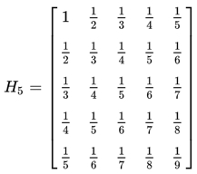
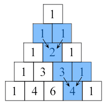

#+TITLE: Exams
#+SUBTITLE: TNFSH Python教材
#+OPTIONS: toc:2
# -*- org-export-babel-evaluate: nil -*-
#+TAGS: Python Basic
#+PROPERTY: header-args :eval never-export
#+INCLUDE: ../pdf.org
#+begin_export html

#+end_export

#+begin_comment
QA:378:1:1,A:363:1:2,A:364:1:2,B:370:1:3,B:371:1:3,C:353:1:4,C:365:1:4,C:356:1:4,D:366:1:5,D:367:1:5,E:368:1:6,E:369:1:6,B1:375:1:7,B1:376:1:7,B1:377:1:7,B2:372:1:8,B2:374:1:8,B3:373:1:9,B3:362:1:9
#+end_comment
* 2021 Python 期中考
** 測驗
*** 說明
- 378
*** A
- 363. 棄保效應
- 364. 換電腦啦
*** B
- 370. TnfshTag
- 371. You can run, but you can't hide
*** C
- 353. [Python-3-for]稿費好難賺
- 365. 密碼密碼好難記
- 356. [Python-3][loop][type][error]態度的重要性
*** D
- 366. 難中券
- 367. 班聯會主席
*** E
- 368. [Python][2021上][期中][loop][list]D. Z-transform
- 369. [Python][2021上][期中][loop][list]D. Percentile Rank
*** Bonus
**** loop if list
- 375. 奇蹟是算出來的
- 376. 解密運算
- 377. yes5888
**** loop if string
- 372. CSV資料格式轉換
- 374. 互補團隊
**** nested if
- 362. 僕は君の剣！
- 373. Love Live!訓練菜單
** [if/else]
*** 363. 棄保效應
**** 說明
- 台灣的選舉法令禁止各陣營及媒體在投票日前的一個星期內公佈民調結果，其中最重要的一個因素是要避免「棄保效應」。所謂的「棄保效應」是指選民在得知自己所支持的候選人當選無望時，有可能會把票投給其他比較可能當選的人，以免浪費了自己的一票。假設某選舉有三位候選人來競選一個職位，在「棄保效應」發揮到極致的情形下，所有民調第三名的候選人的支持者都會把票投民調第二名的候選人，也就是他們都會「棄三保二」。
- 2019年選區重劃，臺南市選區增為應選6席並打破原縣市界，於中華民國第十屆立法委員選舉起實施。
- 給你台南市某一選區中民調最高的前三名 A, B, C 三個候選人的支持者人數，請判斷各區誰最有可能當選？
**** 輸入說明 ：
- 輸入資料共一列，有三個以空白隔開的整數a, b, c，分別代表民調前三名候選人 A, B, C 的支持者人數。
- 0 ≤ a, b, c ≤ 2147483647。
- 你可以假設在「棄保效應」之後，不會有相同票數的情形發生。
**** 輸出說明 ：
請輸出各選區將會當選的人是 A, B 或 C。
**** 範例輸入 ：
12 400 123
**** 範例輸出 ：
B
****  solution :noexport:
#+begin_src python -r -n :results output :exports both
#cans = list(input().split())
ins = '256676 49526 292329'
cans = list(map(int, ins.split()))

if cans[0] == max(cans): #A最高
    if cans[0] > cans[1] + cans[2]:
        print('A')
    else:
        if cans[1]>cans[2]:
            print('B')
        else:
            print('C')
elif cans[1] == max(cans):
    if cans[1] > cans[0] + cans[2]:
        print('B')

    else:
        if cans[0] > cans[2]:
            print('A')
        else:
            print('C')
else:
    if cans[2] > cans[0] + cans[1]:
        print('C')
    else:
        if cans[0] > cans[1]:
            print('A')
        else:
            print('B')

#+end_src

#+RESULTS:
*** 364. 換電腦啦
**** 題目
T校有四間電腦教室，目前均已老舊非常，幸而今年有優秀學長回饋學校，這筆「宇翔基金」足夠汰換四間專用電腦教室另再加一間彈性使用的多功能電腦教室，不過錢要花在刀口上，目前的規劃是這樣的：
- 每間教室視在該教室上課的班級人數上限採購電腦
- 彈性教室因為所有班級都有可能會用到，所以要以全部班級人數上限來採購
**** 輸入:
- 共四列，每列為在該教室上課的班級人數列表。
- 每列有4個班級人數，分別以空白相隔共四列，每列為在該教室上課的班級人數列表，如
  30 31 29
  32 33
  34
  27 29
**** 輸出
分五列，前四列為四間教室應採購的電腦數，最後列為多功能電腦教室應採購的電腦數，如
  31
  33
  34
  29
  34
**** solution :noexport:
NOIP2002
#+begin_src python -r -n :results output :exports both
ac = input().split()
bc = input().split()
cc = input().split()
dc = input().split()

ac = list(map(int, ac))
bc = list(map(int, bc))
cc = list(map(int, cc))
dc = list(map(int, dc))
print(max(ac))
print(max(bc))
print(max(cc))
print(max(dc))
print(max(ac+bc+cc+dc))

#+end_src

#+RESULTS:
: 31
: 33
: 34
: 29
: 34
** [if/else][string]
*** 370. TnfshTag
**** 說明
- Apple 在2021年推出了 AirTag，搭配 Apple 的「尋找」app，這款設計精巧優雅的配件能協助持續追蹤並尋找重要物品。無論是掛在手拿包、鑰匙、背包或其他物品上，AirTag 都能利用遍及全球的廣大「尋找」網絡定位遺失物，同時以端到端的加密方式保持位置資料的隱私性和匿名性。
- 台南市東區某校最近一直飽受學生曠課問題困擾，校方看到這則新聞後，精神為之一振，決定耗資百萬打造學生定位迷你晶片，利用注射疫苗時將之注入學生體內，以利掌握全校學生即時坐標。
- 此舉雖違反人權，但學生哪來的人權呢？不過，校方還是考慮到學生的隱私權。為了不讓其他人獲知學生的位置資訊，追蹤晶片傳回的訊號會加入許多雜訊，而確切資訊會隱藏在4個整數裡。追蹤器傳回的4個數值解讀方式如下：
  1. 一個整數的「最高位數」是指擷取最左邊第1位數所形成的數;而「最低位數」是指擷取最右邊1位數所形成的數;「次低位數」則指最右邊倒數第2位所形成的數。例如，若 12345 的最高位數是 1，最低位數是 5，次低位數為4。
  2. 學校將校園分為X*Y區，學生目前所在位置由以下資訊組成:
     - x軸為4組整數的最高位數中最小值
     - y軸由4組整數的最低位數中最大值
     - 學生目前所在樓層為4組整數中最大的次低位數減去最小的次低位數，因為學校建築最高只有五層，故，若所得結果大於 5 則循環回 1，例如6->1、7->2
**** 輸入
一列，四個加入了雜訊的整數，以空白間隔
**** 輸出
學生目前在校坐標，以(X,Y)@ZF表示，意謂學生在學校坐標X*Y區，高度為Z樓
**** 輸入範例
38214 812834 80038 3852
**** 輸出範例
(3,8)@4F
**** solution
#+begin_src python -r -n :results output :exports both
import random
nums = ''.join(str(random.randint(10000,60000))+' ' for i in range(4))
print(nums)
a, b, c, d = nums.split()
#a, b, c, d = input().split()
#a, b, c, d = '38214', '812834', '80038', '3852'
#t, x, y, h = 24, 8, 9, 3
#t, x, y, h = input().split()
x = min(a[0], b[0], c[0], d[0])
y = max(a[-1], b[-1], c[-1], d[-1])
hh = max(a[-2], b[-2], c[-2], d[-2])
hl = min(a[-2], b[-2], c[-2], d[-2])
h = int(hh) - int(hl)
if h > 5:
    h = h-5
print('(',x,',',y,')@',h,'F',sep='')
#+end_src

#+RESULTS:
: 27074 16885 41060 36043
: (1,5)@4F
*** 371. You can run, but you can't hide
**** 說明
- 中國病毒（英語：China virus/Chinese virus），又稱武漢病毒。是在2020年嚴重特殊傳染性肺炎疫情期間，一些人對引發嚴重特殊傳染性肺炎的病毒嚴重急性呼吸道症候群冠狀病毒2型的稱呼，其中美國總統唐納·川普因使用這一稱呼而引發大量爭議。
- 雖然很多中國人覺得如此稱呼有辱華嫌疑，然而，中國人以玻璃心聞名全球，動不動就會踩到這條線。也就是說，你早晚都是會辱華的，那何不一開始就辱？所以，好的，武漢病毒。
- 在武漢病毒流行期間，為了解決很多人在居家隔離期間趴趴走、危害他人健康這個問題，某個國家規定每個隔離者都要穿上一個電子手環，這個手環會每隔30秒發送出隔離者的所在座標定位。
- 為了保護隔離者隠私，電子手環上的GPS晶片傳回的訊號會加入許多雜訊，而確切資訊會隱藏在5組數字裡。解讀方式如下：
  1. 名詞介紹：在這幾個數字裡，
     - 一個整數的「最高位數」是指擷取最左邊第1位數所形成的數;
     - 一個整數的「次高位數」是指擷取最左邊第2位數所形成的數;
     - 「最低位數」是指擷取最右邊1位數所形成的數;
     - 「次低位數」則指最右邊倒數第2位所形成的數。
     例如，若 12345 的最高位數是 1，次低位數是 4。
  2. 隔離者的座標資訊(X、Y、Z)就藏在這五個整數中，其中
     - X的值為前三組整數的最高位數的最大值
       如(872345 948724 88483 99234 4859245) -> 9
     - Y的值為後三組整數的最低位數的最小值，
       如(872345 948724 88483 99234 4859245) -> 3
     - Z的值為前三組數字的次高位數之最小值*後三組數字之次低位數的最大值，
       如(872345 948724 88483 99234 4859245) -> 4 * 8 = 32
**** 輸入
一列，五組加入了雜訊的數字，以空白間隔
**** 輸出
隔離者目前坐標, 以(X, Y, Z)表示，如(120,33,18)
**** 輸入範例
872345 948724 88483 99234 4859245
**** 輸出範例
(9,3,32)
**** solution
#+begin_src python -r -n :results output :exports both
import random
nums = ''.join(str(random.randint(100000,900000))+' ' for i in range(5))
print(nums)
a, b, c, d, e = nums.split()
#a, b, c, d, e = input().split()
#scs = '872345 948724 88483 99234 4859245'
#a, b, c, d, e = scs.split()
X = max(a[0], b[0], c[0])
Y = min(e[-1], d[-1], c[-1])
Z = int(min(a[1], b[1], c[1])) * int(max(e[-2], d[-2], c[-2]))
print('(', X, ',', Y, ',', Z, ')', sep='')
#+end_src

#+RESULTS:
** [for][string]
*** 353. [Python-3-for]稿費好難賺 :noexport:
# TODO: 題目內容遺失，待補
*** 365. 密碼密碼好難記
**** 說明
- 身為一個3C奴隸，想出一專屬自己的、別人猜不到的複雜密碼是生存必備技能
- 南一中教學網最近由新網管接手後，嚴格要求所有使用者變更密碼，其密碼規則如下:
  - Rule 1: 長度要>=8
  - Rule 2: 至少要有一個數字
  - Rule 3: 至少要有一個大寫字母
  - Rule 4: 至少要有一個小寫字母
  - Rule 5: 至少要有一個特殊符號
**** 輸入
一串密碼
**** 輸出
密碼是否合乎要求，
- 若合乎要求，輸出
  The password "*" is valid.
- 若不合乎要求，輸出
  The password violated the following rule:
  Rule 1
  Rule 3
**** 輸入範例1
myPass
**** 輸出範例1
The password violated the following rule:
Rule 1
Rule 2
Rule 5
**** 輸入範例2
%%this1iSgood%%
**** 輸出範例2
The password "%%this1iSgood%%" is valid.
**** Solution
#+begin_src python -r -n :results output :exports both
passwd = 'good!Pass1234'
r1 = False
r2 = r3 = r4 = r5 = 0
r1 = True if len(passwd) >= 8 else False
for ch in passwd:
    if ch.isdigit():
        r2 += 1
    elif ch.isupper():
        r3 += 1
    elif ch.islower():
        r4 += 1
    else:
        r5 += 1

if r1 and r2*r3*r4*r5 != 0:
    print('The password \"',passwd,'\" is valid.', sep='')
else:
    print('The password violated the following rule:')
    if r1 == False:
        print('Rule 1')
    if r2 == 0:
        print('Rule 2')
    if r3 == 0:
        print('Rule 3')
    if r4 == 0:
        print('Rule 4')
    if r5 == 0:
        print('Rule 5')

#+end_src

#+RESULTS:
: The password "good!Pass1234" is valid.
*** 356. [Python-3][loop][type][error]態度的重要性 :noexport:
# TODO: 題目內容遺失，待補
#+begin_src python -r -n :results output :exports both
print('%'.isupper())
print('a'.isalpha())
print('2'.isdigit())
#+end_src

#+RESULTS:
: False
: True
: True
** [for][break][else]
*** 366. 難中券
**** 說明
- 為配合五倍券的發行，南一中決定加碼發行校內「難中券」，顧名思義，全校名額只有1名，中獎率特低，十分難中，但中獎者可憑此券換取「資訊科期中或期末考分數開根號乘以10」權力乙次，由於獎項太過誘人，據聞開獎日當天校內網路塞爆....
- 輸入為一堆手機號碼，其順序代表參加抽獎的先後次序，系統定義中獎的規則是手機號碼數字總合能被odd整除，請輸出中獎者；若無人中獎，輸出vacancy
**** 輸入說明
第一列先輸入一整數odd，第二列輸入一串手機號碼，以空白間隔
**** 輸出說明
輸出中獎者手機號碼
**** Solution
#+begin_src python -r -n :results output :exports both
# Generate random id
import random
digits = ['0','1','2','3','4','5','6','7','8','9']
n = 97
nos = []
for i in range(n):
    id = ''.join(random.choice(digits) for i in range(7))
    nos.append('093'+id)
print(n)
#for phno in nos:
#    print(phno, end=' ')
#print()
# Check
bingo = 0
for no in nos:
   sod = sum(int(digit) for digit in no)
   if sod % n == 0:
       print(no)
       break
else:
    print('vacancy')
#+end_src

#+RESULTS:
: 97
: vacancy
*** 367. 班聯會主席
**** 說明
- T校每年的班聯會主席向來是一場非常激烈的競爭，然而自從去年起，竟然出現找不到人參選的困境，據聞是因為事前的準備太過花時間
- 2021年起，T校改變了競選方式，有意為民服務的學生只要在報名網站上輸入身份證號碼即可，接下來網站會隨機產生一個質數，依據報名順序，第一個身份證字號末九碼數字總和可以被這個質數整除的學生就是今年的主席了。
- 如果全都不符條件，那第一個報名的學生就遞補成為主席
**** 輸入說明
第一列先輸入一整數prime，第二列輸入一串報名者的身份證字號，以空白間隔
**** 輸出說明
輸出今年的主席身份證字號
**** solution
#+begin_src python -r -n :results output :exports both
# Generate random id
import random
digits = ['0','1','2','3','4','5','6','7','8','9']
firdig = ['1', '2']
n = 17
nos = []
import string

for i in range(10):
    X = random.choice(string.ascii_uppercase)
    id = ''.join(random.choice(digits) for i in range(8))
    Y = random.choice(firdig)
    nos.append(X+Y+id)
print(n)
for phno in nos:
    print(phno, end=' ')
print()
# Check
bingo = 0
for no in nos:
   sod = sum(int(digit) for digit in no[1:])
   if sod % n == 0:
       print(no)
       break
else:
    print(nos[0])

#+end_src

#+RESULTS:
: 17
: J160828192 V145948569 O267052827 A122453059 G153637240 U258902533 O296767555 D153920092 W289530174 D260504796
: V145948569
** [for][list]
*** 百分等級
**** 百分等級(percentile rank)(PR)
- 百分等級是心理測量學中的術語，是套用最廣的表示測驗分數的方法。一個測驗分數的百分等級是指在常模樣本中低於這個分數的人數百分比。因此，85的百分等級表示在常模樣本中有85%的人比這個分數要低。換句話說，百分等級指出的是個體在常模團體中所處的位置，百分等級越低，個體所處的位置越低。
- 百分等級的有多種計算方式，其中一種計算公式為:
$PR=(\frac{100}{N}\times wins)+(\frac{100}{N}\times\frac{1}{2})$,其中 $wins$ =該生贏過多少個人

**** 算法1
我們必須先將一百個等級平分給團體中的N個人(100/N)，再算出甲生贏過多少個人後，算出甲生贏過的累計百分比，最後加上半個百分等級來代表甲生本身的PR。
wins = 該生贏過多少個人
$PR=(\frac{100}{N}\times wins)+(\frac{100}{N}\times\frac{1}{2})$
**** 算法2
假設我們已經知道某位學生的名次了，那麼一樣可以透過公式來求出該生的百分等級，我們將公式稍微簡化：
$PR=100-(\frac{100\times R-50}{N})$
其中大寫的R就代表該生的名次。
班上10個學生的分數分別為：
35, 56, 62, 71, 76, 78, 83, 84, 90,96
問：假設甲生考了84分，請問他的百分等級是多少?
#+begin_src python -r -n :results output :exports both
import random

#scs = ''.join(str(random.randint(0, 100))+' ' for i in range(random.randint(2, 5)))
#print(scs)
#scores = list(map(int, scs.split()))

scores = random.sample(range(0, 100), 20)

scs = ''.join(str(i)+' ' for i in scores)
print(scs)
scores.sort(reverse=True)
# solution 1
for score in scores:
    wins = sum(1 for s in scores if s < score)  # 贏過的人數（分數比自己低的人數）
    print('{0:.0f}: {1:.0f}'.format(score, (100/len(scores))*wins+((100/len(scores))*0.5)))
    #print('{0:.0f}: {1:.0f}'.format(score, (100-(100*(scores.index(score)+1)-50)/len(scores))))
#print(wins)
#print('{0:.0f}'.format((100/len(scores))*wins+((100/len(scores))*0.5)))
## solution 2
#scores.sort(reverse=True)
#R = scores.index(score)+1
#print(R)
#print('{0:.0f}'.format(100-((100*R)-50)/len(scores)))
#+end_src

#+RESULTS:
#+begin_example
67 96 34 30 11 37 14 66 2 59 72 87 21 77 28 76 22 65 81 84
96: 98
87: 92
84: 88
81: 82
77: 78
76: 72
72: 68
67: 62
66: 58
65: 52
59: 48
37: 42
34: 38
30: 32
28: 28
22: 22
21: 18
14: 12
11: 8
2: 2
#+end_example
*** Z分數
**** 說明
標準分數（Standard Score，又稱z-score，中文稱為Z-分數或標準化值）在統計學中是一種無因次值，就是一種純數字標記，是藉由從單一（原始）分數中減去母體的平均值，再依照母體（母集合）的標準差分割成不同的差距，按照z值公式，各個樣本在經過轉換後，通常在正、負五到六之間不等。
在將數據送給程式進行人工智慧運算之前，經常需要對數據進行正規化，而最常見的正規化技術之一就是Z分數。Z-score normalization，背後有著簡單的統計概念。Z-score normalization的結果是被重新縮放以具有平均為0和標準差為1的資料。經過Z-score normalization正規化，通過重新縮放我們的資料以具有均勻的算術平均數和方差（標準差的平方），因此則一些依賴歐式距離作為核心的機器學習模型模型如knn得以最佳方式學習而不傾向於單位尺度較大的資料。以下是Z-score normalization的公式：
$$ z = \frac{x-\mu}{\sigma} $$
公式中的變數:
- $z$ 是正規化後的數值
- $x$ 是正規化前的數值
- $\mu$ 是該批資料的算術平均數
- $\sigma$ 是該批資料的標準差
而σ(標準差)的計算公式則為
- $$\sigma= \sqrt{\frac{1}{N} \sum_{i=1}^N (x_i - \mu)^2}$$
- $$\mu=\bar{x}$$
**** 輸入
輸入一串分數，分數間以空間間隔
**** 輸出
由大到小輸出所有分數相對應的$z$分數
#+begin_src python -r -n :results output :exports both
import random
scs = ''.join(str(random.randint(0, 100))+' ' for i in range(random.randint(5, 10)))
print(scs)
scores = list(map(int,scs.split()))
scores.sort(reverse=True)
#scores = [100, 98, 35, 56, 99, 62, 71, 76, 78, 12, 83, 84, 90,96]

import math
mean = sum(scores)/len(scores)

ss = 0
for score in scores:
    ss += (mean-score)**2
sd = math.sqrt(ss/len(scores))
#print(sd)
#import numpy as np
#sc = np.array(scores)
#sd = np.std(sc, ddof=0)
#mean = np.mean(sc)
# print(sd)
#print(mean)
for score in scores:
    print('{0:.0f}: {1:.2f}'.format(score, (score-mean)/sd))

#+end_src

#+RESULTS:
#+begin_example
0 90 89 19 72 60 96 82 70
96: 1.01
90: 0.82
89: 0.79
82: 0.57
72: 0.25
70: 0.18
60: -0.13
19: -1.44
0: -2.04
#+end_example
** 投稿
*** 362. 僕は君の剣！
**** 作者: 202130522 陳珏嶧
**** 說明
出題者 : ニオ Time : 4s Memory : 512MiB
阿斯托爾福:在輕小說《Fate/Apocrypha》中初次登場
僕は君の剣！
直譯來說就是:我就是你的劍！
每個可愛的男孩子都該有一把短劍
為了使短劍配率上升，可愛的阿福決定開一間自動鐵匠鋪
因為是第一次嘗試，笨笨阿福不知道要先開幾條生產線
但是客人至上，品質總要是最好的吧 !! 因此多條生產線的最終產品只會選擇品質較高者來出售
是這樣的，每條生產線上會有五台檢測機，其功能分別為產出下列描述:

A

    敲打煉鐵，練度增加 ( $p+q$ )

B

    過度用力，練度減少 ( $p-q$ )

C

    加熱加工，練度加乘 ( $p \times q$ )

D

    太熱融化，練度除以 ( $p \div q$ )

E

    機器過熱，生產線無條件停止，不再生產

勇者，請幫香香阿福判斷出它可以生產出的最好練度吧 !!!
**** 輸入說明
多筆測資( $a_i$ )，以EOF結尾
每筆測資有兩個字串 $r$ 及 $k$
其分別代表機器判斷的資料及程度
- 每條生產線初始練度均為 $0$
- 生產線從第一條算起
- 若機器過熱 $(E)$ ，當條生產線練度則算到過熱前，且程度 $(k_i)$ 必為 $0$
- 若機器總練度為負，當條生產線報廢不算
**** 輸出說明
輸出兩行
第一行輸出最好練度，第二行則為第幾條生產線
若沒有生產線符合則輸出 "Chop off!!" (不含引號)
**** 輸入範例1
BBAA
5277
**** 輸出範例1
7
1
**** 輸入範例2
AABB
5277
ABCDE
12340
**** 輸出範例2
Chop off!!
**** solution
#+begin_src python -r -n :results output :exports both
try:
    best=-1
    nw=0
    mm=-10000
    while 1:
        sm=0
        nw=nw+1
        r=input()
        k=input()
        for i in range(0,len(r)):
            if(r[i]=="E"):
                break
            sm=sm+int(k[i]) if r[i]=="A" else sm
            sm=sm-int(k[i]) if r[i]=="B" else sm
            sm=sm*int(k[i]) if r[i]=="C" else sm
            sm=sm/int(k[i]) if r[i]=="D" else sm
        if sm>=mm and sm>=0:
            mm=sm
            best=nw

except:
    if best==-1:
        print("Chop off!!")
    else :
        print(mm);print(best)
#+end_src
*** 372. CSV資料格式轉換
**** 作者: 202130606 江柏廷
**** 說明
- 所謂CSV格式意旨使用逗號(,)來分隔的表格儲存格式
  | Year | Make  | Model                                  | Description                       |   Price |
  |------+-------+----------------------------------------+-----------------------------------+---------|
  | 1997 | Ford  | E350                                   | ac, abs, moon                     | 3000.00 |
  | 1999 | Chevy | Venture "Extended Edition"             |                                   | 4900.00 |
  | 1999 | Chevy | Venture "Extended Edition, Very Large" |                                   | 5000.00 |
  | 1996 | Jeep  | Grand Cherokee                         | MUST SELL! air, moon roof, loaded | 4799.00 |
- 將上表轉換為標準CSV格式會得到以下文字：
  #+BEGIN_QUOTE
  Year,Make,Model,Description,Price
  1997,Ford,E350,"ac, abs, moon",3000.00
  1999,Chevy,"Venture ""Extended Edition""","",4900.00
  1999,Chevy,"Venture ""Extended Edition, Very Large""","",5000.00
  1996,Jeep,Grand Cherokee,"MUST SELL!
  air, moon roof, loaded",4799.00
  #+END_QUOTE
  每個值以,分開，當值中包含如,和"時值須以前後雙引號(“ ”)包裹整個值，且值內的雙引號前需多加一個雙引號以示跳脫字元
  若為空值將直接以""表示
  資料來源：維基百科(逗號分隔值)
- 今天阿星從客戶手中拿到一份不標準CSV表格資料，其部分如下：
  "PAATC13","2021-Apr-22" ,"U.S. Dollar","46617A","""1","082.80"""
  還原成標準CSV格式應為：
  PAATC13,2021-Apr-22 ,U.S. Dollar,46617A, """1,082.80"""
- 可觀察出原資料中將每一個值都以雙引號包裹，且若值含有逗號則也將逗號以雙引號包裹，其餘規則與標準一致
- 這份資料有些特殊，當值內含逗號就一定會在前後有雙引號字元，但不一定在值的頭尾，且一個值內只會有一層雙引號，首尾不會為空值
- 請試寫一程式幫助阿星還原資料城標準CSV格式吧！

**** 提示：
- continue 在迴圈中使用，跳過這次迴圈接下來的程式直接執行下次迴圈
- 將字串於n的字元刪除可用 str=str[:n]+str[n+1:]
**** 輸入說明：
- 第一行為一正整數n，表示接下來有n筆資料(1<=n<=10)
- 原資料格式，長度10000以內，可能出現特殊字元
**** 輸出說明：
還原後格式
**** 輸入範例1：
1
"cat","dog","dragon"
**** 輸出範例1：
cat,dog,dragon
**** 輸入範例2：
2
"Name","Amount","Cost"
"""Soy_Bean_Curd""  ","100","""3","000"""
**** 輸出範例2：
Name,Amount,Cost
"""Soy_Bean_Curd""  ",100,"""3,000"""
**** 輸入範例3：
1
"HI","""-_-""","","""Ow<"""
**** 輸出範例3：
HI,"""-_-""","","""Ow<"""
**** solution
#+begin_src python -r -n :results output :exports both
#n = int(input())
n = 1
for m in range(n):
  #source = input()
  source = '"""Soy_Bean_Curd""  ","100","""3","000"""'
  flag_q = 0
  flag_dq = 0
  have_dq = 0
  flag_l = 0
  p = 0
  for i in range(len(source)):
    if p>0:
      p -= 1
      continue
    if (i+1==len(source)):
      if have_dq == 0:
        source = source[:len(source)-1]
      break
    if (source[i] == '"' and flag_dq == 0):
      if (i ==0 or source[i-1]=="," or source[i+1]==","):
        if (flag_q == 0):
          flag_q = 1
          flag_l = 0
        else:
          flag_q = 0
          have_dq = 0

        for j in range(i,source.find(",",i)):
          if (source[j]=='"' and source[j+1]=='"'):
            flag_l = 1
            break
        else:
          if (source.find(",",i)==-1):
            for k in range(i,len(source)-1):
              if (source[k]=='"' and source[k+1]=='"'):
                flag_l = 1
                break
        if flag_l == 0:
          source = source[:i]+source[i+1:]
        continue
    if (source[i] == '"' and source[i+1] == '"' and flag_q == 1):
      if flag_dq == 0:
        flag_dq = 1
        have_dq = 1
      else:
        flag_dq = 0
        p += 1
        continue
    if (flag_dq == 1 and source[i] == '"'):
      if (source[i+1] == "," and source[i+2] == '"'):
        source = source[:i+2]+source[i+3:]
        source = source[:i]+source[i+1:]
        continue
  print(source)

#+end_src

#+RESULTS:
: """Soy_Bean_Curd""  ",100,"""3,000"""
*** 373. Love Live!訓練菜單 :noexport:
# TODO: 題目內容遺失，待補
**** 作者: 202131034 羅文謙
*** 374. 互補團隊 :noexport:
# TODO: 題目內容遺失，待補
**** 作者: 202130635 羅鵬博
*** 375. 奇蹟是算出來的 :noexport:
# TODO: 題目內容遺失，待補
**** 作者: 202130635 羅鵬博
*** 376. 解密運算 :noexport:
# TODO: 題目內容遺失，待補
**** 作者: 202130635 羅鵬博
*** 377. yes5888 :noexport:
# TODO: 題目內容遺失，待補
**** 作者: 202130611 杜靖智
:PROPERTIES:
:ID:       7874f7ce-8d62-4d9a-99e4-c5e081e1e7df
:END:
** APCS
*** 338. [APCS] 反序數量 (201806)
#+begin_src python -r -n :results output :exports both
# nl = input()
inp = '3 1 9 8 9 2'
nl = list(map(int, inp.split()))
counts = 0

print(nl)
for i in range(len(nl)-1):
    for j in range(i+1, len(nl)):
        if nl[i] > nl[j]:
            counts += 1

print(counts)
#+end_src

#+RESULTS:
: [3, 1, 9, 8, 9, 2]
: 6
#+begin_src python -r -n :results output :exports both
# nl = input()
import bisect
import time
def sol(ar, le, ri):
    if ri - le < 2: return 0
    mid = (le+ri) // 2
    inv = sol(ar, le, mid) + sol(ar, mid, ri)
    tem = ar[mid:ri]
    tem.sort()
    for x in ar[le:mid]:
        inv += bisect.bisect_left(tem, x)
    return inv
def dc(n):
    if len(n) <= 2 :
        return 0
    m = len(n) // 2
    counts = dc(n[:m]) + dc(n[m:])
    print(n[:m],':',n[m:])
    tmprn = n[m:]
    tmprn.sort()
    cross = 0

    for ll in range(m):
        rr = 0
        while n[ll] >= tmprn[rr] and rr < len(tmprn):
            rr += 1
        cross +=  rr
    return counts + cross

start = time.time()
inp = '3 1 9 8 9 2'
nl = list(map(int, inp.split()))
print(nl)
print(dc(nl))
print(sol(nl, 0, len(nl)))

end = time.time()
print('{0:.10f}'.format(end-start))

#+end_src

#+RESULTS:

#+begin_src python -r -n :results output :exports both
for r in range(10):
    print(r)
    if r == 3:
        break
print(r)
#+end_src

#+RESULTS:
: 0
: 1
: 2
: 3
: 3
** 投稿
*** [[https://github.com/NeoDoggy/python_mid_ex][NeoDoggy 期中考題]]
* 2021 Python 期末考
** test
#+begin_comment
QA:399:1:1,A:388:1:2,A:389:1:2,B:390:1:3,B:391:1:3,C:392:1:4,C:393:1:4,D:394:1:5,D:395:1:5,E:385:1:6,E:386:1:6,E:387:1:6,B1:396:1:7,B2:397:1:8
#+end_comment
** [2D list]
*** 希爾伯特矩陣
**** LINK: [[https://zh.wikipedia.org/wiki/%E5%B8%8C%E5%B0%94%E4%BC%AF%E7%89%B9%E7%9F%A9%E9%98%B5][希爾伯特矩陣]]
**** 在線性代數中，希爾伯特矩陣是一種係數都是單位分數的方塊矩陣。$5\times5$ 的希爾伯特矩陣為：
#+CAPTION: 希爾伯特矩陣
#+LABEL:fig:HM
#+name: fig:HM
#+ATTR_LATEX: :width 300
#+ATTR_ORG: :width 300
#+ATTR_HTML: :width 500

**** 輸入整數n
**** 輸出 $n \times n$ 的希爾伯特矩陣，
**** 例: n = 3時，輸出結果如下，分數間以英文空白相隔，每列最後一個分數後沒有空白
#+begin_src python -r -n :results output :exports both
n = 3
for i in range(1, n+1):
    for j in range(1, n):
        print('{0}/{1}'.format(1, i+j-1), end=' ')
    print('{0}/{1}'.format(1, i+n-1))
#+end_src

#+RESULTS:
: 1/1 1/2 1/3
: 1/2 1/3 1/4
: 1/3 1/4 1/5

*** 伯特希爾矩陣
**** 這是一種希爾伯特方塊矩陣的變形，傳說是由南部某中學因為想不出合適的期末考題而杜撰出來的東西。
**** 輸入整數n
**** 例: n = 3時，輸出結果如下，分數間以英文空白相隔，每列最後一個分數後沒有空白
#+begin_src python -r -n :results output :exports both
n = 20
for i in range(1, n+1):
    for j in range(1, n):
        print('{0}/{1}'.format(1, n-i+j), end=' ')
    print('{0}/{1}'.format(1, n-i+n))

#+end_src

#+RESULTS:
#+begin_example
1/20 1/21 1/22 1/23 1/24 1/25 1/26 1/27 1/28 1/29 1/30 1/31 1/32 1/33 1/34 1/35 1/36 1/37 1/38 1/39
1/19 1/20 1/21 1/22 1/23 1/24 1/25 1/26 1/27 1/28 1/29 1/30 1/31 1/32 1/33 1/34 1/35 1/36 1/37 1/38
1/18 1/19 1/20 1/21 1/22 1/23 1/24 1/25 1/26 1/27 1/28 1/29 1/30 1/31 1/32 1/33 1/34 1/35 1/36 1/37
1/17 1/18 1/19 1/20 1/21 1/22 1/23 1/24 1/25 1/26 1/27 1/28 1/29 1/30 1/31 1/32 1/33 1/34 1/35 1/36
1/16 1/17 1/18 1/19 1/20 1/21 1/22 1/23 1/24 1/25 1/26 1/27 1/28 1/29 1/30 1/31 1/32 1/33 1/34 1/35
1/15 1/16 1/17 1/18 1/19 1/20 1/21 1/22 1/23 1/24 1/25 1/26 1/27 1/28 1/29 1/30 1/31 1/32 1/33 1/34
1/14 1/15 1/16 1/17 1/18 1/19 1/20 1/21 1/22 1/23 1/24 1/25 1/26 1/27 1/28 1/29 1/30 1/31 1/32 1/33
1/13 1/14 1/15 1/16 1/17 1/18 1/19 1/20 1/21 1/22 1/23 1/24 1/25 1/26 1/27 1/28 1/29 1/30 1/31 1/32
1/12 1/13 1/14 1/15 1/16 1/17 1/18 1/19 1/20 1/21 1/22 1/23 1/24 1/25 1/26 1/27 1/28 1/29 1/30 1/31
1/11 1/12 1/13 1/14 1/15 1/16 1/17 1/18 1/19 1/20 1/21 1/22 1/23 1/24 1/25 1/26 1/27 1/28 1/29 1/30
1/10 1/11 1/12 1/13 1/14 1/15 1/16 1/17 1/18 1/19 1/20 1/21 1/22 1/23 1/24 1/25 1/26 1/27 1/28 1/29
1/9 1/10 1/11 1/12 1/13 1/14 1/15 1/16 1/17 1/18 1/19 1/20 1/21 1/22 1/23 1/24 1/25 1/26 1/27 1/28
1/8 1/9 1/10 1/11 1/12 1/13 1/14 1/15 1/16 1/17 1/18 1/19 1/20 1/21 1/22 1/23 1/24 1/25 1/26 1/27
1/7 1/8 1/9 1/10 1/11 1/12 1/13 1/14 1/15 1/16 1/17 1/18 1/19 1/20 1/21 1/22 1/23 1/24 1/25 1/26
1/6 1/7 1/8 1/9 1/10 1/11 1/12 1/13 1/14 1/15 1/16 1/17 1/18 1/19 1/20 1/21 1/22 1/23 1/24 1/25
1/5 1/6 1/7 1/8 1/9 1/10 1/11 1/12 1/13 1/14 1/15 1/16 1/17 1/18 1/19 1/20 1/21 1/22 1/23 1/24
1/4 1/5 1/6 1/7 1/8 1/9 1/10 1/11 1/12 1/13 1/14 1/15 1/16 1/17 1/18 1/19 1/20 1/21 1/22 1/23
1/3 1/4 1/5 1/6 1/7 1/8 1/9 1/10 1/11 1/12 1/13 1/14 1/15 1/16 1/17 1/18 1/19 1/20 1/21 1/22
1/2 1/3 1/4 1/5 1/6 1/7 1/8 1/9 1/10 1/11 1/12 1/13 1/14 1/15 1/16 1/17 1/18 1/19 1/20 1/21
1/1 1/2 1/3 1/4 1/5 1/6 1/7 1/8 1/9 1/10 1/11 1/12 1/13 1/14 1/15 1/16 1/17 1/18 1/19 1/20
#+end_example
** [while]
*** 最大小費數
**** 已知費氏數列的規則是：
- 第0項為1
- 第1項為1
- 第2項起為前兩項相加
**** 為方便起見，此處稱所有費氏數列中的數為「費數」，稱其對應項次為「費序」
例如，下列為一典型費氏數列
| 費序 | 0 | 1 | 2 | 3 | 4 | 5 |  6 |  7 |  8 | ... |
| 費數 | 1 | 1 | 2 | 3 | 5 | 8 | 13 | 21 | 34 | ... |
**** 輸入一個數M
**** 輸出「最後一個小於M」的費數
#+begin_src python -r -n :results output :exports both
def f(n):
    if n <= 1:
        return 1
    else:
        return f(n-1) + f(n-2)

m = 100000
n = 0
fl = {}
while True:
    fl[n] = f(n)
    if fl[n] >=  m:
        break
    n += 1
print(f(n-1))
#print(fl)
#+end_src

#+RESULTS:
: 75025
*** 最大小質數
**** 質數（Prime number），又稱素數，指在大於1的自然數中，除了1和該數自身外，無法被其他自然數整除的數（也可定義為只有1與該數本身兩個正因數的數）。大於1的自然數若不是質數，則稱之為合數（也稱為合成數）。
**** 質數數列:由質數所組成之數列，為方便起見，此處稱每一質數對應項次為「質序」
例如，下列為一典型質數數列
| 質序 | 1 | 2 | 3 | 4 |  5 |  6 |  7 |  8 | ... |
| 質數 | 2 | 3 | 5 | 7 | 11 | 13 | 17 | 19 |     |
**** 輸入一個數M
**** 輸出「最後一個小於M」的質數
#+begin_src python -r -n :results output :exports both
def isPrime(num):
    for n in range(2,int(num**0.5)+1):
        if num%n==0:
            return False
    return True

m = 1000
n = 2
o = 1
pl = {}
while True:
    if isPrime(n):
        pl[o]=n
        o += 1

        if n >= m:
            break
    n += 1

print(pl[o-2])

#+end_src

#+RESULTS:
: 997
** [if][loop]
*** 385. [Python][2021上][期末][if][loop] 數字的好朋友 :noexport:
# TODO: 題目內容遺失，待補
*** 386. [Python][2021上][期末][if][loop] 數字的壞朋友 :noexport:
# TODO: 題目內容遺失，待補
** [while]
*** 最小費序
**** 已知費氏數列的規則是：
- 第0項為1
- 第1項為1
- 第2項起為前兩項相加
**** 為方便起見，此處稱所有費氏數列中的數為「費數」，稱其對應項次為「費序」
例如，下列為一典型費氏數列
| 費序 | 0 | 1 | 2 | 3 | 4 | 5 |  6 |  7 |  8 | ... |
| 費數 | 1 | 1 | 2 | 3 | 5 | 8 | 13 | 21 | 34 | ... |
**** 輸入一個數M
**** 輸出「第一個開始大於M」的費數之費序
#+begin_src python -r -n :results output :exports both
def f(n):
    if n <= 1:
        return 1
    else:
        return f(n-1) + f(n-2)

m = 2000
n = 0
while f(n) <= m:
    n += 1
print(n)
#+end_src

#+RESULTS:
: 17
*** 最小質序
**** 質數（Prime number），又稱素數，指在大於1的自然數中，除了1和該數自身外，無法被其他自然數整除的數（也可定義為只有1與該數本身兩個正因數的數）。大於1的自然數若不是質數，則稱之為合數（也稱為合成數）。
**** 質數數列:由質數所組成之數列，為方便起見，此處稱每一質數對應項次為「質序」
例如，下列為一典型質數數列
| 質序 | 1 | 2 | 3 | 4 |  5 |  6 |  7 |  8 | ... |
| 質數 | 2 | 3 | 5 | 7 | 11 | 13 | 17 | 19 |     |
**** 輸入一個數M
**** 輸出「第一個開始大於M」的質數之質序
#+begin_src python -r -n :results output :exports both
def isPrime(num):
    for n in range(2,int(num**0.5)+1):
        if num%n==0:
            return False
    return True

m = 1000
n = 2
o = 1
while True:
    if isPrime(n):
        o += 1
        if n > m:
            break
    n += 1

print(o-1, n)
#+end_src

#+RESULTS:
: 169 1009
** [data type]
*** 你同意我不同意之公投開票
**** 四大公投將登場，中國大陸國台辦發言人馬曉光今天表示，中方對這項公投涉及經濟民生及公共政策沒有看法；但又聲稱，「民進黨當局」正以慣用伎倆對公投「政治操弄」....。
**** 根據以往經驗，中國反對批評的永遠都是對台灣好的，所以.....來開票吧
**** 依據《公投法》：公民投票案投票結果，有效同意票數多於不同意票，且有效同意票達投票權人總額四分之一以上者，即為通過。 有效同意票未多於不同意票，或有效同意票數不足前項規定數額者，均為不通過。雖然公投法規定了這麼多，不過在這裡我們打算只比較票數....感動吧....
**** 輸入
- 第一列: 投票人數N
- 接下來有N列輸入，每列有4個字元，分別代表1~4項公投，每個字元可能為0或1或?，代表不同意、同意、廢票
**** 輸出
- 計票結果，如範例
**** solution
#+begin_src python -r -n :results output :exports both
import random
n = 3
a = ['0','1','0','1','0','1','0','1','?']
tics = []
for x in range(n):
    tic = ''.join(random.choice(a) for i in range(4))
    print(tic)
    tics.append(tic)
print(tics)
#+end_src

#+RESULTS:
: 0000
: 0111
: ?011
: ['0000', '0111', '?011']

#+begin_src python -r -n :results output :exports both
import random
n = 4
a = ['0','0','0','0','0','1','0','1','0','1','0','1','?']
tics = []
print(n)
for x in range(n):
    tic = ''.join(random.choice(a) for i in range(4))
    print(tic)
    tics.append(tic)

tl = []
for i in range(4):
    td = {}
    td['YES'] = 0
    td['NO'] = 0
    td['NA'] = 0
    tl.append(td)

for tic in tics:
    for i in range(4):
        if tic[i] == '0':
            tl[i]['NO'] += 1
        elif tic[i] == '1':
            tl[i]['YES'] += 1
        elif tic[i] == '?':
            tl[i]['NA'] += 1
q = 1
for x in tl:
    print('#',q, end=': ', sep='')
    print('YES:', x['YES'], end='')
    print(', NO:', x['NO'], end='')
    print(', NA:', x['NA'], end='')
    q += 1
    print()

#+end_src

#+RESULTS:

*** 2024大選開票
**** 2024總統大選共計五位候選人，本次計票採AI判別，每張選票讀出的結果為五個0/1，1代表投票人蓋圈的號次，超過1個或低於1個1均以廢票計
- 00100：3號
- 10000: 1號
- 11111: 廢票
- 10010: 廢票
- 00000: 廢票
**** 輸入
- 第一列: 投票人數N
- 接下來有N列輸入，每列有5個字元，分別對應到1~5號候選人
**** 輸出
- 計票結果，如範例
**** solution
#+begin_src python -r -n :results output :exports both
import random
n = 5
a = ['0','1']
tics = []
for x in range(n):
    tic = ''.join(random.choice(a) for i in range(5))
    print(tic)
    tics.append(tic)
print(tics)
#+end_src

#+RESULTS:
: 00111
: 11100
: 00101
: 00011
: 11001
: ['00111', '11100', '00101', '00011', '11001']

#+begin_src python -r -n :results output :exports both
import random
n = 3
a = ['0','0','0','0','0','1','0','1']
tics = []
print(n)
for x in range(n):
    tic = ''.join(random.choice(a) for i in range(5))
    print(tic)
    tics.append(tic)
td = {}
td[1] = 0

td[2] = 0
td[3] = 0
td[4] = 0
td[5] = 0
td['NA'] = 0

for tic in tics:
    if tic.count('1') == 1:
        td[tic.find('1')+1] += 1
    else:
        td['NA'] += 1

for k, v in td.items():
    print('#',k,': ', v,sep='')
#+end_src

#+RESULTS:
** Bonus
*** Pascal
#+begin_src python -r -n :results output :exports both
def pascal_triangle(n):
   trow = [1]
   y = [0]
   for x in range(max(n,0)):
      print(trow)
      trow=[l+r for l,r in zip(trow+y, y+trow)]
   return n>=1
pascal_triangle(6)
#+end_src

#+RESULTS:
: [1]
: [1, 1]
: [1, 2, 1]
: [1, 3, 3, 1]
: [1, 4, 6, 4, 1]
: [1, 5, 10, 10, 5, 1]
*** All are Same

#+begin_src python -r -n :results output :exports both
t=int(input())
for i in range(t):
  arr=input().split()
  arr[0]=int(arr[0])
  mn=arr[0]
  ma=arr[0]
  for n in range(1,len(arr)):
    arr[n]=int(arr[n])
    mn=min(mn,arr[n])
    ma=max(ma,arr[n])
  ma=ma-mn
  ans=ma
  if ans==0:
    print(-1)
  else:
    for n in range(len(arr)):
      arr[n]-=mn
      if arr[n]!=0:
        b=0
        for a in range(1,ans+1):
          if ans%a==0 and arr[n]%a==0:
            b=a
        ans=b

    print(ans)

#+end_src

*** Pascal's triangle
Write a Python function that prints out the first n rows of Pascal's triangle.

Note : Pascal's triangle is an arithmetic and geometric figure first imagined by Blaise Pascal.

Sample Pascal's triangle :
#+CAPTION: Caption
#+LABEL:fig:PascalTriangle
#+name: fig:PascalTriangle
#+ATTR_LATEX: :width 300
#+ATTR_ORG: :width 300
#+ATTR_HTML: :width 500

**** solution
#+begin_src python -r -n :results output :exports both
def pascal_triangle(n):
   trow = [1]
   y = [0]
   for x in range(max(n,0)):
      print(trow)
      trow=[l+r for l,r in zip(trow+y, y+trow)]
   return n>=1
pascal_triangle(30)
#+end_src

#+RESULTS:
#+begin_example
#+end_example

*** YMD
#+begin_src python -r -n :results output :exports both
def bintr(s,n):
    if(d.get(n)==None):
        d[n]=s
        return
    else:
        if(s>=d[n]):
            bintr(s,n*2+1)
        else:
            bintr(s,n*2)
d={}
l=list(map(int,input().split()))
for i in l:
    bintr(i,1)
for i in d:
    print(d[i],':',i)

#+end_src

#+RESULTS:
