#+TITLE: GUI
#+SUBTITLE: TNFSH Python教材
# -*- org-export-babel-evaluate: nil -*-
#+TAGS: Python, Advanced
#+INCLUDE: ../pdf.org
#+OPTIONS: toc:2 ^:nil num:5
#+OPTIONS: H:4
#+EXCLUDE_TAGS: noexport
#+OPTIONS: ^:nil
#+PROPERTY: header-args :eval never-export
#+HTML_HEAD: <link rel="stylesheet" type="text/css" href="../css/muse.css" />
#+HTML_HEAD_EXTRA: 
#+begin_export html

#+end_export

* Streamlit
完整的 Streamlit 教學請見 [[file:Streamlit.org][Streamlit 專章]]，本節為簡要版。

Streamlit 是一個開源的 Python 函式庫，專為資料科學家、機器學習工程師和開發者設計，能夠快速構建美觀且功能強大的網頁應用程式。它最大的優勢在於不需要複雜的前端開發技術，只需用簡單的 Python 程式碼即可生成互動式的網頁應用。Streamlit 常被用於展示資料分析結果、機器學習模型或互動式儀表板。
** 特點：
- 簡單易用：只需要使用 Python 程式碼，無需學習 HTML、CSS 或 JavaScript 等前端技術。
- 快速開發：使用者可以在幾分鐘內從資料分析轉變成一個全功能的網頁應用，適合快速開發與迭代。
- 即時互動：使用者可以透過滑桿、下拉選單等元件與資料互動，即時更新視覺化結果。
- 即時更新：任何對程式碼的變更在存檔後會自動重新整理網頁，讓使用者快速查看變化。
** 適用場景：
- 資料展示與視覺化：簡單地展示資料分析結果，透過圖表和文字解說進行報告。
- 機器學習應用展示：使用 Streamlit 可以輕鬆將機器學習模型包裝成一個可操作的網頁工具，讓非技術人員也能進行模型預測。
- 互動式儀表板：創建類似於 BI（商業智慧）的儀表板，用於動態資料的展示與控制。
** 開發環境設定（本機）
建議在自己的電腦上開發 Streamlit 應用，這是最簡單、最穩定的方式。
*** 1. 安裝套件
在 PyCharm 或 VS Code 的終端機輸入：
#+begin_src shell -r -n :results output :exports both
pip3 install streamlit
#+end_src
*** 2. 建立程式檔案
新增一個 Python 檔案，檔名先叫 =main.py=，輸入下列程式並存檔：
#+begin_src python -r -n :results output :exports both :tangle main.py
import streamlit as st

st.title('測試python的web玩具')
#+end_src
*** 3. 執行
在終端機輸入以下指令，瀏覽器會自動開啟：
#+begin_src shell -r -n :results output :exports both
streamlit run main.py
#+end_src
程式修改後存檔，網頁會自動重新載入，不需要重新執行指令。
*** 結果
#+CAPTION: Streamlit 執行畫面
#+LABEL: fig:gui-streamlit-run
#+name: fig:gui-streamlit-run
#+ATTR_LATEX: :width 300
#+ATTR_ORG: :width 300
#+ATTR_HTML: :width 300
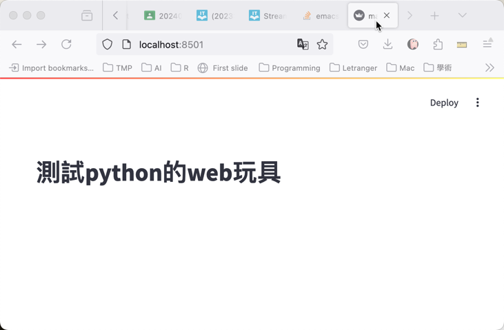
** 替代方案：在 Google Colab 中執行 Streamlit
如果你的電腦無法安裝 Python 環境，可以用 Google Colab 來開發 Streamlit 應用。但由於 Colab 不支援直接開啟網頁服務，需要透過 localtunnel 將應用暴露到網路上，步驟較繁瑣，建議*優先使用本機開發*。

*** Step 1：安裝套件
#+begin_src python -r -n :results output :exports both
!pip install streamlit -q
#+end_src
*** Step 2：撰寫程式
使用 =%%writefile= 將程式碼寫入檔案：

這裡用到了 =st.number_input()= 來讓使用者輸入數字：
#+begin_verse
=st.number_input(label, min_value=None, max_value=None, value=None, step=None)=
#+end_verse
| 參數        | 說明                                   |
|-------------+----------------------------------------|
| =label=     | 顯示在輸入框上方的文字                 |
| =min_value= | 最小值限制（預設 None 不限制）         |
| =max_value= | 最大值限制（預設 None 不限制）         |
| =value=     | 預設值（未指定時預設為 =min_value= ，若也沒設 =min_value= 則為 0.0） |
| =step=      | 每次增減的步長（未指定時整數預設 1、浮點數預設 0.01） |

另外， =value= 的型別會決定回傳型別：給 int 就回傳 int，給 float 就回傳 float。

#+begin_src python -r -n :results output :exports both
%%writefile app.py
import streamlit as st
st.write('# Streamlit計算機')
num1 = st.number_input('數字1')
num2 = st.number_input('數字2')
num3 = num1 + num2
st.write('# 答案', num3)
#+end_src
*** Step 3：執行並取得公開網址
#+begin_src python -r -n :results output :exports both
!streamlit run app.py & npx localtunnel --port 8501
#+end_src
執行後會產生一個 =xxx.loca.lt= 的網址，點擊即可開啟你的應用。

注意：開啟網址後 localtunnel 會先出現一個確認頁面，要求輸入 tunnel password，這個密碼就是 Colab 主機的對外 IP。可以在 Colab 另開一個儲存格執行以下指令取得：
#+begin_src python -r -n :results output :exports both
!wget -q -O - ipv4.icanhazip.com
#+end_src
把顯示的 IP 貼到密碼欄位送出，就能看到你的 Streamlit 應用。

原理說明：
- =&= 讓 =streamlit run= 在背景執行，不阻擋後面的指令
- =npx localtunnel --port 8501= 把 Colab 內部的 8501 port 暴露到網路上，產生一個臨時的公開網址
- 這個網址是暫時的，Colab 斷線後就會失效
** 秀資料
學生成績
#+begin_src python -r -n :results output :exports both :tangle main.py
import streamlit as st
import pandas as pd

st.title('學生成績')

df = pd.DataFrame({
    '國文': [98, 76, 100, 38, 40],
    '數學': [80, 46, 80, 67, 66]
})
df

# 畫圖
st.line_chart(df)
#+end_src

** 文字輸入與核取方塊
=st.text_input= 用來接收使用者輸入的文字，=st.checkbox= 則是一個簡單的開關：
#+begin_src python -r -n :results output :exports both
import streamlit as st
import pandas as pd

st.title('學生成績查詢')

df = pd.DataFrame({
    '姓名': ['小明', '小華', '小美', '小強', '小玉'],
    '國文': [98, 76, 100, 38, 40],
    '數學': [80, 46, 80, 67, 66]
})

# 文字輸入：搜尋學生
name = st.text_input('輸入學生姓名')
if name:
    result = df[df['姓名'].str.contains(name)]
    st.dataframe(result)

# 核取方塊：顯示/隱藏原始資料
if st.checkbox('顯示全部資料'):
    st.dataframe(df)
#+end_src

** 在 Streamlit 中使用 Matplotlib
前面學過的 matplotlib 圖表，可以用 =st.pyplot(fig)= 直接放進 Streamlit。重點是要先建立 =fig= 物件，再丟給 =st.pyplot()=：
#+begin_src python -r -n :results output :exports both
import streamlit as st
import pandas as pd
import matplotlib.pyplot as plt

plt.rcParams['font.sans-serif'] = ['Arial Unicode MS']
plt.rcParams['axes.unicode_minus'] = False

st.title('成績分佈')

df = pd.DataFrame({
    '國文': [98, 76, 100, 38, 40, 85, 72, 91],
    '數學': [80, 46, 80, 67, 66, 55, 88, 73]
})

# 用 matplotlib 畫圖，再用 st.pyplot() 顯示
fig, ax = plt.subplots()
ax.hist(df['國文'], bins=range(0, 101, 10), rwidth=0.8)
ax.set_xlabel('分數')
ax.set_ylabel('人數')
ax.set_title('國文成績分佈')
st.pyplot(fig)
#+end_src

** 上傳檔案
=st.file_uploader= 讓使用者上傳 CSV 檔案，搭配 pandas 就能做出「上傳資料→分析→視覺化」的完整流程：
#+begin_src python -r -n :results output :exports both
import streamlit as st
import pandas as pd

st.title('CSV 資料分析器')

uploaded_file = st.file_uploader("上傳 CSV 檔案", type="csv")

if uploaded_file is not None:
    df = pd.read_csv(uploaded_file)
    st.write(f'共 {len(df)} 筆資料，{len(df.columns)} 個欄位')
    st.dataframe(df)

    # 讓使用者選擇要看哪個欄位的統計
    numeric_cols = df.select_dtypes(include='number').columns.tolist()
    if numeric_cols:
        col = st.selectbox('選擇欄位查看統計', numeric_cols)
        st.write(df[col].describe())
else:
    st.info('請上傳一個 CSV 檔案')
#+end_src

** 版面配置
預設的 Streamlit 畫面是由上到下一條直線排列。用 =st.columns= 可以做出左右並排的版面，用 =st.tabs= 可以做出分頁效果：
*** 左右並排 (columns)
#+begin_src python -r -n :results output :exports both
import streamlit as st
import pandas as pd

st.title('版面示範')

df = pd.DataFrame({
    '國文': [98, 76, 100, 38, 40],
    '數學': [80, 46, 80, 67, 66]
})

# 建立兩個欄位，左右並排
col1, col2 = st.columns(2)

with col1:
    st.subheader('國文成績')
    st.dataframe(df[['國文']])

with col2:
    st.subheader('數學成績')
    st.dataframe(df[['數學']])
#+end_src
*** 分頁 (tabs)
#+begin_src python -r -n :results output :exports both
import streamlit as st
import pandas as pd
import matplotlib.pyplot as plt

plt.rcParams['font.sans-serif'] = ['Arial Unicode MS']
plt.rcParams['axes.unicode_minus'] = False

st.title('成績系統')

df = pd.DataFrame({
    '國文': [98, 76, 100, 38, 40],
    '數學': [80, 46, 80, 67, 66]
})

tab1, tab2, tab3 = st.tabs(["原始資料", "統計摘要", "圖表"])

with tab1:
    st.dataframe(df)

with tab2:
    st.write(df.describe())

with tab3:
    fig, ax = plt.subplots()
    df.plot(kind='box', ax=ax)
    ax.set_title('各科成績箱形圖')
    st.pyplot(fig)
#+end_src

** 顯示圖片
=st.image= 可以顯示本機圖片或網路圖片：
#+begin_src python -r -n :results output :exports both
import streamlit as st

# 顯示網路圖片
st.image("https://www.python.org/static/img/python-logo.png",
         caption="Python Logo", width=300)
#+end_src

** 常用元件速查表
以下整理 Streamlit 常用元件，方便做專題時快速查找：
| 元件                   | 用途             | 範例                                         |
|------------------------+------------------+----------------------------------------------|
| =st.title=             | 大標題           | =st.title('我的應用')=                        |
| =st.write=             | 萬用輸出         | =st.write(df)=, =st.write('文字')=            |
| =st.dataframe=         | 互動式表格       | =st.dataframe(df)=                            |
| =st.text_input=        | 文字輸入         | =name = st.text_input('姓名')=                |
| =st.number_input=      | 數字輸入         | =n = st.number_input('數量')=                  |
| =st.selectbox=         | 下拉選單         | =opt = st.selectbox('選擇', ['A','B'])=        |
| =st.checkbox=          | 核取方塊         | =if st.checkbox('顯示'):=                     |
| =st.slider=            | 滑桿             | =val = st.slider('值', 0, 100, 50)=           |
| =st.radio=             | 單選按鈕         | =r = st.radio('選擇', ['甲','乙'])=           |
| =st.file_uploader=     | 上傳檔案         | =f = st.file_uploader('上傳', type='csv')=     |
| =st.image=             | 顯示圖片         | =st.image('photo.png')=                       |
| =st.pyplot=            | 顯示 matplotlib  | =st.pyplot(fig)=                              |
| =st.line_chart=        | 快速折線圖       | =st.line_chart(df)=                           |
| =st.bar_chart=         | 快速長條圖       | =st.bar_chart(df)=                            |
| =st.map=               | 地圖             | =st.map(df)=                                  |
| =st.sidebar=           | 側邊欄           | =st.sidebar.write('Hi')=                      |
| =st.columns=           | 左右並排         | =c1, c2 = st.columns(2)=                      |
| =st.tabs=              | 分頁             | =t1, t2 = st.tabs(['頁1','頁2'])=             |
| =st.camera_input=      | 拍照             | =img = st.camera_input('拍照')=                |

** 側邊欄 (Sidebar)
*** 測試一下
#+begin_src python -r -n :results output :exports both
import streamlit as st
import pandas as pd

st.title('學生成績')
st.write('lalala')
# 數據
df = pd.DataFrame({
    '國文': [98, 76, 100, 38, 40],
    '數學': [80, 46, 80, 67, 66]
})

st.sidebar.write('選項1')
st.sidebar.markdown('選項2')
with st.sidebar:
    st.write('選項3')

df
#+end_src
*** 練習
- 請自行在sidebar和main area裡加入一些文字
- 可以發現sidebar是可以接受markdown語法的，那麼，你能否應用markdown語法在sidebar裡放一個google的連結呢?
** 選單
*** 連結式選單
#+begin_src python -r -n :results output :exports both
import streamlit as st
import pandas as pd

st.title('學生成績')

# 數據
df = pd.DataFrame({
    '國文': [98, 76, 100, 38, 40],
    '數學': [80, 46, 80, 67, 66]
})

# 側邊欄連結
st.sidebar.markdown("[查看數據](?page=table)")
st.sidebar.markdown("[畫圖](?page=chart)")

# 獲取當前URL參數
query_params = st.query_params
page = query_params.get("page", "table")

# 根據URL參數顯示相應的內容
if page == 'table':
    st.write('學生成績數據表')
    st.dataframe(df)
elif page == 'chart':
    st.write('學生成績折線圖')
    st.line_chart(df)
#+end_src
*** 下拉式選單
#+begin_src python -r -n :results output :exports both
import streamlit as st
import pandas as pd
import matplotlib.pyplot as plt

st.title('學生成績')

# 數據
df = pd.DataFrame({
    '國文': [98, 76, 100, 38, 40],
    '數學': [80, 46, 80, 67, 66]
})

# 側邊欄選擇
st.sidebar.write('選單')
option = st.sidebar.selectbox(
    '請選擇操作',
    ['查看成績', '畫折線圖']
)

# 根據選擇顯示相應的內容
if option == '查看成績':
    st.write('學生成績表')
    st.dataframe(df)
elif option == '畫折線圖':
    st.write('學生成績折線圖')
    fig, ax = plt.subplots()
    ax.plot(df['國文'])
    ax.plot(df['數學'])
    ax.set_xticks(range(5))
    ax.set_xticklabels(range(1, len(df) + 1))
    st.pyplot(fig)
#+end_src
*** 課堂練習
請參考Google Classroom中的[實作練習7]更專業的資料處理工具: Pandas，新增三種選單功能
- 查看全班成績
- 國文科成績長條圖
- 各科Box圖
- 請解決畫圖時中文出現亂碼的問題
- 請善用ChatGPT
完成結果參考下圖:
#+ATTR_LATEX: :width 300
#+ATTR_ORG: :width 300
#+ATTR_HTML: :width 500
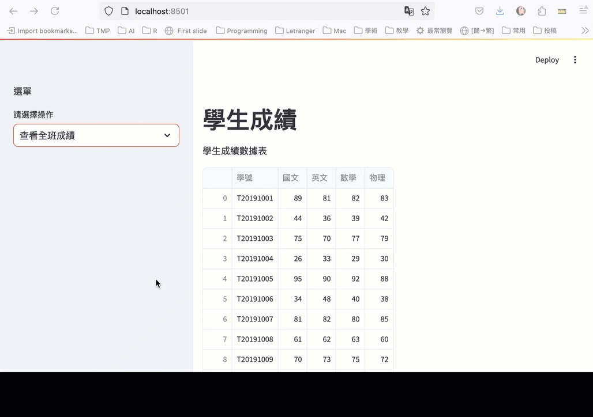
**** solution :noexport:
#+begin_src python -r -n :results output :exports both
import streamlit as st
import pandas as pd
import matplotlib.pyplot as plt

# 設置中文字體
plt.rcParams['font.sans-serif'] = ['Arial Unicode MS']
plt.rcParams['axes.unicode_minus'] = False
st.title('學生成績')

# 數據
df = pd.read_csv("https://letranger.github.io/working/scores.csv")

# 側邊欄選擇
st.sidebar.write('選單')
option = st.sidebar.selectbox(
    '請選擇操作',
    ['查看全班成績', '國文科成績長條圖', '各科Box圖']
)

# 根據選擇顯示相應的內容
if option == '查看全班成績':
    st.write('學生成績數據表')
    st.dataframe(df)

elif option == '國文科成績長條圖':
    st.write('國文科成績長條圖')
    fig, ax = plt.subplots()
    df['國文'].plot(kind='hist', bins=range(0, 101, 10), rwidth=0.8, ax=ax)
    ax.set_xlabel('分數')
    ax.set_ylabel('人數')
    st.pyplot(fig)

elif option == '各科Box圖':
    st.write('各科Box圖')
    fig, ax = plt.subplots()
    df.plot(kind='box', ax=ax)
    st.pyplot(fig)
#+end_src
** 地圖
*** 單一地標
#+begin_src python -r -n :results output :exports both
import streamlit as st
import pandas as pd

st.title('雲林智慧教育中心')

data = pd.DataFrame({
    'lat': 23.67,
    'lon': 120.39,
    'name': ['雲林智慧教育中心']
})

st.map(data)
#+end_src
*** 兩個或以上地標
#+begin_src python -r -n :results output :exports both
import streamlit as st
import pandas as pd

st.title('雲林')
# 定義不同地點的數據
locs = {
    '雲林智慧教育中心': {'lat': 23.67, 'lon': 120.39},
    '雲林高鐵站': {'lat': 23.738, 'lon': 120.428}
}

data = pd.DataFrame([
    {'lat': locs['雲林智慧教育中心']['lat'], 'lon': locs['雲林智慧教育中心']['lon'], 'name': '雲林智慧教育中心'},
    {'lat': locs['雲林高鐵站']['lat'], 'lon': locs['雲林高鐵站']['lon'], 'name': '雲林高鐵站'}
])

st.map(data)

#+end_src
*** 加入選單
#+begin_src python -r -n :results output :exports both
import streamlit as st
import pandas as pd

st.title('雲林智慧教育中心')
# 定義不同地點的數據
locations = {
    '雲林智慧教育中心': {'lat': 23.67, 'lon': 120.39},
    '雲林高鐵站': {'lat': 23.738, 'lon': 120.428}
}

# 在側邊欄中選擇地點
st.sidebar.write('選單')
option = st.sidebar.selectbox(
    '請選擇地點',
    ['雲林智慧教育中心', '雲林高鐵站'])

# 根據選擇的地點更新地圖數據
selected_location = locations[option]
data = pd.DataFrame({
    'lat': [selected_location['lat']],
    'lon': [selected_location['lon']],
    'name': [option]
})
selected_location['lat']
selected_location['lon']
option

st.map(data)
#+end_src
*** 課堂練習
- 請加入你家的地圖
- 請加入和你學校的地圖
** 聊天 :noexport:
#+begin_src python -r -n :results output :exports both
import streamlit as st

# 取得由相機輸入的影像緩衝資料
imgBuffer = st.camera_input("拍照")

if imgBuffer is not None:
    # 將緩衝資料轉換為二進位資料
    imgData = imgBuffer.getvalue()

    with open("/Users/letranger/Desktop/captured_image.png", "wb") as f:
        f.write(imgData)

    st.success("影像成功儲存!")
#+end_src
** 照相
#+begin_src python -r -n :results output :exports both
import streamlit as st

# 取得由相機輸入的影像緩衝資料
imgBuffer = st.camera_input("拍照")

if imgBuffer is not None:
    # 將緩衝資料轉換為二進位資料
    imgData = imgBuffer.getvalue()

    # 儲存到目前資料夾（請依需求修改路徑）
    with open("captured_image.png", "wb") as f:
        f.write(imgData)

    st.success("影像成功儲存!")
#+end_src
** 部署應用程式 (Deploy your app)
做完專題後，你可以把 Streamlit 應用發佈到網路上，讓老師和同學都能直接用瀏覽器打開你的作品。這是交作業和展示成果的最佳方式。

*** Step 1：準備檔案
你的專案資料夾至少需要兩個檔案：
#+begin_example
my-project/
├── app.py               ← 你的 Streamlit 主程式
└── requirements.txt      ← 列出所需套件
#+end_example
=requirements.txt= 的內容就是你的程式有 import 的套件名稱，例如：
#+begin_src text -r -n :eval no
streamlit
pandas
matplotlib
#+end_src
如果你的程式有用到 CSV 資料檔，也一起放進資料夾。

*** Step 2：上傳至 GitHub
1. 登入 [[https://github.com/][GitHub]]（沒有帳號的先註冊一個）
2. 點右上角「+」→「New repository」，取個名字（例如 =my-streamlit-app=）
3. 把 =app.py= 和 =requirements.txt= 上傳到這個 repository

*** Step 3：部署到 Streamlit Community Cloud
1. 前往 [[https://share.streamlit.io/][Streamlit Community Cloud]]，用 GitHub 帳號登入
2. 點選「New app」
3. 選擇你的 repository、branch（通常是 =main=）、主程式檔案（=app.py=）
4. 點選「Deploy」，等待約 1-2 分鐘
5. 部署完成後會取得一個公開網址（例如 =https://你的名字-app.streamlit.app=），任何人都能打開

*** 注意事項
- Streamlit Community Cloud 是免費的，但每個帳號有數量限制
- 如果程式有修改，push 到 GitHub 後會自動重新部署
- 資料檔案不要太大（建議 < 50MB），大檔案改用網路 URL 讀取
** cache :noexport:
=@st.cache_data= 是 Streamlit 的快取裝飾器，用來快取函式的回傳值，相同輸入參數不會重複計算。適合用在讀取資料、API 呼叫等耗時操作，避免每次重新整理頁面都要重跑一次。

#+begin_src python -r -n :results output :exports both
import streamlit as st
import pandas as pd
import numpy as np

st.title('Uber pickups in NYC')

DATE_COLUMN = 'date/time'
DATA_URL = ('https://s3-us-west-2.amazonaws.com/'
         'streamlit-demo-data/uber-raw-data-sep14.csv.gz')

@st.cache_data
def load_data(nrows):
    data = pd.read_csv(DATA_URL, nrows=nrows)
    lowercase = lambda x: str(x).lower()
    data.rename(lowercase, axis='columns', inplace=True)
    data[DATE_COLUMN] = pd.to_datetime(data[DATE_COLUMN])
    return data

data_load_state = st.text('loading data ...')
data = load_data(10000)
data_load_state.text('done (cached data).')

if st.checkbox('show raw data'):
    st.subheader('Raw data')
    st.write(data)

st.subheader('Number of pickups by hour')
hist_values = np.histogram(
    data[DATE_COLUMN].dt.hour, bins=24, range=(0,24))[0]
st.bar_chart(hist_values)

hour_to_filter = st.slider('hour', 0, 23, 6)  # min: 0h, max: 23h, default: 6h
st.subheader(f'Map of all pickups at {hour_to_filter}:00')
filtered_data = data[data[DATE_COLUMN].dt.hour == hour_to_filter]
st.write(f'read nrows: {len(filtered_data)}')
st.map(filtered_data)

#+end_src
** 研習用範例
*** 需要先在本機端安裝的套件
#+begin_src shell -r -n :results output :exports both
pip3 install pandas
pip3 install streamlit
pip3 install plotly
pip3 install scikit-learn
#+end_src
*** 範例程式
#+begin_src python -r -n :results output :exports both
import pandas as pd
import streamlit as st
import plotly.express as px
from sklearn.cluster import KMeans

# 讀取資料
test = pd.read_csv("https://letranger.github.io/working/scores.csv")

# Streamlit 應用程式標題
st.title("分數分佈")

# 設定側邊欄選單
st.sidebar.write('選單')

# 科目選擇下拉選單
option = st.sidebar.selectbox(
    '請選擇科目',
    ['國文', '英文', '數學', '物理']
)

# 顯示資料框
st.write("### 資料", test)

# 將分數依每10分分一組
test['binned'] = pd.cut(test[option], bins=range(0, 101, 10))

# 計算每個區間的頻率
frequency = test['binned'].value_counts().sort_index()
# 轉換為資料框格式，方便 Streamlit 顯示
frequency_df = pd.DataFrame({'分數區間': frequency.index.astype(str), '頻率': frequency.values})

# 使用 Streamlit 顯示長條圖
st.bar_chart(frequency_df.set_index('分數區間'))

# KMeans 聚類
# 使用滑桿選擇 k 值（聚類數量）
k = st.slider("選擇聚類的數量 k", 2, 10, 3)
kmeans = KMeans(n_clusters=k)  # 預設分為 k 群
kmeans.fit(test[['國文', '英文']])  # 使用 '國文' 和 '英文' 進行聚類
clusters = kmeans.predict(test[['國文', '英文']])

# 將聚類結果添加到資料框
test['聚類'] = clusters

# 使用 Plotly 繪製聚類結果的散點圖
fig2 = px.scatter(test, x='國文', y='英文', color='聚類', title='國文與英文分數的聚類結果')
st.plotly_chart(fig2)
#+end_src
** 執行結果
你也可以把你開發好的程式透過[[https://github.com/][Github]]發佈到Streamlit的[[https://streamlit.io/][免費雲端平台]]，[[https://playapp-letranger.streamlit.app/][像這樣]]

#+CAPTION: Streamlit執行範例
#+LABEL: fig:gui-streamlit-demo
#+name: fig:gui-streamlit-demo
#+ATTR_LATEX: :width 300
#+ATTR_ORG: :width 300
#+ATTR_HTML: :width 600
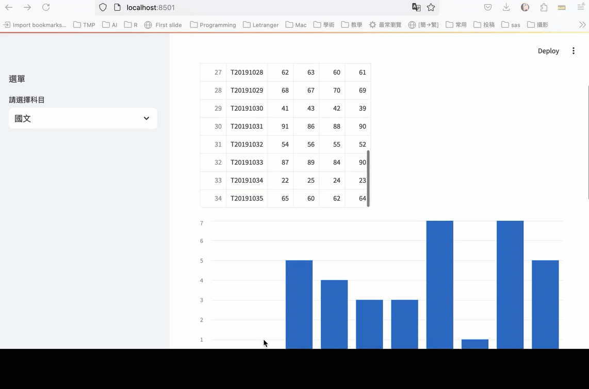

* Gradio
前面學了 Streamlit，這裡再介紹另一個 Web GUI 工具 Gradio。兩者的差異：
| 工具      | 適合場景                                     |
|-----------+----------------------------------------------|
| Streamlit | 資料儀表板、多頁面的資料展示應用             |
| Gradio    | 「輸入→處理→輸出」的 demo，特別適合 AI 模型展示 |

簡單來說，如果你的程式是「丟東西進去、吐結果出來」的型態，Gradio 會比 Streamlit 更快上手。
- [[https://gradio.app/][官網]]
- [[https://gradio.app/docs/][gradio Docs]]
- [[https://github.com/gradio-app/gradio][Gradio github]]
** 安裝套件
#+begin_src shell -r -n :results output :exports both
pip3 install gradio
#+end_src

** Hello world[fn:1]
=gr.Interface= 是 Gradio 最核心的類別，把一個 Python 函式包裝成網頁介面：
#+begin_verse
=gr.Interface(fn, inputs, outputs, title=None, description=None)=
#+end_verse
| 參數          | 說明                                                  |
|---------------+-------------------------------------------------------|
| =fn=          | 被 UI 裝飾的函式                                      |
| =inputs=      | 輸入元件，可用字串簡寫如 ="text"=, ="image"=, ="audio"= |
| =outputs=     | 輸出元件，可用字串簡寫如 ="text"=, ="image"=, ="label"= |
| =title=       | 網頁標題（顯示在最上方）                              |
| =description= | 標題下方的說明文字                                    |

多個輸入/輸出用 list 傳入，例如 =inputs=["text", "number"]=。Gradio 支援 20 多種不同的元件型別，其中大部分都可以作為輸入/輸出元件，詳見官網文件[[https://gradio.app/docs/][gradio Docs]]
#+begin_src python -r -n :results output :exports both :noeval :session gradio
import gradio as gr

def greet(name):
    return "Hello " + name + "!!"

demo = gr.Interface(fn=greet, inputs="text", outputs="text")

demo.launch()
#+end_src

#+RESULTS:

#+CAPTION: 執行畫面
#+LABEL: fig:gui-gradio-hello
#+name: fig:gui-gradio-hello
#+ATTR_LATEX: :width 300
#+ATTR_ORG: :width 300
#+ATTR_HTML: :width 800
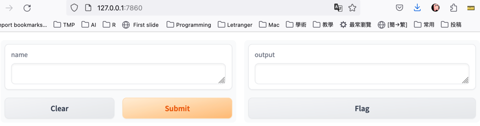

** 數字 I/O
這裡用 =gr.Slider= 當作數字輸入元件，比起手動打數字方便多了：
#+begin_verse
=gr.Slider(minimum=0, maximum=100, value=50, step=1, label=None)=
#+end_verse
| 參數      | 說明                         |
|-----------+------------------------------|
| =minimum= | 滑桿最小值（預設 0）         |
| =maximum= | 滑桿最大值（預設 100）       |
| =value=   | 預設值（預設 50）            |
| =step=    | 每次滑動的步長（預設 1）     |
| =label=   | 顯示在滑桿上方的標籤文字     |

#+begin_src python -r -n :results output :exports both :noeval :session gradio
import gradio as gr

def BMI(h, w):
  h /= 100
  return f'BMI值: {w/(h*h)}'

ui = gr.Interface(
    fn=BMI, inputs=[gr.Slider(100, 240, label="身高(cm)"), gr.Slider(40, 200, label="體重(kg)")],
    outputs=["text"]
)
ui.launch(share=True)
#+end_src
#+CAPTION: 執行畫面
#+LABEL: fig:gui-gradio-number-io
#+name: fig:gui-gradio-number-io
#+ATTR_LATEX: :width 300
#+ATTR_ORG: :width 300
#+ATTR_HTML: :width 700
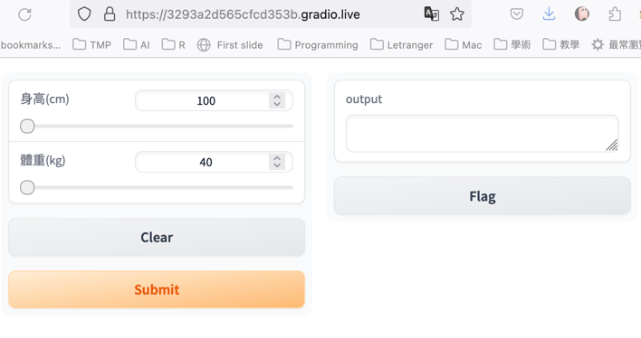

*** [課堂練習]三角形面積 :TNFSH:
輸入三角形三邊長(1..100)，輸出面積、周長

** 文字 I/O
#+begin_src python -r -n :results output :exports both :noeval :session gradio
import gradio as gr

def greet(name):
    return "Hello " + name + "!"

demo = gr.Interface(
    fn=greet,
    inputs=gr.Textbox(lines=2, placeholder="Name Here..."),
    outputs="text",
)
demo.launch(share=True)
#+end_src

#+CAPTION: 執行畫面
#+LABEL: fig:gui-gradio-text-io
#+name: fig:gui-gradio-text-io
#+ATTR_LATEX: :width 300
#+ATTR_ORG: :width 300
#+ATTR_HTML: :width 600
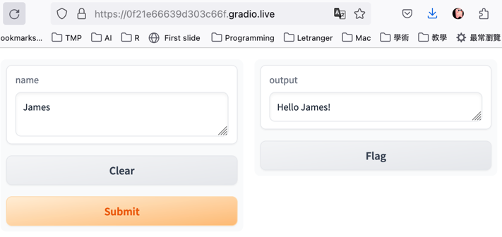

** 多資料 I/O
#+begin_src python -r -n :results output :exports both :noeval :session gradio
import gradio as gr

def greet(name, is_morning, temperature):
    salutation = "Good morning" if is_morning else "Good evening"
    greeting = f"{salutation} {name}. It is {temperature} degrees today"
    celsius = (temperature - 32) * 5 / 9
    return greeting, round(celsius, 2)

demo = gr.Interface(
    fn=greet,
    inputs=["text", "checkbox", gr.Slider(0, 100)],
    outputs=["text", "number"],
)
demo.launch(share=True)
#+end_src
#+CAPTION: 執行畫面
#+LABEL: fig:gui-gradio-multi-io
#+name: fig:gui-gradio-multi-io
#+ATTR_LATEX: :width 300
#+ATTR_ORG: :width 300
#+ATTR_HTML: :width 600
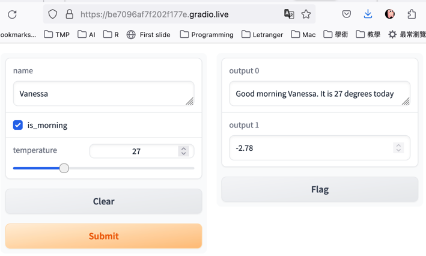

** 圖形 I/O
#+begin_src python -r -n :results output :exports both :noeval :session gradio
import gradio as gr
import matplotlib.pyplot as plt
import numpy as np
def curve(a, b, c):
    x = np.arange(-3, 3, 0.3)
    y = a*x**2 + b*x + c
    fig = plt.figure()
    plt.plot(x, y)
    print(x)
    print(y)
    return fig
inputs = [gr.Slider(0, 10, 5), gr.Slider(0, 10, 5), gr.Slider(0, 10, 5)]
outputs = gr.Plot()
demo = gr.Interface(
    fn=curve,
    inputs=inputs,
    outputs=outputs,
    cache_examples=True,)
demo.launch(share=True)
#+end_src
#+CAPTION: 執行畫面
#+LABEL: fig:gui-gradio-image-io
#+name: fig:gui-gradio-image-io
#+ATTR_LATEX: :width 300
#+ATTR_ORG: :width 300
#+ATTR_HTML: :width 600
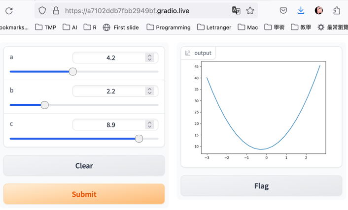

** 按鈕 (Button)
前面的 =gr.Interface= 適合「一進一出」的簡單情境，如果需要自訂版面配置（例如自己決定元件排列方式），就要用 =gr.Blocks=：
#+begin_verse
=with gr.Blocks() as demo:=
#+end_verse
- 在 =with= 區塊裡面放元件，就會按順序排列
- 搭配 =gr.Row()=, =gr.Column()= 可以做水平/垂直排列
- 用 =btn.click(fn=函式, inputs=..., outputs=...)= 綁定按鈕事件

#+begin_src python -r -n :results output :exports both :noeval :session gradio
import gradio as gr

def greet(name):
    return "Hello " + name + "!"

with gr.Blocks() as demo:
    name = gr.Textbox(label="Name")
    output = gr.Textbox(label="Output Box")
    greet_btn = gr.Button("Greet")
    greet_btn.click(fn=greet, inputs=name, outputs=output)

demo.launch(share=True)
#+end_src
#+CAPTION: 執行畫面
#+LABEL: fig:gui-gradio-button
#+name: fig:gui-gradio-button
#+ATTR_LATEX: :width 300
#+ATTR_ORG: :width 300
#+ATTR_HTML: :width 600
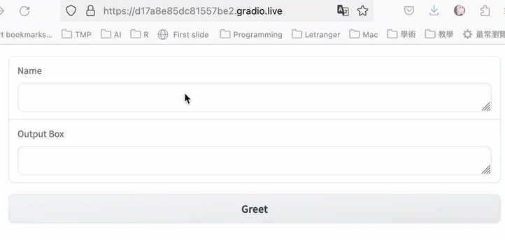

** Radio
#+begin_src python -r -n :results output :exports both :noeval :session gradio
import gradio as gr

def greet(gender, name):
    if gender == "Male":
        return "Hello, Mr. " + name + "!"
    else:
        return "Hello, Ms. " + name + "!"

with gr.Blocks() as demo:
    inputs = [gr.Radio(["Male", "Female"]), gr.Textbox(label="Name")]
    output = gr.Textbox(label="Output Box")
    greet_btn = gr.Button("Greet")
    greet_btn.click(fn=greet, inputs=inputs, outputs=output)

demo.launch(share=True)
#+end_src
#+CAPTION: 執行畫面
#+LABEL: fig:gui-gradio-radio
#+name: fig:gui-gradio-radio
#+ATTR_LATEX: :width 300
#+ATTR_ORG: :width 300
#+ATTR_HTML: :width 600
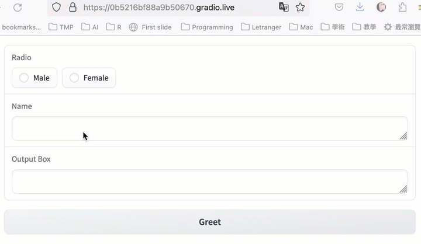

** Tab(分頁)
適合多功能的程式(靜態的多重輸入)
#+begin_src python -r -n :results output :exports both :noeval :session gradio
import gradio as gr

def tri(a, b, c):
    import math
    # 防呆：三角形任兩邊之和必須大於第三邊
    if a + b <= c or a + c <= b or b + c <= a:
        return "三邊長無法構成三角形，請重新調整"
    # 使用海龍公式計算半周長
    s = (a + b + c) / 2
    # 使用半周長計算面積
    area = math.sqrt(s * (s - a) * (s - b) * (s - c))
    return round(area,2)

def rect(a, b):
    return round(a*b,2)

area1 = gr.Interface(
    tri,
    [gr.Slider(label="邊長 a", minimum=1), gr.Slider(label="邊長 b", minimum=1), gr.Slider(label="邊長 c", minimum=1) ],
    gr.Textbox(label="面積"),
)

area2 = gr.Interface(
    rect,
    [ gr.Slider(label="長"), gr.Slider(label="寬") ],
    gr.Number(label="面積"),
)

gr.TabbedInterface(
    [area1, area2], ["三角形", "長方形"]
).launch()
#+end_src
#+CAPTION: 分頁式的Gradio
#+LABEL: fig:gui-gradio-tabs
#+name: fig:gui-gradio-tabs
#+ATTR_LATEX: :width 300
#+ATTR_ORG: :width 300
#+ATTR_HTML: :width 600
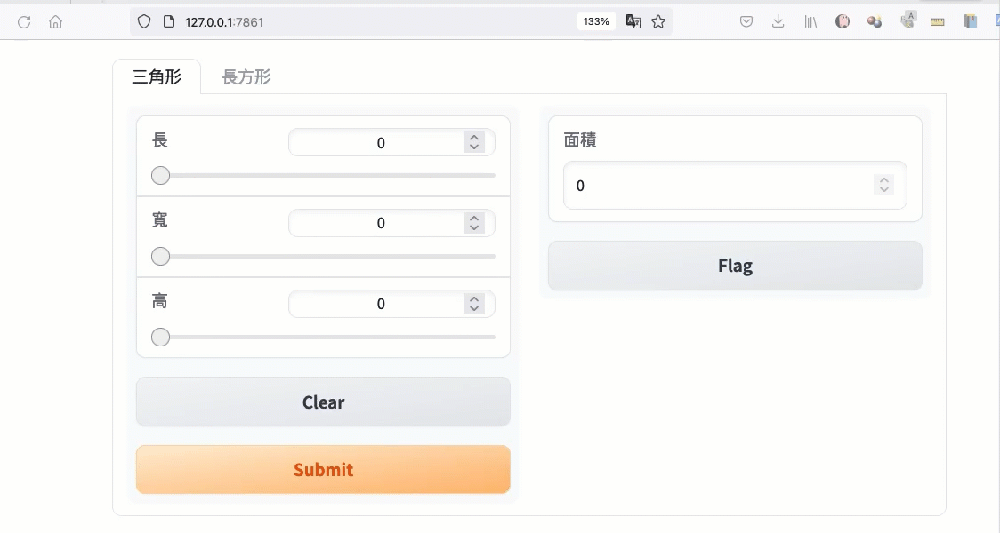

* Flask
** 按鈕 (Button)
Flask 用 =@app.route()= 裝飾器把 URL 路徑對應到 Python 函式：
#+begin_verse
=@app.route(rule, methods=['GET'])=
#+end_verse
| 參數      | 說明                                           |
|-----------+------------------------------------------------|
| =rule=    | URL 路徑，如 ="/"=、="/page"=                   |
| =methods= | 允許的 HTTP 方法，如 =['GET', 'POST']=          |

=rule= 中可用 =<variable>= 接收 URL 參數，例如 =@app.route("/user/<name>")= 會把網址中的值傳給函式參數 =name=。

#+begin_src python -r -n :results output :exports both :noeval :session gradio
from flask import Flask
app = Flask(__name__)

@app.route("/")
def hello():
    title = "<title>Advanced Materials of Python</title>"
    h1 = "<h1>Python based web</h1>"
    p1 = "
這是用Python開發的網站
"
    return title+h1+p1

if __name__ == "__main__":
    app.run()
#+end_src

#+RESULTS:
#+Caption: Flask Web Site
#+Label: fig:PandasPlot-4
#+name: fig:PandasPlot-4
#+ATTR_LATEX: :width 400
#+ATTR_HTML: :width 500
#+ATTR_ORG: :width 500
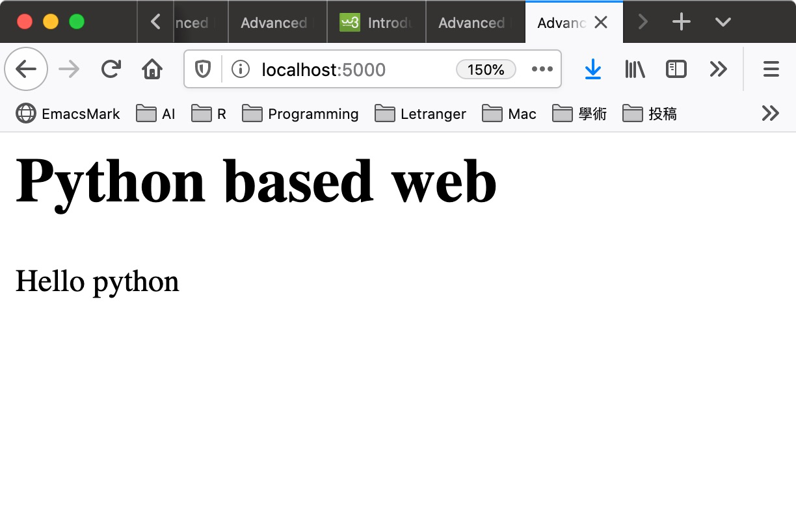

** 輸入表單 (Input form)[fn:2]
#+CAPTION: 執行畫面
#+LABEL: fig:gui-flask-form
#+name: fig:gui-flask-form
#+ATTR_LATEX: :width 300
#+ATTR_ORG: :width 300
#+ATTR_HTML: :width 700
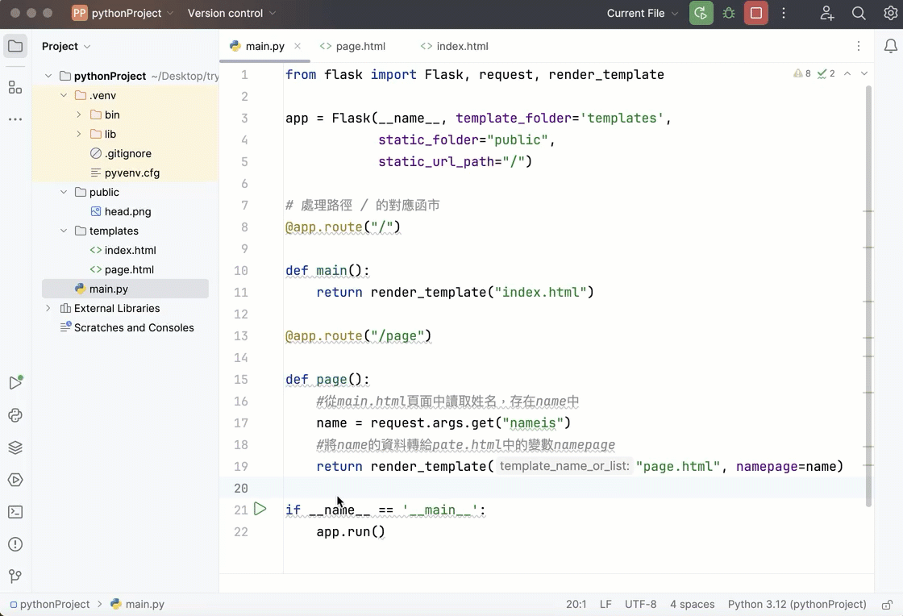
*** Python
這個範例用到了 =render_template()= 來載入 HTML 模板：
#+begin_verse
=render_template(template_name, **context)=
#+end_verse
| 參數            | 說明                                          |
|-----------------+-----------------------------------------------|
| =template_name= | 模板檔名，如 ="index.html"=                   |
| =**context=     | 要傳給模板的變數，用關鍵字參數傳入            |

注意事項：
- 模板檔案須放在 =templates/= 資料夾裡（Flask 預設路徑）
- 傳入的變數可在模板中用 =​{{ variable }}= 存取

#+begin_src python -r -n :results output :exports both
# Flask網站前後端互動 09 - 超連結與圖片
# 載入Flask、Request、render_template
from flask import Flask, request, render_template

app = Flask(__name__, template_folder='templates',
            static_folder="public",
            static_url_path="/")

# 處理路徑 / 的對應函式
@app.route("/")

def main():
    return render_template("index.html")

@app.route("/page")

def page():
    #從main.html頁面中讀取姓名，存在name中
    name = request.args.get("nameis")
    # 將name的資料轉給page.html中的變數namepage
    return render_template("page.html", namepage=name)
# 啟動Server

if __name__ == '__main__':
    app.debug = True  # 開發時方便除錯，正式上線時記得關掉
    app.run()
#+end_src

#+RESULTS:

*** templates
1. 建立public資料夾，放入一個head.png圖檔
2. 建立templates資料夾
3. 以下兩個html檔要放在templates資料夾中
**** index.html
#+begin_src html -r -n :eval no
<!DOCTYPE html>
<html lang="en">

<head>
    <meta charset="UTF-8">
    <meta http-equiv="X-UA-Compatible" content="IE=edge">
    <meta name="viewport" content="width=device-width, initial-scale=1.0">
    <title>這是標題</title>
</head>

<body>
    <h3>網頁的主畫面</h3>
    <form action="/page">
        名字:<input type="text" name="nameis">
        <button>點擊送出</button>
    </form>
</body>

</html>
#+end_src
**** page.html
#+begin_src html -r :eval no
<!DOCTYPE html>
<html lang="en">

<head>
    <meta charset="UTF-8">
    <meta http-equiv="X-UA-Compatible" content="IE=edge">
    <meta name="viewport" content="width=device-width, initial-scale=1.0">
    <title>page1</title>

</head>

<body>
    <h1>我的名字叫 {{namepage}}</h1>
</body>

</html>
#+end_src

** [課堂練習]Flask 自我介紹網站 :TNFSH:
參考上面的 Input form 範例，製作一個簡易的自我介紹網站：
1. 首頁（index.html）包含一個表單，讓使用者輸入：
   - 姓名（文字輸入）
   - 班級（文字輸入）
   - 興趣（文字輸入）
2. 點擊送出後，跳到結果頁（result.html），顯示使用者輸入的資料
3. 結果頁使用 HTML 標題和段落排版

提示：
- 使用 =request.args.get()= 取得表單資料
- 在 =render_template()= 中傳入多個變數
- HTML 表單的 =action= 屬性指向 Flask 的路由

*** solution :noexport:
**** app.py
#+begin_src python -r -n :results output :exports both
from flask import Flask, request, render_template

app = Flask(__name__, template_folder='templates')

@app.route("/")
def main():
    return render_template("index.html")

@app.route("/result")
def result():
    name = request.args.get("name")
    cls = request.args.get("cls")
    hobby = request.args.get("hobby")
    return render_template("result.html", name=name, cls=cls, hobby=hobby)

if __name__ == '__main__':
    app.debug = True
    app.run()
#+end_src

**** index.html
#+begin_src html -r -n :eval no
<!DOCTYPE html>
<html>
<head><title>自我介紹</title></head>
<body>
    <h2>自我介紹表單</h2>
    <form action="/result">
        姓名: <input type="text" name="name">  
        班級: <input type="text" name="cls">  
        興趣: <input type="text" name="hobby">  
        <button>送出</button>
    </form>
</body>
</html>
#+end_src

**** result.html
#+begin_src html -r -n :eval no
<!DOCTYPE html>
<html>
<head><title>自我介紹結果</title></head>
<body>
    <h1>{{name}} 的自我介紹</h1>
    
班級: {{cls}}

    
興趣: {{hobby}}

    <a href="/">回到首頁</a>
</body>
</html>
#+end_src

#+latex:\newpage

* tkinter
** 安裝
*** MacOS
tkinter 是 Python 的內建模組，不需要（也不能）用 =pip install tk= 安裝（PyPI 上的 =tk= 套件與 tkinter 無關）。若在 macOS 上 =import tkinter= 出現錯誤，通常是 Homebrew 安裝的 Python 沒有附帶 Tk，此時於 PyCharm 的 terminal 下輸入 brew install python-tk@Python版本 即可。例如系統的預設 python 版本為 3.12，則輸入
#+begin_src shell -r -n :results output :exports both
brew install python-tk@3.12
#+end_src

#+RESULTS:

** 範例 #1
tkinter 的 =tk.Button= 用來建立按鈕，最重要的是 =command= 參數：
#+begin_verse
=tk.Button(parent, text='...', command=callback)=
#+end_verse
| 參數      | 說明                                           |
|-----------+------------------------------------------------|
| =parent=  | 父元件（通常是 =root= 主視窗）                 |
| =text=    | 按鈕上顯示的文字                               |
| =command= | 按下按鈕時要執行的函式（不加括號！）           |

=command= 只能綁定「沒有參數的函式」，如果需要傳參數，用 lambda 包一層：
: command=lambda: calculate('+')

#+begin_src python -r -n :results output :exports both
# -*- coding: utf-8 -*-
import tkinter as tk
from tkinter import messagebox
# 按完button要做什麼
def test():
    tk.messagebox.showinfo('測試', 'Hi')

# main window
root = tk.Tk()
root.title('my window')
root.geometry('200x150')

root.configure(background='white')

myentry = tk.Entry(root)
myentry.pack()

# Button
myButton = tk.Button(root, text='Button', command=test)
myButton.pack()

# Label
resultLabel = tk.Label(root, text='這是Label')
resultLabel.pack()

root.mainloop()
#+end_src

#+RESULTS:
#+CAPTION: 執行畫面
#+LABEL: fig:gui-tkinter-demo1
#+name: fig:gui-tkinter-demo1
#+ATTR_LATEX: :width 200
#+ATTR_ORG: :width 200
#+ATTR_HTML: :width 200
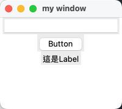

** 範例 #2
#+begin_src python -r -n :results output :exports both
# -*- coding: utf-8 -*-
import tkinter as tk
from tkinter import messagebox

def button_event():
    #print(var.get())
    if var.get() == '':
        tk.messagebox.showerror('message', '未輸入答案')
    elif var.get() == '2':
        tk.messagebox.showinfo('message', '答對了！')
    else:
        tk.messagebox.showerror('message', '答錯')

root = tk.Tk()
root.title('my window')

# label
mylabel = tk.Label(root, text='1+1=')
mylabel.grid(row=0, column=0)

var = tk.StringVar()
myentry = tk.Entry(root, textvariable=var)
myentry.grid(row=0, column=1)

mybutton = tk.Button(root, text='完成', command=button_event)
mybutton.grid(row=1, column=1)

root.mainloop()
#+end_src

#+RESULTS:
#+CAPTION: 執行畫面
#+LABEL: fig:gui-tkinter-demo2
#+name: fig:gui-tkinter-demo2
#+ATTR_LATEX: :width 300
#+ATTR_ORG: :width 300
#+ATTR_HTML: :width 500
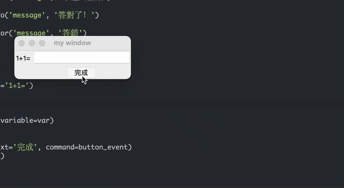

- [[https://shengyu7697.github.io/python-tkinter-entry/][Python tkinter Entry 文字輸入框用法與範例]]

** [課堂練習]簡易計算機 :TNFSH:
參考範例 #1 和 #2，用 tkinter 製作一個簡易計算機，需包含：
1. 兩個輸入欄位（Entry）讓使用者輸入數字
2. 四個按鈕（+、-、×、÷）
3. 一個 Label 顯示計算結果
4. 使用 grid 排版

提示：
- 用 =tk.Entry= 取得輸入值，透過 =.get()= 讀取並用 =float()= 轉型
- 用 =tk.Button(root, text='+', command=函式名)= 建立按鈕
- 用 =resultLabel.config(text=結果)= 更新 Label 文字

完成畫面參考：
- 第一列：「數字1」Label + Entry
- 第二列：「數字2」Label + Entry
- 第三列：四個運算按鈕（+、-、×、÷）
- 第四列：「結果」Label

*** solution :noexport:
#+begin_src python -r -n :results output :exports both
import tkinter as tk
from tkinter import messagebox

def calculate(op):
    try:
        a = float(entry1.get())
        b = float(entry2.get())
        if op == '+':
            result = a + b
        elif op == '-':
            result = a - b
        elif op == '×':
            result = a * b
        elif op == '÷':
            if b == 0:
                resultLabel.config(text='結果: 除數不能為0')
                return
            result = a / b
        resultLabel.config(text=f'結果: {result}')
    except ValueError:
        messagebox.showerror('錯誤', '請輸入有效的數字')

root = tk.Tk()
root.title('簡易計算機')

tk.Label(root, text='數字1:').grid(row=0, column=0, padx=5, pady=5)
entry1 = tk.Entry(root)
entry1.grid(row=0, column=1, columnspan=3, padx=5, pady=5)

tk.Label(root, text='數字2:').grid(row=1, column=0, padx=5, pady=5)
entry2 = tk.Entry(root)
entry2.grid(row=1, column=1, columnspan=3, padx=5, pady=5)

tk.Button(root, text='+', width=5, command=lambda: calculate('+')).grid(row=2, column=0)
tk.Button(root, text='-', width=5, command=lambda: calculate('-')).grid(row=2, column=1)
tk.Button(root, text='×', width=5, command=lambda: calculate('×')).grid(row=2, column=2)
tk.Button(root, text='÷', width=5, command=lambda: calculate('÷')).grid(row=2, column=3)

resultLabel = tk.Label(root, text='結果: ', font=('Arial', 14))
resultLabel.grid(row=3, column=0, columnspan=4, pady=10)

root.mainloop()
#+end_src

* PyInstaller
** 安裝pyinstaller
#+begin_src shell -r -n :results output :exports both
pip3 install pyinstaller
#+end_src

** 準備要打包的檔案
*** 找一個喜歡的icon
- https://www.iconarchive.com
- mac: icns
- windows: ico
此處我下載了一個icns，命名為imac.icns，與底下的403qq.py存於同一資料夾裡，如果你懶到不想自己找，也可以[[file:images/PyInstaller/2024-03-12_12-32-48_imac.icns][按這裡下載]]我的icns圖示檔
*** 以前述tkinter demo#2為例，將下列程式命名為403qq.py
#+begin_src python -r -n :results output :exports both
import tkinter as tk
from tkinter import messagebox

def button_event():
    #print(var.get())
    if var.get() == '':
        tk.messagebox.showerror('message', '未輸入答案')
    elif var.get() == '2':
        tk.messagebox.showinfo('message', '答對了！')
    else:
        tk.messagebox.showerror('message', '答錯')

root = tk.Tk()
root.title('my window')

# label
mylabel = tk.Label(root, text='1+1=')
mylabel.grid(row=0, column=0)

var = tk.StringVar()
myentry = tk.Entry(root, textvariable=var)
myentry.grid(row=0, column=1)

mybutton = tk.Button(root, text='完成', command=button_event)
mybutton.grid(row=1, column=1)

root.mainloop()
#+end_src

** 打包
#+begin_src shell -r -n :results output :exports both
pyinstaller --icon imac.icns --noconsole -n 403QQ 403qq.py
#+end_src
成功執行後，會在同一資料夾中看到一個dist的資料夾，裡面有一支403QQ的應用程式，試著執行看看
#+CAPTION: 編譯後的應用程式: 403QQ
#+LABEL: fig:gui-pyinstaller-403qq
#+name: fig:gui-pyinstaller-403qq
#+ATTR_LATEX: :width 300
#+ATTR_ORG: :width 300
#+ATTR_HTML: :width 500
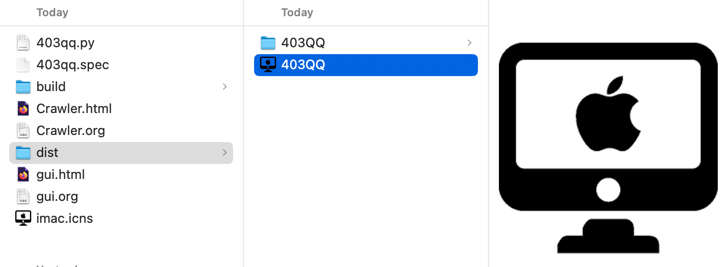

* PySimpleGUI :noexport:
#+begin_src shell -r -n :results output :exports both
pip3 install pysimplegui
#+end_src
#+begin_src python -r -n :results output :exports both
import PySimpleGUI as sg

sg.theme('DarkAmber')   # Add a touch of color
# All the stuff inside your window.
layout = [  [sg.Text('Some text on Row 1')],
            [sg.Text('Enter something on Row 2'), sg.InputText()],
            [sg.Button('Ok'), sg.Button('Cancel')] ]

# Create the Window
window = sg.Window('Window Title', layout)
# Event Loop to process "events" and get the "values" of the inputs
while True:
    event, values = window.read()
    if event == sg.WIN_CLOSED or event == 'Cancel': # if user closes window or clicks cancel
        break
    print('You entered ', values[0])

window.close()
#+end_src

#+RESULTS:

- [[https://www.youtube.com/watch?v=kQ8DGP9p2LY][Creating 10 apps in Python with PySimpleGUI]]

* Flet :noexport:
- [[https://www.youtube.com/watch?v=y75vekE9OqU][ User Interface in Python and Flet | Flutter for Python ]]

* Kivy :noexport:
:PROPERTIES:
:ID:       e1f162dd-477f-42d8-876d-d0ce47c6a89c
:END:
https://www.youtube.com/watch?v=YDp73WjNISc
https://www.youtube.com/watch?v=UAi3PG-qN2k
https://www.youtube.com/watch?v=7L37IMVZANI
https://kivy.org/doc/stable/gettingstarted/installation.html

* PyQt :noexport:
#+begin_src shell -r -n :results output :exports both
pip3 install PyQt6
#+end_src
#+begin_src python -r -n :results output :exports both
import sys
from PyQt6.QtWidgets import QApplication, QWidget
from PyQt6.QtGui import QIcon

class Window(QWidget):
    def __init__(self):
        super().__init__()
        self.setWindowTitle("PyQT")
        self.setFixedHeight(200)
        self.setFixedWidth(200)
        self.setGeometry(500, 300, 400, 300)
        stylesheet = self.setStyleSheet('background-color:Gray')

app = QApplication([])
window = Window()

window.show()
sys.exit(app.exec())
#+end_src

#+RESULTS:

* Resources
- [[https://www.coderbridge.com/series/c471d97bb201460ab137c5e4955987df/posts/e1755ac2099b430291ffb7a8b61f169e][【Day01】用tkinter製作圖形視窗介面(GUI)]]
- [[https://blog.techbridge.cc/2019/09/21/how-to-use-python-tkinter-to-make-gui-app-tutorial/][如何使用 Python Tkinter 製作 GUI 應用程式入門教學]]
- [[https://www.youtube.com/watch?v=-_z2RPAH0Qk][Python GUI Development With PySimpleGUI]]
- [[https://www.rs-online.com/designspark/python-tkinter-cn][為應用程式設計圖形化介面，使用Python Tkinter 模組]]
- [[https://shengyu7697.github.io/python-tkinter-entry/][Python tkinter Entry 文字輸入框用法與範例]]
#+latex:\newpage

* Footnotes

[fn:1] [[https://www.gushiciku.cn/pl/a1KE/zh-tw][只需幾分鐘，為機器學習模型生成一個漂亮的互動介面]]

[fn:2] [[https://ithelp.ithome.com.tw/articles/10302605?sc=iThelpR][Day 17 Flask 表單 Form 與連線方法 ]]
